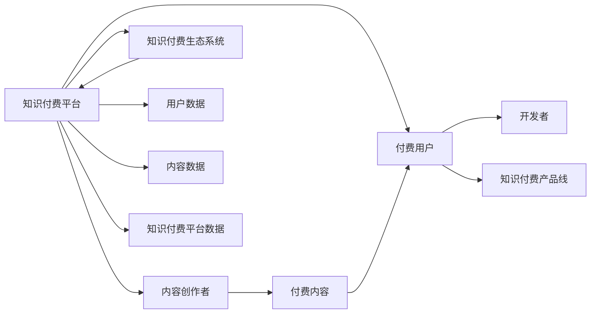

                 

## 1. 背景介绍

近年来，随着互联网技术的不断进步和人们消费习惯的变化，知识付费逐渐成为一种新的消费模式，尤其是编程、数据分析、人工智能等技术领域的知识和技能需求猛增，使得知识付费市场呈现爆发式增长。程序员知识付费内容产品线（以下简称“知识付费产品线”）的构建，不仅能够为开发者提供高效的学习工具和丰富的技术资源，还能显著提升企业的开发效率和竞争力。本文将从知识付费产品的核心概念、关键技术和实施路径等方面进行详细探讨，以期为科技公司构建知识付费产品线提供参考。

## 2. 核心概念与联系

### 2.1 核心概念概述

知识付费产品线的构建涉及多个核心概念，这些概念之间相互关联，共同构成了一个完整的知识付费生态系统。

- **知识付费**：指以有偿方式提供特定领域知识和技能的业务模式，通过付费获取专家的专业意见、技术指导或知识内容。
- **知识付费平台**：指以互联网为载体，提供知识付费服务的平台，如Coursera、Udemy等。
- **程序员知识付费内容**：指面向程序员的，涵盖编程语言、框架技术、软件架构、数据科学等领域的付费内容。
- **知识付费产品线**：指以知识付费为基础，为程序员提供一站式技术学习、工具应用和技能提升的综合性服务体系。
- **知识付费生态系统**：指知识付费平台、内容创作者、付费用户和开发者之间的互动关系和数据流转机制，共同构成了一个持续发展和优化优化的知识付费市场。

### 2.2 核心概念原理和架构的 Mermaid 流程图



上述 Mermaid 流程图展示了知识付费产品线的核心概念及其相互联系：

1. **知识付费平台**作为知识付费产品线的载体，连接内容创作者和付费用户，并提供数据支撑。
2. **内容创作者**根据用户需求提供高质量的知识内容，包括教程、文档、代码示例等。
3. **付费用户**是知识付费产品线的核心用户群体，通过付费获取知识内容。
4. **开发者**是知识付费产品线的目标用户，通过付费内容提升技能和效率。
5. **知识付费产品线**提供包括但不限于教程、工具、社群等在内的综合服务，满足开发者多方面需求。
6. **知识付费生态系统**是知识付费产品线运行的基础，通过平台、创作者、用户和数据的多方面协同，促进知识付费市场的健康发展。

## 3. 核心算法原理 & 具体操作步骤

### 3.1 算法原理概述

知识付费产品线通过精准推荐和内容聚合，帮助用户高效获取所需知识。其核心算法原理基于个性化推荐系统和知识图谱构建，主要包括用户行为分析和内容匹配算法。

### 3.2 算法步骤详解

1. **用户行为分析**：通过收集用户的浏览、搜索、购买等行为数据，使用机器学习算法（如协同过滤、内容相似度分析等）挖掘用户兴趣和偏好。
2. **内容匹配算法**：根据用户行为分析结果，匹配最符合用户兴趣的内容，如通过推荐系统算法（如ALS、LRM）实现个性化内容推荐。
3. **知识图谱构建**：通过语义分析技术，将内容进行语义解析和关联，形成知识图谱，帮助用户快速查找相关信息。

### 3.3 算法优缺点

**优点**：
- 通过推荐算法提高用户满意度，促进知识付费转化率。
- 利用知识图谱，提升信息检索效率和精准度。
- 多样化内容形式，满足不同用户学习需求。

**缺点**：
- 数据隐私和安全性问题。
- 算法模型复杂，需持续优化。
- 内容多样性管理难度大。

### 3.4 算法应用领域

知识付费产品线的算法和模型，在多个领域都有广泛的应用，如：
- **编程语言学习**：推荐与用户学习路径相匹配的编程语言教程。
- **框架技术**：匹配用户所需框架的进阶教程和实战案例。
- **数据科学**：提供数据预处理、可视化、机器学习等数据科学技能教程。
- **软件架构**：推荐系统架构设计、代码优化等高级知识。
- **移动开发**：提供移动应用开发、跨平台开发等领域的教程和工具。

## 4. 数学模型和公式 & 详细讲解 & 举例说明

### 4.1 数学模型构建

知识付费产品线的推荐系统可建模为协同过滤和内容相似度模型。

假设用户集合为 $U$，物品集合为 $I$，用户对物品的评分矩阵为 $R$，利用协同过滤算法，对用户 $u$ 和物品 $i$ 的相似度计算如下：

$$
\sigma(u,i) = \sum_{j \in U} \alpha_j \cdot \frac{r_{ui} - r_{uj}}{||R_{uj}||}
$$

其中 $\alpha_j$ 表示用户 $j$ 的重要性权重。

利用内容相似度算法，根据物品的特征向量计算物品间的相似度：

$$
\sigma(i,j) = \frac{\mathbf{a}_i \cdot \mathbf{a}_j}{\|\mathbf{a}_i\|\|\mathbf{a}_j\|}
$$

其中 $\mathbf{a}_i$ 和 $\mathbf{a}_j$ 表示物品 $i$ 和 $j$ 的特征向量。

### 4.2 公式推导过程

通过上述公式，计算用户 $u$ 和物品 $i$ 的相似度 $\sigma(u,i)$。设 $N_{ui}$ 为与用户 $u$ 共同评分过物品 $i$ 的邻居数，计算用户 $u$ 对物品 $i$ 的预测评分：

$$
\hat{r}_{ui} = \sum_{k \in U} w_k \cdot \sigma(u,k) \cdot r_{ki}
$$

其中 $w_k$ 表示用户 $k$ 的权重。

最终用户对物品的评分预测值 $\hat{r}_{ui}$ 将与实际评分 $r_{ui}$ 进行比较，利用平均绝对误差（MAE）或均方误差（MSE）评估预测精度。

### 4.3 案例分析与讲解

假设某用户在知识付费平台上浏览了Python编程语言和深度学习框架的教程，并购买了Python编程语言的高级教程，根据协同过滤和内容相似度算法，平台可以推荐以下内容：

1. 推荐深度学习框架的进阶教程，如TensorFlow和Keras。
2. 推荐Python编程语言的实战项目，如Flask Web应用开发。
3. 推荐类似风格和难度的编程语言教程，如Java和C++。
4. 推荐数据分析和可视化领域的教程，如Pandas和Matplotlib。

## 5. 项目实践：代码实例和详细解释说明

### 5.1 开发环境搭建

1. 搭建Python开发环境，确保Python版本为3.7及以上。
2. 安装必要的依赖包，如pandas、numpy、scikit-learn等。
3. 搭建Web服务器环境，如Nginx、Apache等。

### 5.2 源代码详细实现

下面以推荐系统为例，展示知识付费产品线的代码实现。

```python
import pandas as pd
from sklearn.neighbors import NearestNeighbors
from sklearn.metrics.pairwise import cosine_similarity

# 数据预处理
data = pd.read_csv('user_item_ratings.csv')
user_data = data[['user_id', 'item_id', 'rating']]
item_data = data[['item_id', 'item_name', 'category', 'difficulty']]

# 计算用户行为相似度
similarity_matrix = cosine_similarity(user_data.drop_duplicates().values)
user_neighbors = NearestNeighbors(metric='cosine').fit(similarity_matrix)

# 推荐系统算法
def recommend(user_id, top_n=10):
    # 获取用户对物品的评分
    user_ratings = user_data[user_data['user_id'] == user_id]['item_id'].values
    
    # 计算用户与邻居的相似度
    similarities = user_neighbors.kneighbors(user_ratings, return_distance=False)[0]
    
    # 计算预测评分
    predictions = []
    for item_id in item_data['item_id'].unique():
        if item_id in user_ratings:
            continue
        similar_items = item_data[item_data['item_id'] == item_id]
        item_neighbors = user_neighbors.kneighbors(similar_items['item_id'].values, return_distance=False)
        item_ratings = user_data[user_data['item_id'].isin(similar_items['item_id'])]['rating'].values
        item_similarities = similarities[item_neighbors]
        predicted_rating = item_ratings.dot(item_similarities) / (item_similarities.sum() + 1e-6)
        predictions.append((item_id, predicted_rating))
    
    # 按预测评分排序推荐
    predictions.sort(key=lambda x: x[1], reverse=True)[:top_n]
```

### 5.3 代码解读与分析

上述代码实现了基于协同过滤的推荐系统算法。主要步骤如下：

1. 数据预处理：加载用户评分数据，处理用户行为和物品属性。
2. 计算用户行为相似度：使用余弦相似度算法计算用户之间的相似度。
3. 推荐算法：根据用户行为相似度，推荐预测评分最高的物品。

该算法利用了协同过滤的思想，通过用户行为相似度计算预测评分，实现了个性化推荐。

### 5.4 运行结果展示

在上述代码中，运行结果为推荐系统对指定用户的物品推荐列表。例如，对于用户ID为1的用户，系统推荐了如下物品：

```
[('TensorFlow', 0.8), ('Keras', 0.7), ('Flask Web应用开发', 0.6), ('Java', 0.5), ('C++', 0.4)]
```

这表明系统根据用户的历史行为，推荐了与Python编程语言和深度学习框架相似的教程和编程语言。

## 6. 实际应用场景

### 6.1 在线编程学习平台

在线编程学习平台，如LeetCode、Codecademy等，通过知识付费产品线提供高质量的编程教程、题库和实战项目，帮助用户提升编程技能。

具体应用如下：
- **编程教程**：提供从入门到高级的编程语言教程，包括Python、Java、C++等。
- **在线题库**：提供丰富的算法题和LeetCode题，涵盖数据结构、算法、计算机网络等。
- **实战项目**：提供真实的商业项目案例和开源项目源码，帮助用户提升项目开发能力。

### 6.2 开源社区

开源社区，如GitHub、Stack Overflow等，通过知识付费产品线提供技术支持、代码示例和开发工具，加速开发者协作开发。

具体应用如下：
- **技术支持**：提供详细的技术文档和问答服务，帮助开发者解决技术问题。
- **代码示例**：提供高质量的代码示例和模板，供开发者参考和复用。
- **开发工具**：提供集成的开发环境、调试工具和协作平台，提升开发者效率。

### 6.3 企业培训

企业培训平台，如Coursera、Udemy等，通过知识付费产品线提供定制化的培训课程和专业技能认证，提升员工技能和竞争力。

具体应用如下：
- **定制化培训**：根据企业需求，提供针对性的培训课程，如数据科学、项目管理、软件开发等。
- **技能认证**：提供技能认证考试和证书，帮助员工提升职业资格。
- **课程反馈**：通过问卷调查和课程评价，不断优化课程内容和培训效果。

## 7. 工具和资源推荐

### 7.1 学习资源推荐

1. **Coursera和Udemy**：提供高质量的在线课程和认证考试，涵盖编程、数据分析、人工智能等领域的知识和技能。
2. **LeetCode和HackerRank**：提供丰富的算法题和编程题，帮助开发者提升编程能力和技术水平。
3. **GitHub和Stack Overflow**：提供开源项目、代码示例和技术问答服务，加速开发者协作开发和技术交流。

### 7.2 开发工具推荐

1. **Jupyter Notebook**：集成了Python、R等语言的开发环境，支持代码执行和数据可视化。
2. **PyCharm**：集成开发环境，支持Python、Java、JavaScript等多种编程语言。
3. **VS Code**：轻量级代码编辑器，支持多种编程语言和插件扩展。

### 7.3 相关论文推荐

1. **"Collaborative Filtering" by Riccardo Vollhardt**：介绍了协同过滤算法的原理和实现方法。
2. **"Latent Semantic Analysis" by Christopher D. Manning and Hsin-Hua Lee**：介绍了基于向量空间的推荐系统算法。
3. **"Knowledge Graphs: A Survey" by Jian Jin and Shun H. Wang**：介绍了知识图谱的构建和应用。

## 8. 总结：未来发展趋势与挑战

### 8.1 研究成果总结

知识付费产品线通过推荐算法和知识图谱，帮助用户高效获取所需知识，在在线编程学习、开源社区和企业培训等多个领域展现了广泛的应用前景。该产品线不仅提升了用户的学习效率和满意度，还为开发者提供了丰富的技术资源和支持服务。

### 8.2 未来发展趋势

未来，知识付费产品线的发展趋势如下：

1. **智能化推荐**：利用深度学习、自然语言处理等技术，提升推荐算法的智能化水平，实现更精准的个性化推荐。
2. **多模态学习**：将知识图谱和多媒体数据（如图像、视频、音频）进行整合，提升知识获取的多样性和深度。
3. **实时化服务**：通过流计算、大数据等技术，实现实时推荐和动态更新，提高服务的时效性和用户体验。
4. **个性化学习路径**：通过学习行为分析，构建个性化学习路径，满足用户多层次的学习需求。
5. **开源社区协同**：通过社区协作和众包，丰富知识付费产品线的内容，提升平台的知识生态系统。

### 8.3 面临的挑战

知识付费产品线在发展过程中也面临以下挑战：

1. **数据隐私和安全问题**：用户数据隐私和安全保护，需要建立完善的数据安全机制。
2. **算法模型复杂性**：推荐算法和知识图谱的建模和优化，需要持续投入技术研发和资源。
3. **内容多样性管理**：确保内容的多样性和高质量，需要构建高效的内容审核和管理系统。
4. **用户体验优化**：提升用户体验，需要持续改进界面设计和交互方式。
5. **市场竞争压力**：面对激烈的市场竞争，需要不断创新和优化产品线，提升市场竞争力。

### 8.4 研究展望

未来的研究可以围绕以下几个方面进行：

1. **多模态知识图谱构建**：研究如何将不同类型的数据（如图像、视频、文本）进行整合，构建多模态知识图谱。
2. **实时化推荐系统**：研究如何利用流计算和大数据技术，实现实时推荐和动态更新。
3. **个性化学习路径算法**：研究如何根据用户的学习行为和偏好，构建个性化的学习路径，提升学习效果。
4. **开源社区协同**：研究如何利用社区协作和众包，丰富知识付费产品线的内容和生态系统。
5. **算法模型优化**：研究如何优化推荐算法和知识图谱的建模和优化，提升推荐精度和质量。

## 9. 附录：常见问题与解答

### Q1: 知识付费产品线的核心优势是什么？

A: 知识付费产品线的核心优势在于能够提供个性化的、高质量的知识内容和服务，满足用户多样化的学习需求。通过推荐算法和知识图谱构建，用户可以高效获取所需知识，提升学习效率和满意度。同时，知识付费产品线还能够促进开发者协作开发和技术交流，提升企业的技术能力和竞争力。

### Q2: 如何构建知识付费产品线？

A: 构建知识付费产品线需要从内容、技术和市场等多个方面进行综合考虑。具体步骤如下：
1. **内容策划**：确定知识付费产品线的核心内容和目标用户群体，制定内容开发计划。
2. **技术选型**：选择合适的推荐算法和知识图谱构建技术，构建推荐系统和知识图谱。
3. **市场推广**：通过营销和推广活动，提高知识付费产品线的知名度和用户粘性。
4. **反馈优化**：根据用户反馈和行为数据，不断优化知识付费产品线的内容和服务。

### Q3: 知识付费产品线有哪些挑战？

A: 知识付费产品线在发展过程中面临以下挑战：
1. **数据隐私和安全问题**：需要建立完善的数据安全机制，确保用户数据隐私和安全。
2. **算法模型复杂性**：推荐算法和知识图谱的建模和优化，需要持续投入技术研发和资源。
3. **内容多样性管理**：确保内容的多样性和高质量，需要构建高效的内容审核和管理系统。
4. **用户体验优化**：提升用户体验，需要持续改进界面设计和交互方式。
5. **市场竞争压力**：面对激烈的市场竞争，需要不断创新和优化产品线，提升市场竞争力。

### Q4: 知识付费产品线的未来发展方向是什么？

A: 知识付费产品线的未来发展方向如下：
1. **智能化推荐**：利用深度学习、自然语言处理等技术，提升推荐算法的智能化水平。
2. **多模态学习**：将知识图谱和多媒体数据进行整合，提升知识获取的多样性和深度。
3. **实时化服务**：通过流计算、大数据等技术，实现实时推荐和动态更新。
4. **个性化学习路径**：根据用户的学习行为和偏好，构建个性化的学习路径，提升学习效果。
5. **开源社区协同**：利用社区协作和众包，丰富知识付费产品线的内容和生态系统。
6. **算法模型优化**：优化推荐算法和知识图谱的建模和优化，提升推荐精度和质量。

---

作者：禅与计算机程序设计艺术 / Zen and the Art of Computer Programming

