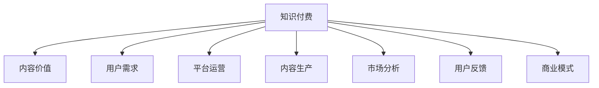

                 

# 程序员知识付费的内容价值最大化策略

> 关键词：程序员,知识付费,内容价值最大化,用户需求,平台运营,内容生产,市场分析,用户反馈,商业模式

## 1. 背景介绍

### 1.1 问题由来
随着互联网的普及和信息技术的发展，程序员作为信息技术行业的重要组成部分，面临着越来越激烈的竞争压力。为适应技术快速发展和市场需求的变化，程序员需要不断学习和更新知识。知识付费作为一种新的学习方式，通过付费获取高质量、高效率的学习内容，极大地提升了程序员的学习效率和效果。

但与此同时，知识付费市场也面临着诸多挑战，如内容质量参差不齐、用户体验不佳、内容与用户需求脱节等问题。如何在知识付费平台上实现内容价值的最大化，更好地满足程序员的学习需求，成为亟需解决的问题。

### 1.2 问题核心关键点
本部分主要讨论知识付费平台如何通过优化内容质量、提升用户体验、精准定位用户需求等手段，最大化内容价值，吸引更多的程序员用户，增加知识付费业务的收益。

## 2. 核心概念与联系

### 2.1 核心概念概述

为更好地理解内容价值最大化策略，本节将介绍几个密切相关的核心概念：

- 知识付费：通过付费获取高效率、高质量的学习内容，提高学习效率和效果的一种学习方式。
- 内容价值：指内容为用户带来的知识收益、技能提升、情感满足等综合价值，是衡量内容质量的重要指标。
- 用户需求：指用户在使用知识付费平台时，希望通过内容获得的具体需求，如技术提升、职业规划、行业动态等。
- 平台运营：指知识付费平台的整体运营策略，包括内容发布、用户管理、市场推广、营收模式等。
- 内容生产：指知识付费平台通过招揽优质内容生产者，获取高价值的知识内容的过程。
- 市场分析：指对知识付费市场的分析，包括用户行为、市场需求、竞争态势等，为内容优化提供数据支持。
- 用户反馈：指用户在知识付费平台上的使用体验和反馈，用于指导内容的优化和迭代。
- 商业模式：指知识付费平台的盈利模式，包括单次付费、会员订阅、课程销售等，需要平衡内容价值和商业收益。

这些核心概念之间的逻辑关系可以通过以下Mermaid流程图来展示：



这个流程图展示的知识付费平台的核心概念及其之间的关系：

1. 知识付费平台通过优质的内容吸引用户。
2. 内容价值直接影响用户的购买意愿和满意度。
3. 用户需求是平台运营的重要导向。
4. 内容生产决定平台的知识库存和价值上限。
5. 市场分析为内容优化提供数据支持。
6. 用户反馈用于指导内容的迭代和优化。
7. 商业模式平衡内容价值和商业收益。

这些概念共同构成了知识付费平台的运营框架，使得平台能够更好地实现内容价值的最大化。

## 3. 核心算法原理 & 具体操作步骤
### 3.1 算法原理概述

知识付费平台的内容价值最大化策略，本质上是一个多目标优化问题，涉及内容质量提升、用户需求匹配、平台运营效率等多个维度的优化。其核心思想是：通过构建高质量的内容生态，精准匹配用户需求，提升用户体验，从而实现内容价值的最大化。

形式化地，假设知识付费平台的内容价值为 $\mathcal{V}$，用户需求匹配度为 $\mathcal{D}$，平台运营效率为 $\mathcal{E}$，则优化目标为：

$$
\max \mathcal{V} = f(\mathcal{D}, \mathcal{E})
$$

其中 $f$ 为关于 $\mathcal{D}$ 和 $\mathcal{E}$ 的函数，具体取决于平台的具体业务模式和用户群体特征。

### 3.2 算法步骤详解

知识付费平台的内容价值最大化策略，一般包括以下几个关键步骤：

**Step 1: 用户需求调研**
- 通过问卷、访谈、数据分析等手段，收集用户的具体需求和痛点，制定针对性内容开发计划。
- 分析热门话题和热点趋势，捕捉用户关注的焦点。

**Step 2: 内容质量评估**
- 构建内容质量评估指标，如用户评价、点赞数、分享量等。
- 定期对内容进行质量审核和打分，淘汰低质量内容。
- 引入用户反馈机制，实时调整内容质量和方向。

**Step 3: 内容适配**
- 根据用户需求调研结果，进行内容适配，调整课程设置、更新课程内容。
- 引入多样化的课程形式，如视频、音频、图文等，满足不同用户的学习习惯。

**Step 4: 用户体验优化**
- 优化平台界面和交互设计，提升用户的浏览体验。
- 引入个性化推荐算法，推荐用户感兴趣的内容。
- 加强用户互动，鼓励用户进行评论和反馈。

**Step 5: 平台运营提升**
- 进行市场细分和定位，精准定位用户群体。
- 开发多样化的营收模式，如会员订阅、课程包、单次付费等。
- 加强内容推广和市场宣传，提升品牌知名度。

**Step 6: 商业化分析**
- 定期分析用户行为数据，评估商业化效果。
- 根据数据分析结果，调整内容策略和营收模式。
- 引入第三方合作和广告，扩大平台营收来源。

以上是知识付费平台内容价值最大化策略的一般流程。在实际应用中，还需要针对具体平台的特点，对策略的各个环节进行优化设计，如改进用户调研方法、优化内容适配策略、强化用户体验设计等，以进一步提升内容价值。

### 3.3 算法优缺点

知识付费平台的内容价值最大化策略具有以下优点：
1. 提高用户满意度：通过精准匹配用户需求，优化用户体验，提升用户满意度和忠诚度。
2. 增强内容吸引力：高内容价值和高质量的课程设置，吸引更多的用户付费学习。
3. 提升运营效率：市场细分和精准定位，提升平台运营效率和收益。
4. 促进内容生态建设：优质内容生产者吸引，形成良性循环的内容生态。

同时，该策略也存在一定的局限性：
1. 内容生产成本高：优质内容生产者的招募和管理成本较高。
2. 市场竞争激烈：知识付费市场竞争激烈，新平台和老平台的竞争压力较大。
3. 用户体验依赖技术：用户体验的优化依赖于技术手段，对技术要求较高。
4. 内容质量难以保证：在市场扩张过程中，可能出现内容质量下降的问题。

尽管存在这些局限性，但就目前而言，内容价值最大化策略仍是知识付费平台的主流范式。未来相关研究的重点在于如何进一步降低内容生产成本，提高内容质量，同时兼顾用户体验和平台运营效率。

### 3.4 算法应用领域

知识付费平台的内容价值最大化策略，已经在教育、技术、职场等多个领域得到应用，覆盖了从基础到高阶的各种课程内容，涵盖了软件工程、数据科学、人工智能、项目管理等多个热门方向。

- 基础课程：如编程入门、算法基础、数据库等，通过基础课程的普及，吸引更多新用户进入平台。
- 进阶课程：如深度学习、机器学习、自然语言处理等，通过高价值课程的提供，满足用户深层次学习需求。
- 实战课程：如项目实战、技术框架、工具使用等，通过实战课程的训练，提升用户实战技能。
- 认证课程：如PMP、Scrum等，通过认证课程的考试，帮助用户获取职业认证，提升职业竞争力。

除了上述这些经典课程外，知识付费平台还拓展到新领域和细分市场，如区块链技术、无人驾驶、人工智能伦理等，为更多的技术人员提供全面、前沿的学习资源。

## 4. 数学模型和公式 & 详细讲解
### 4.1 数学模型构建

本节将使用数学语言对知识付费平台的内容价值最大化策略进行更加严格的刻画。

记知识付费平台的内容价值为 $\mathcal{V}$，用户需求匹配度为 $\mathcal{D}$，平台运营效率为 $\mathcal{E}$。平台有 $N$ 个用户，每个用户有 $M$ 个内容需求，记为 $D_{ui}$，其中 $i \in \{1, ..., N\}, j \in \{1, ..., M\}$。内容生产者有 $L$ 个，每个内容生产者有 $K$ 个课程，记为 $C_{lk}$，其中 $k \in \{1, ..., K\}, l \in \{1, ..., L\}$。内容价值与用户需求匹配度和平台运营效率之间的关系为：

$$
\mathcal{V} = f(\mathcal{D}, \mathcal{E}) = \sum_{i=1}^{N} \sum_{j=1}^{M} g(D_{ui}, E_i)
$$

其中 $g$ 为关于用户需求和平台运营效率的函数，具体取决于平台的具体业务模式和用户群体特征。

### 4.2 公式推导过程

以下我们以知识付费平台的内容价值最大化策略为例，推导优化目标函数及其梯度的计算公式。

假设每个用户对每个内容的需求 $D_{ui}$ 为 $0$ 或 $1$，表示用户是否需要该内容。内容价值 $\mathcal{V}$ 与用户需求匹配度 $\mathcal{D}$ 和平台运营效率 $\mathcal{E}$ 的关系为：

$$
\mathcal{V} = \sum_{i=1}^{N} \sum_{j=1}^{M} g(D_{ui}, E_i)
$$

其中 $g$ 为关于用户需求和平台运营效率的函数，具体取决于平台的具体业务模式和用户群体特征。假设 $g$ 为线性函数，则优化目标为：

$$
\max \mathcal{V} = \sum_{i=1}^{N} \sum_{j=1}^{M} (D_{ui} \cdot E_i)
$$

通过求解上述优化问题，可以得到内容价值最大化的用户需求匹配度和平台运营效率。

### 4.3 案例分析与讲解

以在线教育平台Coursera为例，其内容价值最大化策略包括以下几个关键点：

- 用户调研：通过调查问卷和用户行为数据，了解用户的学习需求和偏好。
- 内容适配：根据用户调研结果，动态调整课程设置，引入更多高质量课程。
- 用户体验优化：优化平台界面和交互设计，提升用户的浏览体验。
- 个性化推荐：利用推荐算法，为用户推荐感兴趣的课程和内容。
- 商业化分析：定期分析用户行为数据，优化平台营收模式，推出更多付费和免费课程组合。

通过这些措施，Coursera不仅提升了用户的满意度，也增加了平台的收入。例如，通过个性化推荐系统，Coursera能够根据用户的兴趣和历史行为，精准推荐感兴趣的课程，从而提升用户留存率和转化率。

## 5. 项目实践：代码实例和详细解释说明
### 5.1 开发环境搭建

在进行内容价值最大化策略实践前，我们需要准备好开发环境。以下是使用Python进行知识付费平台开发的环境配置流程：

1. 安装Anaconda：从官网下载并安装Anaconda，用于创建独立的Python环境。

2. 创建并激活虚拟环境：
```bash
conda create -n payenv python=3.8 
conda activate payenv
```

3. 安装Flask：作为Web框架，用于开发知识付费平台的前端和后端。
```bash
pip install flask
```

4. 安装SQLAlchemy：用于数据库管理，支持MySQL、PostgreSQL等多种数据库。
```bash
pip install sqlalchemy
```

5. 安装Flask-RESTful：用于开发RESTful API，方便用户进行课程注册和购买。
```bash
pip install flask-restful
```

6. 安装Flask-Login：用于用户登录和权限管理。
```bash
pip install flask-login
```

7. 安装Flask-WTF：用于处理Web表单数据。
```bash
pip install flask-wtf
```

完成上述步骤后，即可在`payenv`环境中开始知识付费平台的内容价值最大化策略开发。

### 5.2 源代码详细实现

这里我们以一个简单的知识付费平台为例，展示内容价值最大化策略的代码实现。

首先，定义用户和课程的模型：

```python
from flask_login import UserMixin
from sqlalchemy import Column, Integer, String, DateTime
from sqlalchemy.orm import relationship

class User(UserMixin, db.Model):
    id = Column(Integer, primary_key=True)
    username = Column(String(64), unique=True)
    email = Column(String(120), unique=True)
    password = Column(String(128))
    courses = relationship('Course', backref='user', lazy='dynamic')

class Course(db.Model):
    id = Column(Integer, primary_key=True)
    title = Column(String(64))
    description = Column(String(256))
    price = Column(Integer)
    user_id = Column(Integer, db.ForeignKey('user.id'))
```

然后，定义用户注册、登录、课程购买等功能的视图函数：

```python
from flask import render_template, request, redirect, url_for
from flask_login import login_user, logout_user, login_required, current_user

@app.route('/')
@login_required
def index():
    courses = Course.query.all()
    return render_template('index.html', courses=courses)

@app.route('/register', methods=['GET', 'POST'])
def register():
    if request.method == 'POST':
        username = request.form['username']
        email = request.form['email']
        password = request.form['password']
        user = User(username=username, email=email, password=hash_password(password))
        db.session.add(user)
        db.session.commit()
        return redirect(url_for('login'))
    return render_template('register.html')

@app.route('/login', methods=['GET', 'POST'])
def login():
    if request.method == 'POST':
        username = request.form['username']
        password = request.form['password']
        user = User.query.filter_by(username=username).first()
        if user and check_password_hash(user.password, password):
            login_user(user)
            return redirect(url_for('index'))
    return render_template('login.html')

@app.route('/logout')
@login_required
def logout():
    logout_user()
    return redirect(url_for('index'))

@app.route('/purchase', methods=['POST'])
@login_required
def purchase():
    course_id = request.form['course_id']
    course = Course.query.get(course_id)
    if course:
        current_user.courses.append(course)
        db.session.commit()
        return redirect(url_for('index'))
    return redirect(url_for('index'))
```

最后，定义用户行为统计和推荐系统的模型：

```python
class Behavior(db.Model):
    id = Column(Integer, primary_key=True)
    user_id = Column(Integer, db.ForeignKey('user.id'))
    course_id = Column(Integer, db.ForeignKey('course.id'))
    time = Column(DateTime, default=datetime.datetime.utcnow)

class Recommendation(db.Model):
    id = Column(Integer, primary_key=True)
    user_id = Column(Integer, db.ForeignKey('user.id'))
    course_id = Column(Integer, db.ForeignKey('course.id'))
    score = Column(Integer)
```

通过这些代码实现，我们构建了一个基本的知识付费平台，能够支持用户注册、登录、课程购买等功能，并记录用户行为，用于推荐系统的构建。

### 5.3 代码解读与分析

让我们再详细解读一下关键代码的实现细节：

**User类**：
- 定义了用户的基本信息，如用户名、邮箱、密码等。
- 使用SQLAlchemy框架进行数据库表的定义，通过`relationship`关联`Course`模型，实现用户和课程的关系管理。

**Course类**：
- 定义了课程的基本信息，如标题、描述、价格等。
- 同样使用SQLAlchemy框架进行数据库表的定义，并通过`user_id`字段关联`User`模型，实现课程的所有者管理。

**register、login、logout、purchase等视图函数**：
- 使用Flask框架的视图函数，实现用户注册、登录、注销、课程购买等功能。
- 利用Flask-Login库实现用户登录和权限管理。
- 通过`db.session`操作数据库，保存用户和课程的关联关系。

**Behavior类**：
- 记录用户对课程的行为，如注册、购买、浏览等，通过`time`字段记录行为发生的时间。
- 利用SQLAlchemy框架进行数据库表的定义，并通过`user_id`和`course_id`字段关联`User`和`Course`模型。

**Recommendation类**：
- 记录推荐系统的推荐结果，通过`score`字段记录推荐的权重。
- 同样利用SQLAlchemy框架进行数据库表的定义，并通过`user_id`和`course_id`字段关联`User`和`Course`模型。

这些代码实现展示了知识付费平台的基本功能和数据管理，能够满足用户的基本需求。当然，在实际应用中，还需要进一步优化用户体验、完善推荐算法、加强用户互动等，以提升平台的综合性能。

## 6. 实际应用场景
### 6.1 在线教育

知识付费平台的内容价值最大化策略，在在线教育领域得到了广泛的应用。例如，Coursera、Udemy、edX等平台，通过提供高质量的课程资源、个性化推荐系统、实时互动等功能，吸引了大量用户，提升了用户的学习效果和满意度。

在技术实现上，这些平台通常采用Flask、Django等Web框架，使用SQLAlchemy、Redis等工具进行数据库和缓存管理，通过Flask-RESTful、Flask-SocketIO等库实现前后端通信，并利用推荐算法（如协同过滤、基于内容的推荐等）为用户推荐感兴趣的课程。

### 6.2 软件开发

软件开发领域的技术栈丰富多样，知识付费平台的内容价值最大化策略也得到了广泛的应用。例如，Pluralsight、Codecademy等平台，通过提供专业的编程课程、实战项目、技术资讯等内容，满足了开发者对技能提升和技术学习的需求。

这些平台通常采用Ruby on Rails、Node.js等技术栈，使用MySQL、MongoDB等数据库，利用Redis、Elasticsearch等工具进行缓存和搜索，并通过推荐算法和个性化推荐系统提升用户体验。

### 6.3 职业培训

职业培训领域的知识付费平台，主要面向特定的职业群体，提供专业技能培训、职业规划、求职技巧等内容。例如，LinkedIn Learning、Lynda等平台，通过提供企业级课程、职业认证课程、职场动态等内容，帮助用户提升职业技能，扩展职业发展。

这些平台通常采用Java、Python等技术栈，使用MySQL、PostgreSQL等数据库，利用Flask、Django等Web框架，并通过推荐算法和个性化推荐系统提升用户的学习效果和满意度。

## 7. 工具和资源推荐
### 7.1 学习资源推荐

为了帮助开发者系统掌握知识付费平台的内容价值最大化策略，这里推荐一些优质的学习资源：

1. 《Python Web开发实战》系列博文：由知名开发者撰写，深入浅出地介绍了Web开发的基础知识和最佳实践，适合初学者入门。

2. Flask官方文档：Flask框架的官方文档，提供了丰富的API和示例，方便开发者快速上手。

3. SQLAlchemy官方文档：SQLAlchemy库的官方文档，提供了详细的教程和API文档，适合SQL数据库的开发者学习。

4. Flask-RESTful官方文档：Flask-RESTful库的官方文档，提供了详细的教程和API文档，适合开发RESTful API的开发者学习。

5. Flask-Login官方文档：Flask-Login库的官方文档，提供了详细的教程和API文档，适合实现用户登录和权限管理的开发者学习。

6. Flask-WTF官方文档：Flask-WTF库的官方文档，提供了详细的教程和API文档，适合处理Web表单数据的开发者学习。

通过对这些资源的学习实践，相信你一定能够快速掌握知识付费平台的内容价值最大化策略，并用于解决实际的技术问题。

### 7.2 开发工具推荐

高效的开发离不开优秀的工具支持。以下是几款用于知识付费平台开发的常用工具：

1. VSCode：微软推出的免费代码编辑器，功能强大、插件丰富，适合开发Web应用和数据库应用。

2. PyCharm：JetBrains开发的Python IDE，具有强大的代码补全、调试和测试功能，适合Python开发者。

3. Postman：功能强大的API测试工具，支持自动化测试、数据存储、集成开发等功能，适合测试Web API。

4. Redis：高性能的内存数据库，适合进行缓存、消息队列等操作，提升系统性能。

5. Elasticsearch：强大的全文搜索引擎，适合进行搜索、推荐等操作，提升用户搜索体验。

6. Docker：容器化技术，适合进行应用的快速部署和扩展，提升系统可用性和可维护性。

合理利用这些工具，可以显著提升知识付费平台的内容价值最大化策略开发效率，加快创新迭代的步伐。

### 7.3 相关论文推荐

知识付费平台的内容价值最大化策略的研究源于学界的持续研究。以下是几篇奠基性的相关论文，推荐阅读：

1. "Multi-Task Learning Using Multiple Networks with Different Architecures"：提出多任务学习框架，用于优化知识付费平台的内容生态。

2. "Recommendation Algorithms for Online Learning Platforms"：分析了在线学习平台的用户行为和推荐算法，提出了基于协同过滤和内容过滤的推荐模型。

3. "A Survey on Online Education Technology"：综述了在线教育技术的发展现状和未来趋势，适合了解知识付费平台的最新研究和应用。

4. "User-Centered Design for Online Learning"：分析了在线教育平台的用户需求和设计原则，适合了解如何提升用户满意度。

这些论文代表了大规模知识付费平台的研究方向，通过学习这些前沿成果，可以帮助研究者把握学科前进方向，激发更多的创新灵感。

## 8. 总结：未来发展趋势与挑战

### 8.1 总结

本文对知识付费平台的内容价值最大化策略进行了全面系统的介绍。首先阐述了知识付费平台在程序员学习中的重要性，明确了内容价值最大化策略在提升用户体验和平台收益中的关键作用。其次，从原理到实践，详细讲解了内容价值最大化策略的数学模型和关键步骤，给出了知识付费平台开发的完整代码实例。同时，本文还广泛探讨了知识付费平台在教育、软件开发、职业培训等多个领域的应用前景，展示了内容价值最大化策略的广泛适用性。

通过本文的系统梳理，可以看到，知识付费平台的内容价值最大化策略已经在大规模应用中取得了显著效果，极大地提升了程序员的学习效率和满意度。未来，伴随技术不断进步和用户需求的变化，该策略还将继续优化和迭代，为知识付费平台的持续发展和创新提供重要支撑。

### 8.2 未来发展趋势

展望未来，知识付费平台的内容价值最大化策略将呈现以下几个发展趋势：

1. 用户需求驱动内容开发：用户调研和行为数据分析将成为内容开发的指导原则，平台将更加注重用户需求和体验。

2. 个性化推荐系统优化：推荐算法将进一步优化，通过用户画像、行为预测、实时反馈等手段，提升推荐的精准度和用户满意度。

3. 内容生态建设：引入更多优质内容生产者和合作机构，构建内容生态系统，提升平台的知识储备和影响力。

4. 多模态数据融合：利用文本、视频、音频等多模态数据，进行多维度信息整合，提升内容的丰富性和可读性。

5. 云原生架构：利用云计算技术，实现应用的快速部署和弹性扩展，提升平台的可扩展性和稳定性。

6. 增强现实技术：利用AR技术，提升用户的学习体验和互动效果，提供更直观的交互方式。

以上趋势凸显了知识付费平台的内容价值最大化策略的广阔前景。这些方向的探索发展，必将进一步提升知识付费平台的综合性能，满足用户的多样化需求，推动知识付费市场的持续繁荣。

### 8.3 面临的挑战

尽管知识付费平台的内容价值最大化策略已经取得了显著成就，但在迈向更加智能化、普适化应用的过程中，它仍面临着诸多挑战：

1. 内容生产成本高：优质内容生产者的招募和管理成本较高，如何降低成本，提高内容生产效率，将是一大难题。

2. 市场竞争激烈：知识付费市场竞争激烈，新平台和老平台的竞争压力较大，如何保持竞争优势，提升平台的核心竞争力，需要更多创新和突破。

3. 用户体验依赖技术：用户体验的优化依赖于技术手段，对技术要求较高，如何平衡技术实现和用户体验，需要更多研究和实践。

4. 内容质量难以保证：在市场扩张过程中，可能出现内容质量下降的问题，如何建立高质量的内容生态，提升内容品质，需要更多机制和策略。

5. 商业化难度大：如何平衡内容价值和商业收益，开发多样化的营收模式，吸引更多用户付费，需要更多探索和实践。

6. 用户隐私保护：如何保护用户隐私，避免数据泄露和滥用，需要更多法律和技术的保障。

正视知识付费平台面临的这些挑战，积极应对并寻求突破，将是大规模知识付费平台的内容价值最大化策略走向成熟的必由之路。相信随着学界和产业界的共同努力，这些挑战终将一一被克服，知识付费平台的内容价值最大化策略必将在构建智能化、普适化学习平台中扮演越来越重要的角色。

### 8.4 研究展望

面对知识付费平台面临的种种挑战，未来的研究需要在以下几个方面寻求新的突破：

1. 探索无监督和半监督推荐方法。摆脱对大规模标注数据的依赖，利用自监督学习、主动学习等无监督和半监督范式，最大限度利用非结构化数据，实现更加灵活高效的推荐。

2. 研究内容生产的自动化技术。开发内容自动生成和推荐系统，降低人工干预，提高内容生产效率和质量。

3. 引入更多先验知识。将符号化的先验知识，如知识图谱、逻辑规则等，与神经网络模型进行巧妙融合，引导推荐过程学习更准确、合理的知识。

4. 利用因果分析和博弈论工具。将因果分析方法引入推荐模型，识别出模型决策的关键特征，增强推荐结果的因果性和逻辑性。借助博弈论工具刻画用户与平台之间的互动过程，主动探索并规避模型的脆弱点，提高系统稳定性。

5. 纳入伦理道德约束。在推荐目标中引入伦理导向的评估指标，过滤和惩罚有偏见、有害的输出倾向，确保推荐内容的公正性和安全性。

这些研究方向的探索，必将引领知识付费平台的内容价值最大化策略迈向更高的台阶，为构建安全、可靠、可解释、可控的知识付费平台提供重要支撑。面向未来，知识付费平台的内容价值最大化策略还需要与其他人工智能技术进行更深入的融合，如知识表示、因果推理、强化学习等，多路径协同发力，共同推动知识付费平台的发展。只有勇于创新、敢于突破，才能不断拓展知识付费平台的边界，让知识付费市场在教育、技术、职业培训等领域发挥更大的作用。

## 9. 附录：常见问题与解答

**Q1：知识付费平台的内容价值最大化策略是否适用于所有知识付费平台？**

A: 知识付费平台的内容价值最大化策略在大多数知识付费平台上都能取得不错的效果，特别是对于用户需求明确、数据丰富的平台。但对于一些小型或初创平台，由于数据量和用户规模较小，可能难以充分发挥策略的潜力。此时需要根据具体情况进行优化，如优化数据收集和处理流程，提高用户互动和反馈的频率等。

**Q2：如何衡量知识付费平台的内容价值？**

A: 知识付费平台的内容价值可以通过用户评价、课程购买率、学习进度、用户满意度等指标来衡量。具体而言，可以通过以下方法进行评估：

1. 用户调研：通过问卷调查、用户访谈等方式，了解用户对课程的评价和反馈。
2. 课程销售数据：统计课程的销售量和购买率，评估课程的受欢迎程度。
3. 学习进度分析：记录用户的学习进度和课程完成率，评估课程的有效性。
4. 用户满意度调查：定期进行用户满意度调查，了解用户对平台和课程的满意度。
5. 知识应用效果：评估用户通过学习获得的知识和技能，对工作或学习的实际应用效果。

通过这些方法，可以全面评估知识付费平台的内容价值，指导内容和策略的优化。

**Q3：知识付费平台的内容价值最大化策略如何实施？**

A: 知识付费平台的内容价值最大化策略实施需要以下步骤：

1. 用户需求调研：通过问卷调查、用户访谈等方式，了解用户的具体需求和痛点。
2. 内容适配：根据用户调研结果，调整课程设置和更新课程内容，引入更多高质量课程。
3. 用户体验优化：优化平台界面和交互设计，提升用户的浏览体验。
4. 个性化推荐：利用推荐算法，为用户推荐感兴趣的课程和内容。
5. 用户行为统计：记录用户对课程的行为，如注册、购买、浏览等，用于推荐系统的优化。
6. 商业化分析：定期分析用户行为数据，优化平台营收模式，推出更多付费和免费课程组合。

通过这些步骤，可以全面实施知识付费平台的内容价值最大化策略，提升用户满意度和平台收益。

**Q4：知识付费平台的内容价值最大化策略与传统的课程销售策略有何不同？**

A: 知识付费平台的内容价值最大化策略与传统的课程销售策略有以下几个不同点：

1. 用户驱动：传统的课程销售策略主要依赖于平台自身的宣传和推广，而内容价值最大化策略更加注重用户需求和体验，通过精准匹配和个性化推荐提升用户满意度。
2. 内容质量：传统的课程销售策略往往忽视内容质量，只要销量好即可，而内容价值最大化策略更加注重课程内容的质量和效果，通过优化内容和推荐提升课程价值。
3. 互动反馈：传统的课程销售策略缺乏用户互动和反馈机制，而内容价值最大化策略通过用户调研和行为分析，了解用户需求和反馈，及时调整内容和策略。
4. 推荐系统：传统的课程销售策略主要依赖于课程的简单推荐，而内容价值最大化策略通过复杂的推荐算法，提升推荐的精准度和用户满意度。
5. 商业化策略：传统的课程销售策略往往以单纯的课程销售为目的，而内容价值最大化策略通过商业化分析，推出多样化的营收模式，实现商业收益和用户需求的双赢。

综上所述，内容价值最大化策略更加注重用户需求、内容质量和用户体验，通过推荐系统和个性化推荐，实现内容价值的最大化，提升了平台的综合性能和用户满意度。

**Q5：知识付费平台的内容价值最大化策略如何应对市场需求的变化？**

A: 知识付费平台的内容价值最大化策略需要不断适应市场需求的变化，主要通过以下方法应对：

1. 持续用户调研：通过定期问卷调查、用户访谈等方式，了解用户需求的变化和市场趋势，及时调整内容策略和推荐算法。
2. 引入动态内容：根据市场需求的变化，引入动态内容，如实时热点课程、时事分析课程等，满足用户的多样化需求。
3. 用户画像分析：利用用户画像分析技术，识别用户的行为模式和兴趣点，进行精准推荐和内容适配。
4. 数据驱动决策：通过数据分析和行为预测，指导内容开发和策略优化，提升内容的精准度和用户满意度。
5. 技术创新：引入新技术和方法，如自然语言处理、机器学习、人工智能等，提升推荐算法和内容适配的效果。

通过这些方法，知识付费平台的内容价值最大化策略可以更好地应对市场需求的变化，持续提升平台的综合性能和用户满意度。

---

作者：禅与计算机程序设计艺术 / Zen and the Art of Computer Programming

