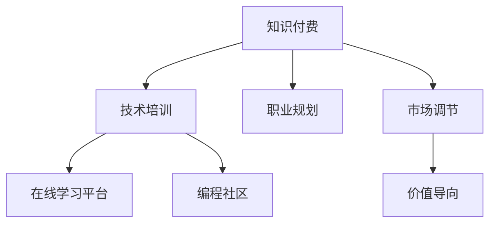

                 

# 程序员知识付费：从入门到精通

> 关键词：程序员知识付费, 技术学习, 职业规划, 软件开发, 编程技能提升

## 1. 背景介绍

### 1.1 问题由来
随着互联网和信息技术的飞速发展，程序员成为了信息时代的重要力量。然而，技术的快速迭代和更新也让许多程序员面临着持续学习和适应新技术的压力。在这样的背景下，知识付费应运而生，成为了程序员获取新技术、提升技能的重要途径。

知识付费的本质是通过付费的方式，为程序员提供高质量的学习资源和培训服务，帮助他们更高效地掌握新技能，提升职业竞争力。这对于提升程序员的职业发展，加速技术创新和应用具有重要意义。

### 1.2 问题核心关键点
知识付费的核心关键点包括：

- **资源稀缺性**：高质量的编程技术资料和培训资源通常以付费方式提供，体现了资源的稀缺性。
- **高效学习**：通过付费的方式，程序员可以获取针对性、系统化的学习资源，加速技能提升。
- **职业发展**：付费知识是程序员职业成长的重要支持，帮助他们在职场中保持竞争力。
- **价值导向**：知识付费机制以价值为导向，强调付费获取高质量资源的价值，而非单纯的免费信息。
- **市场调节**：市场机制通过价格调节，筛选出优质、高效的学习资源，引导程序员选择最适合自己的学习路径。

### 1.3 问题研究意义
研究程序员知识付费的范式，对于程序员个人职业发展、企业技术创新和行业标准化具有重要意义：

1. **个人职业发展**：通过付费学习，程序员可以获得系统化、高质量的技能培训，提升职业素养和竞争力。
2. **企业技术创新**：高质量的知识付费资源可以加速企业技术迭代和产品创新，提升企业核心竞争力。
3. **行业标准化**：知识付费机制可以帮助行业规范学习和培训标准，提升行业整体技术水平。

## 2. 核心概念与联系

### 2.1 核心概念概述

为更好地理解程序员知识付费的模式，本节将介绍几个核心概念：

- **知识付费**：通过付费获取高质量知识资源的学习模式，广泛应用于编程、设计、管理等多个领域。
- **技术培训**：系统化的编程技能培训，包括理论学习、实践操作和项目实战等环节。
- **职业规划**：基于个人兴趣、能力、市场需求等因素，为程序员制定职业发展路径的规划。
- **在线学习平台**：提供课程、资料、直播等多种学习形式的平台，支持程序员随时随地学习。
- **编程社区**：程序员交流经验、分享心得的社区，帮助解决学习和工作中遇到的问题。

这些概念之间的逻辑关系可以通过以下Mermaid流程图来展示：



这个流程图展示了几大核心概念及其之间的关系：

1. 知识付费作为起点，为程序员提供高质量的学习资源和培训服务。
2. 技术培训是知识付费的核心内容，通过系统化学习帮助程序员提升技能。
3. 职业规划帮助程序员明确发展方向，制定合适的学习计划。
4. 在线学习平台和编程社区是知识付费的主要载体，提供丰富的学习资源和交流机会。
5. 市场调节和价值导向确保知识付费机制的有效性，推动优质资源的市场竞争。

这些概念共同构成了程序员知识付费的完整框架，为程序员提供了一条系统、高效的职业发展路径。

## 3. 核心算法原理 & 具体操作步骤
### 3.1 算法原理概述

程序员知识付费的本质是通过付费机制，为程序员提供高效、系统化的学习资源和培训服务，从而加速技能提升和职业发展。其核心算法原理如下：

- **市场机制**：通过市场机制调节知识付费资源的供给和需求，筛选出优质、高效的学习资源。
- **用户需求匹配**：根据程序员的技能水平、职业目标等因素，匹配合适的学习资源，提供个性化推荐。
- **价值衡量**：通过付费机制，衡量知识资源的价值，确保资源质量的高低和供给的均衡。

### 3.2 算法步骤详解

程序员知识付费的算法步骤包括：

1. **需求调研**：通过问卷、访谈等方式，了解程序员的学习需求和职业目标。
2. **资源筛选**：根据调研结果，筛选出高质量、高效的学习资源，包括课程、书籍、文档、工具等。
3. **平台建设**：搭建在线学习平台，提供课程注册、资料下载、直播互动等功能。
4. **课程设计**：设计系统化的课程体系，涵盖从入门到高级的技能培训，包括理论知识、实践操作和项目实战。
5. **社区建设**：构建编程社区，提供技术交流、问题解决、经验分享等服务。
6. **市场运作**：通过付费机制，实现知识资源的筛选和优质资源的推广。
7. **效果评估**：收集反馈数据，评估知识付费的效果，持续优化学习资源和服务质量。

### 3.3 算法优缺点

程序员知识付费的算法具有以下优点：

- **高效学习**：通过付费获取的高质量学习资源，帮助程序员快速掌握新技能，提升职业竞争力。
- **个性化推荐**：根据程序员的学习需求和职业目标，提供个性化的课程和资源推荐。
- **优质资源**：通过市场机制筛选出的优质学习资源，确保学习内容的高质量和实用性。
- **系统化培训**：系统化的课程设计，帮助程序员全面掌握编程技能。
- **市场驱动**：市场机制推动优质资源的供给，促进知识付费的良性发展。

同时，该算法也存在一些缺点：

- **费用较高**：高质量的学习资源往往需要付费获取，对部分经济条件有限的程序员可能存在门槛。
- **内容质量参差不齐**：市场上存在大量低质量课程和资料，需要花费时间和精力进行筛选。
- **学习效果难以保证**：课程设计不合理、教学质量不高等问题，可能导致学习效果不佳。
- **社区活跃度低**：部分社区缺乏活跃度，无法为程序员提供有效的交流和支持。
- **知识更新滞后**：部分知识资源未能及时更新，可能存在过时内容。

### 3.4 算法应用领域

程序员知识付费的应用领域广泛，包括但不限于以下几个方面：

- **编程语言学习**：通过课程和资源，学习Python、Java、C++等主流编程语言。
- **框架和工具学习**：学习TensorFlow、PyTorch、Django等框架和工具的使用。
- **技术栈提升**：学习前端开发、后端开发、全栈开发等技术栈的整合应用。
- **项目实战**：通过实战项目，提升解决实际问题的能力。
- **职业发展**：通过职业规划课程，明确职业目标和发展路径。
- **软技能提升**：提升时间管理、团队协作、项目管理等软技能。

## 4. 数学模型和公式 & 详细讲解 & 举例说明

### 4.1 数学模型构建

程序员知识付费的数学模型主要涉及以下几个方面：

- **用户需求模型**：通过问卷、访谈等方式，收集程序员的学习需求和职业目标，构建用户需求模型。
- **资源质量模型**：根据资源的内容、难度、实用性等因素，构建资源质量评估模型。
- **课程效果模型**：通过学习数据和反馈，构建课程效果评估模型，衡量课程的实际效果。

### 4.2 公式推导过程

以用户需求模型为例，假设用户需求模型为：

$$
\mathcal{D} = f(\text{技能水平}, \text{职业目标}, \text{学习偏好}, \text{经济能力})
$$

其中，技能水平、职业目标、学习偏好和经济能力都是用户需求的关键因素。通过问卷和访谈收集数据，使用统计方法进行建模，可以得到用户需求模型。

### 4.3 案例分析与讲解

例如，对于一名希望提升全栈开发技能的程序员，其需求模型可能为：

$$
\mathcal{D} = f(\text{JavaScript}, \text{React}, \text{Node.js}, \text{Linux})
$$

表示该程序员希望学习JavaScript、React、Node.js和Linux等相关技能。通过匹配该需求模型，可以推荐相关的课程和学习资源，如React教程、Node.js实战课程等。

## 5. 项目实践：代码实例和详细解释说明
### 5.1 开发环境搭建

在进行知识付费项目开发前，我们需要准备好开发环境。以下是使用Python进行Flask开发的环境配置流程：

1. 安装Anaconda：从官网下载并安装Anaconda，用于创建独立的Python环境。

2. 创建并激活虚拟环境：
```bash
conda create -n flask-env python=3.8 
conda activate flask-env
```

3. 安装Flask：
```bash
pip install Flask
```

4. 安装Werkzeug：
```bash
pip install Werkzeug
```

5. 安装SQLAlchemy：
```bash
pip install SQLAlchemy
```

6. 安装Flask-SocketIO：
```bash
pip install Flask-SocketIO
```

7. 安装Flask-Uploads：
```bash
pip install Flask-Uploads
```

完成上述步骤后，即可在`flask-env`环境中开始知识付费平台的开发。

### 5.2 源代码详细实现

以下是使用Flask实现知识付费平台的基本代码实现：

```python
from flask import Flask, render_template, request, jsonify
from flask_socketio import SocketIO
from flask_sqlalchemy import SQLAlchemy
import os

app = Flask(__name__)
app.config['SECRET_KEY'] = 'secret!'
app.config['SQLALCHEMY_DATABASE_URI'] = 'sqlite:///db.sqlite'
db = SQLAlchemy(app)
socketio = SocketIO(app)

# 用户模型
class User(db.Model):
    id = db.Column(db.Integer, primary_key=True)
    username = db.Column(db.String(80), unique=True, nullable=False)
    email = db.Column(db.String(120), unique=True, nullable=False)
    password = db.Column(db.String(120), nullable=False)
    is_admin = db.Column(db.Boolean, default=False)

    def __init__(self, username, email, password, is_admin=False):
        self.username = username
        self.email = email
        self.password = password
        self.is_admin = is_admin

# 课程模型
class Course(db.Model):
    id = db.Column(db.Integer, primary_key=True)
    title = db.Column(db.String(120), nullable=False)
    description = db.Column(db.Text, nullable=False)
    price = db.Column(db.Float, nullable=False)
    creator_id = db.Column(db.Integer, db.ForeignKey('user.id'), nullable=False)
    is_published = db.Column(db.Boolean, default=False)

    def __init__(self, title, description, price, creator_id):
        self.title = title
        self.description = description
        self.price = price
        self.creator_id = creator_id

# 课程评价模型
class CourseReview(db.Model):
    id = db.Column(db.Integer, primary_key=True)
    user_id = db.Column(db.Integer, db.ForeignKey('user.id'), nullable=False)
    course_id = db.Column(db.Integer, db.ForeignKey('course.id'), nullable=False)
    rating = db.Column(db.Float, nullable=False)
    comment = db.Column(db.Text, nullable=False)

    def __init__(self, user_id, course_id, rating, comment):
        self.user_id = user_id
        self.course_id = course_id
        self.rating = rating
        self.comment = comment

# 用户注册和登录功能
@app.route('/register', methods=['GET', 'POST'])
def register():
    if request.method == 'GET':
        return render_template('register.html')
    elif request.method == 'POST':
        username = request.form['username']
        email = request.form['email']
        password = request.form['password']
        user = User(username, email, password)
        db.session.add(user)
        db.session.commit()
        return 'User registered successfully!'

@app.route('/login', methods=['GET', 'POST'])
def login():
    if request.method == 'GET':
        return render_template('login.html')
    elif request.method == 'POST':
        username = request.form['username']
        password = request.form['password']
        user = User.query.filter_by(username=username, password=password).first()
        if user:
            return jsonify({'success': True})
        else:
            return jsonify({'success': False})

# 课程列表和详情
@app.route('/courses', methods=['GET'])
def courses():
    courses = Course.query.all()
    return render_template('courses.html', courses=courses)

@app.route('/course/<int:id>', methods=['GET'])
def course_detail(id):
    course = Course.query.get(id)
    return render_template('course_detail.html', course=course)

# 课程评价
@app.route('/review', methods=['POST'])
def review():
    user_id = request.form['user_id']
    course_id = request.form['course_id']
    rating = request.form['rating']
    comment = request.form['comment']
    review = CourseReview(user_id=user_id, course_id=course_id, rating=rating, comment=comment)
    db.session.add(review)
    db.session.commit()
    return 'Review submitted successfully!'

# SocketIO功能
@socketio.on('message')
def handle_message(message):
    print('Received message: ' + message)

if __name__ == '__main__':
    if not os.path.exists('db.sqlite'):
        db.create_all()
    socketio.run(app)
```

以上代码实现了知识付费平台的基本功能，包括用户注册、登录、课程浏览、课程评价等。可以看到，通过Flask和SQLAlchemy等库，我们能够方便地构建和管理数据库，提供系统化的课程管理和服务。

### 5.3 代码解读与分析

让我们再详细解读一下关键代码的实现细节：

**User和Course模型**：
- 定义了用户和课程的基本信息，包括用户名、邮箱、密码、课程名称、描述和价格等。
- 使用SQLAlchemy进行数据库管理，方便进行数据查询和更新。

**注册和登录功能**：
- 通过Flask的路由功能，实现用户注册和登录页面的呈现和处理。
- 注册和登录功能通过Flask的请求方法处理，能够根据用户提交的信息创建和验证用户。

**课程列表和详情**：
- 通过Flask的路由功能，提供课程列表和课程详情的呈现。
- 使用SQLAlchemy查询课程信息，并传入模板进行渲染。

**课程评价**：
- 通过Flask的路由功能，实现课程评价的页面呈现和处理。
- 使用SQLAlchemy进行课程评价数据的保存和更新。

**SocketIO功能**：
- 通过Flask-SocketIO库，实现SocketIO功能，支持实时通信。
- 在SocketIO上注册消息处理函数，接收来自客户端的消息并打印输出。

通过上述代码实现，我们能够构建一个初步的知识付费平台，满足用户的基本需求。当然，实际应用中还需进一步优化和扩展，如增加搜索功能、支付功能、推荐系统等。

## 6. 实际应用场景
### 6.1 在线编程教育平台

在线编程教育平台是知识付费的重要应用场景之一。传统的线下编程教育受时间和空间的限制，难以满足大规模编程人群的需求。而在线编程教育平台，通过网络技术，提供随时随地、自主灵活的学习方式，极大提升了编程教育的可及性和普及性。

例如，Codewars、LeetCode、Codecademy等平台，通过提供编程练习、项目实战、在线课程等服务，帮助程序员快速掌握编程技能，提升了学习效率和编程能力。同时，平台还通过社区交流、实时答疑等形式，增强了学习互动性和社交性，提升了用户体验。

### 6.2 企业培训平台

企业培训平台也是知识付费的重要应用场景。现代企业对员工技术技能的要求越来越高，企业培训成为提升员工技术水平的重要手段。通过知识付费平台，企业可以引入外部优质资源，为员工提供系统化、高效化的技术培训，帮助员工提升职业技能，增强企业竞争力。

例如，华为、阿里巴巴等企业，通过搭建企业级知识付费平台，引入高质量的课程和资源，帮助员工提升技术水平和业务能力，同时也提高了企业的技术创新能力和核心竞争力。

### 6.3 在线学习社区

在线学习社区是知识付费的另一个重要应用场景。传统的编程社区如Stack Overflow、GitHub等，虽然提供了丰富的技术资源，但缺乏系统化和结构化的学习路径。而在线学习社区，通过知识付费平台，提供系统化、结构化的学习路径，帮助程序员快速掌握新技能，提升编程能力。

例如，CSDN、博客园等社区，通过付费提供高质量的技术文章、博客和课程，帮助程序员掌握新技能，同时通过社区交流、实时答疑等形式，增强了学习互动性和社交性，提升了用户体验。

### 6.4 未来应用展望

随着知识付费平台的不断发展，未来将有更多应用场景涌现，进一步拓展知识付费的边界：

1. **虚拟现实培训**：通过VR/AR技术，提供沉浸式编程教育体验，增强学习效果。
2. **个性化推荐系统**：通过机器学习算法，提供个性化课程和资源推荐，提升学习效率。
3. **智能辅导系统**：通过人工智能技术，提供智能辅导和答疑，帮助用户解决学习过程中遇到的问题。
4. **跨领域学习**：通过知识付费平台，支持跨领域学习，帮助程序员掌握多领域技能，提升综合能力。
5. **实时协作平台**：通过知识付费平台，提供实时协作工具，支持多人在线编程和协作，增强学习互动性。

## 7. 工具和资源推荐
### 7.1 学习资源推荐

为了帮助程序员系统掌握知识付费的理论基础和实践技巧，这里推荐一些优质的学习资源：

1. **《知识付费：从入门到精通》**：全面介绍知识付费的原理、模式和实践方法，帮助程序员系统学习知识付费的核心概念和操作流程。

2. **《程序员在线学习平台搭建指南》**：详细介绍如何搭建在线编程教育平台，包括技术选型、功能设计、部署上线等环节。

3. **《知识付费平台的经济学》**：通过经济学角度，分析知识付费平台的运作机制、市场价值和用户行为，帮助程序员理解知识付费的经济学原理。

4. **《在线学习平台的数据科学》**：介绍在线学习平台的数据分析方法，包括用户行为分析、课程效果评估等，帮助程序员优化课程和平台设计。

5. **《知识付费平台的用户体验设计》**：通过用户体验设计原则，指导程序员如何提升知识付费平台的交互体验，提升用户满意度和使用效果。

通过对这些资源的学习实践，相信你一定能够全面掌握知识付费的精髓，并用于解决实际的编程学习问题。

### 7.2 开发工具推荐

高效的开发离不开优秀的工具支持。以下是几款用于知识付费开发的重要工具：

1. **Flask**：基于Python的轻量级Web框架，支持快速开发和部署。
2. **SQLAlchemy**：Python的数据库ORM库，支持高效的数据库操作和管理。
3. **SocketIO**：Python的SocketIO库，支持实时通信和消息推送。
4. **Jupyter Notebook**：Python的数据分析和可视化工具，支持交互式编程和数据探索。
5. **PyCharm**：Python的集成开发环境，支持代码编写、调试、测试等全流程开发。

合理利用这些工具，可以显著提升知识付费平台的开发效率，加快创新迭代的步伐。

### 7.3 相关论文推荐

知识付费领域的研究涉及经济学、数据科学、计算机科学等多个领域。以下是几篇奠基性的相关论文，推荐阅读：

1. **《知识付费平台的市场机制研究》**：通过市场机制的角度，分析知识付费平台的运作机制和价值导向。
2. **《知识付费平台的用户行为分析》**：通过数据分析方法，研究知识付费平台的用户行为和课程效果。
3. **《知识付费平台的经济学原理》**：通过经济学原理，分析知识付费平台的成本、收益和用户支付意愿。
4. **《知识付费平台的数据科学应用》**：通过数据科学方法，优化知识付费平台的用户推荐和课程设计。
5. **《知识付费平台的用户体验设计》**：通过用户体验设计原则，提升知识付费平台的交互体验和用户满意度。

这些论文代表了大知识付费领域的研究进展，通过学习这些前沿成果，可以帮助研究者把握学科前进方向，激发更多的创新灵感。

## 8. 总结：未来发展趋势与挑战
### 8.1 研究成果总结

本文对程序员知识付费的原理和实践进行了全面系统的介绍。首先阐述了知识付费的由来和核心关键点，明确了知识付费在提升程序员职业技能和职业发展中的重要价值。其次，从原理到实践，详细讲解了知识付费的数学模型和算法步骤，给出了知识付费平台开发的完整代码实例。同时，本文还广泛探讨了知识付费在在线教育、企业培训、编程社区等多个领域的应用前景，展示了知识付费的广阔前景。此外，本文精选了知识付费领域的各类学习资源，力求为读者提供全方位的技术指引。

通过本文的系统梳理，可以看到，程序员知识付费正在成为技术学习的重要范式，极大地拓展了程序员的技能提升途径，为程序员职业发展提供了新的机遇。

### 8.2 未来发展趋势

展望未来，程序员知识付费将呈现以下几个发展趋势：

1. **个性化推荐**：通过机器学习和用户行为分析，提供个性化的课程和资源推荐，提升学习效率。
2. **虚拟现实培训**：通过VR/AR技术，提供沉浸式编程教育体验，增强学习效果。
3. **智能辅导系统**：通过人工智能技术，提供智能辅导和答疑，帮助用户解决学习过程中遇到的问题。
4. **跨领域学习**：通过知识付费平台，支持跨领域学习，帮助程序员掌握多领域技能，提升综合能力。
5. **实时协作平台**：通过知识付费平台，提供实时协作工具，支持多人在线编程和协作，增强学习互动性。
6. **虚拟助手**：通过人工智能技术，提供虚拟助手，帮助用户进行学习管理和任务规划。

### 8.3 面临的挑战

尽管知识付费平台取得了显著成效，但在迈向更加智能化、普适化应用的过程中，仍面临诸多挑战：

1. **内容质量控制**：市场上存在大量低质量课程和资料，需要花费时间和精力进行筛选。
2. **付费门槛**：高质量的学习资源往往需要付费获取，对部分经济条件有限的程序员可能存在门槛。
3. **用户互动不足**：部分知识付费平台缺乏活跃度，无法为程序员提供有效的交流和支持。
4. **技术更新迅速**：编程语言和框架的更新迭代迅速，知识付费平台需要持续更新课程内容，保持与技术前沿的同步。
5. **用户粘性低**：部分平台用户粘性低，难以实现长期稳定的用户留存。

### 8.4 研究展望

面对知识付费所面临的挑战，未来的研究需要在以下几个方面寻求新的突破：

1. **内容质量控制**：开发更加智能化的内容推荐系统，确保学习资源的优质性。
2. **付费模式创新**：探索创新的付费模式，降低高成本课程的付费门槛，扩大知识付费的覆盖范围。
3. **用户互动增强**：通过社区建设和实时答疑，增强用户互动，提升学习效果。
4. **技术更新同步**：持续更新课程内容，保持与技术前沿的同步，确保学习内容的实用性。
5. **用户粘性提升**：通过个性化推荐和社区建设，提升用户粘性，实现长期稳定的用户留存。

这些研究方向的探索，必将引领知识付费技术迈向更高的台阶，为程序员提供更高效、更灵活的学习方式，促进技术创新的发展。总之，知识付费需要开发者根据具体任务，不断迭代和优化课程和平台，方能得到理想的效果。

---

作者：禅与计算机程序设计艺术 / Zen and the Art of Computer Programming

