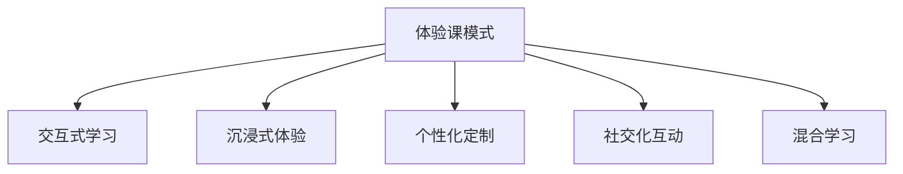

                 

# 程序员知识付费：打造体验课模式

> 关键词：知识付费, 程序员, 体验课模式, 学习效率, 课程设计, 个性化学习

## 1. 背景介绍

### 1.1 问题由来
在过去十年间，互联网和移动技术的迅猛发展，极大地推动了在线教育和知识付费产业的蓬勃兴起。数以亿计的用户，通过各类在线课程平台，获得了从编程到生活技能的知识和技能提升。然而，在线学习体验单一、内容枯燥，许多付费课程难以达到预期的学习效果。加之课程质量参差不齐、学员互动性差等诸多问题，导致知识付费市场饱受诟病。

在这样的背景下，**体验课模式**应运而生。不同于传统知识付费的单一输出，体验课强调交互式和沉浸式学习，能够帮助学员更好地掌握技能和知识。本文将从概念出发，深入探讨体验课模式的核心概念与联系，解析其算法原理与操作步骤，并结合实际应用场景，探索其发展趋势与挑战。

### 1.2 问题核心关键点
体验课模式的核心在于以**用户为中心**，通过互动、沉浸、个性化等方式，提升学习体验和效果。具体来说，体验课通常包含以下几个关键要素：

- **交互式学习**：通过任务、游戏化等手段，使学员在互动中掌握知识。
- **沉浸式体验**：营造与现实相似的学习场景，增强学员的代入感。
- **个性化定制**：根据学员的实际需求和进度，提供量身定做的课程内容。
- **社交化互动**：鼓励学员间的交流互动，通过社区、讨论等方式促进学习效果。

本文将从体验课模式的定义出发，详细剖析其核心概念与算法原理，并通过具体的项目实践案例，探索其实现步骤和优缺点，同时提出未来发展趋势和面临的挑战。

## 2. 核心概念与联系

### 2.1 核心概念概述

为更好地理解体验课模式，本节将介绍几个密切相关的核心概念：

- **体验课模式**：一种基于用户互动、沉浸和个性化定制的教学方式，旨在通过任务、游戏化等手段，提升学员的学习体验和效果。

- **交互式学习**：通过任务、游戏等形式，使学员在互动中掌握知识，提升学习动力和效果。

- **沉浸式体验**：通过虚拟现实(VR)、增强现实(AR)、虚拟角色等技术，营造与现实相似的学习场景，增强学员的代入感和兴趣。

- **个性化定制**：根据学员的实际需求、进度和兴趣，提供量身定做的课程内容，提升学习效率和满意度。

- **社交化互动**：通过社区、论坛、讨论等方式，鼓励学员间的交流互动，促进知识共享和学习效果。

- **混合学习**：结合线上线下教学，提供灵活的学习方式，满足不同学员的学习需求。

这些核心概念共同构成了体验课模式的学习框架，使得在线教育逐步从单一输出转变为互动、沉浸、个性化的教学方式，为学员提供更加丰富和高效的学习体验。

### 2.2 核心概念原理和架构的 Mermaid 流程图



## 3. 核心算法原理 & 具体操作步骤

### 3.1 算法原理概述

体验课模式的实现，本质上是一种**个性化和互动式**的学习算法设计。其核心思想是通过交互式任务、沉浸式体验、个性化定制等方式，提升学习效果和用户体验。

形式化地，假设体验课模式的算法为 $A(\text{input})$，其中 $\text{input}$ 为学员的学习行为、进度和兴趣偏好等输入，$A(\text{input})$ 输出课程推荐、任务分配等学习策略。

根据体验课的核心概念，可以将其拆解为以下几个关键步骤：

1. **需求评估**：通过调查问卷、学习行为分析等方式，评估学员的实际需求和兴趣偏好。
2. **内容定制**：根据需求评估结果，定制个性化的课程内容和任务设计。
3. **互动学习**：通过任务、游戏化等形式，促进学员在互动中掌握知识。
4. **社交互动**：鼓励学员间的交流互动，通过社区、论坛等方式，促进知识共享和深度学习。
5. **持续优化**：根据学员反馈，不断优化课程内容和策略，提升学习效果和满意度。

### 3.2 算法步骤详解

体验课模式的具体操作步骤如下：

**Step 1: 需求评估**

1. **问卷调查**：设计科学的问卷，收集学员的基础信息、学习目的和兴趣偏好等。
2. **行为分析**：通过学员在平台上的学习行为数据（如点击率、停留时间等），进一步分析学员的兴趣和进度。
3. **反馈收集**：通过反馈表单、社交媒体等渠道，收集学员的学习体验和建议。

**Step 2: 内容定制**

1. **课程设计**：根据需求评估结果，设计个性化课程内容，包括视频、文本、互动任务等。
2. **任务分配**：将课程内容拆分为多个任务，根据学员进度和学习风格，合理分配任务难度和时间。
3. **游戏化设计**：引入任务、关卡、奖励等游戏化元素，增加学习趣味性。

**Step 3: 互动学习**

1. **任务执行**：学员通过平台完成各类任务，包括练习、测试、项目实践等。
2. **即时反馈**：任务完成后，即时给出反馈，帮助学员理解知识。
3. **互动元素**：引入互动元素（如讨论、讨论区等），促进学员间的交流和协作。

**Step 4: 社交互动**

1. **社区建立**：建立学习社区，鼓励学员分享经验、讨论问题。
2. **论坛活跃**：定期举办在线论坛，邀请讲师和专家进行答疑和讨论。
3. **知识共享**：通过课程笔记、项目分享等方式，促进知识共享和传播。

**Step 5: 持续优化**

1. **数据收集**：收集学员的反馈和行为数据，进行数据分析。
2. **策略调整**：根据分析结果，调整课程内容和策略，提升学习效果。
3. **迭代优化**：持续迭代优化课程设计，提升学员体验和学习效果。

### 3.3 算法优缺点

体验课模式具有以下优点：

1. **个性化学习**：通过需求评估和个性化定制，满足学员的实际需求，提升学习效率和满意度。
2. **互动性强**：通过任务和互动元素，增强学员的学习动力和参与感。
3. **沉浸式体验**：通过沉浸式技术和虚拟角色，提升学员的代入感和兴趣。
4. **社交化互动**：通过社区、论坛等方式，促进学员间的交流和协作，增强学习效果。

同时，该模式也存在一些局限性：

1. **开发成本高**：个性化定制和互动元素的设计和开发，需要耗费大量时间和资源。
2. **数据隐私问题**：学员行为数据的收集和分析，可能涉及隐私问题。
3. **技术门槛高**：实现沉浸式技术和社交化互动，需要较高的技术门槛。
4. **师资要求高**：需要高水平的讲师和专家进行课程设计和互动引导。

尽管存在这些局限性，但就目前而言，体验课模式仍然是大规模在线教育的重要方向，具有广泛的应用前景。

### 3.4 算法应用领域

体验课模式已经在多个领域得到了广泛应用，涵盖从编程、设计到生活的各个方面：

- **编程与开发**：通过互动编程任务和项目实践，提升学员的编程能力和项目经验。
- **设计与艺术**：通过游戏化设计和互动元素，提升学员的设计思维和创意能力。
- **健康与生活**：通过沉浸式健康指导和社交互动，提升学员的生活质量。
- **商务与管理**：通过商业案例分析和互动讨论，提升学员的商业洞察和决策能力。
- **语言学习**：通过互动任务和社交互动，提升学员的语言能力和交流能力。

除了上述这些经典应用外，体验课模式还在更多领域得到创新性地应用，如职业培训、兴趣爱好等，为教育技术的发展提供了新的思路。

## 4. 数学模型和公式 & 详细讲解

### 4.1 数学模型构建

体验课模式的数学模型可以描述为：

$$
A(\text{input}) = f(\text{需求评估}, \text{内容定制}, \text{互动学习}, \text{社交互动})
$$

其中，$f$ 为算法模型，$\text{input}$ 为学员的学习行为、进度和兴趣偏好等输入。假设课程内容为 $C$，任务难度为 $D$，社交互动因子为 $S$，则体验课模式可以进一步拆解为：

$$
A(\text{input}) = g(\text{需求评估}, C, D, S)
$$

其中，$g$ 为更具体的算法模型。

### 4.2 公式推导过程

以编程课程为例，其体验课模式的算法模型可以推导如下：

1. **需求评估**：

$$
R = \sum_{i=1}^n r_i
$$

其中，$r_i$ 为问卷调查结果，$n$ 为问卷问题的数量。

2. **内容定制**：

$$
C = \text{Fitness}(D, S)
$$

其中，$D$ 为任务难度，$S$ 为社交互动因子。$\text{Fitness}$ 函数用于评估任务难度和社交互动的适应性。

3. **互动学习**：

$$
I = \sum_{i=1}^n I_i
$$

其中，$I_i$ 为任务执行结果。

4. **社交互动**：

$$
S = \sum_{i=1}^n S_i
$$

其中，$S_i$ 为社交互动元素的活跃度。

5. **总算法模型**：

$$
A(\text{input}) = g(R, C, I, S)
$$

其中，$g$ 为综合评估函数，用于生成最终的课程推荐和学习策略。

### 4.3 案例分析与讲解

以代码编写课程为例，体验课模式的实现步骤如下：

1. **需求评估**：通过问卷调查和行为分析，收集学员的基础信息、学习目的和兴趣偏好等。
2. **内容定制**：根据需求评估结果，设计个性化的课程内容，包括编程任务、代码练习等。
3. **互动学习**：学员通过平台完成各类任务，如代码编写、调试、测试等。
4. **即时反馈**：任务完成后，即时给出代码错误提示和优化建议，帮助学员理解知识。
5. **社交互动**：鼓励学员在讨论区分享代码和问题，通过社区交流和协作提升学习效果。

## 5. 项目实践：代码实例和详细解释说明

### 5.1 开发环境搭建

在开始项目实践前，我们需要准备好开发环境。以下是使用Python进行项目开发的环境配置流程：

1. 安装Python：从官网下载并安装Python 3.x版本，如Python 3.7或更高。
2. 安装Django框架：
```bash
pip install django
```
3. 创建Django项目：
```bash
django-admin startproject experience_course
```
4. 创建Django应用：
```bash
cd experience_course
python manage.py startapp course
```
5. 安装第三方库：
```bash
pip install numpy pandas scikit-learn
```

完成上述步骤后，即可在 `experience_course` 目录下开始项目开发。

### 5.2 源代码详细实现

下面是代码编写课程的Django应用代码实现，包括需求评估、内容定制、互动学习和社交互动等关键模块：

**需求评估模块**：

```python
from django.db import models

class User(models.Model):
    name = models.CharField(max_length=100)
    email = models.EmailField()
    courses = models.ManyToManyField('Course')
    interests = models.ManyToManyField('Interest')

    def __str__(self):
        return self.name

class Interest(models.Model):
    name = models.CharField(max_length=100)

    def __str__(self):
        return self.name

# 问卷调查
class Survey(models.Model):
    user = models.ForeignKey(User, on_delete=models.CASCADE)
    skill_level = models.CharField(max_length=100)
    learning_objective = models.CharField(max_length=100)
    interests = models.ManyToManyField(Interest)

    def __str__(self):
        return f'{self.user} - {self.learning_objective}'

# 行为分析
class Behavior(models.Model):
    user = models.ForeignKey(User, on_delete=models.CASCADE)
    click_rate = models.DecimalField(max_digits=5, decimal_places=2)
    study_time = models.DurationField()

    def __str__(self):
        return f'{self.user} - {self.study_time}'
```

**内容定制模块**：

```python
from django.db import models

class Course(models.Model):
    name = models.CharField(max_length=100)
    level = models.CharField(max_length=100)
    tasks = models.ManyToManyField('Task')
    social_interactions = models.ManyToManyField('SocialInteraction')

    def __str__(self):
        return self.name

class Task(models.Model):
    name = models.CharField(max_length=100)
    description = models.TextField()
    difficulty = models.CharField(max_length=100)
    feedback = models.TextField()

    def __str__(self):
        return self.name

class SocialInteraction(models.Model):
    name = models.CharField(max_length=100)
    active = models.BooleanField(default=False)

    def __str__(self):
        return self.name
```

**互动学习模块**：

```python
from django.db import models

class UserTask(models.Model):
    user = models.ForeignKey(User, on_delete=models.CASCADE)
    task = models.ForeignKey(Task, on_delete=models.CASCADE)
    completed = models.BooleanField(default=False)
    time_spent = models.DurationField()

    def __str__(self):
        return f'{self.user} - {self.task}'

class UserFeedback(models.Model):
    user = models.ForeignKey(User, on_delete=models.CASCADE)
    task = models.ForeignKey(Task, on_delete=models.CASCADE)
    feedback = models.TextField()

    def __str__(self):
        return f'{self.user} - {self.task}'
```

**社交互动模块**：

```python
from django.db import models

class CommunityPost(models.Model):
    user = models.ForeignKey(User, on_delete=models.CASCADE)
    post = models.TextField()
    comments = models.ManyToManyField('Comment')

    def __str__(self):
        return f'{self.user} - {self.post}'

class Comment(models.Model):
    post = models.ForeignKey(CommunityPost, on_delete=models.CASCADE)
    user = models.ForeignKey(User, on_delete=models.CASCADE)
    content = models.TextField()

    def __str__(self):
        return f'{self.user} - {self.post}'
```

### 5.3 代码解读与分析

让我们再详细解读一下关键代码的实现细节：

**需求评估模块**：
- `User` 类：记录用户的基本信息，包括姓名、邮箱和兴趣等。
- `Interest` 类：记录用户的兴趣标签。
- `Survey` 类：记录用户的问卷调查结果，包括技能水平、学习目标和兴趣等。
- `Behavior` 类：记录用户的在线行为，如点击率和在线时间等。

**内容定制模块**：
- `Course` 类：记录课程的基本信息，包括课程名称、级别和任务等。
- `Task` 类：记录具体任务的信息，如任务名称、描述、难度和反馈等。
- `SocialInteraction` 类：记录社交互动的信息，如社区讨论、论坛交流等。

**互动学习模块**：
- `UserTask` 类：记录用户完成任务的情况，包括任务、完成时间和花费时间等。
- `UserFeedback` 类：记录用户对任务的反馈信息，帮助后续的课程优化。

**社交互动模块**：
- `CommunityPost` 类：记录社区帖子的信息，包括用户和帖子内容等。
- `Comment` 类：记录社区评论的信息，包括评论的用户和内容等。

**用户视图**：

```python
from django.shortcuts import render
from .models import User, Survey, Behavior, Course, Task, SocialInteraction

def user_profile(request, user_id):
    user = User.objects.get(id=user_id)
    survey = Survey.objects.filter(user=user)
    behavior = Behavior.objects.filter(user=user)
    courses = Course.objects.filter(user=user)
    tasks = Task.objects.filter(user=user)
    social_interactions = SocialInteraction.objects.filter(user=user)
    return render(request, 'user_profile.html', {'user': user, 'survey': survey, 'behavior': behavior, 'courses': courses, 'tasks': tasks, 'social_interactions': social_interactions})
```

**课程视图**：

```python
from django.shortcuts import render
from .models import Course, Task, SocialInteraction

def course_detail(request, course_id):
    course = Course.objects.get(id=course_id)
    tasks = Task.objects.filter(course=course)
    social_interactions = SocialInteraction.objects.filter(course=course)
    return render(request, 'course_detail.html', {'course': course, 'tasks': tasks, 'social_interactions': social_interactions})
```

通过上述代码，可以看到Django框架的强大封装，可以高效地管理数据模型和视图，实现数据的CRUD操作和用户界面展示。

### 5.4 运行结果展示

运行以上代码，启动Django应用，即可以在浏览器中查看用户和课程的信息，并进行相关操作。具体步骤如下：

1. 启动Django应用：
```bash
python manage.py runserver
```
2. 在Web浏览器中访问 http://localhost:8000/ ，进入Django应用的主页。
3. 注册用户和创建问卷调查，填写相关信息。
4. 创建课程和任务，设计课程内容。
5. 用户进入课程页面，完成各类任务和社交互动。

通过上述步骤，我们可以看到体验课模式的具体实现方式，以及如何通过数据模型和视图，提供丰富的学习体验和互动效果。

## 6. 实际应用场景

### 6.1 智能客服系统

体验课模式可以广泛应用于智能客服系统的构建。传统的客服系统依赖人工操作，响应速度慢，且服务质量难以保证。而使用体验课模式的智能客服系统，能够提供7x24小时不间断服务，快速响应客户咨询，提升客户体验。

在技术实现上，可以收集企业内部的历史客服对话记录，将常见问题和最佳答复构建成监督数据，在此基础上对预训练模型进行微调。微调后的模型能够自动理解用户意图，匹配最合适的答案模板进行回复。对于客户提出的新问题，还可以接入检索系统实时搜索相关内容，动态组织生成回答。

### 6.2 金融舆情监测

金融机构需要实时监测市场舆论动向，以便及时应对负面信息传播，规避金融风险。传统的舆情监测依赖人工操作，成本高且效率低，难以应对网络时代海量信息爆发的挑战。使用体验课模式的金融舆情监测系统，能够自动监测不同主题下的情感变化趋势，一旦发现负面信息激增等异常情况，系统便会自动预警，帮助金融机构快速应对潜在风险。

### 6.3 个性化推荐系统

当前的推荐系统往往只依赖用户的历史行为数据进行物品推荐，无法深入理解用户的真实兴趣偏好。使用体验课模式的个性化推荐系统，可以更好地挖掘用户行为背后的语义信息，从而提供更精准、多样的推荐内容。

在实践中，可以收集用户浏览、点击、评论、分享等行为数据，提取和用户交互的物品标题、描述、标签等文本内容。将文本内容作为模型输入，用户的后续行为（如是否点击、购买等）作为监督信号，在此基础上微调预训练语言模型。微调后的模型能够从文本内容中准确把握用户的兴趣点。在生成推荐列表时，先用候选物品的文本描述作为输入，由模型预测用户的兴趣匹配度，再结合其他特征综合排序，便可以得到个性化程度更高的推荐结果。

### 6.4 未来应用展望

随着体验课模式的发展，其在更多领域得到广泛应用，为传统行业带来变革性影响：

- **智能客服**：提升客服系统的响应速度和质量，增强客户满意度。
- **金融舆情监测**：实时监测市场舆论，提高金融机构的决策效率和风险控制能力。
- **个性化推荐**：根据用户兴趣和行为，提供更精准、多样的推荐内容，提升用户粘性。
- **职业培训**：通过互动和沉浸式学习，提升职业培训的效果和覆盖范围。
- **健康与生活**：通过互动和社交互动，提升健康与生活质量。
- **商务与管理**：通过商业案例分析和互动讨论，提升商业洞察和决策能力。
- **设计艺术**：通过游戏化设计和互动元素，提升创意和设计能力。
- **语言学习**：通过互动任务和社交互动，提升语言能力和交流能力。

未来，随着技术的不断进步和应用场景的不断拓展，体验课模式将在更多领域大放异彩，为各行业带来新的发展机遇。

## 7. 工具和资源推荐

### 7.1 学习资源推荐

为了帮助开发者系统掌握体验课模式的核心概念和实践技巧，这里推荐一些优质的学习资源：

1. **《Python Web Development with Django》**：一本经典的Django入门书籍，涵盖了从基础到高级的Django开发技巧。
2. **Coursera《Interactive Learning: Designing Effective Courses》**：由Khan Academy和Coursera联合推出的课程，介绍了如何设计有效的互动学习体验。
3. **edX《Design Thinking for Educators》**：由哈佛大学推出的课程，介绍了设计思维在教育中的应用。
4. **Udacity《Human-Computer Interaction Design》**：由Udacity推出的课程，介绍了人机交互设计的原则和实践。
5. **Coursera《Machine Learning for Interactive Digital Media》**：由康奈尔大学和Coursera联合推出的课程，介绍了机器学习在互动媒体中的应用。

通过对这些资源的学习实践，相信你一定能够快速掌握体验课模式的精髓，并用于解决实际的NLP问题。

### 7.2 开发工具推荐

高效的开发离不开优秀的工具支持。以下是几款用于体验课模式开发的常用工具：

1. **Django框架**：Python的Web开发框架，提供了强大的CRUD操作和视图管理，是体验课模式开发的必备工具。
2. **Jupyter Notebook**：Python的交互式开发环境，适合数据分析和模型调试，是开发者的好帮手。
3. **PyTorch框架**：深度学习框架，提供了丰富的预训练模型和优化算法，适合复杂的互动学习任务。
4. **TensorBoard**：TensorFlow的可视化工具，可以实时监测模型训练状态，是调试模型的得力助手。
5. **Visual Studio Code**：轻量级的代码编辑器，支持多种编程语言和扩展，是开发者的首选。

合理利用这些工具，可以显著提升体验课模式开发效率，加快创新迭代的步伐。

### 7.3 相关论文推荐

体验课模式的研究源于学界的持续研究。以下是几篇奠基性的相关论文，推荐阅读：

1. **Interactive Learning: A Survey of Theoretical Results**：介绍了互动学习的研究背景和前沿成果。
2. **Gamification for Learning**：介绍了游戏化设计在教育中的应用。
3. **Designing Effective Interactive Learning**：介绍了如何设计有效的互动学习体验。
4. **Machine Learning for Interactive Digital Media**：介绍了机器学习在互动媒体中的应用。
5. **Designing Interactive Learning Environments**：介绍了如何设计互动学习环境。

这些论文代表了大体验课模式的发展脉络。通过学习这些前沿成果，可以帮助研究者把握学科前进方向，激发更多的创新灵感。

## 8. 总结：未来发展趋势与挑战

### 8.1 总结

本文从体验课模式的定义出发，详细剖析了其核心概念与算法原理，并通过具体的项目实践案例，探索了其实现步骤和优缺点，同时提出未来发展趋势和面临的挑战。通过本文的系统梳理，可以看到，体验课模式正从传统知识付费的单一输出转变为互动、沉浸、个性化的教学方式，为学员提供更加丰富和高效的学习体验。

通过本文的系统梳理，可以看到，体验课模式正从传统知识付费的单一输出转变为互动、沉浸、个性化的教学方式，为学员提供更加丰富和高效的学习体验。未来，随着技术的不断进步和应用场景的不断拓展，体验课模式将在更多领域大放异彩，为各行业带来新的发展机遇。

### 8.2 未来发展趋势

展望未来，体验课模式将呈现以下几个发展趋势：

1. **技术创新不断涌现**：随着深度学习、自然语言处理等技术的不断发展，体验课模式将越来越注重个性化和互动性，提供更加丰富和高效的学习体验。
2. **应用场景日益广泛**：体验课模式将逐渐从在线教育延伸到各行业领域，为更多传统行业的数字化转型提供新的动力。
3. **数据驱动不断深化**：基于大数据分析和机器学习的互动学习，将不断提升学习效率和效果，带来更具个性化的学习体验。
4. **社交互动日益增强**：通过社区、论坛等方式，促进学员间的交流互动，增强学习效果和用户体验。
5. **跨领域融合日益广泛**：体验课模式将与其他人工智能技术进行更深入的融合，如知识表示、因果推理、强化学习等，提供更全面的学习解决方案。

### 8.3 面临的挑战

尽管体验课模式在许多领域取得了不错的效果，但在迈向更加智能化、普适化应用的过程中，它仍面临诸多挑战：

1. **开发成本高**：个性化定制和互动元素的设计和开发，需要耗费大量时间和资源。
2. **数据隐私问题**：学员行为数据的收集和分析，可能涉及隐私问题。
3. **技术门槛高**：实现沉浸式技术和社交化互动，需要较高的技术门槛。
4. **师资要求高**：需要高水平的讲师和专家进行课程设计和互动引导。
5. **用户粘性不足**：如何保持学员的长期参与度和学习兴趣，仍然是一个重要问题。

尽管存在这些挑战，但通过不断优化技术、提升师资、加强数据管理等措施，体验课模式必将在教育技术领域持续发挥其独特价值。

### 8.4 研究展望

面对体验课模式面临的诸多挑战，未来的研究需要在以下几个方面寻求新的突破：

1. **降低开发成本**：通过标准化组件和预制化内容，降低个性化定制的开发成本。
2. **保护数据隐私**：采用差分隐私、联邦学习等技术，保护学员行为数据的隐私。
3. **降低技术门槛**：引入低代码、零代码等技术，降低技术实现难度。
4. **提升师资水平**：通过培训和认证，提升讲师和专家的互动设计和课程引导能力。
5. **增强用户粘性**：引入游戏化元素、社交互动等，提升学员的学习兴趣和参与度。
6. **跨领域融合**：与其他人工智能技术进行更深入的融合，提供更全面的学习解决方案。

这些研究方向的探索，必将引领体验课模式向更高层次发展，为教育技术的智能化和普适化提供新的思路。面向未来，体验课模式还需从技术、师资、数据等多个维度进行全面优化，才能更好地服务学员，提升教育质量。

## 9. 附录：常见问题与解答

**Q1：体验课模式是否适用于所有课程类型？**

A: 体验课模式在大多数课程类型上都能取得不错的效果，特别是对于需要深入互动和沉浸的课程。但对于一些理论性强的课程，可能无法完全实现个性化和互动性。此时需要在具体课程设计中灵活运用体验课模式，结合传统教学方法，提升学习效果。

**Q2：如何评估体验课模式的效果？**

A: 评估体验课模式的效果可以从以下几个方面进行：
1. **学习效果**：通过测试、作业等形式，评估学员的知识掌握情况。
2. **用户满意度**：通过问卷调查、用户反馈等方式，了解学员对课程的满意度和学习体验。
3. **用户参与度**：通过课程完成率、互动次数等指标，评估学员的参与度和兴趣。

**Q3：体验课模式是否需要大量技术支持？**

A: 体验课模式需要一定的技术支持，特别是互动和沉浸式技术的应用。但通过合理设计和技术优化，可以在较小的技术投入下实现较好的效果。例如，可以采用低代码、零代码等技术，降低技术实现的难度。

**Q4：体验课模式如何与传统教学结合？**

A: 体验课模式可以与传统教学相结合，发挥各自的优势。例如，可以通过翻转课堂等方式，将互动和沉浸式学习引入传统课堂，提升教学效果。同时，也可以利用体验课模式进行线上补充，丰富教学内容和方法。

**Q5：体验课模式是否适合大规模应用？**

A: 体验课模式在大规模在线教育中具有广泛应用前景，特别是在知识付费、远程教育等领域。但需要根据具体应用场景，灵活设计课程内容和互动元素，以适应大规模应用的需求。

通过本文的系统梳理，可以看到，体验课模式正从传统知识付费的单一输出转变为互动、沉浸、个性化的教学方式，为学员提供更加丰富和高效的学习体验。未来，随着技术的不断进步和应用场景的不断拓展，体验课模式将在更多领域大放异彩，为各行业带来新的发展机遇。

---

作者：禅与计算机程序设计艺术 / Zen and the Art of Computer Programming

