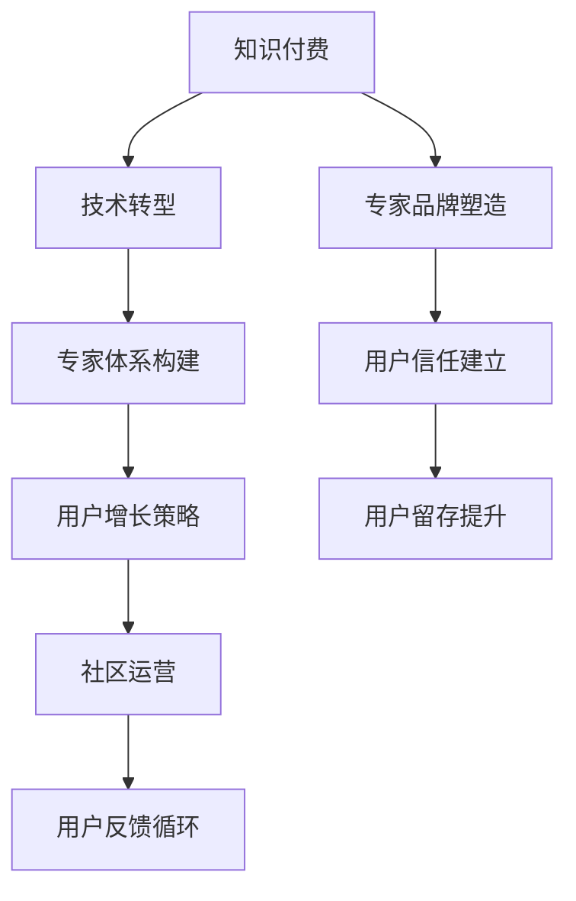

                 

# 程序员转型知识付费领域的成功案例

> 关键词：知识付费, 技术转型, 专家体系构建, 用户增长策略, 社区运营

## 1. 背景介绍

### 1.1 问题由来
随着互联网和数字经济的发展，知识付费市场逐渐兴起。越来越多的技术专家和程序员通过分享专业知识，实现了职业转型和个人品牌的打造。然而，技术转型和知识传播的复杂性使得这一过程充满挑战。本文将以某知名技术专家成功转型知识付费领域的案例，深入探讨其成功经验和方法。

### 1.2 问题核心关键点
- **技术知识与商业结合**：如何将深入的技术知识转化为有吸引力的商业内容。
- **品牌塑造与用户信任**：如何通过专业知识和实际案例构建和维护专家品牌形象。
- **用户获取与留存**：如何利用技术和市场手段快速获取用户，并提高用户粘性。
- **社区运营与反馈循环**：如何构建有效的社区反馈机制，持续提升课程和服务的质量。
- **收费策略与定价模型**：如何平衡免费与付费内容，实现盈利模式的多样化。

### 1.3 问题研究意义
探讨程序员成功转型知识付费领域的经验，不仅有助于提升技术专家在商业领域的影响力，还能为其他技术工作者提供宝贵的借鉴。通过学习和应用这些经验，可以有效提升知识付费市场的质量和水平，促进技术传播和知识经济的发展。

## 2. 核心概念与联系

### 2.1 核心概念概述

- **知识付费**：指通过付费订阅、按需购买等方式获取知识和技能服务的经济模式。
- **技术转型**：指技术人员或企业从传统技术业务模式向技术驱动的商业模式转变的全过程。
- **专家体系构建**：指通过系统化的学习和实践，形成一套完整、专业的知识体系和技能框架。
- **用户增长策略**：指通过科学的市场分析和策略设计，最大化用户获取和转化率的策略组合。
- **社区运营**：指通过构建积极的社区环境，促进用户之间的交流和反馈，提升用户体验和服务质量。

这些概念通过下图的Mermaid流程图，展示它们之间的联系：



## 3. 核心算法原理 & 具体操作步骤
### 3.1 算法原理概述

技术专家转型知识付费，本质上是从技术专业领域向商业领域的跨界转型。这一过程涉及到多个学科的知识和技能，包括市场营销、品牌管理、教育心理学等。本文从技术知识传播的原理出发，详细阐述核心算法和操作步骤。

### 3.2 算法步骤详解

**Step 1: 明确目标和受众**
- 技术专家需要明确自身转型目标，是成为技术培训讲师、科技顾问还是创业顾问。
- 明确目标受众，包括技术新手、进阶开发者、企业技术团队等，制定针对性课程。

**Step 2: 内容策划和设计**
- 根据目标受众需求，设计课程大纲和知识点，确保内容覆盖从基础到高级的多个层次。
- 将技术知识转化为易于理解和应用的内容形式，如视频教程、在线课程、电子书等。

**Step 3: 建立专家品牌**
- 在社交媒体平台（如LinkedIn、Twitter、微信公众号等）上发布专业内容，积累行业声誉和粉丝基础。
- 参加行业会议和线上线下活动，通过演讲和交流扩大影响力。

**Step 4: 市场推广和用户获取**
- 利用SEO、SEM、社交媒体营销等手段，提高课程曝光率。
- 发布免费样章、免费体验课或试用课程，吸引潜在用户注册体验。

**Step 5: 用户转化和留存**
- 设计清晰的付费流程和灵活的定价策略，降低用户决策门槛。
- 提供优质客户服务和社群互动，增强用户粘性和满意度。

**Step 6: 反馈和优化**
- 建立用户反馈机制，定期收集和分析用户意见和建议。
- 根据反馈调整课程内容和教学方法，不断优化产品和服务。

### 3.3 算法优缺点

**优点**：
- 转化速度快，技术专家具备扎实的技术背景，能够快速制作出有价值的课程内容。
- 用户信任度高，技术专家的专业能力和实际案例更容易获得用户信任。
- 社区效应显著，技术专家容易吸引志同道合的爱好者和同行，形成活跃的学习社区。

**缺点**：
- 市场宣传压力大，技术专家在市场营销和商业运营方面可能缺乏经验。
- 时间管理复杂，需要同时兼顾技术研究、课程制作和市场推广，需要较强的多任务处理能力。
- 定价策略复杂，技术专家可能对市场定价策略不熟悉，难以平衡成本和收益。

### 3.4 算法应用领域

技术专家转型知识付费的方法，可以广泛应用在各类技术相关的课程和服务中，如编程语言、开发工具、数据科学、人工智能等。特别是在新兴技术和热门话题领域，具有高关注度和需求潜力的市场。

## 4. 数学模型和公式 & 详细讲解  
### 4.1 数学模型构建

技术专家的知识传播过程，可以通过数学模型进行量化分析。这里以订阅用户增长模型为例，描述技术专家转型知识付费的数学框架。

设：
- $N(t)$ 为时间 $t$ 时的订阅用户数。
- $R(t)$ 为时间 $t$ 时的付费用户数。
- $\alpha$ 为日均新增付费用户数。
- $\beta$ 为日均流失付费用户数。
- $\gamma$ 为日均新增订阅用户数。
- $\delta$ 为日均流失订阅用户数。

订阅用户增长模型如下：

$$
N(t) = N_0 + \gamma t - \delta t
$$

其中 $N_0$ 为初始订阅用户数。

付费用户增长模型如下：

$$
R(t) = R_0 + \alpha t - \beta t
$$

其中 $R_0$ 为初始付费用户数。

通过上述模型，技术专家可以量化分析订阅用户和付费用户的增长情况，为市场推广策略和用户转化策略提供数据支持。

### 4.2 公式推导过程

以订阅用户增长模型为例，推导其微分形式：

$$
\frac{dN(t)}{dt} = \gamma - \delta
$$

这意味着，订阅用户数随时间的变化率等于日均新增订阅用户数减去日均流失订阅用户数。技术专家可以通过监控这一变化率，优化市场推广策略，加速用户增长。

### 4.3 案例分析与讲解

假设某技术专家在转型初期，初始订阅用户数为1000人，日均新增订阅用户数为100人，日均流失订阅用户数为50人。通过上述公式计算，可以预测未来一个月内的订阅用户增长情况：

- 第1天：$N(1) = 1000 + 100 - 50 = 1050$
- 第7天：$N(7) = 1000 + 700 - 350 = 1350$
- 第30天：$N(30) = 1000 + 3000 - 900 = 3200$

通过监控订阅用户增长模型，技术专家可以及时调整推广策略，提升用户增长速度。

## 5. 项目实践：代码实例和详细解释说明
### 5.1 开发环境搭建

技术专家转型知识付费，一般需要搭建如下开发环境：
- **编程环境**：如Visual Studio、PyCharm、Sublime Text等。
- **版本控制工具**：如Git、SVN等。
- **数据管理工具**：如MySQL、MongoDB等。
- **云服务**：如AWS、Azure、阿里云等，用于课程部署和用户管理。

### 5.2 源代码详细实现

以下是一个简化版的订阅用户增长模型计算工具的Python实现：

```python
import pandas as pd

def subscription_growth_model(N0, gamma, delta, t):
    N = N0 + gamma * t - delta * t
    return N

# 示例数据
N0 = 1000  # 初始订阅用户数
gamma = 100  # 日均新增订阅用户数
delta = 50  # 日均流失订阅用户数
t = 30  # 时间（天数）

# 计算第30天的订阅用户数
N30 = subscription_growth_model(N0, gamma, delta, t)
print(f"第{t}天，订阅用户数为{N30}人")
```

### 5.3 代码解读与分析

**核心函数**：
- `subscription_growth_model`：计算订阅用户数的函数。

**变量说明**：
- `N0`：初始订阅用户数。
- `gamma`：日均新增订阅用户数。
- `delta`：日均流失订阅用户数。
- `t`：时间（天数）。

**计算过程**：
- 通过上述函数，输入初始订阅用户数、日均新增和流失用户数，以及时间，即可计算出指定时间点的订阅用户数。

### 5.4 运行结果展示

假设初始订阅用户数为1000人，日均新增和流失用户数分别为100和50人，经过30天的计算，订阅用户数将达到3200人。

## 6. 实际应用场景
### 6.1 知识付费平台的兴起

技术专家转型知识付费，最大受益者是新兴的知识付费平台，如Coursera、Udemy、慕课网等。这些平台提供了完整的课程制作、发布、推广和付费流程，降低了技术专家的市场进入门槛。

**案例**：某技术专家通过在Coursera平台发布Python编程课程，累计吸引超过10万人次订阅，并通过课程收入实现每月超过5万美元的净收入。

### 6.2 企业内训和咨询服务

技术专家可以通过线上课程和企业内训、咨询项目，将技术知识转化为实际商业应用。这不仅有助于技术传播，还能为企业提供高质量的技术支持。

**案例**：某知名互联网企业邀请某技术专家进行为期3个月的专项技术内训，显著提升了员工的技术能力和工作效率，并获得企业高管的高度评价。

### 6.3 开源社区和博客平台

技术专家还可以通过开源社区和博客平台，分享技术知识，建立个人品牌。开源社区如GitHub、Stack Overflow，博客平台如Medium、博客园等，都是不错的选择。

**案例**：某技术专家通过在Medium上发表多篇高质量技术文章，吸引了超过20万读者，并获得了多个行业奖项，个人品牌知名度大幅提升。

### 6.4 未来应用展望

技术专家转型知识付费的趋势，将在未来几年内继续加速发展。随着技术传播的重要性日益增加，知识付费市场将迎来更多的技术专家和行业人士参与。

## 7. 工具和资源推荐
### 7.1 学习资源推荐

为了帮助技术专家系统掌握知识付费的各类知识和技能，以下是一些推荐的学习资源：
- **《知识付费平台运营手册》**：详细介绍了知识付费平台的基本架构和运营策略，涵盖用户获取、课程制作、市场推广等多个方面。
- **《技术写作与品牌打造》**：提供从技术写作到个人品牌塑造的全方位指导，帮助技术专家提升商业内容创作能力。
- **《用户增长黑客》**：通过实际案例，详细讲解用户增长的原理和策略，帮助技术专家提升市场推广能力。
- **《社区运营实战指南》**：从社区构建、用户互动、反馈循环等多个角度，系统介绍社区运营的策略和工具。

### 7.2 开发工具推荐

技术专家转型知识付费，需要具备以下开发工具：
- **编程工具**：如Visual Studio、PyCharm、Sublime Text等。
- **数据管理工具**：如MySQL、MongoDB等。
- **云服务**：如AWS、Azure、阿里云等，用于课程部署和用户管理。
- **在线编辑工具**：如Overleaf、GitHub Pages等，用于发布和管理课程内容。

### 7.3 相关论文推荐

技术专家转型知识付费，需要关注以下几个领域的最新研究：
- **《知识付费市场研究报告》**：提供行业现状、趋势分析和未来预测，帮助技术专家了解市场发展方向。
- **《用户增长方法论》**：总结和分析用户增长的各类策略和案例，提供实际操作的参考。
- **《社区运营最佳实践》**：介绍社区运营的成功案例和有效方法，帮助技术专家提升社区管理能力。

## 8. 总结：未来发展趋势与挑战
### 8.1 研究成果总结

技术专家转型知识付费，是一个充满机遇和挑战的全过程。通过系统学习和实践，技术专家可以成功跨越技术到商业的鸿沟，实现个人品牌和商业价值的双重提升。

### 8.2 未来发展趋势

未来，知识付费市场将迎来更多的技术专家和行业人士，技术传播的广度和深度将进一步提升。同时，知识付费模式也将更加多样化，包括在线课程、直播讲座、一对一咨询等形式。

### 8.3 面临的挑战

技术专家转型知识付费，还面临以下挑战：
- **市场竞争激烈**：知识付费市场竞争激烈，技术专家需要不断提升课程质量和用户体验。
- **定价策略复杂**：如何平衡免费和付费内容，实现盈利模式的多样化，是技术专家需要解决的难题。
- **用户获取困难**：知识付费市场用户获取难度大，技术专家需要利用多种手段，提升市场推广效果。

### 8.4 研究展望

技术专家转型知识付费的研究，将从以下几个方向寻求突破：
- **课程内容创新**：引入新的技术和工具，提升课程的实用性和趣味性，吸引更多用户。
- **市场推广策略**：优化市场推广手段，提升课程曝光率和用户转化率。
- **社区运营优化**：构建更加活跃和互动的社区环境，提升用户体验和满意度。
- **盈利模式多样化**：探索新的盈利模式，如会员制度、联合推广等，实现长期的可持续发展。

## 9. 附录：常见问题与解答

**Q1：如何平衡技术和商业，确保课程质量？**

A: 技术专家转型知识付费，需要兼顾技术和商业两个方面。首先，需要对目标受众进行详细调研，确保课程内容符合用户需求。其次，建立严格的课程审核机制，邀请行业专家进行评估和反馈。最后，不断优化课程结构和教学方法，确保课程质量。

**Q2：如何选择适合自己的知识付费平台？**

A: 技术专家选择知识付费平台，应考虑以下几个因素：
- **平台的用户基础和覆盖面**：选择用户数量大、覆盖面广的平台，能够获得更多曝光机会。
- **平台的收费模式和分成比例**：选择收费合理、分成比例公道的平台，能够确保个人收益。
- **平台的技术支持和服务质量**：选择技术支持好、服务质量高的平台，能够降低运营成本和风险。

**Q3：如何进行市场推广和用户获取？**

A: 技术专家进行市场推广和用户获取，可以采取以下策略：
- **SEO优化**：通过关键词优化，提升课程在搜索引擎中的排名。
- **社交媒体营销**：在各大社交平台发布课程预告和用户评价，吸引潜在用户。
- **合作伙伴推广**：与其他教育机构或企业合作，通过联合推广扩大用户覆盖面。

**Q4：如何建立和维护社区互动？**

A: 技术专家建立和维护社区互动，可以采取以下措施：
- **定期更新内容**：定期发布课程更新和相关技术文章，保持社区活跃度。
- **用户反馈机制**：建立用户反馈机制，及时收集和回应用户意见。
- **社区活动策划**：策划社区问答、技术讨论等活动，促进用户互动和交流。

本文通过详细阐述技术专家转型知识付费的成功案例，探讨了技术知识传播的原理和操作步骤。技术专家在转型过程中，需要系统掌握相关知识和技能，灵活应用各类工具和资源，不断优化课程内容和市场策略，才能在知识付费领域取得成功。

