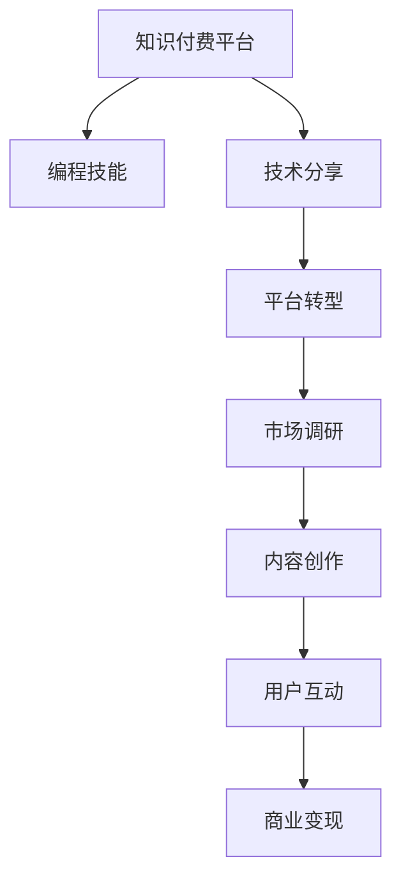

                 

# 程序员转型知识付费领域的成功案例

> 关键词：程序员转型, 知识付费, 成功案例, 职业发展, 技术博客, 技术驱动

## 1. 背景介绍

### 1.1 问题由来
随着互联网技术的迅速发展，越来越多的程序员开始意识到职业发展的瓶颈和市场需求的变化。在传统的软件开发岗位上，技能单一、职场竞争激烈等问题逐渐显现。与此同时，知识付费平台的兴起为技术人才开辟了一条新的职业发展道路。如何成功转型，并在这个领域取得成功，成为了许多程序员的迫切需求。

### 1.2 问题核心关键点
程序员转型知识付费领域的核心在于掌握两个关键点：
1. **知识深度和广度**：编程技能是基础，但如何将这些知识系统化、理论化，并扩展到更广泛的技术和商业领域，是转型的关键。
2. **市场需求洞察**：了解目标受众的需求，提供有价值的解决方案，是成功转型的重要保障。

### 1.3 问题研究意义
程序员转型知识付费领域具有以下重要意义：
- **提升个人价值**：通过分享知识和经验，扩大影响力，提升职业竞争力和经济收入。
- **推动技术普及**：将复杂的技术问题简化，使更多人能够理解和应用新技术，促进技术普及。
- **激励学习和创新**：分享者的专业知识和成功经验，可以激励他人学习和创新，形成一个正向的反馈循环。
- **促进产业发展**：知识付费平台的兴起，是推动信息技术产业向纵深发展的关键力量之一。

## 2. 核心概念与联系

### 2.1 核心概念概述

为更好地理解程序员转型知识付费领域，本节将介绍几个密切相关的核心概念：

- **知识付费平台**：指通过付费形式，提供有价值的知识内容和服务，帮助用户解决问题、提升技能的教育平台。
- **编程技能**：指软件开发过程中所需具备的技术能力，包括编程语言、算法设计、软件架构、版本控制等。
- **技术分享**：指将个人的技术经验、项目案例、代码实现等分享给他人，以达到知识传播和技术推广的目的。
- **平台转型**：指将个人在传统软件开发岗位上的经验和技术，转化为知识付费平台上的专业知识输出。
- **市场调研**：指对目标受众的需求、痛点和兴趣点进行深入研究，为知识产品的开发和推广提供指导。
- **内容创作**：指结合编程技能，创作具有教育意义和技术深度的内容，满足用户的学习需求。
- **用户互动**：指通过在线讨论、社群互动等方式，提升用户的参与感和满意度，形成良好的用户粘性。
- **商业变现**：指通过课程销售、专栏订阅、广告合作等方式，实现知识付费平台的商业模式。

这些核心概念之间的逻辑关系可以通过以下Mermaid流程图来展示：



这个流程图展示了几者之间的逻辑关系：

1. 编程技能为知识付费的基础。
2. 技术分享是知识传播的起点。
3. 平台转型将个人技能转化为知识产品。
4. 市场调研为知识产品的设计提供依据。
5. 内容创作是知识产品的内容核心。
6. 用户互动提升知识产品的粘性。
7. 商业变现是知识付费的商业模式保障。

## 3. 核心算法原理 & 具体操作步骤
### 3.1 算法原理概述

程序员转型知识付费领域的过程，本质上是通过技术知识输出，构建知识产品并实现商业变现的过程。核心算法原理包括：

1. **内容规划**：根据目标受众的需求，规划内容主题和结构。
2. **内容创作**：使用编程技能，创作具有技术深度的内容，并通过适当的组织形式呈现。
3. **市场调研**：通过调研用户需求和反馈，不断优化内容，提升用户满意度。
4. **平台搭建**：选择合适的知识付费平台，进行内容发布和用户管理。
5. **用户互动**：通过社群互动、在线讨论等方式，增强用户粘性，提升用户参与感。
6. **商业变现**：通过课程销售、专栏订阅、广告合作等手段，实现平台的商业化运营。

### 3.2 算法步骤详解

具体步骤如下：

**Step 1: 知识库建设**
- 收集整理编程技能相关的知识点、项目案例、代码实现等资料。
- 分类组织这些资料，形成系统的知识体系。

**Step 2: 内容创作**
- 选择适合的知识付费平台，如Udemy、Coursera、Bilibili等。
- 根据目标受众的需求和兴趣，设计课程、专栏、文章等知识产品。
- 使用编程技能，创作有技术深度的内容，并进行适当的编辑和排版。

**Step 3: 平台搭建**
- 在选定的知识付费平台上注册账号，创建个人空间。
- 上传和发布创作好的内容，并进行标题、摘要、标签等设置。
- 使用平台提供的工具进行内容管理和用户互动。

**Step 4: 市场调研**
- 通过调查问卷、用户评论等方式，收集用户反馈和需求。
- 分析用户数据，识别出热门和薄弱环节。
- 根据调研结果，优化和更新内容，提升用户满意度。

**Step 5: 用户互动**
- 通过在线讨论、社群互动等方式，建立用户社群。
- 定期发布更新内容，参与用户讨论，解答用户疑问。
- 收集用户反馈，进一步优化内容和服务。

**Step 6: 商业变现**
- 通过课程销售、专栏订阅、广告合作等方式，实现知识付费平台的商业化运营。
- 设定合理的定价策略，吸引用户付费。
- 关注平台的流量和用户增长，持续优化商业模式。

### 3.3 算法优缺点

知识付费领域具有以下优点：
1. **提升个人价值**：通过分享知识和经验，扩大影响力，提升职业竞争力和经济收入。
2. **技术推广**：将复杂的技术问题简化，使更多人能够理解和应用新技术，促进技术普及。
3. **激励学习和创新**：分享者的专业知识和成功经验，可以激励他人学习和创新，形成一个正向的反馈循环。
4. **促进产业发展**：知识付费平台的兴起，是推动信息技术产业向纵深发展的关键力量之一。

同时，该领域也存在一些局限性：
1. **市场需求变化快**：技术发展迅速，市场需求变化快，需要不断学习和更新内容。
2. **内容创作难度大**：高质量内容的制作需要大量时间和精力，且质量难以保证。
3. **用户互动复杂**：在线互动需要处理大量的用户反馈和提问，管理复杂。
4. **商业变现难度大**：初期用户获取和留存难，需要较长时间积累用户基础。

尽管存在这些局限性，但知识付费领域仍是一个充满潜力和机遇的新兴领域，对于有志于技术转型的程序员来说，具有重要的研究和应用价值。

### 3.4 算法应用领域

知识付费领域的应用场景非常广泛，主要包括以下几个方面：

- **技术培训**：为编程初学者、进阶者提供系统化的编程培训，包括基础编程、算法设计、框架应用等。
- **项目实战**：通过分享实际项目的开发过程和技术难点，帮助用户提升实战能力。
- **职业规划**：提供职业发展建议、技能提升路线、求职技巧等，帮助用户更好地规划职业发展。
- **技术交流**：通过在线讨论、社群互动等方式，建立技术交流平台，促进技术交流和合作。
- **产品开发**：分享产品开发的思路和过程，帮助用户提升产品设计和开发能力。
- **创业指导**：分享创业经验、商业模式、融资技巧等，帮助有创业意向的用户实现梦想。

## 4. 数学模型和公式 & 详细讲解 & 举例说明

### 4.1 数学模型构建

知识付费领域的内容创作和商业变现，可以通过数学模型进行分析和优化。以下是一个简单的数学模型框架：

1. **用户需求模型**：$D = f(P, C, E)$，其中$D$为用户需求，$P$为编程技能，$C$为用户反馈，$E$为市场需求。
2. **内容质量模型**：$Q = g(S, C, F)$，其中$Q$为内容质量，$S$为内容创作投入，$C$为用户反馈，$F$为内容更新频率。
3. **商业变现模型**：$R = h(Q, P, M)$，其中$R$为商业变现收入，$Q$为内容质量，$P$为内容价格，$M$为市场规模。

### 4.2 公式推导过程

以用户需求模型为例进行推导：

设用户需求$D$为二元变量，表示用户是否需要某种编程技能$P$。需求$D$的生成取决于编程技能$P$的质量、用户反馈$C$和市场需求$E$。根据贝叶斯定理，需求模型可以表示为：

$$
P(D|P,C,E) = \frac{P(D|P)P(C|D)P(E|D)}{P(C)P(E)}
$$

其中$P(D|P)$为编程技能对需求的影响概率，$P(C|D)$为用户反馈对需求的影响概率，$P(E|D)$为市场需求对需求的影响概率。

通过上述模型，可以分析不同编程技能、用户反馈和市场需求对用户需求的影响，进而优化内容创作和商业变现策略。

### 4.3 案例分析与讲解

假设有一门关于Python编程的课程，内容质量$Q$为90分，用户反馈$C$为80分，市场需求$E$为50%。根据上述需求模型，计算用户需求$D$的概率如下：

$$
P(D|P=Python, C=80, E=50\%) = \frac{P(D|Python)P(80|D)P(50\%|D)}{P(80)P(50\%)}
$$

若已知$P(D|Python)=0.8$，$P(80|D)=0.9$，$P(50\%)=0.5$，则：

$$
P(D|Python, C=80, E=50\%) = \frac{0.8 \times 0.9 \times 0.5}{0.5 \times 0.5} = 0.864
$$

因此，这门Python编程课程的需求概率为86.4%。通过类似计算，可以优化不同内容的质量和价格策略，提升商业变现收入。

## 5. 项目实践：代码实例和详细解释说明
### 5.1 开发环境搭建

在进行知识付费领域的项目实践前，我们需要准备好开发环境。以下是使用Python进行知识付费平台内容发布的开发环境配置流程：

1. 安装Anaconda：从官网下载并安装Anaconda，用于创建独立的Python环境。

2. 创建并激活虚拟环境：
```bash
conda create -n knowledge-payment-env python=3.8 
conda activate knowledge-payment-env
```

3. 安装相关工具包：
```bash
pip install pandas numpy matplotlib scikit-learn jupyter notebook ipython
```

完成上述步骤后，即可在`knowledge-payment-env`环境中开始内容创作和发布。

### 5.2 源代码详细实现

这里我们以在线编程培训课程为例，给出使用Jupyter Notebook进行Python编程课程发布和用户互动的完整代码实现。

首先，创建一个Python脚本，用于生成课程内容：

```python
from IPython.display import display, Image, HTML

# 课程介绍
def intro():
    display(HTML("""
        <h1>Python编程基础</h1>
        <p>本课程将带您从零开始，系统学习Python编程基础，掌握Python的语法、数据结构、函数和模块等内容。</p>
        <p>课程内容包括：</p>
        <ul>
            <li>Python基础语法</li>
            <li>数据类型和操作</li>
            <li>函数和模块使用</li>
            <li>文件操作和异常处理</li>
            <li>Python标准库介绍</li>
        </ul>
        <p>学习完本课程，您将能够编写基本的Python程序，进行数据处理和简单的系统开发。</p>
    """))

# 课程目录
def course大纲():
    display(HTML("""
        <h2>课程目录</h2>
        <ul>
            <li>第1章：Python基础</li>
            <li>第2章：数据类型和操作</li>
            <li>第3章：函数和模块</li>
            <li>第4章：文件操作和异常处理</li>
            <li>第5章：Python标准库</li>
        </ul>
    """))

# 课程视频
def video(video_url):
    display(HTML(f"""<iframe width="560" height="315" src="{video_url}" frameborder="0" allowfullscreen></iframe>"""))

# 课程代码
def code(code_snippet):
    display(HTML(f"""<code>{code_snippet}</code>"""))
```

然后，创建一个Jupyter Notebook，用于发布课程内容：

```python
from IPython.display import display, Image, HTML

# 课程介绍
intro()

# 课程目录
course大纲()

# 课程视频
video("https://www.youtube.com/watch?v=AbCde1234")

# 课程代码
code("print('Hello, world!')")
```

最后，保存并发布这个Notebook，供用户学习和互动。

### 5.3 代码解读与分析

让我们再详细解读一下关键代码的实现细节：

**intro函数**：
- 使用`IPython.display`模块的`HTML`函数，将课程介绍内容渲染为HTML格式，并显示在Notebook中。

**course大纲函数**：
- 使用`IPython.display`模块的`HTML`函数，将课程目录渲染为HTML格式，并显示在Notebook中。

**video函数**：
- 使用`IPython.display`模块的`HTML`函数，将课程视频嵌入Notebook中，使用`iframe`标签显示。

**code函数**：
- 使用`IPython.display`模块的`HTML`函数，将课程代码渲染为HTML格式，并显示在Notebook中。

通过上述代码，我们能够创建一个包含课程介绍、目录、视频和代码的完整课程发布页面，并通过Jupyter Notebook发布和共享，方便用户学习和互动。

## 6. 实际应用场景
### 6.1 在线编程培训

在线编程培训是知识付费领域的一个重要应用场景。传统编程培训往往成本高昂，学习门槛高，而通过在线课程，程序员可以更加灵活地分享自己的编程技能，帮助他人学习。

例如，通过在Udemy、Coursera等平台发布Python编程课程，可以覆盖更多的受众群体，扩大影响力。课程内容可以根据学员的不同水平，设置不同的难度和深度，提供从基础到高级的全面培训。

### 6.2 技术问题答疑

技术问题答疑是程序员转型知识付费领域的另一个热门场景。很多开发者在日常开发中会遇到各种技术难题，但有时难以通过传统方式找到有效的解决方案。通过在知识付费平台上发布技术答疑类课程，可以为这些问题提供专业解答。

例如，开设一个"Python编程问题解答"课程，每周发布几篇关于常见技术问题、错误调试、代码优化等方面的文章，并进行在线答疑。学员可以随时提出问题，由课程作者进行解答，形成持续的技术交流和互动。

### 6.3 编程项目实战

编程项目实战是知识付费领域的高价值内容。通过分享实际项目的设计思路、开发过程和问题解决，学员可以更好地理解理论知识，并应用于实际开发中。

例如，开设一个"Web应用开发实战"课程，详细介绍一个从需求分析到部署上线的过程，包括数据库设计、前后端整合、安全优化等内容。通过演示项目开发的完整流程，帮助学员更好地掌握实战技能。

## 7. 工具和资源推荐
### 7.1 学习资源推荐

为了帮助开发者系统掌握知识付费领域的理论和实践，这里推荐一些优质的学习资源：

1. Coursera《Python for Everybody》课程：由密歇根大学开设，从零开始介绍Python编程基础，适合初学者。

2. Udemy《Complete Python Bootcamp》课程：Udemy上的热门课程，涵盖Python基础、数据结构、函数、模块等内容，适合进阶学习。

3. GitHub上的编程教程：大量开源的编程教程和项目示例，适合自学和参考。

4. Stack Overflow：程序员社区，提供大量编程问题和解决方案，适合技术交流和问题解决。

5. Kaggle：数据科学竞赛平台，提供大量数据集和竞赛题目，适合实战学习和项目经验积累。

通过对这些资源的学习实践，相信你一定能够快速掌握知识付费领域的精髓，并用于解决实际的编程问题。

### 7.2 开发工具推荐

高效的开发离不开优秀的工具支持。以下是几款用于知识付费领域内容创作的常用工具：

1. Jupyter Notebook：免费的开源工具，支持Python、R、SQL等多种编程语言，适合制作和发布在线课程。

2. GitHub：代码托管平台，支持版本控制、代码仓库和协作开发，适合发布和维护技术文档和项目代码。

3. GitLab：代码托管平台，支持CI/CD、仓库管理和协作开发，适合开发和维护编程项目。

4. VSCode：跨平台的IDE，支持代码编辑、调试、版本控制等，适合编程和开发。

5. TeXstudio：专业的LaTeX编辑器，支持文本排版和数学公式编辑，适合制作学术论文和技术文档。

合理利用这些工具，可以显著提升知识付费领域的内容创作效率，加快创新迭代的步伐。

### 7.3 相关论文推荐

知识付费领域的发展源于学界的持续研究。以下是几篇奠基性的相关论文，推荐阅读：

1. "Education Technology and Learning Analytics"（教育技术与学习分析）：探讨了技术在教育中的应用，介绍了学习分析方法和技术。

2. "The Effectiveness of Online Courses in Higher Education"（在线课程在高教中的应用效果）：研究了在线课程在高教中的应用效果，分析了在线学习的优势和挑战。

3. "Developing Online Learning Resources"（在线学习资源开发）：介绍了在线学习资源的设计、开发和应用，提供了具体的案例和实践建议。

4. "A Framework for Developing Effective Online Learning Materials"（在线学习材料开发框架）：提出了一套在线学习材料开发的框架和方法，适合内容创作和项目管理。

5. "Online Learning Communities and Knowledge Sharing"（在线学习社区和知识分享）：研究了在线学习社区的构建和知识分享机制，提供了社群互动和知识传播的策略。

这些论文代表了大语言模型微调技术的发展脉络。通过学习这些前沿成果，可以帮助研究者把握学科前进方向，激发更多的创新灵感。

## 8. 总结：未来发展趋势与挑战
### 8.1 总结

本文对程序员转型知识付费领域的过程进行了全面系统的介绍。首先阐述了转型背景和意义，明确了知识付费领域的应用价值和技术要求。其次，从原理到实践，详细讲解了知识付费领域的内容创作和商业变现过程，给出了完整的内容发布代码实现。同时，本文还探讨了知识付费领域的应用场景，展示了这个领域的广阔前景。

通过本文的系统梳理，可以看到，程序员转型知识付费领域是一个充满机遇和挑战的过程，需要不断学习和实践，才能在这个领域取得成功。

### 8.2 未来发展趋势

展望未来，知识付费领域将呈现以下几个发展趋势：

1. **内容多样化**：内容形式从单一的视频、文章，扩展到代码、项目、讲座等多种形式，提供更加丰富的学习体验。

2. **技术集成**：知识付费平台将进一步集成人工智能、区块链等技术，提供智能推荐、版权保护等功能，提升用户体验。

3. **互动增强**：通过在线讨论、社群互动等方式，增强用户粘性，提升用户参与感。

4. **国际化扩展**：知识付费平台将逐渐国际化，覆盖更多语言和地区，提供全球化的教育服务。

5. **开源和共享**：知识付费平台将更加注重开源和共享，促进技术交流和知识传播。

6. **市场细分**：知识付费领域将进一步细分，涵盖技术培训、职业规划、项目实战等多个方向，满足不同用户需求。

以上趋势凸显了知识付费领域的广阔前景。这些方向的探索发展，必将进一步提升知识付费平台的用户体验，推动信息技术教育的普及和发展。

### 8.3 面临的挑战

尽管知识付费领域具有广阔的前景，但在迈向更加智能化、普适化应用的过程中，它仍面临着诸多挑战：

1. **内容质量控制**：高质量内容的创作需要大量时间和精力，且质量难以保证。如何提升内容创作效率和质量，是一个重要挑战。

2. **用户粘性提升**：在线互动需要处理大量的用户反馈和提问，管理复杂。如何提升用户粘性和满意度，是另一个关键问题。

3. **市场竞争加剧**：知识付费市场竞争激烈，如何脱颖而出，打造差异化服务，是转型的重要课题。

4. **商业模式创新**：知识付费平台的商业变现需要不断创新，探索新的盈利模式，以应对市场需求变化。

5. **技术迭代快**：编程技能和技术工具更新迅速，如何保持内容的时效性和先进性，是持续发展的关键。

6. **版权和伦理问题**：知识版权和伦理问题需要妥善处理，确保内容创作的合法性和道德性。

这些挑战需要开发者和平台方共同努力，不断优化内容创作和用户管理策略，才能确保知识付费领域的长久发展。

### 8.4 研究展望

面对知识付费领域面临的挑战，未来的研究需要在以下几个方面寻求新的突破：

1. **内容创作工具**：开发更加高效的内容创作工具，提高内容创作的效率和质量。

2. **用户管理机制**：建立更加智能的用户管理机制，通过数据分析和个性化推荐，提升用户粘性和满意度。

3. **商业模式创新**：探索新的商业变现模式，如知识众筹、按需付费等，满足更多用户需求。

4. **开源和共享**：推动知识付费平台的开源和共享，促进技术交流和知识传播。

5. **伦理和法律研究**：加强知识版权和伦理问题的研究，确保内容创作的合法性和道德性。

这些研究方向的探索，必将引领知识付费领域迈向更高的台阶，为程序员提供更加广阔的职业发展空间。

## 9. 附录：常见问题与解答
### 9.1 常见问题

**Q1：知识付费领域对编程技能有哪些要求？**

A: 知识付费领域对编程技能的要求如下：
1. **基础知识**：掌握编程语言的基本语法、数据结构和算法设计。
2. **项目经验**：具备一定的项目开发经验，能够解决实际问题。
3. **技术深度**：对技术有深入理解，能够解释复杂的技术概念和实现原理。
4. **持续学习**：保持技术更新，不断学习新知识，更新课程内容。

**Q2：如何选择合适的知识付费平台？**

A: 选择合适的知识付费平台需要考虑以下几个因素：
1. **用户群体**：平台的用户群体是否与课程内容匹配，能否覆盖目标受众。
2. **技术支持**：平台的技术支持是否完善，能否满足课程发布和用户互动的需求。
3. **商业变现**：平台的商业变现模式是否合理，能否提供稳定的收入来源。
4. **市场口碑**：平台的市场口碑如何，用户评价是否良好。

**Q3：知识付费领域的商业变现策略有哪些？**

A: 知识付费领域的商业变现策略包括：
1. **课程销售**：通过付费订阅或单次购买，销售课程内容。
2. **专栏订阅**：提供高质量内容的定期更新，订阅用户可以持续获取新内容。
3. **广告合作**：与广告平台合作，通过广告收入变现。
4. **知识众筹**：通过众筹方式，聚集用户资源，制作高质量课程内容。
5. **会员制服务**：提供会员专属服务，如优先访问、专属咨询等。

**Q4：如何提升知识付费平台的用户粘性？**

A: 提升知识付费平台的用户粘性需要从以下几个方面入手：
1. **内容质量**：提供高质量和实用的课程内容，满足用户的学习需求。
2. **互动体验**：通过在线讨论、社群互动等方式，增强用户参与感。
3. **用户反馈**：收集用户反馈，不断优化课程内容和平台体验。
4. **激励机制**：提供奖励和激励机制，如会员积分、优惠券等，鼓励用户持续学习。
5. **技术支持**：确保平台稳定运行，提升用户体验。

### 9.2 问题解答

**A1：知识付费领域是否有长期发展的潜力？**

A: 知识付费领域具有广阔的市场潜力和发展前景。随着技术的不断进步和人们对于在线教育的认可，知识付费平台将逐渐普及，成为一种主流的教育方式。通过不断的技术创新和内容优化，知识付费领域将有更多的应用场景和盈利模式，长期发展潜力巨大。

**A2：知识付费领域的发展是否会替代传统教育方式？**

A: 知识付费领域的发展不会完全替代传统教育方式，但会与传统教育方式互补。知识付费平台提供灵活、便捷的学习方式，可以满足不同用户的需求。传统教育方式在师生互动、实践操作等方面仍有优势，两者相辅相成，共同推动教育事业的发展。

**A3：知识付费领域的商业变现是否容易？**

A: 知识付费领域的商业变现需要一定的市场认知和运营策略，难度相对较大。但通过不断创新和优化，可以找到适合自身的商业变现模式，实现长期稳定发展。

**A4：知识付费领域是否需要持续更新内容？**

A: 是的。编程技能和技术工具更新迅速，知识付费领域的课程内容需要不断更新和优化，以保持与时俱进。持续更新内容是知识付费平台长期发展的重要保障。

综上所述，程序员转型知识付费领域是一个充满机遇和挑战的过程，需要不断学习和实践，才能在这个领域取得成功。通过深入理解和实践本文所介绍的内容和策略，相信程序员能够在这个新兴领域中发挥所长，实现职业转型和价值提升。

---

作者：禅与计算机程序设计艺术 / Zen and the Art of Computer Programming

