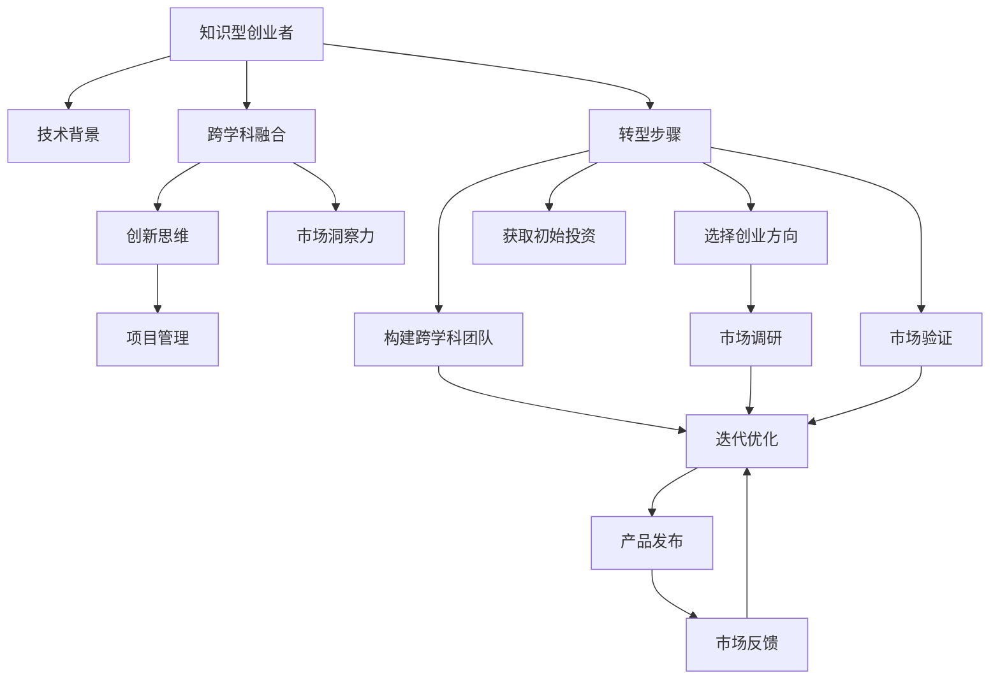

                 

# 程序员转型知识型创业者的成功案例

## 1. 背景介绍

### 1.1 问题由来

在数字化和智能化浪潮的推动下，传统IT从业人员面临职业转型和升级的紧迫需求。许多IT从业人员面临着技能陈旧、知识老化的问题，需要不断学习和适应新的技术和应用场景。知识型创业作为一种新兴的职业路径，为IT从业者提供了一个新的选择。

### 1.2 问题核心关键点

知识型创业的核心在于将专业知识转化为生产力，实现技术和市场对接。这一过程需要打破传统思维，构建跨学科的知识体系，并具备创新思维和市场洞察力。IT从业人员转型为知识型创业者，通常具备较强的技术背景，但在业务洞察、项目管理、产品规划等方面可能需要进一步提升。

## 2. 核心概念与联系

### 2.1 核心概念概述

- **知识型创业者(Knowledge-based Entrepreneur)**：指的是利用自身专业知识，通过技术创新和商业模式创新，创建新型企业和产品的创业者。通常具备丰富的专业背景，能够在技术驱动与市场需求的结合中找到机会。
- **跨学科融合(Cross-disciplinary Integration)**：指将不同领域的知识和技术融合在一起，形成新的应用场景和解决方案。知识型创业者需要具备多学科的知识背景，以便更好地理解市场和用户的真实需求。
- **创新思维(Out-of-the-box Thinking)**：指打破传统思维定式，寻求新颖的解决方案和思路。知识型创业者应具备敏锐的洞察力和创新能力，能够从非传统角度看待问题和挑战。
- **市场洞察力(Market Sensitivity)**：指理解市场需求、把握行业趋势的能力。知识型创业者需要具备较高的市场洞察力，能够在众多机会中发现最适合自己的创业方向。
- **项目管理(Product Management)**：指规划、执行和监控产品开发过程的活动。知识型创业者通常涉及技术开发和产品管理两方面的工作，需要具备良好的项目管理能力。

### 2.2 核心概念原理和架构的 Mermaid 流程图



## 3. 核心算法原理 & 具体操作步骤

### 3.1 算法原理概述

知识型创业者的转型过程，本质上是一个从技术到市场的知识转化过程。这一过程涉及技术研发、市场调研、商业模式设计等多个环节，需要系统化的规划和执行。

### 3.2 算法步骤详解

**Step 1: 识别转型机会**
- 分析自身技术背景和市场需求，识别可能转型的方向。例如，数据分析、人工智能、云计算等领域具有广阔的应用前景。
- 参加行业会议、网络课程、创业培训，了解最新技术和市场趋势。

**Step 2: 选择创业方向**
- 基于市场需求和技术趋势，选择最适合自己的创业方向。例如，基于大数据分析的精准营销、基于人工智能的智能客服等。
- 制定初步的商业计划，包括产品目标、市场定位、竞争分析等。

**Step 3: 组建跨学科团队**
- 根据创业方向，招募具有相应专业背景的团队成员。例如，数据科学家、产品经理、市场经理等。
- 确定团队成员的角色和职责，明确分工，建立有效的沟通机制。

**Step 4: 获取初始投资**
- 通过天使投资、风险投资、众筹等方式获取启动资金。
- 制定详细的资金使用计划，确保资金的高效使用。

**Step 5: 进行市场验证**
- 利用最小可行产品(MVP)进行市场验证，了解用户需求和产品反馈。
- 根据反馈进行产品迭代，优化用户体验和产品功能。

**Step 6: 技术开发与产品发布**
- 基于市场验证结果，进行全面的产品设计和开发。
- 发布产品，并进行市场营销和用户教育。

**Step 7: 市场反馈与迭代优化**
- 收集用户反馈，进行数据分析，优化产品功能。
- 持续迭代，不断提升产品性能和用户体验。

### 3.3 算法优缺点

**优点：**
- 技术基础扎实，可以快速进行技术研发和产品实现。
- 数据驱动思维，能够通过数据洞察市场需求，制定科学的商业模式。

**缺点：**
- 市场洞察力和业务管理能力较弱，需要不断学习和提升。
- 创业初期的资金和资源有限，需要谨慎规划和高效利用。

### 3.4 算法应用领域

知识型创业者的转型方法，适用于多个行业和领域。例如：

- **互联网创业**：基于互联网技术的电子商务、社交网络、在线教育等。
- **人工智能创业**：基于机器学习、深度学习、自然语言处理等技术的产品开发。
- **大数据创业**：基于数据分析和数据挖掘技术的数据服务、精准营销等。
- **健康医疗创业**：基于人工智能和物联网技术，开发健康监测、智能诊断等应用。

## 4. 数学模型和公式 & 详细讲解 & 举例说明

### 4.1 数学模型构建

知识型创业的转型过程可以通过以下数学模型进行建模：

设创业初期的市场需求为 $D$，技术投入为 $T$，市场推广投入为 $M$，运营成本为 $C$。目标函数为最大化收益 $R$，约束条件为：

$$
R = D \cdot p - T - M - C
$$

其中，$p$ 为产品的销售价格。

### 4.2 公式推导过程

根据上述模型，推导最大化收益的条件：

$$
\frac{\partial R}{\partial D} = p - \frac{\partial T}{\partial D} - \frac{\partial M}{\partial D} - \frac{\partial C}{\partial D} = 0
$$

解得：

$$
p = \frac{\partial T}{\partial D} + \frac{\partial M}{\partial D} + \frac{\partial C}{\partial D}
$$

即产品的销售价格应根据技术投入、市场推广投入和运营成本进行调整，以最大化收益。

### 4.3 案例分析与讲解

以某互联网企业的转型为例，分析其从传统IT向知识型创业的转型过程：

**背景：**
该企业原是一家传统IT公司，从事企业IT基础设施建设。随着数字化转型浪潮的兴起，公司面临技术陈旧、市场需求变化的问题。

**转型步骤：**
1. **识别转型机会**：分析市场需求和技术趋势，发现云计算、大数据和人工智能具有广阔的应用前景。
2. **选择创业方向**：决定转型为云服务平台和数据服务平台，提供云服务器、数据存储、数据分析等服务。
3. **组建跨学科团队**：组建由数据科学家、产品经理、市场经理等组成的团队，明确分工。
4. **获取初始投资**：通过天使投资获得启动资金，制定详细的资金使用计划。
5. **进行市场验证**：开发最小可行产品(MVP)进行市场测试，收集用户反馈。
6. **技术开发与产品发布**：基于市场验证结果，进行全面产品设计和开发，发布云服务平台和数据服务平台。
7. **市场反馈与迭代优化**：收集用户反馈，进行数据分析，不断优化产品功能，提升用户体验。

**结果：**
该企业在转型后，迅速占领市场，实现了从传统IT向知识型创业的成功转型，年营收增长显著。

## 5. 项目实践：代码实例和详细解释说明

### 5.1 开发环境搭建

在转型过程中，需要搭建一个支持数据处理、模型开发和项目管理的环境。以下是使用Python进行环境搭建的示例：

1. **安装Python和相关工具**：
   ```bash
   conda create -n python-env python=3.8
   conda activate python-env
   pip install numpy pandas matplotlib scikit-learn
   ```

2. **搭建数据处理环境**：
   ```bash
   conda install dask[complete]
   ```

3. **搭建模型开发环境**：
   ```bash
   conda install torch torchvision torchaudio
   ```

4. **搭建项目管理环境**：
   ```bash
   pip install flake8 black ruff
   ```

### 5.2 源代码详细实现

以下是一个基于Python的跨学科团队协作项目示例：

```python
# 数据处理模块
import pandas as pd
import numpy as np
import dask.dataframe as dd

def load_data():
    data = pd.read_csv('data.csv')
    data = dd.from_pandas(data, npartitions=4)
    return data

def preprocess_data(data):
    # 数据清洗和预处理
    ...

# 模型开发模块
import torch
import torch.nn as nn
import torch.optim as optim

class Model(nn.Module):
    def __init__(self):
        super(Model, self).__init__()
        # 定义模型结构

    def forward(self, x):
        # 前向传播
        ...

def train_model(data, model, optimizer):
    # 训练模型
    ...

# 项目管理模块
import flake8
import black
import ruff

def check_code_quality():
    flake8.check("path/to/code")
    black.format("path/to/code", target_version="py38")
    ruff.check("path/to/code")
```

### 5.3 代码解读与分析

**数据处理模块**：
- `load_data`函数：使用Pandas和Dask加载数据，并进行分块处理。
- `preprocess_data`函数：进行数据清洗和预处理，包括缺失值处理、特征工程等。

**模型开发模块**：
- `Model`类：定义了神经网络模型，包括层结构、激活函数等。
- `train_model`函数：实现模型的训练过程，包括定义损失函数、优化器等。

**项目管理模块**：
- `check_code_quality`函数：使用flake8、black、ruff等工具检查代码质量，确保代码风格一致性。

### 5.4 运行结果展示

通过上述代码，可以进行数据处理、模型训练和项目管理，最终实现产品的开发和发布。

## 6. 实际应用场景

### 6.1 互联网创业

互联网创业是知识型创业的重要方向之一。利用大数据、云计算、人工智能等技术，开发具有创新性的互联网产品，如社交网络、在线教育、电子商务等。

### 6.2 人工智能创业

人工智能领域的技术快速发展，为知识型创业提供了广阔的空间。基于机器学习、深度学习、自然语言处理等技术，开发智能客服、智能诊断、智能推荐等应用。

### 6.3 大数据创业

大数据技术的应用日益广泛，数据驱动决策成为企业和机构的核心需求。通过数据分析和数据挖掘技术，提供数据服务、精准营销、市场分析等解决方案。

### 6.4 未来应用展望

知识型创业的未来发展前景广阔，以下是几个可能的趋势：

- **跨界融合**：跨学科融合将成为主流，新技术和新应用将不断涌现。
- **数据驱动**：数据将成为创业的核心资源，数据分析和数据治理将成为重要能力。
- **技术创新**：不断追求技术前沿，保持技术优势和市场竞争力。
- **商业化加速**：通过快速迭代和市场验证，实现产品的快速商业化。
- **可持续发展**：注重社会责任和企业可持续发展，建立长期的商业生态。

## 7. 工具和资源推荐

### 7.1 学习资源推荐

为了帮助知识型创业者系统掌握相关知识，推荐以下学习资源：

1. **Coursera**：提供丰富的在线课程，涵盖数据科学、人工智能、云计算等多个领域。
2. **Udacity**：提供实战导向的项目课程，如人工智能工程师、数据科学家等。
3. **edX**：提供高水平的大学课程，如计算机科学、数据科学等。
4. **GitHub**：提供开源项目和代码库，学习最新的技术应用和最佳实践。
5. **Kaggle**：提供数据竞赛和数据集，实践数据科学和机器学习技能。

### 7.2 开发工具推荐

知识型创业者的转型过程中，需要多种工具的支持。以下是几个推荐的工具：

1. **Jupyter Notebook**：支持Python和R等语言的开发环境，提供代码编写、运行和文档编写的功能。
2. **Anaconda**：Python科学计算的生态系统，支持虚拟环境和工具包安装。
3. **PyCharm**：Python开发工具，提供调试、测试和代码编辑功能。
4. **VS Code**：轻量级代码编辑器，支持多种编程语言和扩展插件。
5. **Docker**：容器化工具，支持应用打包、发布和部署。

### 7.3 相关论文推荐

以下是几篇关于知识型创业的重要论文，推荐阅读：

1. "The Future of Work: Employment, Automation, and Economic Growth" by David Autor (2015)
2. "Innovation and Entrepreneurship: Strategy, Process and System" by Andrew R. Malhotra (2018)
3. "The Innovator's Dilemma: When New Technologies Cause Great Firms to Fail" by Clayton M. Christensen (1997)
4. "The Age of the Analyst: Use of Big Data by Managerial Executives" by Abdul Imran et al. (2015)
5. "Big Data Analytics: An Interactive Approach to Learning" by Joydeep Ghosh (2014)

## 8. 总结：未来发展趋势与挑战

### 8.1 研究成果总结

知识型创业是一种将技术知识转化为生产力的创业模式，具有广阔的发展前景。其核心在于跨学科融合、创新思维和市场洞察力。

### 8.2 未来发展趋势

1. **跨界融合**：跨学科融合将成为主流，新技术和新应用将不断涌现。
2. **数据驱动**：数据将成为创业的核心资源，数据分析和数据治理将成为重要能力。
3. **技术创新**：不断追求技术前沿，保持技术优势和市场竞争力。
4. **商业化加速**：通过快速迭代和市场验证，实现产品的快速商业化。
5. **可持续发展**：注重社会责任和企业可持续发展，建立长期的商业生态。

### 8.3 面临的挑战

1. **技术快速变化**：技术更新换代速度加快，需要持续学习新知识和新技术。
2. **市场竞争激烈**：市场竞争日益激烈，需要具备敏锐的市场洞察力和创新思维。
3. **资源和资金**：创业初期的资源和资金有限，需要合理规划和高效利用。
4. **产品验证**：从技术到市场的转化需要经过多次验证和优化，存在失败风险。
5. **团队建设**：跨学科团队建设和管理需要时间和精力，需要有效沟通和协作。

### 8.4 研究展望

未来知识型创业的研究方向包括：

1. **技术创新**：探索新的技术应用，解决实际问题。
2. **商业模式**：研究创新的商业模式，提高市场竞争力。
3. **跨学科融合**：探索跨学科融合的新领域和应用场景。
4. **数据治理**：研究数据治理和数据隐私保护问题。
5. **可持续发展**：探索可持续发展的商业模型和运营策略。

## 9. 附录：常见问题与解答

**Q1: 如何选择合适的创业方向？**

A: 根据市场需求和技术趋势，选择最适合自己的创业方向。可以参加行业会议、网络课程、创业培训，了解最新技术和市场趋势。

**Q2: 创业初期如何获取初始投资？**

A: 通过天使投资、风险投资、众筹等方式获取启动资金。制定详细的资金使用计划，确保资金的高效使用。

**Q3: 如何组建跨学科团队？**

A: 根据创业方向，招募具有相应专业背景的团队成员。明确分工，建立有效的沟通机制。

**Q4: 如何提高创业项目的技术竞争力？**

A: 不断追求技术前沿，保持技术优势和市场竞争力。定期进行技术培训和知识更新，保持技术领先。

**Q5: 如何应对技术快速变化带来的挑战？**

A: 持续学习和适应新技术，通过快速迭代和市场验证，不断优化产品功能。

---

作者：禅与计算机程序设计艺术 / Zen and the Art of Computer Programming

