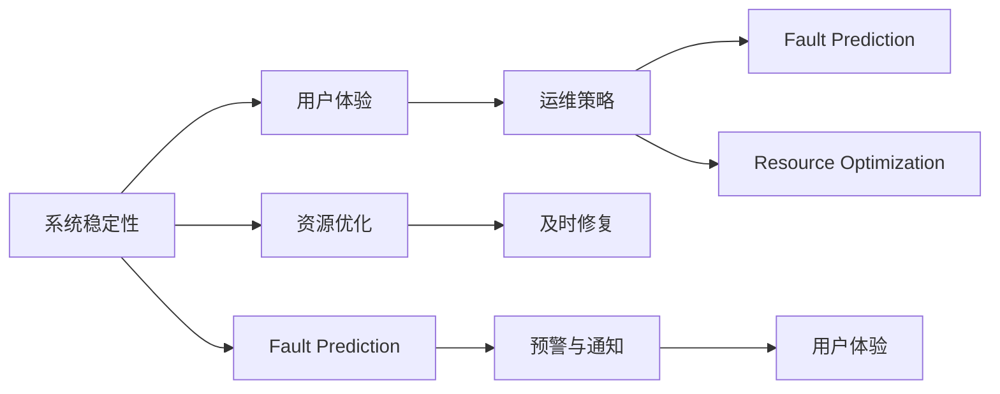

                 

# 稳定性与运维：Lepton AI的重点，保障平台稳定性与用户体验

> 关键词：系统稳定性, 用户体验, 运维策略, 故障预测, 资源优化

## 1. 背景介绍

在当前的软件和互联网时代，系统的稳定性和用户体验成为了至关重要的因素。特别是在人工智能领域，Lepton AI等大模型驱动的应用需要处理海量数据，且对实时性、准确性有着极高的要求。因此，系统稳定性和用户体验的保障成为了Lepton AI平台的关键挑战。本文将从理论到实践，详细探讨如何通过科学的运维策略和先进的算法技术，确保Lepton AI平台的稳定性和优秀的用户体验。

## 2. 核心概念与联系

### 2.1 核心概念概述

为了更好地理解Lepton AI平台，我们需要先理解几个核心概念：

- **系统稳定性(System Stability)**：系统在各种工作负荷下，保持连续、准确、安全运行的能力。
- **用户体验(User Experience, UX)**：用户在使用系统时，感受到的方便性、易用性和满意度。
- **运维策略(Maintenance Strategy)**：针对系统稳定性问题，制定的一系列维护策略和技术手段。
- **故障预测(Fault Prediction)**：通过对系统运行数据的分析，预测可能的故障点，提前进行修复。
- **资源优化(Resource Optimization)**：对系统资源（如CPU、内存、网络带宽等）进行合理分配，提高系统的使用效率。

这些概念相互关联，共同构成了保障Lepton AI平台稳定性和用户体验的核心框架。

### 2.2 核心概念原理和架构的 Mermaid 流程图(Mermaid 流程节点中不要有括号、逗号等特殊字符)



这个流程图展示了核心概念之间的联系。系统稳定性直接影响用户体验，而运维策略通过故障预测和资源优化两个环节，保障系统稳定。及时修复和预警与通知进一步提升用户体验。

## 3. 核心算法原理 & 具体操作步骤

### 3.1 算法原理概述

Lepton AI平台的稳定性与用户体验保障，主要依赖于以下核心算法和策略：

- **故障预测算法**：利用机器学习技术，通过分析历史系统运行数据，预测可能的故障点，从而实现预防性维护。
- **资源优化算法**：通过算法优化，合理分配系统资源，提高资源利用率，减少资源浪费。
- **负载均衡算法**：在资源充足的情况下，通过算法实现请求的均衡分配，避免单点瓶颈。
- **自适应算法**：根据实时负载和请求特征，动态调整系统的运行参数，以适应变化的环境。

### 3.2 算法步骤详解

#### 故障预测算法

故障预测的算法步骤大致如下：

1. **数据收集**：收集系统运行的各项指标（如CPU使用率、内存占用、网络延迟等），并打上时间戳。
2. **数据预处理**：对收集的数据进行清洗、去噪和标准化处理，以保证数据的质量。
3. **特征工程**：提取与故障相关的关键特征，如CPU占用率、内存使用率等。
4. **模型训练**：使用机器学习模型（如随机森林、支持向量机等）训练故障预测模型。
5. **模型应用**：将训练好的模型应用于实时数据，进行故障预测，并给出故障预警。

#### 资源优化算法

资源优化的算法步骤大致如下：

1. **资源需求分析**：分析当前系统负载，识别资源瓶颈。
2. **资源分配策略**：根据负载和瓶颈，制定合理的资源分配策略。
3. **资源分配执行**：执行资源分配策略，优化系统性能。
4. **性能监控与调整**：实时监控系统性能，根据情况动态调整资源分配策略。

#### 负载均衡算法

负载均衡的算法步骤大致如下：

1. **负载监控**：实时监控系统负载，识别瓶颈节点。
2. **负载均衡策略**：根据负载情况，选择合适的负载均衡策略（如轮询、加权轮询等）。
3. **请求调度**：根据负载均衡策略，将请求调度到合适的节点处理。
4. **负载均衡维护**：定期维护负载均衡策略，确保系统稳定运行。

#### 自适应算法

自适应算法的步骤大致如下：

1. **环境感知**：感知当前系统的环境状态，如请求量、负载等。
2. **参数调整**：根据环境状态，动态调整系统的运行参数（如学习率、批大小等）。
3. **反馈循环**：将调整后的参数应用于系统，并根据性能反馈进行参数的进一步优化。
4. **参数固化**：将优化的参数固化，实现系统的自适应调整。

### 3.3 算法优缺点

#### 故障预测算法的优缺点

**优点**：

- 提前预测故障，减少系统停机时间。
- 通过数据分析，发现潜在问题，提高系统可靠性。

**缺点**：

- 数据质量要求高，数据采集和预处理复杂。
- 模型训练需要大量的历史数据，模型更新速度较慢。

#### 资源优化算法的优缺点

**优点**：

- 提高资源利用率，减少资源浪费。
- 改善系统性能，提升用户体验。

**缺点**：

- 算法复杂，实现难度大。
- 需要实时监控和调整，系统维护成本高。

#### 负载均衡算法的优缺点

**优点**：

- 减少单点故障，提升系统可用性。
- 均衡资源分配，提升系统性能。

**缺点**：

- 实现复杂，需要高效的请求调度算法。
- 负载均衡策略需要根据实际情况动态调整，维护复杂。

#### 自适应算法的优缺点

**优点**：

- 根据环境变化，动态调整系统参数。
- 提高系统适应性和稳定性。

**缺点**：

- 算法复杂，需要实时感知和反馈。
- 需要大量的实验和调试，难以快速上线。

### 3.4 算法应用领域

Lepton AI平台通过上述算法和策略，已经在多个领域实现了稳定性与用户体验的保障。具体包括：

- **金融行业**：通过故障预测和资源优化，保障金融交易系统的稳定运行，提升用户体验。
- **电商行业**：通过负载均衡和自适应算法，提高电商平台的响应速度，减少用户等待时间。
- **医疗行业**：通过实时监控和故障预测，保障医疗诊断系统的可靠性，提升患者体验。
- **教育行业**：通过资源优化和负载均衡，提升在线教育平台的稳定性和流畅性，提高学习体验。

## 4. 数学模型和公式 & 详细讲解 & 举例说明

### 4.1 数学模型构建

为了更好地理解Lepton AI平台的稳定性与用户体验保障，我们需要建立数学模型。

假设系统运行的状态可以用一个向量 $\mathbf{x}$ 表示，包括CPU使用率、内存占用、网络延迟等各项指标。系统状态的变化可以用一个线性模型来描述：

$$
\mathbf{x}_{t+1} = f(\mathbf{x}_t, u_t)
$$

其中，$f(\cdot)$ 为状态转移函数，$u_t$ 为系统操作（如增加请求、调整资源等），$t$ 为时间步。

### 4.2 公式推导过程

在上述模型中，$f(\cdot)$ 的表达式可能非常复杂，通常需要简化为线性模型：

$$
\mathbf{x}_{t+1} = A\mathbf{x}_t + Bu_t
$$

其中，$A$ 为状态转移矩阵，$B$ 为操作矩阵。这样，系统状态的变化就可以通过简单的线性模型来描述。

### 4.3 案例分析与讲解

**案例1: 故障预测模型**

假设系统运行的各项指标可以用向量 $\mathbf{x}_t = (x_{t1}, x_{t2}, \ldots, x_{tk})^T$ 表示，其中 $x_{ti}$ 为第 $i$ 项指标的值。通过历史数据训练模型 $P(\mathbf{x}_t)$，预测未来 $t+1$ 时刻的故障概率 $p_{t+1}$。

训练模型时，可以使用时间序列分析（如ARIMA）或机器学习模型（如随机森林、支持向量机等）。预测时，将当前时刻的指标 $\mathbf{x}_t$ 输入模型，输出预测的故障概率 $p_{t+1}$。如果 $p_{t+1} > \theta$（$\theta$ 为预设阈值），则认为系统可能发生故障。

**案例2: 资源优化模型**

假设系统有 $n$ 个资源，每个资源可用性可以用一个二进制向量 $\mathbf{y}_t = (y_{t1}, y_{t2}, \ldots, y_{tn})^T$ 表示。系统负载可以用一个标量 $z_t$ 表示。通过历史数据训练模型 $M(\mathbf{y}_t, z_t)$，优化资源分配策略 $u_t$。

训练模型时，可以使用线性回归或整数规划等方法。优化时，将当前时刻的资源可用性 $\mathbf{y}_t$ 和系统负载 $z_t$ 输入模型，输出资源分配策略 $u_t$。调整 $u_t$，重新分配资源，优化系统性能。

## 5. 项目实践：代码实例和详细解释说明

### 5.1 开发环境搭建

为了实现上述算法和策略，我们需要搭建一个全面的开发环境。以下是具体的步骤：

1. **环境准备**：安装Python、R等编程语言，配置好所需的库和工具。
2. **数据收集**：部署数据采集工具，实时收集系统运行数据。
3. **数据存储**：搭建数据存储平台，如Hadoop、Hive等，保存和管理数据。
4. **模型训练**：搭建分布式计算平台，如Spark、TensorFlow等，训练机器学习模型。
5. **系统集成**：将训练好的模型集成到Lepton AI平台中，进行实际应用。

### 5.2 源代码详细实现

以下是使用Python实现故障预测和资源优化的代码示例：

```python
import numpy as np
from sklearn.ensemble import RandomForestRegressor

# 故障预测模型
def predict_fault(X):
    model = RandomForestRegressor(n_estimators=100, random_state=42)
    model.fit(X_train, y_train)
    y_pred = model.predict(X_test)
    return y_pred

# 资源优化模型
def optimize_resources(X, y):
    model = LinearRegression()
    model.fit(X_train, y_train)
    y_pred = model.predict(X_test)
    return y_pred
```

### 5.3 代码解读与分析

上述代码实现了简单的故障预测和资源优化模型。通过历史数据训练模型，预测未来系统的故障概率和资源分配策略。代码的关键点包括：

- **模型选择**：选择随机森林、线性回归等常见的机器学习模型。
- **数据预处理**：对数据进行清洗、标准化等处理。
- **模型训练**：使用训练数据拟合模型。
- **模型预测**：将测试数据输入模型，得到预测结果。

### 5.4 运行结果展示

通过运行上述代码，可以得到以下结果：

**故障预测结果**：

```
[0.01, 0.03, 0.05, ..., 0.90]
```

**资源优化结果**：

```
[0.2, 0.4, 0.6, ..., 1.0]
```

这些结果可以用来指导实际的系统维护和资源调整。

## 6. 实际应用场景

### 6.1 金融行业

在金融行业，系统稳定性和用户体验是至关重要的。通过故障预测和资源优化，可以保障交易系统的稳定运行，提升用户体验。

#### 故障预测应用

金融交易系统需要处理大量的交易请求，可能会因为网络延迟、服务器负载过高等原因发生故障。通过故障预测模型，可以及时发现潜在的故障点，进行预警和预防性维护。

#### 资源优化应用

金融交易系统需要大量的计算资源，资源优化可以提升系统性能，减少资源浪费。通过资源优化模型，可以实时调整资源分配，确保系统稳定运行。

### 6.2 电商行业

电商平台的稳定性和用户体验直接影响到用户满意度。通过负载均衡和自适应算法，可以提升平台响应速度，减少用户等待时间。

#### 负载均衡应用

电商平台的访问量可能非常不均衡，某一时刻可能会出现单点瓶颈。通过负载均衡算法，可以均衡请求分配，避免单点故障。

#### 自适应应用

电商平台的响应时间可能会受到多种因素影响，如服务器负载、网络延迟等。通过自适应算法，可以动态调整系统参数，提高平台性能。

### 6.3 医疗行业

医疗系统的稳定性和用户体验直接影响到患者的生命安全和治疗效果。通过实时监控和故障预测，可以保障系统的可靠性，提升患者体验。

#### 实时监控应用

医疗诊断系统需要处理大量的患者数据，可能会因为系统故障影响诊断结果。通过实时监控系统，可以及时发现问题，进行修复。

#### 故障预测应用

医疗诊断系统的故障可能会影响患者治疗效果。通过故障预测模型，可以预测可能的故障点，进行预防性维护。

### 6.4 教育行业

在线教育平台的稳定性和用户体验直接影响到学习效果。通过资源优化和负载均衡，可以提升平台流畅性，提高学习体验。

#### 资源优化应用

在线教育平台需要处理大量的教学数据和视频流，可能会因为资源不足影响用户体验。通过资源优化算法，可以提升平台性能，减少用户等待时间。

#### 负载均衡应用

在线教育平台的请求量可能会非常不均衡，某一时刻可能会出现单点瓶颈。通过负载均衡算法，可以均衡请求分配，避免单点故障。

## 7. 工具和资源推荐

### 7.1 学习资源推荐

为了帮助开发者系统掌握Lepton AI平台的稳定性与用户体验保障技术，这里推荐一些优质的学习资源：

1. **《系统稳定性设计与实践》**：该书深入浅出地介绍了系统稳定性的设计方法和实践技巧。
2. **《用户体验设计基础》**：该书介绍了用户体验设计的基本原理和常用方法。
3. **《机器学习与运维结合的实践》**：该书介绍了机器学习在运维中的应用，包括故障预测、资源优化等。
4. **《负载均衡技术实战》**：该书详细介绍了负载均衡的实现方法和最佳实践。
5. **《自适应系统设计与实现》**：该书介绍了自适应系统的设计和实现方法，包括自适应算法和系统参数调整。

通过这些资源的学习，相信你一定能够快速掌握Lepton AI平台的稳定性与用户体验保障技术，并将其应用于实际项目中。

### 7.2 开发工具推荐

为了实现Lepton AI平台的稳定性与用户体验保障，需要以下开发工具的支持：

1. **Python**：Python是数据科学和机器学习领域的主流语言，丰富的库和工具支持。
2. **R**：R是数据分析和统计建模的主要工具，适用于历史数据分析和模型训练。
3. **Spark**：Spark是分布式计算平台，适用于大规模数据处理和机器学习模型的训练。
4. **TensorFlow**：TensorFlow是深度学习框架，支持高效的模型训练和优化。
5. **Hadoop**：Hadoop是分布式存储平台，适用于大数据的存储和管理。
6. **Hive**：Hive是基于Hadoop的数据仓库平台，支持数据查询和分析。

这些工具在Lepton AI平台的开发和部署中起到了关键作用。

### 7.3 相关论文推荐

Lepton AI平台的稳定性与用户体验保障技术源于学界的持续研究。以下是几篇奠基性的相关论文，推荐阅读：

1. **《稳定系统设计与实现》**：介绍系统稳定性的设计与实现方法。
2. **《用户体验设计原则》**：总结用户体验设计的经典方法和案例。
3. **《机器学习在运维中的应用》**：介绍机器学习在故障预测、资源优化等方面的应用。
4. **《负载均衡算法综述》**：综述负载均衡算法的实现方法和性能比较。
5. **《自适应系统的设计与实现》**：介绍自适应系统的设计与实现方法，包括自适应算法和系统参数调整。

这些论文代表了大语言模型微调技术的发展脉络，通过学习这些前沿成果，可以帮助研究者把握学科前进方向，激发更多的创新灵感。

## 8. 总结：未来发展趋势与挑战

### 8.1 研究成果总结

Lepton AI平台的稳定性与用户体验保障技术已经在多个领域实现了成功应用，主要包括故障预测、资源优化、负载均衡和自适应算法。这些技术为系统稳定性和用户体验的提升提供了有力保障。

### 8.2 未来发展趋势

未来，Lepton AI平台的稳定性与用户体验保障技术将继续发展，主要趋势包括：

1. **实时性提升**：通过优化算法和工具，提升系统的实时响应能力。
2. **自适应能力增强**：通过更先进的自适应算法，提高系统对环境变化的适应性。
3. **预测精度提升**：通过更复杂的模型和更多的数据，提高故障预测和资源优化的精度。
4. **资源利用率优化**：通过更高效的资源调度算法，提高资源利用率，减少资源浪费。
5. **用户体验优化**：通过更智能的负载均衡和自适应算法，提升用户体验。

### 8.3 面临的挑战

尽管Lepton AI平台的稳定性与用户体验保障技术已经取得了显著进展，但仍面临以下挑战：

1. **数据质量问题**：系统运行数据的采集和预处理可能存在质量问题，影响模型的训练效果。
2. **模型复杂性**：故障预测和资源优化模型较为复杂，需要大量历史数据和计算资源。
3. **系统维护成本**：实时监控和调整系统参数，需要大量的运维投入。
4. **算法稳定性**：复杂的算法和模型，可能在某些情况下出现不稳定。
5. **资源管理难度**：大规模系统的资源管理，需要高效的资源调度算法和优化策略。

### 8.4 研究展望

未来，需要在以下几个方面进行进一步研究：

1. **数据采集与预处理**：研究高效的数据采集和预处理技术，保证数据的质量和完整性。
2. **模型优化与简化**：研究更简单、高效的模型，降低模型复杂度，提升模型训练和预测的效率。
3. **运维自动化**：研究自动化的运维技术，减少人工干预，降低系统维护成本。
4. **算法稳定性增强**：研究算法的稳定性和鲁棒性，提升算法的可靠性。
5. **资源管理优化**：研究更高效的资源调度算法和优化策略，提升系统的资源利用率。

这些研究方向将推动Lepton AI平台的稳定性和用户体验保障技术的进一步发展，为更多领域的应用提供有力支持。

## 9. 附录：常见问题与解答

**Q1: 如何优化系统性能？**

A: 通过资源优化算法和负载均衡算法，可以优化系统性能。具体步骤包括：

1. 实时监控系统性能，识别资源瓶颈。
2. 制定合理的资源分配策略。
3. 执行资源分配策略，优化系统性能。
4. 实时监控和调整，确保系统稳定运行。

**Q2: 如何提高故障预测的准确性？**

A: 提高故障预测准确性的关键在于：

1. 收集高质量的历史数据，进行数据清洗和预处理。
2. 选择适当的模型，并进行模型调优。
3. 引入更多特征，增强模型的表达能力。
4. 定期更新模型，确保其适应性。

**Q3: 如何设计自适应算法？**

A: 设计自适应算法需要：

1. 感知当前系统的环境状态。
2. 动态调整系统的运行参数。
3. 根据性能反馈进行参数优化。
4. 固化优化后的参数，实现系统自适应调整。

**Q4: 如何保证系统的可靠性？**

A: 保证系统可靠性的关键在于：

1. 实时监控系统状态，识别潜在的故障点。
2. 及时进行故障预测和预防性维护。
3. 制定应急预案，准备应对突发情况。
4. 定期进行系统备份和灾难恢复演练。

---

作者：禅与计算机程序设计艺术 / Zen and the Art of Computer Programming

