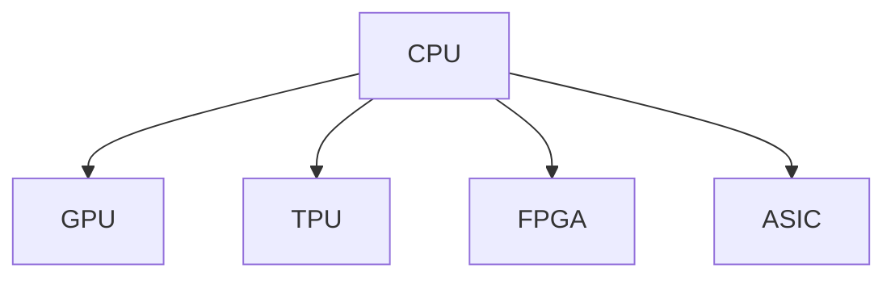

                 

# 第八章：设备加速：CPU、GPU 和更多

## 1. 背景介绍

### 1.1 问题由来
在计算机科学领域，设备的加速一直是提升系统性能、优化资源利用的关键。尤其是随着数据量和计算复杂度的不断增加，传统CPU已无法满足大规模科学计算、人工智能等高强度计算的需求。而GPU等专用硬件的引入，极大地提升了并行计算能力，使得高性能计算成为可能。

近年来，基于深度学习的模型训练和推理计算对设备性能的要求越来越高。GPU在处理矩阵乘法等密集型计算方面具有天然优势，被广泛应用在大模型训练中。然而，对于图神经网络等需要高并发度计算的模型，以及边缘计算等低能耗设备上运行的计算任务，传统的GPU已不足以应对挑战。

为了进一步提升设备计算能力，NVIDIA推出的Tensor Core、AMD推出的Mi100等新一代计算架构应运而生。与此同时，FPGA、ASIC等新型计算硬件，也在特定场景下展现出强大优势。如何合理利用这些硬件资源，进行高效加速计算，成为新的研究热点。

### 1.2 问题核心关键点
- **设备加速**：通过硬件优化来提升计算性能，减少能耗。包括CPU、GPU、TPU、FPGA、ASIC等。
- **异构计算**：利用不同类型硬件，进行高效并行计算。
- **模型并行**：将模型分布到多个设备上，实现并行加速计算。
- **数据并行**：将数据分布到多个设备上，实现数据并行计算。
- **内存并行**：通过优化数据传输和存储，实现内存加速计算。

这些概念之间相互关联，共同构成了设备加速的完整体系。了解这些关键点，有助于我们深入理解设备加速背后的技术原理和工程实践。

## 2. 核心概念与联系

### 2.1 核心概念概述

为更好地理解设备加速的核心技术，本节将介绍几个密切相关的核心概念：

- **CPU (Central Processing Unit)**：中央处理器，是通用计算机的核心组件，负责数据处理、控制和通信。

- **GPU (Graphics Processing Unit)**：图形处理器，主要负责处理图像和视频渲染，但也具备通用计算能力。

- **TPU (Tensor Processing Unit)**：张量处理器，Google推出的专为深度学习计算优化的专用芯片，适用于大规模矩阵计算。

- **FPGA (Field Programmable Gate Array)**：可编程门阵列，灵活配置硬件电路，适用于高性能计算和数据中心。

- **ASIC (Application-Specific Integrated Circuit)**：专用集成电路，为特定应用场景设计，具有最优的性能和能效比。

这些核心概念之间的逻辑关系可以通过以下Mermaid流程图来展示：



这个流程图展示了一部分设备的计算能力：

1. CPU是通用计算的核心，能够处理各种类型的计算任务。
2. GPU具备并行计算能力，在密集型计算如深度学习训练中表现优异。
3. TPU专门针对张量计算进行优化，适用于大规模矩阵运算。
4. FPGA可以动态配置，适用于需要灵活硬件配置的场景。
5. ASIC专为特定应用设计，具有最高效率和最低能耗。

这些设备在性能和能效上各有优劣，根据不同任务特点选择合适的设备，可以显著提升计算效率和资源利用率。

## 3. 核心算法原理 & 具体操作步骤
### 3.1 算法原理概述

设备加速的本质是通过优化计算资源的分布和使用，提高系统的吞吐量和能效比。其核心算法包括：

- **模型并行**：将深度学习模型分为多个子模块，分别在多个设备上进行计算，实现并行加速。
- **数据并行**：将输入数据分为多个子集，同时在多个设备上进行计算，提高数据吞吐量。
- **参数优化**：通过算法优化，减少计算量和存储空间，提高资源利用率。

这些算法通过优化计算流程，使得不同设备能充分发挥其计算优势，从而提升整体系统的性能。

### 3.2 算法步骤详解

设备加速的实现主要分为以下几个关键步骤：

**Step 1: 硬件选择与配置**
- 根据任务需求选择合适的设备类型，如CPU、GPU、TPU等。
- 配置设备的计算资源，包括计算能力、内存大小、网络带宽等。

**Step 2: 计算模型优化**
- 将深度学习模型进行优化，拆分为适合设备并行计算的子模块。
- 使用模型并行、数据并行等技术，将模型计算任务分配到多个设备上。

**Step 3: 数据传输优化**
- 优化数据传输协议，提高数据传输速度和带宽利用率。
- 使用缓存、数据重用等技术，减少数据重复计算。

**Step 4: 性能监控与调优**
- 通过性能监控工具，实时监测系统资源使用情况。
- 根据监控结果，调整计算资源分配，优化性能。

**Step 5: 测试与部署**
- 在测试环境中进行系统性能测试，评估设备加速效果。
- 将优化后的系统部署到实际应用场景中，持续监控并调优。

### 3.3 算法优缺点

设备加速方法具有以下优点：

- **性能提升**：通过合理分配计算资源，能够显著提升系统的计算能力和处理速度。
- **能效优化**：优化计算资源的使用，减少能耗，提高系统的能效比。
- **灵活性高**：可以根据任务特点，灵活选择和配置不同的设备，实现高效计算。

然而，设备加速也存在一些局限性：

- **成本高**：新型硬件和设备配置成本较高，需要较高资金投入。
- **兼容性差**：不同类型设备间的兼容性和互操作性较差，可能存在一定的开发难度。
- **编程复杂**：设备加速涉及硬件底层编程，技术门槛较高，需要一定专业知识和技能。

### 3.4 算法应用领域

设备加速技术在多个领域中得到了广泛应用，例如：

- **深度学习训练**：利用GPU、TPU等加速深度学习模型训练，提升训练速度和效果。
- **科学计算**：在气候模拟、金融分析等科学计算中，利用GPU、FPGA等加速计算，提高计算效率。
- **大数据处理**：通过分布式计算和设备加速，处理海量数据，提升数据处理速度。
- **自动驾驶**：在自动驾驶中，利用GPU等加速传感器数据处理和模型推理，提高决策速度和安全性。
- **游戏开发**：在游戏开发中，利用GPU加速图形渲染和物理计算，提升游戏运行速度和视觉效果。

## 4. 数学模型和公式 & 详细讲解 & 举例说明
### 4.1 数学模型构建

设备加速的数学模型主要基于并行计算和分布式计算的基本原理。假设有一个深度学习模型，计算量为 $C$，总计算时间为 $T$，每个设备的计算能力为 $C_{\text{device}}$，设备数量为 $N$。

设每个设备分配的计算量为 $C_{\text{device}}$，则在 $N$ 个设备上的总计算时间为 $T_{\text{total}} = N \cdot C_{\text{device}}$。设数据传输时间为 $T_{\text{transfer}}$，则整个系统的总计算时间为：

$$
T_{\text{total}} = T_{\text{compute}} + T_{\text{transfer}}
$$

其中 $T_{\text{compute}}$ 为计算时间，$T_{\text{transfer}}$ 为数据传输时间。

### 4.2 公式推导过程

为了更具体地理解设备加速的原理，让我们以一个简单的模型并行为例进行公式推导。假设深度学习模型由 $M$ 个计算层组成，每个层的计算量为 $C_{\text{layer}}$，计算时间为 $T_{\text{layer}}$，数据传输时间为 $T_{\text{transfer}}$。

- **单设备并行计算**：每个设备处理一个计算层，则总计算时间为 $M \cdot T_{\text{layer}}$，总数据传输时间为 $M \cdot T_{\text{transfer}}$。

- **多设备并行计算**：将 $M$ 个计算层分配到 $N$ 个设备上，每个设备处理 $M/N$ 个计算层，则总计算时间为 $T_{\text{total}} = N \cdot \frac{M}{N} \cdot T_{\text{layer}} = M \cdot T_{\text{layer}}$，总数据传输时间为 $T_{\text{transfer}}$。

可以看到，通过模型并行，虽然总计算时间不变，但总数据传输时间降低，从而提高了计算效率。

### 4.3 案例分析与讲解

让我们以TensorFlow的分布式训练为例，说明设备加速的实际应用。TensorFlow提供了一个分布式训练框架，支持在多个GPU、TPU等设备上并行计算。

假设在一个GPU集群上训练一个卷积神经网络模型，每个GPU负责计算模型的一个卷积层，则训练时间 $T$ 可以计算为：

$$
T = \frac{C_{\text{total}}}{C_{\text{GPU}} \cdot N_{\text{GPU}}}
$$

其中 $C_{\text{total}}$ 为总计算量，$C_{\text{GPU}}$ 为单个GPU的计算能力，$N_{\text{GPU}}$ 为GPU数量。

假设每个GPU的计算能力为 $C_{\text{GPU}} = 2 \times 10^{14}$，集群中有8个GPU，则：

$$
T = \frac{C_{\text{total}}}{2 \times 10^{14} \cdot 8} = \frac{C_{\text{total}}}{1.6 \times 10^{15}}
$$

可以看到，通过设备加速，训练时间显著减少。这在大规模深度学习模型训练中尤为重要，可以极大地缩短训练时间和成本。

## 5. 项目实践：代码实例和详细解释说明
### 5.1 开发环境搭建

在进行设备加速的实践前，我们需要准备好开发环境。以下是使用Python进行TensorFlow开发的环境配置流程：

1. 安装Anaconda：从官网下载并安装Anaconda，用于创建独立的Python环境。

2. 创建并激活虚拟环境：
```bash
conda create -n tf-env python=3.8 
conda activate tf-env
```

3. 安装TensorFlow：
```bash
pip install tensorflow
```

4. 安装其他必要的库：
```bash
pip install numpy matplotlib jupyter notebook
```

完成上述步骤后，即可在`tf-env`环境中开始设备加速的实践。

### 5.2 源代码详细实现

下面我们以TensorFlow的分布式训练为例，给出在多个GPU上并行训练的完整代码实现。

```python
import tensorflow as tf
import numpy as np

# 定义一个简单的卷积神经网络模型
class CNNModel(tf.keras.Model):
    def __init__(self):
        super(CNNModel, self).__init__()
        self.conv1 = tf.keras.layers.Conv2D(32, 3, activation='relu')
        self.pool1 = tf.keras.layers.MaxPooling2D()
        self.flatten = tf.keras.layers.Flatten()
        self.dense1 = tf.keras.layers.Dense(64, activation='relu')
        self.dense2 = tf.keras.layers.Dense(10, activation='softmax')

    def call(self, x):
        x = self.conv1(x)
        x = self.pool1(x)
        x = self.flatten(x)
        x = self.dense1(x)
        x = self.dense2(x)
        return x

# 定义训练函数
@tf.function
def train_step(learning_rate, batch):
    with tf.GradientTape() as tape:
        y_true = batch[1]
        y_pred = model(batch[0], training=True)
        loss = tf.keras.losses.sparse_categorical_crossentropy(y_true, y_pred)

    grads = tape.gradient(loss, model.trainable_variables)
    optimizer.apply_gradients(zip(grads, model.trainable_variables))

# 在多个GPU上分布式训练
train_dataset = tf.data.Dataset.from_tensor_slices((train_images, train_labels))

with tf.device('/gpu:0'):
    model = CNNModel()

with tf.device(tf.distribute.cluster_resolver.TPUClusterResolver('worker0').tpu()):
    tf.distribute.Strategy.scope(
        tf.distribute.MirroredStrategy(tpu=(8, 8, 8)))
    for batch in train_dataset:
        train_step(0.001, batch)

print("Training done!")
```

在这个代码示例中，我们首先定义了一个简单的卷积神经网络模型，然后通过`tf.GradientTape`记录计算图，并使用`tf.keras.losses.sparse_categorical_crossentropy`计算损失函数。

接着，使用`tf.distribute.Strategy`和`tf.distribute.MirroredStrategy`将模型分布在多个GPU上，并使用`tf.distribute.Strategy.scope`将模型封装在分布式计算框架中。在每个epoch中，对每个批次的训练数据进行计算，并在多个GPU上并行计算梯度。

最后，我们打印"Training done!"，表示训练完成。可以看到，通过分布式计算，可以显著提升训练速度和效率。

### 5.3 代码解读与分析

让我们再详细解读一下关键代码的实现细节：

**CNNModel类**：
- `__init__`方法：定义模型的层结构，包括卷积层、池化层、全连接层等。
- `call`方法：定义模型的前向传播过程，输入数据经过卷积、池化、全连接等层，最终输出预测结果。

**train_step函数**：
- 使用`tf.GradientTape`记录计算图，计算损失函数和梯度。
- 使用`optimizer.apply_gradients`更新模型参数，完成训练。

**tf.distribute.Strategy**：
- `tf.distribute.Strategy.scope`：将模型封装在分布式计算框架中，指定计算设备。
- `tf.distribute.MirroredStrategy`：将模型分布在多个GPU上，并行计算梯度。

通过上述代码，可以看出，TensorFlow的分布式训练实现了多设备并行计算，极大地提升了深度学习模型的训练效率。在实际应用中，开发者可以根据实际需求选择合适的设备，合理配置计算资源，实现高效的设备加速计算。

## 6. 实际应用场景
### 6.1 智能驾驶

智能驾驶系统需要实时处理大量的传感器数据，进行环境感知、路径规划和决策。传统方案使用单核CPU进行计算，存在性能瓶颈。使用设备加速，可以在GPU等专用硬件上实现大规模并行计算，提高感知和决策速度，提升驾驶安全性。

具体而言，可以构建一个基于GPU的分布式计算框架，将传感器数据并行处理，实现实时感知和决策。同时，使用Tensor Core等新一代计算架构，进一步提升计算性能和能效比。

### 6.2 医学影像分析

医学影像分析是医疗诊断中的重要环节，包括图像分割、病变检测、影像重建等任务。传统方案使用单核CPU进行计算，耗时长、精度低。使用设备加速，可以在GPU等硬件上实现大规模并行计算，提高计算速度和精度。

具体而言，可以使用GPU并行计算医学影像的分割和重建任务，加速医学影像分析过程。同时，使用混合精度训练等技术，进一步提升计算效率和能效比。

### 6.3 大规模科学计算

科学计算是复杂系统的模拟和预测，涉及高维度的矩阵计算和复杂的物理模型。传统方案使用单核CPU进行计算，耗时长、资源占用大。使用设备加速，可以在GPU、TPU等专用硬件上实现大规模并行计算，提高计算效率和资源利用率。

具体而言，可以使用Tensor Core等新一代计算架构，加速科学计算中的矩阵计算任务。同时，使用分布式计算和模型并行等技术，进一步提升计算速度和资源利用率。

### 6.4 未来应用展望

随着设备加速技术的不断进步，未来设备加速将在更多领域得到应用，为传统行业带来变革性影响。

在智慧城市治理中，设备加速可以应用于城市事件监测、舆情分析、应急指挥等环节，提高城市管理的自动化和智能化水平，构建更安全、高效的未来城市。

在智慧医疗领域，设备加速可以应用于医学影像分析、基因组学分析等任务，提高医疗诊断和治疗的精度和效率，助力医疗健康产业的数字化转型。

在自动驾驶中，设备加速可以应用于实时环境感知、路径规划、决策等环节，提高自动驾驶的安全性和可靠性，推动自动驾驶技术的普及应用。

此外，在教育、金融、工业制造等领域，设备加速也将带来巨大的创新机会，推动相关产业的数字化转型升级。

## 7. 工具和资源推荐
### 7.1 学习资源推荐

为了帮助开发者系统掌握设备加速的理论基础和实践技巧，这里推荐一些优质的学习资源：

1. TensorFlow官方文档：TensorFlow的官方文档，包含详细的分布式训练、设备加速等技术介绍和样例代码。

2. PyTorch官方文档：PyTorch的官方文档，包含深度学习模型并行计算、分布式训练等技术介绍和样例代码。

3. NVIDIA官方文档：NVIDIA的官方文档，包含GPU、TPU等硬件设备的详细介绍和优化技术。

4. AMD官方文档：AMD的官方文档，包含GPU、Mi100等硬件设备的详细介绍和优化技术。

5. NVIDIA A100、TPU V3等新一代计算架构的详细解读和技术指南。

通过对这些资源的学习实践，相信你一定能够快速掌握设备加速的精髓，并用于解决实际的计算问题。

### 7.2 开发工具推荐

高效的开发离不开优秀的工具支持。以下是几款用于设备加速开发的常用工具：

1. TensorFlow：基于Python的开源深度学习框架，灵活的计算图和分布式训练功能，适合大规模模型训练和推理。

2. PyTorch：基于Python的开源深度学习框架，动态计算图和高效的分布式训练功能，适合研究型应用。

3. NVIDIA CUDA：NVIDIA推出的并行计算平台，支持GPU的编程和优化，适合高性能计算和深度学习训练。

4. AMD mi200：AMD推出的高性能计算平台，支持GPU和向量计算，适合高性能计算和科学计算。

5. Tensor Core：NVIDIA推出的新一代计算架构，支持大规模矩阵计算和深度学习加速，适合科学计算和大规模深度学习模型训练。

合理利用这些工具，可以显著提升设备加速任务的开发效率，加快创新迭代的步伐。

### 7.3 相关论文推荐

设备加速技术的发展源于学界的持续研究。以下是几篇奠基性的相关论文，推荐阅读：

1. "Scalable TensorFlow: Deploying Deep Learning Applications"：介绍TensorFlow在分布式计算和设备加速方面的实践。

2. "Parallel Programming for the GPU Architect"：介绍GPU编程和并行计算的基本原理和优化技术。

3. "Distributed TensorFlow"：介绍TensorFlow在分布式计算和设备加速方面的具体实现。

4. "Deep Learning with OneAPI"：介绍OneAPI技术在分布式计算和设备加速方面的应用。

5. "Optimization of TensorFlow Models on GPU"：介绍TensorFlow模型在GPU上的优化技术和实践经验。

这些论文代表了大规模计算和高性能计算领域的发展脉络。通过学习这些前沿成果，可以帮助研究者把握学科前进方向，激发更多的创新灵感。

## 8. 总结：未来发展趋势与挑战

### 8.1 总结

本文对设备加速的原理和实践进行了全面系统的介绍。首先阐述了设备加速的研究背景和意义，明确了设备加速在提升系统性能、优化资源利用方面的重要价值。其次，从原理到实践，详细讲解了设备加速的数学模型和关键步骤，给出了设备加速任务开发的完整代码实例。同时，本文还广泛探讨了设备加速在多个行业领域的应用前景，展示了设备加速范式的巨大潜力。

通过本文的系统梳理，可以看到，设备加速技术正在成为高性能计算的重要范式，极大地提升了深度学习模型和大规模科学计算的计算效率和资源利用率。未来，伴随设备加速技术的不断演进，相信NLP技术必将在更广阔的应用领域大放异彩。

### 8.2 未来发展趋势

展望未来，设备加速技术将呈现以下几个发展趋势：

1. **多设备协同**：随着设备加速技术的不断发展，未来的系统将具备更强的多设备协同能力，能够实现跨设备、跨平台的无缝连接和高效计算。

2. **边缘计算**：在边缘计算设备上，设备加速技术将发挥更大作用，实现数据的就近处理和分析，提高数据处理速度和能效比。

3. **异构计算**：随着异构计算硬件的普及，设备加速技术将进一步扩展到FPGA、ASIC等新型计算硬件，实现更灵活、高效的计算能力。

4. **软硬件协同**：未来的设备加速系统将实现软硬件协同优化，提升计算效率和资源利用率。

5. **设备安全**：随着设备加速技术的普及，设备安全问题将受到更多关注，需要引入更强的安全机制和隐私保护措施。

6. **跨领域应用**：设备加速技术将不仅仅局限于计算领域，还将扩展到机器人、无人驾驶、智能家居等多个领域，推动更多行业数字化转型。

以上趋势凸显了设备加速技术的广阔前景。这些方向的探索发展，必将进一步提升系统的性能和应用范围，为各行各业带来新的变革性影响。

### 8.3 面临的挑战

尽管设备加速技术已经取得了瞩目成就，但在迈向更加智能化、普适化应用的过程中，它仍面临着诸多挑战：

1. **硬件成本高**：新一代计算架构和专用硬件的成本较高，难以普及应用。
2. **兼容性差**：不同类型设备间的兼容性和互操作性较差，可能存在一定的开发难度。
3. **编程复杂**：设备加速涉及硬件底层编程，技术门槛较高，需要一定专业知识和技能。
4. **能效优化难**：如何在提升计算性能的同时，进一步优化能效比，仍是一个重要难题。
5. **软件生态不足**：缺乏成熟的软件生态和开发工具，制约了设备加速技术的普及应用。

### 8.4 研究展望

面对设备加速面临的这些挑战，未来的研究需要在以下几个方面寻求新的突破：

1. **成本优化**：开发更低成本的计算架构和设备，降低设备加速技术的普及门槛。

2. **跨平台兼容性**：推动不同类型设备间的兼容性和互操作性，降低开发难度。

3. **编程简化**：开发更易用的开发工具和编程语言，降低设备加速技术的学习门槛。

4. **能效优化**：结合硬件优化和软件优化，提升设备加速的能效比，降低能耗。

5. **软件生态完善**：构建成熟的软件生态和开发工具，推动设备加速技术的普及应用。

6. **安全机制**：引入更强的安全机制和隐私保护措施，确保设备加速系统的安全性和可靠性。

这些研究方向的目标是进一步推动设备加速技术的发展，降低技术门槛，提升应用效果，使设备加速技术能够更好地服务于各行各业，推动社会的数字化转型和智能化发展。

## 9. 附录：常见问题与解答

**Q1: 如何选择合适的设备进行设备加速？**

A: 根据任务需求选择合适的设备。对于密集型计算如深度学习训练，GPU、TPU等专用硬件表现优异。对于高并发度计算如图神经网络，FPGA等可编程硬件更为适合。对于低能耗场景如边缘计算，ASIC等专用芯片可以提供更高的能效比。

**Q2: 设备加速的硬件成本高，如何降低成本？**

A: 可以采用开源硬件平台如Raspberry Pi、树莓派等，降低硬件成本。同时，可以考虑开发更小规模的模型或使用模型剪枝等技术，减少计算资源需求。

**Q3: 如何优化设备加速的计算性能和能效比？**

A: 优化计算模型，减少冗余计算和数据传输。使用缓存、数据重用等技术，提高计算效率。合理配置计算资源，避免资源浪费。

**Q4: 设备加速的编程难度大，如何降低难度？**

A: 使用高层次的开发框架如TensorFlow、PyTorch等，提供便捷的分布式计算和模型并行优化功能，降低编程难度。同时，可以参考开源项目和示例代码，快速上手设备加速的开发实践。

**Q5: 设备加速对数据传输的要求高，如何优化数据传输？**

A: 使用高速网络协议，如InfiniBand、PCIe等，提高数据传输速率。优化数据存储和缓存，减少数据传输量。使用数据压缩、并行传输等技术，进一步提升数据传输效率。

通过这些问题和解答，我们可以看到设备加速技术的实际应用和挑战，以及对未来的发展方向和趋势进行深入思考。希望这篇文章能够对广大开发者和技术爱好者有所启发，推动设备加速技术的普及和应用，为构建高效、智能的计算系统提供有力支持。

