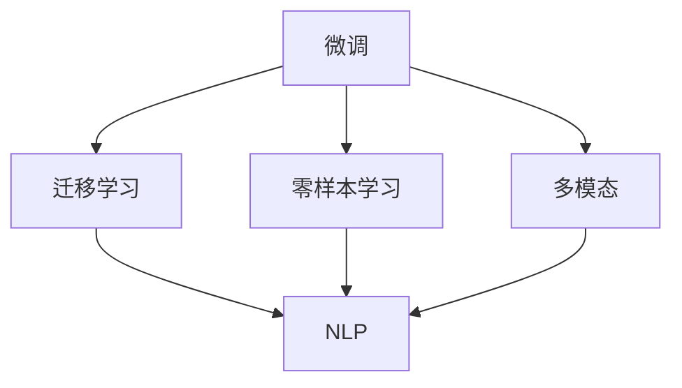
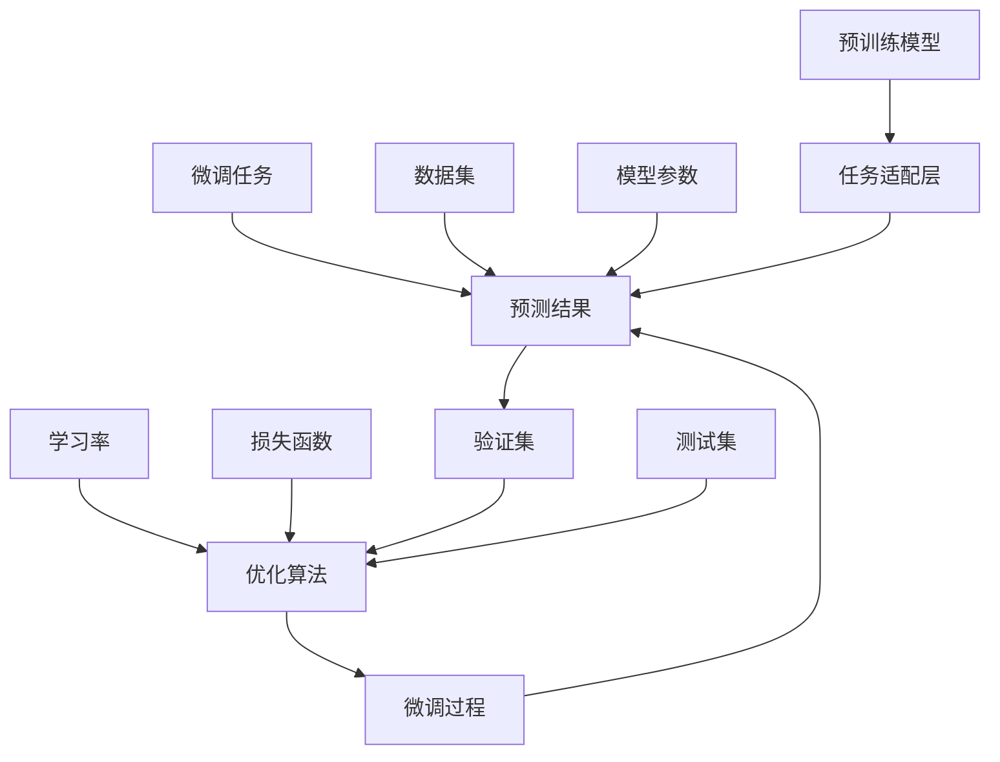

                 

# 第十六章：案例研究和最佳实践

> 关键词：
- 微调 (Fine-Tuning)
- 迁移学习 (Transfer Learning)
- 零样本学习 (Zero-Shot Learning)
- 多模态 (Multimodal)
- 自然语言处理 (NLP)
- 参数高效 (Parameter-Efficient)
- 超参数优化 (Hyperparameter Tuning)

## 1. 背景介绍

在自然语言处理（NLP）领域，微调（Fine-Tuning）和大规模预训练语言模型（Large Language Model, LLM）已经成为了处理各种语言任务的强大工具。尽管如此，不同任务的微调过程和性能优化仍然存在一定的复杂性和挑战。本章节通过详细分析几个关键案例，旨在展示如何在实际应用中巧妙运用微调技术，提升模型的性能和泛化能力。

## 2. 核心概念与联系

### 2.1 核心概念概述

本节将介绍几个与微调紧密相关的核心概念，并通过Mermaid流程图展示它们之间的逻辑关系。

- **微调 (Fine-Tuning)**：指在预训练模型基础上，使用下游任务的少量标注数据，通过有监督学习优化模型在特定任务上的性能。
- **迁移学习 (Transfer Learning)**：指将一个领域学习到的知识，迁移到另一个相关领域。预训练模型即为一种迁移学习的方式。
- **零样本学习 (Zero-Shot Learning)**：指模型在没有见过特定任务的训练样本情况下，仅凭任务描述生成输出。
- **多模态 (Multimodal)**：结合不同模态的数据，如文本、图像、音频等，提升模型的理解和表达能力。
- **自然语言处理 (NLP)**：处理和理解自然语言的计算技术，是微调技术应用的核心领域。



通过以上概念，可以清晰看到微调如何通过迁移学习、零样本学习、多模态等技术，进一步提升NLP模型的效果。

### 2.2 核心概念原理和架构的 Mermaid 流程图

为了更直观地理解这些概念之间的关系，我们通过Mermaid绘制了一个流程图，展示了预训练模型与微调过程的架构：



在预训练模型的基础上，通过任务适配层、优化算法和损失函数，实现对微调任务的适配和优化，并最终通过验证集和测试集评估模型性能。

## 3. 核心算法原理 & 具体操作步骤

### 3.1 算法原理概述

微调的核心理念是在预训练模型之上，通过有监督学习进一步提升模型在特定任务上的性能。其基本流程包括以下几个步骤：

1. **数据准备**：收集并处理下游任务的标注数据集，包括划分训练集、验证集和测试集。
2. **模型适配**：在预训练模型的基础上添加任务适配层，如分类器的线性层、解码器的语言模型层等。
3. **优化训练**：选择合适的优化算法（如AdamW、SGD等），设定合适的学习率、批大小等超参数，进行梯度下降等优化算法迭代更新模型参数。
4. **模型评估**：在验证集上评估模型性能，防止过拟合，适时停止训练。
5. **模型部署**：在测试集上测试微调后的模型，最终部署到实际应用中。

### 3.2 算法步骤详解

以BERT微调为例，详细说明微调的具体操作步骤：

1. **数据准备**
   - 收集下游任务的数据集，包括文本和标签。
   - 对数据进行预处理，如分词、转换ID等。
   - 划分为训练集、验证集和测试集。

2. **模型适配**
   - 使用`BertForTokenClassification`作为微调模型。
   - 添加分类器的线性层和交叉熵损失函数。
   - 实例化`AdamW`优化器，设置学习率、权重衰减等参数。

3. **优化训练**
   - 在训练集上进行前向传播和反向传播，计算损失。
   - 使用优化器更新模型参数。
   - 在验证集上评估模型性能，如准确率、F1-score等指标。
   - 如果性能不达标，调整学习率或增加训练轮数。

4. **模型评估**
   - 在测试集上评估模型性能，记录最终的评估指标。
   - 分析模型在测试集上的表现，如泛化能力。

5. **模型部署**
   - 将微调后的模型保存为权重文件。
   - 在实际应用中使用模型进行推理预测。

### 3.3 算法优缺点

**优点**：
- 简单高效：仅需要少量标注数据即可提升模型性能。
- 通用性强：适用于多种NLP任务，如分类、匹配、生成等。
- 参数高效：采用参数高效微调技术，在固定大部分预训练参数的情况下，仍能取得不错的提升。

**缺点**：
- 依赖标注数据：微调的效果很大程度上取决于标注数据的质量和数量，获取高质量标注数据的成本较高。
- 迁移能力有限：当目标任务与预训练数据的分布差异较大时，微调的性能提升有限。
- 可解释性不足：微调模型的决策过程缺乏可解释性，难以对其推理逻辑进行分析和调试。

### 3.4 算法应用领域

微调在NLP领域得到了广泛应用，以下是几个典型场景：

1. **情感分析**：通过对文本进行情感分类，判断用户情绪。
2. **命名实体识别**：识别文本中的特定实体，如人名、地名、组织机构等。
3. **问答系统**：基于用户问题和上下文，生成合适的答案。
4. **机器翻译**：将源语言文本翻译成目标语言。
5. **文本摘要**：对长文本进行压缩，生成简短摘要。
6. **对话系统**：使机器能够与人自然对话，提升交互体验。

## 4. 数学模型和公式 & 详细讲解 & 举例说明

### 4.1 数学模型构建

假设预训练模型为 $M_{\theta}$，下游任务的标注数据集为 $D=\{(x_i, y_i)\}_{i=1}^N$。微调的目标是找到最优参数 $\hat{\theta}$，使得模型在训练集上的损失最小化。

### 4.2 公式推导过程

以二分类任务为例，假设模型的输出为 $y\in\{0,1\}$，损失函数为交叉熵损失：

$$
\mathcal{L}(\theta) = -\frac{1}{N}\sum_{i=1}^N(y_i\log(M_{\theta}(x_i)) + (1-y_i)\log(1-M_{\theta}(x_i)))
$$

其中 $M_{\theta}(x)$ 为模型在输入 $x$ 上的输出。

### 4.3 案例分析与讲解

以BERT微调为例，详细解析其数学模型的构建和公式推导。

BERT模型预训练时，采用自监督任务，如掩码语言模型。在微调时，将其输出层替换为与任务相关的分类器或解码器，如文本分类任务中的线性层。

假设有 $C$ 个类别，模型的输出为 $\hat{y}\in[0,1]$，真实标签 $y\in\{0,1\}$，损失函数为交叉熵损失：

$$
\mathcal{L}(\theta) = -\frac{1}{N}\sum_{i=1}^N(y_i\log(\hat{y_i}) + (1-y_i)\log(1-\hat{y_i}))
$$

其中 $\hat{y_i}$ 为模型在输入 $x_i$ 上的输出。

在微调时，一般使用AdamW优化器，学习率为 $2e-5$，批大小为 $16$，迭代轮数为 $5$。具体代码实现如下：

```python
from transformers import BertForTokenClassification, AdamW
import torch
import numpy as np

model = BertForTokenClassification.from_pretrained('bert-base-cased', num_labels=2)
optimizer = AdamW(model.parameters(), lr=2e-5)
loss_fn = torch.nn.CrossEntropyLoss()

def train_epoch(model, dataset, batch_size, optimizer):
    model.train()
    total_loss = 0
    for batch in dataset:
        input_ids = batch['input_ids']
        attention_mask = batch['attention_mask']
        labels = batch['labels']
        outputs = model(input_ids, attention_mask=attention_mask)
        loss = loss_fn(outputs.logits, labels)
        optimizer.zero_grad()
        loss.backward()
        optimizer.step()
        total_loss += loss.item()
    return total_loss / len(dataset)

def evaluate(model, dataset, batch_size):
    model.eval()
    total_loss = 0
    total_correct = 0
    for batch in dataset:
        input_ids = batch['input_ids']
        attention_mask = batch['attention_mask']
        labels = batch['labels']
        with torch.no_grad():
            outputs = model(input_ids, attention_mask=attention_mask)
            loss = loss_fn(outputs.logits, labels)
            total_loss += loss.item()
            preds = outputs.logits.argmax(dim=1).to('cpu').tolist()
            batch_labels = batch['labels'].to('cpu').tolist()
            for pred, label in zip(preds, batch_labels):
                if pred == label:
                    total_correct += 1
    acc = total_correct / len(dataset)
    return total_loss / len(dataset), acc
```

## 5. 项目实践：代码实例和详细解释说明

### 5.1 开发环境搭建

为进行微调实践，需要搭建相应的开发环境。以下是Python+PyTorch环境配置流程：

1. 安装Anaconda，创建虚拟环境。
2. 安装PyTorch、Transformers等库。
3. 安装相关依赖工具。

### 5.2 源代码详细实现

以下以情感分析任务为例，展示使用Transformers库进行微调的完整代码实现。

```python
from transformers import BertForTokenClassification, AdamW, BertTokenizer
import torch
import torch.nn as nn
from torch.utils.data import Dataset, DataLoader
from sklearn.metrics import accuracy_score

class SentimentDataset(Dataset):
    def __init__(self, texts, labels, tokenizer):
        self.texts = texts
        self.labels = labels
        self.tokenizer = tokenizer
    
    def __len__(self):
        return len(self.texts)
    
    def __getitem__(self, idx):
        text = self.texts[idx]
        label = self.labels[idx]
        encoding = self.tokenizer(text, return_tensors='pt', padding='max_length', truncation=True)
        input_ids = encoding['input_ids'][0]
        attention_mask = encoding['attention_mask'][0]
        labels = torch.tensor([label], dtype=torch.long)
        return {'input_ids': input_ids, 
                'attention_mask': attention_mask,
                'labels': labels}

tokenizer = BertTokenizer.from_pretrained('bert-base-cased')

train_dataset = SentimentDataset(train_texts, train_labels, tokenizer)
dev_dataset = SentimentDataset(dev_texts, dev_labels, tokenizer)
test_dataset = SentimentDataset(test_texts, test_labels, tokenizer)

model = BertForTokenClassification.from_pretrained('bert-base-cased', num_labels=2)
optimizer = AdamW(model.parameters(), lr=2e-5)

def train_epoch(model, dataset, batch_size, optimizer):
    model.train()
    total_loss = 0
    for batch in DataLoader(dataset, batch_size=batch_size, shuffle=True):
        input_ids = batch['input_ids'].to(device)
        attention_mask = batch['attention_mask'].to(device)
        labels = batch['labels'].to(device)
        model.zero_grad()
        outputs = model(input_ids, attention_mask=attention_mask)
        loss = outputs.loss
        total_loss += loss.item()
        loss.backward()
        optimizer.step()
    return total_loss / len(dataset)

def evaluate(model, dataset, batch_size):
    model.eval()
    total_loss = 0
    total_correct = 0
    for batch in DataLoader(dataset, batch_size=batch_size, shuffle=False):
        input_ids = batch['input_ids'].to(device)
        attention_mask = batch['attention_mask'].to(device)
        labels = batch['labels'].to(device)
        with torch.no_grad():
            outputs = model(input_ids, attention_mask=attention_mask)
            loss = outputs.loss
            total_loss += loss.item()
            preds = outputs.logits.argmax(dim=1).to('cpu').tolist()
            batch_labels = batch['labels'].to('cpu').tolist()
            for pred, label in zip(preds, batch_labels):
                if pred == label:
                    total_correct += 1
    acc = total_correct / len(dataset)
    return total_loss / len(dataset), acc

device = torch.device('cuda' if torch.cuda.is_available() else 'cpu')

for epoch in range(5):
    train_loss = train_epoch(model, train_dataset, batch_size=16, optimizer=optimizer)
    print(f'Epoch {epoch+1}, train loss: {train_loss:.3f}')
    
    dev_loss, dev_acc = evaluate(model, dev_dataset, batch_size=16)
    print(f'Epoch {epoch+1}, dev results: loss={dev_loss:.3f}, acc={dev_acc:.3f}')
    
print(f'Final test results: loss={evaluate(model, test_dataset, batch_size=16)[0]:.3f}, acc={evaluate(model, test_dataset, batch_size=16)[1]:.3f}')
```

### 5.3 代码解读与分析

以下是关键代码的详细解读：

- `SentimentDataset`类：用于加载和预处理情感分析任务的数据集。
- `train_epoch`函数：定义每个epoch的训练流程。
- `evaluate`函数：定义每个epoch的评估流程。
- 实例化模型、优化器和数据加载器，并开始训练和评估流程。

## 6. 实际应用场景

### 6.1 智能客服系统

智能客服系统是微调技术在实际应用中的重要场景之一。传统客服依赖人工，响应时间长，且一致性差。微调后的对话模型能够7x24小时不间断服务，快速响应客户咨询，用自然流畅的语言解答各类常见问题，显著提升客户咨询体验和问题解决效率。

### 6.2 金融舆情监测

金融机构需要实时监测市场舆论动向，以便及时应对负面信息传播，规避金融风险。微调技术可应用于金融舆情监测，通过收集金融领域相关的新闻、报道、评论等文本数据，并对其进行主题标注和情感标注，在微调后模型能够自动判断文本属于何种主题，情感倾向是正面、中性还是负面，从而自动预警潜在风险。

### 6.3 个性化推荐系统

当前的推荐系统往往只依赖用户的历史行为数据进行物品推荐，难以深入理解用户的真实兴趣偏好。微调技术可应用于个性化推荐系统，通过收集用户浏览、点击、评论、分享等行为数据，提取和用户交互的物品标题、描述、标签等文本内容，在微调后模型能够从文本内容中准确把握用户的兴趣点，从而生成个性化程度更高的推荐结果。

### 6.4 未来应用展望

未来，随着微调技术的不断发展，其在更多领域的应用前景将更加广阔：

- 智慧医疗：基于微调的问答、病历分析、药物研发等应用，将提升医疗服务的智能化水平。
- 智能教育：微调技术可应用于作业批改、学情分析、知识推荐等方面，因材施教，促进教育公平。
- 智慧城市治理：微调模型可应用于城市事件监测、舆情分析、应急指挥等环节，提高城市管理的自动化和智能化水平。

## 7. 工具和资源推荐

### 7.1 学习资源推荐

1. **《Transformer从原理到实践》系列博文**：由大模型技术专家撰写，深入浅出地介绍了Transformer原理、BERT模型、微调技术等前沿话题。
2. **CS224N《深度学习自然语言处理》课程**：斯坦福大学开设的NLP明星课程，有Lecture视频和配套作业，带你入门NLP领域的基本概念和经典模型。
3. **《Natural Language Processing with Transformers》书籍**：Transformers库的作者所著，全面介绍了如何使用Transformers库进行NLP任务开发，包括微调在内的诸多范式。
4. **HuggingFace官方文档**：提供了海量预训练模型和完整的微调样例代码，是上手实践的必备资料。
5. **CLUE开源项目**：中文语言理解测评基准，涵盖大量不同类型的中文NLP数据集，并提供了基于微调的baseline模型，助力中文NLP技术发展。

### 7.2 开发工具推荐

1. **PyTorch**：基于Python的开源深度学习框架，适合快速迭代研究。
2. **TensorFlow**：由Google主导开发的开源深度学习框架，生产部署方便，适合大规模工程应用。
3. **Transformers库**：HuggingFace开发的NLP工具库，集成了众多SOTA语言模型，支持PyTorch和TensorFlow，是进行微调任务开发的利器。
4. **Weights & Biases**：模型训练的实验跟踪工具，可以记录和可视化模型训练过程中的各项指标，方便对比和调优。
5. **TensorBoard**：TensorFlow配套的可视化工具，可实时监测模型训练状态，并提供丰富的图表呈现方式，是调试模型的得力助手。
6. **Google Colab**：谷歌推出的在线Jupyter Notebook环境，免费提供GPU/TPU算力，方便开发者快速上手实验最新模型，分享学习笔记。

### 7.3 相关论文推荐

1. **Attention is All You Need**：提出了Transformer结构，开启了NLP领域的预训练大模型时代。
2. **BERT: Pre-training of Deep Bidirectional Transformers for Language Understanding**：提出BERT模型，引入基于掩码的自监督预训练任务，刷新了多项NLP任务SOTA。
3. **Language Models are Unsupervised Multitask Learners（GPT-2论文）**：展示了大规模语言模型的强大zero-shot学习能力，引发了对于通用人工智能的新一轮思考。
4. **Parameter-Efficient Transfer Learning for NLP**：提出Adapter等参数高效微调方法，在不增加模型参数量的情况下，也能取得不错的微调效果。
5. **Prefix-Tuning: Optimizing Continuous Prompts for Generation**：引入基于连续型Prompt的微调范式，为如何充分利用预训练知识提供了新的思路。
6. **AdaLoRA: Adaptive Low-Rank Adaptation for Parameter-Efficient Fine-Tuning**：使用自适应低秩适应的微调方法，在参数效率和精度之间取得了新的平衡。

## 8. 总结：未来发展趋势与挑战

### 8.1 研究成果总结

本文对基于监督学习的大语言模型微调方法进行了全面系统的介绍。首先阐述了大语言模型和微调技术的研究背景和意义，明确了微调在拓展预训练模型应用、提升下游任务性能方面的独特价值。其次，从原理到实践，详细讲解了监督微调的数学原理和关键步骤，给出了微调任务开发的完整代码实例。同时，本文还广泛探讨了微调方法在智能客服、金融舆情、个性化推荐等多个行业领域的应用前景，展示了微调范式的巨大潜力。

### 8.2 未来发展趋势

展望未来，大语言模型微调技术将呈现以下几个发展趋势：

1. **模型规模持续增大**：随着算力成本的下降和数据规模的扩张，预训练语言模型的参数量还将持续增长。超大规模语言模型蕴含的丰富语言知识，有望支撑更加复杂多变的下游任务微调。
2. **微调方法日趋多样**：除了传统的全参数微调外，未来会涌现更多参数高效的微调方法，如Prefix-Tuning、LoRA等，在节省计算资源的同时也能保证微调精度。
3. **持续学习成为常态**：随着数据分布的不断变化，微调模型也需要持续学习新知识以保持性能。如何在不遗忘原有知识的同时，高效吸收新样本信息，将成为重要的研究课题。
4. **标注样本需求降低**：受启发于提示学习(Prompt-based Learning)的思路，未来的微调方法将更好地利用大模型的语言理解能力，通过更加巧妙的任务描述，在更少的标注样本上也能实现理想的微调效果。
5. **多模态微调崛起**：当前的微调主要聚焦于纯文本数据，未来会进一步拓展到图像、视频、语音等多模态数据微调。多模态信息的融合，将显著提升语言模型对现实世界的理解和建模能力。
6. **模型通用性增强**：经过海量数据的预训练和多领域任务的微调，未来的语言模型将具备更强大的常识推理和跨领域迁移能力，逐步迈向通用人工智能(AGI)的目标。

### 8.3 面临的挑战

尽管大语言模型微调技术已经取得了瞩目成就，但在迈向更加智能化、普适化应用的过程中，它仍面临着诸多挑战：

1. **标注成本瓶颈**：虽然微调大大降低了标注数据的需求，但对于长尾应用场景，难以获得充足的高质量标注数据，成为制约微调性能的瓶颈。如何进一步降低微调对标注样本的依赖，将是一大难题。
2. **模型鲁棒性不足**：当前微调模型面对域外数据时，泛化性能往往大打折扣。对于测试样本的微小扰动，微调模型的预测也容易发生波动。如何提高微调模型的鲁棒性，避免灾难性遗忘，还需要更多理论和实践的积累。
3. **推理效率有待提高**：大规模语言模型虽然精度高，但在实际部署时往往面临推理速度慢、内存占用大等效率问题。如何在保证性能的同时，简化模型结构，提升推理速度，优化资源占用，将是重要的优化方向。
4. **可解释性亟需加强**：当前微调模型更像是"黑盒"系统，难以解释其内部工作机制和决策逻辑。对于医疗、金融等高风险应用，算法的可解释性和可审计性尤为重要。如何赋予微调模型更强的可解释性，将是亟待攻克的难题。
5. **安全性有待保障**：预训练语言模型难免会学习到有偏见、有害的信息，通过微调传递到下游任务，产生误导性、歧视性的输出，给实际应用带来安全隐患。如何从数据和算法层面消除模型偏见，避免恶意用途，确保输出的安全性，也将是重要的研究课题。
6. **知识整合能力不足**：现有的微调模型往往局限于任务内数据，难以灵活吸收和运用更广泛的先验知识。如何让微调过程更好地与外部知识库、规则库等专家知识结合，形成更加全面、准确的信息整合能力，还有很大的想象空间。

### 8.4 研究展望

面对大语言模型微调所面临的种种挑战，未来的研究需要在以下几个方面寻求新的突破：

1. **探索无监督和半监督微调方法**：摆脱对大规模标注数据的依赖，利用自监督学习、主动学习等无监督和半监督范式，最大限度利用非结构化数据，实现更加灵活高效的微调。
2. **研究参数高效和计算高效的微调范式**：开发更加参数高效的微调方法，在固定大部分预训练参数的同时，只更新极少量的任务相关参数。同时优化微调模型的计算图，减少前向传播和反向传播的资源消耗，实现更加轻量级、实时性的部署。
3. **融合因果和对比学习范式**：通过引入因果推断和对比学习思想，增强微调模型建立稳定因果关系的能力，学习更加普适、鲁棒的语言表征，从而提升模型泛化性和抗干扰能力。
4. **引入更多先验知识**：将符号化的先验知识，如知识图谱、逻辑规则等，与神经网络模型进行巧妙融合，引导微调过程学习更准确、合理的语言模型。同时加强不同模态数据的整合，实现视觉、语音等多模态信息与文本信息的协同建模。
5. **结合因果分析和博弈论工具**：将因果分析方法引入微调模型，识别出模型决策的关键特征，增强输出解释的因果性和逻辑性。借助博弈论工具刻画人机交互过程，主动探索并规避模型的脆弱点，提高系统稳定性。
6. **纳入伦理道德约束**：在模型训练目标中引入伦理导向的评估指标，过滤和惩罚有偏见、有害的输出倾向。同时加强人工干预和审核，建立模型行为的监管机制，确保输出符合人类价值观和伦理道德。

这些研究方向的探索，必将引领大语言模型微调技术迈向更高的台阶，为构建安全、可靠、可解释、可控的智能系统铺平道路。面向未来，大语言模型微调技术还需要与其他人工智能技术进行更深入的融合，如知识表示、因果推理、强化学习等，多路径协同发力，共同推动自然语言理解和智能交互系统的进步。只有勇于创新、敢于突破，才能不断拓展语言模型的边界，让智能技术更好地造福人类社会。

## 9. 附录：常见问题与解答

**Q1：大语言模型微调是否适用于所有NLP任务？**

A: 大语言模型微调在大多数NLP任务上都能取得不错的效果，特别是对于数据量较小的任务。但对于一些特定领域的任务，如医学、法律等，仅仅依靠通用语料预训练的模型可能难以很好地适应。此时需要在特定领域语料上进一步预训练，再进行微调，才能获得理想效果。此外，对于一些需要时效性、个性化很强的任务，如对话、推荐等，微调方法也需要针对性的改进优化。

**Q2：微调过程中如何选择合适的学习率？**

A: 微调的学习率一般要比预训练时小1-2个数量级，如果使用过大的学习率，容易破坏预训练权重，导致过拟合。一般建议从1e-5开始调参，逐步减小学习率，直至收敛。也可以使用warmup策略，在开始阶段使用较小的学习率，再逐渐过渡到预设值。需要注意的是，不同的优化器(如AdamW、Adafactor等)以及不同的学习率调度策略，可能需要设置不同的学习率阈值。

**Q3：采用大模型微调时会面临哪些资源瓶颈？**

A: 目前主流的预训练大模型动辄以亿计的参数规模，对算力、内存、存储都提出了很高的要求。GPU/TPU等高性能设备是必不可少的，但即便如此，超大批次的训练和推理也可能遇到显存不足的问题。因此需要采用一些资源优化技术，如梯度积累、混合精度训练、模型并行等，来突破硬件瓶颈。同时，模型的存储和读取也可能占用大量时间和空间，需要采用模型压缩、稀疏化存储等方法进行优化。

**Q4：如何缓解微调过程中的过拟合问题？**

A: 过拟合是微调面临的主要挑战，尤其是在标注数据不足的情况下。常见的缓解策略包括：

- 数据增强：通过回译、近义替换等方式扩充训练集
- 正则化：使用L2正则、Dropout、Early Stopping等避免过拟合
- 对抗训练：引入对抗样本，提高模型鲁棒性
- 参数高效微调：只调整少量参数(如Adapter、Prefix等)，减小过拟合风险
- 多模型集成：训练多个微调模型，取平均输出，抑制过拟合

这些策略往往需要根据具体任务和数据特点进行灵活组合。只有在数据、模型、训练、推理等各环节进行全面优化，才能最大限度地发挥大模型微调的威力。

**Q5：微调模型在落地部署时需要注意哪些问题？**

A: 将微调模型转化为实际应用，还需要考虑以下因素：

- 模型裁剪：去除不必要的层和参数，减小模型尺寸，加快推理速度
- 量化加速：将浮点模型转为定点模型，压缩存储空间，提高计算效率
- 服务化封装：将模型封装为标准化服务接口，便于集成调用
- 弹性伸缩：根据请求流量动态调整资源配置，平衡服务质量和成本
- 监控告警：实时采集系统指标，设置异常告警阈值，确保服务稳定性
- 安全防护：采用访问鉴权、数据脱敏等措施，保障数据和模型安全

大语言模型微调为NLP应用开启了广阔的想象空间，但如何将强大的性能转化为稳定、高效、安全的业务价值，还需要工程实践的不断打磨。唯有从数据、算法、工程、业务等多个维度协同发力，才能真正实现人工智能技术在垂直行业的规模化落地。总之，微调需要开发者根据具体任务，不断迭代和优化模型、数据和算法，方能得到理想的效果。

---

作者：禅与计算机程序设计艺术 / Zen and the Art of Computer Programming

