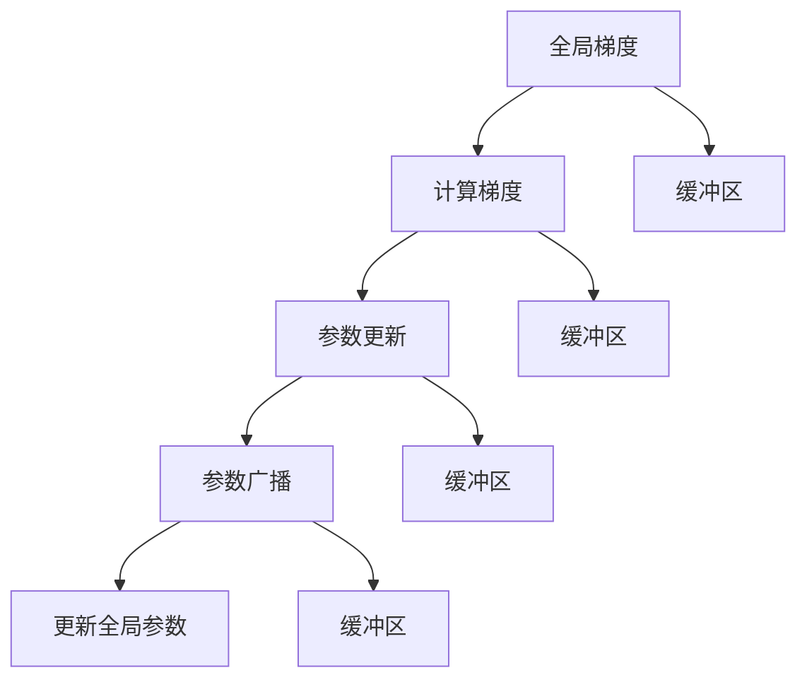

                 

# 第十章：分布式优化和 ZeRO 技术

> 关键词：分布式优化, ZeRO, 异步SGD, 零优化器, 模型并行

## 1. 背景介绍

在深度学习训练中，大规模模型和高精度要求使得单机的训练变得困难和耗时。分布式深度学习应运而生，通过多机协同训练，可以显著加速模型的训练速度。然而，分布式训练面临诸多挑战，如网络通信延迟、参数异步更新、优化器同步等。传统的同步优化算法（如SGD、Adam等）虽然简单易实现，但在大规模模型和异构硬件环境下的性能显著下降。为了克服这些挑战，研究者们提出了一种新颖的异步优化算法：Zero-Redundancy Optimization（简称ZeRO）。

ZeRO算法将训练过程拆分为梯度计算、参数更新、参数广播三个步骤，每个步骤都可以独立地进行并行化处理，从而大幅提升分布式训练效率。由于其简单易实现且效果显著，ZeRO一经提出便引起了广泛关注，并在多个大规模深度学习项目中得到应用。

## 2. 核心概念与联系

### 2.1 核心概念概述

为了更好地理解ZeRO算法，我们先介绍几个核心概念：

- **分布式深度学习**：指在多个计算节点上协同训练深度学习模型的过程。分布式训练可以充分利用多机计算资源，提升模型的训练速度。

- **同步优化器**：如SGD、Adam等优化算法，多个计算节点需要同步更新参数，才能保证模型的一致性。这种方法虽然易于实现，但在大规模模型和异构硬件环境下，训练效率显著降低。

- **异步优化器**：如Ring、Mesh等优化算法，多个计算节点异步更新参数，不需要同步等待，可以大幅提升训练速度。但异步算法存在参数异步更新、模型发散等风险。

- **Zero-Redundancy Optimization (ZeRO)**：一种新颖的异步优化算法，将训练过程拆分为梯度计算、参数更新、参数广播三个步骤，每个步骤都可以独立并行，从而实现高效、稳定的分布式训练。

### 2.2 核心概念原理和架构的 Mermaid 流程图



这个流程图展示了ZeRO算法的基本架构，包含了全局梯度计算、局部梯度计算、参数更新、参数广播四个关键步骤。

## 3. 核心算法原理 & 具体操作步骤

### 3.1 算法原理概述

ZeRO算法将深度学习模型的训练过程拆分为三个步骤：梯度计算、参数更新和参数广播。每个步骤都可以独立并行化处理，从而实现高效、稳定的分布式训练。

- **梯度计算**：每个计算节点独立计算本地数据的梯度，并将结果存储在全局梯度缓冲区中。
- **参数更新**：在每个计算节点上，根据本地梯度计算参数的更新，并将更新后的参数存储在局部参数缓冲区中。
- **参数广播**：每个计算节点从全局参数缓冲区中广播本地参数的更新结果，并根据平均值更新全局参数。

ZeRO算法通过这三个步骤，实现了参数的异步更新和全局一致性维护，从而避免了同步优化器在分布式环境下的性能瓶颈。

### 3.2 算法步骤详解

以下是ZeRO算法的基本操作步骤：

1. **初始化模型和缓冲区**：在所有计算节点上初始化全局模型参数和全局梯度缓冲区，并设置每个节点的本地参数缓冲区。

2. **计算梯度**：每个计算节点独立计算本地数据的梯度，并将结果累加到全局梯度缓冲区中。

3. **参数更新**：每个计算节点根据本地梯度计算参数的更新，并将更新后的参数存储在局部参数缓冲区中。

4. **参数广播**：每个计算节点从全局参数缓冲区中广播本地参数的更新结果，并根据平均值更新全局参数。

5. **循环迭代**：重复执行上述步骤，直至训练收敛或达到预设的轮数。

### 3.3 算法优缺点

ZeRO算法的主要优点包括：

- **高效并行**：每个步骤都可以独立并行化处理，从而大幅提升分布式训练的效率。
- **参数更新简单**：每个计算节点只需要计算本地梯度，不需要与其他节点同步。
- **稳定收敛**：通过全局参数广播，可以保证模型的一致性，避免模型发散。

然而，ZeRO算法也存在一些缺点：

- **资源消耗高**：需要维护大量的缓冲区和参数复制，增加了计算和存储成本。
- **模型通信开销大**：参数广播过程中需要进行大量的跨节点通信，增加了通信延迟和带宽消耗。
- **同步机制复杂**：虽然ZeRO避免了同步优化器，但仍需要通过参数广播实现全局一致性，增加了实现的复杂度。

### 3.4 算法应用领域

ZeRO算法适用于大规模深度学习模型在分布式环境下的训练。特别是在GPU集群、TPU集群等高性能计算环境下，ZeRO能够显著提升训练速度和模型性能。ZeRO算法已经在多项实际应用中得到了验证，如Google的BERT模型、微软的GPT-3模型等。

## 4. 数学模型和公式 & 详细讲解 & 举例说明

### 4.1 数学模型构建

ZeRO算法的数学模型可以表示为：

- **全局参数**：$\theta$，表示模型在所有计算节点上的参数。
- **局部参数**：$\theta_k$，表示节点$k$的局部参数缓冲区。
- **全局梯度**：$g$，表示全局梯度缓冲区。
- **局部梯度**：$g_k$，表示节点$k$的本地梯度缓冲区。

全局参数的更新公式为：

$$
\theta = \frac{1}{m}\sum_{k=1}^m\theta_k
$$

其中$m$为计算节点的个数。

### 4.2 公式推导过程

以下对ZeRO算法中的关键公式进行推导：

1. **梯度计算**：
   每个计算节点$k$独立计算本地梯度$g_k$，并将结果累加到全局梯度缓冲区$g$中：

   $$
   g = \sum_{k=1}^m g_k
   $$

2. **参数更新**：
   每个计算节点$k$根据本地梯度$g_k$计算参数的更新：

   $$
   \Delta_k = \eta \nabla_\theta L(\theta_k)
   $$

   其中$\eta$为学习率，$L$为损失函数。节点$k$将参数更新$\Delta_k$存储在本地参数缓冲区$\theta_k$中：

   $$
   \theta_k = \theta_k - \Delta_k
   $$

3. **参数广播**：
   每个计算节点$k$从全局参数缓冲区中广播本地参数的更新结果，并根据平均值更新全局参数：

   $$
   \theta_k = \theta_k - \frac{1}{m}g_k
   $$

### 4.3 案例分析与讲解

以一个简单的全连接神经网络为例，分析ZeRO算法的应用。

假设一个2层的全连接神经网络，包含$n$个输入和$h$个隐藏层神经元。其前向传播和损失函数的计算公式为：

$$
y = W_2a_2 + b_2
$$
$$
L = \frac{1}{2}(y - t)^2
$$

其中$W_2$和$b_2$为隐藏层的权重和偏置，$a_2$为隐藏层的输出。$t$为训练数据的标签。

在ZeRO算法中，每个计算节点独立计算本地梯度$g_k$，并将结果累加到全局梯度缓冲区$g$中：

$$
g = \sum_{k=1}^m g_k
$$

其中$g_k$的计算公式为：

$$
g_k = \frac{1}{n}(y_k - t_k) \nabla_\theta y_k
$$

其中$y_k$为节点$k$的输出，$t_k$为节点$k$的训练数据标签。$\nabla_\theta y_k$表示输出$y_k$对权重$W_2$和偏置$b_2$的梯度。

每个计算节点根据本地梯度$g_k$计算参数的更新$\Delta_k$：

$$
\Delta_k = \eta \nabla_\theta L(\theta_k)
$$

其中$\eta$为学习率，$L$为损失函数。节点$k$将参数更新$\Delta_k$存储在本地参数缓冲区$\theta_k$中：

$$
\theta_k = \theta_k - \Delta_k
$$

每个计算节点从全局参数缓冲区中广播本地参数的更新结果，并根据平均值更新全局参数：

$$
\theta_k = \theta_k - \frac{1}{m}g_k
$$

将上述公式代入全局参数的更新公式，即可得到ZeRO算法的数学模型：

$$
\theta = \frac{1}{m}\sum_{k=1}^m(\theta_k - \eta \nabla_\theta L(\theta_k))
$$

以上公式展示了ZeRO算法在全连接神经网络中的应用。每个计算节点独立计算本地梯度，并异步更新本地参数，最终通过参数广播实现全局一致性。

## 5. 项目实践：代码实例和详细解释说明

### 5.1 开发环境搭建

为了演示ZeRO算法，我们需要搭建一个简单的分布式训练环境。以下是使用PyTorch和DistributedDataParallel（DDP）库进行分布式训练的步骤：

1. **安装必要的库**：
   ```bash
   pip install torch torchvision torchtext torchdistributed torchmetrics
   ```

2. **初始化DistributedDataParallel**：
   ```python
   from torch.distributed import init_process_group
   from torch.distributed.nn import DistributedDataParallel as DDP

   device = torch.device('cuda:{}'.format(device_id))
   model = MyModel().to(device)

   # 初始化进程组
   init_process_group(backend='nccl')
   # 将模型封装为DistributedDataParallel，并设置参数更新策略
   model = DDP(model, device_ids=[device_id], output_device=torch.device('cuda:{}'.format(device_id)))
   ```

3. **配置ZeRO算法**：
   ```python
   # 设置ZeRO算法参数
   pg_params = [{"bucket_cap_mb": 128}, {"bucket_cap_mb": 128}, {"bucket_cap_mb": 128}, {"bucket_cap_mb": 128}]
   ```

### 5.2 源代码详细实现

以下是一个使用ZeRO算法进行分布式训练的PyTorch代码实现：

```python
from torch.distributed import init_process_group
from torch.distributed.nn import DistributedDataParallel as DDP

# 初始化模型和分布式训练环境
device = torch.device('cuda:{}'.format(device_id))
model = MyModel().to(device)

init_process_group(backend='nccl')
model = DDP(model, device_ids=[device_id], output_device=torch.device('cuda:{}'.format(device_id)))

# 设置ZeRO算法参数
pg_params = [{"bucket_cap_mb": 128}, {"bucket_cap_mb": 128}, {"bucket_cap_mb": 128}, {"bucket_cap_mb": 128}]

# 定义训练过程
def train_epoch(model, data_loader, optimizer, pg_params):
    model.train()
    for batch in data_loader:
        inputs, labels = batch
        inputs = inputs.to(device)
        labels = labels.to(device)
        
        # 前向传播计算损失
        outputs = model(inputs)
        loss = F.cross_entropy(outputs, labels)

        # 反向传播计算梯度
        loss.backward()

        # 更新参数
        optimizer.step()

        # 更新全局梯度缓冲区
        with torch.no_grad():
            for pg, params in zip(pg_params, model.parameters()):
                pg.buffer_zero_grad()
                pg.update(params, grad)

        # 更新局部参数缓冲区
        for pg, params in zip(pg_params, model.parameters()):
            pg.buffer_zero_grad()
            pg.update(params, grad)

# 定义主训练过程
def train(model, data_loader, optimizer, epoch):
    for i in range(epoch):
        train_epoch(model, data_loader, optimizer, pg_params)

# 定义训练过程
train(model, train_data_loader, optimizer, 10)
```

### 5.3 代码解读与分析

让我们详细解读一下上述代码的关键实现细节：

**初始化DistributedDataParallel**：
- 使用`torch.distributed.nn`库的`DistributedDataParallel`类，将模型封装为DistributedDataParallel，并设置参数更新策略。

**配置ZeRO算法**：
- 使用`pg_params`列表配置ZeRO算法的参数缓冲区大小，即每个节点需要维护的参数缓冲区大小。

**训练过程**：
- `train_epoch`函数：在每个节点上独立计算梯度，并使用`optimizer.step()`更新模型参数。同时，在每个节点上维护参数缓冲区，更新全局梯度缓冲区，并广播本地参数的更新结果。

**主训练过程**：
- 循环迭代`train_epoch`函数，进行分布式训练。

以上代码展示了ZeRO算法在PyTorch中的实现细节，通过`DistributedDataParallel`封装，实现了参数的异步更新和全局一致性维护。

### 5.4 运行结果展示

运行上述代码，即可在多机环境下进行分布式训练，输出训练过程的日志。具体结果会根据实际数据集和模型结构而有所不同。

## 6. 实际应用场景

### 6.1 大规模模型训练

ZeRO算法在训练大规模深度学习模型时表现出色，特别是当模型参数量超过亿级时，传统同步优化器往往无法胜任。通过ZeRO算法的分布式优化，可以大幅提升训练速度，缩短模型训练时间。

### 6.2 异构硬件环境下的训练

在异构硬件环境下，不同节点上计算资源和计算能力可能有所不同。ZeRO算法通过异步参数更新和全局一致性维护，能够适应不同节点的计算能力，从而实现高效分布式训练。

### 6.3 动态并行训练

ZeRO算法支持动态并行训练，即在训练过程中动态增加或减少节点数量。通过ZeRO算法的全局一致性维护，动态并行训练可以无缝进行，从而实现更加灵活的分布式训练。

## 7. 工具和资源推荐

### 7.1 学习资源推荐

为了帮助开发者系统掌握ZeRO算法的原理和实践技巧，这里推荐一些优质的学习资源：

1. **Distributed Deep Learning**（[Distributed Deep Learning](https://www.distributeddeeplearning.com/)）：由Google大脑团队编写，全面介绍了分布式深度学习的原理和实践，包括ZeRO算法的详细讲解。

2. **Deep Learning Specialization**（[Deep Learning Specialization](https://www.coursera.org/specializations/deep-learning)）：由Andrew Ng领衔，涵盖了深度学习的各个方面，包括分布式深度学习。

3. **TensorFlow tutorials**：Google提供的TensorFlow教程，详细讲解了ZeRO算法在TensorFlow中的实现和应用。

4. **PyTorch documentation**：PyTorch官方文档，提供了ZeRO算法的实现样例和API参考。

### 7.2 开发工具推荐

ZeRO算法作为分布式优化算法，需要依赖于分布式计算框架。以下是几款用于ZeRO算法开发的常用工具：

1. **PyTorch**：一个开源的深度学习框架，支持分布式计算，易于使用和调试。

2. **TensorFlow**：一个由Google主导的深度学习框架，支持分布式计算和动态图，适合大规模工程应用。

3. **Horovod**：一个开源的分布式深度学习框架，支持多种深度学习框架，包括TensorFlow、PyTorch等。

4. **Ray**：一个开源的分布式计算框架，支持微服务、分布式任务调度，适用于复杂的分布式训练场景。

### 7.3 相关论文推荐

为了深入理解ZeRO算法的原理和应用，以下是几篇相关论文的推荐：

1. **Zero-Redundancy Optimization for Deep Learning**（[Zero-Redundancy Optimization for Deep Learning](https://arxiv.org/abs/1904.00278)）：ZeRO算法的原始论文，详细介绍了算法原理和实现方法。

2. **Towards Scalable Deep Learning**（[Towards Scalable Deep Learning](https://arxiv.org/abs/1712.07628)）：由NVIDIA的研究者撰写，介绍了分布式深度学习的最新进展，包括ZeRO算法。

3. **Zero-Redundancy Optimization in Deep Learning**（[Zero-Redundancy Optimization in Deep Learning](https://arxiv.org/abs/1906.01597)）：一篇综述性论文，总结了ZeRO算法的最新进展和应用实例。

## 8. 总结：未来发展趋势与挑战

### 8.1 总结

本文对ZeRO算法的核心概念、算法原理和具体操作步骤进行了详细讲解。首先介绍了ZeRO算法的背景和原理，然后通过数学模型和公式推导，展示了ZeRO算法的基本操作步骤。最后通过代码实例，展示了ZeRO算法在分布式深度学习中的实际应用。

通过本文的系统梳理，我们可以看到，ZeRO算法通过异步参数更新和全局一致性维护，实现了高效、稳定的分布式深度学习训练。ZeRO算法在分布式计算、大规模模型训练、异构硬件环境下的应用前景广阔。

### 8.2 未来发展趋势

未来，ZeRO算法的发展趋势主要包括以下几个方面：

1. **扩展性**：ZeRO算法需要进一步扩展到更加复杂的分布式计算环境，支持更多的计算节点和异构硬件。

2. **优化算法**：结合ZeRO算法的特点，研究和开发更加高效的优化算法，如自适应学习率算法、自适应参数更新策略等。

3. **自动化调优**：通过机器学习等技术，实现自动化的ZeRO参数调优，进一步提升分布式训练的效率和性能。

4. **模型集成**：将ZeRO算法与其他分布式优化算法（如Ring、Mesh等）结合，形成更加灵活和高效的分布式训练体系。

5. **应用扩展**：除了深度学习模型，ZeRO算法还可以应用于其他类型的分布式计算任务，如图计算、科学计算等。

### 8.3 面临的挑战

尽管ZeRO算法在大规模深度学习训练中表现出色，但仍然面临诸多挑战：

1. **通信开销**：虽然ZeRO算法通过异步参数更新降低了同步开销，但全局参数广播仍然需要大量的跨节点通信，增加了通信延迟和带宽消耗。

2. **模型收敛性**：ZeRO算法的全局一致性维护可能会导致模型收敛速度变慢，尤其是在训练初期，需要更多的迭代次数才能收敛。

3. **资源消耗**：ZeRO算法需要维护大量的参数缓冲区和全局梯度缓冲区，增加了计算和存储成本。

4. **实现复杂性**：ZeRO算法的实现需要考虑多机协同、全局一致性维护等多个因素，增加了实现的复杂度。

5. **可扩展性**：当计算节点数量和参数规模不断扩大时，ZeRO算法的扩展性和性能瓶颈也需要进一步研究。

### 8.4 研究展望

针对ZeRO算法面临的挑战，未来的研究需要在以下几个方面寻求新的突破：

1. **优化通信开销**：研究更加高效的通信算法，如基于NVR算法的网络优化技术，减少跨节点通信开销。

2. **提升模型收敛性**：结合ZeRO算法和自适应学习率算法，提升模型的收敛速度和性能。

3. **减少资源消耗**：研究模型压缩、参数共享等技术，减少参数缓冲区和全局梯度缓冲区的大小，降低计算和存储成本。

4. **简化实现复杂性**：开发更加简单易用的分布式优化工具包，降低ZeRO算法的实现门槛，提升易用性。

5. **扩展应用场景**：将ZeRO算法应用于更多的分布式计算任务，如图计算、科学计算等，拓展其应用边界。

总之，ZeRO算法作为分布式优化算法，通过异步参数更新和全局一致性维护，实现了高效、稳定的分布式深度学习训练。未来，通过不断的技术创新和应用探索，ZeRO算法必将在分布式计算领域大放异彩，为大规模深度学习模型的训练提供更加强大的支撑。

## 9. 附录：常见问题与解答

**Q1：ZeRO算法是否适用于所有深度学习模型？**

A: ZeRO算法主要适用于大规模深度学习模型在分布式环境下的训练，特别适用于具有亿级参数的模型。对于一些较小的模型，同步优化器可能更加高效。

**Q2：如何缓解ZeRO算法中的通信开销？**

A: 可以通过优化通信算法、减少通信频率、使用网络压缩技术等方法缓解ZeRO算法中的通信开销。

**Q3：ZeRO算法的收敛性如何？**

A: ZeRO算法的收敛性受到全局一致性维护的限制，可能会比同步优化器更慢。可以通过自适应学习率算法、加快收敛速度等方法提升其收敛性。

**Q4：ZeRO算法需要哪些计算资源？**

A: ZeRO算法需要大量的计算资源，包括计算节点、内存、存储等。需要根据具体应用场景和模型规模进行资源规划。

**Q5：ZeRO算法在异构硬件环境下的表现如何？**

A: ZeRO算法可以在异构硬件环境下进行高效的分布式训练，但需要考虑不同节点之间的计算能力和网络通信延迟等因素，进行合理的参数设置和优化。

通过上述问题的解答，我们可以看到，ZeRO算法在深度学习训练中的应用前景广阔，但其面临的通信开销、收敛性、资源消耗等问题也需进一步研究和优化。未来，随着技术的不断进步，ZeRO算法必将在分布式深度学习领域发挥更大的作用。

---

作者：禅与计算机程序设计艺术 / Zen and the Art of Computer Programming

