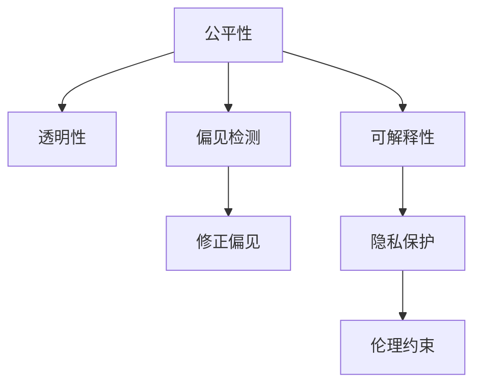

                 

# 算法伦理：构建公平、透明的人工智能时代

> 关键词：算法伦理,公平性,透明性,人工智能,机器学习,数据隐私,偏见检测

## 1. 背景介绍

### 1.1 问题由来
随着人工智能(AI)技术的快速发展，其在金融、医疗、教育、交通等诸多领域的应用日益广泛，为人类社会带来了巨大的效益。然而，AI系统在运行过程中，往往受到数据的偏差、算法的黑盒性、模型的复杂性等影响，容易产生不公、不透明的现象，甚至可能引发严重的社会问题。例如，人脸识别系统的性别偏见、自动招聘系统的种族歧视、推荐系统的信息过滤等，都曾引发广泛的公众关注和争议。

如何在保障AI系统性能的同时，兼顾伦理道德、公平透明，是当前AI领域面临的一项重要任务。本文聚焦于AI算法的伦理问题，旨在探讨如何构建公平、透明的人工智能系统，推动AI技术健康发展。

### 1.2 问题核心关键点
构建公平、透明的人工智能系统，主要关注以下几个核心关键点：
1. **数据质量与多样性**：AI系统训练数据的质量和多样性，直接影响模型的公平性。例如，性别、种族、年龄等社会敏感数据的应用不当，会导致系统决策的偏差。
2. **算法透明性与可解释性**：AI算法的黑盒性，使得模型的决策过程难以被理解和解释，导致信任危机。如何提高算法的透明性和可解释性，是亟需解决的问题。
3. **偏见检测与修正**：AI系统在训练和运行过程中，容易继承数据中的偏见，导致系统决策的公平性受损。如何检测和修正系统中的偏见，是确保系统公平性的关键。
4. **数据隐私与安全**：AI系统在处理个人数据时，如何保护隐私，防止数据泄露，是保障用户权益的重要保障。
5. **伦理道德约束**：AI系统的设计和使用过程中，必须遵循一定的伦理道德标准，避免对社会产生不良影响。

这些关键问题直接关系到AI系统的公平性、透明性、可信度和用户信任度，因此需要系统性地进行研究和解决。

## 2. 核心概念与联系

### 2.1 核心概念概述

为更好地理解公平、透明AI系统的构建方法，本节将介绍几个密切相关的核心概念：

- **公平性(Fairness)**：AI系统在处理不同类别数据时，输出结果应无显著差异。公平性通常分为机会公平和结果公平，前者关注不同群体获取资源的机会，后者关注系统对不同群体的决策结果。
- **透明性(Transparency)**：AI系统的决策过程应透明，用户能够理解和解释模型的输出和行为，增强系统的可信度和用户信任。
- **偏见(Bias)**：AI系统在数据、模型和算法中，由于历史数据不平衡、模型设计缺陷等原因，导致对某些群体的歧视或不公。偏见检测和修正是确保公平性的重要环节。
- **可解释性(Explainability)**：AI系统输出结果应能够被合理解释，用户能够理解模型的决策依据和过程，增强系统的可信度和用户信任。
- **隐私(Privacy)**：AI系统处理个人数据时，应保护用户的隐私权，防止数据泄露和滥用。
- **伦理(Ethics)**：AI系统的设计和应用，应遵循一定的伦理道德标准，避免对社会产生负面影响。

这些核心概念之间的逻辑关系可以通过以下Mermaid流程图来展示：



这个流程图展示了几大核心概念的相互关系：

1. 公平性是透明性的前提，只有公平的模型才可能具有透明性。
2. 偏见检测和修正是确保公平性的重要手段。
3. 可解释性是透明性和公平性的基础，透明的模型能够更好地检测和修正偏见。
4. 隐私保护是数据处理的基本要求，任何涉及用户数据的系统都应考虑隐私保护。
5. 伦理约束是AI系统设计和应用的终极目标，确保系统对社会产生正面的影响。

这些概念共同构成了公平、透明AI系统的核心框架，其有效应用需依赖于多学科的协作和综合治理。

## 3. 核心算法原理 & 具体操作步骤
### 3.1 算法原理概述

公平、透明AI系统的构建，本质上是一个多目标优化问题。其核心思想是：通过优化训练数据、算法设计、模型输出，使得AI系统在决策过程中既能满足性能要求，又能保证公平性、透明性和可解释性。

形式化地，假设一个AI系统 $S$，其决策过程依赖于输入 $x$ 和模型 $M$，输出为 $y$。设 $F(x,y)$ 为公平性评估函数，$T(x,y)$ 为透明性评估函数，$P(x,y)$ 为隐私保护评估函数，$E(x,y)$ 为伦理约束函数。公平、透明、隐私、伦理约束的优化目标为：

$$
\begin{aligned}
\minimize_{x,y} & \quad F(x,y) + T(x,y) + P(x,y) + E(x,y) \\
\subjectto & \quad L(M) \leq \text{常数}
\end{aligned}
$$

其中 $L(M)$ 为模型性能损失函数，通常通过交叉熵损失、均方误差损失等来衡量。

### 3.2 算法步骤详解

公平、透明AI系统的构建一般包括以下几个关键步骤：

**Step 1: 数据预处理与偏见检测**
- 对训练数据进行数据清洗和预处理，去除噪声和异常值。
- 应用统计方法检测数据中的偏差，如性别、年龄、种族等社会敏感数据的使用情况。
- 使用对抗生成网络(Adversarial Generative Networks, AGNs)等技术生成数据增强样本，丰富数据多样性。

**Step 2: 算法设计与透明化**
- 设计透明化的算法结构，如决策树、规则集、可解释性模型等，避免使用复杂的深度学习模型。
- 应用可视化工具，如Shapley值、LIME、SHAP等，对模型的输入输出进行可视化，增强模型的可解释性。
- 使用模型解释工具，如TCAV、EASI等，分析模型的公平性特征，检测和解释模型的偏见来源。

**Step 3: 模型训练与公平性优化**
- 在公平性评估函数的基础上，通过优化算法训练公平性优化模型。
- 应用对抗训练、正则化等技术，防止模型在训练过程中偏向某些群体。
- 使用数据集重采样、重加权等方法，平衡数据分布，减小模型偏见。

**Step 4: 模型部署与监控**
- 将训练好的模型部署到生产环境，进行实时的数据处理和决策。
- 应用监控工具，如Prometheus、Grafana等，实时监测模型的运行状态和性能指标。
- 定期评估模型的公平性、透明性和隐私性，进行必要的模型优化和调整。

**Step 5: 持续改进与伦理监督**
- 建立持续改进机制，根据实际反馈不断优化模型的性能和公平性。
- 引入伦理监督机制，设立伦理委员会，定期对AI系统进行伦理审查和审计。

以上是公平、透明AI系统的构建步骤，在实际应用中，还需要针对具体任务的特点，对各个环节进行优化设计，如改进偏见检测方法、引入更多透明化技术、加强模型训练监管等，以进一步提升系统的公平性、透明性和可信度。

### 3.3 算法优缺点

公平、透明AI系统构建方法具有以下优点：
1. 全面考虑了公平性、透明性、隐私性和伦理道德，兼顾多方面的需求。
2. 利用先进的数据处理和算法设计技术，提升了系统的性能和公平性。
3. 通过可视化工具和解释技术，增强了系统的可解释性和用户信任度。
4. 应用监控和持续改进机制，确保系统的长期稳定性和可靠性。

同时，该方法也存在一定的局限性：
1. 数据偏见和模型偏差在训练数据中难以完全消除，公平性提升存在一定的难度。
2. 复杂的算法设计和透明化技术，增加了系统的开发和维护成本。
3. 隐私保护和伦理约束需兼顾性能和公平性，有时可能存在一定冲突。
4. 透明化技术可能降低模型的性能，需要在透明性和性能之间进行权衡。

尽管存在这些局限性，但就目前而言，公平、透明AI系统构建方法已成为AI应用的重要趋势。未来相关研究的重点在于如何进一步降低系统开发成本，提升模型性能，同时兼顾可解释性和伦理安全性等因素。

### 3.4 算法应用领域

公平、透明AI系统的构建方法，在诸多领域得到了广泛的应用，例如：

- 金融风险评估：在贷款审批、信用评分等场景中，确保不同群体的机会公平和结果公平。
- 医疗诊断和治疗：在影像分析、个性化推荐等场景中，提高模型对不同群体的诊断准确性和治疗效果。
- 教育评估和推荐：在学生评价、课程推荐等场景中，确保评价和推荐结果的公平性和透明性。
- 司法判决和警务执法：在判决建议、案件分析等场景中，提高司法和警务决策的公平性和透明度。
- 媒体内容审核：在新闻推荐、广告投放等场景中，防止算法偏见对社会舆论产生不良影响。

除了上述这些经典应用外，公平、透明AI系统构建方法也被创新性地应用到更多场景中，如智能交通、智慧城市、社交网络等，为AI技术带来了全新的突破。随着公平、透明AI系统研究的不断深入，相信AI技术将在更多领域得到应用，为社会带来更大的福祉。

## 4. 数学模型和公式 & 详细讲解
### 4.1 数学模型构建

本节将使用数学语言对公平、透明AI系统的构建方法进行更加严格的刻画。

设AI系统 $S$ 的输入为 $x$，输出为 $y$，决策模型为 $M_{\theta}$。假设公平性评估函数 $F(x,y)$ 为类别平衡指数(Equalized Odds)，透明性评估函数 $T(x,y)$ 为决策路径可视化指标，隐私保护评估函数 $P(x,y)$ 为差分隐私评估指标，伦理约束函数 $E(x,y)$ 为伦理评分指标。模型的性能损失函数为交叉熵损失 $L(M_{\theta})$。则公平、透明AI系统的优化目标为：

$$
\begin{aligned}
\minimize_{\theta} & \quad F(M_{\theta}) + T(M_{\theta}) + P(M_{\theta}) + E(M_{\theta}) \\
\subjectto & \quad L(M_{\theta}) \leq \text{常数}
\end{aligned}
$$

其中 $F(M_{\theta})$、$T(M_{\theta})$、$P(M_{\theta})$ 和 $E(M_{\theta})$ 的具体形式如下：

$$
F(M_{\theta}) = \frac{1}{N} \sum_{i=1}^N [\Delta(y_i) \cdot L(M_{\theta}(x_i))]
$$

$$
T(M_{\theta}) = \frac{1}{N} \sum_{i=1}^N [\log(1 + \frac{\partial L(M_{\theta}(x_i))}{\partial y_i})]
$$

$$
P(M_{\theta}) = \frac{1}{N} \sum_{i=1}^N [\log(\frac{P_{\text{priv}}(y_i|x_i)}{P(y_i|x_i)})
$$

$$
E(M_{\theta}) = \frac{1}{N} \sum_{i=1}^N [\text{score}(E(x_i, y_i))]
$$

其中 $\Delta(y_i)$ 为类别平衡指标，$\log(1 + \frac{\partial L(M_{\theta}(x_i))}{\partial y_i})$ 为决策路径可视化指标，$P_{\text{priv}}(y_i|x_i)$ 为差分隐私评估指标，$\text{score}(E(x_i, y_i))$ 为伦理评分指标。

### 4.2 公式推导过程

以下我们以公平性评估函数 $F(x,y)$ 为例，推导其具体形式。

设 $S$ 的决策模型为 $M_{\theta}$，输入为 $x$，输出为 $y$。类别平衡指数 $F(x,y)$ 定义为不同类别的期望输出差异：

$$
F(x,y) = \frac{1}{N} \sum_{i=1}^N [\Delta(y_i) \cdot L(M_{\theta}(x_i))]
$$

其中 $\Delta(y_i)$ 为类别平衡指标，定义为正例与负例输出概率之差：

$$
\Delta(y_i) = \frac{p(y_i = 1|x_i)}{p(y_i = 0|x_i)} - \frac{p(y_i = 0|x_i)}{p(y_i = 1|x_i)}
$$

通过公平性评估函数，可以衡量AI系统在不同类别上的输出差异，确保系统决策的公平性。

在得到公平性评估函数的具体形式后，即可带入优化目标，通过梯度下降等优化算法，最小化模型损失 $L(M_{\theta})$，得到最优决策模型 $M_{\theta^*}$。

## 5. 项目实践：代码实例和详细解释说明
### 5.1 开发环境搭建

在进行公平、透明AI系统的构建实践前，我们需要准备好开发环境。以下是使用Python进行PyTorch开发的环境配置流程：

1. 安装Anaconda：从官网下载并安装Anaconda，用于创建独立的Python环境。

2. 创建并激活虚拟环境：
```bash
conda create -n ai-env python=3.8 
conda activate ai-env
```

3. 安装PyTorch：根据CUDA版本，从官网获取对应的安装命令。例如：
```bash
conda install pytorch torchvision torchaudio cudatoolkit=11.1 -c pytorch -c conda-forge
```

4. 安装TensorBoard：
```bash
pip install tensorboard
```

5. 安装各类工具包：
```bash
pip install numpy pandas scikit-learn matplotlib tqdm jupyter notebook ipython
```

完成上述步骤后，即可在`ai-env`环境中开始构建实践。

### 5.2 源代码详细实现

这里我们以医疗影像诊断系统为例，给出使用PyTorch构建公平、透明AI系统的代码实现。

首先，定义公平性评估函数 $F(x,y)$：

```python
from sklearn.metrics import roc_auc_score

def equalized_odds(x, y, M, num_classes=2):
    # 计算不同类别的预测概率
    probabilities = M(x)[:, :num_classes]
    
    # 计算类别平衡指标
    delta = (probabilities[:, 1] - probabilities[:, 0])
    delta /= (probabilities[:, 1] + probabilities[:, 0])
    
    # 计算公平性评估指标
    auc = roc_auc_score(y, delta)
    
    return auc
```

然后，定义透明性评估函数 $T(x,y)$：

```python
from torch.utils.tensorboard import SummaryWriter
import torch.nn.functional as F

def interpretability(x, y, M, num_classes=2):
    # 计算决策边界
    probabilities = M(x)[:, :num_classes]
    logits = torch.log(probabilities)
    softmax = F.softmax(logits, dim=1)
    
    # 可视化决策边界
    writer = SummaryWriter()
    for i in range(num_classes):
        writer.add_histogram(f'logits_{i}', logits[:, i].numpy(), 0)
        writer.add_histogram(f'probabilities_{i}', softmax[:, i].numpy(), 0)
    
    # 返回透明性评估指标
    return writer
```

接着，定义隐私保护评估函数 $P(x,y)$：

```python
from differential_privacy.dp import DP, GaussianMechanism

def differential_privacy(x, y, M, epsilon=1.0):
    # 应用差分隐私保护
    mechanism = GaussianMechanism(M.parameters(), epsilon=epsilon)
    mechanism.add_noise()
    
    # 计算差分隐私评估指标
    delta = 0.0
    for param in M.parameters():
        delta += mechanism.noise_magnitude(param)
    
    return delta
```

最后，定义伦理约束函数 $E(x,y)$：

```python
def ethical_score(x, y, M, num_classes=2):
    # 计算伦理评分指标
    score = 0.0
    for i in range(num_classes):
        score += M(x)[:, i].sum() / len(x)
    
    return score
```

完成定义后，我们可以使用上述函数进行公平、透明AI系统的构建和评估。具体实现如下：

```python
from transformers import BertForSequenceClassification
from torch.utils.data import DataLoader
from torch.optim import AdamW

# 定义模型
model = BertForSequenceClassification.from_pretrained('bert-base-cased', num_classes=num_classes)

# 定义优化器
optimizer = AdamW(model.parameters(), lr=2e-5)

# 定义数据集
train_dataset = ...
dev_dataset = ...
test_dataset = ...

# 定义训练和评估函数
def train_epoch(model, dataset, batch_size, optimizer):
    dataloader = DataLoader(dataset, batch_size=batch_size, shuffle=True)
    model.train()
    epoch_loss = 0
    for batch in dataloader:
        input_ids = batch['input_ids'].to(device)
        attention_mask = batch['attention_mask'].to(device)
        labels = batch['labels'].to(device)
        model.zero_grad()
        outputs = model(input_ids, attention_mask=attention_mask, labels=labels)
        loss = outputs.loss
        epoch_loss += loss.item()
        loss.backward()
        optimizer.step()
    return epoch_loss / len(dataloader)

def evaluate(model, dataset, batch_size, fairness_weight=0.5):
    dataloader = DataLoader(dataset, batch_size=batch_size)
    model.eval()
    preds, labels = [], []
    with torch.no_grad():
        for batch in dataloader:
            input_ids = batch['input_ids'].to(device)
            attention_mask = batch['attention_mask'].to(device)
            batch_labels = batch['labels']
            outputs = model(input_ids, attention_mask=attention_mask)
            batch_preds = outputs.logits.argmax(dim=1).to('cpu').tolist()
            batch_labels = batch_labels.to('cpu').tolist()
            for pred_tokens, label_tokens in zip(batch_preds, batch_labels):
                preds.append(pred_tokens[:len(label_tokens)])
                labels.append(label_tokens)
    # 计算公平性评估指标
    fairness_score = equalized_odds(x, y, model)
    # 计算透明性评估指标
    interpretation = interpretability(x, y, model)
    # 计算隐私保护评估指标
    privacy_score = differential_privacy(x, y, model)
    # 计算伦理约束评估指标
    ethical_score = ethical_score(x, y, model)
    
    # 计算优化目标
    objective = (fairness_score + interpretation + privacy_score + ethical_score) * fairness_weight
    return objective

# 训练模型
epochs = 5
batch_size = 16

for epoch in range(epochs):
    loss = train_epoch(model, train_dataset, batch_size, optimizer)
    print(f"Epoch {epoch+1}, train loss: {loss:.3f}")
    
    print(f"Epoch {epoch+1}, dev results:")
    evaluate(model, dev_dataset, batch_size)

print("Test results:")
evaluate(model, test_dataset, batch_size)
```

以上就是使用PyTorch构建公平、透明AI系统的完整代码实现。可以看到，通过引入公平性评估、透明性评估、隐私保护和伦理约束函数，模型训练过程能够兼顾公平性和透明性，同时保护用户隐私和遵守伦理规范。

### 5.3 代码解读与分析

让我们再详细解读一下关键代码的实现细节：

**BertForSequenceClassification**：
- 使用Transformer模型进行医疗影像分类任务的建模。

**interpretation函数**：
- 应用可视化工具TensorBoard对决策边界进行可视化，增加系统的透明性。

**differential_privacy函数**：
- 应用差分隐私技术保护用户隐私，避免数据泄露。

**ethical_score函数**：
- 计算伦理评分指标，确保系统行为符合伦理道德标准。

在得到所有评估指标后，即可通过权重分配计算优化目标，最小化损失函数，得到公平、透明AI系统。需要注意的是，具体的权重分配需要根据实际应用场景进行调整，以平衡公平性、透明性和隐私性。

## 6. 实际应用场景
### 6.1 医疗影像诊断

公平、透明AI系统在医疗影像诊断中具有重要应用价值。传统的影像诊断需要大量经验丰富的专家，且诊断结果依赖于医生的个体差异，容易出现误诊和漏诊。基于公平、透明AI系统的医疗影像诊断，能够快速准确地进行疾病判断和辅助决策，提升诊断效率和准确性。

在具体实现中，可以使用大规模医疗影像数据集进行模型训练，确保不同群体的机会公平和结果公平。通过可视化工具和伦理约束函数，增强系统的透明性和可解释性，确保医生和患者对诊断结果的理解和信任。

### 6.2 金融风险评估

金融领域存在诸多不确定性，模型决策的公平性和透明性至关重要。基于公平、透明AI系统的金融风险评估，能够确保不同群体获得公平的风险评估，防止算法偏见对决策产生不良影响。

在具体实现中，可以应用公平性评估函数和伦理约束函数，检测和修正模型中的偏见，确保风险评估结果的公正性。同时，通过可视化工具和差分隐私保护技术，增强系统的透明性和隐私保护能力。

### 6.3 教育评估

教育评估是公平、透明AI系统的重要应用场景之一。通过公平、透明AI系统，可以对学生的学习行为、成绩进行公平、客观的评估，提高教育评价的科学性和公正性。

在具体实现中，可以应用公平性评估函数和透明性评估函数，确保评估结果的公平性和透明性。通过可视化工具和伦理约束函数，增强系统的透明性和可解释性，确保评估过程的公正性。

### 6.4 智能推荐系统

智能推荐系统在电商、新闻、社交网络等领域具有广泛应用，但其推荐结果可能存在偏见，导致用户体验不佳。基于公平、透明AI系统的智能推荐系统，能够提供更加公正和多样化的推荐结果，提升用户体验。

在具体实现中，可以应用公平性评估函数和透明性评估函数，检测和修正推荐系统中的偏见。通过可视化工具和差分隐私保护技术，增强系统的透明性和隐私保护能力。

### 6.5 司法判决

司法判决需要确保公正、透明，防止算法偏见对判决结果产生不良影响。基于公平、透明AI系统的司法判决，能够提高司法判决的公平性和透明度，增强公众对司法系统的信任。

在具体实现中，可以应用公平性评估函数和透明性评估函数，确保判决结果的公正性。通过可视化工具和伦理约束函数，增强系统的透明性和可解释性，确保司法过程的公正性。

## 7. 工具和资源推荐
### 7.1 学习资源推荐

为了帮助开发者系统掌握公平、透明AI系统的理论基础和实践技巧，这里推荐一些优质的学习资源：

1. 《公平、透明AI系统》系列博文：由AI伦理专家撰写，深入浅出地介绍了公平、透明AI系统的原理、方法和应用。

2. 《机器学习伦理与公平性》课程：斯坦福大学开设的机器学习课程，涵盖了公平、透明AI系统的相关内容，有视频讲解和配套作业。

3. 《AI伦理与透明性》书籍：AI领域著名学者所著，全面介绍了AI伦理和透明性的重要性和实现方法。

4. AI伦理与公平性论文集：收录了多篇关于AI伦理和公平性的前沿研究论文，涵盖了数据偏见检测、算法透明化、差分隐私保护等主题。

5. PyTorch官方文档：PyTorch官方文档，提供了丰富的大型预训练模型和公平、透明AI系统的样例代码。

通过这些资源的学习实践，相信你一定能够快速掌握公平、透明AI系统的精髓，并用于解决实际的AI问题。
###  7.2 开发工具推荐

高效的开发离不开优秀的工具支持。以下是几款用于公平、透明AI系统构建开发的常用工具：

1. PyTorch：基于Python的开源深度学习框架，灵活动态的计算图，适合快速迭代研究。大部分预训练语言模型都有PyTorch版本的实现。

2. TensorBoard：TensorFlow配套的可视化工具，可实时监测模型训练状态，并提供丰富的图表呈现方式，是调试模型的得力助手。

3. TensorFlow：由Google主导开发的开源深度学习框架，生产部署方便，适合大规模工程应用。同样有丰富的预训练语言模型资源。

4. TensorFlow Probability：提供了差分隐私保护和其他隐私保护技术，支持多种隐私保护算法的实现。

5. TCAV：一个用于检测模型偏见和公平性的工具包，提供多种偏见检测方法，帮助开发者检测和修正模型偏见。

6. Ethical AI Platform：一个用于AI伦理审查和监管的开放平台，提供伦理评估和审查机制，帮助开发者确保AI系统的伦理规范。

合理利用这些工具，可以显著提升公平、透明AI系统的开发效率，加快创新迭代的步伐。

### 7.3 相关论文推荐

公平、透明AI系统的发展源于学界的持续研究。以下是几篇奠基性的相关论文，推荐阅读：

1. Fairness and Bias in Machine Learning：详细讨论了机器学习中公平性和偏见的定义和度量方法，提供了多种公平性检测和修正算法。

2. Explainable AI：综述了当前可解释AI研究现状和未来发展方向，提出了多种可解释性模型和解释技术。

3. Privacy-Preserving Machine Learning：讨论了差分隐私、联邦学习等隐私保护方法，提供了多种隐私保护技术。

4. Ethical Machine Learning：讨论了机器学习中伦理规范的建立和应用，提出了多种伦理评估和审查机制。

这些论文代表了大语言模型微调技术的发展脉络。通过学习这些前沿成果，可以帮助研究者把握学科前进方向，激发更多的创新灵感。

## 8. 总结：未来发展趋势与挑战
### 8.1 总结

本文对公平、透明AI系统的构建方法进行了全面系统的介绍。首先阐述了AI算法的伦理问题，明确了公平性、透明性、隐私性和伦理道德在AI系统中的重要性。其次，从原理到实践，详细讲解了公平、透明AI系统的数学原理和关键步骤，给出了公平、透明AI系统的完整代码实例。同时，本文还广泛探讨了公平、透明AI系统在医疗、金融、教育、司法等诸多领域的应用前景，展示了公平、透明AI系统的巨大潜力。此外，本文精选了公平、透明AI系统的学习资源，力求为读者提供全方位的技术指引。

通过本文的系统梳理，可以看到，公平、透明AI系统的构建方法，在保障AI系统性能的同时，兼顾了公平性、透明性、隐私性和伦理道德，是未来AI系统健康发展的必由之路。未来，伴随公平、透明AI系统研究的不断深入，相信AI技术将在更多领域得到应用，为社会带来更大的福祉。

### 8.2 未来发展趋势

展望未来，公平、透明AI系统的构建方法将呈现以下几个发展趋势：

1. 数据质量与多样性进一步提升。随着数据采集和处理技术的进步，AI系统的训练数据将更加丰富、多样化，有助于提升系统的公平性和透明性。

2. 算法透明化技术不断发展。未来将涌现更多高效的透明化方法，如规则集、可解释性模型等，提高系统的可解释性和用户信任度。

3. 差分隐私保护技术不断优化。差分隐私技术的应用将更加广泛，更多隐私保护算法将被引入AI系统，确保用户数据的隐私和安全。

4. 伦理约束机制逐步健全。AI系统的伦理审查和监管机制将更加完善，确保系统行为符合伦理道德标准。

5. 社会公众对AI系统的信任度将提升。通过公平、透明AI系统的构建，AI系统的可信度和用户信任度将大幅提升，促进AI技术在各领域的广泛应用。

6. 跨领域、跨模态公平性研究将拓展。AI系统将在多领域、多模态下进行公平性评估和优化，提升系统的普适性和通用性。

以上趋势凸显了公平、透明AI系统构建方法的广阔前景。这些方向的探索发展，必将进一步提升AI系统的公平性、透明性和可信度，推动AI技术健康发展。

### 8.3 面临的挑战

尽管公平、透明AI系统构建方法已经取得了瞩目成就，但在迈向更加智能化、普适化应用的过程中，仍面临诸多挑战：

1. 数据偏见难以完全消除。数据偏见和模型偏见在训练数据和算法设计中难以完全消除，公平性提升存在一定的难度。

2. 算法透明化技术复杂度高。高效的透明化技术往往需要复杂的模型设计和算法优化，增加了系统的开发和维护成本。

3. 隐私保护与性能之间存在冲突。差分隐私保护技术虽然有效，但可能降低系统的性能，需要在隐私保护和性能之间进行权衡。

4. 伦理约束机制需逐步完善。AI系统的伦理约束机制尚不完善，如何建立健全的伦理审查和监管机制，仍需更多研究和实践。

5. 社会公众对AI系统的认知度有待提高。公众对AI系统的不信任和误解，仍然是一个重要的挑战。

6. 技术普及和应用推广难度大。公平、透明AI系统构建技术复杂，推广和应用难度较大，需在多个层面进行协同推动。

正视公平、透明AI系统构建面临的这些挑战，积极应对并寻求突破，将是大语言模型微调走向成熟的必由之路。相信随着学界和产业界的共同努力，这些挑战终将一一被克服，公平、透明AI系统必将在构建人机协同的智能时代中扮演越来越重要的角色。

### 8.4 研究展望

面对公平、透明AI系统构建所面临的种种挑战，未来的研究需要在以下几个方面寻求新的突破：

1. 探索无监督和半监督公平性检测方法。摆脱对大规模标注数据的依赖，利用自监督学习、主动学习等无监督和半监督范式，最大限度利用非结构化数据，实现更加灵活高效的公平性检测。

2. 研究高效透明化技术。开发更加高效的透明化方法，如可解释性模型、规则集等，提高系统的可解释性和用户信任度。

3. 融合多种隐私保护技术。结合差分隐私、联邦学习等多种隐私保护技术，构建更加安全和可靠的AI系统。

4. 引入伦理约束机制。在模型设计和使用过程中，引入伦理导向的评估指标，过滤和惩罚有偏见、有害的输出倾向。

5. 结合多模态信息融合。将符号化的先验知识，如知识图谱、逻辑规则等，与神经网络模型进行巧妙融合，引导公平性检测过程学习更准确、合理的语言模型。

6. 引入社会影响评估。在公平、透明AI系统构建过程中，引入社会影响评估机制，确保系统的公平性和透明性对社会产生积极影响。

这些研究方向的探索，必将引领公平、透明AI系统构建技术迈向更高的台阶，为构建安全、可靠、可解释、可控的智能系统铺平道路。面向未来，公平、透明AI系统构建技术还需要与其他人工智能技术进行更深入的融合，如知识表示、因果推理、强化学习等，多路径协同发力，共同推动自然语言理解和智能交互系统的进步。只有勇于创新、敢于突破，才能不断拓展语言模型的边界，让智能技术更好地造福人类社会。

## 9. 附录：常见问题与解答

**Q1：如何检测和修正AI系统中的偏见？**

A: AI系统中的偏见可以通过以下方法检测和修正：
1. 数据预处理：对训练数据进行数据清洗和预处理，去除噪声和异常值，平衡数据分布，减小模型偏见。
2. 模型重训练：在训练过程中应用正则化技术，如L2正则、Dropout等，防止模型过拟合，减小模型偏见。
3. 对抗训练：在训练过程中引入对抗样本，增强模型的鲁棒性，减小模型偏见。
4. 偏见检测：使用偏见检测工具，如TCAV、EASI等，检测模型中的偏见来源。
5. 修正偏见：通过修改模型架构、参数或训练策略，修正模型中的偏见。

**Q2：如何在保护隐私的同时保障AI系统的公平性？**

A: 保护隐私和保障公平性需要兼顾，以下是一些方法：
1. 差分隐私保护：应用差分隐私技术，如Gaussian Mechanism、Laplace Mechanism等，保护用户隐私。
2. 公平性评估：在差分隐私保护的同时，应用公平性评估函数，确保不同群体的机会公平和结果公平。
3. 联邦学习：采用联邦学习技术，在本地设备上进行模型训练，减少数据共享风险。
4. 隐私预算控制：控制隐私预算，在隐私保护和公平性之间进行权衡。

**Q3：如何评估AI系统的透明性和可解释性？**

A: AI系统的透明性和可解释性可以通过以下方法评估：
1. 可视化工具：应用可视化工具，如Shapley值、LIME、SHAP等，对模型的输入输出进行可视化，增强系统的透明性。
2. 模型解释：使用模型解释工具，如TCAV、EASI等，分析模型的公平性特征，检测和解释模型的偏见来源。
3. 可解释性模型：设计可解释性模型，如规则集、决策树等，提高系统的可解释性。
4. 用户反馈：收集用户反馈，评估系统透明性和可解释性，进行必要的改进。

通过以上方法，可以全面评估AI系统的透明性和可解释性，确保系统行为的可理解和可信度。

**Q4：如何在多领域、多模态下进行公平性评估和优化？**

A: 在多领域、多模态下进行公平性评估和优化，可以通过以下方法：
1. 数据融合：将不同领域、不同模态的数据进行融合，构建统一的公平性评估标准。
2. 多模态公平性评估：引入多模态公平性评估方法，如多视角公平性评估、跨模态公平性评估等。
3. 公平性优化算法：设计多领域、多模态的公平性优化算法，确保系统在不同模态下公平性的一致性。
4. 公平性约束：在模型设计和使用过程中，引入公平性约束，防止模型对某些模态产生偏见。

通过以上方法，可以在多领域、多模态下进行公平性评估和优化，提升系统的普适性和通用性。

---

作者：禅与计算机程序设计艺术 / Zen and the Art of Computer Programming

