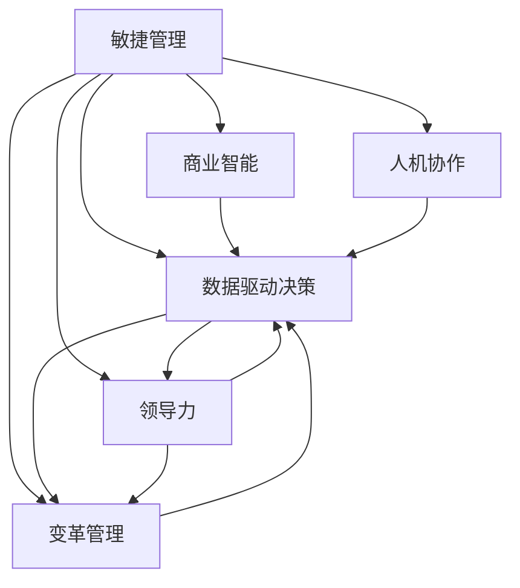

                 

# 管理者如何应对快速变化的商业环境

> 关键词：敏捷管理, 商业智能, 数据驱动决策, 领导力, 变革管理, 人机协作

## 1. 背景介绍

### 1.1 问题由来
在当前这个快速变化的时代，商业环境的不确定性日益增加。从全球化的经济格局到数字化转型的技术革命，再到全球性公共卫生事件带来的挑战，所有这些都要求管理者具备更高的适应性和灵活性。传统的基于计划和执行的管理模式已经无法满足快速变化的需求，管理者需要找到新的应对策略。

### 1.2 问题核心关键点
1. **敏捷管理**：敏捷管理是一种适应变化的管理方法，强调快速响应、持续改进和团队协作。
2. **商业智能(BI)**：BI技术可以帮助管理者快速获取和分析数据，做出更加准确的决策。
3. **数据驱动决策**：利用大数据和分析技术，管理者可以基于实证数据做出决策，减少主观判断的误差。
4. **领导力**：有效的领导力是应对变化的基石，管理者需要培养适应变革、激励团队的能力。
5. **变革管理**：如何有效管理变革过程，确保组织成员顺利过渡到新的运营模式。
6. **人机协作**：在技术日益普及的今天，管理者需要学会如何与人工智能和其他技术工具协作，以提升效率和创新能力。

### 1.3 问题研究意义
管理者应对快速变化的商业环境，不仅是提高组织效率和竞争力的必要手段，也是推动社会进步的关键因素。通过对敏捷管理、商业智能、数据驱动决策等关键技术的深入研究和应用，管理者可以更好地适应未来的挑战，引领组织走向成功。

## 2. 核心概念与联系

### 2.1 核心概念概述

为更好地理解如何应对快速变化的商业环境，本节将介绍几个密切相关的核心概念：

- **敏捷管理(Agile Management)**：敏捷管理是一种通过快速响应和迭代改进来适应变化的流程。它强调灵活性、协作和持续反馈。
- **商业智能(Business Intelligence, BI)**：BI技术涉及数据的收集、存储、分析和可视化，以支持决策制定。
- **数据驱动决策(Data-Driven Decision Making)**：利用数据和分析技术支持决策过程，减少主观判断。
- **领导力(Leadership)**：领导力是指引导和管理团队以达到组织目标的能力。
- **变革管理(Change Management)**：变革管理涉及组织结构的重新设计和员工技能的重新分配，以适应新的商业环境。
- **人机协作(Human-AI Collaboration)**：人机协作是指人类与人工智能技术的结合，以提高工作效率和创新能力。

这些核心概念之间的逻辑关系可以通过以下Mermaid流程图来展示：



这个流程图展示了大语言模型的核心概念及其之间的关系：

1. 敏捷管理通过灵活的流程和持续反馈，驱动商业智能和数据驱动决策。
2. 商业智能和数据驱动决策依赖于敏捷管理和领导力，确保数据的质量和决策的有效性。
3. 变革管理与领导力相辅相成，共同推动组织的结构重塑和人员技能的提升。
4. 人机协作是新技术手段，可以提升敏捷管理、商业智能和数据驱动决策的效率。

这些概念共同构成了快速变化商业环境的应对框架，帮助管理者更好地应对挑战。

## 3. 核心算法原理 & 具体操作步骤
### 3.1 算法原理概述

敏捷管理、商业智能、数据驱动决策等技术的应用，本质上是基于现代组织管理理论和信息技术的一次综合性创新。其核心思想是通过敏捷流程、数据分析和智能工具，实现组织的灵活适应和高效决策。

敏捷管理通过迭代、反馈和持续改进，适应快速变化的环境。其核心流程包括需求分析、计划制定、执行和评估。通过快速响应和迭代改进，敏捷管理可以有效地应对市场和技术的变化。

商业智能通过数据分析和可视化，支持管理者做出基于实证的决策。它通常包括数据收集、数据仓库建立、数据挖掘和报表生成等步骤。商业智能有助于管理者识别趋势、预测未来并制定策略。

数据驱动决策则强调利用数据和分析技术，减少主观判断，做出更加客观的决策。数据驱动决策通常依赖于数据收集、数据清洗、数据建模和模型评估等步骤。

### 3.2 算法步骤详解

敏捷管理、商业智能和数据驱动决策的具体操作流程如下：

**敏捷管理**
1. **需求分析**：与利益相关者沟通，明确项目需求和目标。
2. **计划制定**：根据需求分析，制定详细的项目计划和时间表。
3. **执行**：按照计划执行项目任务，定期召开迭代会议。
4. **评估**：在每次迭代结束时，评估任务完成情况和质量，进行持续改进。

**商业智能**
1. **数据收集**：收集与业务相关的数据，建立数据仓库。
2. **数据清洗**：清洗和整合数据，确保数据质量和一致性。
3. **数据分析**：利用数据分析工具，如SQL、Python等，进行数据挖掘和建模。
4. **可视化**：使用BI工具，如Tableau、Power BI等，将分析结果可视化，生成报表和仪表盘。

**数据驱动决策**
1. **数据收集**：利用传感器、API等手段，收集业务运营数据。
2. **数据清洗**：清洗数据，去除噪声和异常值。
3. **数据分析**：使用机器学习算法，如回归、分类、聚类等，进行数据建模和预测。
4. **模型评估**：使用测试数据集，评估模型效果，优化模型参数。
5. **决策制定**：基于模型结果，制定业务策略和行动计划。

### 3.3 算法优缺点

敏捷管理、商业智能和数据驱动决策各自具备以下优缺点：

敏捷管理的优点：
1. 灵活适应变化：快速响应市场和技术变化。
2. 团队协作：促进团队成员的沟通和协作。
3. 持续改进：通过迭代改进，不断优化流程和产品。

敏捷管理的缺点：
1. 需要高水平的管理能力：管理者需要具备优秀的沟通、协调和领导能力。
2. 资源消耗较大：迭代和反馈过程需要大量的人力物力。

商业智能的优点：
1. 数据驱动：基于实证数据做出决策，减少主观判断误差。
2. 可视化：直观展示数据和分析结果，便于理解和决策。
3. 支持决策：提供数据支持和决策建议，提升决策质量。

商业智能的缺点：
1. 数据质量要求高：数据质量差会严重影响分析结果。
2. 技术复杂：需要专业的数据科学和信息技术支持。
3. 成本较高：数据收集、处理和分析需要大量技术和人力投入。

数据驱动决策的优点：
1. 客观性：基于数据和分析结果，减少主观判断。
2. 预测性：通过建模和预测，提前识别风险和机会。
3. 动态调整：实时获取数据和反馈，动态调整决策。

数据驱动决策的缺点：
1. 模型依赖性：模型质量和参数设定直接影响决策效果。
2. 数据隐私：大量数据收集可能带来隐私和法律风险。
3. 技术门槛高：需要专业的数据科学和机器学习知识。

### 3.4 算法应用领域

敏捷管理、商业智能和数据驱动决策已经在多个领域得到了广泛应用，例如：

- **企业运营**：敏捷管理可以帮助企业快速响应市场变化，提高产品开发和运营效率。
- **市场营销**：商业智能可以分析客户行为数据，制定更精准的营销策略。
- **财务管理**：数据驱动决策可以优化财务预算和成本控制，提升财务健康度。
- **人力资源**：敏捷管理可以优化招聘和培训流程，提高员工满意度和工作效率。
- **医疗健康**：商业智能可以分析患者数据，制定个性化的治疗方案。
- **教育培训**：数据驱动决策可以优化课程设计，提升教学效果和学习成果。

除了上述这些领域，敏捷管理、商业智能和数据驱动决策还在更多场景中得到了应用，为组织带来了显著的效益。

## 4. 数学模型和公式 & 详细讲解  
### 4.1 数学模型构建

本节将使用数学语言对敏捷管理、商业智能、数据驱动决策等关键技术的应用过程进行更加严格的刻画。

**敏捷管理**
敏捷管理通常涉及多个迭代周期，每个周期内包含多个任务和子任务。假设一个敏捷项目包含 $n$ 个迭代周期，每个迭代周期包含 $m$ 个任务，每个任务需要 $t_i$ 个工作小时，则总工时为：

$$
T = \sum_{i=1}^n \sum_{j=1}^m t_i
$$

**商业智能**
商业智能的数学模型通常涉及数据清洗、数据分析和可视化等多个环节。假设数据清洗后的有效数据量为 $D$，则数据分析和可视化过程可以表示为：

$$
Y = \text{BI-Model}(D)
$$

其中 $\text{BI-Model}$ 表示商业智能模型的计算过程。

**数据驱动决策**
数据驱动决策的核心是建立数据模型并利用其进行预测和决策。假设决策问题可以用一个回归模型 $M$ 来表示，其输入为 $X$，输出为 $Y$，则模型可以表示为：

$$
Y = M(X)
$$

其中 $M$ 为回归模型的参数，$X$ 为输入特征向量。

### 4.2 公式推导过程

以下是敏捷管理、商业智能和数据驱动决策的具体公式推导：

**敏捷管理**
1. **需求分析**：假设需求数量为 $N$，则总需求时间为：

$$
T_{需求} = N \times D_{需求}
$$

其中 $D_{需求}$ 为需求分析的平均时间。

2. **计划制定**：假设计划时间为 $T_{计划}$，则计划阶段的总时间为：

$$
T_{计划} = T_{需求} + T_{设计} + T_{评估}
$$

其中 $T_{设计}$ 为项目设计的时间，$T_{评估}$ 为初步评估的时间。

3. **执行**：假设每个迭代周期需要 $T_{迭代}$ 小时，则总执行时间为：

$$
T_{执行} = n \times m \times T_{迭代}
$$

4. **评估**：假设每个迭代周期需要 $T_{评估}$ 小时，则总评估时间为：

$$
T_{评估} = n \times T_{评估}
$$

**商业智能**
1. **数据收集**：假设数据总量为 $D_{数据}$，则数据收集阶段的总时间为：

$$
T_{收集} = D_{数据} \times R_{收集}
$$

其中 $R_{收集}$ 为数据收集的速率。

2. **数据清洗**：假设数据清洗率为 $C_{清洗}$，则数据清洗阶段的总时间为：

$$
T_{清洗} = D_{数据} \times C_{清洗}
$$

3. **数据分析**：假设数据分析模型为 $\text{BI-Model}$，则需要的时间为：

$$
T_{分析} = D_{数据} \times P_{分析}
$$

其中 $P_{分析}$ 为数据分析的效率。

4. **可视化**：假设可视化效率为 $V_{可视化}$，则需要的时间为：

$$
T_{可视化} = D_{数据} \times V_{可视化}
$$

**数据驱动决策**
1. **数据收集**：假设数据总量为 $D_{数据}$，则数据收集阶段的总时间为：

$$
T_{收集} = D_{数据} \times R_{收集}
$$

2. **数据清洗**：假设数据清洗率为 $C_{清洗}$，则数据清洗阶段的总时间为：

$$
T_{清洗} = D_{数据} \times C_{清洗}
$$

3. **数据建模**：假设模型训练时间为 $T_{模型}$，则需要的时间为：

$$
T_{模型} = D_{数据} \times P_{模型}
$$

其中 $P_{模型}$ 为模型训练的效率。

4. **模型评估**：假设模型评估时间为 $T_{评估}$，则需要的时间为：

$$
T_{评估} = D_{数据} \times C_{评估}
$$

其中 $C_{评估}$ 为模型评估的效率。

5. **决策制定**：假设决策时间为 $T_{决策}$，则需要的时间为：

$$
T_{决策} = T_{模型} + T_{评估} + T_{执行}
$$

其中 $T_{执行}$ 为模型决策的执行时间。

### 4.3 案例分析与讲解

假设某电商企业需要开发一个敏捷项目，该项目包含6个迭代周期，每个迭代周期包含10个任务，每个任务需要5小时，每个迭代周期还需预留2小时用于初步评估。需求分析时间为每个任务5小时，设计时间为每个任务2小时。数据清洗率为80%，数据分析效率为每小时处理1GB数据，可视化效率为每小时处理2GB数据。假设模型训练效率为每小时处理0.1GB数据，模型评估效率为每小时处理0.2GB数据，决策执行效率为每小时处理1GB数据。

**敏捷管理**
1. **需求分析**：总需求时间为 $6 \times 10 \times 5 = 300$ 小时。
2. **计划制定**：总计划时间为 $300 + 10 \times 2 + 6 \times 2 = 318$ 小时。
3. **执行**：总执行时间为 $6 \times 10 \times 5 + 6 \times 2 = 330$ 小时。
4. **评估**：总评估时间为 $6 \times 2 = 12$ 小时。
5. **总工时**：总工时为 $318 + 330 + 12 = 660$ 小时。

**商业智能**
1. **数据收集**：假设总数据量为1TB，则数据收集阶段的总时间为 $1 \times 10^{12} \times 1/1000$ 小时 = $10^9$ 小时。
2. **数据清洗**：数据清洗率为80%，则数据清洗阶段的总时间为 $1 \times 10^{12} \times 0.8 = 8 \times 10^{11}$ 小时。
3. **数据分析**：数据总量为1TB，数据分析效率为每小时处理1GB数据，则总时间为 $1 \times 10^{12} \times 1 = 10^9$ 小时。
4. **可视化**：数据总量为1TB，可视化效率为每小时处理2GB数据，则总时间为 $1 \times 10^{12} \times 2 = 2 \times 10^9$ 小时。

**数据驱动决策**
1. **数据收集**：假设总数据量为1TB，则数据收集阶段的总时间为 $1 \times 10^{12} \times 1/1000$ 小时 = $10^9$ 小时。
2. **数据清洗**：数据清洗率为80%，则数据清洗阶段的总时间为 $1 \times 10^{12} \times 0.8 = 8 \times 10^{11}$ 小时。
3. **数据建模**：模型训练效率为每小时处理0.1GB数据，则总时间为 $1 \times 10^{12} \times 0.1 = 10^9$ 小时。
4. **模型评估**：模型评估效率为每小时处理0.2GB数据，则总时间为 $1 \times 10^{12} \times 0.2 = 2 \times 10^9$ 小时。
5. **决策制定**：模型训练时间为10小时，模型评估时间为20小时，决策执行时间为1小时，则总时间为 $10 + 20 + 1 = 31$ 小时。

通过以上公式和计算，可以清晰地看到敏捷管理、商业智能和数据驱动决策的关键参数和计算方法。

## 5. 项目实践：代码实例和详细解释说明
### 5.1 开发环境搭建

在进行敏捷管理、商业智能和数据驱动决策实践前，我们需要准备好开发环境。以下是使用Python进行敏捷管理、商业智能和数据驱动决策开发的环境配置流程：

1. 安装Python：从官网下载并安装Python，确保版本为3.8以上。
2. 安装Jupyter Notebook：通过pip安装Jupyter Notebook，用于编写和运行代码。
3. 安装Pandas和NumPy：通过pip安装Pandas和NumPy，用于数据处理和计算。
4. 安装Matplotlib：通过pip安装Matplotlib，用于数据可视化。
5. 安装Scikit-learn：通过pip安装Scikit-learn，用于数据分析和建模。

完成上述步骤后，即可在本地开发环境中进行敏捷管理、商业智能和数据驱动决策的实践。

### 5.2 源代码详细实现

这里我们以一个简单的电商项目为例，展示如何使用Python进行敏捷管理、商业智能和数据驱动决策的实践。

**敏捷管理**
```python
# 需求分析
def demand_analysis(total_tasks, hours_per_task):
    return total_tasks * hours_per_task

# 计划制定
def plan_making(demand, design_hours, assessment_hours):
    return demand + demand * design_hours + demand * assessment_hours

# 执行
def project_execution(iterations, tasks_per_iteration, hours_per_task, assessment_hours):
    return iterations * tasks_per_iteration * hours_per_task + iterations * assessment_hours

# 评估
def project_assessment(iterations, assessment_hours):
    return iterations * assessment_hours

# 总工时
def total_project_hours(iterations, tasks_per_iteration, hours_per_task, assessment_hours):
    return plan_making(demand_analysis(tasks_per_iteration * iterations, hours_per_task), design_hours, assessment_hours) + project_execution(iterations, tasks_per_iteration, hours_per_task, assessment_hours) + project_assessment(iterations, assessment_hours)

# 示例
iterations = 6
tasks_per_iteration = 10
hours_per_task = 5
design_hours = 2
assessment_hours = 2
total_hours = total_project_hours(iterations, tasks_per_iteration, hours_per_task, assessment_hours)
print(f"总工时为：{total_hours}小时")
```

**商业智能**
```python
# 数据收集
def data_collection(data_size, collection_rate):
    return data_size * (1 / collection_rate)

# 数据清洗
def data_cleaning(data_size, cleaning_rate):
    return data_size * cleaning_rate

# 数据分析
def data_analysis(data_size, analysis_rate):
    return data_size * (1 / analysis_rate)

# 数据可视化
def data_visualization(data_size, visualization_rate):
    return data_size * (1 / visualization_rate)

# 示例
data_size = 1 * 10**12  # 1TB
collection_rate = 1 / 1000
cleaning_rate = 0.8
analysis_rate = 1
visualization_rate = 2
data_collected = data_collection(data_size, collection_rate)
data_cleaned = data_cleaning(data_size, cleaning_rate)
data_analyzed = data_analysis(data_size, analysis_rate)
data_visualized = data_visualization(data_size, visualization_rate)
print(f"数据收集时间为：{data_collected}小时")
print(f"数据清洗时间为：{data_cleaned}小时")
print(f"数据分析时间为：{data_analyzed}小时")
print(f"数据可视化时间为：{data_visualized}小时")
```

**数据驱动决策**
```python
# 数据收集
def data_collection(data_size, collection_rate):
    return data_size * (1 / collection_rate)

# 数据清洗
def data_cleaning(data_size, cleaning_rate):
    return data_size * cleaning_rate

# 数据建模
def data_modeling(data_size, modeling_rate):
    return data_size * (1 / modeling_rate)

# 模型评估
def model_evaluation(data_size, evaluation_rate):
    return data_size * (1 / evaluation_rate)

# 决策制定
def decision_making(model_time, evaluation_time, execution_time):
    return model_time + evaluation_time + execution_time

# 示例
data_size = 1 * 10**12  # 1TB
collection_rate = 1 / 1000
cleaning_rate = 0.8
modeling_rate = 0.1
evaluation_rate = 0.2
execution_rate = 1
data_collected = data_collection(data_size, collection_rate)
data_cleaned = data_cleaning(data_size, cleaning_rate)
data_modeled = data_modeling(data_size, modeling_rate)
data_evaluated = model_evaluation(data_size, evaluation_rate)
decision_making_time = decision_making(model_time, evaluation_time, execution_time)
print(f"数据收集时间为：{data_collected}小时")
print(f"数据清洗时间为：{data_cleaned}小时")
print(f"数据建模时间为：{data_modeled}小时")
print(f"模型评估时间为：{data_evaluated}小时")
print(f"决策制定时间为：{decision_making_time}小时")
```

### 5.3 代码解读与分析

这里我们详细解读一下关键代码的实现细节：

**敏捷管理**
- `demand_analysis`函数：计算需求分析所需时间。
- `plan_making`函数：计算计划制定所需时间。
- `project_execution`函数：计算项目执行所需时间。
- `project_assessment`函数：计算项目评估所需时间。
- `total_project_hours`函数：计算总工时。

**商业智能**
- `data_collection`函数：计算数据收集所需时间。
- `data_cleaning`函数：计算数据清洗所需时间。
- `data_analysis`函数：计算数据分析所需时间。
- `data_visualization`函数：计算数据可视化所需时间。

**数据驱动决策**
- `data_collection`函数：计算数据收集所需时间。
- `data_cleaning`函数：计算数据清洗所需时间。
- `data_modeling`函数：计算数据建模所需时间。
- `model_evaluation`函数：计算模型评估所需时间。
- `decision_making`函数：计算决策制定所需时间。

这些函数通过简单的数学公式计算，帮助开发者快速评估不同环节的时间成本。通过实际应用这些函数，可以更好地理解敏捷管理、商业智能和数据驱动决策的具体流程和资源消耗。

## 6. 实际应用场景
### 6.1 智能客服系统

敏捷管理、商业智能和数据驱动决策可以应用于智能客服系统的构建。传统客服往往需要配备大量人力，高峰期响应缓慢，且一致性和专业性难以保证。而使用敏捷管理和BI技术，可以快速响应市场和技术变化，构建高效的客服系统。

通过敏捷管理流程，客服系统可以不断迭代改进，快速适应客户需求变化。利用商业智能技术，系统可以分析客户历史数据和反馈，制定更精准的解决方案。数据驱动决策可以实时监控客服系统性能，动态调整策略，提升客户满意度。

### 6.2 金融舆情监测

敏捷管理、商业智能和数据驱动决策可以应用于金融舆情监测。金融机构需要实时监测市场舆论动向，以便及时应对负面信息传播，规避金融风险。

通过敏捷管理流程，系统可以快速响应舆情变化，动态调整监测策略。利用商业智能技术，系统可以分析舆情数据，识别趋势和风险。数据驱动决策可以实时监控舆情，预测市场反应，帮助金融机构做出及时应对。

### 6.3 个性化推荐系统

敏捷管理、商业智能和数据驱动决策可以应用于个性化推荐系统。当前的推荐系统往往只依赖用户的历史行为数据进行物品推荐，无法深入理解用户的真实兴趣偏好。

通过敏捷管理流程，推荐系统可以不断迭代改进，深入挖掘用户兴趣。利用商业智能技术，系统可以分析用户行为数据，制定个性化的推荐策略。数据驱动决策可以实时获取用户反馈，动态调整推荐模型，提升推荐效果。

### 6.4 未来应用展望

随着敏捷管理、商业智能和数据驱动决策技术的不断发展，其在更多领域的应用前景广阔。

在智慧医疗领域，系统可以通过敏捷管理流程，快速响应患者需求变化。利用商业智能技术，系统可以分析患者数据，制定个性化的治疗方案。数据驱动决策可以实时监控患者健康状况，动态调整治疗策略。

在智能教育领域，系统可以通过敏捷管理流程，快速迭代改进教学内容。利用商业智能技术，系统可以分析学生数据，制定个性化的学习计划。数据驱动决策可以实时监控学生表现，动态调整教学策略。

在智慧城市治理中，系统可以通过敏捷管理流程，快速响应城市事件变化。利用商业智能技术，系统可以分析城市数据，制定智慧城市运营策略。数据驱动决策可以实时监控城市运行，动态调整治理策略。

此外，在企业生产、社会治理、文娱传媒等众多领域，敏捷管理、商业智能和数据驱动决策的应用也将不断涌现，为组织带来显著的效益。相信随着技术的日益成熟，这些技术的融合应用，必将在未来发挥更大的作用。

## 7. 工具和资源推荐
### 7.1 学习资源推荐

为了帮助开发者系统掌握敏捷管理、商业智能和数据驱动决策的理论基础和实践技巧，这里推荐一些优质的学习资源：

1. 《敏捷管理：实战指南》：由敏捷管理专家撰写，详细介绍敏捷管理的核心原则和实践方法。
2. 《商业智能基础与实战》：涵盖商业智能的各个环节，从数据收集到报表生成，逐步讲解。
3. 《数据驱动决策：理论与实践》：介绍数据驱动决策的理论基础和实际应用，包含数据分析和机器学习等内容。
4. 《Python数据科学手册》：详细讲解Python在数据科学和商业智能中的应用，包括Pandas、NumPy、Scikit-learn等库的使用。
5. 《敏捷管理与敏捷开发》：介绍敏捷管理流程和工具，帮助开发者更好地管理项目和团队。

通过对这些资源的学习实践，相信你一定能够快速掌握敏捷管理、商业智能和数据驱动决策的精髓，并用于解决实际的业务问题。

### 7.2 开发工具推荐

高效的开发离不开优秀的工具支持。以下是几款用于敏捷管理、商业智能和数据驱动决策开发的常用工具：

1. JIRA：敏捷管理工具，支持任务分配、进度跟踪和迭代评估等功能。
2. Confluence：文档管理工具，用于记录项目进展、决策和反馈。
3. Tableau：商业智能工具，支持数据可视化、报表生成和交互分析。
4. Power BI：商业智能工具，支持实时数据关联、动态报表和仪表盘。
5. Python：数据分析和建模的首选语言，支持Pandas、NumPy、Scikit-learn等库。
6. Scikit-learn：机器学习库，支持各类数据建模和预测算法。

合理利用这些工具，可以显著提升敏捷管理、商业智能和数据驱动决策的开发效率，加快创新迭代的步伐。

### 7.3 相关论文推荐

敏捷管理、商业智能和数据驱动决策的研究源于学界的持续研究。以下是几篇奠基性的相关论文，推荐阅读：

1. Agile Manifesto：敏捷管理思想的核心文档，介绍了敏捷管理的12个原则和实践。
2. Business Intelligence：商业智能领域的开创性论文，定义了商业智能的框架和关键技术。
3. Data-Driven Decision Making：介绍数据驱动决策的理论基础和实际应用，包含数据建模和决策技术。
4. Agile Project Management: Concepts and Practices：全面介绍敏捷项目管理的理论和实践，适合项目管理和团队协作的开发者。
5. Data Mining: Concepts and Techniques：详细讲解数据挖掘和数据分析的方法，涵盖机器学习和统计学等内容。

这些论文代表了大语言模型微调技术的发展脉络。通过学习这些前沿成果，可以帮助研究者把握学科前进方向，激发更多的创新灵感。

## 8. 总结：未来发展趋势与挑战
### 8.1 总结

本文对敏捷管理、商业智能和数据驱动决策进行了全面系统的介绍。首先阐述了这些技术的研究背景和意义，明确了其在快速变化商业环境中的应用价值。其次，从原理到实践，详细讲解了敏捷管理、商业智能和数据驱动决策的数学模型和操作步骤，给出了实际应用场景的代码实例。同时，本文还广泛探讨了这些技术在智能客服、金融舆情、个性化推荐等多个行业领域的应用前景，展示了其巨大的潜力。此外，本文精选了相关技术的学习资源和开发工具，力求为读者提供全方位的技术指引。

通过本文的系统梳理，可以看到，敏捷管理、商业智能和数据驱动决策正在成为快速变化商业环境的应对范式，极大地提升了组织在动态环境下的适应能力和决策质量。未来，伴随这些技术的不断发展，它们必将在更多领域得到应用，为组织带来更加显著的效益。

### 8.2 未来发展趋势

展望未来，敏捷管理、商业智能和数据驱动决策技术将呈现以下几个发展趋势：

1. **持续改进**：敏捷管理通过不断迭代和反馈，持续优化流程和产品。
2. **数据实时化**：商业智能技术将实现实时数据采集和分析，提升决策的及时性。
3. **模型自动化**：数据驱动决策中的模型将更加自动化和智能化，减少人工干预。
4. **多模态融合**：系统将融合文本、图像、语音等多种数据模态，提升分析和决策的全面性。
5. **AI集成**：敏捷管理、商业智能和数据驱动决策将与AI技术深度融合，提升系统的智能水平。
6. **云化部署**：系统将更多采用云化部署方式，实现灵活扩展和弹性计算。

以上趋势凸显了敏捷管理、商业智能和数据驱动决策技术的广阔前景。这些方向的探索发展，必将进一步提升组织在快速变化商业环境中的竞争力和创新能力。

### 8.3 面临的挑战

尽管敏捷管理、商业智能和数据驱动决策技术已经取得了瞩目成就，但在迈向更加智能化、普适化应用的过程中，它们仍面临着诸多挑战：

1. **数据质量问题**：数据质量差会严重影响分析和决策结果。
2. **技术复杂性**：这些技术需要跨领域的知识和技能。
3. **成本控制**：高技术的采用需要大量资源投入。
4. **人员培养**：需要培养具备多领域技能的人才。
5. **隐私和伦理**：数据的收集和使用需要遵守隐私和伦理法规。

### 8.4 研究展望

面对敏捷管理、商业智能和数据驱动决策所面临的这些挑战，未来的研究需要在以下几个方面寻求新的突破：

1. **数据质量提升**：开发更好的数据清洗和处理技术，提升数据质量。
2. **技术简化**：简化复杂的技术流程，降低技术门槛。
3. **成本优化**：优化资源使用，降低技术应用的成本。
4. **人才培养**：培养具备多领域技能的人才，提升团队整体能力。
5. **隐私保护**：制定隐私保护策略，确保数据安全和合规使用。

这些研究方向的探索，必将引领敏捷管理、商业智能和数据驱动决策技术迈向更高的台阶，为组织带来更加显著的效益。面向未来，这些技术的不断发展和优化，必将在快速变化的商业环境中发挥更大的作用。

## 9. 附录：常见问题与解答

**Q1：敏捷管理是否只适用于软件开发领域？**

A: 敏捷管理虽然起源于软件开发领域，但其核心思想和方法可以应用于各种类型的项目管理，如产品开发、市场运营等。敏捷管理强调快速响应和持续改进，适用于任何需要快速变化和迭代优化的场景。

**Q2：商业智能是否只适用于大型企业？**

A: 商业智能技术并不局限于大型企业，任何规模的组织都可以利用BI技术进行数据分析和决策支持。小型企业可以根据实际需求选择合适的BI工具，逐步建立起自己的数据驱动决策体系。

**Q3：数据驱动决策是否意味着完全依赖数据？**

A: 数据驱动决策强调基于数据和分析进行决策，但并不意味着完全依赖数据。管理者在决策时还需结合经验和直觉，进行综合判断。数据驱动决策更多的是提供实证支持，而不是完全替代主观判断。

**Q4：如何平衡敏捷管理和传统项目管理？**

A: 敏捷管理和传统项目管理各有优劣，关键在于根据实际情况选择合适的方法。对于快速变化的市场和技术环境，敏捷管理更适合；对于相对稳定的项目，传统项目管理仍然有效。敏捷管理可以与传统项目管理结合，形成混合管理模式，最大化两种方法的优点。

**Q5：敏捷管理是否需要完全抛弃计划和执行？**

A: 敏捷管理并非完全抛弃计划和执行，而是将计划和执行融入到迭代和反馈过程中。敏捷管理通过迭代计划和执行，不断优化流程和产品，提升适应性和灵活性。计划和执行依然是敏捷管理的重要组成部分，只是执行过程更加灵活和可调整。

这些问题的解答，希望能帮助管理者更好地理解敏捷管理、商业智能和数据驱动决策的应用场景和实践策略，在快速变化的商业环境中做出更加有效的决策。

---

作者：禅与计算机程序设计艺术 / Zen and the Art of Computer Programming

