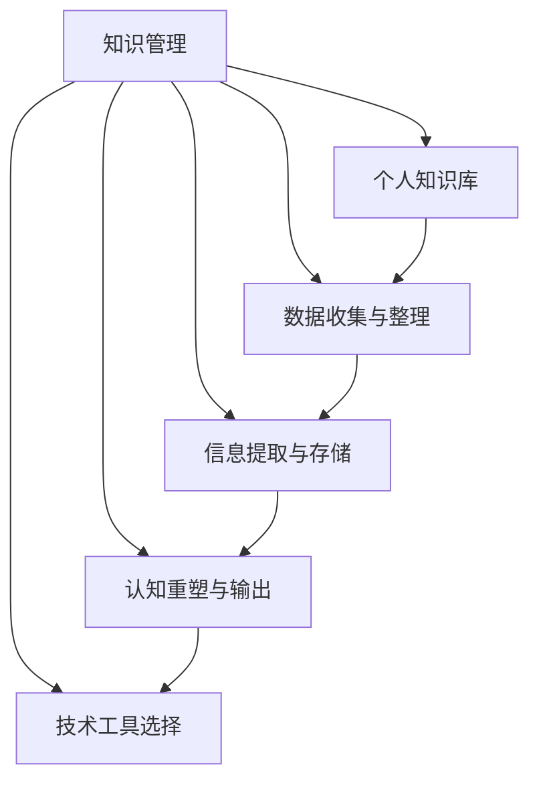

                 

# 管理者如何建立个人知识管理系统

> 关键词：知识管理, 个人知识库, 数据整理, 信息提取, 认知重塑, 效率提升

## 1. 背景介绍

在当今信息爆炸的时代，管理者面对海量信息，如何有效组织和利用知识资源，直接决定了其决策效率和业务执行能力。传统的文档堆叠、手动搜索等方法已无法满足现代管理者的需求。因此，建立个人知识管理系统(PKMS, Personal Knowledge Management System)成为了管理者的必备技能。通过系统化的信息整理、智能化的知识提取和便捷的检索查询，PKMS能极大提升管理者的工作效率和决策质量。

### 1.1 问题由来

1. **信息过载**：日常工作中产生的信息量巨大，传统的信息管理方式难以应对。
2. **信息孤立**：信息孤立化，不同知识来源分散存储，难以综合利用。
3. **信息遗忘**：信息查找困难，记忆负担重，导致重要信息遗忘。
4. **知识未被利用**：隐性知识难于捕捉和传播，影响了业务创新和执行效率。
5. **知识管理成本高**：传统的手工整理和分类成本高，耗时多。

### 1.2 问题核心关键点
建立PKMS的核心在于：
1. **数据收集与整理**：全面收集各类信息，高效整理归档。
2. **信息提取与存储**：从海量数据中提取关键信息，进行结构化存储。
3. **认知重塑与输出**：将知识重塑为认知结构，以支持高效输出和应用。
4. **技术工具选择**：选择合适的技术工具，构建系统化管理框架。

## 2. 核心概念与联系

### 2.1 核心概念概述

为了更好地理解PKMS的核心概念及其内在联系，本节将介绍几个关键概念及其相互关系：

- **知识管理(Knowledge Management, KM)**：通过系统化的方法，对组织和个体知识进行识别、获取、整理、传播、利用和维护的过程。
- **个人知识库(Personal Knowledge Base, PKB)**：为个人知识的管理提供一个有序、可检索的空间，存储和管理个人的学习笔记、文档、代码、研究成果等。
- **数据收集与整理(Data Collection & Organize)**：将各类信息通过自动化或半自动化手段收集、整理、归档，形成结构化数据。
- **信息提取与存储(Information Extraction & Storage)**：从结构化数据中提取关键信息，使用知识图谱、标签、元数据等技术进行存储。
- **认知重塑与输出(Cognitive Reshaping & Output)**：将信息重构为认知模型，辅助决策和执行，提升知识应用能力。
- **技术工具选择(Tool Selection)**：选择合适的软件工具，如笔记应用、文档管理、数据可视化工具等，构建PKMS。

这些概念之间的逻辑关系可以通过以下Mermaid流程图来展示：



这个流程图展示了个体知识管理过程中各个环节的紧密联系：

1. **知识管理**作为整个过程的核心，连接了数据收集、信息提取、认知重塑等环节。
2. **个人知识库**作为知识存储的基础设施，支持数据收集、信息提取、认知重塑等。
3. **数据收集与整理**为信息提取提供基础数据，需自动化或半自动化进行。
4. **信息提取与存储**在数据基础上提取关键信息，并进行结构化存储。
5. **认知重塑与输出**将信息转化为认知模型，以支持高效决策和执行。
6. **技术工具选择**提供了工具和平台支持，使得整个知识管理过程高效实现。

这些概念共同构成了个人知识管理的框架，帮助管理者更好地组织和利用知识资源，提升工作效能。

## 3. 核心算法原理 & 具体操作步骤
### 3.1 算法原理概述

个人知识管理系统的构建基于知识工程(Knowledge Engineering)的原理，主要包括以下几个步骤：

1. **数据收集**：通过自动化或半自动化的方式，从各类信息源（如邮件、文档、网页、笔记等）中提取信息。
2. **数据整理**：对收集到的信息进行分类、归档、标注等整理操作，建立知识库。
3. **信息提取**：从整理好的信息中提取关键元素，如文本中的实体、关系、情感等。
4. **存储与管理**：将提取出的关键信息进行结构化存储，支持检索、分析和重用。
5. **认知重塑**：通过知识图谱、标签、元数据等技术，将信息重构为认知模型，支持高效应用。
6. **系统维护**：定期更新和维护知识库，保持知识的时效性和相关性。

### 3.2 算法步骤详解

**Step 1: 数据收集与整理**
1. **确定数据源**：明确需要收集的信息类型和来源，如邮件、文档、网页、笔记等。
2. **自动化工具选择**：选择合适的自动化工具，如文本抓取脚本、Web爬虫、笔记同步工具等，批量收集信息。
3. **初步整理**：使用文本分类、关键词提取、实体识别等技术，对收集到的信息进行初步整理和分类。
4. **归档与标注**：将整理好的信息按照主题、项目、时间等维度进行归档，并打上标签和元数据，形成知识库结构。

**Step 2: 信息提取与存储**
1. **实体识别与关系提取**：使用命名实体识别(NER)、关系抽取(RE)等技术，从整理好的信息中提取关键实体和关系。
2. **知识图谱构建**：构建基于实体和关系的知识图谱，支持信息检索和关联分析。
3. **数据存储**：使用数据库或知识库管理系统，对提取的信息进行结构化存储，确保数据安全性和可检索性。

**Step 3: 认知重塑与输出**
1. **认知重塑**：通过将信息重构为认知模型，如心智模型、知识框架等，提升知识应用能力。
2. **知识应用**：将重塑后的知识应用于决策和执行，支持问题解决、策略规划、绩效评估等。
3. **输出与传播**：将重塑后的知识通过报告、演示、会议等形式进行输出和传播，分享经验与成果。

**Step 4: 系统维护**
1. **定期更新**：定期更新知识库，加入新的信息和知识。
2. **质量控制**：确保知识库中信息的准确性和时效性，删除过期或错误信息。
3. **系统优化**：根据实际使用情况，优化知识库结构和算法，提升系统效率和可用性。

### 3.3 算法优缺点

PKMS算法具有以下优点：
1. **高效性**：自动化和半自动化技术大大提高了数据收集和整理的效率。
2. **系统性**：知识管理过程有系统化的框架和步骤，确保信息整理和存储的系统性。
3. **灵活性**：根据具体需求，灵活选择和组合各种工具和技术。
4. **可扩展性**：随着数据量的增加和应用场景的扩展，系统可以不断升级和扩展。
5. **易于维护**：通过自动化和智能化的方式，减轻管理者在数据维护方面的负担。

同时，PKMS算法也存在一些局限性：
1. **数据来源限制**：自动化工具的依赖性较强，可能受限于特定数据源和格式。
2. **技术复杂性**：系统构建和维护需要一定的技术知识和技能。
3. **信息冗余**：自动化工具可能无法完全过滤掉冗余信息，导致知识库的复杂度增加。
4. **隐性知识提取难度大**：难以自动化提取隐性知识，需依靠人工提取和标注。
5. **隐私和安全问题**：系统处理大量个人数据，需确保数据隐私和安全。

尽管存在这些局限性，但PKMS以其高效性和系统性，成为了现代管理者不可多得的辅助工具。

### 3.4 算法应用领域

PKMS在多个领域得到了广泛应用，如：

- **企业管理**：提升管理者的决策效率和业务执行能力。
- **项目管理**：优化项目计划、进度跟踪和资源配置。
- **知识分享**：促进团队间的知识交流和共享，提升团队协作效率。
- **个人学习**：辅助个人学习和职业发展，提升专业技能和知识水平。
- **学术研究**：帮助研究人员高效管理和利用文献、数据、代码等研究资源。

## 4. 数学模型和公式 & 详细讲解 & 举例说明

### 4.1 数学模型构建

假设管理者收集到的信息集为 $D=\{d_i\}_{i=1}^N$，其中每个信息 $d_i$ 包含多个关键元素 $d_i=[e_1,e_2,...,e_m]$。知识提取过程可建模为如下形式：

$$
E=[e_1,e_2,...,e_m]
$$

其中 $e_i$ 表示第 $i$ 个关键元素，如实体、关系、情感等。

### 4.2 公式推导过程

以命名实体识别(NER)为例，我们推导实体识别的基本公式：

假设信息 $d_i$ 中的文本为 $T_i$，实体识别过程可通过正向最大匹配(Positive Maximum Matching)或条件随机场(Conditional Random Field)等算法实现。

$$
\text{NER}(T_i) = \arg\max_{e \in E} P(e|T_i)
$$

其中 $P(e|T_i)$ 表示在文本 $T_i$ 中识别出实体 $e$ 的概率。

对于实体 $e$，其概率计算如下：

$$
P(e|T_i) = \frac{\text{Likelihood}(e|T_i) \times \text{Prior}(e)}{\sum_{e' \in E} \text{Likelihood}(e'|T_i) \times \text{Prior}(e')}
$$

其中 $\text{Likelihood}(e|T_i)$ 表示实体 $e$ 在文本 $T_i$ 中出现的概率，$\text{Prior}(e)$ 表示实体 $e$ 先验概率，$e'$ 为所有可能出现的实体。

在实际应用中，还需引入各种特征工程技术和机器学习算法，如Word2Vec、BERT等，进一步提高实体识别的准确性和泛化能力。

### 4.3 案例分析与讲解

**案例一：项目管理知识库**

项目管理中需要管理大量文档、邮件、计划等信息。通过PKMS，可以将这些信息自动整理和归档，构建项目知识库，支持文档检索、任务跟踪、资源调配等。例如，可以使用Web爬虫自动抓取项目邮件和文档，通过文本分类和实体识别技术，识别项目名称、任务、截止日期等信息，并进行结构化存储。管理者可通过搜索、筛选等功能快速查找项目相关信息，提升项目管理效率。

**案例二：学术研究知识库**

研究人员需要管理大量文献、数据、代码等研究资源。通过PKMS，可以构建学术研究知识库，辅助文献管理、数据检索、代码共享等。例如，使用文献抓取脚本自动抓取领域内重要期刊的论文，通过文本分类和实体识别技术，识别论文标题、作者、关键词等信息，并进行结构化存储。研究人员可通过搜索、关键词提取等功能快速查找相关论文，获取研究灵感和数据资源，提高科研效率。

## 5. 项目实践：代码实例和详细解释说明

### 5.1 开发环境搭建

在进行PKMS实践前，我们需要准备好开发环境。以下是使用Python进行PKMS开发的典型环境配置流程：

1. 安装Anaconda：从官网下载并安装Anaconda，用于创建独立的Python环境。

2. 创建并激活虚拟环境：
```bash
conda create -n pkms-env python=3.8 
conda activate pkms-env
```

3. 安装必要的Python包：
```bash
pip install pandas numpy spacy transformers
```

4. 安装Web爬虫工具：
```bash
pip install beautifulsoup4 requests
```

5. 安装文本处理工具：
```bash
pip install gensim
```

完成上述步骤后，即可在`pkms-env`环境中开始PKMS开发。

### 5.2 源代码详细实现

下面以项目管理知识库为例，给出使用Python进行PKMS开发的完整代码实现。

```python
import pandas as pd
from gensim import corpora, models
from bs4 import BeautifulSoup
import requests

# 从URL中抓取网页内容
def fetch_web_content(url):
    response = requests.get(url)
    soup = BeautifulSoup(response.text, 'html.parser')
    return soup.get_text()

# 构建文档集合
docs = []
for i in range(1, 101):
    url = f"https://example.com/{i}"
    doc = fetch_web_content(url)
    docs.append(doc)

# 构建文档-词项矩阵
texts = [doc.split() for doc in docs]
dictionary = corpora.Dictionary(texts)
corpus = [dictionary.doc2bow(text) for text in texts]
tfidf = models.TfidfModel(corpus)
corpus_tfidf = tfidf[corpus]

# 使用LDA进行主题建模
lda = models.LdaModel(corpus_tfidf, id2word=dictionary, num_topics=5, passes=10, alpha='auto', per_word_topics=True)
topics = lda.print_topics(num_words=10)

# 将主题信息保存到DataFrame中
topic_df = pd.DataFrame(topics)
topic_df.to_csv('project_topics.csv', index=False)
```

### 5.3 代码解读与分析

让我们再详细解读一下关键代码的实现细节：

**fetch_web_content函数**：
- 使用BeautifulSoup库抓取指定URL的网页内容，并返回文本形式。

**构建文档集合和词项矩阵**：
- 通过循环抓取指定URL范围内的网页内容，并构建文档集合。
- 使用gensim库的Dictionary和TfidfModel对文档集合进行词项矩阵化，得到每个文档的TF-IDF表示。

**LDA主题建模**：
- 使用gensim库的LdaModel对TF-IDF矩阵进行主题建模，得到5个主题及其关键词。
- 将主题信息保存为CSV文件，便于后续处理和查询。

在实际应用中，上述代码仅为PKMS开发的冰山一角，完整的系统还需要包括更多的功能模块，如数据采集、文本分类、实体识别、关系抽取等。同时，还需要根据具体需求，灵活选择和组合各种技术和工具，构建灵活、高效、易用的PKMS系统。

## 6. 实际应用场景

### 6.1 项目管理

项目管理是PKMS的重要应用场景之一。通过PKMS，管理者可以高效收集和整理项目相关文档、邮件、计划等信息，构建项目知识库，辅助项目管理和执行。例如，可以使用Web爬虫自动抓取项目邮件和文档，通过文本分类和实体识别技术，识别项目名称、任务、截止日期等信息，并进行结构化存储。管理者可通过搜索、筛选等功能快速查找项目相关信息，提升项目管理效率。

### 6.2 学术研究

学术研究需要管理大量文献、数据、代码等资源。通过PKMS，可以构建学术研究知识库，辅助文献管理、数据检索、代码共享等。例如，使用文献抓取脚本自动抓取领域内重要期刊的论文，通过文本分类和实体识别技术，识别论文标题、作者、关键词等信息，并进行结构化存储。研究人员可通过搜索、关键词提取等功能快速查找相关论文，获取研究灵感和数据资源，提高科研效率。

### 6.3 企业决策

企业管理者面对海量信息，难以高效处理。通过PKMS，可以构建企业知识库，辅助决策和管理。例如，可以使用Web爬虫抓取企业内部邮件、文档、新闻等信息，通过文本分类和实体识别技术，提取关键信息，并进行结构化存储。管理者可通过搜索、筛选等功能快速查找相关信息，提升决策效率和质量。

### 6.4 未来应用展望

随着PKMS技术的不断发展，未来将在更多领域得到应用，为组织和个人的知识管理提供更高效、更智能的解决方案。

- **智慧办公**：通过智能办公系统，将PKMS与日常办公事务集成，提升办公效率。
- **智能客服**：使用PKMS辅助智能客服系统，快速查找和响应客户需求。
- **智能推荐**：根据用户行为和偏好，通过PKMS提供个性化推荐服务，提升用户体验。
- **智能教育**：在教育领域，PKMS可以辅助教学和学习，提升教学质量和效果。
- **智能医疗**：在医疗领域，PKMS可以辅助医生决策和治疗，提升医疗服务质量。

## 7. 工具和资源推荐

### 7.1 学习资源推荐

为了帮助开发者系统掌握PKMS的理论基础和实践技巧，这里推荐一些优质的学习资源：

1. **《知识管理与组织：构建和管理知识库》**：全面介绍了知识管理的理论和实践，是知识管理领域的重要参考书。
2. **Coursera《信息检索与数据挖掘》课程**：斯坦福大学开设的课程，涵盖了信息检索和知识图谱等关键技术。
3. **ArXiv上的知识图谱论文**：大量关于知识图谱构建和应用的前沿研究，可深入学习。
4. **Apache Nutch**：开源Web爬虫框架，可帮助快速抓取和整理网络信息。
5. **NLTK与SpaCy**：Python自然语言处理库，提供了丰富的文本处理功能。

通过对这些资源的学习实践，相信你一定能够快速掌握PKMS的精髓，并用于解决实际的NLP问题。

### 7.2 开发工具推荐

高效的开发离不开优秀的工具支持。以下是几款用于PKMS开发的常用工具：

1. **Jupyter Notebook**：开源的交互式编程环境，支持Python和其他编程语言，可快速迭代和调试代码。
2. **Anaconda**：Python环境管理工具，提供便捷的虚拟环境和包管理功能。
3. **BeautifulSoup**：Python库，用于网页解析和数据提取。
4. **gensim**：Python库，支持文本处理和主题建模等功能。
5. **Scikit-learn**：Python库，提供了丰富的机器学习算法和工具。

合理利用这些工具，可以显著提升PKMS开发的效率，加快创新迭代的步伐。

### 7.3 相关论文推荐

PKMS技术的发展源于学界的持续研究。以下是几篇奠基性的相关论文，推荐阅读：

1. **《基于Web的知识挖掘与信息组织技术》**：介绍了Web信息抽取和知识图谱构建的基本方法和应用。
2. **《利用知识图谱构建项目知识管理框架》**：提出了基于知识图谱的项目知识管理框架，支持项目文档管理和检索。
3. **《基于深度学习的命名实体识别技术》**：介绍了基于深度学习的NER技术的原理和实现。
4. **《自然语言处理与知识工程》**：介绍了自然语言处理和知识工程的基本理论和应用，是知识管理领域的经典教材。
5. **《信息检索技术与应用》**：全面介绍了信息检索技术的原理和应用，是信息管理领域的经典教材。

这些论文代表了大语言模型微调技术的发展脉络。通过学习这些前沿成果，可以帮助研究者把握学科前进方向，激发更多的创新灵感。

## 8. 总结：未来发展趋势与挑战

### 8.1 研究成果总结

本文对个人知识管理系统的构建方法进行了全面系统的介绍。首先阐述了PKMS在现代管理中的重要性和必要性，明确了PKMS在信息收集、整理、存储和输出等环节的关键步骤。其次，从原理到实践，详细讲解了PKMS的数学模型和实现步骤，给出了PKMS开发的具体代码实例。同时，本文还广泛探讨了PKMS在项目管理、学术研究、企业决策等实际应用场景中的应用前景，展示了PKMS范式的广泛适用性。此外，本文精选了PKMS的学习资源和开发工具，力求为读者提供全方位的技术指引。

通过本文的系统梳理，可以看到，PKMS技术在管理中的广泛应用前景，极大地提升了管理者的决策效率和业务执行能力。随着信息技术的不断进步，PKMS技术将不断创新和发展，助力管理者在复杂多变的业务环境中，更好地组织和利用知识资源，提升工作效能。

### 8.2 未来发展趋势

展望未来，PKMS技术将呈现以下几个发展趋势：

1. **智能化与自动化**：随着人工智能和自然语言处理技术的发展，PKMS将更加智能化和自动化，自动完成信息收集、整理和存储。
2. **多模态融合**：PKMS将支持多模态信息融合，支持文本、图像、视频等多类型数据的处理和分析。
3. **大规模部署**：PKMS将在大规模企业内部和外部场景中得到广泛部署，成为组织管理的重要工具。
4. **云端服务**：PKMS将提供云端服务，支持多用户、多设备、多场景的应用。
5. **用户体验优化**：PKMS将更加注重用户体验，提供便捷、智能、个性化的信息获取和知识应用功能。

以上趋势凸显了PKMS技术的广阔前景。这些方向的探索发展，必将进一步提升知识管理的效率和效果，为现代管理提供更加智能化和高效化的支持。

### 8.3 面临的挑战

尽管PKMS技术已经取得了显著进展，但在迈向更加智能化、普适化应用的过程中，仍面临诸多挑战：

1. **数据质量与完整性**：PKMS需要高质量、完整的数据支持，但实际应用中数据质量往往参差不齐。
2. **技术复杂性**：PKMS构建和维护需要较强的技术基础，普通管理者难以实现。
3. **隐私与安全**：PKMS涉及大量敏感信息，数据隐私和安全问题需严格保障。
4. **知识重塑难度大**：将信息重构为认知模型，需要依赖专业知识，难度较大。
5. **系统扩展性差**：PKMS系统一旦建立，难以扩展和升级，适应新的应用场景。

尽管存在这些挑战，但PKMS以其高效性和系统性，仍然是大规模管理工作中不可或缺的辅助工具。未来，随着技术的发展和应用的深化，PKMS将不断优化和升级，更好地服务于现代管理。

### 8.4 研究展望

未来的PKMS研究需要在以下几个方面寻求新的突破：

1. **自动化和智能化**：开发更加自动化和智能化的数据收集和整理工具，减少人工干预。
2. **多模态信息融合**：将文本、图像、视频等多种信息类型进行融合，提高信息处理的全面性。
3. **知识图谱构建**：构建更加全面、准确的知识图谱，支持复杂信息的关系抽取和查询。
4. **认知重塑技术**：开发更加智能化的认知重塑技术，提高知识的重构效率和效果。
5. **隐私与安全保护**：开发更加严格的数据隐私和安全保护技术，确保信息安全。

这些研究方向将推动PKMS技术向更高效、更智能、更安全的方向发展，为现代管理提供更加智能化和高效化的支持。

## 9. 附录：常见问题与解答

**Q1：PKMS对数据源有哪些要求？**

A: PKMS对数据源的要求主要包括数据格式和数据质量。数据格式方面，需要支持常见的文本、PDF、图像等格式；数据质量方面，需要保证数据的准确性和完整性，避免噪音和错误信息。

**Q2：如何选择合适的文本处理工具？**

A: 选择合适的文本处理工具需考虑以下几个方面：
1. 处理能力：工具的处理速度和效率。
2. 功能模块：工具提供的功能模块，如文本分类、实体识别、关系抽取等。
3. 技术支持：工具的技术支持和社区活跃度。

**Q3：PKMS在企业内部部署时需要注意哪些问题？**

A: PKMS在企业内部部署时需要注意以下几个问题：
1. 数据隐私与安全：确保企业内部数据的安全性和隐私保护。
2. 系统集成：将PKMS与其他企业系统集成，实现数据共享和协同工作。
3. 用户培训：对企业员工进行PKMS使用培训，提升员工使用效率。
4. 系统维护：定期更新和维护PKMS系统，确保系统稳定性和可用性。

**Q4：PKMS在学术研究中的应用场景有哪些？**

A: PKMS在学术研究中的应用场景主要包括：
1. 文献管理：构建学术文献数据库，支持文献搜索、引用和分类。
2. 数据存储：存储和管理研究数据，支持数据共享和访问。
3. 代码共享：存储和管理代码库，支持代码版本控制和协作开发。
4. 研究记录：记录研究过程和结果，支持知识积累和传承。

**Q5：PKMS如何实现知识重塑与输出？**

A: PKMS实现知识重塑与输出的主要方式包括：
1. 知识图谱构建：将信息构建为知识图谱，支持关系抽取和查询。
2. 心智模型设计：将信息重构为心智模型，支持高效认知和决策。
3. 知识框架生成：生成知识框架，支持结构化和可视化输出。
4. 知识应用：将重塑后的知识应用于决策、执行、分享等环节，提升知识应用效果。

通过PKMS系统，管理者可以高效收集、整理和应用各类信息，提升决策效率和业务执行能力，助力企业更好地应对复杂多变的业务环境。相信随着PKMS技术的不断进步，将为管理者提供更智能、更高效的知识管理工具，推动管理水平的不断提升。

---

作者：禅与计算机程序设计艺术 / Zen and the Art of Computer Programming

