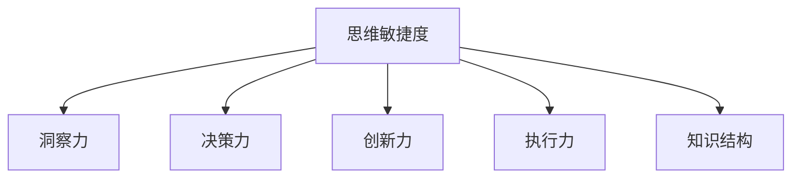

                 

# 管理者的思维敏捷度训练

管理者的思维敏捷度是其核心竞争力之一，尤其在变化莫测的商业环境中，能够迅速洞察并应对各种挑战。本文将深入探讨管理者的思维敏捷度训练，包括其原理、操作步骤、实际应用，以及未来的发展趋势与挑战。通过系统的分析和实践指导，帮助管理者提升思维敏捷度，成为更加卓越的领导者。

## 1. 背景介绍

### 1.1 问题由来

在快速变化的商业环境中，管理者面临的挑战日益复杂多样。无论是应对市场竞争、技术革新，还是内部管理、团队协作，都需要管理者具备高度的思维敏捷度。然而，许多管理者在面对突如其来的变化时，往往感到力不从心。因此，如何系统地训练管理者的思维敏捷度，成为提升企业竞争力的关键。

### 1.2 问题核心关键点

管理者思维敏捷度的训练，主要包括以下几个关键点：

- **洞察力训练**：提升管理者对市场动态、技术趋势、客户需求的敏锐感知。
- **决策力训练**：增强管理者在信息不对称、不确定性高的环境中，快速做出高质量决策的能力。
- **创新力训练**：激发管理者的创造性思维，突破传统束缚，实现创新突破。
- **执行力训练**：提高管理者的执行力，确保决策和战略能够快速落地实施。

### 1.3 问题研究意义

提升管理者的思维敏捷度，不仅能够增强其应对变化的应对能力，还能显著提升企业的竞争力。具体而言，具有高度思维敏捷度的管理者：

1. **更快适应变化**：能够快速洞察市场和技术变化，抓住先机。
2. **更高决策质量**：在复杂多变的环境中，做出更加科学合理的决策。
3. **更高效执行**：快速推进决策和战略的实施，实现企业目标。
4. **更高团队凝聚力**：通过卓越的领导能力，激发团队创新和协作。

本文将深入探讨管理者思维敏捷度的训练方法，帮助管理者系统提升思维敏捷度，进而推动企业不断发展。

## 2. 核心概念与联系

### 2.1 核心概念概述

为更好地理解管理者的思维敏捷度训练，本节将介绍几个密切相关的核心概念：

- **思维敏捷度**：指管理者在面对变化时，快速反应、灵活应对的能力。
- **洞察力**：管理者对市场、技术、客户等环境变化的敏锐感知和理解能力。
- **决策力**：管理者在信息不完备或不确定性高的环境下，快速做出高质量决策的能力。
- **创新力**：管理者打破常规，提出新颖、可行解决方案的创造性思维。
- **执行力**：管理者将决策和战略迅速转化为实际行动的能力。
- **知识结构**：管理者广泛而深入的知识体系，是提升思维敏捷度的重要基础。

这些概念之间的逻辑关系可以通过以下Mermaid流程图来展示：



这个流程图展示了几大核心概念之间的关联性：

1. 洞察力是思维敏捷度的基础，管理者需要具备对市场和技术变化的敏锐感知。
2. 决策力在洞察力的基础上，帮助管理者快速做出科学决策。
3. 创新力为管理者提供创新的解决方案，突破瓶颈。
4. 执行力确保决策和战略的快速落地，实现目标。
5. 知识结构为其他能力提供支持，提升综合素质。

## 3. 核心算法原理 & 具体操作步骤

### 3.1 算法原理概述

管理者的思维敏捷度训练，本质上是利用科学方法和实践经验，提升其洞察力、决策力、创新力、执行力及知识结构的过程。其核心思想是通过系统的训练和实践，使管理者在面对复杂多变的环境时，能够迅速反应、灵活应对，做出科学合理的决策，实现创新突破和高效执行。

### 3.2 算法步骤详解

管理者的思维敏捷度训练主要包括以下几个步骤：

**Step 1: 评估现状**

- **自我评估**：管理者进行自我评估，识别当前思维敏捷度的不足之处。
- **外部反馈**：通过360度反馈、同事和下属的意见，全面了解自身在思维敏捷度方面的表现。

**Step 2: 设定目标**

- **明确目标**：根据自我评估和外部反馈，设定具体的提升目标。
- **制定计划**：制定详细的提升计划，包括训练内容、时间安排、评估标准等。

**Step 3: 系统训练**

- **洞察力训练**：通过市场分析、技术追踪、客户调研等方式，提升洞察力。
- **决策力训练**：通过案例分析、模拟决策、压力测试等方式，增强决策力。
- **创新力训练**：通过头脑风暴、设计思维、创新工作坊等方式，激发创新力。
- **执行力训练**：通过项目管理、目标设定、复盘总结等方式，提高执行力。
- **知识结构完善**：通过读书、听课、交流等方式，不断丰富和完善知识结构。

**Step 4: 实践应用**

- **真实场景应用**：将训练成果应用到实际工作中，如项目决策、团队管理、战略规划等。
- **持续优化**：根据应用效果进行反馈调整，不断优化提升计划。

**Step 5: 评估效果**

- **效果评估**：定期进行自我评估和外部反馈，评估训练效果。
- **持续提升**：根据评估结果，调整提升计划，持续提升思维敏捷度。

### 3.3 算法优缺点

管理者的思维敏捷度训练方法具有以下优点：

1. **系统性**：通过系统的训练和实践，确保各个环节全面提升。
2. **针对性强**：根据个人需求和实际情况，制定个性化训练计划。
3. **实战性强**：通过真实场景的应用，确保训练成果能够实际落地。
4. **持续改进**：通过持续评估和优化，保持思维敏捷度的持续提升。

同时，该方法也存在一定的局限性：

1. **时间成本高**：系统的训练和实践需要较长时间投入。
2. **实践难度大**：需要高水平的教练或导师，确保训练效果。
3. **个体差异大**：不同管理者的学习能力和适应性不同，训练效果可能差异较大。

尽管存在这些局限性，但就目前而言，系统性的思维敏捷度训练方法仍然是提升管理者核心竞争力的重要手段。未来相关研究的重点在于如何进一步降低训练时间和成本，提高训练的可操作性和适应性，同时兼顾不同管理者的个性化需求。

### 3.4 算法应用领域

管理者的思维敏捷度训练方法，已在企业领导力开发、项目管理、战略规划等多个领域得到广泛应用。具体而言：

- **领导力开发**：通过系统的领导力培训，提升管理者的洞察力、决策力、创新力、执行力。
- **项目管理**：通过项目管理训练，提高管理者在项目决策、资源配置、风险管理等方面的思维敏捷度。
- **战略规划**：通过战略规划训练，提升管理者对市场和技术的洞察力，做出科学合理的战略决策。
- **团队管理**：通过团队管理训练，增强管理者在团队协作、激励管理、文化建设等方面的思维敏捷度。

除了上述这些经典应用外，思维敏捷度训练还广泛应用于企业创新、变革管理、知识管理等更多领域，推动企业的持续发展和创新。

## 4. 数学模型和公式 & 详细讲解 & 举例说明

### 4.1 数学模型构建

管理者的思维敏捷度训练模型可以形式化地表示为：

$$
M_{敏捷度} = F(D_{洞察力}, D_{决策力}, D_{创新力}, D_{执行力}, K_{结构})
$$

其中，$M_{敏捷度}$表示管理者的思维敏捷度，$D_{洞察力}$、$D_{决策力}$、$D_{创新力}$、$D_{执行力}$分别表示洞察力、决策力、创新力和执行力，$K_{结构}$表示知识结构。

### 4.2 公式推导过程

以决策力训练为例，其训练模型可以表示为：

$$
D_{决策力} = D_{基础} + \sum_{i=1}^{n} \alpha_i f_i(D_{历史}, D_{数据}, D_{模拟})
$$

其中，$f_i$表示第$i$种决策力训练方法，$D_{基础}$表示初始决策力水平，$D_{历史}$表示历史决策经验，$D_{数据}$表示决策训练数据，$D_{模拟}$表示决策模拟训练，$\alpha_i$表示第$i$种方法的权重。

### 4.3 案例分析与讲解

假设某公司CEO通过项目管理训练提升了决策力，其训练模型可以表示为：

$$
D_{决策力} = 0.6D_{历史} + 0.2D_{数据} + 0.2D_{模拟}
$$

其中，$D_{历史}$表示CEO过去决策的成功案例，$D_{数据}$表示CEO在实际项目中收集到的决策数据，$D_{模拟}$表示CEO在模拟环境中的决策训练。通过这样的模型，可以系统地评估CEO的决策力提升效果。

## 5. 项目实践：代码实例和详细解释说明

### 5.1 开发环境搭建

要进行管理者的思维敏捷度训练，需要搭建一个全面的训练平台。以下是搭建开发环境的步骤：

1. **安装Python**：从官网下载并安装Python。
2. **安装相关库**：安装Pandas、NumPy、Scikit-learn等数据处理和分析库。
3. **搭建训练平台**：搭建一个云端训练平台，支持在线学习、数据上传、评估反馈等功能。

### 5.2 源代码详细实现

以下是一个简单的决策力训练平台代码实现：

```python
import pandas as pd
from sklearn.model_selection import train_test_split

# 数据加载
data = pd.read_csv('decision_data.csv')

# 特征工程
X = data.drop('decision', axis=1)
y = data['decision']

# 数据划分
X_train, X_test, y_train, y_test = train_test_split(X, y, test_size=0.2, random_state=42)

# 训练模型
from sklearn.linear_model import LogisticRegression
model = LogisticRegression()
model.fit(X_train, y_train)

# 评估模型
from sklearn.metrics import accuracy_score
y_pred = model.predict(X_test)
accuracy = accuracy_score(y_test, y_pred)
print(f'Decision model accuracy: {accuracy:.2f}')
```

### 5.3 代码解读与分析

上述代码实现了决策力训练的基本流程。首先，通过Pandas加载决策数据，然后进行特征工程和数据划分。接着，使用Logistic回归模型进行训练，并评估模型准确度。

## 6. 实际应用场景

### 6.1 企业领导力开发

通过系统的领导力训练，企业CEO和高层管理人员能够提升洞察力、决策力、创新力、执行力及知识结构，有效应对市场和技术变化，做出科学合理的决策，带领企业走向成功。

### 6.2 项目管理

项目管理训练能够帮助管理者提升决策力、执行力，有效管理项目进度、资源配置、风险管理，确保项目按时按质完成。

### 6.3 战略规划

战略规划训练能够提升管理者的洞察力和决策力，通过系统分析市场和技术趋势，做出科学合理的战略决策，推动企业可持续发展。

### 6.4 团队管理

团队管理训练能够增强管理者的执行力，提升团队协作、激励管理、文化建设等方面的能力，打造高效团队，推动企业创新和绩效提升。

## 7. 工具和资源推荐

### 7.1 学习资源推荐

为了帮助管理者全面提升思维敏捷度，推荐以下学习资源：

1. **《领导力挑战》系列书籍**：深入解析领导力管理的核心要素，提升洞察力和决策力。
2. **Coursera《创新管理》课程**：系统讲解创新管理的基本方法和实践案例，激发创新力。
3. **《项目管理基础》在线课程**：详细讲解项目管理的基本工具和技巧，提升执行力。
4. **TED Talks创新演讲**：通过观看创新领域的演讲，激发管理者的创造性思维。
5. **哈佛商学院在线课程**：提供全面系统的商业管理课程，提升综合素质。

### 7.2 开发工具推荐

以下几款工具可以帮助管理者高效进行思维敏捷度训练：

1. **Tableau**：数据可视化工具，帮助管理者进行数据分析和决策支持。
2. **JIRA**：项目管理工具，帮助管理者规划、监控项目进度。
3. **Google Colab**：云端Jupyter Notebook环境，方便进行数据分析和模型训练。
4. **Trello**：协作管理工具，帮助管理者协调团队合作。
5. **Evernote**：知识管理工具，帮助管理者整理和分享知识。

### 7.3 相关论文推荐

以下几篇论文对管理者的思维敏捷度训练具有重要参考价值：

1. **《领导力发展的心理学视角》**：通过心理学视角解析领导力发展过程，提供系统训练方法。
2. **《创新驱动的管理实践》**：深入探讨创新驱动的管理理念和实践路径，提升创新力。
3. **《项目管理最佳实践》**：提供全面的项目管理方法论和工具，提升执行力。
4. **《思维敏捷度的培养》**：系统分析思维敏捷度的构成要素，提供训练方法和工具。

## 8. 总结：未来发展趋势与挑战

### 8.1 总结

本文对管理者的思维敏捷度训练进行了全面系统的介绍。首先阐述了思维敏捷度的重要性，明确了其在应对变化、做出决策、推动创新等方面的关键作用。其次，从原理到实践，详细讲解了思维敏捷度训练的数学模型、操作步骤和实际应用。同时，本文还广泛探讨了思维敏捷度训练在企业领导力开发、项目管理、战略规划等多个行业领域的应用前景，展示了其广阔的适用性。此外，本文精选了思维敏捷度训练的相关学习资源，力求为管理者提供全方位的指导。

通过本文的系统梳理，可以看到，系统性的思维敏捷度训练方法能够显著提升管理者的核心竞争力，助力企业在全球竞争中保持领先地位。相信随着相关研究的不断深入和实践的不断探索，管理者的思维敏捷度训练将迎来更多突破和创新，为企业管理带来更加深刻的影响。

### 8.2 未来发展趋势

展望未来，管理者的思维敏捷度训练将呈现以下几个发展趋势：

1. **数据驱动决策**：通过大数据分析和AI技术，提升管理者的决策力和洞察力。
2. **跨界融合创新**：打破行业边界，推动跨领域创新，激发管理者的创新力。
3. **敏捷项目管理**：采用敏捷管理方法，提高项目管理效率和执行力。
4. **知识管理自动化**：通过智能知识管理系统，优化知识结构，提升管理者的综合素质。
5. **全球化视野**：面向全球市场，提升管理者的国际化视野和跨文化沟通能力。

以上趋势凸显了思维敏捷度训练方法的广阔前景。这些方向的探索发展，必将进一步提升管理者的应对能力，推动企业在全球市场中实现更大发展。

### 8.3 面临的挑战

尽管思维敏捷度训练方法已经取得了显著成果，但在提升至卓越水平的过程中，仍面临诸多挑战：

1. **个体差异大**：不同管理者的学习能力和适应性不同，训练效果可能差异较大。
2. **资源投入高**：系统化的训练需要投入大量时间和资源，企业可能面临成本压力。
3. **效果评估难**：管理者的思维敏捷度难以量化评估，缺乏统一的标准。
4. **应用场景复杂**：不同企业和管理者的应用场景复杂多样，训练方法需要灵活适应。

尽管存在这些挑战，但通过不断探索和创新，相信思维敏捷度训练方法将进一步完善，为企业管理带来更加显著的提升。

### 8.4 研究展望

未来的研究应在以下几个方面寻求新的突破：

1. **个性化训练**：开发个性化训练模型，根据管理者的实际情况制定个性化训练计划。
2. **大数据融合**：通过大数据和AI技术，提升决策力和洞察力。
3. **跨界融合**：推动跨领域创新，提升管理者的综合素质。
4. **知识管理**：开发智能知识管理系统，优化知识结构，提升管理者的综合素质。
5. **全球化视野**：面向全球市场，提升管理者的国际化视野和跨文化沟通能力。

这些研究方向的探索，将进一步提升思维敏捷度训练的科学性和有效性，为企业管理提供更加有力的支撑。

## 9. 附录：常见问题与解答

**Q1：思维敏捷度训练是否适用于所有管理者？**

A: 思维敏捷度训练适用于各类管理层级，但不同层次的管理者可能面临的挑战和需求不同。高层管理者侧重于全局视野和决策力，中层管理者侧重于团队管理和执行能力，基层管理者侧重于业务执行和创新能力。

**Q2：如何评估思维敏捷度的提升效果？**

A: 可以通过定量和定性的方式评估思维敏捷度的提升效果。定量方面，可以使用KPI指标、决策准确率、创新成果等数据进行评估。定性方面，可以通过360度反馈、同事和下属的评价、自我评估等方式进行综合评估。

**Q3：思维敏捷度训练需要多长时间？**

A: 思维敏捷度训练的时间周期因个人和组织情况而异。一般而言，系统化训练需要3-6个月，但持续的实践和反馈调整将是一个长期过程。

**Q4：思维敏捷度训练如何结合日常工作？**

A: 思维敏捷度训练可以与日常工作相结合，通过定期学习、项目实践、复盘总结等方式，不断提升思维敏捷度。同时，将训练成果应用到实际工作中，确保效果落地。

通过本文的系统梳理，可以看到，思维敏捷度训练方法在提升企业管理者核心竞争力方面的重要性和可行性。管理者通过系统的训练和实践，能够在复杂多变的环境中迅速反应、灵活应对，做出科学合理的决策，推动企业不断创新和发展。相信随着相关研究的不断深入和实践的不断探索，思维敏捷度训练将为企业管理带来更加显著的提升。

