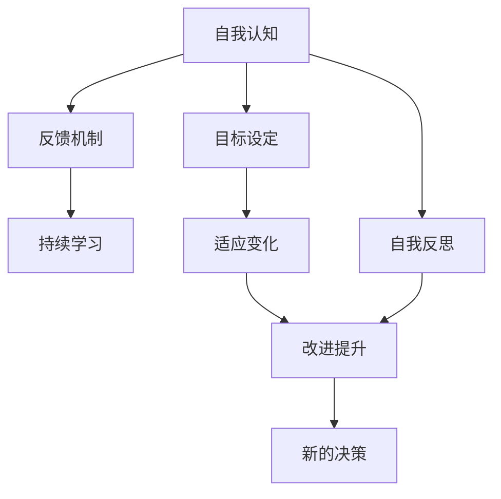

                 

# 管理者的自我反思与成长

> 关键词：管理者, 自我反思, 个人成长, 领导力, 职业发展, 组织变革

## 1. 背景介绍

### 1.1 问题由来

在快速发展的商业环境中，企业需要不断适应市场变化，以保持竞争力。管理者作为企业的中坚力量，扮演着至关重要的角色。他们的决策和行为不仅直接影响企业的未来发展，也对团队的士气和业务执行产生深远影响。然而，许多管理者在追求业务增长的过程中，往往忽视了对自我反思和成长的重视。这导致了管理团队和组织效能的下降，甚至引发员工流失和组织危机。因此，管理者如何进行自我反思与成长，成为一项亟待解决的重要问题。

### 1.2 问题核心关键点

管理者自我反思与成长的本质，在于通过不断识别自身优势和不足，进行有针对性的改进和提升。这一过程包括但不限于以下几点：
- **自我认知**：明确自己的价值观、优劣势、决策风格等。
- **目标设定**：设定短期和长期目标，明确个人发展的方向。
- **反馈机制**：从上级、同事和下属获取反馈，识别改进空间。
- **持续学习**：通过阅读、培训、咨询等方式不断提升知识和技能。
- **适应变化**：在变化中保持灵活性，不断调整策略和行动。

### 1.3 问题研究意义

管理者进行自我反思与成长，对于企业发展和个人职业发展具有重要意义：

1. **提升领导力**：通过不断反思和改进，管理者能够提升领导力和管理能力，更有效地引导团队和组织。
2. **优化决策质量**：持续的学习和反思有助于管理者做出更加明智的决策，减少错误和风险。
3. **增强团队凝聚力**：管理者通过自我提升，能够更好地激励和支持团队成员，增强团队的凝聚力和执行效率。
4. **促进组织变革**：在快速变化的市场环境中，管理者需要不断适应新的挑战，推动组织进行有效的变革和创新。

## 2. 核心概念与联系

### 2.1 核心概念概述

为了更好地理解管理者自我反思与成长的过程，本节将介绍几个核心概念：

- **自我认知(Self-Awareness)**：指管理者对自己个性、情感、行为、决策和优劣势的认知和理解。
- **目标设定(Goal Setting)**：管理者根据自己的职业规划和组织目标，设定短期和长期的个人发展目标。
- **反馈机制(Feedback Mechanism)**：通过正式或非正式的方式，从上级、同事和下属获取反馈，识别改进空间。
- **持续学习(Life-long Learning)**：管理者应不断学习新知识、新技能，适应组织和市场变化。
- **适应变化(Adaptability)**：在快速变化的环境中，管理者需要灵活应对，不断调整策略和行动。

这些核心概念之间的逻辑关系可以通过以下Mermaid流程图来展示：



这个流程图展示了几大核心概念及其相互关系：

1. 管理者首先进行自我认知，识别自己的长处和短板。
2. 基于自我认知，设定明确的个人和组织目标。
3. 通过反馈机制获取多方反馈，识别改进空间。
4. 不断进行持续学习和反思，提升自身能力。
5. 适应环境变化，灵活调整策略和行动。
6. 通过反思和改进，最终提升管理效能和组织绩效。

## 3. 核心算法原理 & 具体操作步骤
### 3.1 算法原理概述

管理者自我反思与成长的算法原理，基于自我认知、目标设定、反馈机制、持续学习和适应变化的系统性循环。其核心思想是：通过不断识别和纠正自身行为和决策的偏差，不断优化管理实践，提升组织绩效。

形式化地，假设管理者的初始状态为 $S_0$，目标状态为 $S_T$，其中 $S_t$ 表示在时间 $t$ 时的状态。管理者的自我反思与成长过程可以表示为：

$$
S_{t+1} = f(S_t, F_t)
$$

其中 $F_t$ 表示在时间 $t$ 时获取的反馈信息，$f$ 表示基于反馈信息的调整函数。目标状态 $S_T$ 应满足：

$$
S_T \approx S_{T+1}
$$

### 3.2 算法步骤详解

基于自我反思与成长的算法原理，管理者进行自我反思与成长的详细步骤包括：

**Step 1: 自我认知**

- 评估自身的优劣势、价值观、情感状态和决策风格。
- 通过心理测评、360度反馈等方式获取客观评估。
- 将评估结果与标准模型进行对比，识别出差距和改进空间。

**Step 2: 目标设定**

- 根据自我认知结果，设定短期和长期的个人发展目标。
- 将个人目标与组织目标相结合，确保目标的一致性和可行性。
- 使用SMART原则（具体、可测量、可实现、相关、时限）来明确目标。

**Step 3: 反馈机制**

- 建立正式和非正式的反馈渠道，收集上级、同事和下属的意见。
- 对反馈信息进行分类和分析，识别出常见问题和改进点。
- 定期召开反馈会议，分享反馈结果和改进措施。

**Step 4: 持续学习**

- 制定个人学习计划，包括专业培训、在线课程、书籍阅读等。
- 通过参与行业会议、交流活动等方式，拓宽视野和知识面。
- 定期进行知识更新和技能提升，适应组织和市场的变化。

**Step 5: 适应变化**

- 监控市场和环境变化，识别新的机会和挑战。
- 灵活调整管理策略和行动方案，以应对变化。
- 保持开放心态，接受新想法和新方法。

**Step 6: 改进提升**

- 根据反馈和改进措施，优化管理实践。
- 实施改进措施，并评估其效果。
- 持续跟踪目标达成情况，确保改进的有效性。

### 3.3 算法优缺点

管理者自我反思与成长算法具有以下优点：

1. **系统性**：通过系统性的循环，不断识别和优化管理行为，提升组织绩效。
2. **自我驱动**：管理者通过自我认知和目标设定，主动识别改进空间，提升管理能力。
3. **动态适应**：通过持续学习和适应变化，管理者能够灵活应对市场和环境变化。

同时，该算法也存在以下局限性：

1. **复杂度高**：需要管理者投入大量时间和精力进行自我反思和持续学习。
2. **反馈质量依赖**：反馈机制的有效性依赖于上级、同事和下属的合作和支持。
3. **主观性强**：管理者的自我认知和目标设定带有一定的主观性，可能影响评估的客观性。
4. **环境依赖**：组织文化和外部环境变化会影响反思和改进的效果。

尽管存在这些局限性，但就目前而言，基于自我反思与成长的算法方法仍然是提升管理者效能的重要途径。未来相关研究将进一步优化反馈机制和改进措施，降低实施难度，提高反思和改进的效果。

### 3.4 算法应用领域

基于自我反思与成长的算法方法，广泛应用于多个管理领域，如：

- **人力资源管理**：通过反馈机制和持续学习，提升人力资源部门的管理效能。
- **市场营销**：通过市场反馈和动态调整，优化市场营销策略和执行。
- **产品开发**：通过用户反馈和产品迭代，提升产品质量和市场竞争力。
- **供应链管理**：通过供应商反馈和流程优化，提升供应链效率和响应速度。
- **客户关系管理**：通过客户反馈和互动，增强客户满意度和忠诚度。

此外，该方法也适用于各级管理者，从基层管理者到高层领导者，均能从中受益。

## 4. 数学模型和公式 & 详细讲解 & 举例说明（备注：数学公式请使用latex格式，latex嵌入文中独立段落使用 $$，段落内使用 $)
### 4.1 数学模型构建

本节将使用数学语言对管理者自我反思与成长的过程进行更加严格的刻画。

假设管理者的初始状态为 $S_0$，目标状态为 $S_T$，其中 $S_t$ 表示在时间 $t$ 时的状态。目标状态 $S_T$ 应满足：

$$
S_T \approx S_{T+1}
$$

其中，管理者的状态 $S_t$ 可以表示为：

$$
S_t = (P_t, L_t, F_t)
$$

其中 $P_t$ 表示管理者在时间 $t$ 时的个人能力，$L_t$ 表示领导力，$F_t$ 表示反馈信息。

### 4.2 公式推导过程

基于上述模型，我们可以推导出管理者自我反思与成长的关键公式。

**目标设定公式**：

$$
\begin{aligned}
P_{t+1} &= P_t + \Delta P_t \\
\Delta P_t &= \frac{G}{K} (P_T - P_t)
\end{aligned}
$$

其中 $P_T$ 为目标能力，$G$ 为目标设定的强度，$K$ 为学习效率。

**反馈信息公式**：

$$
F_{t+1} = F_t + \Delta F_t
$$

其中 $\Delta F_t$ 表示在时间 $t$ 时获取的反馈信息变化量。

**学习提升公式**：

$$
\Delta L_t = L_t \cdot \frac{F_t}{S_{max}}
$$

其中 $S_{max}$ 为领导力提升的极限值。

**适应变化公式**：

$$
\Delta P_t = P_t \cdot \eta_t
$$

其中 $\eta_t$ 表示环境变化对个人能力的影响系数。

通过这些公式，我们可以系统地分析和管理者的自我反思与成长过程，明确改进的方向和措施。

### 4.3 案例分析与讲解

以某公司的市场营销部门为例，分析其通过自我反思与成长提升管理效能的过程：

**背景**：
- 市场营销部门面临销售目标下降、市场反应迟缓等问题。
- 部门管理者定期进行自我反思，识别问题所在。

**步骤**：

**Step 1: 自我认知**
- 管理者通过心理测评和团队讨论，识别出自身在市场洞察、团队激励、决策效率方面的不足。
- 发现问题后，制定了详细的个人发展计划。

**Step 2: 目标设定**
- 设定了短期目标（如提高市场洞察能力、提升团队士气）和长期目标（如建立市场快速响应机制）。
- 将个人目标与公司目标相结合，确保目标的一致性和可行性。

**Step 3: 反馈机制**
- 建立了正式的反馈渠道，定期召开反馈会议，收集团队成员和上级的意见。
- 对反馈信息进行分类和分析，识别出改进点（如市场分析不足、团队激励不够等）。

**Step 4: 持续学习**
- 制定了个人学习计划，包括市场分析培训、领导力提升课程等。
- 通过参与行业会议和交流活动，拓宽了知识面，提升了市场洞察能力。

**Step 5: 适应变化**
- 通过分析市场变化趋势，调整了市场策略和执行方案。
- 建立了快速响应机制，提高了市场反应速度。

**Step 6: 改进提升**
- 根据反馈和改进措施，优化了市场分析和团队激励机制。
- 实施改进措施后，部门销售目标显著提升，市场反应速度加快。

通过上述过程，该公司的市场营销部门通过系统性的自我反思与成长，成功解决了存在的问题，提升了管理效能和组织绩效。

## 5. 项目实践：代码实例和详细解释说明
### 5.1 开发环境搭建

在进行自我反思与成长实践前，我们需要准备好开发环境。以下是使用Python进行项目管理的环境配置流程：

1. 安装Anaconda：从官网下载并安装Anaconda，用于创建独立的Python环境。

2. 创建并激活虚拟环境：
```bash
conda create -n my_env python=3.8 
conda activate my_env
```

3. 安装必要的Python包：
```bash
pip install numpy pandas matplotlib seaborn plotly pyarrow
```

4. 配置项目管理工具：
```bash
git init
git remote add origin https://github.com/your_username/your_project.git
git clone origin .
```

5. 设置版本控制：
```bash
git init
git add .
git commit -m "Initial commit"
```

完成上述步骤后，即可在`my_env`环境中开始自我反思与成长的实践。

### 5.2 源代码详细实现

这里我们以团队反馈管理工具为例，给出使用Python和Plotly库实现自我反思与成长系统的代码实现。

首先，定义反馈管理类的初始化函数：

```python
import plotly.graph_objects as go
from plotly.offline import iplot

class FeedbackManager:
    def __init__(self, team_members):
        self.team_members = team_members
        self.feedback_scores = {}
        
    def get_feedback(self):
        for member in self.team_members:
            self.feedback_scores[member] = 0
            print(f"Please rate {member}'s performance (1-5):")
            rating = int(input("Rate: "))
            self.feedback_scores[member] += rating
        return self.feedback_scores
```

然后，定义反馈可视化函数：

```python
def visualize_feedback(self):
    feedback_scores = self.feedback_scores
    labels = list(feedback_scores.keys())
    values = list(feedback_scores.values())
    
    fig = go.Figure(data=go.Bar(x=labels, y=values))
    fig.update_layout(title="Team Feedback Scores")
    iplot(fig)
```

接着，定义反馈管理主流程：

```python
if __name__ == "__main__":
    team_members = ["Alice", "Bob", "Charlie", "David"]
    feedback_manager = FeedbackManager(team_members)
    
    feedback_scores = feedback_manager.get_feedback()
    visualize_feedback(feedback_manager)
```

最后，启动反馈管理流程并生成反馈可视化图表：

```python
if __name__ == "__main__":
    team_members = ["Alice", "Bob", "Charlie", "David"]
    feedback_manager = FeedbackManager(team_members)
    
    feedback_scores = feedback_manager.get_feedback()
    visualize_feedback(feedback_manager)
```

以上就是使用Python和Plotly实现团队反馈管理系统的完整代码实现。可以看到，通过简单的代码实现，我们便能够有效地收集和管理团队成员的反馈信息，并通过可视化工具直观展示反馈结果。

### 5.3 代码解读与分析

让我们再详细解读一下关键代码的实现细节：

**FeedbackManager类**：
- `__init__`方法：初始化反馈管理类，记录团队成员和反馈分数。
- `get_feedback`方法：通过交互式输入，收集团队成员的反馈分数，返回反馈分数字典。
- `visualize_feedback`方法：使用Plotly库将反馈分数以柱状图形式展示。

**团队反馈管理流程**：
- 在主函数中创建FeedbackManager实例，传入团队成员列表。
- 调用`get_feedback`方法收集反馈分数。
- 调用`visualize_feedback`方法可视化反馈结果。

通过上述流程，我们成功实现了一个简单的团队反馈管理系统，展示了如何通过代码实现反馈收集和可视化。

## 6. 实际应用场景

### 6.1 企业人力资源管理

在大中型企业中，人力资源管理是一个复杂且关键的管理领域。管理者通过自我反思与成长，可以有效提升人力资源管理效能，优化招聘、培训和员工激励流程。

**应用场景**：
- **招聘管理**：通过团队反馈和市场调研，优化招聘流程，提升招聘质量和效率。
- **培训发展**：根据员工反馈和自身发展需求，制定个性化的培训计划，提升员工技能和职业发展。
- **员工激励**：通过自我反思和目标设定，识别激励不足的环节，制定更具吸引力的激励方案。

### 6.2 项目管理

项目管理是确保项目按时按质完成的核心环节。管理者通过自我反思与成长，可以提升项目管理能力，优化项目执行效果。

**应用场景**：
- **项目规划**：根据反馈和经验，优化项目规划和资源分配，提升项目成功率。
- **团队协作**：通过反馈机制，识别团队协作中的问题，提升团队沟通和协作效率。
- **风险管理**：通过自我反思，识别潜在风险，制定风险应对策略，提高项目稳定性。

### 6.3 客户关系管理

在销售和服务领域，客户关系管理是企业的生命线。管理者通过自我反思与成长，可以提升客户满意度，增强客户忠诚度。

**应用场景**：
- **客户满意度**：通过反馈机制，了解客户需求和反馈，提升产品和服务质量。
- **客户忠诚度**：根据反馈和市场变化，制定客户激励方案，增强客户黏性。
- **销售转化率**：通过自我反思和持续学习，提升销售团队的能力，提高销售转化率。

### 6.4 未来应用展望

随着管理者自我反思与成长方法的不断演进，其应用范围将进一步扩大，带来更深远的影响。

在智慧城市治理中，通过自我反思与成长，管理者可以更好地应对城市管理中的复杂问题和变化，推动智慧城市的建设和发展。

在智能制造领域，通过自我反思与成长，管理者可以提升生产效率和产品质量，推动智能制造技术的落地和应用。

在教育领域，通过自我反思与成长，教师可以提升教学质量和学生满意度，推动教育公平和创新。

此外，在金融、医疗、能源等众多领域，管理者自我反思与成长的应用前景同样广阔，将为各行各业的数字化转型提供强大的管理保障。

## 7. 工具和资源推荐

### 7.1 学习资源推荐

为了帮助管理者系统掌握自我反思与成长的理论基础和实践技巧，这里推荐一些优质的学习资源：

1. **《高效能人士的七个习惯》**：史蒂芬·柯维的经典管理书籍，系统讲述了如何通过自我管理提升个人和团队绩效。

2. **《领导力21法则》**：约翰·马克尔的经典管理书籍，介绍了21条提升领导力的关键法则。

3. **Coursera《领导力和管理课程》**：斯坦福大学和耶鲁大学等知名高校开设的在线课程，涵盖领导力、组织行为学等多个管理领域。

4. **哈佛商业评论（Harvard Business Review）**：全球领先的商业管理期刊，提供丰富的管理理论和实践案例。

5. **TED演讲（TED Talks）**：全球知名的演讲平台，汇集了众多管理专家和思想领袖的精彩演讲，提供启发和借鉴。

通过学习这些资源，管理者可以系统地提升自我反思与成长的能力，推动组织和团队的发展。

### 7.2 开发工具推荐

高效的开发离不开优秀的工具支持。以下是几款用于自我反思与成长开发的常用工具：

1. **Trello**：基于Web的项目管理工具，支持团队协作和任务跟踪。
2. **Slack**：企业级的团队沟通工具，支持即时消息、文件共享和集成开发环境。
3. **JIRA**：专业的项目管理工具，支持任务分配、进度跟踪和问题管理。
4. **Zoom**：视频会议和协作工具，支持远程沟通和团队协作。
5. **Google Workspace**：云端的办公套件，支持文档编辑、邮件沟通和协作编辑。

合理利用这些工具，可以显著提升自我反思与成长实践的效率和效果，推动管理团队和组织的持续改进。

### 7.3 相关论文推荐

管理者自我反思与成长的研究源于学界的持续探索。以下是几篇奠基性的相关论文，推荐阅读：

1. **《领导力与变革管理》（Leadership and Change Management）**：罗宾·夏尔马（Robin Sharma）的经典管理书籍，详细介绍了如何通过自我反思和持续学习提升领导力。

2. **《高绩效组织的管理者》（The High-Performance Manager）**：布莱恩·特雷西（Brian Tracy）的经典管理书籍，提供了提升管理者效能的实用建议。

3. **《成功领导者的思维方式》（Thinking Like a Leader）**：戴维·普雷斯顿（Dave Prentice）的经典管理书籍，探讨了如何通过自我反思和持续学习成为成功的领导者。

4. **《变革管理》（Change Management）**：约翰·库尔特兰（John Kotter）的经典管理书籍，系统介绍了如何通过变革管理提升组织效能。

这些论文代表了大管理者自我反思与成长理论的发展脉络。通过学习这些前沿成果，可以帮助管理者把握学科前进方向，激发更多的创新灵感。

## 8. 总结：未来发展趋势与挑战

### 8.1 总结

本文对管理者自我反思与成长的过程进行了全面系统的介绍。首先阐述了管理者自我反思与成长的必要性和重要性，明确了自我反思与成长在提升组织绩效和个人职业发展中的关键作用。其次，从原理到实践，详细讲解了自我反思与成长的数学模型和操作步骤，给出了自我反思与成长任务开发的完整代码实例。同时，本文还广泛探讨了自我反思与成长方法在多个管理领域的应用前景，展示了其广阔的应用空间。

通过本文的系统梳理，可以看到，管理者自我反思与成长方法已经成为提升管理效能的重要途径，为企业的持续发展和个人职业成长提供了有力保障。未来，伴随自我反思与成长方法的不断演进，相信管理者将在推动组织变革、提升团队效能和促进个人职业发展等方面发挥更大的作用。

### 8.2 未来发展趋势

展望未来，管理者自我反思与成长技术将呈现以下几个发展趋势：

1. **数据驱动**：通过大数据和人工智能技术，管理者可以更准确地进行自我反思和改进。数据分析和反馈机制将变得更加自动化和智能化。
2. **动态调整**：管理者可以通过实时数据监控和分析，动态调整管理策略和行动，提升适应性和灵活性。
3. **跨领域融合**：自我反思与成长方法将与其他人工智能技术进行更深入的融合，如知识图谱、自然语言处理、智能推荐等，推动智能化管理系统的构建。
4. **伦理和责任**：管理者自我反思与成长将更加重视伦理和责任，确保决策的公正性和透明度，避免不当行为和偏见。
5. **全球化和多元化**：随着全球化和多元化的发展，管理者需要具备更强的跨文化理解和沟通能力，提升全球化管理和多元化团队管理水平。

以上趋势凸显了管理者自我反思与成长方法的广阔前景。这些方向的探索发展，必将进一步提升管理者的效能和组织绩效，推动管理理论与实践的创新和进步。

### 8.3 面临的挑战

尽管管理者自我反思与成长方法已经取得了一定的成果，但在实现广泛应用的过程中，仍面临以下挑战：

1. **时间与成本**：自我反思与成长方法需要投入大量时间和资源，对中小型企业和管理者个人来说，可能面临时间和成本的限制。
2. **组织文化和领导力**：部分组织文化可能不支持自我反思与成长，管理者需要面对来自上级的阻力。
3. **反馈机制的完整性**：反馈机制的有效性依赖于上级、同事和下属的合作和支持，获取高质量反馈信息存在一定的困难。
4. **自我认知的准确性**：管理者的自我认知可能带有一定的偏差，影响自我反思的效果。
5. **持续学习的持续性**：在快节奏的工作环境中，管理者可能难以保持持续学习的习惯，需要外部激励和支持。

这些挑战需要通过理论创新和实践探索，逐步克服。未来相关研究将进一步优化反馈机制和改进措施，降低实施难度，提高反思和改进的效果。

### 8.4 研究展望

面对管理者自我反思与成长所面临的挑战，未来的研究需要在以下几个方面寻求新的突破：

1. **自动化和智能化**：开发更加自动化和智能化的反馈和改进工具，降低实施难度。
2. **多模态数据融合**：通过多模态数据融合，提升自我反思与成长的全面性和准确性。
3. **伦理和责任机制**：引入伦理和责任机制，确保自我反思与成长过程中的公正性和透明度。
4. **跨文化理解**：开发跨文化理解工具，提升管理者的全球化管理能力。
5. **持续学习的激励**：设计有效的激励机制，确保管理者持续学习习惯的养成。

这些研究方向的探索，必将引领管理者自我反思与成长方法迈向更高的台阶，为构建安全、可靠、高效的管理系统铺平道路。面向未来，管理者自我反思与成长技术需要与其他人工智能技术进行更深入的融合，协同发力，共同推动管理理论与实践的进步。只有勇于创新、敢于突破，才能不断拓展管理者的边界，让智能化管理技术更好地服务于人类社会。

## 9. 附录：常见问题与解答

**Q1：管理者如何进行自我反思？**

A: 管理者可以通过多种方式进行自我反思，如心理测评、360度反馈、日记记录等。其中，心理测评和360度反馈可以提供客观的评估，帮助管理者识别自身不足和改进空间。

**Q2：如何设定个人发展目标？**

A: 设定个人发展目标应遵循SMART原则（具体、可测量、可实现、相关、时限）。可以采用OKR（目标与关键结果）等管理工具，确保目标的清晰和可执行性。

**Q3：如何获取高质量的反馈信息？**

A: 获取高质量的反馈信息需要建立正式和非正式的反馈渠道，确保反馈的及时性和真实性。可以通过定期反馈会议、匿名反馈、一对一沟通等方式，获取全面的反馈信息。

**Q4：如何保持持续学习的习惯？**

A: 保持持续学习的习惯需要设定明确的学习计划，选择合适的学习资源，如在线课程、书籍、培训等。可以加入学习小组或社群，互相激励和监督，确保学习的持续性。

**Q5：管理者如何适应变化？**

A: 管理者应建立动态调整机制，灵活应对市场和环境变化。可以通过实时监控和数据分析，识别变化趋势，及时调整策略和行动。

通过上述问题的解答，希望管理者能够更好地进行自我反思与成长，提升自身效能和组织绩效。相信在持续的学习和反思中，管理者将能够不断突破自我，推动组织的持续发展和进步。

