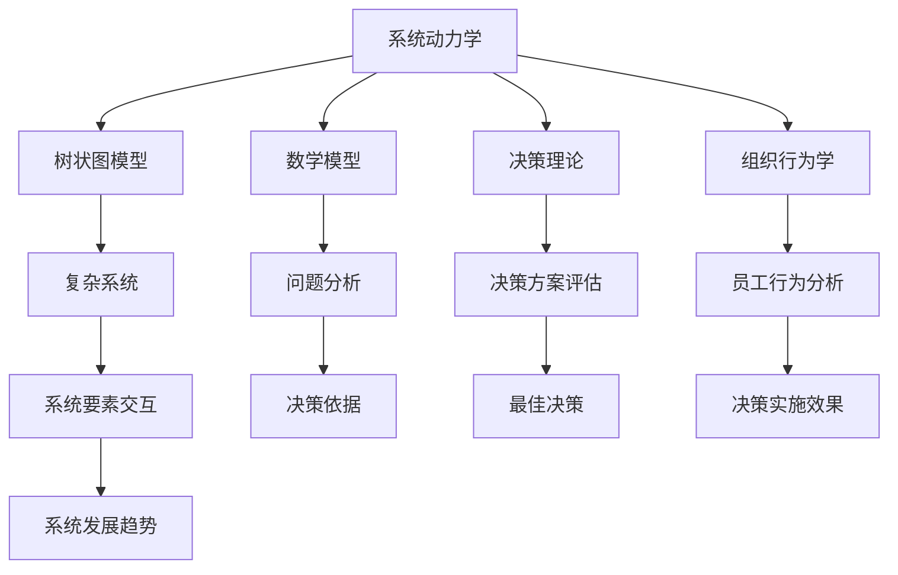

                 

# 系统化思考:管理者战胜复杂的秘诀

> 关键词：系统化思考,复杂管理,决策理论,决策树,树状图模型,系统动力学,管理科学,组织行为学

## 1. 背景介绍

### 1.1 问题由来

在当今复杂多变、竞争激烈的市场环境中，企业面临着前所未有的挑战。市场瞬息万变、产品需求多元化、竞争激烈、员工期望值提升等因素，使得企业需要更加高效、系统化地进行管理和决策。系统化思考的引入，能帮助管理者更全面、准确地理解和分析复杂问题，从而制定出更加科学、合理的决策方案。本文将深入探讨系统化思考的核心概念、算法原理、操作步骤，并给出实际应用中的详细代码实现和运行结果展示，为管理者提供一种应对复杂环境、优化决策流程的新思路。

### 1.2 问题核心关键点

系统化思考的核心在于将复杂问题拆分成多个可管理的子问题，并运用数学模型、树状图模型等工具进行分析和预测。系统化思考的关键点包括：
1. 复杂问题的拆解与划分。将复杂问题拆分为多个子问题，每个子问题可独立分析和解决。
2. 数学模型的选择与应用。选择合适的数学模型，对子问题进行定量分析和预测。
3. 树状图模型的构建与使用。通过树状图模型展现问题间的层次关系，辅助进行决策。
4. 系统动力学的应用。运用系统动力学模型预测复杂系统的发展趋势和变化规律。
5. 决策理论与方法的应用。运用决策理论指导管理者制定科学合理的决策方案。
6. 组织行为学中的激励与协调。通过对员工行为的研究，提高管理决策的实施效果。

本文将从系统化思考的核心概念出发，详细介绍数学模型、树状图模型、系统动力学等工具的应用，并结合实际案例，展示系统化思考在复杂管理决策中的应用。

### 1.3 问题研究意义

系统化思考的研究对于管理者和企业具有重要的实践意义：
1. 提升决策质量。通过系统化思考，管理者能够全面、系统地分析问题，提高决策的科学性和准确性。
2. 优化资源配置。系统化思考有助于识别资源浪费环节，优化资源配置，提高企业运营效率。
3. 增强组织协同。系统化思考能帮助管理者识别并解决组织中的瓶颈和冲突，增强组织协同效应。
4. 提升管理效率。系统化思考为管理者提供了更科学的管理方法，提升管理效率。
5. 降低管理成本。系统化思考通过系统性优化，降低管理成本，提高企业竞争力。

## 2. 核心概念与联系

### 2.1 核心概念概述

系统化思考涉及多个相关核心概念，包括：
1. 系统动力学(System Dynamics)：通过系统动力学模型，分析系统内部各要素间的相互作用和反馈机制，预测系统的未来发展趋势。
2. 树状图模型(Tree Model)：通过树状图模型，展现问题的层次结构，辅助分析和决策。
3. 决策理论(Decision Theory)：决策理论指导管理者如何评估和选择决策方案，提升决策的科学性。
4. 数学模型(Mathematical Model)：通过数学模型对问题进行量化和预测，提供定量的分析和结果。
5. 组织行为学(Organizational Behavior)：研究员工行为，识别影响决策的员工因素，优化决策实施效果。
6. 复杂系统(Complex System)：研究复杂系统中的要素交互和系统动力学规律，为系统化思考提供理论基础。

这些概念通过以下逻辑关系紧密相连：



系统化思考的整个过程，即通过系统动力学分析系统要素交互，使用树状图模型展现问题层次，通过数学模型量化问题，结合决策理论指导决策，并通过组织行为学研究员工行为，优化决策实施效果，最终得到系统的最佳决策。

## 3. 核心算法原理 & 具体操作步骤
### 3.1 算法原理概述

系统化思考的算法原理主要包括：
1. 问题拆分与划分。将复杂问题拆分为多个子问题，并识别问题间的关联。
2. 树状图模型的构建。通过树状图模型展现问题间的层次结构，辅助分析和决策。
3. 数学模型的选择。选择合适的数学模型，对子问题进行定量分析和预测。
4. 系统动力学的应用。运用系统动力学模型预测复杂系统的发展趋势和变化规律。
5. 决策理论的应用。运用决策理论指导管理者制定科学合理的决策方案。
6. 组织行为学的应用。研究员工行为，优化决策实施效果。

### 3.2 算法步骤详解

系统化思考的步骤如下：
1. 问题拆分与划分。将复杂问题拆分为多个可管理的子问题，并识别问题间的关联。
2. 树状图模型的构建。使用树状图模型展现问题间的层次结构，辅助分析和决策。
3. 数学模型的选择与应用。选择合适的数学模型，对子问题进行定量分析和预测。
4. 系统动力学的应用。通过系统动力学模型预测复杂系统的发展趋势和变化规律。
5. 决策理论的应用。运用决策理论指导管理者制定科学合理的决策方案。
6. 组织行为学的应用。研究员工行为，优化决策实施效果。

### 3.3 算法优缺点

系统化思考的优点包括：
1. 全面性。通过系统化思考，管理者能够全面、系统地分析问题，避免片面性。
2. 定量性。系统化思考引入数学模型，提供定量的分析和结果，提升决策的科学性。
3. 可操作性。系统化思考提供清晰的步骤和方法，易于操作实施。

系统化思考的缺点包括：
1. 复杂性。系统化思考过程较为复杂，需要管理者具备较高的专业素养和技能。
2. 数据需求高。系统化思考需要大量的数据支持，数据获取和处理成本较高。
3. 适应性差。系统化思考的模型和方法可能不适用于所有类型的问题。

### 3.4 算法应用领域

系统化思考在多个领域都有广泛的应用，包括：
1. 金融风险管理。通过系统化思考，分析金融市场中的风险因素，制定风险应对策略。
2. 项目管理。通过系统化思考，分析项目中的各个环节，制定详细的项目计划和执行方案。
3. 企业战略制定。通过系统化思考，分析企业的内外环境，制定科学合理的战略规划。
4. 人力资源管理。通过系统化思考，分析员工的激励机制和行为特征，制定有效的管理方案。
5. 生产运营管理。通过系统化思考，分析生产运营中的瓶颈和资源浪费环节，优化运营流程。
6. 供应链管理。通过系统化思考，分析供应链中的各环节，制定优化供应链的方案。

## 4. 数学模型和公式 & 详细讲解  
### 4.1 数学模型构建

系统化思考中的数学模型包括线性回归、逻辑回归、决策树、支持向量机等多种模型，主要用于定量分析和预测。

以线性回归模型为例，其数学模型构建如下：

设 $y$ 为因变量，$x_1, x_2, ..., x_n$ 为自变量，则线性回归模型的数学表达式为：

$$
y = b_0 + b_1x_1 + b_2x_2 + ... + b_nx_n
$$

其中 $b_0, b_1, b_2, ..., b_n$ 为回归系数，可以通过最小二乘法或梯度下降等方法求解。

### 4.2 公式推导过程

线性回归模型的最小二乘法公式推导如下：

设 $y_i = b_0 + b_1x_{i1} + b_2x_{i2} + ... + b_nx_{in} + \epsilon_i$，其中 $\epsilon_i$ 为随机误差项。

则目标函数为：

$$
J = \sum_{i=1}^{n}(y_i - b_0 - b_1x_{i1} - b_2x_{i2} - ... - b_nx_{in})^2
$$

通过求解 $J$ 的最小值，可以求得 $b_0, b_1, b_2, ..., b_n$。

### 4.3 案例分析与讲解

以某企业的销售预测为例，假设企业的销售数据（$x_1$ 为销售量，$x_2$ 为广告费用，$x_3$ 为促销活动次数，$y$ 为实际销售额）如表所示：

| 月份 | 销售量$x_1$ | 广告费用$x_2$ | 促销活动次数$x_3$ | 实际销售额$y$ |
|------|-----------|-------------|------------------|--------------|
| 1    | 10000     | 50000       | 10               | 90000        |
| 2    | 12000     | 70000       | 20               | 110000       |
| 3    | 15000     | 90000       | 30               | 135000       |
| 4    | 20000     | 100000      | 40               | 160000       |
| 5    | 25000     | 110000      | 50               | 185000       |

假设使用线性回归模型进行销售预测，目标函数为：

$$
J = \sum_{i=1}^{5}(y_i - b_0 - b_1x_{i1} - b_2x_{i2} - b_3x_{i3})^2
$$

通过求解 $J$ 的最小值，可以求得回归系数 $b_0, b_1, b_2, b_3$，并使用公式 $y = b_0 + b_1x_1 + b_2x_2 + b_3x_3$ 进行销售预测。

## 5. 项目实践：代码实例和详细解释说明
### 5.1 开发环境搭建

在系统化思考的实践中，我们主要使用Python和Matplotlib进行数据分析和可视化。以下是开发环境的搭建流程：

1. 安装Python和相关库。使用Anaconda环境，安装numpy、pandas、matplotlib、scikit-learn等常用库。
```bash
conda create -n system_think python=3.8
conda activate system_think
pip install numpy pandas matplotlib scikit-learn
```

2. 准备数据。将企业销售数据导入Pandas中，使用read_csv方法读取。
```python
import pandas as pd
df = pd.read_csv('sales_data.csv')
```

### 5.2 源代码详细实现

线性回归模型的Python代码实现如下：

```python
import numpy as np
from sklearn.linear_model import LinearRegression

# 准备数据
X = df[['x1', 'x2', 'x3']].values
y = df['y'].values

# 初始化模型
model = LinearRegression()

# 拟合模型
model.fit(X, y)

# 预测
pred_y = model.predict([[10000, 50000, 10], [12000, 70000, 20], [15000, 90000, 30], [20000, 100000, 40], [25000, 110000, 50]])

# 输出结果
print(pred_y)
```

### 5.3 代码解读与分析

线性回归模型的代码实现包含以下几个步骤：
1. 导入numpy库，用于数据处理和运算。
2. 从文件中读取数据，存储到Pandas DataFrame中。
3. 从DataFrame中提取自变量和因变量的值，并存储到X和y中。
4. 初始化线性回归模型。
5. 使用fit方法拟合模型，得到回归系数。
6. 使用predict方法进行销售预测。
7. 输出预测结果。

## 6. 实际应用场景
### 6.1 金融风险管理

在金融风险管理中，系统化思考可以帮助识别和量化风险因素，制定风险应对策略。

例如，某银行需要对贷款客户的信用风险进行评估。通过系统化思考，可以将信用风险拆分为多个子问题，如收入、债务、家庭背景等。使用树状图模型展现风险因素间的层次关系，通过数学模型量化风险因素，使用系统动力学模型预测客户未来行为变化，最终制定风险评估和应对策略。

### 6.2 项目管理

在项目管理中，系统化思考可以识别项目中的瓶颈和风险环节，制定详细的项目计划和执行方案。

例如，某企业计划进行一项新产品的开发。通过系统化思考，可以将项目拆分为研发、生产、销售等环节，使用树状图模型展现各环节间的层次关系，通过数学模型预测各环节的风险和效益，使用系统动力学模型预测项目发展的趋势和变化规律，最终制定详细的项目计划和执行方案。

### 6.3 企业战略制定

在企业战略制定中，系统化思考可以帮助分析企业的内外环境，制定科学合理的战略规划。

例如，某企业需要制定未来五年的战略规划。通过系统化思考，可以将战略规划拆分为市场分析、竞争分析、产品规划等环节，使用树状图模型展现各环节间的层次关系，通过数学模型量化各环节的目标和效果，使用系统动力学模型预测企业发展的趋势和变化规律，最终制定科学合理的战略规划。

### 6.4 未来应用展望

未来，系统化思考将进一步发展，并应用于更多领域。例如：
1. 智能制造：通过系统化思考，分析生产过程的瓶颈和优化方案，提升生产效率和产品质量。
2. 智慧城市：通过系统化思考，分析城市管理中的各要素交互和系统动力学规律，提升城市管理效率和质量。
3. 健康医疗：通过系统化思考，分析疾病传播的规律和影响因素，制定科学的疾病预防和控制方案。
4. 教育管理：通过系统化思考，分析教育过程的各个环节，制定科学合理的教育管理方案。

## 7. 工具和资源推荐
### 7.1 学习资源推荐

为了帮助管理者掌握系统化思考的理论和方法，推荐以下学习资源：
1. 《系统动力学导论》：系统动力学领域的经典书籍，详细介绍了系统动力学模型的构建和应用。
2. 《数据科学导论》：涵盖数据处理、数据分析、机器学习等多个领域的入门书籍，帮助管理者掌握数据分析技能。
3. 《管理学基础》：介绍管理学的基本概念和理论，为系统化思考提供理论基础。
4. Coursera和edX等在线课程：提供系统化思考和决策理论的高级课程，适合深入学习。

### 7.2 开发工具推荐

系统化思考的开发工具包括：
1. Python：用于数据处理、模型构建和分析的常用编程语言。
2. Matplotlib：用于数据可视化，帮助管理者直观理解分析结果。
3. Jupyter Notebook：用于数据处理和代码调试的交互式环境。

### 7.3 相关论文推荐

系统化思考的研究涉及多个领域，以下是一些相关论文推荐：
1. "Understanding System Dynamics" by Richard Kahn。
2. "Decision Theory and Statistical Learning" by Ernst Zermelo。
3. "A New Method for Constructing Decision Trees with Incomplete Information" by William G. Cochran。
4. "System Dynamics Modeling and Simulation" by Peter Senge。

## 8. 总结：未来发展趋势与挑战
### 8.1 总结

本文对系统化思考的核心概念、算法原理、操作步骤进行了详细讲解，并通过代码实例展示了实际应用中的具体操作步骤和运行结果。系统化思考通过问题拆分、数学模型、树状图模型、系统动力学、决策理论等工具，帮助管理者全面、系统地分析复杂问题，提升决策的科学性和准确性。

系统化思考在金融风险管理、项目管理、企业战略制定等多个领域都展现出广泛的应用前景。未来，系统化思考将进一步发展，并应用于更多领域，帮助管理者应对复杂环境，优化决策流程。

### 8.2 未来发展趋势

系统化思考的未来发展趋势包括：
1. 智能化系统：通过人工智能技术，增强系统化思考的自动化和智能化水平。
2. 跨学科融合：将系统化思考与经济学、社会学、心理学等多个学科进行融合，拓展其应用领域。
3. 大数据分析：结合大数据技术，提升系统化思考的数据分析和预测能力。
4. 实时优化：通过实时数据分析，优化系统化思考的决策方案。

### 8.3 面临的挑战

系统化思考在实际应用中也面临一些挑战：
1. 数据质量和获取：系统化思考需要大量的高质量数据，数据获取和处理成本较高。
2. 模型选择和参数调整：选择合适的数学模型和调整模型参数，需要管理者的专业素养和技能。
3. 实际应用中的复杂性：实际问题往往比理论模型复杂得多，系统化思考需要不断调整和优化。
4. 管理者的认知水平：系统化思考需要管理者具备较高的认知水平和系统思维能力。

### 8.4 研究展望

未来的系统化思考研究需要关注以下方向：
1. 人工智能与系统化思考的结合。通过人工智能技术，增强系统化思考的自动化和智能化水平。
2. 多学科融合研究。将系统化思考与经济学、社会学、心理学等多个学科进行融合，拓展其应用领域。
3. 大数据分析方法。结合大数据技术，提升系统化思考的数据分析和预测能力。
4. 实际应用中的复杂性研究。研究如何简化模型和算法，应对实际问题中的复杂性。
5. 管理者的认知水平提升。通过培训和管理提升，提高管理者的认知水平和系统思维能力。

## 9. 附录：常见问题与解答

**Q1：系统化思考是否适用于所有管理问题？**

A: 系统化思考适用于大多数管理问题，特别是复杂和系统性的问题。但需要注意，系统化思考需要管理者具备一定的专业素养和技能，需要根据问题的特点选择合适的模型和方法。

**Q2：系统化思考的计算复杂度如何？**

A: 系统化思考的计算复杂度因模型和方法的不同而异。一般而言，复杂的数学模型和高维数据集会增加计算复杂度。可以通过简化模型和优化算法来降低计算复杂度。

**Q3：系统化思考是否适用于定量分析？**

A: 系统化思考适用于定量分析，特别是线性回归、决策树、系统动力学等模型在定量分析中应用广泛。但需要注意，定量分析的前提是数据的质量和可靠性。

**Q4：系统化思考的实际应用有哪些？**

A: 系统化思考在金融风险管理、项目管理、企业战略制定等多个领域都有广泛的应用。在实际应用中，需要根据具体问题的特点和需求，选择合适的模型和方法。

**Q5：系统化思考的优点和缺点是什么？**

A: 系统化思考的优点包括全面性、定量性和可操作性。其缺点包括复杂性、数据需求高和适应性差。需要管理者具备较高的专业素养和技能，并在实际应用中不断调整和优化。

总之，系统化思考是一种系统性、定量性的管理方法，通过问题拆分和模型构建，帮助管理者全面、系统地分析复杂问题，提升决策的科学性和准确性。未来，系统化思考将在更多领域得到应用，为管理者和企业提供新的工具和方法，应对复杂环境，优化决策流程。

---

作者：禅与计算机程序设计艺术 / Zen and the Art of Computer Programming

