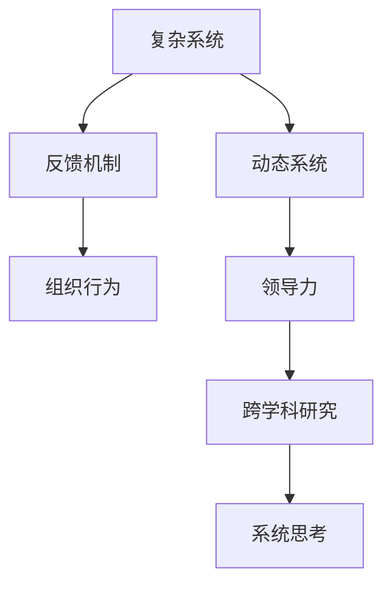

                 

# 系统思考在组织变革中的应用

> 关键词：系统思考,组织变革,复杂系统,动态系统,反馈机制,组织行为,领导力,跨学科研究,实践案例

## 1. 背景介绍

在数字化转型加速的今天，企业面临着前所未有的竞争压力和变革需求。如何在复杂多变的环境中保持竞争优势，实现可持续发展，是每个企业管理者必须直面的问题。而系统思考(Systemic Thinking)作为一种基于整体观的系统视角，为解决这些问题提供了全新的方法和工具。

### 1.1 问题由来

传统上，企业管理多采取线性思维和局部优化策略，认为问题发生于局部而非整体，通过局部优化就能达到全局最优。但随着信息技术和业务环境的飞速变化，企业面临的挑战变得更加复杂和动态。如敏捷发展、供应链管理、全球化运营等，这些问题的解决已经不能单纯依赖局部优化，而需要从系统视角出发，全面审视问题，系统思考应运而生。

### 1.2 问题核心关键点

系统思考是一种思考方式和工具，强调从整体和动态视角分析问题，把握系统各要素之间的互动关系，并通过建立反馈机制和优化控制策略，实现系统整体的最优运行。主要包含以下几个关键点：

1. **整体性思维**：将企业看作一个整体，而非各个局部问题的简单叠加。
2. **动态性观察**：认识到企业系统是不断变化和发展的，不是静止不变的。
3. **反馈机制建立**：通过系统内外部反馈，实时调整企业行为，以应对环境变化。
4. **优化控制策略**：运用系统动力学、仿真等方法，模拟和优化企业运营，达到最优结果。

系统思考方法已经广泛应用于企业战略规划、流程优化、领导力提升等多个领域，取得了显著的成效。

### 1.3 问题研究意义

系统思考在组织变革中的应用，对于提升企业竞争力、实现可持续发展具有重要意义：

1. **应对复杂环境**：系统思考帮助企业从整体和动态视角审视问题，全面应对市场变化和竞争挑战。
2. **实现全局最优**：通过优化控制策略，帮助企业实现全局最优，而非局部最优。
3. **提升管理水平**：系统思考强调反馈和持续改进，提升企业的管理效率和执行效果。
4. **推动创新转型**：系统思考鼓励跨学科合作，带来新的思路和方法，推动企业转型升级。

## 2. 核心概念与联系

### 2.1 核心概念概述

为更好地理解系统思考在组织变革中的应用，本节将介绍几个密切相关的核心概念：

- **复杂系统**：由众多互相依赖、相互作用的部分组成的系统。复杂系统特征为非线性、非均衡、自组织等。
- **动态系统**：系统状态随着时间变化而不断演化。动态系统需考虑时间维度，进行动态建模和分析。
- **反馈机制**：通过系统内部或外部的信息循环，使系统根据环境变化不断调整自身行为。
- **组织行为**：企业中个体、团队和组织层面的行为模式和决策过程。
- **领导力**：企业中的领导能力和管理风格，对企业变革起着关键作用。
- **跨学科研究**：系统思考结合系统动力学、组织行为学、管理科学等多个学科的理论和方法，提供跨学科的研究视角。

这些核心概念之间的逻辑关系可以通过以下Mermaid流程图来展示：



这个流程图展示了几大核心概念之间的联系：

1. 复杂系统是系统思考和组织变革的基础。
2. 动态系统强调时间维度，需要系统思考进行动态建模。
3. 反馈机制是系统思考的重要组成部分，通过反馈调整企业行为。
4. 组织行为直接影响领导力和系统思考的实施效果。
5. 领导力是变革推动力量，跨学科研究为领导力提供科学支持。

## 3. 核心算法原理 & 具体操作步骤
### 3.1 算法原理概述

系统思考在组织变革中的核心原理可以概括为：通过建立系统模型，分析和理解系统各要素之间的互动关系，发现系统的关键控制点和驱动因素，并通过反馈机制优化企业行为，实现整体目标。

具体来说，系统思考的流程包括以下步骤：

1. **系统建模**：建立系统的动态模型，如系统动力学模型、仿真模型等。
2. **行为分析**：通过模型预测，分析系统行为，识别关键影响因素。
3. **优化策略**：确定系统最优策略，如调整控制参数、改进流程等。
4. **实施和反馈**：在实际运营中实施策略，并根据反馈结果不断调整。

### 3.2 算法步骤详解

系统思考在组织变革中的具体操作步骤分为以下几个环节：

**Step 1: 系统观察和建模**

- **数据收集**：收集企业运营过程中的各类数据，如销售数据、库存数据、客户反馈等。
- **系统定义**：明确系统的边界和关键组成部分，如供应链系统、营销系统、客户服务系统等。
- **模型建立**：根据收集的数据和系统定义，建立动态模型，如系统动力学模型、仿真模型等。

**Step 2: 系统行为分析**

- **模型仿真**：在模型中进行仿真实验，预测系统在不同条件下的行为变化。
- **影响因素识别**：通过仿真结果，识别出影响系统行为的关键因素。如供应链响应速度、客户满意度等。
- **驱动因素分析**：深入分析这些关键因素背后的驱动因素，如市场需求、库存策略等。

**Step 3: 优化策略设计**

- **目标设定**：根据企业战略，设定系统的总体目标和优化目标。
- **策略设计**：基于模型仿真结果，设计优化策略，如调整供应链参数、改进营销策略等。
- **参数优化**：通过仿真实验，优化控制参数，找到最优策略。

**Step 4: 实施与反馈**

- **策略实施**：将优化策略转化为具体的执行措施，在实际运营中实施。
- **结果监控**：实时监控系统行为，如生产效率、客户满意度等。
- **反馈调整**：根据监控结果和预期目标的差距，调整控制策略，确保目标实现。

### 3.3 算法优缺点

系统思考在组织变革中的应用具有以下优点：

1. **全局视角**：系统思考从整体视角出发，避免了局部优化的局限性。
2. **动态分析**：考虑时间维度，能够应对动态变化的环境。
3. **反馈机制**：通过实时反馈，及时调整策略，提高运营效率。
4. **优化策略**：基于模型仿真，找到最优策略，提升管理水平。

但系统思考也存在一些局限性：

1. **模型复杂性**：建立和维护系统模型需要较高技术要求，增加了复杂度。
2. **数据质量要求**：系统思考依赖于高质量的数据，数据质量直接影响结果准确性。
3. **实施难度**：实施系统思考需要跨部门的协作，管理难度较大。
4. **策略调整周期长**：系统优化策略需要多次迭代调整，周期较长。

尽管存在这些局限性，但系统思考在组织变革中的应用效果显著，已经成为现代企业战略管理的重要工具。

### 3.4 算法应用领域

系统思考在组织变革中的应用已经涵盖了多个领域，包括但不限于：

- **供应链管理**：优化供应链流程，提升响应速度和效率。
- **市场营销**：通过客户行为分析，优化营销策略，提升客户满意度。
- **生产运营**：分析生产系统行为，优化资源配置和生产效率。
- **组织变革**：分析组织行为和领导力，推动变革实现。
- **人力资源**：优化人员招聘和培训，提升员工绩效。

此外，系统思考在金融、医疗、政府管理等领域也得到了广泛应用，为解决复杂问题提供了有力的工具。

## 4. 数学模型和公式 & 详细讲解 & 举例说明

### 4.1 数学模型构建

系统思考在组织变革中的应用，常使用系统动力学模型(System Dynamics Modeling)来进行定量分析。系统动力学模型是一种基于因果关系的动态仿真模型，用于模拟和分析复杂系统的行为。

设企业运营系统为 $S$，其状态变量为 $\{x_i\}_{i=1}^N$，状态转移函数为 $f(\{x_i\})$，系统动力学模型可表示为：

$$
S_{t+1} = f(S_t)
$$

其中 $S_t$ 表示系统在时间 $t$ 的状态，$S_{t+1}$ 表示时间 $t+1$ 的状态。模型中各状态变量的关系可以通过因果关系图和方程组来描述。

### 4.2 公式推导过程

以供应链系统为例，假设系统包含以下几个关键状态变量：

- $I_t$：时间 $t$ 的库存水平。
- $S_t$：时间 $t$ 的供应链响应时间。
- $D_t$：时间 $t$ 的需求量。

假设系统动力学模型为：

$$
I_{t+1} = I_t - D_t + S_t
$$

$$
S_{t+1} = S_t + \frac{1}{K_s} (I_{t+1} - I_{t+1}^*) + \frac{1}{K_r} (I_{t+1}^* - I_{t+1})
$$

其中 $I_{t+1}^*$ 为理想库存水平，$K_s$ 为供应链响应速度，$K_r$ 为供应链调整速度。

根据上述模型，我们可以通过仿真实验，预测不同控制参数下系统的行为变化。例如，调整供应链响应速度和理想库存水平，观察系统响应时间和库存水平的波动情况。

### 4.3 案例分析与讲解

某电商平台在面临市场竞争加剧的情况下，希望通过系统思考进行供应链优化。通过建立系统动力学模型，分析库存水平、供应链响应时间和客户需求之间的关系。具体步骤如下：

1. **系统建模**：定义库存水平、供应链响应时间和客户需求为关键状态变量，建立系统动力学模型。
2. **行为分析**：通过仿真实验，预测不同供应链响应速度和理想库存水平下的系统行为。
3. **优化策略**：发现供应链响应速度和库存水平对系统行为影响显著，设计优化策略。
4. **实施与反馈**：在实际运营中实施优化策略，并通过监控实时调整。

通过系统思考，该电商平台显著提升了供应链响应速度和库存管理效率，满足了客户需求，市场竞争力大幅提升。

## 5. 项目实践：代码实例和详细解释说明

### 5.1 开发环境搭建

在进行系统思考的实践时，需要搭建相应的开发环境。以下是Python环境搭建的步骤：

1. **安装Python**：从官网下载并安装Python，选择3.x版本。
2. **安装Anaconda**：从官网下载并安装Anaconda，创建虚拟环境。
3. **激活虚拟环境**：通过命令行激活虚拟环境。
4. **安装相关库**：安装系统动力学库、可视化库等，如Python-System Dynamics、Matplotlib等。

### 5.2 源代码详细实现

下面以某企业的供应链系统为例，使用Python-System Dynamics库进行系统动力学建模和仿真。

```python
import systemdynamics as sd

# 定义系统动力学模型
model = sd.Model('SupplyChainModel')

# 添加状态变量
model.add_state_var('Inventory', init_val=1000)
model.add_state_var('Demand', init_val=500)
model.add_state_var('ResponseTime', init_val=2)

# 添加状态转移方程
model.add_equation('InventoryTransfer', 'Inventory = Inventory - Demand + ResponseTime')

# 添加控制参数
model.add_control_param('ResponseSpeed', init_val=1)
model.add_control_param('OptimalInventory', init_val=1500)

# 运行仿真实验
sim = model.run()

# 输出仿真结果
print(sim.solution)

# 绘制仿真结果图
sim.plot()
```

在上述代码中，我们定义了库存水平、需求量和供应链响应时间为关键状态变量，并通过状态转移方程建立了系统动力学模型。通过控制参数调整供应链响应速度和理想库存水平，进行了仿真实验，并绘制了仿真结果图。

### 5.3 代码解读与分析

让我们进一步解读上述代码的关键实现细节：

**Model类**：
- 使用Python-System Dynamics库的Model类，创建名为SupplyChainModel的系统动力学模型。
- 通过add_state_var方法，添加库存水平、需求量和供应链响应时间三个状态变量，并设置初始值。
- 通过add_equation方法，添加状态转移方程InventoryTransfer，定义库存水平的计算方式。
- 通过add_control_param方法，添加供应链响应速度和理想库存水平两个控制参数，并设置初始值。

**run方法**：
- 使用run方法，运行仿真实验，并返回仿真结果。

**solution属性**：
- solution属性包含仿真结果，包括每个时间步的状态值和控制参数值。

**plot方法**：
- 使用plot方法，绘制仿真结果图，直观展示系统行为随时间变化的情况。

通过Python-System Dynamics库，我们可以快速搭建和运行系统动力学模型，进行仿真实验，分析系统行为，制定优化策略。

## 6. 实际应用场景

### 6.1 智能制造系统

系统思考在智能制造系统中的应用，有助于优化生产流程，提升制造效率和质量。通过系统思考，企业可以全面分析和理解生产系统各要素之间的互动关系，发现关键控制点和驱动因素，从而优化生产策略，提高生产效率和产品质量。

### 6.2 智慧城市治理

智慧城市治理系统通过系统思考，可以整合城市各部门的资源和信息，实现信息共享和协同管理。通过建立动态模型，分析城市运行状态和行为，优化城市管理决策，提升城市治理效率和效果。

### 6.3 医疗健康管理

系统思考在医疗健康管理中的应用，可以优化医疗流程，提升医疗服务质量。通过系统思考，分析医院运营中的各种因素，如患者流量、医疗资源分配等，优化医疗流程，提高医疗服务效率。

### 6.4 金融风险管理

系统思考在金融风险管理中的应用，可以优化风险控制策略，降低金融风险。通过系统思考，分析市场动态和金融产品特性，优化风险模型，提高金融产品的抗风险能力。

## 7. 工具和资源推荐

### 7.1 学习资源推荐

为了帮助开发者系统掌握系统思考的理论基础和实践技巧，这里推荐一些优质的学习资源：

1. **《系统思考的实践》**：作者James G. March，介绍了系统思考的基本概念和实践技巧。
2. **《系统动力学：建模与仿真》**：作者Simon C.L. Bozzolan，系统动力学建模的基础教材。
3. **《系统思维与管理创新》**：作者Jay W. Forrester，系统思考理论的奠基之作。
4. **《系统思考在行动》**：作者Pascale Wesson，系统思考在组织变革中的应用案例分析。
5. **Coursera《系统思考导论》**：斯坦福大学开设的课程，介绍了系统思考的基本原理和实践方法。

通过对这些资源的学习实践，相信你一定能够快速掌握系统思考的精髓，并用于解决实际的组织变革问题。

### 7.2 开发工具推荐

高效的系统思考实践离不开优秀的工具支持。以下是几款用于系统思考开发的常用工具：

1. **Python-System Dynamics**：Python系统动力学库，支持动态模型建模和仿真。
2. **Vensim**：系统动力学建模和仿真工具，支持图形化建模和仿真实验。
3. **AnyLogic**：综合仿真建模工具，支持复杂系统的动态仿真。
4. **SystemWorks**：系统动力学建模和仿真软件，支持大规模系统建模和仿真。
5. **Simio**：企业仿真建模工具，支持供应链、生产等复杂系统的建模和仿真。

合理利用这些工具，可以显著提升系统思考的实践效率，加速创新迭代的步伐。

### 7.3 相关论文推荐

系统思考在组织变革中的应用研究已经取得了丰硕成果，以下是几篇具有代表性的相关论文，推荐阅读：

1. **《系统思考与组织变革》**：作者Jay W. Forrester，系统思考理论的奠基之作，介绍了系统思考在组织变革中的应用。
2. **《系统动力学：建模与仿真》**：作者Simon C.L. Bozzolan，系统动力学建模的基础教材，介绍了系统动力学模型的构建和仿真方法。
3. **《系统思考在行动》**：作者Pascale Wesson，系统思考在组织变革中的应用案例分析，介绍了系统思考在不同领域的应用实践。
4. **《系统思考与管理创新》**：作者James G. March，介绍了系统思考的基本概念和实践技巧，提供了系统思考的理论基础。
5. **《系统动力学模型在供应链管理中的应用》**：作者Michael T. Hannan，介绍了系统动力学模型在供应链管理中的应用，提供了详细的建模和仿真方法。

这些论文代表了大系统思考的应用研究进展，通过学习这些前沿成果，可以帮助研究者更好地把握系统思考的方法和工具，解决实际组织变革问题。

## 8. 总结：未来发展趋势与挑战

### 8.1 总结

本文对系统思考在组织变革中的应用进行了全面系统的介绍。首先阐述了系统思考的基本概念和研究背景，明确了系统思考在组织变革中的重要意义。其次，从原理到实践，详细讲解了系统思考的数学模型和关键步骤，给出了系统思考任务开发的完整代码实例。同时，本文还广泛探讨了系统思考在智能制造、智慧城市治理、医疗健康管理等多个领域的应用前景，展示了系统思考范式的巨大潜力。此外，本文精选了系统思考学习的资源，力求为读者提供全方位的技术指引。

通过本文的系统梳理，可以看到，系统思考在组织变革中的应用效果显著，已经成为现代企业战略管理的重要工具。未来，伴随系统思考理论和方法的不断演进，相信系统思考必将在更多领域大放异彩，为组织变革提供全新的视角和方法。

### 8.2 未来发展趋势

展望未来，系统思考在组织变革中的应用将呈现以下几个发展趋势：

1. **跨学科融合**：系统思考将更多结合人工智能、大数据、区块链等前沿技术，推动跨学科创新。
2. **实时化动态优化**：系统思考将更多采用实时数据和动态仿真，进行实时优化和调整。
3. **网络化协同**：系统思考将更多结合网络化协同机制，推动企业内外部的协同创新。
4. **智能化决策**：系统思考将更多结合人工智能技术，提升决策的智能化水平。
5. **伦理化和普适化**：系统思考将更多考虑伦理和社会影响，推动普适化的应用。

这些趋势凸显了系统思考的广阔前景，这些方向的探索发展，必将进一步提升系统思考在组织变革中的应用效果，为构建智能化的组织系统提供有力支持。

### 8.3 面临的挑战

尽管系统思考在组织变革中的应用已经取得了显著成效，但在迈向更加智能化、普适化应用的过程中，仍面临诸多挑战：

1. **数据获取难度**：系统思考依赖高质量的数据，但在实际应用中，数据获取和处理往往成本较高。
2. **模型复杂性**：系统动力学模型的构建和维护需要较高技术要求，增加了复杂度。
3. **实施难度**：系统思考需要跨部门协作，实施和管理难度较大。
4. **效果评估**：系统思考的效果评估需要多种量化指标，难以全面评估。
5. **动态变化**：企业环境和市场条件的变化，使得系统思考的效果需要不断调整。

尽管存在这些挑战，但系统思考在组织变革中的应用前景广阔，未来的研究需要在这些方向寻求新的突破，提升系统思考的应用效果。

### 8.4 研究展望

未来的系统思考研究需要在以下几个方面寻求新的突破：

1. **跨学科研究**：结合人工智能、大数据、区块链等前沿技术，提升系统思考的应用效果。
2. **动态优化**：结合实时数据和动态仿真，进行实时优化和调整。
3. **协同机制**：结合网络化协同机制，推动企业内外部的协同创新。
4. **智能化决策**：结合人工智能技术，提升决策的智能化水平。
5. **伦理化研究**：考虑伦理和社会影响，推动普适化的应用。

这些方向的研究和发展，必将引领系统思考迈向更高的台阶，为构建智能化的组织系统提供有力支持。面向未来，系统思考需要与其他人工智能技术进行更深入的融合，共同推动组织变革的实现。

## 9. 附录：常见问题与解答

**Q1: 系统思考和传统管理有什么区别？**

A: 系统思考强调从整体视角出发，关注系统各要素之间的互动关系，而传统管理更多关注局部优化。系统思考更注重系统动态变化，通过反馈机制进行持续优化，而传统管理更多依赖静态分析和局部调整。

**Q2: 系统思考需要哪些关键步骤？**

A: 系统思考需要以下关键步骤：
1. 系统建模
2. 行为分析
3. 优化策略设计
4. 实施与反馈

**Q3: 系统思考在组织变革中的应用前景如何？**

A: 系统思考在组织变革中的应用前景广阔，已在多个领域取得显著成效。未来将更多结合人工智能、大数据等前沿技术，提升应用效果。

**Q4: 系统思考的优缺点是什么？**

A: 系统思考的优点包括全局视角、动态分析、反馈机制等，但缺点在于模型复杂性、数据质量要求高、实施难度大等。

通过本文的系统梳理，可以看到，系统思考在组织变革中的应用效果显著，已经成为现代企业战略管理的重要工具。未来，伴随系统思考理论和方法的不断演进，相信系统思考必将在更多领域大放异彩，为组织变革提供全新的视角和方法。

---
作者：禅与计算机程序设计艺术 / Zen and the Art of Computer Programming

