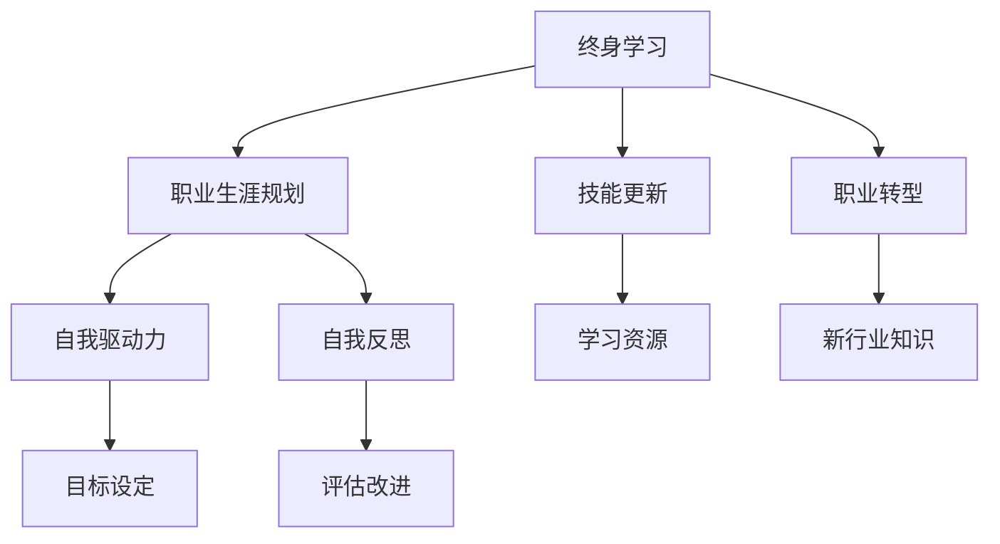

                 

# 终身学习与职业生涯规划

> 关键词：终身学习, 职业生涯规划, 技能更新, 职业转型, 自我驱动力, 自我反思, 职业路径

## 1. 背景介绍

### 1.1 问题由来

在快速变化的时代，技术的日新月异和职业市场的不断演变，使得终身学习成为个人职业发展不可或缺的一部分。过去那种在学校学习一次就能终身受用的观念已经不再适用。科技的进步、行业的转型、市场的竞争都要求我们不断更新知识，提升技能，以适应新的挑战。

本文将系统探讨终身学习的概念和实践，帮助读者理解其重要性，并提供实用的职业生涯规划建议。通过了解和学习终身学习的理念，并运用到实际的职业生涯规划中，读者能够更好地掌握自己的职业发展，实现个人和职业的双重成功。

## 2. 核心概念与联系

### 2.1 核心概念概述

- **终身学习**：终身学习是指一个人在其一生中持续不断地学习和自我提升的过程。它强调不断更新知识、技能和思维模式，以应对变化的世界。
- **职业生涯规划**：职业生涯规划是一个系统性、持续性的过程，通过明确目标、制定计划、执行行动，实现个人职业目标的过程。
- **技能更新**：技能更新是指在职业生涯中，根据职业发展的需要，不断学习和掌握新技能的过程。
- **职业转型**：职业转型是指个人从一种职业或行业转向另一种职业或行业的过程，通常伴随着技能、知识的全面更新和调整。
- **自我驱动力**：自我驱动力是指个人在学习和职业发展过程中，主动追求进步和自我实现的动力。
- **自我反思**：自我反思是指定期回顾和评估自己的学习和职业进展，识别优势和不足，并据此调整目标和行动的过程。

这些核心概念通过一个Mermaid流程图进行可视化，展示了它们之间的联系：



这个流程图展示了终身学习与职业生涯规划相互促进的关系，以及技能更新和职业转型在此过程中的重要性。同时，自我驱动力和自我反思是实现这些目标的关键心理要素。

## 3. 核心算法原理 & 具体操作步骤

### 3.1 算法原理概述

终身学习的核心理念是通过不断的学习和自我提升，实现个人职业目标。这一过程可以分解为以下几个步骤：

1. **目标设定**：明确个人职业目标和所需技能。
2. **计划制定**：根据目标，制定详细的学习和发展计划。
3. **资源获取**：选择合适的学习资源，包括课程、书籍、在线资源等。
4. **学习实施**：按照计划执行学习，不断提升自己的技能。
5. **技能评估**：定期评估自己的学习进展和技能水平。
6. **调整计划**：根据评估结果，调整学习计划和目标。
7. **实践应用**：将学到的知识应用到实际工作中，检验学习效果。
8. **持续改进**：不断迭代上述步骤，实现持续学习。

### 3.2 算法步骤详解

#### 3.2.1 目标设定

- **明确职业目标**：确定自己的职业方向和具体目标，如成为某领域专家、晋升到管理层等。
- **识别所需技能**：分析实现目标需要哪些核心技能和知识，例如编程技能、数据分析能力、项目管理经验等。
- **制定量化指标**：将职业目标转化为可量化的指标，如通过某项认证、掌握某门编程语言、完成某项目等。

#### 3.2.2 计划制定

- **时间规划**：将学习目标分解为短期、中期和长期目标，设定明确的完成时间。
- **资源分配**：根据优先级分配学习资源，如时间、资金和网络资源。
- **任务分解**：将大目标细化为具体的小任务，制定详细的学习计划。

#### 3.2.3 资源获取

- **选择合适的平台**：如Coursera、edX、Udemy等在线学习平台。
- **利用公共资源**：如MOOCs、图书馆资源、行业报告等。
- **加入学习社区**：如Stack Overflow、GitHub、专业论坛等，获取最新的行业动态和知识共享。

#### 3.2.4 学习实施

- **遵循学习计划**：按照制定的学习计划，系统性地学习相关知识和技能。
- **实践应用**：将所学知识应用到实际工作中，通过项目实践加深理解和掌握。
- **寻求反馈**：向同事、导师或在线社区寻求反馈，不断改进学习方法和效果。

#### 3.2.5 技能评估

- **自我评估**：定期评估自己的学习进展和技能水平，使用自我评估工具或在线测试。
- **第三方评估**：参加行业认证考试、获取职业资格证书，通过第三方评估确认学习效果。

#### 3.2.6 调整计划

- **根据评估结果调整目标**：根据自我评估和第三方评估的结果，调整学习计划和目标，确保目标的现实性和可行性。
- **增加新任务**：根据行业发展趋势和个人兴趣，增加新的学习任务，保持学习的动力和热情。

#### 3.2.7 实践应用

- **实际项目实践**：选择具有挑战性的实际项目，将所学知识应用到实际工作中，检验学习效果。
- **反思总结**：在项目完成后，进行反思总结，评估学习效果，找出改进空间。

#### 3.2.8 持续改进

- **迭代优化**：不断迭代上述步骤，根据职业目标的变化和行业发展的趋势，调整学习计划和目标。
- **保持学习热情**：通过阅读最新的行业报告、参加行业会议、参与专业社群等方式，保持对行业的敏感度和学习的热情。

### 3.3 算法优缺点

#### 3.3.1 优点

- **灵活性高**：终身学习能够灵活应对职业市场的变化和技术的进步，帮助个人随时调整学习计划和目标。
- **目标明确**：通过明确的目标设定和量化指标，使学习过程更加有条理和方向性。
- **资源丰富**：互联网和在线平台提供了丰富的学习资源，使得学习更加便捷和高效。
- **自我驱动**：自我驱动力能够帮助个人保持学习的动力和热情，持续进步。

#### 3.3.2 缺点

- **时间管理困难**：平衡工作和学习的安排，需要良好的时间管理和自我约束能力。
- **学习压力大**：终身学习意味着需要不断更新知识和技能，可能带来较大的学习压力。
- **资源质量不一**：互联网上的学习资源质量参差不齐，需要花费时间和精力筛选和评估。

### 3.4 算法应用领域

终身学习的理念和实践不仅适用于技术领域，更适用于各个行业。以下是一些主要的应用领域：

- **IT/软件开发**：通过持续学习最新的编程语言、框架和工具，保持技术领先。
- **金融**：掌握最新的金融产品、市场趋势和风险管理知识，提升职业竞争力。
- **医疗健康**：学习最新的医疗技术和治疗方法，提升诊疗水平和职业素养。
- **市场营销**：掌握数字营销和数据分析技能，提升市场推广效果。
- **教育**：通过不断更新教学方法和内容，提升教学质量和学生满意度。
- **艺术设计**：学习最新的设计工具和趋势，保持创意活力。
- **企业管理**：掌握最新的管理理论和实践，提升领导力和组织效率。

## 4. 数学模型和公式 & 详细讲解 & 举例说明

### 4.1 数学模型构建

终身学习的效果可以通过数学模型来量化和评估。假设个人的初始技能水平为 $S_0$，经过 $T$ 时间的学习后，技能水平提升到 $S_T$，其中 $S_T = S_0 + \sum_{t=1}^{T} \Delta S_t$，$\Delta S_t$ 为第 $t$ 次学习的技能提升量。

### 4.2 公式推导过程

- **技能提升量**：$\Delta S_t = k \times F_t$，其中 $k$ 为学习效率系数，$F_t$ 为第 $t$ 次学习的强度。
- **学习强度**：$F_t = \text{资源投入} \times \text{时间投入} \times \text{心理投入}$，其中资源投入包括学习资源、导师指导等，时间投入包括学习时间、实践时间等，心理投入包括学习动机、自我驱动力等。

### 4.3 案例分析与讲解

以软件开发为例，分析一个程序员通过终身学习提升技能的过程。假设该程序员初始技能水平为 $S_0 = 60$，学习效率系数 $k = 0.5$，每月学习强度 $F_t = 30 \times 10 \times 1.2$，经过 $T = 24$ 个月的学习后，技能水平提升到 $S_T = 60 + 0.5 \times 30 \times 10 \times 1.2 \times 24 = 192$。

该案例展示了终身学习的量化评估方法，通过设定具体指标和参数，评估个人技能提升的效果。在实际应用中，可以通过类似的方式，量化评估不同学习方法和策略的效果。

## 5. 项目实践：代码实例和详细解释说明

### 5.1 开发环境搭建

- **安装Python**：确保系统已安装Python 3.x版本。
- **安装相关库**：使用pip安装需要的库，如numpy、pandas、matplotlib等。
- **创建学习计划**：使用Excel或Google Sheets等工具，创建学习计划，明确目标、资源、时间安排等。

### 5.2 源代码详细实现

以下是使用Python实现的终身学习效果评估示例代码：

```python
import numpy as np

def calculate_skill_level(skill_initial, learning_rate, time, learning_strength):
    """
    计算终身学习后的技能水平
    :param skill_initial: 初始技能水平
    :param learning_rate: 学习效率系数
    :param time: 学习时间（月数）
    :param learning_strength: 每月学习强度
    :return: 最终技能水平
    """
    skill_final = skill_initial + learning_rate * learning_strength * time
    return skill_final

# 假设初始技能水平为60，学习效率系数为0.5，每月学习强度为30 * 10 * 1.2
skill_initial = 60
learning_rate = 0.5
time = 24
learning_strength = 30 * 10 * 1.2

# 计算最终技能水平
skill_final = calculate_skill_level(skill_initial, learning_rate, time, learning_strength)
print(f"最终技能水平为：{skill_final}")
```

### 5.3 代码解读与分析

上述代码展示了如何计算终身学习后的技能水平。通过设定初始技能水平、学习效率系数、学习时间和学习强度，计算最终的提升效果。这可以帮助个人和团队评估学习计划的效果，制定更有效的学习策略。

## 6. 实际应用场景

### 6.1 智能客服系统

在智能客服系统中，终身学习可以用于持续优化客服机器人，提升用户满意度。通过不断收集用户反馈和对话记录，持续训练模型，优化自然语言理解和生成能力，实现更自然、准确的客户交互。

### 6.2 金融舆情监测

在金融行业，终身学习可以帮助分析师不断更新市场知识和分析技能，及时捕捉市场变化，做出准确的投资决策。通过学习最新的金融模型、数据分析工具和市场趋势，提升分析和预测的准确性。

### 6.3 个性化推荐系统

在个性化推荐系统中，终身学习可以用于不断更新推荐算法和数据模型，提升推荐效果。通过学习用户的兴趣变化、行为模式和市场趋势，不断优化推荐算法，实现更精准、多样化的推荐内容。

### 6.4 未来应用展望

未来，终身学习在各个行业的应用将更加广泛，通过不断的学习和自我提升，实现个人和组织的持续进步。以下是一些未来应用展望：

- **自动化流程优化**：通过学习最新的自动化工具和技术，提升生产效率和工作质量。
- **创新驱动**：持续学习最新的创新理论和实践，推动产品创新和市场竞争力的提升。
- **全球化发展**：学习多语言和跨文化知识，拓展国际市场和客户基础。
- **可持续发展**：学习环保和可持续发展的知识，推动企业和社会向更加绿色、可持续的方向发展。

## 7. 工具和资源推荐

### 7.1 学习资源推荐

- **在线课程平台**：如Coursera、edX、Udacity等，提供丰富的课程资源。
- **专业书籍**：如《深度学习》、《机器学习实战》、《算法导论》等经典书籍。
- **博客和论坛**：如Medium、Towards Data Science、Stack Overflow等，获取最新的行业动态和知识分享。
- **在线学习社区**：如Kaggle、GitHub、Reddit等，参与项目实践和知识交流。

### 7.2 开发工具推荐

- **编程语言**：Python、Java、C++等，是进行终身学习项目开发的主流语言。
- **开发工具**：如Jupyter Notebook、PyCharm、Visual Studio Code等，提供强大的代码编写和调试功能。
- **版本控制**：如Git、GitHub等，进行项目管理和版本控制。
- **项目管理工具**：如Trello、Asana等，协调团队任务和进度。

### 7.3 相关论文推荐

- **《终身学习：一个持续进化模型》**：介绍终身学习的基本概念、模型和方法。
- **《深度学习在职业生涯规划中的应用》**：探讨深度学习如何帮助个人进行职业规划和发展。
- **《技能更新的机器学习框架》**：提出机器学习框架，用于系统性地进行技能更新。
- **《职业转型中的学习路径规划》**：提供职业转型的具体步骤和策略。

## 8. 总结：未来发展趋势与挑战

### 8.1 总结

本文系统探讨了终身学习的概念、原理和实践，帮助读者理解其重要性，并提供实用的职业生涯规划建议。通过终身学习，个人能够不断更新知识和技能，适应职业市场的变化和技术的进步，实现职业目标和发展。

### 8.2 未来发展趋势

未来，终身学习将更加普及和深入，成为各行各业发展的关键要素。以下是一些发展趋势：

- **技术驱动**：随着AI和大数据技术的不断进步，终身学习将更加自动化和智能化，能够更好地适应个人需求和行业变化。
- **全球化**：全球化的知识分享和协作，使得终身学习变得更加便捷和高效。
- **个性化**：基于数据和算法的个性化推荐和定制化学习，满足不同个体的学习需求。
- **社会化**：终身学习不仅是个体行为，更将成为社会和企业的重要组成部分，推动整个社会的进步和发展。

### 8.3 面临的挑战

尽管终身学习带来了诸多机会，但也面临一些挑战：

- **资源不均**：不同地区和人群的资源获取和利用存在差异，需要加大教育和资源的投入。
- **学习负担**：持续学习可能带来较大的时间和经济负担，需要平衡个人和家庭的需要。
- **技术壁垒**：一些前沿技术和工具需要较高的技术门槛，需要培养更多的技术人才。
- **效果评估**：如何量化评估终身学习的成效，需要建立科学、客观的评估体系。

### 8.4 研究展望

未来，终身学习的研究方向将更多地关注以下几个方面：

- **个性化学习路径的生成**：通过机器学习和大数据分析，生成个性化的学习路径和资源推荐。
- **终身学习的社会化机制**：构建终身学习的社区和平台，促进知识共享和协作。
- **终身学习的伦理和道德**：探讨终身学习的伦理和道德问题，保障学习者的权益和隐私。
- **终身学习的效果评估**：建立科学、客观的评估体系，量化评估终身学习的效果。

## 9. 附录：常见问题与解答

**Q1：终身学习是否适合所有人？**

A: 终身学习适合所有有意愿和能力进行自我提升的人。不同职业和行业对终身学习的需求不同，但每个人都可以根据自己的需求和兴趣，制定适合自己的学习计划。

**Q2：如何平衡学习和工作？**

A: 制定明确的学习计划和时间表，优先处理重要和紧急的任务，利用碎片时间进行学习。同时，保持健康的生活习惯，避免过度疲劳和压力。

**Q3：终身学习需要投入大量时间和金钱吗？**

A: 终身学习需要投入一定的时间和金钱，但可以通过科学规划和资源共享，降低成本和负担。例如，利用在线课程、免费资源、开放社区等途径，获取优质学习资源。

**Q4：如何保持学习的动力和热情？**

A: 设定具体、可实现的目标，逐步达成，获得成就感。同时，与志同道合的学习者建立社群，互相支持和鼓励，保持学习动力。

**Q5：终身学习是否值得投入？**

A: 终身学习可以带来职业发展的提升和个人的全面进步。虽然短期内可能带来一定的负担，但长期来看，能够显著提升个人和组织的竞争力，带来更多的机会和回报。

---

作者：禅与计算机程序设计艺术 / Zen and the Art of Computer Programming

