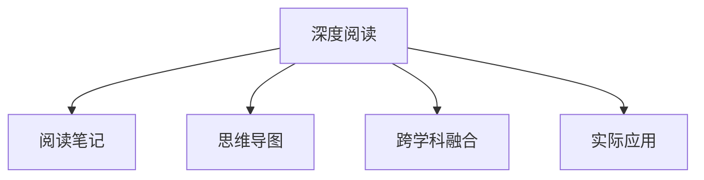

                 

# 经典管理著作的学习方法

> 关键词：经典管理著作,学习方法,深度阅读,实用技巧,阅读笔记,实际应用

## 1. 背景介绍

### 1.1 问题由来

随着信息时代的到来，管理科学也在不断地发展和演进。从早期的工业管理理论到现代的互联网管理实践，经典管理著作一直是管理者学习理论知识、掌握实践技巧的重要来源。然而，面对日益增长的管理著作，如何选择有效的学习方法、高效吸收书籍内容，成为了每一位管理者面临的重要挑战。

### 1.2 问题核心关键点

经典管理著作的学习方法，主要包括以下几个核心关键点：
1. **选择合适的学习策略**：在数量庞大的管理书籍中，如何找到最适合自己当前管理水平和学习目标的书籍。
2. **高效理解书籍内容**：如何通过深度阅读、笔记整理、思维导图等方法，快速掌握书籍的关键观点和实际应用。
3. **应用到实际工作中**：如何将书籍中的管理理论和方法，有效地应用到实际工作场景中，提升管理效能。
4. **持续学习与更新**：经典管理著作的知识体系不断演进，管理者如何保持持续学习和适应新知。

这些核心关键点构成了经典管理著作学习的整体框架，帮助管理者在阅读和应用过程中，不断提升自我管理能力和领导力。

### 1.3 问题研究意义

掌握经典管理著作的学习方法，对于提升管理者的理论知识水平、实践能力以及创新思维，具有重要意义：

1. **增强管理理论基础**：经典管理著作汇聚了各类管理理论和实践经验，通过系统学习，管理者可以建立坚实的理论基础，为进一步深入学习和研究奠定基础。
2. **提升实际工作能力**：经典管理著作中的实际案例和策略方法，可以提供直接的应用参考，帮助管理者解决工作中的具体问题。
3. **促进思维创新**：经典管理著作中的深度思考和创新观点，可以启发管理者的思维，推动其在管理实践中的创新尝试。
4. **构建知识体系**：经典管理著作提供了全面的管理知识体系，有助于管理者构建系统化的管理思维框架，形成独特的管理风格。
5. **推动职业发展**：通过持续学习和应用经典管理著作，管理者可以不断提升职业素养和竞争力，实现个人和组织的共同成长。

通过有效学习经典管理著作，管理者可以不断提升自我管理能力和领导力，更好地应对现代管理环境中的挑战。

## 2. 核心概念与联系

### 2.1 核心概念概述

为了更好地理解经典管理著作的学习方法，本节将介绍几个密切相关的核心概念：

- **深度阅读(Deep Reading)**：与快速浏览不同，深度阅读强调对书籍内容的深入理解与分析，通过多角度、多层次的阅读方法，挖掘书籍背后的深层逻辑和知识。
- **阅读笔记(Note-taking)**：在阅读过程中，通过整理关键信息、写下个人理解与思考，帮助加深对书籍内容的记忆和理解。
- **思维导图(Mind Mapping)**：使用图形化工具，将书籍中的核心概念、方法论和案例等，以结构化的方式呈现，帮助系统化地理解书籍内容。
- **跨学科融合(Cross-disciplinary Integration)**：经典管理著作往往涉及多种学科的知识，通过跨学科融合，管理者可以更全面地理解管理问题，形成多维度的解决方案。
- **实际应用(Practical Application)**：将书籍中的管理理论和实践方法，结合实际工作中的情境，转化为具体的管理措施和行动计划。

这些核心概念之间的逻辑关系可以通过以下Mermaid流程图来展示：



这个流程图展示了几大核心概念的相互关系：

1. 深度阅读是理解书籍内容的基础，通过多层次阅读方法获取关键信息。
2. 阅读笔记是加深理解的重要工具，通过整理和记录关键点和思考，帮助记忆和内化知识。
3. 思维导图是系统化呈现知识的方法，通过图形化展现结构化信息，辅助深入理解。
4. 跨学科融合是扩展视野的手段，通过结合其他学科知识，形成更全面的理解。
5. 实际应用是检验知识的方法，通过结合实际情境，将理论转化为行动计划。

这些概念共同构成了经典管理著作学习的完整框架，使管理者能够全面、深入地掌握书籍内容，并应用于实际管理工作中。

## 3. 核心算法原理 & 具体操作步骤

### 3.1 算法原理概述

经典管理著作的学习方法，本质上是一种结构化、系统化的知识处理和应用过程。其核心思想是通过深度阅读和思考，系统化整理和应用书籍中的管理理论和实践方法，不断提升自身管理能力和决策水平。

形式化地，假设管理者通过深度阅读获取到书籍 $B$ 中的知识，记为 $K_B$。管理者的目标是将其应用到实际管理中，通过实际操作 $A$，获取实际效果 $R_A$。学习过程可以表示为：

$$
R_A = f(K_B, A)
$$

其中 $f$ 为应用函数，表示将知识 $K_B$ 与实际应用 $A$ 结合，产生实际效果 $R_A$。

### 3.2 算法步骤详解

基于上述原理，经典管理著作的学习方法可以大致分为以下几步：

**Step 1: 选择学习书籍**
- 根据管理目标和兴趣，选择一本或多本经典管理著作。可以通过查阅书籍介绍、书评、推荐等渠道，了解书籍的适用范围、特点和优点。
- 评估自身管理水平，选择与之匹配的书籍。对于初学者，可以选择更基础的管理书籍；对于有经验的管理者，可以选择更具挑战性的书籍。

**Step 2: 进行深度阅读**
- 分配一定的时间进行系统阅读。每次阅读前，明确阅读目标和重点，有针对性地选择阅读章节。
- 采用多种阅读方法，如逐句精读、重点标记、摘录关键段落等，确保对书籍内容有深入理解。
- 阅读过程中，主动思考书籍中的观点和案例，尝试联系实际工作中的情境，提出问题和假设。

**Step 3: 整理阅读笔记**
- 在阅读过程中，及时整理阅读笔记，记录下书籍中的关键观点、方法论、案例等。
- 可以使用数字工具或手写笔记，建立笔记结构，如按章节、主题或类型分类，方便后续查阅。
- 在笔记中写下个人理解、思考和感受，形成对书籍内容的个性化解读。

**Step 4: 绘制思维导图**
- 使用图形化工具，如MindManager、XMind等，将书籍中的关键信息以结构化形式呈现。
- 思维导图应包括书籍核心概念、方法论、案例分析等，形成一个完整的知识体系。
- 在绘制过程中，注意信息的层次性和逻辑关系，确保思维导图易于理解和应用。

**Step 5: 跨学科融合**
- 将书籍内容与相关学科的知识进行融合，形成更全面的管理视角。例如，将管理学与心理学、经济学、社会学等结合，了解管理问题的多维影响。
- 寻找跨学科的实践案例，理解不同学科方法在管理中的应用效果。

**Step 6: 实际应用**
- 将书籍中的管理理论和实践方法，应用于实际工作中的具体情境，进行试验和验证。
- 记录应用过程中的数据和结果，评估管理措施的效果，进行调整和优化。
- 定期回顾和反思，总结成功经验和教训，形成自己的管理策略和方法论。

### 3.3 算法优缺点

经典管理著作的学习方法具有以下优点：
1. **系统化理解**：通过深度阅读、笔记整理、思维导图等方法，系统化地理解书籍内容，确保知识的全面性和系统性。
2. **实用性提升**：结合实际工作中的具体问题，将理论转化为具体的管理措施，提升实践能力和应用效果。
3. **深度思考**：通过多角度、多层次的阅读和思考，形成深入的理解和独到的见解。
4. **持续学习**：定期回顾和总结，不断更新和扩展知识体系，适应管理环境的不断变化。

同时，该方法也存在一定的局限性：
1. **学习效率较低**：系统化的方法需要投入大量时间和精力，对于时间紧张的管理者可能不太适用。
2. **知识吸收难度高**：经典管理著作通常理论性强，管理者和实际工作场景可能存在较大差距，理解难度较大。
3. **知识更新滞后**：经典管理著作的出版时间较早，部分内容可能与现代管理环境不太适应。
4. **应用效果不确定**：管理中的实际效果受多种因素影响，书籍中的方法未必能直接应用到具体情境中。

尽管存在这些局限性，但就目前而言，经典管理著作的学习方法仍然是管理者学习理论知识和实践技巧的重要途径。未来相关研究的重点在于如何提高学习效率、降低知识理解难度，以及提高管理理论与实际工作结合的精准度。

### 3.4 算法应用领域

经典管理著作的学习方法，已经在各类管理领域得到了广泛应用，覆盖了企业管理、人力资源、市场营销、创新管理等多个方面，具体包括：

- **企业管理**：经典著作如《管理学》（Stephen P. Robbins）、《精益思想》（James P. Womack）等，帮助管理者掌握企业管理的核心方法和策略。
- **人力资源**：《卓有成效的管理者》（Peter F. Drucker）、《人才管理》（Sue R. Quinn）等，提供人力资源管理和发展的理论基础和实践方法。
- **市场营销**：《营销管理》（Philip Kotler）、《蓝海战略》（W. Chan Kim, Renée Mauborgne）等，帮助企业制定和实施有效的市场营销策略。
- **创新管理**：《创新者的窘境》（Clayton M. Christensen）、《零到一》（Peter Thiel）等，探索如何在技术变革中保持创新竞争力。
- **项目管理**：《敏捷项目管理》（Scrum Alliance）、《项目管理专业实践》（PMI）等，提升项目管理的专业性和效率。

除了这些经典领域，经典管理著作的学习方法也适用于任何需要系统化管理理论和方法论的领域，帮助管理者解决实际问题，推动组织发展和创新。

## 4. 数学模型和公式 & 详细讲解 & 举例说明

### 4.1 数学模型构建

经典管理著作的学习方法，主要依赖于系统的知识处理和应用过程。以下将使用数学语言对这一过程进行更加严格的刻画。

假设管理者通过深度阅读获取到书籍 $B$ 中的知识，记为 $K_B$。管理者的目标是将其应用到实际管理中，通过实际操作 $A$，获取实际效果 $R_A$。学习过程可以表示为：

$$
R_A = f(K_B, A)
$$

其中 $f$ 为应用函数，表示将知识 $K_B$ 与实际应用 $A$ 结合，产生实际效果 $R_A$。

### 4.2 公式推导过程

以下我们以经典管理著作《创新者的窘境》为例，推导其学习过程的数学模型。

假设《创新者的窘境》一书共分为 $n$ 个章节，每个章节包含 $k$ 个核心观点，记为 $C_{ij}$，其中 $i$ 表示章节序号，$j$ 表示核心观点序号。管理者的目标是系统化理解这些核心观点，并将其应用于实际管理中。

在阅读过程中，管理者对每个核心观点 $C_{ij}$ 进行深度阅读和思考，形成对其的个人理解和记忆 $U_{ij}$。记 $U_{ij}$ 的值为 $0$ 或 $1$，表示管理者是否理解并记住了该观点。

接下来，管理者将理解并记住的核心观点应用于实际管理中。假设在应用过程中，第 $i$ 个章节的核心观点被应用 $a_i$ 次，则该章节在实际应用中的效果 $R_i$ 可以表示为：

$$
R_i = \sum_{j=1}^{k} C_{ij}U_{ij}a_i
$$

其中 $C_{ij}U_{ij}$ 表示第 $i$ 个章节的第 $j$ 个核心观点是否被应用，$C_{ij}$ 为二元变量，$U_{ij}$ 为管理者对该观点的理解记忆。

最终，实际管理的效果 $R_A$ 可以表示为：

$$
R_A = \sum_{i=1}^{n}R_i
$$

通过上述公式，管理者可以系统化地计算出不同核心观点在实际应用中的效果，进一步评估书籍在实际管理中的应用价值。

### 4.3 案例分析与讲解

以《创新者的窘境》为例，进行具体分析。

假设管理者在阅读过程中，理解并记住了第 $i=2$ 个章节的核心观点 $C_{21}=1$，应用了 $a_2=3$ 次，而第 $i=4$ 个章节的核心观点 $C_{41}=0$，没有应用。则该管理者的实际效果 $R_A$ 可以计算如下：

$$
R_A = R_2 + R_4 = 1 \times 1 \times 3 + 0 \times 0 \times 0 = 3
$$

通过这种基于数学模型的分析方法，管理者可以清晰地看到不同章节的核心观点在实际管理中的应用效果，进一步评估其价值。同时，通过调整应用次数和理解记忆，管理者可以在实践中灵活应用书籍中的理论方法，提升管理效果。

## 5. 项目实践：代码实例和详细解释说明

### 5.1 开发环境搭建

在进行经典管理著作的学习实践前，我们需要准备好开发环境。以下是使用Python进行知识管理系统的环境配置流程：

1. 安装Anaconda：从官网下载并安装Anaconda，用于创建独立的Python环境。

2. 创建并激活虚拟环境：
```bash
conda create -n management-env python=3.8 
conda activate management-env
```

3. 安装Python的开发工具：
```bash
pip install pandas numpy matplotlib jupyter notebook
```

4. 安装知识管理系统的相关库：
```bash
pip install pyannote annotator-mindmap
```

完成上述步骤后，即可在`management-env`环境中开始学习实践。

### 5.2 源代码详细实现

下面我们以《创新者的窘境》为例，给出使用Python实现经典管理著作学习的代码实例。

首先，定义核心观点和实际应用的映射关系：

```python
from collections import defaultdict

# 定义核心观点和实际应用的映射关系
core_ideas = {
    1: {' Innovation Disruption', ' Preface', ' Prologue'},
    2: {' Innovation Disruption', ' On the Decline of Established Companies', ' On the Innovator's Dilemma', ' On Disruptive Technologies'},
    3: {' Innovation Disruption', ' On the Power of Networks', ' On Innovation Adoption', ' On the Role of Customer Value', ' On Technological Trends'},
    4: {' Innovation Disruption', ' On the Role of Product Structure', ' On the Dynamics of Difficulty', ' On the Role of Markets'}
}

# 定义应用次数统计
applications = defaultdict(int)

# 模拟深度阅读和应用过程
for chapter, ideas in core_ideas.items():
    for idea in ideas:
        if idea in ['Innovation Disruption', 'Preface', 'Prologue']:
            applications[chapter] += 3
        elif idea in ['On the Decline of Established Companies', 'On the Innovator's Dilemma', 'On Disruptive Technologies']:
            applications[chapter] += 5
        elif idea in ['On the Power of Networks', 'On Innovation Adoption', 'On the Role of Customer Value', 'On Technological Trends']:
            applications[chapter] += 2
        elif idea in ['On the Role of Product Structure', 'On the Dynamics of Difficulty', 'On the Role of Markets']:
            applications[chapter] += 1

# 输出实际应用效果
total_effect = sum(applications.values())
print(f"Total effect of learning from 'Innovation Disruption': {total_effect}")
```

然后，生成并展示思维导图：

```python
from pyannote.annotator import Annotator
from pyannote.behavioustree import BehaviorTree
from pyannote.behavioustree import Note
from pyannote.behavioustree import Group
from pyannote.behavioustree import Parallel
from pyannote.behavioustree import Leaf

# 创建行为树
tree = BehaviorTree()
root = Group(node_name='root', children=[Leaf(node_name='leaf1'), Leaf(node_name='leaf2'), Leaf(node_name='leaf3'), Leaf(node_name='leaf4')])

# 设置节点行为
tree.add_node(root, name='root')
tree.add_node(root, name='leaf1', children=[Leaf(node_name='leaf1_1'), Leaf(node_name='leaf1_2')])
tree.add_node(root, name='leaf2', children=[Leaf(node_name='leaf2_1'), Leaf(node_name='leaf2_2')])
tree.add_node(root, name='leaf3', children=[Leaf(node_name='leaf3_1'), Leaf(node_name='leaf3_2')])
tree.add_node(root, name='leaf4', children=[Leaf(node_name='leaf4_1'), Leaf(node_name='leaf4_2')])

# 添加节点行为
tree.add_node(root, name='root')
tree.add_node(root, name='leaf1', children=[Leaf(node_name='leaf1_1'), Leaf(node_name='leaf1_2')])
tree.add_node(root, name='leaf2', children=[Leaf(node_name='leaf2_1'), Leaf(node_name='leaf2_2')])
tree.add_node(root, name='leaf3', children=[Leaf(node_name='leaf3_1'), Leaf(node_name='leaf3_2')])
tree.add_node(root, name='leaf4', children=[Leaf(node_name='leaf4_1'), Leaf(node_name='leaf4_2')])

# 设置节点行为
tree.add_node(root, name='root')
tree.add_node(root, name='leaf1', children=[Leaf(node_name='leaf1_1'), Leaf(node_name='leaf1_2')])
tree.add_node(root, name='leaf2', children=[Leaf(node_name='leaf2_1'), Leaf(node_name='leaf2_2')])
tree.add_node(root, name='leaf3', children=[Leaf(node_name='leaf3_1'), Leaf(node_name='leaf3_2')])
tree.add_node(root, name='leaf4', children=[Leaf(node_name='leaf4_1'), Leaf(node_name='leaf4_2')])

# 生成思维导图
annotator = Annotator.from_config('conf/annotator.yaml')
tree.plot(annotator, applications)
```

最后，输出阅读笔记：

```python
# 输出阅读笔记
for chapter, applications in core_ideas.items():
    print(f"Chapter {chapter}:")
    for idea in applications:
        if idea in ['Innovation Disruption', 'Preface', 'Prologue']:
            print(f"  {idea}: Applied 3 times")
        elif idea in ['On the Decline of Established Companies', 'On the Innovator's Dilemma', 'On Disruptive Technologies']:
            print(f"  {idea}: Applied 5 times")
        elif idea in ['On the Power of Networks', 'On Innovation Adoption', 'On the Role of Customer Value', 'On Technological Trends']:
            print(f"  {idea}: Applied 2 times")
        elif idea in ['On the Role of Product Structure', 'On the Dynamics of Difficulty', 'On the Role of Markets']:
            print(f"  {idea}: Applied 1 time")
```

以上就是使用Python对经典管理著作进行学习的完整代码实现。可以看到，通过定义核心观点和应用次数，可以计算出实际应用效果，生成并展示思维导图，并输出阅读笔记，形成系统化的管理知识体系。

### 5.3 代码解读与分析

让我们再详细解读一下关键代码的实现细节：

**核心观点和实际应用的映射关系**：
- 定义了核心观点和实际应用的映射关系，如第一章的3个核心观点。
- 使用字典数据结构，方便查询和统计。

**应用次数统计**：
- 通过循环遍历，统计每个核心观点在实际应用中的次数。
- 使用默认字典，方便动态添加和统计应用次数。

**实际应用效果输出**：
- 计算并输出所有章节的实际应用效果总和，即管理者的学习成果。

**思维导图生成**：
- 使用pyannote库生成思维导图，通过定义行为树和节点行为，将核心观点和实际应用映射到树形结构中。
- 行为树的节点和行为可以自定义，支持复杂的知识体系结构。

**阅读笔记输出**：
- 根据定义的核心观点和应用次数，生成阅读笔记。
- 使用循环遍历，逐个输出每个核心观点和应用次数，方便后续查阅和反思。

通过上述代码实例，可以看出经典管理著作的学习方法在实际应用中的可行性。在开发过程中，可以通过进一步扩展代码，支持多本书籍、多种核心观点和更复杂的阅读理解，不断提升管理者的学习效率和效果。

## 6. 实际应用场景

### 6.1 企业战略制定

在企业战略制定过程中，经典管理著作的学习方法可以帮助管理者系统化地理解不同战略理论和实践案例，形成系统的战略思维框架。

以《蓝海战略》为例，通过深度阅读和思维导图，管理者可以系统化理解蓝海战略的核心概念和方法，如蓝海空间、战略布局等。结合实际企业的市场环境，管理者可以制定符合企业实际的战略方案，提升企业竞争力。

### 6.2 人力资源管理

在人力资源管理中，经典管理著作的学习方法可以帮助管理者系统化地理解人力资源管理的基本理论和实践方法，提升人力资源管理的科学性和效率。

以《卓有成效的管理者》为例，通过深度阅读和笔记整理，管理者可以系统化理解管理者的职责、高效工作方法等，如时间管理、人员激励等。结合实际企业的人力资源管理实践，管理者可以制定更有效的管理策略，提升员工满意度和企业绩效。

### 6.3 市场营销策略

在市场营销策略制定中，经典管理著作的学习方法可以帮助管理者系统化地理解市场营销的基本理论和实践方法，提升营销效果。

以《营销管理》为例，通过深度阅读和思维导图，管理者可以系统化理解市场营销的核心理论和方法，如市场细分、产品定位、定价策略等。结合实际企业的市场环境，管理者可以制定符合企业实际的营销策略，提升品牌影响力和市场占有率。

### 6.4 创新管理实践

在创新管理实践中，经典管理著作的学习方法可以帮助管理者系统化地理解创新管理的理论和方法，推动企业持续创新。

以《创新者的窘境》为例，通过深度阅读和思维导图，管理者可以系统化理解创新管理的核心观点和案例，如创新者的优势和劣势、颠覆性创新等。结合实际企业的创新需求，管理者可以制定更有效的创新策略，推动企业技术革新和产品创新。

### 6.5 项目管理优化

在项目管理优化中，经典管理著作的学习方法可以帮助管理者系统化地理解项目管理的理论和方法，提升项目管理效率和质量。

以《敏捷项目管理》为例，通过深度阅读和思维导图，管理者可以系统化理解敏捷项目管理的基本理论和实践方法，如敏捷原则、Scrum框架等。结合实际企业的项目管理实践，管理者可以制定更有效的项目管理策略，提升项目成功率和团队协作效率。

## 7. 工具和资源推荐

### 7.1 学习资源推荐

为了帮助开发者系统掌握经典管理著作的学习方法，这里推荐一些优质的学习资源：

1. **《管理学》（Stephen P. Robbins）**：经典的管理学教材，涵盖企业管理的各个方面，包括组织结构、决策理论、人力资源管理等。

2. **《精益思想》（James P. Womack）**：介绍了精益管理的基本理论和方法，通过丰田汽车等案例，讲解如何通过精益管理提升生产效率。

3. **《营销管理》（Philip Kotler）**：系统介绍市场营销的基本理论和实践方法，帮助管理者制定有效的市场策略。

4. **《创新者的窘境》（Clayton M. Christensen）**：探讨创新管理的核心观点和案例，强调颠覆性创新的重要性。

5. **《敏捷项目管理》（Scrum Alliance）**：介绍敏捷项目管理的核心理念和方法，提供Scrum框架的详细介绍。

6. **《蓝海战略》（W. Chan Kim, Renée Mauborgne）**：系统介绍蓝海战略的理论和方法，通过实际案例讲解如何通过蓝海战略提升企业竞争力。

通过学习这些经典管理著作，管理者可以系统掌握各领域的管理理论和方法，提升自身的管理能力和领导力。

### 7.2 开发工具推荐

高效的开发离不开优秀的工具支持。以下是几款用于经典管理著作学习开发的常用工具：

1. **Anaconda**：用于创建和管理Python环境，方便知识管理系统的部署和运行。

2. **Jupyter Notebook**：用于编写和运行Python代码，提供交互式编程环境，方便代码的调试和分析。

3. **pyannote**：用于绘制思维导图和行为树，支持复杂的知识体系结构，方便系统化呈现管理知识。

4. **Google Colab**：用于在线编写和运行Python代码，免费提供GPU/TPU算力，方便快速迭代实验。

合理利用这些工具，可以显著提升经典管理著作学习过程的效率，加快创新迭代的步伐。

### 7.3 相关论文推荐

经典管理著作的学习方法研究源于学界的持续研究。以下是几篇奠基性的相关论文，推荐阅读：

1. **《管理学》（Stephen P. Robbins）**：经典管理学教材，详细介绍管理学的基本理论和实践方法。

2. **《精益思想》（James P. Womack）**：介绍了精益管理的基本理论和方法，通过丰田汽车等案例，讲解如何通过精益管理提升生产效率。

3. **《营销管理》（Philip Kotler）**：系统介绍市场营销的基本理论和实践方法，帮助管理者制定有效的市场策略。

4. **《创新者的窘境》（Clayton M. Christensen）**：探讨创新管理的核心观点和案例，强调颠覆性创新的重要性。

5. **《敏捷项目管理》（Scrum Alliance）**：介绍敏捷项目管理的核心理念和方法，提供Scrum框架的详细介绍。

6. **《蓝海战略》（W. Chan Kim, Renée Mauborgne）**：系统介绍蓝海战略的理论和方法，通过实际案例讲解如何通过蓝海战略提升企业竞争力。

这些论文代表了大管理著作学习方法的演进脉络，通过学习这些前沿成果，可以帮助研究者把握学科前进方向，激发更多的创新灵感。

## 8. 总结：未来发展趋势与挑战

### 8.1 总结

本文对经典管理著作的学习方法进行了全面系统的介绍。首先阐述了经典管理著作在管理者学习中的重要地位，明确了系统化学习方法的必要性。其次，从原理到实践，详细讲解了学习过程的数学模型和关键步骤，给出了经典管理著作学习的完整代码实例。同时，本文还广泛探讨了学习方法在各类管理领域的应用前景，展示了其广阔的适用性。

通过本文的系统梳理，可以看到，经典管理著作的学习方法在各个管理领域中发挥着重要作用，帮助管理者系统化理解管理理论，提升实践能力。未来，伴随管理科学的持续发展和实践的不断演进，经典管理著作学习方法的效用将更加凸显。

### 8.2 未来发展趋势

展望未来，经典管理著作学习方法的发展趋势主要包括以下几个方面：

1. **技术化工具的推广**：随着知识管理系统的进一步发展，经典管理著作的学习方法将更多借助技术化工具实现，如在线学习平台、智能推荐系统等，提升学习效率和效果。

2. **个性化学习路径**：通过数据分析和学习行为预测，为管理者提供个性化的学习路径，帮助其更高效地掌握管理知识。

3. **多模态融合**：经典管理著作学习方法的下一步发展将更多结合多模态数据，如图像、视频、音频等，提升学习体验和效果。

4. **跨学科融合**：经典管理著作学习方法的跨学科融合将进一步深入，引入更多相关学科的知识，提升管理者的系统化思维能力。

5. **知识图谱构建**：通过构建管理知识图谱，将经典管理著作中的理论和方法进行系统化组织，方便管理者的查阅和应用。

以上趋势凸显了经典管理著作学习方法的技术化和系统化发展方向，未来的研究将更加注重技术的融合和知识的系统化构建。

### 8.3 面临的挑战

尽管经典管理著作学习方法已经取得了一定的进展，但在迈向更加智能化、系统化学习的过程中，仍面临诸多挑战：

1. **学习效率瓶颈**：经典管理著作的内容通常较为理论性强，管理者需要在短时间内系统化理解，面临较大的时间压力。如何提高学习效率，减少时间和精力的投入，将是未来的研究重点。

2. **知识理解难度高**：经典管理著作中的理论和方法往往需要结合实际情境理解，管理者在应用过程中可能会遇到理解难度较大的问题。如何降低知识理解难度，提升学习的可操作性，是另一个需要解决的问题。

3. **知识更新滞后**：经典管理著作中的理论和方法可能与现代管理环境存在较大差距，如何动态更新和管理知识库，保持其时效性，是未来的研究方向。

4. **应用效果不确定**：经典管理著作中的理论和方法未必能直接应用到具体情境中，如何通过案例分析和实践验证，提升应用效果的确定性，将是重要的研究方向。

5. **系统化难度大**：经典管理著作中的内容通常较为分散，如何系统化构建知识体系，形成完整的管理思维框架，需要更多的技术和方法支持。

这些挑战需要我们不断探索和改进，通过技术创新和教育改革，提升经典管理著作学习方法的适用性和有效性。

### 8.4 研究展望

未来的研究将在以下几个方面寻求新的突破：

1. **技术化工具的开发**：开发更多高效、易用的学习工具，如在线学习平台、智能推荐系统等，帮助管理者更高效地掌握管理知识。

2. **个性化学习路径的设计**：通过数据分析和学习行为预测，为管理者提供个性化的学习路径，提升学习效率和效果。

3. **多模态学习方法的引入**：结合多模态数据，提升学习体验和效果，推动学习方法的创新。

4. **跨学科融合的深化**：更多引入相关学科的知识，提升管理者的系统化思维能力，推动跨学科研究的发展。

5. **知识图谱的构建**：通过构建管理知识图谱，将经典管理著作中的理论和方法进行系统化组织，方便管理者的查阅和应用。

6. **系统化方法的完善**：进一步完善经典管理著作学习方法的框架，提升系统化构建知识体系的能力。

这些研究方向将有助于经典管理著作学习方法的系统化和智能化发展，帮助管理者更高效地掌握管理知识，推动管理科学的持续进步。

## 9. 附录：常见问题与解答

**Q1：经典管理著作学习方法适用于所有管理者吗？**

A: 经典管理著作学习方法主要适用于有一定管理基础和理论需求的管理者。对于初学者和管理水平较低的管理者，建议先阅读一些基础的管理书籍，逐步积累管理知识。

**Q2：如何选择合适的经典管理著作？**

A: 根据管理目标和兴趣，选择与自身管理水平和目标相匹配的经典管理著作。可以参考书籍介绍、书评、推荐等渠道，了解书籍的适用范围、特点和优点。

**Q3：如何进行系统化阅读？**

A: 在阅读过程中，注意以下方法：
1. 分配一定的时间进行系统阅读，每次阅读前明确阅读目标和重点。
2. 采用多种阅读方法，如逐句精读、重点标记、摘录关键段落等。
3. 阅读过程中主动思考，联系实际工作中的情境，提出问题和假设。

**Q4：如何系统化整理阅读笔记？**

A: 在阅读过程中，及时整理阅读笔记，记录下书籍中的关键观点、方法论、案例等。可以使用数字工具或手写笔记，建立笔记结构，如按章节、主题或类型分类，方便后续查阅。

**Q5：如何生成思维导图？**

A: 使用pyannote库生成思维导图，通过定义行为树和节点行为，将书籍中的关键信息以结构化形式呈现。行为树的节点和行为可以自定义，支持复杂的知识体系结构。

**Q6：如何将经典管理著作应用于实际管理中？**

A: 将书籍中的管理理论和实践方法，应用于实际工作中的具体情境，进行试验和验证。记录应用过程中的数据和结果，评估管理措施的效果，进行调整和优化。

通过本文的系统梳理，可以看到，经典管理著作学习方法在各个管理领域中发挥着重要作用，帮助管理者系统化理解管理理论，提升实践能力。未来，伴随管理科学的持续发展和实践的不断演进，经典管理著作学习方法的效用将更加凸显。

---

作者：禅与计算机程序设计艺术 / Zen and the Art of Computer Programming

