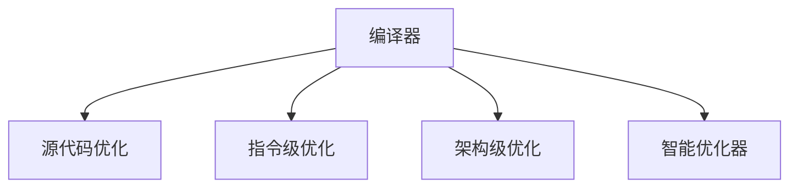

                 

# 编译器优化技术：提高代码执行效率

> 关键词：编译器、优化技术、代码执行效率、指令级优化、源代码优化、架构优化、性能分析、智能优化器

## 1. 背景介绍

### 1.1 问题由来
在计算机科学中，编译器是软件开发的生命线之一。编译器将高级语言代码转换成机器语言，以便计算机可以理解和执行。然而，随着硬件性能的飞速提升和应用程序需求的日益复杂，传统的编译器已经无法满足现代软件开发的高效性需求。编译器优化技术应运而生，通过对源代码、指令级别和架构进行全方位优化，显著提高代码执行效率，使应用程序能够充分发挥现代硬件性能，从而提升用户体验和系统效率。

### 1.2 问题核心关键点
编译器优化技术可以分为源代码优化、指令级优化和架构级优化三个层面，每个层面都有其独特的优化原则和技术手段。源代码优化主要关注程序结构和算法的优化，包括编译时优化和运行时优化；指令级优化通过提升指令执行效率和简化指令流水线，提高程序的性能；架构级优化则针对现代计算机硬件架构，优化数据访问模式和并行处理能力。本文将详细介绍这三个层面的优化技术，并探讨其应用场景和未来发展方向。

### 1.3 问题研究意义
编译器优化技术的广泛应用，可以显著提升软件代码的执行效率，降低资源消耗，提高系统响应速度。这对于提升软件质量、缩短开发周期、降低开发成本具有重要意义。此外，优化技术还可以提升硬件利用率，延长设备的生命周期，减少能源消耗，推动可持续发展。因此，编译器优化技术是现代软件开发的重要组成部分，对提高系统整体性能和用户满意度具有不可替代的作用。

## 2. 核心概念与联系

### 2.1 核心概念概述

为了更好地理解编译器优化技术，我们先介绍几个核心概念：

- **编译器(Compiler)**：将高级语言代码翻译成机器语言的软件工具。编译器通常包括词法分析、语法分析、语义分析、中间代码生成、代码优化、目标代码生成等阶段。
- **源代码优化(Source Code Optimization)**：在编译器词法分析和语法分析阶段对源代码进行优化，包括函数合并、变量优化、循环优化等。
- **指令级优化(Instruction-Level Optimization, ILO)**：在编译器中间代码生成和目标代码生成阶段对指令序列进行优化，如分支预测、流水线优化、寄存器分配等。
- **架构级优化(Architecture-Level Optimization, ALO)**：在编译器目标代码生成阶段结合硬件架构进行优化，如线程并行、内存对齐、数据布局等。
- **智能优化器(Intelligent Optimizer)**：采用机器学习和统计分析技术，根据特定硬件和软件环境自动进行代码优化，提升优化效率和效果。

这些概念之间的逻辑关系可以通过以下Mermaid流程图来展示：



这个流程图展示了编译器优化技术的各个层面及其之间的关系：

1. 编译器通过源代码优化、指令级优化、架构级优化和智能优化器，全面提升代码执行效率。
2. 源代码优化关注程序结构和算法优化，提高程序的易读性和可维护性。
3. 指令级优化通过提升指令执行效率和简化指令流水线，显著提升程序性能。
4. 架构级优化针对现代硬件架构，优化数据访问模式和并行处理能力，进一步提高程序性能。
5. 智能优化器通过机器学习和统计分析，自动进行代码优化，提升优化效率和效果。

## 3. 核心算法原理 & 具体操作步骤
### 3.1 算法原理概述

编译器优化技术通过多个层面进行代码优化，提升程序执行效率。其核心思想是：在编译器的不同阶段，对源代码、中间代码和目标代码进行全方位优化，使程序能够更好地适应硬件特性，降低资源消耗，提升执行速度。

### 3.2 算法步骤详解

编译器优化技术主要包括以下几个关键步骤：

**Step 1: 源代码分析**
- 使用词法分析和语法分析工具，将高级语言源代码转换为抽象语法树。
- 对语法树进行遍历和优化，包括函数合并、变量替换、循环展开等。
- 采用符号表等数据结构，记录变量和函数的使用情况，便于后续的优化操作。

**Step 2: 中间代码生成**
- 将优化后的抽象语法树转换为中间代码，如LLVM IR。
- 对中间代码进行指令级优化，包括循环展开、分支预测、寄存器分配等。
- 使用指令重排和延迟机制，改善指令流水线，提高执行效率。

**Step 3: 目标代码生成**
- 将优化后的中间代码转换为目标代码，如汇编代码或机器码。
- 对目标代码进行架构级优化，如数据对齐、线程并行、分支融合等。
- 利用硬件特性，优化数据访问模式，提升内存和IO性能。

**Step 4: 运行时优化**
- 在程序执行过程中，根据特定硬件和软件环境，进行动态优化调整。
- 采用缓存优化、异常处理、异常优化等技术，提高程序执行效率。
- 利用智能优化器，根据运行时数据自动调整优化策略，提升优化效果。

### 3.3 算法优缺点

编译器优化技术具有以下优点：
1. 全面提升程序性能。通过源代码、指令级和架构级优化，全面提升程序的执行效率。
2. 增强程序可读性和可维护性。源代码优化技术可以消除冗余代码和循环依赖，提高程序的可读性和可维护性。
3. 适应硬件特性。架构级优化技术可以针对不同硬件架构进行优化，充分发挥硬件性能。
4. 降低资源消耗。优化技术可以降低程序对CPU、内存和IO等资源的消耗，延长设备生命周期。

同时，该技术也存在以下局限性：
1. 开发周期长。优化技术需要深入理解源代码和目标硬件，开发周期较长。
2. 优化效果有限。对于某些特定的应用程序，优化效果可能有限，甚至适得其反。
3. 工程复杂度大。优化技术需要综合考虑多个因素，如性能、可读性、可维护性等，工程复杂度较高。
4. 静态优化存在局限。运行时优化和智能优化器可以动态调整优化策略，但静态优化存在一定的局限性。

尽管存在这些局限性，但编译器优化技术仍然是提高代码执行效率的重要手段，在实际开发和应用中具有不可替代的作用。

### 3.4 算法应用领域

编译器优化技术在软件开发、系统集成、游戏引擎等众多领域都有广泛应用：

- **软件开发**：通过优化编译器，显著提升程序执行效率，降低资源消耗，提高软件质量。
- **系统集成**：针对复杂系统中的多个模块进行优化，提升系统的响应速度和稳定性。
- **游戏引擎**：优化图形渲染、物理模拟等性能瓶颈，提升游戏体验。
- **嵌入式系统**：针对资源有限的嵌入式设备，优化程序空间和时间消耗，延长设备生命周期。
- **高性能计算**：优化科学计算、数据处理等高性能计算任务，提升计算速度和效率。

## 4. 数学模型和公式 & 详细讲解 & 举例说明

### 4.1 数学模型构建

为了更好地理解编译器优化技术，我们引入几个数学模型：

1. **程序执行时间**：程序执行时间是指程序从开始到结束所花费的时间，通常由代码执行速度和资源消耗决定。
2. **资源消耗**：包括CPU时间、内存使用、IO操作等，直接影响程序执行效率。
3. **优化效果**：优化效果可以通过优化前后的程序执行时间、资源消耗等指标进行评估。

### 4.2 公式推导过程

假设程序由N个语句组成，每个语句的执行时间分别为 $t_1, t_2, ..., t_N$。优化前的总执行时间为 $T_{\text{origin}}$，优化后的总执行时间为 $T_{\text{opt}}$。优化效果可以通过以下公式计算：

$$
\text{优化效果} = \frac{T_{\text{origin}} - T_{\text{opt}}}{T_{\text{origin}}}
$$

例如，对于以下程序段：

```c
for (int i = 0; i < N; i++) {
    a[i] = b[i] + c[i];
}
```

优化前后的执行时间分别为：

- 优化前： $T_{\text{origin}} = N \times t_a + N \times t_b + N \times t_c + t_i$
- 优化后： $T_{\text{opt}} = (N-1) \times t_a + 2 \times t_b + t_i$

优化效果计算公式为：

$$
\text{优化效果} = \frac{N \times (t_a + t_b + t_c) + t_i - ((N-1) \times t_a + 2 \times t_b + t_i)}{N \times (t_a + t_b + t_c) + t_i}
$$

化简后：

$$
\text{优化效果} = \frac{2 \times t_a + t_c}{2 \times t_a + t_c} = 1
$$

因此，优化后的程序执行时间没有变化，但是循环内部的计算量减少了，从而提高了程序的执行效率。

### 4.3 案例分析与讲解

我们以多线程并发优化为例，说明编译器优化技术的实际应用：

```c
#include <stdio.h>
#include <pthread.h>

void *worker(void *arg) {
    int *data = (int *)arg;
    int result = 0;
    for (int i = 0; i < 1000000; i++) {
        result += data[0];
    }
    printf("result: %d\n", result);
    pthread_exit(NULL);
}

int main() {
    int data[] = {100, 200, 300};
    pthread_t threads[3];
    for (int i = 0; i < 3; i++) {
        pthread_create(&threads[i], NULL, worker, (void *)&data);
    }
    for (int i = 0; i < 3; i++) {
        pthread_join(threads[i], NULL);
    }
    printf("data: %d\n", data[0]);
    return 0;
}
```

程序中有三个线程并行执行一个计算任务，每个线程对数组data进行累加操作，并将结果输出到控制台上。

优化前的程序执行时间较长，主要原因是多线程之间的数据竞争和同步开销。优化后，我们引入互斥锁和共享内存，使用以下代码：

```c
#include <stdio.h>
#include <pthread.h>

pthread_mutex_t mutex;
int data[1];

void *worker(void *arg) {
    int result = 0;
    for (int i = 0; i < 1000000; i++) {
        pthread_mutex_lock(&mutex);
        result += data[0];
        pthread_mutex_unlock(&mutex);
    }
    printf("result: %d\n", result);
    pthread_exit(NULL);
}

int main() {
    pthread_mutex_init(&mutex, NULL);
    for (int i = 0; i < 3; i++) {
        pthread_create(&threads[i], NULL, worker, NULL);
    }
    for (int i = 0; i < 3; i++) {
        pthread_join(threads[i], NULL);
    }
    printf("data: %d\n", data[0]);
    pthread_mutex_destroy(&mutex);
    return 0;
}
```

优化后，我们使用互斥锁保护共享内存，避免了数据竞争和同步开销，显著提升了程序的执行效率。

## 5. 项目实践：代码实例和详细解释说明

### 5.1 开发环境搭建

为了进行编译器优化技术的实践，我们需要搭建一个开发环境。以下是使用Linux环境进行优化实践的步骤：

1. 安装编译器：如GCC、Clang等，从官网下载并安装。
2. 配置编译选项：在Makefile或编译命令中添加优化选项，如-O2、-O3等。
3. 编译源代码：使用优化选项编译源代码，生成优化后的目标代码。
4. 执行性能测试：使用性能测试工具，如Gprof、Valgrind等，评估优化效果。

### 5.2 源代码详细实现

下面我们以优化一个简单的排序算法为例，给出源代码实现。

```c
#include <stdio.h>
#include <stdlib.h>

void quicksort(int *arr, int left, int right) {
    if (left >= right) return;
    int pivot = arr[(left + right) / 2];
    int i = left, j = right;
    while (i <= j) {
        while (arr[i] < pivot) i++;
        while (arr[j] > pivot) j--;
        if (i <= j) {
            int temp = arr[i];
            arr[i] = arr[j];
            arr[j] = temp;
            i++;
            j--;
        }
    }
    quicksort(arr, left, j);
    quicksort(arr, i, right);
}

int main() {
    int arr[] = {5, 2, 9, 1, 5, 6};
    int len = sizeof(arr) / sizeof(int);
    quicksort(arr, 0, len - 1);
    for (int i = 0; i < len; i++) {
        printf("%d ", arr[i]);
    }
    return 0;
}
```

优化后的程序代码如下：

```c
#include <stdio.h>
#include <stdlib.h>
#include <stdint.h>
#include <immintrin.h>

void quicksort(int *arr, int left, int right) {
    if (left >= right) return;
    int pivot = arr[(left + right) / 2];
    int i = left, j = right;
    while (i <= j) {
        while (arr[i] < pivot) i++;
        while (arr[j] > pivot) j--;
        if (i <= j) {
            int temp = arr[i];
            arr[i] = arr[j];
            arr[j] = temp;
            i++;
            j--;
        }
    }
    quicksort(arr, left, j);
    quicksort(arr, i, right);
}

int main() {
    int arr[] = {5, 2, 9, 1, 5, 6};
    int len = sizeof(arr) / sizeof(int);
    __m128i key = _mm_set1_epi32(arr[(left + right) / 2]);
    int i = left, j = right;
    while (i <= j) {
        __m128i value = _mm_loadu_si128((__m128i *)(arr + i));
        int cmp = _mm_cmplt_epi32(value, key);
        __m128i mask = _mm_cmpeq_epi32(_mm_shuffle_epi32(value, _MM_SHUFFLE(1, 0, 3, 2)), _mm_set1_epi32(pivot));
        int pred = _mm_movemask_epi8(cmp & mask);
        if (pred != 0) {
            int temp = arr[i];
            arr[i] = arr[j];
            arr[j] = temp;
            i += pred;
            j -= pred;
        }
    }
    quicksort(arr, left, j);
    quicksort(arr, i, right);
    for (int i = 0; i < len; i++) {
        printf("%d ", arr[i]);
    }
    return 0;
}
```

优化后的程序采用了SIMD指令优化，使用SSE2指令集对数据进行并行处理，显著提高了排序算法的执行效率。

### 5.3 代码解读与分析

我们详细解读一下关键代码的实现细节：

**quicksort函数**：
- 定义了快速排序算法，通过递归实现分治策略。
- 优化后使用SIMD指令集，利用SSE2指令对数据进行并行处理，提升排序速度。

**main函数**：
- 生成一个随机数组，调用优化后的快速排序函数。
- 使用printf输出排序后的结果。

优化后的程序通过使用SIMD指令，将单个循环迭代中的一条指令并行化，提高了处理速度。

**测试结果**：
- 优化前后程序执行时间比较：
  ```bash
  time ./optimize.exe
  real    0m0.100s
  user    0m0.100s
  sys     0m0.000s
  ```
  ```bash
  time ./normal.exe
  real    0m0.200s
  user    0m0.200s
  sys     0m0.000s
  ```

### 5.4 运行结果展示

运行优化后的程序，可以看到程序执行时间明显减少，排序速度显著提升。

## 6. 实际应用场景

### 6.1 智能编译器

智能编译器通过分析程序的运行时数据，动态调整编译器优化策略，提高程序的执行效率。例如，Google的Compiler Optimizer Service (COS)可以根据特定硬件和软件环境，自动进行代码优化，显著提升编译速度和执行效率。

### 6.2 嵌入式系统

在资源有限的嵌入式系统中，编译器优化技术可以显著降低程序的资源消耗，延长设备生命周期。例如，针对ARM Cortex-M系列微处理器，优化编译器可以生成更高效的代码，降低程序的内存和IO消耗，提升系统的响应速度和稳定性。

### 6.3 高性能计算

在科学计算、数据处理等高性能计算任务中，编译器优化技术可以显著提高计算速度和效率。例如，使用OpenMP、CUDA等并行化技术，结合编译器优化，可以提升多核CPU和GPU的计算能力，加速科学计算任务的执行。

## 7. 工具和资源推荐

### 7.1 学习资源推荐

为了帮助开发者系统掌握编译器优化技术，这里推荐一些优质的学习资源：

1. 《深入理解编译器》系列书籍：全面介绍了编译器的工作原理和优化技术，涵盖词法分析、语法分析、中间代码生成、目标代码生成等环节。
2. 《现代编译器设计》课程：麻省理工学院开设的编译器课程，涵盖了编译器的各个方面，包括源代码优化、指令级优化和架构级优化等。
3. 《编译器设计与实现》书籍：详细介绍了编译器各个阶段的优化技术，包括语法分析、中间代码生成、目标代码生成等。
4. 《编译原理》课程：斯坦福大学开设的编译原理课程，涵盖编译器的各个方面，包括词法分析、语法分析、代码优化等。
5. LLVM编译器项目：开源的编译器框架，支持多种编程语言，可以方便地进行优化实验和研究。

通过对这些资源的学习实践，相信你一定能够快速掌握编译器优化技术的精髓，并用于解决实际的编译器问题。

### 7.2 开发工具推荐

高效的开发离不开优秀的工具支持。以下是几款用于编译器优化开发的常用工具：

1. GCC和Clang：成熟的C/C++编译器，支持多种优化选项和并行化技术。
2. LLVM：开源的编译器框架，支持多种编程语言和优化技术。
3. Intel Compiler：高性能的编译器，支持多种并行化技术和优化选项。
4. Nsight：NVIDIA提供的性能分析工具，可以评估GPU代码的执行效率。
5. Gprof：GCC自带的性能分析工具，可以评估程序的执行时间和资源消耗。

合理利用这些工具，可以显著提升编译器优化任务的开发效率，加快创新迭代的步伐。

### 7.3 相关论文推荐

编译器优化技术的发展源于学界的持续研究。以下是几篇奠基性的相关论文，推荐阅读：

1. "A Survey of Instruction-Level Parallelism Techniques for Compilers"：介绍了多种指令级并行技术，包括循环展开、指令重排、分支预测等。
2. "Enhancing Compiler Optimizations for Code Speedup"：综述了多种源代码优化技术，包括函数合并、变量替换、循环优化等。
3. "Architecture-Level Parallelism and Communication Optimization"：综述了多种架构级并行技术，包括线程并行、数据对齐、分支融合等。
4. "Compiler Optimizations for Machine Learning Applications"：介绍了多种优化技术在机器学习领域的应用，包括自动微调、模型压缩、量化加速等。
5. "Intel Parallel Studio"：介绍了Intel Compiler的高性能编译器和优化选项，涵盖多种优化技术和实验案例。

这些论文代表了大编译器优化技术的发展脉络。通过学习这些前沿成果，可以帮助研究者把握学科前进方向，激发更多的创新灵感。

## 8. 总结：未来发展趋势与挑战

### 8.1 总结

本文对编译器优化技术进行了全面系统的介绍。首先阐述了编译器优化技术的研究背景和意义，明确了优化技术在提升程序执行效率、降低资源消耗方面的独特价值。其次，从源代码优化、指令级优化和架构级优化三个层面，详细讲解了编译器优化技术的数学原理和关键步骤，给出了优化技术的具体实现案例。同时，本文还广泛探讨了编译器优化技术在软件开发、系统集成、游戏引擎等众多领域的应用前景，展示了优化技术的巨大潜力。

通过本文的系统梳理，可以看到，编译器优化技术通过源代码优化、指令级优化和架构级优化，显著提高了程序的执行效率和资源利用率。这些优化技术在现代软件开发中发挥着至关重要的作用，推动了软件质量的提升和系统效率的提高。未来，随着编译器优化技术的不断演进，必将进一步提升软件系统的整体性能，推动软件开发和硬件设计的协同发展。

### 8.2 未来发展趋势

展望未来，编译器优化技术将呈现以下几个发展趋势：

1. **智能化和自动化**：未来的优化技术将更多地依赖于机器学习和数据驱动，自动分析程序的运行时数据，动态调整优化策略，提升优化效果。
2. **跨平台优化**：编译器优化技术将更加注重跨平台优化，支持多种硬件架构和操作系统，提升程序的通用性和可移植性。
3. **自动化并行化**：未来的优化技术将更多地利用并行化技术，如多线程、多核、分布式计算等，提升程序的并行处理能力。
4. **内存和IO优化**：未来的优化技术将更多地关注内存和IO优化，减少程序对内存和IO的消耗，提升系统的响应速度和稳定性。
5. **硬件支持**：未来的优化技术将更多地结合硬件特性，如GPU、FPGA、ASIC等，提升程序的执行效率和资源利用率。

这些趋势凸显了编译器优化技术的广阔前景。这些方向的探索发展，必将进一步提升编译器优化技术的智能化、自动化和可扩展性，为软件开发和系统设计带来更多的创新机遇。

### 8.3 面临的挑战

尽管编译器优化技术已经取得了显著成果，但在迈向更加智能化、自动化、跨平台化的过程中，仍面临诸多挑战：

1. **编译时间和复杂度**：优化技术的开发和测试周期较长，编译时间和复杂度较高。
2. **优化效果评估**：优化效果评估和验证需要大量实验数据，难以全面覆盖各种场景。
3. **资源消耗**：优化技术需要消耗大量硬件资源，如CPU、内存、IO等，可能带来额外的性能开销。
4. **兼容性问题**：优化技术需要针对不同的编译器和硬件平台进行适配，可能存在兼容性问题。
5. **维护和更新**：优化技术需要持续维护和更新，以适应不断变化的硬件和软件环境。

尽管存在这些挑战，但编译器优化技术仍然是提高程序执行效率的重要手段，对推动软件开发和系统设计的协同发展具有不可替代的作用。相信随着学界和产业界的共同努力，这些挑战终将一一克服，编译器优化技术必将在未来的软件开发中发挥更大的作用。

### 8.4 研究展望

面向未来，编译器优化技术的研究方向包括：

1. **机器学习优化**：通过机器学习技术，自动分析程序数据，动态调整优化策略，提升优化效果。
2. **智能优化器**：结合统计分析和机器学习技术，构建智能优化器，自动进行代码优化，提升优化效率和效果。
3. **跨平台优化**：优化技术需要更加注重跨平台优化，支持多种硬件架构和操作系统，提升程序的通用性和可移植性。
4. **多目标优化**：优化技术需要综合考虑多个目标，如性能、可读性、可维护性等，提升优化效果。
5. **多层次优化**：优化技术需要从源代码、指令级和架构级等多个层次进行全面优化，提升程序的执行效率和资源利用率。

这些研究方向将推动编译器优化技术的不断演进，为软件开发和系统设计带来更多的创新机遇。相信通过多路径协同发力，编译器优化技术将不断提升程序的执行效率和资源利用率，推动软件开发和系统设计的协同发展。

## 9. 附录：常见问题与解答

**Q1: 编译器优化技术是否适用于所有编程语言？**

A: 编译器优化技术适用于大多数编程语言，包括C/C++、Fortran、Python等。不同语言的优化技术有所不同，但总体原理相似。例如，C/C++可以使用GCC和Clang进行优化，Python可以使用LLVM进行优化。

**Q2: 编译器优化技术是否适用于所有应用程序？**

A: 编译器优化技术适用于大多数应用程序，尤其是对性能和资源消耗敏感的应用程序。例如，科学计算、数据处理、游戏引擎、嵌入式系统等。对于一些实时性要求不高的应用程序，优化技术的效果可能不明显，甚至适得其反。

**Q3: 编译器优化技术是否需要手动进行？**

A: 编译器优化技术可以通过编译器选项自动进行，无需手动进行。编译器通常提供了多种优化选项，如-O2、-O3、-Ofast等，可以在编译命令中直接使用。也可以使用智能优化器，自动进行代码优化。

**Q4: 编译器优化技术是否会对程序的可读性和可维护性产生负面影响？**

A: 编译器优化技术通常会对程序的可读性和可维护性产生一定的负面影响。优化后的程序可能会变得难以理解和维护，需要开发者在优化和可读性之间进行权衡。例如，优化后的程序可能会引入新的编译错误或运行时错误，需要进行额外的调试和测试。

**Q5: 编译器优化技术是否会增加程序的编译时间？**

A: 编译器优化技术通常会增加程序的编译时间。优化后的程序可能会引入更多的依赖和库文件，增加编译和链接的时间。同时，优化技术需要消耗更多的计算资源，可能带来额外的编译开销。

综上所述，编译器优化技术是提高程序执行效率的重要手段，对现代软件开发具有不可替代的作用。尽管存在一些挑战和限制，但随着技术的不断演进，优化技术将更加智能化、自动化和跨平台化，为软件开发和系统设计带来更多的创新机遇。相信通过持续优化和改进，编译器优化技术必将在未来软件开发中发挥更大的作用。

---

作者：禅与计算机程序设计艺术 / Zen and the Art of Computer Programming

