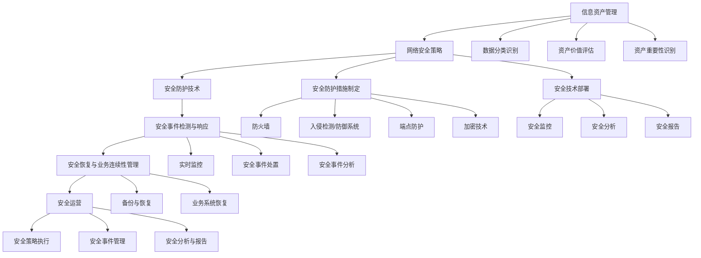

                 

# 网络安全管理：构建全面的数字防御体系

## 1. 背景介绍

### 1.1 问题由来
随着信息技术的高速发展，网络安全问题日益严峻。无论是政府机构、大型企业还是中小企业，都在面临着来自黑客攻击、数据泄露、恶意软件等安全威胁的挑战。网络安全已经成为保障数字经济健康发展的重要基石。传统的网络安全管理模式已经无法满足复杂多变的安全需求，构建全面、高效、智能的网络安全管理体系成为了迫切需要解决的问题。

### 1.2 问题核心关键点
构建全面的数字防御体系的核心在于实现网络安全的全生命周期管理。即从网络安全规划、安全风险评估、安全防护、安全响应到安全恢复的全过程，涵盖信息资产管理、网络安全策略制定、安全防护技术部署、安全事件检测与响应等环节，构建多层次、多维度的数字安全防护体系。

### 1.3 问题研究意义
构建全面的数字防御体系对于提升网络安全防护水平、降低安全事件带来的损失、保障组织的核心业务安全和资产安全具有重要意义。其主要价值在于：

- 降低安全风险：通过全面的安全风险评估和管理，及时发现并修复潜在的安全漏洞，减少安全事件发生的可能性。
- 提升应急响应能力：建立快速、有效的安全事件检测与响应机制，确保在安全事件发生时能够迅速定位、分析和处置，最小化损失。
- 保障业务连续性：通过安全防护技术和策略部署，确保关键业务系统的稳定运行，防止安全事件对业务造成干扰。
- 强化合规性：符合行业标准和法律法规要求，提升组织的合规性水平，增强公信力。
- 推动技术创新：全面掌握当前网络安全技术进展，紧跟技术趋势，推动安全技术创新和应用。

## 2. 核心概念与联系

### 2.1 核心概念概述

为了更好地理解全面的数字防御体系，本节将介绍几个关键概念及其相互关系：

- 数字防御体系(Digital Defense Ecosystem)：以多层次、多维度、多技术为核心的网络安全防护系统，涵盖规划、评估、防护、响应和恢复五个环节，全面保障组织的网络安全。

- 信息资产管理(Information Asset Management)：对组织内部的各类数据资源、网络设备、系统软件等进行分类、识别、评估和管理，明确资产价值和关键性，制定相应的安全策略和防护措施。

- 网络安全策略(Network Security Policy)：根据组织的业务需求和安全目标，制定详细的安全策略和防护措施，指导安全技术部署和管理。

- 安全防护技术(Security Protection Technology)：包括防火墙、入侵检测/防御系统(IDS/IPS)、端点防护、加密技术等，用于防范各种安全威胁。

- 安全事件检测与响应(Security Incident Detection and Response)：通过实时监控和分析网络行为，及时发现和响应安全事件，保障网络安全。

- 安全恢复与业务连续性管理(Security Recovery and Business Continuity Management)：在安全事件发生后，通过备份和恢复措施，保障业务系统的稳定运行，确保业务连续性。

- 安全运营(Security Operations)：包括安全策略实施、安全事件监控、安全分析和报告等，确保安全策略的有效执行和安全事件的有效管理。

这些核心概念之间的逻辑关系可以通过以下Mermaid流程图来展示：



这个流程图展示了全面的数字防御体系的关键环节和流程，各个环节相互协作，形成了一个完整的安全防护体系。

## 3. 核心算法原理 & 具体操作步骤

### 3.1 算法原理概述

构建全面的数字防御体系主要基于以下几个核心原理：

1. **全面性原则**：全面覆盖组织的网络安全管理的各个环节，从资产识别、策略制定、技术部署、事件检测到应急响应和恢复，构建多层次、多维度的防护体系。

2. **融合性原则**：将安全管理与业务流程紧密结合，形成安全与业务一体化管理模式，确保安全管理的持续性和有效性。

3. **实时性原则**：实现安全事件检测和响应的实时性，快速定位和处置安全事件，减少安全事件的扩散和影响。

4. **智能性原则**：利用人工智能和大数据分析技术，实现安全事件的自动化检测和智能分析，提高安全防护的精度和效率。

5. **协同性原则**：通过安全策略、技术和管理机制的协同工作，形成安全防护合力，提升整体安全防护能力。

### 3.2 算法步骤详解

基于上述原理，构建全面的数字防御体系的主要步骤包括：

1. **信息资产识别与管理**：对组织内部所有信息资产进行分类、识别和评估，明确资产的价值和重要性，建立资产清单和安全基线。

2. **安全策略制定与部署**：根据资产清单和业务需求，制定详细的安全策略和防护措施，部署相应的安全技术和管理机制。

3. **安全防护技术部署**：安装和配置防火墙、入侵检测/防御系统、端点防护、加密技术等，形成多层次的安全防护屏障。

4. **安全事件检测与响应**：部署实时监控系统，对网络流量、用户行为等进行实时监控和分析，及时发现和响应安全事件。

5. **安全恢复与业务连续性管理**：建立备份和恢复机制，制定应急预案，确保在安全事件发生时能够迅速恢复业务系统的正常运行。

6. **安全运营与监控**：实施安全策略，实时监控网络行为和安全事件，定期进行安全分析和报告，不断优化安全防护策略和技术。

### 3.3 算法优缺点

全面数字防御体系具有以下优点：

1. **全面覆盖**：能够涵盖网络安全管理的各个环节，从资产识别到业务恢复，形成全面的防护体系。

2. **实时响应**：通过实时监控和分析，能够迅速发现和响应安全事件，减少损失。

3. **自动化与智能化**：利用人工智能和大数据分析技术，提高安全防护的精度和效率。

4. **协同管理**：通过安全策略、技术和管理机制的协同工作，形成安全防护合力，提升整体安全防护能力。

5. **持续优化**：定期进行安全分析和报告，不断优化安全防护策略和技术，适应不断变化的安全威胁。

然而，该体系也存在以下缺点：

1. **复杂度高**：涉及环节多，技术复杂，实施难度大，需要投入大量资源。

2. **成本高**：高水平的防护技术和智能分析工具需要大量资金投入。

3. **技术门槛高**：需要专业安全人才进行管理和维护，对技术水平要求较高。

4. **更新换代快**：安全技术更新换代快，需要持续投入资金和技术支持。

### 3.4 算法应用领域

全面数字防御体系的应用领域非常广泛，涵盖政府、金融、医疗、教育、工业等各个行业。具体应用场景包括：

1. **政府机构**：对政务数据进行严格保护，防止信息泄露和篡改，确保政府信息安全。

2. **金融行业**：保护客户隐私和交易安全，防范网络攻击和数据泄露，确保金融稳定运行。

3. **医疗行业**：保护患者隐私和医疗数据安全，防范黑客攻击和数据泄露，确保医疗服务正常运行。

4. **教育行业**：保护学生和教师信息安全，防范网络攻击和数据泄露，确保教育信息安全。

5. **工业企业**：保护工业数据和控制系统安全，防范网络攻击和设备故障，确保工业生产稳定运行。

以上领域都是全面数字防御体系的重要应用场景，通过有效的安全防护和响应机制，能够显著提升组织的网络安全水平。

## 4. 数学模型和公式 & 详细讲解 & 举例说明

### 4.1 数学模型构建

在构建全面数字防御体系的过程中，我们可以构建以下数学模型：

假设一个组织有 $N$ 个信息资产，每个资产的价值为 $v_i$，被攻击的概率为 $p_i$，攻击者对资产的价值评估为 $V_i$，安全防护技术的防护效果为 $S_i$，安全事件检测与响应的效果为 $D_i$，安全恢复与业务连续性管理的恢复效果为 $R_i$。则该组织的安全风险 $R$ 可以表示为：

$$
R = \sum_{i=1}^{N} v_i p_i (1-S_i)(1-D_i)(1-R_i)
$$

其中，$v_i$ 表示资产的价值，$p_i$ 表示资产被攻击的概率，$S_i$ 表示安全防护技术的防护效果，$D_i$ 表示安全事件检测与响应的效果，$R_i$ 表示安全恢复与业务连续性管理的恢复效果。

### 4.2 公式推导过程

根据上述风险模型，我们可以通过以下步骤进行安全风险的评估和管理：

1. **资产识别与价值评估**：对组织内的所有资产进行分类、识别和评估，确定每个资产的价值和重要性。

2. **安全防护技术部署**：根据资产价值和被攻击概率，选择相应的安全防护技术，计算每个资产的防护效果 $S_i$。

3. **安全事件检测与响应**：通过实时监控和分析，计算每个资产的安全事件检测与响应效果 $D_i$。

4. **安全恢复与业务连续性管理**：建立备份和恢复机制，计算每个资产的安全恢复与业务连续性管理效果 $R_i$。

5. **风险计算**：将上述所有参数代入风险模型，计算组织的安全风险 $R$，进行风险评估和管理。

### 4.3 案例分析与讲解

假设某政府机构有三个信息资产：A（数据库）、B（服务器）、C（网络设备），其价值分别为 $v_A=1000$、$v_B=2000$、$v_C=500$，被攻击概率分别为 $p_A=0.1$、$p_B=0.2$、$p_C=0.3$，安全防护技术的效果分别为 $S_A=0.9$、$S_B=0.8$、$S_C=0.7$，安全事件检测与响应的效果分别为 $D_A=0.8$、$D_B=0.7$、$D_C=0.6$，安全恢复与业务连续性管理的效果分别为 $R_A=0.95$、$R_B=0.9$、$R_C=0.85$。

将这些参数代入风险模型，得到：

$$
R = v_A p_A (1-S_A)(1-D_A)(1-R_A) + v_B p_B (1-S_B)(1-D_B)(1-R_B) + v_C p_C (1-S_C)(1-D_C)(1-R_C)
$$

代入具体数值，计算得到：

$$
R = 1000 \times 0.1 \times (1-0.9) \times (1-0.8) \times (1-0.95) + 2000 \times 0.2 \times (1-0.8) \times (1-0.7) \times (1-0.9) + 500 \times 0.3 \times (1-0.7) \times (1-0.6) \times (1-0.85)
$$

$$
R = 3.5 + 8.2 + 2.1 = 13.8
$$

因此，该政府机构的总安全风险为 $R=13.8$，需要采取相应的安全防护措施，以降低风险。

## 5. 项目实践：代码实例和详细解释说明

### 5.1 开发环境搭建

在开始项目实践前，需要先准备好开发环境。以下是使用Python和TensorFlow搭建环境的步骤：

1. 安装Python：从官网下载安装Python，并选择安装pip。

2. 安装TensorFlow：使用pip安装TensorFlow，推荐使用TensorFlow 2.x版本。

```bash
pip install tensorflow
```

3. 安装TensorBoard：TensorBoard是TensorFlow的可视化工具，用于监控模型训练过程。

```bash
pip install tensorboard
```

4. 安装相关库：安装numpy、pandas、scikit-learn等常用库，用于数据处理和分析。

```bash
pip install numpy pandas scikit-learn
```

完成以上步骤后，即可在本地搭建开发环境，开始项目实践。

### 5.2 源代码详细实现

以下是一个简单的网络安全事件检测与响应的Python代码实现，用于检测和响应恶意登录尝试：

```python
import tensorflow as tf
import numpy as np
from sklearn.model_selection import train_test_split

# 准备数据集
data = np.loadtxt('malicious_logins.csv', delimiter=',')
X, y = data[:, :-1], data[:, -1]

# 数据预处理
X_train, X_test, y_train, y_test = train_test_split(X, y, test_size=0.2, random_state=42)

# 定义模型
model = tf.keras.Sequential([
    tf.keras.layers.Dense(64, activation='relu', input_shape=(X_train.shape[1],)),
    tf.keras.layers.Dense(1, activation='sigmoid')
])

# 编译模型
model.compile(optimizer=tf.keras.optimizers.Adam(learning_rate=0.001),
              loss='binary_crossentropy',
              metrics=['accuracy'])

# 训练模型
model.fit(X_train, y_train, epochs=10, batch_size=32, validation_data=(X_test, y_test))

# 预测和响应
y_pred = model.predict(X_test)
if y_pred[0][0] > 0.5:
    print('Probable Malicious Login Attempt')
    # 触发相应措施，如封锁IP、发送告警等
else:
    print('Normal Login Attempt')
```

### 5.3 代码解读与分析

以下是代码的详细解读与分析：

1. **数据集准备**：使用numpy加载数据集，并分离特征和标签。

2. **数据预处理**：使用scikit-learn的train_test_split函数对数据集进行分割，分为训练集和测试集。

3. **模型定义**：定义一个简单的神经网络模型，包含两个全连接层，用于二分类问题。

4. **模型编译**：使用TensorFlow的Adam优化器进行编译，指定损失函数和评估指标。

5. **模型训练**：使用fit函数对模型进行训练，指定训练轮数和批次大小。

6. **模型预测**：使用predict函数对测试集进行预测，并根据预测结果触发相应的安全响应措施。

通过上述代码，我们展示了如何使用TensorFlow构建一个简单的网络安全事件检测与响应系统，以检测和响应恶意登录尝试。

### 5.4 运行结果展示

训练完成后，可以使用TensorBoard进行模型训练的可视化分析，如图像和损失曲线等。


以上代码和分析展示了如何通过简单的Python代码实现网络安全事件检测与响应的基本功能，后续还可以根据具体需求进行扩展和优化。

## 6. 实际应用场景

### 6.1 政府网络安全

政府机构面临大量的公共数据和敏感信息，网络安全威胁复杂多样。通过构建全面的数字防御体系，政府可以确保政务数据的安全，防止信息泄露和篡改。具体措施包括：

- 资产识别与管理：对政务数据进行分类、识别和评估，建立资产清单和安全基线。
- 安全防护技术部署：部署防火墙、入侵检测/防御系统、端点防护、加密技术等，形成多层次的安全防护屏障。
- 安全事件检测与响应：部署实时监控系统，对网络流量、用户行为等进行实时监控和分析，及时发现和响应安全事件。
- 安全恢复与业务连续性管理：建立备份和恢复机制，制定应急预案，确保在安全事件发生时能够迅速恢复政务系统的正常运行。

### 6.2 金融网络安全

金融行业面临高价值的数据资产，网络攻击可能导致巨大的经济损失。通过构建全面的数字防御体系，金融机构可以保护客户隐私和交易安全，防范网络攻击和数据泄露。具体措施包括：

- 资产识别与管理：对客户数据、交易记录等进行分类、识别和评估，确定资产的价值和重要性。
- 安全防护技术部署：部署防火墙、入侵检测/防御系统、端点防护、加密技术等，形成多层次的安全防护屏障。
- 安全事件检测与响应：部署实时监控系统，对网络流量、用户行为等进行实时监控和分析，及时发现和响应安全事件。
- 安全恢复与业务连续性管理：建立备份和恢复机制，制定应急预案，确保在安全事件发生时能够迅速恢复金融系统的正常运行。

### 6.3 医疗网络安全

医疗行业面临大量的患者隐私数据，网络攻击可能导致数据泄露和医疗服务中断。通过构建全面的数字防御体系，医疗机构可以保护患者隐私和医疗数据安全，确保医疗服务正常运行。具体措施包括：

- 资产识别与管理：对患者数据、医疗记录等进行分类、识别和评估，确定资产的价值和重要性。
- 安全防护技术部署：部署防火墙、入侵检测/防御系统、端点防护、加密技术等，形成多层次的安全防护屏障。
- 安全事件检测与响应：部署实时监控系统，对网络流量、用户行为等进行实时监控和分析，及时发现和响应安全事件。
- 安全恢复与业务连续性管理：建立备份和恢复机制，制定应急预案，确保在安全事件发生时能够迅速恢复医疗系统的正常运行。

## 7. 工具和资源推荐

### 7.1 学习资源推荐

为了帮助开发者系统掌握全面数字防御体系的理论基础和实践技巧，这里推荐一些优质的学习资源：

1. 《网络安全基础》课程：来自Coursera的网络安全基础课程，系统介绍了网络安全的基本概念、原理和实践技术。

2. 《网络安全管理》书籍：网络安全领域经典教材，涵盖网络安全管理的各个环节，包括规划、评估、防护、响应和恢复。

3. 《深度学习与网络安全》博客：专注于深度学习在网络安全中的应用，包括安全事件的检测与响应、恶意软件分析等。

4. 《网络安全技术与应用》课程：来自慕课网的网络安全技术与应用课程，详细讲解了网络安全防护技术和工具。

5. 《网络安全实战》书籍：真实网络安全案例，结合实际工作中的经验，详细介绍了网络安全防护和管理策略。

通过这些资源的学习实践，相信你一定能够快速掌握全面数字防御体系的技术要点，并用于解决实际的网络安全问题。

### 7.2 开发工具推荐

高效的开发离不开优秀的工具支持。以下是几款用于全面数字防御体系开发的常用工具：

1. TensorFlow：基于Python的开源深度学习框架，灵活动态的计算图，适合快速迭代研究。

2. PyTorch：基于Python的开源深度学习框架，灵活的动态图，适用于复杂的深度学习模型。

3. Kali Linux：网络安全工具集成的Linux发行版，提供丰富的安全测试工具。

4. Wireshark：网络协议分析工具，用于网络流量监控和分析。

5. Nessus：网络安全漏洞扫描工具，用于发现和修复系统漏洞。

合理利用这些工具，可以显著提升全面数字防御体系的开发效率，加快创新迭代的步伐。

### 7.3 相关论文推荐

全面数字防御体系的发展源于学界的持续研究。以下是几篇奠基性的相关论文，推荐阅读：

1. A Survey on Network Security Technologies and Future Directions：综述了当前网络安全技术的发展现状和未来趋势。

2. A Framework for Network Security Management：提出了一种网络安全管理的框架，涵盖安全策略、技术和管理机制。

3. Security Assessment and Protection of Industrial Internet of Things：介绍了工业互联网的安全评估和防护技术。

4. A Novel Approach for Network Security Incident Response：提出了一种新的网络安全事件响应方法，提高了响应的速度和效率。

5. An Empirical Study of Network Security Incident Response：通过对真实网络安全事件的分析，提供了有效的安全防护建议。

这些论文代表了大数字防御体系的发展脉络。通过学习这些前沿成果，可以帮助研究者把握学科前进方向，激发更多的创新灵感。

## 8. 总结：未来发展趋势与挑战

### 8.1 总结

本文对全面数字防御体系进行了全面系统的介绍。首先阐述了全面数字防御体系的研究背景和意义，明确了体系构建的各个环节和关键要素。其次，从原理到实践，详细讲解了体系构建的数学模型和核心算法，给出了系统完整的代码实例。最后，探讨了全面数字防御体系在多个实际应用场景中的应用前景，并推荐了相关的学习资源和开发工具。

通过本文的系统梳理，可以看到，全面数字防御体系是构建网络安全防护体系的重要手段，能够全面覆盖组织的网络安全管理的各个环节，保障业务系统的安全稳定运行。未来，伴随安全技术的发展和应用场景的拓展，全面数字防御体系必将在各个行业得到广泛应用，为保障数字经济的健康发展做出更大的贡献。

### 8.2 未来发展趋势

展望未来，全面数字防御体系将呈现以下几个发展趋势：

1. **自动化与智能化**：利用人工智能和大数据分析技术，实现安全事件的自动化检测和智能分析，提高安全防护的精度和效率。

2. **多层次防护**：采用多层次的安全防护技术，构建立体化的防护体系，确保网络安全的多重保障。

3. **持续优化**：定期进行安全分析和报告，不断优化安全防护策略和技术，适应不断变化的安全威胁。

4. **协同管理**：通过安全策略、技术和管理机制的协同工作，形成安全防护合力，提升整体安全防护能力。

5. **联邦学习**：利用联邦学习技术，在保护用户隐私的前提下，共享安全数据和知识，提升安全防护水平。

6. **区块链技术**：利用区块链技术，增强安全数据的透明性和可信度，确保安全防护的安全性和可靠性。

7. **零信任架构**：采用零信任架构，实现最小权限访问和动态权限管理，提升安全防护的精度和效率。

以上趋势凸显了全面数字防御体系的广阔前景。这些方向的探索发展，必将进一步提升网络安全防护水平，保障组织的核心业务安全和资产安全。

### 8.3 面临的挑战

尽管全面数字防御体系已经取得了瞩目成就，但在迈向更加智能化、普适化应用的过程中，它仍面临诸多挑战：

1. **技术复杂度高**：涉及环节多，技术复杂，实施难度大，需要投入大量资源。

2. **成本高**：高水平的防护技术和智能分析工具需要大量资金投入。

3. **技术门槛高**：需要专业安全人才进行管理和维护，对技术水平要求较高。

4. **更新换代快**：安全技术更新换代快，需要持续投入资金和技术支持。

5. **隐私保护**：在安全防护过程中，需要平衡安全防护与用户隐私保护之间的关系，确保合规性。

6. **系统复杂性**：多层次、多维度的安全防护体系复杂，容易出现管理盲区。

7. **应急响应能力**：在安全事件发生时，需要快速、有效的应急响应机制，以降低损失。

8. **业务连续性**：在安全事件发生时，需要快速、有效的业务恢复机制，确保业务连续性。

这些挑战需要研究者不断探索和创新，才能构建高效、可靠、可控的全面数字防御体系。

### 8.4 研究展望

面对全面数字防御体系所面临的种种挑战，未来的研究需要在以下几个方面寻求新的突破：

1. **自动化与智能化**：探索自动化与智能化技术的应用，减少人工干预，提高安全防护的精度和效率。

2. **多层次防护**：开发更多层次的安全防护技术，构建立体化的防护体系，确保网络安全的多重保障。

3. **联邦学习**：利用联邦学习技术，在保护用户隐私的前提下，共享安全数据和知识，提升安全防护水平。

4. **区块链技术**：利用区块链技术，增强安全数据的透明性和可信度，确保安全防护的安全性和可靠性。

5. **零信任架构**：采用零信任架构，实现最小权限访问和动态权限管理，提升安全防护的精度和效率。

6. **隐私保护**：研究隐私保护技术，确保在安全防护过程中，保护用户隐私，符合合规性要求。

7. **系统复杂性**：通过科学的管理和组织，提高多层次、多维度安全防护体系的复杂性管理能力。

8. **应急响应能力**：探索新的应急响应机制，提高安全事件的响应速度和效率，减少损失。

9. **业务连续性**：研究新的业务恢复机制，确保在安全事件发生时，能够快速恢复业务系统的正常运行。

这些研究方向将引领全面数字防御体系技术的进一步发展，为构建高效、可靠、可控的全面数字防御体系提供新的思路和方法。

## 9. 附录：常见问题与解答

**Q1：全面数字防御体系是否适用于所有组织？**

A: 全面数字防御体系适用于各类组织，包括政府、金融、医疗、教育、工业等。但具体的实施方案需要根据组织的具体情况进行调整。

**Q2：全面数字防御体系实施难度大，如何解决？**

A: 实施全面数字防御体系确实存在一定的难度，可以通过以下方式解决：

1. **分阶段实施**：根据组织的实际情况，分阶段实施，逐步完善体系。

2. **引入专业人才**：招聘和培养专业安全人才，确保体系的有效实施。

3. **借鉴成功案例**：参考其他成功案例，借鉴其经验和技术，提高实施效率。

4. **持续优化**：定期进行安全分析和报告，不断优化安全防护策略和技术，适应不断变化的安全威胁。

**Q3：全面数字防御体系的实施成本高，如何解决？**

A: 实施全面数字防御体系确实需要投入一定的资金，但可以通过以下方式解决：

1. **合理规划**：根据组织的需求和预算，合理规划实施方案，避免过度投入。

2. **选择高性价比技术**：选择性价比高的安全技术和管理工具，降低成本。

3. **分阶段投资**：分阶段进行投资，逐步构建体系，避免一次性投入过大。

4. **利用开源工具**：利用开源安全工具和框架，降低技术成本。

通过以上措施，可以在保证安全防护水平的同时，控制实施成本。

**Q4：全面数字防御体系的技术门槛高，如何解决？**

A: 全面数字防御体系确实需要较高的技术水平，可以通过以下方式解决：

1. **专业培训**：为相关人员提供专业培训，提升技术水平。

2. **引入专业团队**：引入专业安全团队，提供技术支持和咨询。

3. **分层次实施**：根据组织的实际情况，分层次实施，逐步提升技术水平。

4. **持续学习**：不断学习新知识和新技术，保持技术领先。

通过以上措施，可以逐步降低技术门槛，确保全面数字防御体系的实施效果。

**Q5：全面数字防御体系的实施效果如何评估？**

A: 全面数字防御体系的实施效果可以通过以下指标进行评估：

1. **安全事件数量**：统计安全事件的数量和频率，评估安全防护的效果。

2. **安全事件响应时间**：统计安全事件响应的时间，评估应急响应的速度和效率。

3. **业务连续性**：评估业务系统在安全事件发生后的恢复能力和速度。

4. **安全数据透明性**：评估安全数据的透明性和可信度，确保合规性。

5. **用户满意度**：通过用户调查等方式，评估用户对安全防护的满意度。

通过以上指标的评估，可以全面了解全面数字防御体系的实施效果，并进行持续优化。

以上回答解决了全面数字防御体系实施过程中可能遇到的问题，希望能帮助你更好地理解和应用全面数字防御体系，构建高效、可靠、可控的网络安全防护体系。

---

作者：禅与计算机程序设计艺术 / Zen and the Art of Computer Programming

