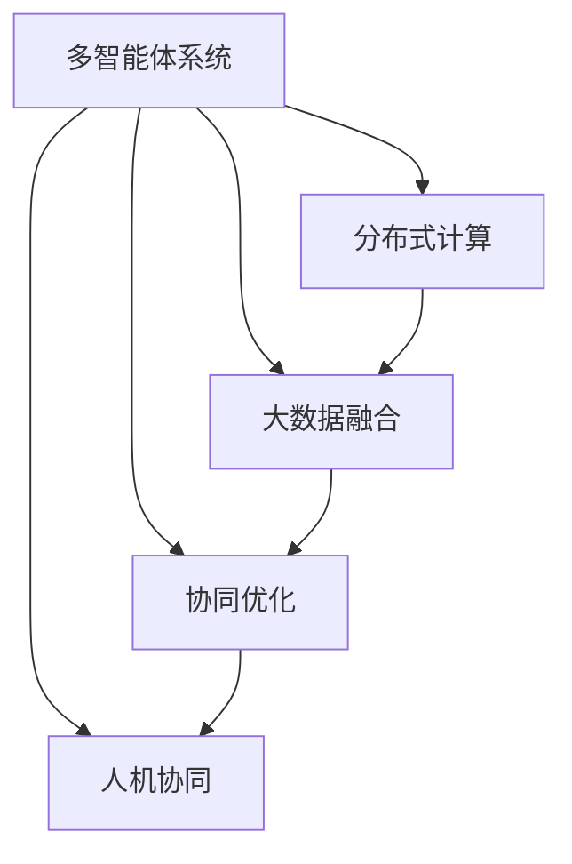
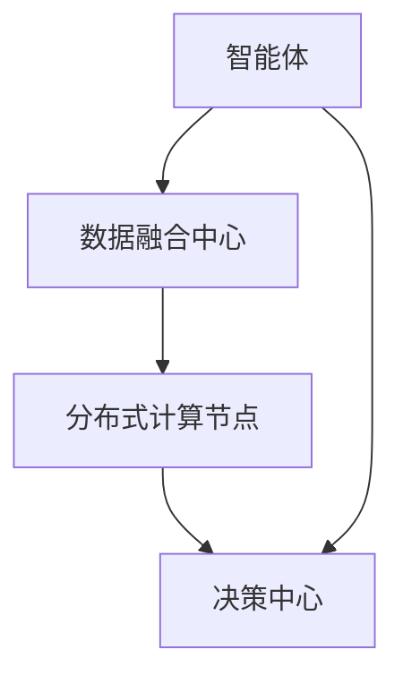

                 

# 群体智慧：决策的新引擎

> 关键词：群体智慧,分布式决策,协同计算,人工智能,大数据,多智能体系统

## 1. 背景介绍

### 1.1 问题由来

在现代社会，决策的复杂性和动态性使得传统中心化的决策机制面临诸多挑战。如何在复杂多变的条件下，快速高效地做出高质量决策，成为各行各业普遍关注的问题。群体智慧的概念应运而生，它倡导通过大规模分布式协同计算，融合多源数据和多智能体系统，提升决策的科学性和准确性。

群体智慧不仅仅是一种新的决策理念，更是一种利用先进信息技术实现的全局优化策略。它集成了人工智能、大数据、云计算等前沿技术，旨在通过分布式协同计算，优化决策过程，提高决策的效率和效果。

### 1.2 问题核心关键点

群体智慧的核心在于通过多智能体系统，实现分布式协同计算，从而优化决策过程。具体来说，群体智慧的关键点包括：

1. **多智能体系统**：构建由多个自主决策的智能体组成的系统，每个智能体负责特定子任务，协同合作完成整体决策。

2. **分布式计算**：利用云计算、边缘计算等技术，实现任务在多个节点上的分布式处理，提升计算效率和资源利用率。

3. **大数据融合**：融合海量异构数据，通过先进的数据挖掘和分析技术，提取有价值的信息，辅助决策。

4. **协同优化**：利用优化算法和游戏论等数学工具，在多个智能体之间实现协同优化，找到全局最优解。

5. **人机协同**：将人类专家知识和智能系统的计算能力相结合，形成混合决策机制，提高决策的可靠性和可行性。

### 1.3 问题研究意义

研究群体智慧及其在决策中的应用，对于提升决策质量和效率，推动经济社会可持续发展具有重要意义：

1. **提升决策质量**：通过分布式协同计算和多源数据的融合，实现全局优化，减少决策误差，提升决策的科学性和准确性。

2. **降低决策成本**：群体智慧技术能够自动处理大规模数据，减少人工干预，降低决策过程中的时间和人力成本。

3. **增强决策灵活性**：群体智慧系统能够动态调整决策策略，适应环境变化，提高决策的灵活性和应变能力。

4. **促进协作与创新**：群体智慧通过分布式协同计算，激发各智能体之间的创新合作，推动技术和管理方式的革新。

5. **支持智能城市**：群体智慧技术可应用于城市交通管理、环境保护、智慧医疗等多个领域，为智慧城市建设提供支撑。

## 2. 核心概念与联系

### 2.1 核心概念概述

为了更好地理解群体智慧及其在决策中的应用，我们首先需要介绍几个核心概念：

- **多智能体系统**：由多个自主决策的智能体组成的系统，每个智能体负责特定子任务，协同合作完成整体决策。

- **分布式计算**：利用云计算、边缘计算等技术，实现任务在多个节点上的分布式处理，提升计算效率和资源利用率。

- **大数据融合**：融合海量异构数据，通过先进的数据挖掘和分析技术，提取有价值的信息，辅助决策。

- **协同优化**：利用优化算法和游戏论等数学工具，在多个智能体之间实现协同优化，找到全局最优解。

- **人机协同**：将人类专家知识和智能系统的计算能力相结合，形成混合决策机制，提高决策的可靠性和可行性。

这些概念之间相互联系，共同构成了群体智慧决策的基础框架。以下我们将通过一个Mermaid流程图来展示这些概念之间的联系：



这个流程图展示了群体智慧决策框架中各概念之间的相互关系。每个智能体在分布式计算环境中，融合多源数据，协同优化决策，最终通过人机协同形成最终决策。

### 2.2 核心概念原理和架构的 Mermaid 流程图



此流程图展示了群体智慧决策的核心架构。智能体从数据融合中心获取多源数据，在分布式计算节点上进行处理，最终将结果传递给决策中心，形成决策。

## 3. 核心算法原理 & 具体操作步骤
### 3.1 算法原理概述

群体智慧决策的核心算法原理基于分布式协同计算和多智能体系统的协同优化。具体来说，群体智慧决策过程包括以下几个步骤：

1. **数据收集**：智能体从不同数据源收集多源异构数据，包括历史数据、实时数据、环境数据等。

2. **数据融合**：利用数据挖掘和融合技术，将多源数据整合并提取有价值的信息。

3. **分布式计算**：在分布式计算环境中，智能体将融合后的数据进行处理，生成决策所需的信息。

4. **协同优化**：多个智能体之间通过协同优化算法，找到全局最优决策。

5. **决策生成**：将协同优化结果反馈给智能体，生成最终决策。

### 3.2 算法步骤详解

下面我们将详细讲解群体智慧决策的具体操作步骤：

1. **初始化智能体**：定义智能体的结构和功能，设置各智能体的决策目标和行为策略。

2. **数据收集**：智能体从不同的数据源收集多源异构数据，包括历史数据、实时数据、环境数据等。

3. **数据融合**：利用数据挖掘和融合技术，将多源数据整合并提取有价值的信息，生成融合后的数据集。

4. **分布式计算**：在分布式计算环境中，智能体对融合后的数据进行处理，生成决策所需的信息。

5. **协同优化**：多个智能体之间通过协同优化算法，找到全局最优决策。

6. **决策生成**：将协同优化结果反馈给智能体，生成最终决策。

### 3.3 算法优缺点

群体智慧决策算法具有以下优点：

1. **分布式计算**：通过分布式计算，能够处理大规模数据，提升计算效率和资源利用率。

2. **协同优化**：通过协同优化算法，找到全局最优决策，提升决策的科学性和准确性。

3. **灵活性**：智能体可以根据环境变化动态调整决策策略，提高决策的灵活性和应变能力。

4. **可扩展性**：群体智慧决策系统具有良好的可扩展性，能够适应不同规模和复杂度的决策任务。

然而，群体智慧决策算法也存在以下缺点：

1. **数据融合复杂性**：多源数据融合过程复杂，需要高质量的数据和先进的数据挖掘技术。

2. **协同优化难度**：协同优化算法复杂，需要大量的计算资源和高级的数学工具。

3. **通信开销**：智能体之间的通信开销较大，可能导致网络延迟和带宽瓶颈。

4. **安全性问题**：群体智慧系统依赖于多智能体的协同合作，一旦某个智能体被攻击，系统可能遭受重大损失。

### 3.4 算法应用领域

群体智慧决策算法已经在多个领域得到了广泛应用，以下是几个典型的应用场景：

1. **智能城市**：应用于交通管理、环境保护、智慧医疗等多个领域，提升城市管理和服务的智能化水平。

2. **金融风险管理**：通过多智能体系统和大数据融合，实现风险预警和风险控制，提升金融决策的科学性和效率。

3. **工业生产**：应用于制造、能源、化工等多个行业，优化生产流程，提升生产效率和质量。

4. **公共卫生**：应用于疾病预测、疫苗接种等，提升公共卫生决策的准确性和及时性。

5. **能源管理**：应用于电网调度、可再生能源管理等，优化能源配置，提升能源利用效率。

## 4. 数学模型和公式 & 详细讲解 & 举例说明

### 4.1 数学模型构建

群体智慧决策算法的数学模型构建需要考虑多智能体之间的协同优化和多源数据的融合。以下我们将构建一个基于多智能体的协同优化模型。

假设智能体数量为 $N$，每个智能体 $i$ 的决策变量为 $x_i$，决策目标为 $f_i(x_i)$。智能体之间的交互关系为 $\Gamma$，目标函数为 $F(x)$，约束条件为 $G(x)$。

### 4.2 公式推导过程

以下是群体智慧决策模型的公式推导过程：

1. **目标函数**：智能体的协同优化目标函数为：

$$ F(x) = \sum_{i=1}^N f_i(x_i) $$

2. **约束条件**：智能体之间的交互关系为：

$$ \Gamma = \{ (i, j) \mid i \neq j, \quad f_i(x_i) \text{和} f_j(x_j) 相互依赖 \} $$

3. **优化算法**：利用分布式优化算法，求解如下优化问题：

$$ \min_{x \in \mathbb{R}^n} F(x) \quad \text{subject to} \quad G(x) \leq 0 $$

### 4.3 案例分析与讲解

假设有一个智能城市交通管理系统，目标是最小化交通拥堵程度和环境污染。智能体包括交通管理中心、环境监测中心、实时数据处理中心等。

目标函数为：

$$ F(x) = \min_{x \in \mathbb{R}^n} \left( \sum_{i=1}^N f_i(x_i) \right) $$

其中 $f_i(x_i)$ 为智能体 $i$ 的决策目标，包括交通流量、污染排放等。

约束条件为：

$$ G(x) = \left\{ \begin{array}{l}
    \sum_{i=1}^N x_i \leq C_{\text{total}} \\
    x_i \geq 0
\end{array} \right. $$

其中 $C_{\text{total}}$ 为总资源限制，$x_i$ 为智能体 $i$ 的决策变量。

通过分布式协同计算和多智能体系统的协同优化，可以实现交通流量和环境污染的最小化。

## 5. 项目实践：代码实例和详细解释说明

### 5.1 开发环境搭建

在进行群体智慧决策的实践开发之前，我们需要准备好开发环境。以下是使用Python进行分布式计算的开发环境配置流程：

1. **安装Anaconda**：从官网下载并安装Anaconda，用于创建独立的Python环境。

2. **创建并激活虚拟环境**：
```bash
conda create -n cluster-env python=3.8 
conda activate cluster-env
```

3. **安装必要的库**：
```bash
pip install numpy scipy pandas scikit-learn dask dask-distributed
```

4. **设置分布式计算环境**：
```bash
distributed --setup-use-threads --nthreads=1
```

5. **启动分布式计算服务**：
```bash
distributed -n 4 --processes-per-node 2 --local-scheduler
```

完成上述步骤后，即可在`cluster-env`环境中开始分布式计算实践。

### 5.2 源代码详细实现

下面我们将以智能城市交通管理系统为例，给出使用Dask库进行群体智慧决策的Python代码实现。

首先，定义目标函数和约束条件：

```python
import numpy as np
from scipy.optimize import minimize
from dask import dataframe as dd

def objective(x):
    return sum(f_i(x[i]) for i in range(len(x)))

def constraint(x):
    return sum(x[i] for i in range(len(x))) - C_total

# 假设智能体数量为N，每个智能体的决策变量为x_i
N = 5
x = np.random.rand(N)
C_total = 100

# 目标函数和约束条件
def f_i(x_i):
    return x_i + i * 0.1

def F(x):
    return objective(x)

def G(x):
    return constraint(x)
```

然后，定义分布式计算任务：

```python
# 分布式计算任务
ddf = dd.from_pandas(pd.DataFrame({'x': x}), npartitions=4)

# 定义分布式计算的逻辑
def distribute_calculation(x):
    ddf['x'] = ddf.map_partitions(constraint)
    return ddf.compute()[0]

# 并行计算
result = dask.delayed(distribute_calculation)(x)
```

最后，启动分布式计算，并求解优化问题：

```python
# 求解优化问题
result = minimize(F, x, method='SLSQP', constraints={'eq': (G, None)})

# 输出结果
print('Optimal x:', result.x)
print('Optimal F:', result.fun)
```

以上代码展示了使用Dask库进行分布式计算和优化问题的求解。可以看到，通过并行计算和分布式优化，可以高效地求解大规模群体智慧决策问题。

### 5.3 代码解读与分析

在上述代码中，我们使用了Dask库进行分布式计算。Dask是一个用于并行计算和分布式计算的Python库，可以高效处理大规模数据集和计算任务。

具体来说，我们通过Dask DataFrame实现了分布式数据处理，利用并行计算加速了目标函数和约束条件的求解过程。同时，我们使用了`distributed`库启动分布式计算环境，通过多个计算节点进行分布式计算。

在实际应用中，分布式计算环境的设置和优化需要根据具体的计算任务进行调整，以确保最优的计算效率和资源利用率。

## 6. 实际应用场景

### 6.1 智能城市

智能城市是群体智慧决策的重要应用场景之一。通过多智能体系统和分布式计算，可以实现城市管理的智能化和优化，提升城市服务和管理的效率和质量。

例如，在交通管理中，智能体可以包括交通管理中心、环境监测中心、实时数据处理中心等。通过协同优化，可以实现交通流量和环境污染的最小化，提升城市的交通效率和环境质量。

### 6.2 金融风险管理

金融风险管理是群体智慧决策的另一个重要应用场景。通过多智能体系统和分布式计算，可以实现风险预警和风险控制，提升金融决策的科学性和效率。

例如，在风险管理中，智能体可以包括市场分析中心、风险评估中心、实时数据处理中心等。通过协同优化，可以实现风险预警和风险控制，提升金融决策的准确性和及时性。

### 6.3 工业生产

工业生产是群体智慧决策的另一个重要应用场景。通过多智能体系统和分布式计算，可以实现生产流程的优化和生产效率的提升。

例如，在制造行业中，智能体可以包括生产线监控中心、质量检测中心、实时数据处理中心等。通过协同优化，可以实现生产流程的优化和生产效率的提升。

### 6.4 公共卫生

公共卫生是群体智慧决策的另一个重要应用场景。通过多智能体系统和分布式计算，可以实现疾病预测和疫苗接种，提升公共卫生决策的准确性和及时性。

例如，在公共卫生管理中，智能体可以包括疾病预测中心、疫苗接种中心、实时数据处理中心等。通过协同优化，可以实现疾病预测和疫苗接种，提升公共卫生决策的准确性和及时性。

## 7. 工具和资源推荐

### 7.1 学习资源推荐

为了帮助开发者系统掌握群体智慧决策的理论基础和实践技巧，这里推荐一些优质的学习资源：

1. **《群体智慧：分布式协同计算》系列博文**：由群体智慧专家撰写，深入浅出地介绍了群体智慧决策的基本概念和前沿研究。

2. **Coursera《分布式系统与计算》课程**：斯坦福大学开设的分布式计算课程，详细讲解了分布式系统的设计和管理，适合群体智慧决策的学习。

3. **《群体智慧与多智能体系统》书籍**：介绍了群体智慧和多智能体系统的基本理论和应用实例，适合理论学习和实践参考。

4. **GitHub上的分布式计算项目**：GitHub上有许多开源的分布式计算项目，提供了丰富的代码实现和文档支持，适合实践学习和参考。

通过这些资源的学习实践，相信你一定能够快速掌握群体智慧决策的精髓，并用于解决实际的决策问题。

### 7.2 开发工具推荐

高效的开发离不开优秀的工具支持。以下是几款用于群体智慧决策开发的常用工具：

1. **Dask**：用于并行计算和分布式计算的Python库，能够高效处理大规模数据集和计算任务。

2. **Apache Spark**：Apache基金会推出的分布式计算框架，支持大规模数据处理和机器学习，适合群体智慧决策的开发。

3. **TensorFlow**：由Google主导开发的深度学习框架，支持分布式计算和模型训练，适合群体智慧决策的应用。

4. **Distributed TensorFlow**：TensorFlow的分布式计算扩展，支持大规模分布式训练，适合群体智慧决策的实践。

5. **Distributed Python**：Python的分布式计算扩展，支持分布式数据处理和任务调度，适合群体智慧决策的开发。

这些工具能够显著提升群体智慧决策的开发效率，帮助开发者更好地应对大规模计算任务。

### 7.3 相关论文推荐

群体智慧决策的研究源于学界的持续研究。以下是几篇奠基性的相关论文，推荐阅读：

1. **《群体智慧：一种新型的分布式计算范式》**：由群体智慧领域的知名学者撰写，介绍了群体智慧决策的基本概念和应用实例。

2. **《分布式协同计算与多智能体系统》**：详细讲解了分布式计算和多智能体系统的基本原理和算法，适合理论学习和实践参考。

3. **《多智能体系统在金融风险管理中的应用》**：介绍多智能体系统在金融风险管理中的应用，展示了群体智慧决策的实际效果。

4. **《智能城市交通管理的群体智慧决策模型》**：介绍了智能城市交通管理中的群体智慧决策模型，展示了群体智慧决策的实际效果。

这些论文代表了大规模群体智慧决策的研究脉络。通过学习这些前沿成果，可以帮助研究者把握学科前进方向，激发更多的创新灵感。

## 8. 总结：未来发展趋势与挑战

### 8.1 总结

本文对群体智慧决策及其在实际应用中的实践进行了全面系统的介绍。首先阐述了群体智慧决策的背景和意义，明确了其在提升决策质量和效率方面的独特价值。其次，从原理到实践，详细讲解了群体智慧决策的数学模型和具体操作步骤，给出了群体智慧决策任务开发的完整代码实例。同时，本文还广泛探讨了群体智慧决策在智能城市、金融风险管理、工业生产等多个领域的应用前景，展示了群体智慧决策的巨大潜力。此外，本文精选了群体智慧决策的相关学习资源，力求为读者提供全方位的技术指引。

通过本文的系统梳理，可以看到，群体智慧决策通过分布式协同计算和多智能体系统的协同优化，能够有效提升决策的质量和效率。未来，伴随分布式计算和人工智能技术的持续演进，群体智慧决策将广泛应用于更多领域，为决策科学和社会治理提供有力支持。

### 8.2 未来发展趋势

展望未来，群体智慧决策技术将呈现以下几个发展趋势：

1. **自动化决策**：随着自动化决策技术的发展，群体智慧决策将逐步实现自动化，减少人工干预，提高决策效率和准确性。

2. **自适应决策**：群体智慧决策系统将具备自适应能力，能够根据环境变化动态调整决策策略，提升决策的灵活性和应变能力。

3. **智能推荐**：利用智能推荐算法，群体智慧决策系统能够更好地预测用户需求，提供个性化决策服务，提升用户体验。

4. **多模态融合**：将文本、图像、语音等多种模态的信息进行融合，提升决策的全面性和准确性。

5. **跨领域应用**：群体智慧决策系统将扩展到更多领域，如智慧医疗、智能交通、智慧教育等，为各行各业提供决策支持。

6. **伦理与安全**：随着群体智慧决策系统的广泛应用，如何在保护隐私和提升安全性的同时，保证决策的公正性和透明性，将成为重要研究方向。

以上趋势凸显了群体智慧决策技术的广阔前景。这些方向的探索发展，将进一步提升决策的科学性和可靠性，推动社会治理和决策的现代化。

### 8.3 面临的挑战

尽管群体智慧决策技术已经取得了瞩目成就，但在迈向更加智能化、普适化应用的过程中，它仍面临着诸多挑战：

1. **数据质量与隐私**：群体智慧决策系统依赖于高质量和多样的数据，如何获取和管理高可信度、高隐私的数据，是系统高效运行的前提。

2. **协同优化算法**：多智能体系统的协同优化算法复杂，需要大量的计算资源和高级的数学工具，如何优化算法，提升系统效率，是关键挑战。

3. **分布式计算效率**：分布式计算环境的设置和优化需要考虑网络延迟、带宽瓶颈等问题，如何提升计算效率和资源利用率，是实际应用中的难点。

4. **模型可解释性**：群体智慧决策系统的模型往往是"黑盒"系统，难以解释其内部工作机制和决策逻辑。如何在保证系统效果的同时，提高模型的可解释性，是重要研究方向。

5. **安全与隐私**：群体智慧决策系统涉及大量敏感数据，如何保护数据隐私和安全，避免数据泄露和攻击，是系统可靠运行的基础。

6. **人机协作**：如何设计合理的用户界面和交互方式，提升人机协作效率和用户体验，是系统设计的重要考虑因素。

这些挑战凸显了群体智慧决策技术在实际应用中的复杂性和多样性，需要从数据、算法、工程、管理等多个维度协同发力，才能真正实现决策的智能化和优化。

### 8.4 研究展望

面向未来，群体智慧决策技术的突破需要从以下几个方面进行探索：

1. **自动化决策算法**：研究自动化决策算法，提升群体智慧决策系统的自主决策能力。

2. **自适应决策机制**：研究自适应决策机制，使系统能够根据环境变化动态调整决策策略。

3. **跨模态融合技术**：研究跨模态融合技术，将多种模态的信息进行融合，提升决策的全面性和准确性。

4. **分布式计算优化**：研究分布式计算优化算法，提升系统的高效性和资源利用率。

5. **模型可解释性技术**：研究模型可解释性技术，提升系统透明性和可理解性。

6. **隐私与安全保护**：研究隐私与安全保护技术，确保数据安全和用户隐私。

7. **人机协作设计**：研究人机协作设计方法，提升用户界面和交互体验。

这些研究方向将进一步推动群体智慧决策技术的突破和应用，为社会治理和决策提供有力支持。相信随着技术的不断发展，群体智慧决策技术将能够更好地服务于人类社会，推动经济社会全面进步。

## 9. 附录：常见问题与解答

**Q1：群体智慧决策系统如何处理大规模数据？**

A: 群体智慧决策系统通常采用分布式计算技术，将大规模数据分成多个部分，由多个计算节点并行处理。Dask、Apache Spark等分布式计算框架可以帮助系统高效处理大规模数据。

**Q2：群体智慧决策系统如何进行协同优化？**

A: 群体智慧决策系统通常采用协同优化算法，如分布式优化算法、多智能体协同优化算法等。这些算法通过智能体之间的信息交换和协同计算，找到全局最优决策。

**Q3：群体智慧决策系统如何进行智能推荐？**

A: 群体智慧决策系统可以结合推荐算法，通过分析用户历史行为和兴趣，提供个性化决策服务。机器学习、深度学习等算法可以用于构建智能推荐系统。

**Q4：群体智慧决策系统如何保证决策的公正性和透明性？**

A: 群体智慧决策系统可以通过公开算法和数据，提升决策的透明性。同时，建立决策评审机制和用户反馈系统，确保决策的公正性和合理性。

**Q5：群体智慧决策系统如何进行隐私保护？**

A: 群体智慧决策系统可以通过数据匿名化和差分隐私等技术，保护用户隐私。同时，建立严格的数据访问权限控制和审计机制，确保数据安全。

---

作者：禅与计算机程序设计艺术 / Zen and the Art of Computer Programming

