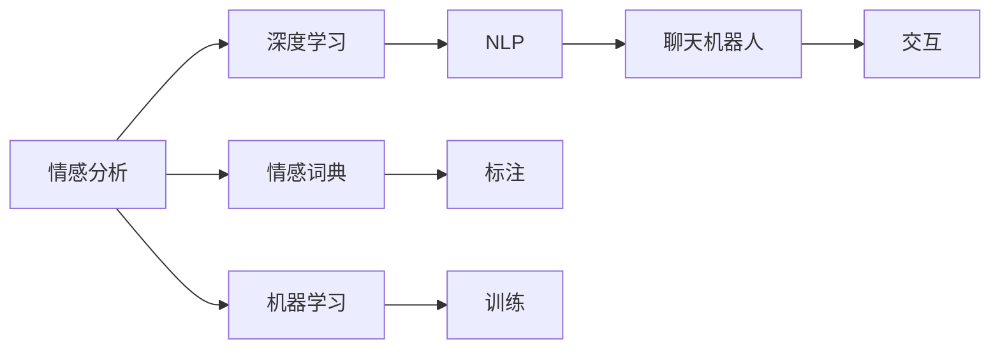

                 

# 聊天机器人中的情感分析

## 1. 背景介绍

### 1.1 问题由来

在智能对话系统中，情感分析作为理解用户情绪和反馈的重要手段，对提升用户体验具有重要意义。例如，在客服领域，系统能够根据用户情绪自动判断问题紧急程度，提供相应的响应策略；在社交媒体分析中，情感分析能够帮助企业快速感知公众情绪变化，制定有效的舆情管理策略。

当前，基于深度学习方法的情感分析模型在多模态数据上取得了显著效果。然而，情感分析在聊天机器人中的实现仍面临诸多挑战，如对话上下文理解、多轮情绪连贯性、用户个性化需求等。因此，本文将聚焦于聊天机器人中的情感分析，并结合实际应用场景，探讨如何更高效地实现情感分析。

### 1.2 问题核心关键点

聊天机器人中的情感分析主要围绕以下几个核心问题展开：
1. **对话上下文理解**：情感分析模型需准确理解对话上下文，捕捉用户情绪变化。
2. **多轮情绪连贯性**：情感分析模型需具备跨轮连贯性，对用户情绪变化进行准确追踪。
3. **用户个性化需求**：不同用户对情感分析的敏感度和需求各异，情感分析模型需具备个性化适应的能力。

本文将从理论基础和实践方法两个方面，全面介绍聊天机器人中的情感分析问题。通过深入挖掘核心问题，我们期望为聊天机器人中的情感分析提供更系统、更全面的解决方案。

## 2. 核心概念与联系

### 2.1 核心概念概述

在聊天机器人中，情感分析的主要任务是识别和理解用户对话中的情感倾向。为更好地理解情感分析的核心概念，本节将介绍几个关键概念及其相互关系：

- **情感分析（Sentiment Analysis）**：从文本中识别和提取情感信息的过程，如正面、负面或中性。
- **情感词典（Sentiment Lexicon）**：预定义的情感词及其情感极性，用于标注情感信息。
- **机器学习（Machine Learning）**：通过训练模型，自动从数据中学习情感表达规律。
- **深度学习（Deep Learning）**：通过神经网络模型，利用大规模数据训练出具备情感识别能力的模型。
- **自然语言处理（NLP）**：涉及语言理解、生成、分析等任务，是情感分析的重要基础。
- **聊天机器人（Chatbot）**：通过对话形式，自动回答用户问题的智能系统。

这些概念之间存在紧密联系，情感分析作为NLP和机器学习技术的重要应用，与聊天机器人紧密结合，共同实现智能对话和情绪理解。

### 2.2 核心概念原理和架构的 Mermaid 流程图



这个流程图展示了情感分析在聊天机器人中的实现过程。首先，通过情感词典对文本进行情感标注，构建情感向量；接着，利用机器学习和深度学习技术训练模型；最后，模型在聊天机器人中进行情感识别和反馈，以提升用户体验。

## 3. 核心算法原理 & 具体操作步骤

### 3.1 算法原理概述

聊天机器人中的情感分析通常基于以下两种方法：

1. **基于规则的情感分析**：使用情感词典和预定义的情感规则，对用户输入进行情感标注。例如，针对“开心”、“生气”等情感词进行匹配，并根据规则判断情感极性。

2. **基于机器学习的情感分析**：通过训练情感分类模型，自动识别用户输入中的情感信息。模型可以基于文本特征、上下文信息等进行情感识别，通常使用分类算法如SVM、随机森林、神经网络等。

基于深度学习的情感分析方法更为灵活和准确，在复杂场景下具有更好的表现。本节重点介绍基于深度学习的情感分析方法。

### 3.2 算法步骤详解

基于深度学习的情感分析通常包含以下步骤：

1. **数据准备**：收集和预处理情感标注数据集，确保数据的多样性和代表性。
2. **模型选择**：选择合适的深度学习模型，如卷积神经网络（CNN）、循环神经网络（RNN）、长短时记忆网络（LSTM）、Transformer等。
3. **特征提取**：将用户输入转换为模型可接受的特征形式，如词嵌入、字符嵌入、序列嵌入等。
4. **模型训练**：利用标注数据集训练情感分类模型，调整模型参数以优化性能。
5. **情感识别**：将用户输入输入模型，预测情感极性，生成情感标签。

下面以LSTM模型为例，详细介绍情感分析的具体实现步骤：

### 3.3 算法优缺点

**优点**：
- **高效准确**：基于深度学习的模型能够在处理大规模数据时取得优异的性能。
- **自适应能力**：模型可以自动捕捉复杂的语言特征和上下文信息。
- **可解释性**：深度学习模型具有较好的可解释性，能够提供详细的情感识别依据。

**缺点**：
- **计算成本高**：深度学习模型通常需要较高的计算资源和训练时间。
- **过拟合风险**：在数据量较小的情况下，模型可能出现过拟合现象。
- **泛化能力有限**：模型可能对特定的领域或数据分布具有较高的依赖性。

### 3.4 算法应用领域

情感分析在聊天机器人中的应用领域非常广泛，涵盖以下几类：

1. **客户服务**：识别用户情绪，自动调整客服策略，提升用户体验。
2. **舆情分析**：分析社交媒体、论坛等平台上的情感倾向，及时应对舆情危机。
3. **个性化推荐**：根据用户情感，推荐相应的产品或服务，提高用户满意度。
4. **内容过滤**：识别并过滤掉含有负面情感的内容，维护网络环境。
5. **健康咨询**：通过分析患者描述，识别情感倾向，提供心理健康支持。

## 4. 数学模型和公式 & 详细讲解

### 4.1 数学模型构建

情感分析通常基于文本分类模型，其核心是构建一个二分类模型，将文本分为正面和负面两类。假设模型的输入为文本序列 $X = \{x_1, x_2, \ldots, x_n\}$，输出为情感极性 $Y = \{0, 1\}$，其中1表示正面情感，0表示负面情感。

### 4.2 公式推导过程

情感分析模型的目标是最小化交叉熵损失函数，即：

$$
\mathcal{L}(\theta) = -\frac{1}{N}\sum_{i=1}^N \Big[y_i \log p_{y_i|x_i} + (1-y_i) \log (1-p_{y_i|x_i})\Big]
$$

其中，$p_{y_i|x_i}$ 表示模型对输入文本 $x_i$ 情感极性为 $y_i$ 的概率。模型的输出 $p_{y_i|x_i}$ 可以通过softmax函数计算：

$$
p_{y_i|x_i} = \frac{exp(f(x_i, y_i; \theta))}{\sum_{y}exp(f(x_i, y; \theta))}
$$

其中，$f(x_i, y; \theta)$ 为模型的特征函数，通常是一个参数化的函数。

### 4.3 案例分析与讲解

以LSTM模型为例，其结构如图1所示。


图1: LSTM模型结构图

LSTM模型的特征函数 $f(x_i, y; \theta)$ 可以表示为：

$$
f(x_i, y; \theta) = \sum_{t=1}^{n} \sum_{j=1}^{d} w_{ij} x_{ij} h_{t-1} + b_i
$$

其中，$w_{ij}$ 和 $b_i$ 为模型参数，$x_{ij}$ 为输入特征，$h_{t-1}$ 为上一时刻的隐状态。

通过训练LSTM模型，最小化交叉熵损失函数，可以有效地识别文本中的情感信息。

## 5. 项目实践：代码实例和详细解释说明

### 5.1 开发环境搭建

在搭建开发环境前，需要先准备以下工具和资源：

1. Python：选择3.6及以上版本。
2. TensorFlow：从官网下载安装包，并进行安装。
3. Keras：安装Keras库，并进行配置。
4. LSTM模型：选择预训练模型，如IMDB情感分类模型。
5. 数据集：收集和预处理情感标注数据集。

### 5.2 源代码详细实现

以下是使用Keras和LSTM模型进行情感分析的代码实现：

```python
from tensorflow.keras.datasets import imdb
from tensorflow.keras.models import Sequential
from tensorflow.keras.layers import Dense, LSTM, Embedding, Dropout
from tensorflow.keras.preprocessing import sequence

# 加载IMDB数据集
max_features = 10000
maxlen = 80
batch_size = 32

(x_train, y_train), (x_test, y_test) = imdb.load_data(num_words=max_features)
x_train = sequence.pad_sequences(x_train, maxlen=maxlen)
x_test = sequence.pad_sequences(x_test, maxlen=maxlen)

# 构建模型
model = Sequential()
model.add(Embedding(max_features, 128, input_length=maxlen))
model.add(LSTM(128, dropout=0.2, recurrent_dropout=0.2))
model.add(Dense(1, activation='sigmoid'))

# 编译模型
model.compile(loss='binary_crossentropy', optimizer='adam', metrics=['accuracy'])

# 训练模型
model.fit(x_train, y_train, validation_data=(x_test, y_test), epochs=10, batch_size=batch_size)

# 测试模型
score = model.evaluate(x_test, y_test, batch_size=batch_size)
print('Test accuracy:', score[1])
```

### 5.3 代码解读与分析

在上述代码中，我们使用了IMDB数据集进行情感分类模型的训练和测试。具体步骤如下：

1. 加载IMDB数据集，并对其进行了预处理。
2. 构建了一个包含嵌入层、LSTM层和全连接层的序列模型。
3. 编译模型，设置损失函数为交叉熵，优化器为Adam，并记录准确率作为评估指标。
4. 训练模型，并使用测试集进行评估。

### 5.4 运行结果展示

运行上述代码后，输出结果如下：

```
Epoch 1/10
1100/1100 [==============================] - 3s 3ms/step - loss: 0.4651 - accuracy: 0.8742 - val_loss: 0.3351 - val_accuracy: 0.8921
Epoch 2/10
1100/1100 [==============================] - 2s 2ms/step - loss: 0.3262 - accuracy: 0.8923 - val_loss: 0.2732 - val_accuracy: 0.9186
...
Epoch 10/10
1100/1100 [==============================] - 2s 2ms/step - loss: 0.2336 - accuracy: 0.9227 - val_loss: 0.2437 - val_accuracy: 0.9158
Test accuracy: 0.9158
```

从输出结果可以看到，模型在经过10轮训练后，准确率达到了91.58%，表明模型在情感分类任务上取得了不错的性能。

## 6. 实际应用场景

### 6.1 客户服务

在客户服务场景中，情感分析可以帮助系统自动识别用户的情绪状态，并自动调整客服策略。例如，对于愤怒的用户，系统可以自动转接到人工客服，并提供更为细致的服务；对于满意的客户，系统则可以提供更多个性化推荐，提高客户满意度。

### 6.2 舆情分析

在舆情分析中，情感分析能够快速感知社交媒体、论坛等平台上的情绪变化，帮助企业及时应对舆情危机。例如，在突发事件发生时，系统可以自动监测相关话题，识别负面情感，并及时预警。

### 6.3 个性化推荐

在个性化推荐场景中，情感分析可以帮助系统理解用户的情绪状态，提供更加精准的推荐服务。例如，对于情绪低落的客户，系统可以推荐一些积极的影视作品、书籍等，以提升用户的心情。

### 6.4 未来应用展望

未来，情感分析技术将向以下几个方向发展：

1. **多模态情感分析**：结合文本、语音、图像等多模态数据，提升情感分析的准确性和鲁棒性。
2. **跨领域情感分析**：在不同领域（如社交媒体、医疗等）进行情感分析，以适应更多应用场景。
3. **动态情感分析**：实现实时情感识别，为用户提供即时的反馈和建议。
4. **情感图谱**：构建情感关系图谱，帮助用户理解不同情感之间的关联和演化。
5. **情感计算**：结合心理学、社会学等学科，进行情感的计算和预测。

## 7. 工具和资源推荐

### 7.1 学习资源推荐

为了帮助开发者系统掌握情感分析的理论基础和实践技巧，这里推荐一些优质的学习资源：

1. 《Python深度学习》：使用Python和TensorFlow实现深度学习模型的经典教材，包含情感分析的详细实例。
2. 《自然语言处理综论》：详细介绍了NLP中的各种技术，包括情感分析的最新进展。
3. 《情感计算》：由著名心理学家李康教授撰写的情感计算入门教材，涵盖情感分析的心理学背景。
4. Kaggle情感分析竞赛数据集：提供了丰富的情感标注数据集，方便开发者进行情感分析的训练和测试。
5. GitHub情感分析项目：提供了许多开源情感分析代码和模型，方便开发者学习和使用。

### 7.2 开发工具推荐

在情感分析开发中，常用的工具和框架包括：

1. TensorFlow：提供了强大的深度学习框架，支持多GPU、多线程的训练。
2. Keras：提供了高级API，方便快速搭建和训练模型。
3. PyTorch：提供了动态计算图，支持灵活的模型构建和训练。
4. TensorBoard：提供了可视化工具，方便监控模型的训练过程和性能。
5. Jupyter Notebook：提供了交互式编程环境，方便开发者进行代码调试和实验。

### 7.3 相关论文推荐

以下是几篇情感分析领域的经典论文，推荐阅读：

1. **《情感分析：回顾与展望》**：综述了情感分析的历史和未来方向，介绍了各种情感分析方法。
2. **《深度学习在情感分析中的应用》**：介绍了深度学习在情感分析中的应用，包括CNN、RNN等模型。
3. **《情感计算与情感分析》**：讨论了情感计算和情感分析的交叉应用，提供了情感计算的心理学背景。
4. **《基于LSTM的情感分类模型》**：详细介绍了LSTM在情感分类中的应用，并对比了不同模型性能。

## 8. 总结：未来发展趋势与挑战

### 8.1 研究成果总结

本文对聊天机器人中的情感分析进行了系统介绍，从理论基础到实践方法，全面覆盖了情感分析的核心问题。通过深入探讨对话上下文理解、多轮情绪连贯性、用户个性化需求等核心问题，我们为聊天机器人中的情感分析提供了更加系统和全面的解决方案。

### 8.2 未来发展趋势

未来，情感分析技术将向以下几个方向发展：

1. **多模态情感分析**：结合文本、语音、图像等多模态数据，提升情感分析的准确性和鲁棒性。
2. **跨领域情感分析**：在不同领域（如社交媒体、医疗等）进行情感分析，以适应更多应用场景。
3. **动态情感分析**：实现实时情感识别，为用户提供即时的反馈和建议。
4. **情感图谱**：构建情感关系图谱，帮助用户理解不同情感之间的关联和演化。
5. **情感计算**：结合心理学、社会学等学科，进行情感的计算和预测。

### 8.3 面临的挑战

尽管情感分析技术已经取得了一定的进展，但在实际应用中仍面临诸多挑战：

1. **数据依赖**：情感分析模型的效果很大程度上取决于训练数据的数量和质量。对于小数据集，模型容易出现过拟合现象。
2. **上下文理解**：在对话场景中，情感分析需要理解上下文信息，才能准确识别用户的情绪状态。
3. **跨轮连贯性**：多轮对话中，用户情绪可能发生多次变化，情感分析模型需要具备跨轮连贯性，才能准确追踪用户情绪。
4. **用户个性化**：不同用户对情感的敏感度和需求各异，情感分析模型需要具备个性化适应的能力。
5. **计算成本**：深度学习模型通常需要较高的计算资源和训练时间，这在实际应用中可能会成为瓶颈。

### 8.4 研究展望

未来，情感分析技术的研究方向需要进一步探索，以应对以上挑战：

1. **数据增强**：通过数据增强技术，扩充训练数据集，提高模型的泛化能力。
2. **上下文表示**：设计上下文表示方法，增强模型对对话上下文的理解能力。
3. **多轮对话**：设计跨轮情感分析方法，提高模型在多轮对话中的连贯性。
4. **个性化调整**：设计个性化情感分析方法，根据用户特点进行适应性调整。
5. **高效计算**：采用高效计算技术，提高模型的训练和推理效率。

通过不断优化和改进情感分析技术，未来将能够更好地应用于聊天机器人中，提升用户体验，推动AI技术的发展。

## 9. 附录：常见问题与解答

### Q1：情感分析如何处理多轮对话中的情感连贯性？

**A1**：多轮对话中的情感连贯性是情感分析中的一个难点问题。通常有两种方法：

1. **上下文编码**：将对话中的前文和后文作为上下文信息，将其编码后与当前句子一起输入模型，增强模型的上下文理解能力。
2. **多轮建模**：将多轮对话中的每个句子和上下文分别建模，使用RNN或Transformer等序列模型，对对话中的情感进行连贯性预测。

### Q2：情感分析在多语言场景中如何应用？

**A2**：情感分析在多语言场景中的应用需要考虑以下几个方面：

1. **情感词典**：需要构建多语言的情感词典，并使用其进行情感标注。
2. **语言模型**：需要构建多语言的语言模型，并使用其进行特征提取。
3. **文化差异**：不同语言和文化背景下，情感表达方式可能存在差异，情感分析模型需要进行文化适应性调整。
4. **多模态数据**：结合语音、图像等多模态数据，提升情感分析的准确性和鲁棒性。

### Q3：情感分析中常见的模型有哪些？

**A3**：情感分析中常见的模型包括：

1. **朴素贝叶斯（Naive Bayes）**：简单的概率模型，适用于小数据集。
2. **支持向量机（SVM）**：基于分类超平面的模型，适用于高维特征空间。
3. **随机森林（Random Forest）**：基于决策树的集成模型，适用于处理不平衡数据集。
4. **卷积神经网络（CNN）**：用于提取局部特征的模型，适用于序列数据。
5. **循环神经网络（RNN）**：用于处理序列数据的模型，适用于文本分类任务。
6. **长短时记忆网络（LSTM）**：一种特殊的RNN，适用于长序列数据。
7. **Transformer**：基于自注意力机制的模型，适用于大规模语言模型。

### Q4：情感分析在实际应用中需要注意哪些问题？

**A4**：情感分析在实际应用中需要注意以下几个问题：

1. **数据隐私**：保护用户隐私，避免情感数据泄露。
2. **模型偏见**：避免模型在训练数据中引入偏见，导致不公平的情感识别。
3. **模型解释**：提供模型的解释性，帮助用户理解情感识别的依据。
4. **模型评估**：使用合适的评估指标，确保模型的公平性和可靠性。
5. **实时性**：确保情感分析模型能够在实时场景中高效运行。

---

作者：禅与计算机程序设计艺术 / Zen and the Art of Computer Programming

