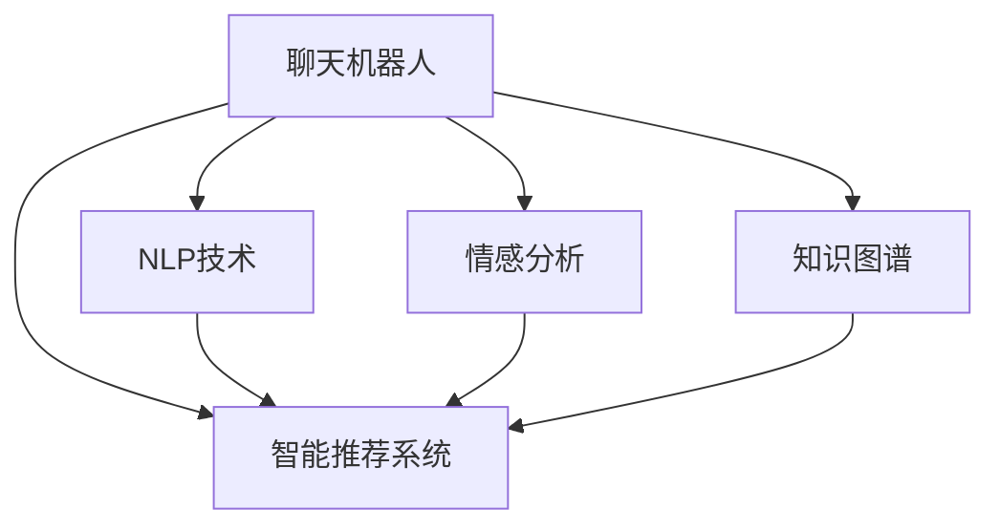

                 

# 聊天机器人公民参与：社会问题和决策

> 关键词：聊天机器人, 公民参与, 社会问题, 决策, 自然语言处理(NLP), 情感分析, 知识图谱

## 1. 背景介绍

### 1.1 问题由来

在当今社会，信息爆炸与日俱增，公民参与的广度和深度不断拓展。如何使广大公众能够更有效地表达观点、参与决策，是各个领域共同关注的焦点。聊天机器人（Chatbots）作为新一代的人机交互方式，其智能、便捷的特性使得其在公民参与和决策支持方面具有巨大的潜力。但聊天机器人的发展仍存在许多社会问题，如信息泛滥、决策质量等问题亟待解决。

### 1.2 问题核心关键点

目前，聊天机器人已广泛应用于政府、企业、医疗等多个领域。但随着应用的深入，也暴露出许多问题：
- 信息过载：公民在获取信息时，容易陷入茫茫的信息海洋中，难以从中提炼有价值的信息。
- 决策质量：自动化决策系统可能会忽视某些重要因素，导致决策不完善。
- 信任危机：公众对机器人推荐的信息和决策缺乏信任，影响其参与积极性。
- 隐私保护：机器人收集和使用个人数据时，如何确保隐私安全。

这些核心问题需要我们在设计聊天机器人时深入思考和妥善解决。

### 1.3 问题研究意义

聊天机器人能够通过自然语言处理（NLP）技术，与公众进行更便捷、更自然的互动，使公众能够更快速、更深入地参与社会事务和公共决策。解决上述社会问题，不仅能提升聊天机器人的用户体验，还能更好地发挥其在社会治理、决策支持中的作用。

## 2. 核心概念与联系

### 2.1 核心概念概述

为更好地理解聊天机器人如何在公民参与和决策支持中发挥作用，本节将介绍几个密切相关的核心概念：

- **聊天机器人**：以自然语言处理技术为基础，通过文字或语音交互形式，为公民提供信息查询、意见表达、决策参考等功能的人机对话系统。
- **自然语言处理(NLP)**：研究计算机如何理解、处理和生成人类语言的技术，涉及文本处理、语音识别、语义理解等多个方向。
- **情感分析**：通过分析文本、语音中的情感信息，获取公众的情绪倾向和关注焦点，辅助决策者理解和回应公众诉求。
- **知识图谱**：融合结构化和非结构化知识，构建语义化的知识网络，辅助聊天机器人提供精准、丰富的信息。
- **智能推荐系统**：根据用户历史行为、兴趣偏好等数据，为公民推荐合适的信息、政策等，提升信息检索效率。

这些核心概念之间的逻辑关系可以通过以下Mermaid流程图来展示：



这个流程图展示了几大核心概念及其之间的关系：

1. 聊天机器人通过NLP技术解析用户输入，并利用情感分析和知识图谱生成合适的回复。
2. 智能推荐系统根据用户行为和偏好，为公民推荐信息，提升信息检索效率。
3. 聊天机器人综合上述系统，提供信息查询、决策支持等多种服务。

这些概念共同构成了聊天机器人在公民参与和决策支持中的应用框架，使其能够更好地理解和回应公众诉求。

## 3. 核心算法原理 & 具体操作步骤
### 3.1 算法原理概述

聊天机器人在公民参与和决策支持中的主要算法原理包括以下几个方面：

- **自然语言理解(NLU)**：通过解析用户输入，理解其意图和需求。NLU是聊天机器人的基础能力，通过复杂的语言模型和规则，将用户自然语言转化为可处理的信息。
- **情感分析**：分析用户输入中的情感信息，识别公众情绪和关注焦点。情感分析能够帮助决策者更好地理解公众诉求，优化决策方案。
- **知识图谱**：通过构建语义化的知识网络，为聊天机器人提供丰富的信息支持，帮助其生成更准确、全面的回答。
- **智能推荐系统**：利用用户行为数据，推荐合适的信息、政策等，提升信息检索效率。

这些算法原理共同支撑聊天机器人更好地与公众互动，提供高质量的决策支持服务。

### 3.2 算法步骤详解

聊天机器人在公民参与和决策支持中的具体操作一般包括以下几个关键步骤：

**Step 1: 数据收集与预处理**
- 收集公民反馈、政府决策信息、社会事件等多种数据，作为聊天机器人的训练素材。
- 对数据进行清洗、分词、去停用词等预处理操作，生成可用于训练的语言模型。

**Step 2: 构建语言模型**
- 使用大规模语料库，训练强大的语言模型，如BERT、GPT等。
- 通过迁移学习技术，利用预训练语言模型进行微调，提升模型的特定任务性能。

**Step 3: 加入情感分析模块**
- 通过自然语言处理技术，提取用户输入中的情感信息，如积极、消极、中性等。
- 利用情感词典、情感分类器等技术，对情感信息进行分析和分类。

**Step 4: 引入知识图谱**
- 构建和维护知识图谱，将结构化知识如法律法规、政策信息等与非结构化知识如新闻、报告等融合。
- 利用图谱推理算法，根据用户提问生成精准、全面的回答。

**Step 5: 应用智能推荐系统**
- 收集用户的历史行为数据，如浏览记录、互动频率等，构建用户画像。
- 利用协同过滤、内容推荐等技术，为公民推荐相关的信息、政策等，提升信息检索效率。

**Step 6: 输出结果与反馈循环**
- 根据用户输入和处理结果，生成自然语言回复。
- 收集用户反馈，不断优化模型性能和推荐效果，形成持续的反馈循环。

以上是聊天机器人在公民参与和决策支持中的主要操作流程。在实际应用中，还需要针对具体任务的特点，对各个环节进行优化设计，如改进情感分析模型，增强知识图谱更新机制，优化推荐算法等。

### 3.3 算法优缺点

聊天机器人在公民参与和决策支持中具有以下优点：
- **高效便捷**：通过自然语言处理技术，公众可以以自然的方式与机器人交流，获取所需信息。
- **深度互动**：能够持续与公众互动，了解其真实需求和诉求，辅助决策者制定更加科学的决策。
- **信息丰富**：通过知识图谱和智能推荐系统，为公众提供更全面、精准的信息支持。

同时，聊天机器人也存在一定的局限性：
- **信息可信度**：机器人推荐的信息可能存在误导，影响公众对决策的信任。
- **隐私保护**：在收集和使用公民数据时，如何确保隐私安全。
- **复杂场景应对**：在应对复杂、多变的情境时，机器人的智能可能不足。

尽管存在这些局限性，但就目前而言，聊天机器人仍具有广泛的应用前景，并成为公民参与和决策支持的重要手段。未来相关研究将聚焦于如何提升机器人的智能水平和决策支持能力，同时兼顾隐私保护和可信度。

### 3.4 算法应用领域

聊天机器人在公民参与和决策支持中的主要应用领域包括以下几个方面：

- **公共服务**：通过聊天机器人，公众可以查询政府服务信息、申请政府服务、参与政策讨论等。
- **舆情监测**：收集和分析公众反馈、新闻报道等数据，了解公众情绪和关注焦点，辅助政府决策。
- **医疗健康**：通过智能问答系统，辅助患者获取医疗信息、预约挂号等。
- **教育培训**：为学生提供智能辅导、课程推荐等，提升学习效率。
- **企业客户服务**：为企业提供客户咨询、智能客服等功能，提升客户满意度。

除了上述这些领域，聊天机器人在金融、旅游、交通等多个领域也有广泛应用，为社会各行业带来了便捷和智能化。

## 4. 数学模型和公式 & 详细讲解
### 4.1 数学模型构建

本节将使用数学语言对聊天机器人在公民参与和决策支持中的应用进行更加严格的刻画。

记聊天机器人与公民交互的语言模型为 $M_{\theta}(x)$，其中 $x$ 为用户输入的自然语言，$\theta$ 为模型参数。假设用户输入 $x$ 包含情感信息 $e$，目标为预测用户情绪 $\hat{e}$ 和提取相关知识 $k$。

模型目标函数为：

$$
\min_{\theta} \mathcal{L}(M_{\theta}(x), e, k) = \mathbb{E}[\ell_{e}(M_{\theta}(x), \hat{e})] + \mathbb{E}[\ell_{k}(M_{\theta}(x), k)]
$$

其中，$\ell_{e}(\cdot)$ 为情感分类损失函数，$\ell_{k}(\cdot)$ 为知识检索损失函数。情感分类损失函数用于衡量机器人对用户情感的识别准确度，知识检索损失函数用于衡量机器人在知识图谱中获取相关知识的准确度。

### 4.2 公式推导过程

以情感分析为例，我们推导情感分类损失函数 $\ell_{e}(\cdot)$ 及其梯度计算公式。

假设用户输入 $x$ 为文本形式，情感分类器 $C$ 将输入 $x$ 映射到情感类别 $\hat{e} \in \{1, -1\}$，其中 $1$ 表示积极情感，$-1$ 表示消极情感。

情感分类器的输出为 $\hat{y} = C(x)$，情感分类损失函数为：

$$
\ell_{e}(x, \hat{e}) = -[y\log \hat{y} + (1-y)\log (1-\hat{y})]
$$

其中 $y$ 为用户输入的情感类别，$\hat{y}$ 为分类器的预测值。

根据链式法则，损失函数对模型参数 $\theta$ 的梯度为：

$$
\frac{\partial \ell_{e}(x, \hat{e})}{\partial \theta} = \frac{\partial \ell_{e}(x, \hat{e})}{\partial \hat{y}} \frac{\partial \hat{y}}{\partial x} \frac{\partial x}{\partial \theta}
$$

其中 $\frac{\partial \ell_{e}(x, \hat{e})}{\partial \hat{y}}$ 为情感分类损失函数对预测值的梯度，$\frac{\partial \hat{y}}{\partial x}$ 为分类器对输入的梯度，$\frac{\partial x}{\partial \theta}$ 为输入对模型参数的梯度。

在得到损失函数的梯度后，即可带入模型参数更新公式，完成模型的迭代优化。重复上述过程直至收敛，最终得到适应用于情感分析的模型参数 $\theta^*$。

### 4.3 案例分析与讲解

以情感分析为例，我们通过一个简单的案例分析，解释情感分类损失函数及其梯度的计算过程。

假设某用户输入 $x$ 为“很满意这次服务”，情感分类器的预测值 $\hat{y} = 0.9$，真实情感类别 $y = 1$。则情感分类损失函数为：

$$
\ell_{e}(x, \hat{e}) = -[1\log 0.9 + 0\log (1-0.9)] = -0.1
$$

根据链式法则，情感分类损失函数对模型参数 $\theta$ 的梯度为：

$$
\frac{\partial \ell_{e}(x, \hat{e})}{\partial \theta} = -[0.9\log 0.9 + 0.1\log (1-0.9)] = -0.1 \log 0.9
$$

通过上述计算，我们可以看到，情感分类损失函数及其梯度可以帮助我们不断调整情感分类器的参数，提高其对用户情感的识别准确度。

## 5. 项目实践：代码实例和详细解释说明
### 5.1 开发环境搭建

在进行聊天机器人公民参与项目实践前，我们需要准备好开发环境。以下是使用Python进行自然语言处理(NLP)和深度学习开发的环境配置流程：

1. 安装Anaconda：从官网下载并安装Anaconda，用于创建独立的Python环境。

2. 创建并激活虚拟环境：
```bash
conda create -n nlp-env python=3.8 
conda activate nlp-env
```

3. 安装必要的库：
```bash
conda install pandas numpy matplotlib scikit-learn spacy torch torchtext transformers
```

4. 安装特定领域的库：
```bash
conda install nltk
```

5. 安装GPU支持：
```bash
pip install torch-cuda
```

完成上述步骤后，即可在`nlp-env`环境中开始项目实践。

### 5.2 源代码详细实现

下面我们以构建一个简单的聊天机器人为例，给出使用Python和SpaCy库进行情感分析的代码实现。

首先，定义情感分析的函数：

```python
from spacy import displacy
from spacy.symbols import CAT
import spacy

# 加载预训练的情感分析模型
nlp = spacy.load('en_core_web_sm')

# 定义情感分析函数
def analyze_sentiment(text):
    doc = nlp(text)
    sentiment_score = doc.cats['Sentiment'].value
    sentiment_label = "Positive" if sentiment_score > 0.5 else "Negative"
    return sentiment_label, sentiment_score

# 示例测试
text = "The movie was really great!"
sentiment_label, sentiment_score = analyze_sentiment(text)
print(f"Text: {text}")
print(f"Sentiment Label: {sentiment_label}, Score: {sentiment_score}")
```

然后，使用SpaCy的displacy库可视化情感分析结果：

```python
# 可视化情感分析结果
doc = nlp(text)
displacy.render(doc, style="ent", jupyter=True)
```

以上代码中，我们首先加载了预训练的情感分析模型，定义了一个情感分析函数，根据输入文本的情感得分输出情感标签。然后，通过调用displacy库，将情感分析的结果以可视化形式展示出来。

### 5.3 代码解读与分析

让我们再详细解读一下关键代码的实现细节：

**SpaCy库**：
- `spacy.load`方法：用于加载预训练的情感分析模型。
- `nlp`对象：表示加载的情感分析模型，可以进行文本解析和情感分析。
- `doc.cats`属性：获取文档的标签信息，包括情感得分。

**情感分析函数**：
- `analyze_sentiment`函数：接收输入文本，解析文本并输出情感标签和得分。
- 使用`doc.cats['Sentiment'].value`获取文档情感得分，根据得分判断情感标签。
- `sentiment_label`和`sentiment_score`分别用于存储情感标签和得分。

**可视化**：
- `displacy.render`方法：用于展示情感分析的可视化结果。
- `style="ent"`：指定展示的样式为实体标签。
- `jupyter=True`：指定在Jupyter Notebook中展示结果。

通过上述代码，我们可以看到，使用SpaCy库进行情感分析是相对简单的。开发者可以根据具体需求，进一步优化情感分析模型，如添加更多情感标签、改进模型训练方法等。

## 6. 实际应用场景
### 6.1 智能客服系统

聊天机器人在智能客服系统中具有广泛应用。通过自然语言处理技术，机器人能够实时响应客户的咨询请求，提供精准的解决方案。以下是一个基于聊天机器人的智能客服系统的实际应用场景：

某银行为客户提供24小时智能客服服务，通过聊天机器人，客户可以实时获取贷款咨询、账户管理、交易查询等服务。机器人通过自然语言处理技术，理解客户的意图，提供个性化的服务建议。此外，银行还可以通过机器人收集客户的反馈，持续优化服务质量，提升客户满意度。

### 6.2 舆情监测系统

在舆情监测系统中，聊天机器人能够实时收集和分析社交媒体上的公众意见，了解公众情绪和关注焦点，辅助决策者制定政策。以下是一个基于聊天机器人的舆情监测系统的实际应用场景：

某政府机构通过聊天机器人，实时监测社交媒体上的舆情信息。机器人分析公众评论和讨论，生成舆情报告，帮助政府了解公众情绪和热点问题。政府可以及时回应公众诉求，解决社会问题，提升公众满意度。

### 6.3 教育辅导系统

在教育辅导系统中，聊天机器人能够根据学生的学习情况，提供个性化的学习建议和辅导。以下是一个基于聊天机器人的教育辅导系统的实际应用场景：

某教育平台通过聊天机器人，为学生提供学习辅导和作业帮助。机器人根据学生的学习进度和薄弱环节，提供个性化的学习建议和题目解答，帮助学生提升学习效果。此外，平台还可以通过机器人收集学生的学习反馈，持续优化教学资源，提升教学质量。

### 6.4 未来应用展望

随着聊天机器人在公民参与和决策支持中的不断深入应用，未来将具备更强大的智能水平和决策支持能力。以下是聊天机器人未来的一些发展趋势：

1. **深度学习融合**：未来的聊天机器人将更多地融入深度学习技术，提升对自然语言理解的深度和广度。

2. **多模态信息整合**：除了文本信息，未来的聊天机器人将整合语音、图像等多模态信息，提供更加丰富、全面的服务。

3. **决策支持增强**：通过引入更多先验知识和外部数据，聊天机器人将具备更强的决策支持能力，辅助决策者制定更科学、合理的决策。

4. **隐私保护机制**：随着公众对隐私保护的关注度不断提升，未来的聊天机器人将采用更加严格的隐私保护机制，确保用户数据的安全。

5. **持续学习和优化**：未来的聊天机器人将具备持续学习和优化能力，通过不断积累用户反馈和历史数据，提升自身的智能水平和服务质量。

总之，未来的聊天机器人将在公民参与和决策支持中发挥更加重要的作用，成为推动社会进步和公共决策的重要工具。

## 7. 工具和资源推荐
### 7.1 学习资源推荐

为了帮助开发者系统掌握聊天机器人技术的应用，这里推荐一些优质的学习资源：

1. **自然语言处理(NLP)入门书籍**：《自然语言处理综论》、《Python自然语言处理》等书籍，帮助理解NLP基础知识和实现方法。
2. **深度学习框架教程**：TensorFlow、PyTorch等深度学习框架的官方教程，学习模型构建和训练方法。
3. **SpaCy官方文档**：SpaCy库的官方文档，提供了丰富的NLP功能，包括情感分析、实体识别等。
4. **Kaggle竞赛**：Kaggle上关于聊天机器人、NLP等领域的竞赛，提供大量实际应用场景和数据集。
5. **学术期刊和会议**：《Journal of Machine Learning Research》、《IEEE Transactions on Neural Networks and Learning Systems》等期刊，以及ACL、EMNLP等会议，了解最新的NLP和聊天机器人研究进展。

通过对这些资源的学习实践，相信你一定能够快速掌握聊天机器人的设计理念和实现方法，并用于解决实际的NLP问题。

### 7.2 开发工具推荐

高效的开发离不开优秀的工具支持。以下是几款用于聊天机器人开发的常用工具：

1. **Jupyter Notebook**：提供交互式的编程环境，方便开发者实时测试和调试代码。
2. **GitHub**：代码版本控制工具，便于开发者协作和版本管理。
3. **OpenAI GPT**：先进的预训练语言模型，可以用于构建智能聊天机器人。
4. **Google Dialogflow**：Google提供的聊天机器人平台，支持多种自然语言处理功能。
5. **IBM Watson Assistant**：IBM提供的聊天机器人平台，支持多语言和多渠道部署。

合理利用这些工具，可以显著提升聊天机器人的开发效率，加快创新迭代的步伐。

### 7.3 相关论文推荐

聊天机器人技术的发展源于学界的持续研究。以下是几篇奠基性的相关论文，推荐阅读：

1. **Attention is All You Need**：提出了Transformer结构，开启了NLP领域的预训练大模型时代。
2. **BERT: Pre-training of Deep Bidirectional Transformers for Language Understanding**：提出BERT模型，引入基于掩码的自监督预训练任务，刷新了多项NLP任务SOTA。
3. **ModelScope: A Platform for End-to-End AI Model Creation**：介绍了ModelScope平台，支持大规模预训练模型和微调任务，加速AI模型开发。
4. **ChatBot Toolkit: A Tool for Developing Conversational Agents**：介绍了一个开源的聊天机器人开发工具包，提供了丰富的功能和模板。
5. **Neural Machine Translation by Jointly Learning to Align and Translate**：提出了序列到序列(S2S)模型，为聊天机器人提供了强大的语言翻译支持。

这些论文代表了大语言模型和聊天机器人技术的发展脉络。通过学习这些前沿成果，可以帮助研究者把握学科前进方向，激发更多的创新灵感。

## 8. 总结：未来发展趋势与挑战
### 8.1 研究成果总结

本文对聊天机器人在公民参与和决策支持中的应用进行了全面系统的介绍。首先阐述了聊天机器人技术在公民参与中的重要价值，明确了其在决策支持中的独特作用。其次，从原理到实践，详细讲解了聊天机器人的核心算法原理和具体操作步骤，给出了具体的代码实例。同时，本文还广泛探讨了聊天机器人在智能客服、舆情监测、教育辅导等多个行业领域的应用前景，展示了其在不同场景下的广阔应用空间。此外，本文精选了聊天机器人的学习资源和开发工具，力求为开发者提供全方位的技术指引。

通过本文的系统梳理，我们可以看到，聊天机器人在公民参与和决策支持中具备强大的潜力，能够帮助公众更便捷地获取信息，参与决策过程。解决上述社会问题，不仅能提升聊天机器人的用户体验，还能更好地发挥其在社会治理、决策支持中的作用。

### 8.2 未来发展趋势

展望未来，聊天机器人在公民参与和决策支持中的发展趋势主要体现在以下几个方面：

1. **深度学习融合**：未来的聊天机器人将更多地融入深度学习技术，提升对自然语言理解的深度和广度。
2. **多模态信息整合**：除了文本信息，未来的聊天机器人将整合语音、图像等多模态信息，提供更加丰富、全面的服务。
3. **决策支持增强**：通过引入更多先验知识和外部数据，聊天机器人将具备更强的决策支持能力，辅助决策者制定更科学、合理的决策。
4. **隐私保护机制**：随着公众对隐私保护的关注度不断提升，未来的聊天机器人将采用更加严格的隐私保护机制，确保用户数据的安全。
5. **持续学习和优化**：未来的聊天机器人将具备持续学习和优化能力，通过不断积累用户反馈和历史数据，提升自身的智能水平和服务质量。

这些发展趋势将使聊天机器人更加智能化、个性化，为公民参与和决策支持带来更多便利和高效。

### 8.3 面临的挑战

尽管聊天机器人技术已经取得了显著进展，但在迈向更加智能化、普适化应用的过程中，仍面临诸多挑战：

1. **信息过载**：如何在海量信息中提取有价值的信息，减少用户的信息负担。
2. **决策质量**：如何避免自动化决策系统忽视重要因素，提升决策的科学性。
3. **隐私保护**：在收集和使用用户数据时，如何确保隐私安全。
4. **复杂场景应对**：在应对复杂、多变的情境时，机器人的智能可能不足。

这些挑战需要我们在设计和实现聊天机器人时深入思考和妥善解决。唯有不断优化算法、优化模型，才能使聊天机器人更好地服务于公众，提升其应用价值。

### 8.4 研究展望

面对聊天机器人面临的种种挑战，未来的研究需要在以下几个方面寻求新的突破：

1. **深度学习融合**：引入深度学习技术，提升聊天机器人的智能水平和决策支持能力。
2. **多模态信息整合**：将视觉、语音等多模态信息与文本信息融合，提升聊天机器人的服务效果。
3. **知识图谱应用**：引入知识图谱技术，为聊天机器人提供更全面、准确的信息支持。
4. **隐私保护机制**：采用更严格的隐私保护措施，确保用户数据的安全和隐私。
5. **持续学习与优化**：通过持续学习和优化，不断提升聊天机器人的智能水平和服务质量。

这些研究方向将使聊天机器人在公民参与和决策支持中发挥更大的作用，为社会治理和公共决策带来更多创新和突破。

## 9. 附录：常见问题与解答

**Q1: 如何构建一个高效的聊天机器人？**

A: 构建高效的聊天机器人需要从以下几个方面进行优化：
1. **数据收集与预处理**：收集高质量的训练数据，进行数据清洗、分词、去停用词等预处理操作。
2. **选择合适的模型**：选择适合任务的预训练模型，进行微调或训练新的模型。
3. **加入情感分析模块**：通过自然语言处理技术，提取用户输入中的情感信息，识别用户情绪。
4. **引入知识图谱**：构建和维护知识图谱，为聊天机器人提供丰富的信息支持。
5. **优化推荐系统**：利用用户行为数据，为公民推荐合适的信息、政策等，提升信息检索效率。

**Q2: 聊天机器人如何应对复杂场景？**

A: 聊天机器人在应对复杂场景时，可以采用以下策略：
1. **多轮对话设计**：通过多轮对话机制，逐步了解用户需求，提供精准的解决方案。
2. **上下文理解**：在多轮对话中，利用上下文信息，提升对用户意图的理解能力。
3. **知识图谱扩展**：扩展知识图谱，提供更多相关知识，帮助机器人更好地处理复杂问题。
4. **人工干预机制**：在处理复杂问题时，引入人工干预机制，及时调整机器人响应。

**Q3: 聊天机器人如何保护用户隐私？**

A: 聊天机器人在保护用户隐私方面，可以采取以下措施：
1. **数据加密**：对用户数据进行加密处理，防止数据泄露。
2. **匿名化处理**：对用户数据进行匿名化处理，保护用户隐私。
3. **数据使用规范**：制定严格的数据使用规范，确保用户数据仅用于特定目的。
4. **隐私保护算法**：采用隐私保护算法，如差分隐私，限制数据的泄露风险。

**Q4: 如何优化聊天机器人的性能？**

A: 优化聊天机器人的性能可以从以下几个方面进行：
1. **模型优化**：选择适合任务的模型，进行参数调整和超参数优化。
2. **数据增强**：通过数据增强技术，扩充训练集，提高模型的泛化能力。
3. **模型压缩**：采用模型压缩技术，减小模型大小，提高推理速度。
4. **上下文理解**：通过上下文理解技术，提升机器人的对话能力。
5. **多轮对话机制**：设计多轮对话机制，逐步了解用户需求，提供精准的解决方案。

这些措施能够显著提升聊天机器人的智能水平和服务质量，更好地服务于公众。

**Q5: 聊天机器人如何在不同行业应用？**

A: 聊天机器人在不同行业应用时，可以采用以下策略：
1. **智能客服**：在智能客服系统中，机器人实时响应客户的咨询请求，提供精准的解决方案。
2. **舆情监测**：在舆情监测系统中，机器人分析公众评论和讨论，生成舆情报告，辅助决策者制定政策。
3. **教育辅导**：在教育辅导系统中，机器人根据学生的学习情况，提供个性化的学习建议和辅导。
4. **医疗健康**：在医疗健康系统中，机器人辅助患者获取医疗信息、预约挂号等。
5. **金融服务**：在金融服务系统中，机器人提供理财咨询、交易查询等服务。

开发者可以根据具体行业需求，设计适合行业的聊天机器人，提升用户满意度和服务效率。

**Q6: 如何衡量聊天机器人的性能？**

A: 衡量聊天机器人的性能可以从以下几个方面进行：
1. **准确率**：衡量机器人在回答问题时的准确率，反映其对用户意图的理解能力。
2. **响应时间**：衡量机器人在处理用户请求时的响应时间，反映其处理效率。
3. **用户满意度**：通过用户反馈，衡量机器人对用户的响应质量和满意度。
4. **知识覆盖度**：衡量机器人能够回答的问题范围，反映其知识储备的丰富程度。

通过综合考虑这些指标，可以全面评估聊天机器人的性能和用户体验。

通过本文的系统梳理，我们可以看到，聊天机器人在公民参与和决策支持中具备强大的潜力，能够帮助公众更便捷地获取信息，参与决策过程。解决上述社会问题，不仅能提升聊天机器人的用户体验，还能更好地发挥其在社会治理、决策支持中的作用。未来，随着技术的不断进步，聊天机器人在不同场景中的应用将更加广泛，为社会进步和公共决策带来更多创新和突破。

---

作者：禅与计算机程序设计艺术 / Zen and the Art of Computer Programming

