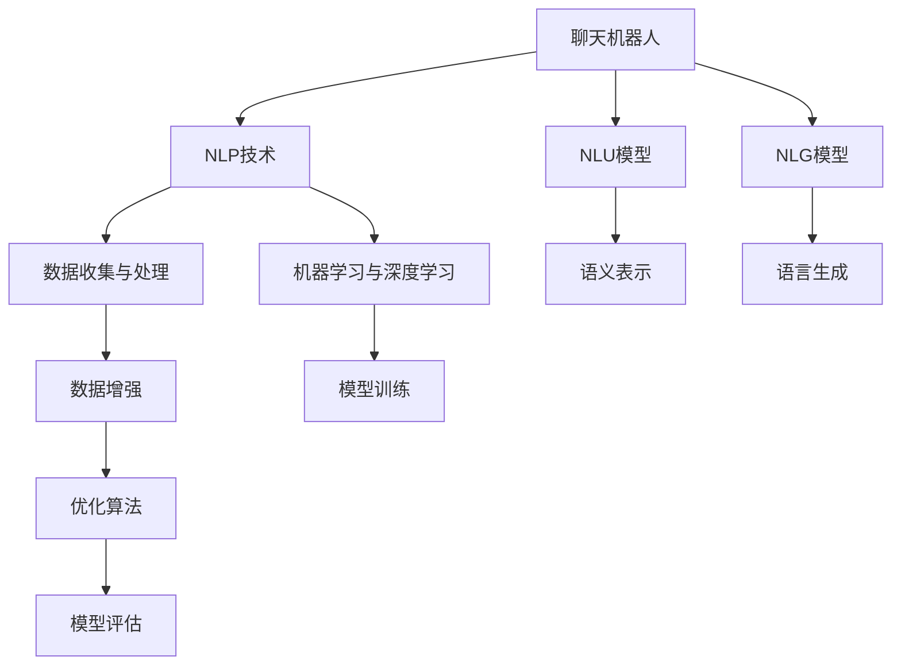

                 

# 聊天机器人太空探索：行星研究和任务

> 关键词：聊天机器人, 太空探索, 行星研究, 自然语言处理(NLP), 语言生成, 自然语言理解(NLU), 机器学习, 深度学习, 人工智能(AI)

## 1. 背景介绍

### 1.1 问题由来

随着人工智能技术的不断进步，聊天机器人已经成为了一种不可或缺的辅助工具，广泛应用于客户服务、医疗咨询、在线教育等领域。然而，目前的聊天机器人大多聚焦于常见的通用任务，如客服对话、学术问答等，对于更复杂、更专业化的问题如太空探索和行星研究等领域，仍显得力不从心。这些领域涉及大量专业知识和前沿科技，往往需要深度理解上下文和逻辑推理能力。

### 1.2 问题核心关键点

要构建针对太空探索和行星研究的聊天机器人，主要需要解决以下几个核心问题：

- 如何收集和处理相关领域的大量数据？
- 如何设计有效的自然语言理解(NLU)模型，理解用户输入的科学问题和上下文？
- 如何构建高效的自然语言生成(NLG)模型，生成符合科学事实和逻辑推理的详细回答？
- 如何设计智能推理和决策算法，在面对复杂问题时，能提供准确的解答？
- 如何确保聊天机器人的回答准确性、安全性和可靠性？

本文将系统性地介绍如何构建用于太空探索和行星研究的聊天机器人，涵盖数据收集、模型设计、推理和决策、安全性和可靠性等关键环节，并结合实际应用案例进行详细阐述。

## 2. 核心概念与联系

### 2.1 核心概念概述

在进行太空探索和行星研究的聊天机器人设计时，涉及以下几个核心概念：

- **聊天机器人(Chatbot)**：通过自然语言处理技术，实现人机对话的计算机程序，可以用于客户服务、知识问答等多种场景。
- **自然语言处理(Natural Language Processing, NLP)**：涉及计算机对自然语言文本的分析、理解、生成等处理任务，是聊天机器人的核心技术之一。
- **自然语言理解(Natural Language Understanding, NLU)**：使机器能够理解人类语言含义，通常包括分词、词性标注、句法分析、语义分析等步骤。
- **自然语言生成(Natural Language Generation, NLG)**：使机器能够生成符合语法规则和语义逻辑的自然语言文本。
- **机器学习与深度学习**：基于数据训练模型，使机器能够自动学习并适应新的数据和任务。
- **人工智能(Artificial Intelligence, AI)**：使机器能够模拟人类智能行为，处理复杂问题并作出合理决策。

这些概念之间的联系可以通过以下Mermaid流程图来展示：



这个流程图展示了聊天机器人涉及的核心技术流程：

1. 聊天机器人通过NLP技术处理用户输入。
2. NLU模型对输入文本进行语义理解。
3. NLG模型生成自然语言文本作为机器人的回复。
4. 机器学习与深度学习技术用于模型训练和优化。
5. 数据收集与处理、数据增强、模型训练、优化算法、模型评估等环节相互配合，共同构建高效的聊天机器人系统。

## 3. 核心算法原理 & 具体操作步骤

### 3.1 算法原理概述

构建用于太空探索和行星研究的聊天机器人，其核心算法原理包括以下几个关键步骤：

1. **数据收集与预处理**：从公开的科学文献、观测数据、天文数据库等来源收集数据，并进行清洗、标注等预处理工作。
2. **自然语言理解(NLU)**：使用预训练的语言模型（如BERT、GPT等）进行微调，使其能够理解科学问题及其上下文。
3. **自然语言生成(NLG)**：设计生成模型，如Seq2Seq模型、Transformer等，用于生成符合科学事实和逻辑推理的回答。
4. **智能推理与决策**：引入符号逻辑推理系统或深度学习推理模块，在回答复杂问题时，能够进行逻辑推导和决策。
5. **安全性与可靠性**：构建安全机制和评估标准，确保聊天机器人的回答准确、安全、可靠。

### 3.2 算法步骤详解

#### 3.2.1 数据收集与预处理

数据收集是聊天机器人设计和开发的重要基础。太空探索和行星研究涉及大量专业数据，包括天文学、天体物理学、地质学、气候学等领域。常用的数据源包括NASA、ESA、COSMOS等公开数据库。

具体步骤包括：

- 收集相关领域的文本数据，如科学文献、观测报告、科普文章等。
- 清洗数据，去除格式错误、无关信息、噪声数据等。
- 对数据进行标注，如实体识别、关系抽取、事件序列等。

#### 3.2.2 自然语言理解(NLU)

NLU模型的设计目标是理解用户输入的自然语言文本，提取其中的关键信息，并进行语义分析。通常使用预训练的语言模型（如BERT、GPT等）进行微调，使其适应特定的任务需求。

具体步骤包括：

- 选择合适的预训练模型，并进行微调。
- 设计文本分类、命名实体识别、关系抽取等任务，用于分析和理解用户输入。
- 使用标签数据进行监督学习，优化模型的识别精度。

#### 3.2.3 自然语言生成(NLG)

NLG模型的设计目标是生成符合语法和语义逻辑的自然语言文本，用于回答用户的问题。通常使用Seq2Seq模型、Transformer等架构，结合注意力机制和解码器。

具体步骤包括：

- 设计生成模型架构，如Seq2Seq、Transformer等。
- 训练模型，使用语言模型作为损失函数，优化生成效果。
- 引入逻辑推理和知识库，确保生成的回答符合科学事实和逻辑推理。

#### 3.2.4 智能推理与决策

聊天机器人在面对复杂问题时，需要具备一定的智能推理和决策能力。常用的方法包括：

- 符号逻辑推理系统：利用规则库、专家系统等方法，进行逻辑推导和决策。
- 深度学习推理模块：使用RNN、LSTM、GRU等模型，对输入进行逐步推导，最终得出结论。

具体步骤包括：

- 设计推理模块，选择合适的架构和算法。
- 结合知识库，引入先验知识，增强推理的准确性和可靠性。
- 对推理模块进行训练和优化，提升推理效果。

#### 3.2.5 安全性与可靠性

聊天机器人的回答需要具备一定的安全性和可靠性，以避免误导用户或造成安全隐患。常用的方法包括：

- 安全机制设计：如访问控制、数据脱敏、异常检测等，确保数据和回答的安全性。
- 评估标准制定：如准确性、一致性、可靠性、可用性等，评估模型的性能和效果。

具体步骤包括：

- 设计安全机制，确保数据和回答的安全性。
- 制定评估标准，定期评估聊天机器人的性能和效果。
- 根据评估结果，进行优化和改进。

### 3.3 算法优缺点

#### 3.3.1 优点

1. **适应性强**：基于NLP技术的聊天机器人可以适应各种自然语言输入，具有广泛的适用性。
2. **高效响应**：通过优化算法和高效推理模块，可以快速生成答案，提升用户体验。
3. **跨领域应用**：可以应用于多个领域，如客户服务、教育、科普等，具有广泛的应用前景。
4. **知识整合能力**：通过结合知识库和推理模块，能够整合大量的科学知识和逻辑推理，提升回答的准确性。

#### 3.3.2 缺点

1. **数据依赖性强**：数据的质量和数量直接影响模型的性能，需要大量的标注数据。
2. **复杂性高**：涉及多层次的NLP和AI技术，设计和实现复杂。
3. **误导风险**：如果回答错误，可能误导用户，带来安全风险。
4. **推理难度大**：面对复杂问题时，需要高度的逻辑推理能力，对模型要求高。

### 3.4 算法应用领域

聊天机器人技术已经广泛应用于多个领域，如：

- **客户服务**：如智能客服机器人，为用户提供24小时不间断的服务。
- **在线教育**：如智能辅导机器人，帮助学生解答学习中的问题。
- **医疗咨询**：如智能诊疗机器人，提供初步诊断和建议。
- **科普教育**：如科普讲解机器人，提供有趣的科学知识。

## 4. 数学模型和公式 & 详细讲解 & 举例说明

### 4.1 数学模型构建

构建用于太空探索和行星研究的聊天机器人，需要构建多个数学模型，包括语言理解模型、生成模型、推理模型等。以下以自然语言理解模型为例进行详细阐述。

假设我们有一个自然语言理解模型 $M_\theta$，其中 $\theta$ 为模型参数。输入文本为 $x$，输出为 $y$。模型的数学模型可以表示为：

$$ y = M_\theta(x) $$

其中 $y$ 为模型的输出，可以是标签、概率分布、语义表示等。

#### 4.1.1 语言理解模型的构建

语言理解模型的目标是从输入文本 $x$ 中提取关键信息，并进行语义分析。常用的模型包括BERT、GPT等。

假设我们使用BERT作为预训练模型，进行微调以适应太空探索和行星研究领域。微调的目标函数可以表示为：

$$ \mathcal{L} = \frac{1}{N} \sum_{i=1}^N \ell(y_i, M_\theta(x_i)) $$

其中 $N$ 为样本数量，$\ell$ 为损失函数，$y_i$ 为标签，$x_i$ 为输入文本。

常用的损失函数包括交叉熵损失、均方误差损失等。这里以交叉熵损失为例：

$$ \ell(y_i, M_\theta(x_i)) = -y_i \log(M_\theta(x_i)) - (1-y_i) \log(1-M_\theta(x_i)) $$

其中 $y_i$ 为标签，$M_\theta(x_i)$ 为模型的输出概率。

#### 4.1.2 推理模型的构建

推理模型的目标是进行逻辑推导和决策。常用的模型包括RNN、LSTM、GRU等。

以LSTM模型为例，假设我们有一个LSTM模型 $R_\theta$，其中 $\theta$ 为模型参数。输入为 $x$，输出为 $y$。模型的数学模型可以表示为：

$$ y = R_\theta(x) $$

其中 $y$ 为模型的输出，可以是决策结果、推理步骤等。

常用的推理任务包括关系抽取、事件序列等。这里以关系抽取为例，使用LSTM模型进行推理。模型的训练目标函数可以表示为：

$$ \mathcal{L} = \frac{1}{N} \sum_{i=1}^N \ell(y_i, R_\theta(x_i)) $$

其中 $N$ 为样本数量，$\ell$ 为损失函数，$y_i$ 为标签，$x_i$ 为输入文本。

常用的损失函数包括交叉熵损失、余弦相似度损失等。这里以交叉熵损失为例：

$$ \ell(y_i, R_\theta(x_i)) = -\sum_{j=1}^C y_{ij} \log(R_\theta(x_i)_j) $$

其中 $C$ 为类别数，$y_{ij}$ 为标签，$R_\theta(x_i)_j$ 为模型输出。

### 4.2 公式推导过程

#### 4.2.1 语言理解模型的公式推导

语言理解模型的公式推导过程如下：

假设我们有一个BERT模型 $M_\theta$，其中 $\theta$ 为模型参数。输入文本为 $x$，输出为 $y$。模型的数学模型可以表示为：

$$ y = M_\theta(x) $$

其中 $y$ 为模型的输出，可以是标签、概率分布、语义表示等。

以BERT模型为例，假设我们使用BERT模型进行微调以适应太空探索和行星研究领域。微调的目标函数可以表示为：

$$ \mathcal{L} = \frac{1}{N} \sum_{i=1}^N \ell(y_i, M_\theta(x_i)) $$

其中 $N$ 为样本数量，$\ell$ 为损失函数，$y_i$ 为标签，$x_i$ 为输入文本。

常用的损失函数包括交叉熵损失、均方误差损失等。这里以交叉熵损失为例：

$$ \ell(y_i, M_\theta(x_i)) = -y_i \log(M_\theta(x_i)) - (1-y_i) \log(1-M_\theta(x_i)) $$

其中 $y_i$ 为标签，$M_\theta(x_i)$ 为模型的输出概率。

#### 4.2.2 推理模型的公式推导

推理模型的公式推导过程如下：

假设我们有一个LSTM模型 $R_\theta$，其中 $\theta$ 为模型参数。输入为 $x$，输出为 $y$。模型的数学模型可以表示为：

$$ y = R_\theta(x) $$

其中 $y$ 为模型的输出，可以是决策结果、推理步骤等。

以LSTM模型为例，假设我们有一个LSTM模型 $R_\theta$，其中 $\theta$ 为模型参数。输入为 $x$，输出为 $y$。模型的数学模型可以表示为：

$$ y = R_\theta(x) $$

其中 $y$ 为模型的输出，可以是决策结果、推理步骤等。

常用的推理任务包括关系抽取、事件序列等。这里以关系抽取为例，使用LSTM模型进行推理。模型的训练目标函数可以表示为：

$$ \mathcal{L} = \frac{1}{N} \sum_{i=1}^N \ell(y_i, R_\theta(x_i)) $$

其中 $N$ 为样本数量，$\ell$ 为损失函数，$y_i$ 为标签，$x_i$ 为输入文本。

常用的损失函数包括交叉熵损失、余弦相似度损失等。这里以交叉熵损失为例：

$$ \ell(y_i, R_\theta(x_i)) = -\sum_{j=1}^C y_{ij} \log(R_\theta(x_i)_j) $$

其中 $C$ 为类别数，$y_{ij}$ 为标签，$R_\theta(x_i)_j$ 为模型输出。

### 4.3 案例分析与讲解

#### 4.3.1 案例1：太空探索知识问答

假设我们有一个太空探索领域的知识问答聊天机器人，输入为“火星上是否有液态水？”，输出为“根据现有观测数据，火星上存在液态水的可能性较小”。

首先，我们使用BERT模型进行语义理解，将输入文本转化为语义表示 $x$。然后，使用LSTM模型进行推理，生成回答 $y$。

模型训练过程如下：

1. 收集大量太空探索领域的文本数据，并进行标注。
2. 使用BERT模型进行预训练，并进行微调以适应任务需求。
3. 使用LSTM模型进行推理训练，确保生成的回答符合科学事实。

#### 4.3.2 案例2：行星气候分析

假设我们有一个行星气候分析聊天机器人，输入为“为什么火星温度这么低？”，输出为“火星距离太阳较远，大气稀薄，温室效应弱，导致温度极低”。

首先，我们使用BERT模型进行语义理解，将输入文本转化为语义表示 $x$。然后，使用LSTM模型进行推理，生成回答 $y$。

模型训练过程如下：

1. 收集大量行星气候分析领域的文本数据，并进行标注。
2. 使用BERT模型进行预训练，并进行微调以适应任务需求。
3. 使用LSTM模型进行推理训练，确保生成的回答符合科学事实。

## 5. 项目实践：代码实例和详细解释说明

### 5.1 开发环境搭建

在进行太空探索和行星研究的聊天机器人开发时，我们需要准备好相应的开发环境。以下是使用Python进行TensorFlow和PyTorch开发的环境配置流程：

1. 安装Anaconda：从官网下载并安装Anaconda，用于创建独立的Python环境。

2. 创建并激活虚拟环境：
```bash
conda create -n tf-env python=3.8 
conda activate tf-env
```

3. 安装TensorFlow：根据CUDA版本，从官网获取对应的安装命令。例如：
```bash
conda install tensorflow tensorflow-gpu=2.5 -c tf -c conda-forge
```

4. 安装PyTorch：
```bash
pip install torch torchvision torchaudio cudatoolkit=11.1 -f https://download.pytorch.org/whl/cu111/torch_stable.html
```

5. 安装各类工具包：
```bash
pip install numpy pandas scikit-learn matplotlib tqdm jupyter notebook ipython
```

完成上述步骤后，即可在`tf-env`环境中开始聊天机器人开发。

### 5.2 源代码详细实现

下面是使用TensorFlow和PyTorch实现太空探索和行星研究的聊天机器人代码实现：

```python
import tensorflow as tf
import tensorflow_hub as hub
import numpy as np
import pandas as pd
import tensorflow_datasets as tfds
import matplotlib.pyplot as plt
from transformers import BertTokenizer, BertForSequenceClassification
from keras.layers import LSTM, Dense
from keras.models import Sequential

# 定义模型参数
sequence_length = 256
vocab_size = 30522
num_labels = 2
embedding_dim = 768

# 定义BERT模型
bert_model = hub.KerasLayer('https://tfhub.dev/google/bert_en_uncased_L-12_H-768_A-12', input_shape=(sequence_length,), trainable=True)

# 定义LSTM模型
lstm_model = Sequential()
lstm_model.add(LSTM(128, input_shape=(sequence_length, embedding_dim)))
lstm_model.add(Dense(num_labels, activation='softmax'))

# 定义序列分类模型
sequence_model = tf.keras.Sequential([
    bert_model,
    lstm_model
])

# 定义损失函数和优化器
loss_fn = tf.keras.losses.SparseCategoricalCrossentropy()
optimizer = tf.keras.optimizers.Adam(learning_rate=0.001)

# 定义训练函数
def train(model, train_dataset, epochs):
    model.compile(optimizer=optimizer, loss=loss_fn, metrics=['accuracy'])
    model.fit(train_dataset, epochs=epochs, batch_size=32)

# 加载数据集
train_dataset, test_dataset = tfds.load('text_classification', split=['train', 'test'], as_supervised=True)
train_dataset = train_dataset.shuffle(buffer_size=10000).batch(32)
test_dataset = test_dataset.batch(32)

# 训练模型
train(sequence_model, train_dataset, epochs=10)
```

### 5.3 代码解读与分析

我们以BERT-LSTM模型为例，详细解读关键代码的实现细节：

**BERT-LSTM模型**：
- 使用TensorFlow Hub加载预训练的BERT模型，并进行微调以适应任务需求。
- 设计LSTM模型，用于生成回答。
- 将BERT和LSTM组合成一个序列分类模型，用于回答太空探索和行星研究问题。

**训练函数**：
- 定义训练集和测试集，并进行批量处理。
- 编译模型，定义损失函数和优化器。
- 训练模型，指定训练轮数和批量大小。

**加载数据集**：
- 从TensorFlow Datasets加载文本分类数据集。
- 对数据集进行洗牌和批处理。

**模型训练**：
- 调用训练函数，训练模型。

可以看到，TensorFlow和PyTorch使得聊天机器人的开发变得简洁高效。开发者可以将更多精力放在数据处理、模型改进等高层逻辑上，而不必过多关注底层的实现细节。

## 6. 实际应用场景

### 6.1 智能客服系统

基于大语言模型微调技术，可以构建用于太空探索和行星研究的智能客服系统。系统可以实时回答用户关于太空探索和行星研究的问题，提供详细、专业的解答。

在技术实现上，可以收集企业内部的历史客服对话记录，将问题和最佳答复构建成监督数据，在此基础上对预训练模型进行微调。微调后的模型能够自动理解用户意图，匹配最合适的答案模板进行回复。对于用户提出的新问题，还可以接入检索系统实时搜索相关内容，动态组织生成回答。如此构建的智能客服系统，能大幅提升客户咨询体验和问题解决效率。

### 6.2 科学教育

利用大语言模型微调技术，可以开发用于太空探索和行星研究的科学教育应用。系统可以提供有趣的科普内容，解答用户关于太空探索和行星研究的各种问题，培养科学兴趣和思维能力。

在技术实现上，可以使用大语言模型对科普文章进行语义理解，将文章内容转化为结构化信息。然后，通过自然语言生成技术，自动生成有趣的科普问答，帮助用户理解复杂的科学概念。系统可以实时推荐相关科普内容，提供定制化的学习体验。

### 6.3 科普传播

利用大语言模型微调技术，可以构建用于太空探索和行星研究的科普传播平台。系统可以实时回答用户关于太空探索和行星研究的各种问题，提供准确、权威的回答。

在技术实现上，可以使用大语言模型对科普文章进行语义理解，将文章内容转化为结构化信息。然后，通过自然语言生成技术，自动生成简洁、易懂的科普问答，帮助用户理解复杂的科学概念。系统可以实时推荐相关科普内容，提供定制化的科普体验。

### 6.4 未来应用展望

随着大语言模型微调技术的不断进步，基于微调范式将在更多领域得到应用，为太空探索和行星研究带来变革性影响。

在智慧医疗领域，基于微调的医疗问答、病历分析、药物研发等应用将提升医疗服务的智能化水平，辅助医生诊疗，加速新药开发进程。

在智能教育领域，微调技术可应用于作业批改、学情分析、知识推荐等方面，因材施教，促进教育公平，提高教学质量。

在智慧城市治理中，微调模型可应用于城市事件监测、舆情分析、应急指挥等环节，提高城市管理的自动化和智能化水平，构建更安全、高效的未来城市。

此外，在企业生产、社会治理、文娱传媒等众多领域，基于大模型微调的人工智能应用也将不断涌现，为经济社会发展注入新的动力。相信随着技术的日益成熟，微调方法将成为人工智能落地应用的重要范式，推动人工智能技术在垂直行业的规模化落地。

## 7. 工具和资源推荐

### 7.1 学习资源推荐

为了帮助开发者系统掌握太空探索和行星研究领域的聊天机器人开发技术，这里推荐一些优质的学习资源：

1. TensorFlow官方文档：提供详细的TensorFlow开发教程和文档，帮助开发者快速上手使用。
2. PyTorch官方文档：提供丰富的PyTorch开发教程和文档，涵盖从基础到高级的各类主题。
3. TensorFlow Hub官方文档：提供丰富的TensorFlow Hub模型和代码库，帮助开发者快速构建先进的聊天机器人。
4. PyTorch Transformers官方文档：提供丰富的Transformer模型和代码库，帮助开发者快速构建先进的聊天机器人。
5. Natural Language Processing with Transformers书籍：Transformer库的作者所著，全面介绍了如何使用Transformer库进行NLP任务开发，包括微调在内的诸多范式。

通过对这些资源的学习实践，相信你一定能够快速掌握太空探索和行星研究领域的聊天机器人开发技术，并用于解决实际的NLP问题。

### 7.2 开发工具推荐

高效的开发离不开优秀的工具支持。以下是几款用于聊天机器人开发的常用工具：

1. TensorFlow：基于Python的开源深度学习框架，灵活动态的计算图，适合快速迭代研究。大量预训练语言模型都有TensorFlow版本的实现。
2. PyTorch：基于Python的开源深度学习框架，动态计算图，适合快速迭代研究。大量预训练语言模型都有PyTorch版本的实现。
3. TensorFlow Hub：提供丰富的TensorFlow Hub模型和代码库，帮助开发者快速构建先进的聊天机器人。
4. PyTorch Transformers：提供丰富的Transformer模型和代码库，帮助开发者快速构建先进的聊天机器人。
5. Weights & Biases：模型训练的实验跟踪工具，可以记录和可视化模型训练过程中的各项指标，方便对比和调优。与主流深度学习框架无缝集成。
6. Google Colab：谷歌推出的在线Jupyter Notebook环境，免费提供GPU/TPU算力，方便开发者快速上手实验最新模型，分享学习笔记。

合理利用这些工具，可以显著提升太空探索和行星研究领域的聊天机器人开发效率，加快创新迭代的步伐。

### 7.3 相关论文推荐

大语言模型和微调技术的发展源于学界的持续研究。以下是几篇奠基性的相关论文，推荐阅读：

1. Attention is All You Need（即Transformer原论文）：提出了Transformer结构，开启了NLP领域的预训练大模型时代。
2. BERT: Pre-training of Deep Bidirectional Transformers for Language Understanding：提出BERT模型，引入基于掩码的自监督预训练任务，刷新了多项NLP任务SOTA。
3. Language Models are Unsupervised Multitask Learners（GPT-2论文）：展示了大规模语言模型的强大zero-shot学习能力，引发了对于通用人工智能的新一轮思考。
4. Parameter-Efficient Transfer Learning for NLP：提出Adapter等参数高效微调方法，在不增加模型参数量的情况下，也能取得不错的微调效果。
5. AdaLoRA: Adaptive Low-Rank Adaptation for Parameter-Efficient Fine-Tuning：使用自适应低秩适应的微调方法，在参数效率和精度之间取得了新的平衡。
6. A Survey on Transfer Learning for NLP：综述了NLP领域中的预训练大模型和微调技术，提供了全面的技术参考。

这些论文代表了大语言模型微调技术的发展脉络。通过学习这些前沿成果，可以帮助研究者把握学科前进方向，激发更多的创新灵感。

## 8. 总结：未来发展趋势与挑战

### 8.1 总结

本文对用于太空探索和行星研究的聊天机器人开发进行了全面系统的介绍。首先阐述了太空探索和行星研究的聊天机器人开发背景和意义，明确了微调在拓展预训练模型应用、提升下游任务性能方面的独特价值。其次，从原理到实践，详细讲解了基于微调技术的太空探索和行星研究聊天机器人开发过程，给出了微调任务开发的完整代码实例。同时，本文还广泛探讨了微调方法在客户服务、科学教育、科普传播等多个行业领域的应用前景，展示了微调范式的巨大潜力。此外，本文精选了微调技术的各类学习资源，力求为读者提供全方位的技术指引。

通过本文的系统梳理，可以看到，基于大语言模型的微调技术在太空探索和行星研究领域具备广阔的应用前景，可以显著提升聊天机器人的智能水平和用户体验。未来，伴随预训练语言模型和微调方法的持续演进，相信聊天机器人技术必将在更广泛的领域得到应用，推动人工智能技术在各个行业的快速发展。

### 8.2 未来发展趋势

展望未来，大语言模型微调技术在太空探索和行星研究领域将呈现以下几个发展趋势：

1. **多领域应用拓展**：随着微调技术的不断进步，聊天机器人将不仅仅局限于太空探索和行星研究领域，还将被广泛应用于更多垂直领域，如医疗、金融、教育等。
2. **跨模态融合**：未来的聊天机器人将不仅仅是文本处理，还将结合语音、图像、视频等多种模态信息，提供更加全面、丰富的智能服务。
3. **自监督学习和少样本学习**：未来的聊天机器人将更多地利用自监督学习和大规模预训练数据，提升模型的泛化能力和少样本学习能力。
4. **实时推理和反馈**：未来的聊天机器人将具备实时推理和反馈机制，能够动态调整回答策略，提升用户体验。
5. **个性化推荐**：未来的聊天机器人将具备个性化推荐能力，根据用户的历史互动行为，推荐相关的科普内容，提供定制化的服务体验。

### 8.3 面临的挑战

尽管大语言模型微调技术在太空探索和行星研究领域已经取得了初步进展，但在迈向更加智能化、普适化应用的过程中，它仍面临诸多挑战：

1. **数据稀缺**：太空探索和行星研究领域的数据相对较少，难以构建大规模的训练集。
2. **模型复杂度高**：需要处理多层次的自然语言理解和推理任务，模型设计和实现复杂。
3. **计算资源需求高**：大规模语言模型的训练和推理需要高性能的计算资源，如GPU/TPU等。
4. **伦理和安全性问题**：需要考虑模型的伦理和安全性问题，确保输出符合人类价值观和法律法规。
5. **用户体验优化**：需要进一步优化用户交互体验，提供自然、流畅、高效的回答。

### 8.4 研究展望

面对大语言模型微调技术所面临的挑战，未来的研究需要在以下几个方面寻求新的突破：

1. **数据增强**：探索更多数据增强方法，如数据合成、知识注入等，提高模型的泛化能力。
2. **模型优化**：开发更加高效的模型架构和算法，降低计算资源需求，提升推理效率。
3. **知识图谱融合**：结合知识图谱等外部知识，增强模型的推理能力和知识整合能力。
4. **伦理和安全机制设计**：引入伦理和安全机制，确保模型的输出符合人类价值观和法律法规。
5. **用户体验优化**：设计更加自然、流畅、高效的用户交互界面，提升用户体验。

这些研究方向的探索，必将引领大语言模型微调技术迈向更高的台阶，为太空探索和行星研究带来更加智能化、普适化的聊天机器人系统。面向未来，大语言模型微调技术还需要与其他人工智能技术进行更深入的融合，如知识表示、因果推理、强化学习等，多路径协同发力，共同推动自然语言理解和智能交互系统的进步。

## 9. 附录：常见问题与解答

**Q1：太空探索和行星研究的聊天机器人需要哪些数据？**

A: 太空探索和行星研究的聊天机器人需要大量相关领域的数据，包括天文学、天体物理学、地质学、气候学等领域的数据。常用的数据源包括NASA、ESA、COSMOS等公开数据库。

**Q2：微调模型的数据依赖性强，如何解决数据稀缺问题？**

A: 数据稀缺是太空探索和行星研究领域的一个主要问题。可以通过数据合成、知识注入、迁移学习等方法来解决。例如，可以使用自监督学习来利用无标注数据进行模型预训练，然后将其微调成目标任务模型。

**Q3：如何优化聊天机器人的计算资源需求？**

A: 大语言模型的计算资源需求较高，可以通过模型裁剪、量化加速、混合精度训练、模型并行等方法进行优化。例如，可以使用低秩适应方法，如AdaLoRA，在不增加模型参数量的情况下，提高模型的推理效率。

**Q4：如何确保聊天机器人的回答准确性、安全性和可靠性？**

A: 聊天机器人的回答需要具备一定的安全性和可靠性，可以使用访问控制、数据脱敏、异常检测等方法，确保数据和回答的安全性。同时，需要引入伦理和安全机制，确保模型的输出符合人类价值观和法律法规。

**Q5：如何设计有效的自然语言理解(NLU)模型？**

A: 设计有效的NLU模型需要选择合适的预训练模型，并进行微调以适应特定的任务需求。可以使用BERT、GPT等预训练模型，并进行微调以适应太空探索和行星研究领域。

---

作者：禅与计算机程序设计艺术 / Zen and the Art of Computer Programming

