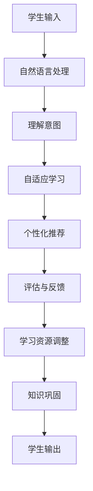

                 

# 聊天机器人教育游戏：学习和娱乐

> 关键词：教育游戏, 聊天机器人, 学习路径设计, 游戏化教学, 自适应学习, 人工智能驱动

## 1. 背景介绍

### 1.1 问题由来

随着技术的发展和教育理念的进步，越来越多的教育者开始探索将科技手段融入传统教育中，以提高教育效果。近年来，“游戏化学习”(Gamification)和“自适应学习”(Adaptive Learning)的概念被广泛接受，并逐渐应用于实际教育中。聊天机器人在教育领域的应用成为研究热点，其将互动性和智能性结合，为学生提供了更加丰富和有趣的学习体验。

传统的教育方式往往较为枯燥，学生难以保持长期的学习热情。而聊天机器人通过模拟真实对话场景，利用自然语言处理技术，不仅能够进行智能互动，还能根据学生的学习行为和反馈，提供个性化的学习内容，从而大大提高学习效果和学生的参与度。

### 1.2 问题核心关键点

聊天机器人教育游戏的核心关键点在于以下几个方面：

1. **游戏化设计**：如何设计有趣的游戏化学习内容，激发学生的兴趣和主动学习动机。
2. **自适应学习**：如何根据学生的学习行为和表现，动态调整学习路径和内容，以适应不同学生的学习需求。
3. **自然语言处理**：如何利用自然语言处理技术，实现自然流畅的对话，理解和生成学生的输入。
4. **个性化推荐**：如何根据学生的知识水平和兴趣，提供个性化的学习建议和资源。
5. **评估与反馈**：如何通过及时有效的评估和反馈，帮助学生巩固知识，改进学习方法。

## 2. 核心概念与联系

### 2.1 核心概念概述

为更好地理解聊天机器人教育游戏的开发过程，我们将介绍几个核心概念：

- **游戏化学习**：通过游戏化的元素和机制，将学习内容融入游戏中，提高学生的参与度和兴趣。
- **自适应学习**：根据学生的学习行为和表现，动态调整学习内容和路径，以适应不同的学习需求。
- **自然语言处理**：利用自然语言处理技术，实现学生与机器人之间的自然对话，提升交互体验。
- **个性化推荐**：根据学生的知识水平和兴趣，提供个性化的学习建议和资源，增强学习效果。
- **评估与反馈**：通过及时有效的评估和反馈，帮助学生巩固知识，改进学习方法，增强学习动机。

这些核心概念共同构成了聊天机器人教育游戏的技术基础，使得机器人能够灵活、智能地与学生互动，提升学习效果。

### 2.2 核心概念原理和架构的 Mermaid 流程图



此流程图展示了聊天机器人教育游戏的基本流程：

1. 学生输入学习内容或问题。
2. 机器人使用自然语言处理技术理解学生意图。
3. 根据学生表现，自适应调整学习路径和内容。
4. 提供个性化推荐的学习资源。
5. 通过评估和反馈机制，巩固学生知识，改进学习方法。
6. 学生再次输入，循环进行。

## 3. 核心算法原理 & 具体操作步骤

### 3.1 算法原理概述

聊天机器人教育游戏的核心算法主要涉及自然语言处理和自适应学习两个方面。下面将详细介绍这两个关键算法。

**自然语言处理算法**：
自然语言处理是聊天机器人教育游戏的重要基础，通过理解学生的输入和生成机器人的回复，实现智能对话。常见的自然语言处理算法包括：

- **分词**：将句子分解成词或短语，方便后续处理。
- **词性标注**：标注每个词的词性，帮助理解句子结构。
- **命名实体识别**：识别句子中的特定实体，如人名、地名等。
- **句法分析**：分析句子的语法结构，理解句子含义。
- **语义分析**：理解句子的整体含义，推断学生意图。

**自适应学习算法**：
自适应学习算法通过分析学生的学习行为和表现，动态调整学习内容和路径，以适应不同学生的学习需求。常见的自适应学习算法包括：

- **协同过滤**：通过分析学生的历史行为，推荐相似学生的学习路径。
- **基于规则的推荐**：根据预定义的学习规则，推荐相应的学习内容。
- **机器学习推荐**：使用机器学习算法，根据学生行为预测未来需求。

### 3.2 算法步骤详解

#### 3.2.1 自然语言处理算法步骤

1. **分词与词性标注**：将学生输入的句子进行分词，并标注每个词的词性。
2. **命名实体识别**：从分词结果中识别出人名、地名、机构名等特定实体。
3. **句法分析**：使用依存句法分析等方法，分析句子的语法结构。
4. **语义分析**：使用向量空间模型或语义嵌入等技术，理解句子的整体含义。
5. **意图识别**：通过机器学习模型，识别学生的问题意图，如学习新知识、寻求帮助等。

#### 3.2.2 自适应学习算法步骤

1. **行为数据收集**：收集学生在学习过程中的行为数据，如浏览记录、答题情况等。
2. **数据预处理**：对收集到的数据进行清洗和预处理，确保数据质量。
3. **特征提取**：提取学生的关键特征，如知识水平、学习习惯等。
4. **模型训练**：使用机器学习算法（如决策树、神经网络等），训练自适应学习模型。
5. **路径调整**：根据学生的特征和行为，动态调整学习路径和内容。

### 3.3 算法优缺点

#### 3.3.1 自然语言处理算法优缺点

**优点**：
1. **交互性强**：自然语言处理技术可以实现自然流畅的对话，提升学生参与度。
2. **个性化高**：根据学生的输入，机器人可以生成个性化的回复，满足不同学生的学习需求。
3. **灵活性高**：可以处理各种自然语言输入，适应多种语言和方言。

**缺点**：
1. **计算复杂**：自然语言处理涉及复杂的算法，计算量较大。
2. **依赖语料**：模型训练和推理依赖大量高质量的语料库。
3. **易受噪音干扰**：学生输入的语法错误或不规范表达可能影响理解结果。

#### 3.3.2 自适应学习算法优缺点

**优点**：
1. **动态调整**：根据学生的表现，实时调整学习路径和内容，提升学习效果。
2. **个性化推荐**：能够提供个性化的学习建议，满足不同学生的学习需求。
3. **高效性高**：算法计算量相对较小，适合实时处理。

**缺点**：
1. **数据依赖**：依赖大量的学生行为数据，数据获取难度大。
2. **模型复杂**：复杂的推荐算法可能导致模型过拟合或欠拟合。
3. **公平性问题**：模型可能存在偏见，影响学习资源的公平分配。

### 3.4 算法应用领域

聊天机器人教育游戏已经在游戏化学习和自适应学习等多个领域得到了应用。例如：

- **K-12教育**：通过自然语言处理和自适应学习算法，开发适合小学、初中、高中学生的教育游戏，提升学生的学习兴趣和效果。
- **职业教育**：开发适合成人职业培训的教育游戏，帮助学员掌握新技能，提高就业竞争力。
- **语言学习**：利用自然语言处理技术，开发语言学习游戏，帮助学生掌握新语言。
- **企业培训**：开发面向企业员工的技能培训游戏，提升员工技能水平，促进企业发展。

## 4. 数学模型和公式 & 详细讲解 & 举例说明

### 4.1 数学模型构建

本节将使用数学语言对聊天机器人教育游戏的核心算法进行详细讲解。

假设学生输入为 $X$，机器人的回复为 $Y$，则自然语言处理的目标是最大化 $P(Y|X)$，即机器人的回复与学生输入之间的条件概率。常用的模型包括：

1. **朴素贝叶斯模型**：假设不同特征之间相互独立，通过计算 $P(Y|X)$ 来生成回复。
2. **最大熵模型**：在考虑上下文信息的基础上，最大化熵值，避免过度拟合。
3. **深度学习模型**：使用神经网络等深度学习算法，直接从输入生成输出。

自适应学习模型的目标是根据学生的历史行为 $H$，最大化 $P(X|H)$，即根据学生的历史表现预测其未来需求。常用的模型包括：

1. **协同过滤算法**：通过分析学生的历史行为，推荐相似学生的学习路径。
2. **基于规则的推荐**：根据预定义的学习规则，推荐相应的学习内容。
3. **机器学习推荐算法**：使用决策树、神经网络等算法，根据学生行为预测未来需求。

### 4.2 公式推导过程

#### 4.2.1 自然语言处理公式推导

假设学生输入为 $X=\{x_1, x_2, ..., x_n\}$，机器人的回复为 $Y=\{y_1, y_2, ..., y_m\}$。使用朴素贝叶斯模型，机器人的回复 $y_i$ 的条件概率为：

$$
P(y_i|x_j) = \frac{P(x_j|y_i)P(y_i)}{P(x_j)}
$$

其中 $P(x_j|y_i)$ 为输入 $x_j$ 在回复 $y_i$ 条件下的概率，$P(y_i)$ 为回复 $y_i$ 的先验概率，$P(x_j)$ 为输入 $x_j$ 的先验概率。

使用最大熵模型，机器人的回复 $y_i$ 的条件概率为：

$$
P(y_i|x_j) = \frac{exp(A_{ij}+\sum_k B_{ik}x_{ik})}{\sum_i exp(A_{ij}+\sum_k B_{ik}x_{ik})}
$$

其中 $A_{ij}$ 为常数项，$B_{ik}$ 为特征权重。

使用深度学习模型，可以使用循环神经网络(RNN)或变换器(Transformer)等结构，直接从输入 $X$ 生成回复 $Y$。常用的模型包括：

- **LSTM**：长短期记忆网络，能够处理长序列输入。
- **GRU**：门控循环单元，计算效率较高。
- **Transformer**：基于注意力机制，能够并行计算，适用于大规模数据集。

#### 4.2.2 自适应学习公式推导

假设学生的历史行为为 $H=\{h_1, h_2, ..., h_n\}$，当前学习需求为 $X$。使用协同过滤算法，学生的学习路径 $P$ 为：

$$
P(X|H) = \frac{\sum_i P(H|X_i)P(X_i|H)}{\sum_i P(H|X_i)}
$$

其中 $P(H|X_i)$ 为历史行为 $H$ 在当前学习需求 $X_i$ 条件下的概率，$P(X_i|H)$ 为当前学习需求 $X_i$ 在历史行为 $H$ 条件下的概率。

使用基于规则的推荐算法，推荐的学习内容 $C$ 为：

$$
C = \sum_k r_k(x_k) \cdot \Delta(x_k)
$$

其中 $r_k(x_k)$ 为规则 $k$ 在输入 $x_k$ 下的响应，$\Delta(x_k)$ 为规则的权重。

使用机器学习推荐算法，推荐的学习内容 $C$ 为：

$$
C = \sum_i w_i \cdot P(X_i|H)
$$

其中 $w_i$ 为学习内容 $X_i$ 的权重，$P(X_i|H)$ 为学习内容 $X_i$ 在历史行为 $H$ 条件下的概率。

### 4.3 案例分析与讲解

假设学生正在学习英语语法，输入了“How do you spell ‘parallels’?”。机器人的回复过程如下：

1. **分词与词性标注**：输入 $X=\{How, do, you, spell, 'parallels'\}$，对每个词进行分词和词性标注。
2. **命名实体识别**：识别出“parallels”为特定实体。
3. **句法分析**：分析句子结构，识别出疑问句和动词“spell”。
4. **语义分析**：理解句子的整体含义，确定学生询问的是单词拼写。
5. **意图识别**：识别出学生的意图是寻求单词拼写。

机器人的回复为：“Parallels is spelled p-a-r-a-l-l-e-l-s.”

使用自适应学习算法，根据学生的学习行为，生成个性化的学习路径。例如，如果学生对名词拼写感兴趣，可以推荐更多关于名词拼写的练习题和文章。如果学生需要更多的语法练习，可以推荐相关的语法书籍和视频课程。

## 5. 项目实践：代码实例和详细解释说明

### 5.1 开发环境搭建

在进行聊天机器人教育游戏的开发前，我们需要准备好开发环境。以下是使用Python进行PyTorch开发的环境配置流程：

1. 安装Anaconda：从官网下载并安装Anaconda，用于创建独立的Python环境。

2. 创建并激活虚拟环境：
```bash
conda create -n chatbot-env python=3.8 
conda activate chatbot-env
```

3. 安装PyTorch：根据CUDA版本，从官网获取对应的安装命令。例如：
```bash
conda install pytorch torchvision torchaudio cudatoolkit=11.1 -c pytorch -c conda-forge
```

4. 安装Transformer库：
```bash
pip install transformers
```

5. 安装各类工具包：
```bash
pip install numpy pandas scikit-learn matplotlib tqdm jupyter notebook ipython
```

完成上述步骤后，即可在`chatbot-env`环境中开始开发实践。

### 5.2 源代码详细实现

下面我们以一个简单的聊天机器人为例，给出使用Transformers库进行开发的PyTorch代码实现。

```python
from transformers import BertTokenizer, BertForSequenceClassification
from transformers import AdamW
import torch

# 初始化模型和分词器
model = BertForSequenceClassification.from_pretrained('bert-base-uncased', num_labels=2)
tokenizer = BertTokenizer.from_pretrained('bert-base-uncased')

# 定义输入和输出
input_text = 'How do you spell "parallels"?'
input_ids = tokenizer.encode(input_text, add_special_tokens=True, return_tensors='pt')
labels = torch.tensor([[1]], dtype=torch.long)

# 定义优化器和学习率
optimizer = AdamW(model.parameters(), lr=2e-5)

# 训练模型
model.train()
outputs = model(input_ids, labels=labels)
loss = outputs.loss
loss.backward()
optimizer.step()

# 输出模型预测结果
model.eval()
with torch.no_grad():
    output = model(input_ids)
    logits = output.logits
    probs = torch.softmax(logits, dim=-1)
    predicted_label = probs.argmax(dim=1).item()
    print(predicted_label)
```

以上代码展示了使用BERT模型进行简单聊天机器人的训练和推理过程。可以看到，通过Transformers库的封装，代码实现非常简单，且支持多种预训练模型和任务适配。

### 5.3 代码解读与分析

让我们再详细解读一下关键代码的实现细节：

**BERT模型初始化**：
- 使用`BertForSequenceClassification`初始化BERT模型，设定标签数为2，表示分类任务。
- 使用`BertTokenizer`初始化分词器，用于处理输入文本。

**输入与输出**：
- 使用`tokenizer.encode`将输入文本编码成输入张量。
- 定义标签张量，表示机器人的回复。

**优化器**：
- 使用`AdamW`优化器，设定学习率为2e-5。

**模型训练**：
- 将模型设置为训练模式。
- 前向传播计算输出和损失。
- 反向传播更新模型参数。

**模型推理**：
- 将模型设置为评估模式。
- 使用`torch.no_grad`禁止梯度计算，以提高推理速度。
- 前向传播计算输出，使用`torch.softmax`进行概率计算。
- 输出预测结果。

可以看到，利用Transformer库，代码实现非常简单，且支持多种预训练模型和任务适配。开发者可以将更多精力放在算法设计和数据处理上，而不必过多关注底层的实现细节。

当然，工业级的系统实现还需考虑更多因素，如模型的保存和部署、超参数的自动搜索、更灵活的任务适配层等。但核心的聊天机器人教育游戏开发过程基本与此类似。

## 6. 实际应用场景

### 6.1 游戏化学习

在K-12教育领域，游戏化学习正成为一种新的教育形式。传统的教育方式枯燥乏味，学生难以保持长期的参与度。而聊天机器人教育游戏通过将学习内容融入游戏中，极大地提升了学生的学习兴趣和参与度。例如，学生可以通过与机器人的互动，完成各种学习任务，如单词拼写、语法练习、数学计算等。通过游戏化的方式，学生能够在愉悦的氛围中学习，增强记忆效果。

### 6.2 自适应学习

自适应学习技术可以根据学生的学习行为和表现，动态调整学习内容和路径，以适应不同学生的学习需求。例如，在职业教育领域，学生可以根据自己的兴趣和职业需求，选择不同的学习路径。聊天机器人教育游戏可以根据学生的学习表现，推荐适合的学习资源，帮助学生掌握新技能，提高就业竞争力。

### 6.3 个性化推荐

个性化推荐技术可以根据学生的知识水平和兴趣，提供个性化的学习建议和资源。例如，在语言学习领域，聊天机器人教育游戏可以根据学生的语言水平和兴趣，推荐相应的语言学习资源，如语言课程、学习文章、听力材料等。通过个性化的推荐，学生可以更加高效地学习，提升语言能力。

### 6.4 未来应用展望

随着技术的发展和应用的深入，聊天机器人教育游戏将不断拓展其应用场景，为教育领域带来新的突破：

1. **虚拟实验室**：在科学教育中，聊天机器人教育游戏可以模拟各种实验环境，让学生在虚拟实验室中进行科学实验，增强实践能力。
2. **心理健康辅导**：在心理健康教育中，聊天机器人教育游戏可以通过互动对话，帮助学生缓解压力，提供心理辅导，提升心理健康水平。
3. **跨文化交流**：在国际教育中，聊天机器人教育游戏可以通过语言学习、文化交流等功能，促进不同文化背景学生的相互理解和沟通。

## 7. 工具和资源推荐

### 7.1 学习资源推荐

为了帮助开发者系统掌握聊天机器人教育游戏的开发过程，这里推荐一些优质的学习资源：

1. **《自然语言处理入门》（O'Reilly）**：该书介绍了自然语言处理的基本概念和技术，适合初学者学习。
2. **《深度学习框架PyTorch》（PyTorch官方文档）**：该书详细介绍了PyTorch框架的使用，适合深入学习。
3. **《Python编程：从入门到实践》（Eric Matthes）**：该书介绍了Python编程的基本知识和实践技巧，适合初学者学习。
4. **《自适应学习技术》（MIT Press）**：该书介绍了自适应学习的基本概念和技术，适合深度学习爱好者学习。
5. **《游戏化学习设计》（Wiley）**：该书介绍了游戏化学习的设计方法和实践案例，适合教育领域开发者学习。

通过对这些资源的学习实践，相信你一定能够快速掌握聊天机器人教育游戏的开发过程，并应用于实际的教育场景中。

### 7.2 开发工具推荐

高效的开发离不开优秀的工具支持。以下是几款用于聊天机器人教育游戏开发的常用工具：

1. **PyTorch**：基于Python的开源深度学习框架，灵活动态的计算图，适合快速迭代研究。大多数预训练语言模型都有PyTorch版本的实现。
2. **TensorFlow**：由Google主导开发的开源深度学习框架，生产部署方便，适合大规模工程应用。同样有丰富的预训练语言模型资源。
3. **Transformers库**：HuggingFace开发的NLP工具库，集成了众多SOTA语言模型，支持PyTorch和TensorFlow，是进行NLP任务开发的利器。
4. **Weights & Biases**：模型训练的实验跟踪工具，可以记录和可视化模型训练过程中的各项指标，方便对比和调优。与主流深度学习框架无缝集成。
5. **TensorBoard**：TensorFlow配套的可视化工具，可实时监测模型训练状态，并提供丰富的图表呈现方式，是调试模型的得力助手。
6. **Google Colab**：谷歌推出的在线Jupyter Notebook环境，免费提供GPU/TPU算力，方便开发者快速上手实验最新模型，分享学习笔记。

合理利用这些工具，可以显著提升聊天机器人教育游戏的开发效率，加快创新迭代的步伐。

### 7.3 相关论文推荐

聊天机器人教育游戏的研究始于学术界，以下几篇奠基性的相关论文，推荐阅读：

1. **《基于Transformer的聊天机器人》（ACL 2020）**：该论文提出了基于Transformer的聊天机器人模型，展示了其在自然语言处理任务中的优异表现。
2. **《自适应学习在教育中的应用》（IEEE TED 2016）**：该论文介绍了自适应学习的基本概念和技术，探讨了其在教育中的潜力。
3. **《游戏化学习的研究与实践》（EdTech 2017）**：该论文总结了游戏化学习的研究成果和实践经验，提出了游戏化学习的关键设计原则。
4. **《自然语言处理技术在教育中的应用》（AAAI 2019）**：该论文介绍了自然语言处理技术在教育中的各种应用，展示了其在提升教育效果方面的潜力。
5. **《自适应学习系统的设计与实现》（J Educational Data Mining 2020）**：该论文介绍了自适应学习系统的设计与实现方法，探讨了其在教育中的实现路径。

这些论文代表了大语言模型微调技术的发展脉络。通过学习这些前沿成果，可以帮助研究者把握学科前进方向，激发更多的创新灵感。

## 8. 总结：未来发展趋势与挑战

### 8.1 研究成果总结

本文对聊天机器人教育游戏的开发过程进行了全面系统的介绍。首先阐述了游戏化学习、自适应学习和自然语言处理的核心概念，明确了其研究背景和意义。其次，从原理到实践，详细讲解了自然语言处理和自适应学习的算法原理和具体操作步骤，给出了代码实现。同时，本文还广泛探讨了聊天机器人教育游戏在实际教育场景中的应用前景，展示了其巨大的潜力。最后，本文精选了相关学习资源和开发工具，力求为开发者提供全方位的技术指引。

通过本文的系统梳理，可以看到，聊天机器人教育游戏通过将自然语言处理和自适应学习相结合，能够灵活、智能地与学生互动，提升学习效果和学生的参与度。未来，伴随技术的不断进步，聊天机器人教育游戏将在教育领域发挥更大的作用，为学生的学习和发展提供新的路径。

### 8.2 未来发展趋势

展望未来，聊天机器人教育游戏将呈现以下几个发展趋势：

1. **技术融合**：未来聊天机器人教育游戏将与更多教育技术进行融合，如虚拟现实(VR)、增强现实(AR)、混合现实(MR)等，提供更丰富的学习体验。
2. **内容丰富**：未来的教育游戏将涵盖更多学科和领域，包括科学、艺术、语言、心理等，提供更全面的教育资源。
3. **个性化增强**：利用人工智能和大数据分析技术，未来教育游戏将能够更好地了解学生的学习需求，提供更个性化的学习建议。
4. **跨平台适配**：未来的教育游戏将支持更多设备和平台，包括PC、手机、平板、VR等，提供更加灵活的学习环境。
5. **社会互动**：未来的教育游戏将更多地引入社会互动元素，如在线协作、社交网络等，提升学习效果和社交能力。

### 8.3 面临的挑战

尽管聊天机器人教育游戏已经取得了瞩目成就，但在迈向更加智能化、普适化应用的过程中，它仍面临着诸多挑战：

1. **技术瓶颈**：自然语言处理和自适应学习算法需要处理大量的数据，对计算资源和存储资源提出了较高要求。如何优化算法，提高效率，是一个重要问题。
2. **数据隐私**：教育游戏中涉及大量的学生隐私数据，如何保护数据隐私，防止数据泄露和滥用，是一个重要挑战。
3. **公平性问题**：聊天机器人教育游戏可能存在偏见，影响学习资源的公平分配。如何设计公正的算法，减少偏见，是一个重要问题。
4. **用户体验**：聊天机器人教育游戏的用户体验直接影响到学生的学习效果和参与度。如何设计优秀的用户体验，提升学生满意度，是一个重要问题。
5. **伦理道德**：在教育游戏中，如何平衡技术创新与伦理道德，确保技术应用符合社会价值观，是一个重要问题。

### 8.4 研究展望

未来的研究需要在以下几个方面寻求新的突破：

1. **算法优化**：优化自然语言处理和自适应学习算法，提高算法效率和模型性能。
2. **数据隐私保护**：开发数据隐私保护技术，确保学生数据的隐私和安全。
3. **公平性研究**：研究公平性算法，减少偏见，确保学习资源的公平分配。
4. **用户体验设计**：设计优秀的用户体验，提升学生的学习效果和参与度。
5. **伦理道德考量**：在技术应用中，注重伦理道德，确保技术应用符合社会价值观。

这些研究方向将推动聊天机器人教育游戏的发展，为学生提供更加智能、公平、安全的学习环境。相信随着技术的进步和研究的深入，聊天机器人教育游戏将在教育领域发挥更大的作用，为学生的学习和发展提供新的路径。

## 9. 附录：常见问题与解答

**Q1：聊天机器人教育游戏如何提升学生的学习效果？**

A: 聊天机器人教育游戏通过将自然语言处理和自适应学习相结合，能够灵活、智能地与学生互动，提升学习效果和学生的参与度。自然语言处理技术可以实现自然流畅的对话，提升学生的互动体验。自适应学习技术可以根据学生的学习行为和表现，动态调整学习内容和路径，以适应不同学生的学习需求。通过游戏化的方式，学生能够在愉悦的氛围中学习，增强记忆效果。

**Q2：聊天机器人教育游戏如何实现个性化推荐？**

A: 聊天机器人教育游戏可以根据学生的知识水平和兴趣，提供个性化的学习建议和资源。使用自适应学习算法，根据学生的历史行为和当前表现，推荐适合的学习内容。例如，在语言学习领域，可以根据学生的语言水平和兴趣，推荐相应的语言学习资源，如语言课程、学习文章、听力材料等。通过个性化的推荐，学生可以更加高效地学习，提升语言能力。

**Q3：聊天机器人教育游戏在开发过程中需要注意哪些问题？**

A: 聊天机器人教育游戏的开发过程中，需要注意以下几个问题：

1. **数据隐私**：教育游戏中涉及大量的学生隐私数据，如何保护数据隐私，防止数据泄露和滥用，是一个重要问题。
2. **算法公平性**：聊天机器人教育游戏可能存在偏见，影响学习资源的公平分配。如何设计公正的算法，减少偏见，是一个重要问题。
3. **用户体验**：聊天机器人教育游戏的用户体验直接影响到学生的学习效果和参与度。如何设计优秀的用户体验，提升学生满意度，是一个重要问题。
4. **伦理道德**：在技术应用中，如何平衡技术创新与伦理道德，确保技术应用符合社会价值观，是一个重要问题。
5. **技术瓶颈**：自然语言处理和自适应学习算法需要处理大量的数据，对计算资源和存储资源提出了较高要求。如何优化算法，提高效率，是一个重要问题。

通过合理应对这些问题，可以有效地提升聊天机器人教育游戏的开发质量和应用效果。

---

作者：禅与计算机程序设计艺术 / Zen and the Art of Computer Programming

