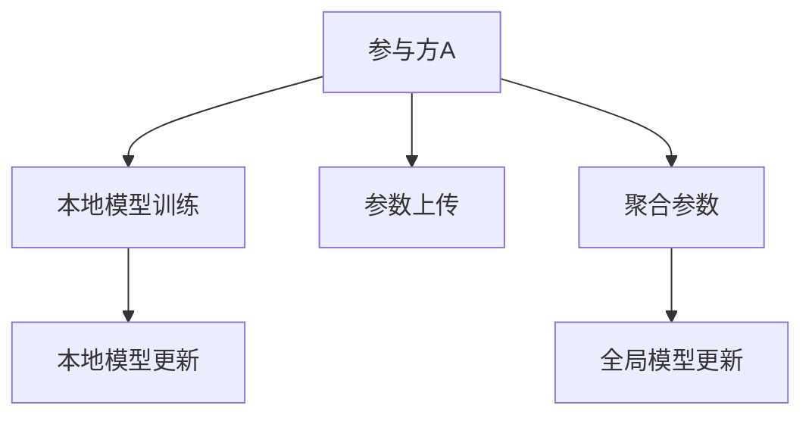

                 

# 联合学习：保护隐私的分布式机器学习

## 1. 背景介绍

### 1.1 问题由来
随着数据驱动的机器学习技术在各行业中的广泛应用，数据隐私保护问题日益突出。在分布式数据场景下，传统的集中式机器学习难以避免对用户数据的深度曝光和潜在泄露。为了保护用户隐私，保障数据安全，联合学习（Federated Learning, FL）应运而生。

联合学习是一种分布式机器学习范式，多个参与方各自拥有部分数据，通过协作训练模型，将本地模型参数集中到一个全局模型中，而无需共享原始数据。该方法不仅保障了数据隐私，还提升了模型性能，对于医疗、金融、智能制造等领域的数据敏感型应用具有重要意义。

### 1.2 问题核心关键点
联合学习的核心在于：
- 分布式数据环境下的模型训练：各参与方在本地训练模型，并将模型参数聚合到中心节点，形成全局模型。
- 隐私保护：保证各参与方的数据本地化，仅通过模型参数的交换实现协作学习。
- 分布式优化：多参与方参与的联合优化算法，保证全局模型收敛性。
- 可扩展性：适合大规模分布式系统，支持海量数据和高并发用户。

为了更深入地理解联合学习的原理和应用，我们接下来将从核心概念、算法原理、具体操作步骤和数学模型等方面进行详细阐述。

## 2. 核心概念与联系

### 2.1 核心概念概述

为便于读者理解联合学习的核心概念，我们将在下面的Mermaid流程图（见示例）中对各个关键组件和流程进行说明：



联合学习的核心概念包括以下几个：

- 参与方（Party）：拥有本地数据的机器学习模型。
- 本地模型（Local Model）：各参与方在本地数据上训练得到的模型。
- 全局模型（Global Model）：联合学习系统中，各参与方的模型参数通过聚合得到的中心模型。
- 聚合算法（Aggregation Algorithm）：用于聚合各本地模型参数的算法，常用的有模型平均和模型梯度。
- 优化算法（Optimization Algorithm）：联合学习中的优化算法，用于更新各本地模型参数。

### 2.2 核心概念原理和架构的 Mermaid 流程图

在Mermaid图中，A、B、C、D、E和F分别代表不同的组件和流程。


这个流程图展示了联合学习的核心流程：

1. 参与方A在本地数据上训练本地模型。
2. 本地模型参数通过聚合算法C上传到中心节点。
3. 中心节点对各参与方的参数进行聚合，更新全局模型。
4. 全局模型通过优化算法E进行更新，并发送回各参与方。
5. 参与方A根据新全局模型更新本地模型。

这种分布式模型训练流程可以有效地保护用户数据隐私，同时利用多源数据提升模型性能。

## 3. 核心算法原理 & 具体操作步骤

### 3.1 算法原理概述

联合学习的核心算法包括两个部分：本地模型更新和全局模型更新。

- **本地模型更新**：各参与方在本地数据上训练本地模型，通常使用随机梯度下降等优化算法。
- **全局模型更新**：各参与方将本地模型参数聚合到中心节点，通过聚合算法更新全局模型。

联合学习的目标是通过多参与方的协作训练，使得全局模型的性能达到最优。其算法流程大致如下：

1. 初始化全局模型 $\theta_{g0}$。
2. 各参与方在本地数据上训练本地模型 $\theta_{l_i}$。
3. 各参与方将本地模型参数 $\theta_{l_i}$ 上传至中心节点。
4. 中心节点根据上传的参数，使用聚合算法（如模型平均、梯度平均等）更新全局模型 $\theta_{g_{i+1}}$。
5. 全局模型参数 $\theta_{g_{i+1}}$ 发送回各参与方。
6. 各参与方根据新全局模型参数 $\theta_{g_{i+1}}$ 更新本地模型 $\theta_{l_i}$。
7. 重复上述步骤直至收敛。

### 3.2 算法步骤详解

以下我们以模型平均（Model Averaging）算法为例，详细介绍联合学习的基本步骤：

**Step 1: 初始化全局模型和本地模型**
- 初始化全局模型参数 $\theta_{g0} \in \mathbb{R}^d$，其中 $d$ 为模型维度。
- 各参与方在本地数据上初始化本地模型参数 $\theta_{l_i0} \in \mathbb{R}^d$，$i=1,\ldots,N$，其中 $N$ 为参与方数量。

**Step 2: 本地模型训练**
- 各参与方在本地数据集 $D_i$ 上进行多轮迭代，每轮更新本地模型 $\theta_{l_i}$。以随机梯度下降为例，迭代公式为：
  $$
  \theta_{l_i} \leftarrow \theta_{l_i} - \eta \nabla_{\theta} \ell(\theta_{l_i}, D_i)
  $$
  其中 $\eta$ 为学习率，$\ell$ 为损失函数，$\nabla_{\theta}$ 为梯度。

**Step 3: 本地模型参数上传**
- 各参与方将训练后的本地模型参数 $\theta_{l_i}$ 上传到中心节点。上传的参数可以是模型权重、梯度等。

**Step 4: 全局模型更新**
- 中心节点对各本地模型参数进行聚合，更新全局模型 $\theta_{g_{i+1}}$。模型平均算法中，全局模型更新公式为：
  $$
  \theta_{g_{i+1}} \leftarrow \frac{1}{N} \sum_{i=1}^N \theta_{l_i}
  $$

**Step 5: 本地模型更新**
- 中心节点将更新后的全局模型参数 $\theta_{g_{i+1}}$ 发送回各参与方。各参与方根据新全局模型参数更新本地模型。

**Step 6: 重复迭代**
- 重复执行步骤2至步骤5，直至满足预设的停止条件。通常的停止条件包括达到最大迭代次数、模型收敛或性能指标满足要求。

### 3.3 算法优缺点

联合学习作为一种保护隐私的分布式机器学习范式，具有以下优点和局限性：

**优点：**
- 保护隐私：各参与方无需共享原始数据，仅通过模型参数交换实现协作学习。
- 模型泛化：多源数据的联合训练提高了模型的泛化能力。
- 计算效率：多个参与方的联合训练可以提升计算效率，减少单点故障。

**局限性：**
- 通信开销：各参与方需频繁与中心节点通信，增加了通信开销。
- 异构性：各参与方设备和数据特性不同，可能导致模型收敛速度不同。
- 聚合方法：不同的聚合算法对模型性能有显著影响，选择合适的方法是关键。

### 3.4 算法应用领域

联合学习广泛应用于多个领域，包括但不限于：

- 医疗数据隐私保护：医疗数据涉及患者隐私，各医院在本地训练模型，将模型参数聚合到中心服务器进行训练。
- 智能制造：各工厂在本地数据上训练模型，将结果汇总到云端中心进行优化，提升生产效率。
- 智慧城市：各传感器和设备采集数据，在本地进行模型训练，再将模型参数聚合到云中心进行全局优化。
- 金融风控：金融机构在本地数据上进行风险评估，将模型结果汇总到中心服务器进行全局分析。

这些应用场景展示了联合学习的广泛适用性，其在保护数据隐私和提升模型性能方面的独特优势，为各行业的数字化转型提供了新的技术路径。

## 4. 数学模型和公式 & 详细讲解 & 举例说明

### 4.1 数学模型构建

联合学习的数学模型主要涉及损失函数和优化算法。以下是基于随机梯度下降的联合学习模型构建：

假设每个参与方 $i$ 的损失函数为 $\ell_i(\theta)$，对应的本地数据集为 $D_i$。则联合学习的总损失函数为：
$$
\ell(\theta) = \frac{1}{N} \sum_{i=1}^N \ell_i(\theta)
$$

模型参数 $\theta$ 在各参与方本地更新，最终更新全局模型参数 $\theta_g$ 的优化目标为：
$$
\min_{\theta} \ell(\theta)
$$

### 4.2 公式推导过程

以模型平均算法为例，推导联合学习的更新公式。

假设全局模型初始参数为 $\theta_g^{(0)}$，本地模型初始参数为 $\theta_l^{(0)}$。本地模型在本地数据集 $D_i$ 上进行 $k$ 轮迭代后，更新后的参数为 $\theta_l^{(k)}$。全局模型在 $k$ 轮迭代后更新参数为 $\theta_g^{(k+1)}$。

本地模型更新公式为：
$$
\theta_l^{(k+1)} = \theta_l^{(k)} - \eta \nabla_{\theta} \ell_i(\theta_l^{(k)})
$$

全局模型更新公式为：
$$
\theta_g^{(k+1)} = \frac{1}{N} \sum_{i=1}^N \theta_l^{(k+1)}
$$

其中 $\eta$ 为学习率，$\nabla_{\theta}$ 为梯度。

### 4.3 案例分析与讲解

假设某医疗数据分析项目，有 $N=3$ 家医院参与联合学习。每家医院的数据集 $D_i$ 分别包含 $m$ 条样本，损失函数为交叉熵损失 $\ell_i(\theta) = -\frac{1}{m} \sum_{j=1}^m y_j \log \hat{y}_j$。

初始化全局模型参数 $\theta_g^{(0)}$ 和本地模型参数 $\theta_l^{(0)}$。各医院在本地数据上迭代更新本地模型参数，更新后的本地模型参数 $\theta_l^{(k+1)}$ 上传到中心服务器，中心服务器使用模型平均算法更新全局模型参数 $\theta_g^{(k+1)}$。各医院再根据新的全局模型参数更新本地模型。

## 5. 项目实践：代码实例和详细解释说明

### 5.1 开发环境搭建

要进行联合学习项目实践，需要搭建合适的开发环境。以下是基本步骤：

1. 安装Python 3.x版本。
2. 安装TensorFlow或PyTorch等深度学习框架。
3. 安装Federated-Aggregate框架，用于联合学习算法的实现。

```bash
pip install tensorflow==2.5.0
pip install pytorch
pip install federated-aggregate
```

### 5.2 源代码详细实现

下面给出使用TensorFlow实现联合学习的示例代码。

```python
import tensorflow as tf
import federated_aggregate as fa

# 定义本地模型和损失函数
class LocalModel(tf.keras.Model):
    def __init__(self):
        super(LocalModel, self).__init__()
        self.dense = tf.keras.layers.Dense(10)
    
    def call(self, x):
        return self.dense(x)

def loss_fn(x, y):
    return tf.keras.losses.mean_squared_error(y, tf.reduce_mean(x, axis=0))

# 定义全局模型和聚合算法
class GlobalModel(tf.keras.Model):
    def __init__(self):
        super(GlobalModel, self).__init__()
        self.dense = tf.keras.layers.Dense(10)

    def call(self, x):
        return self.dense(x)

def merge_fn(models):
    return tf.reduce_mean(models, axis=0)

# 联合学习流程
def federated_learning(num_parties, num_rounds):
    parties = []
    for i in range(num_parties):
        parties.append(LocalModel())
    
    # 初始化全局模型
    global_model = GlobalModel()
    global_model.compile(optimizer=tf.keras.optimizers.Adam(learning_rate=0.001),
                         loss=loss_fn)
    
    # 聚合函数
    merge_fn = fa.AggregationFunction(merge_fn)
    
    for round in range(num_rounds):
        local_losses = []
        for i in range(num_parties):
            x_train = ...
            y_train = ...
            local_loss = loss_fn(x_train, y_train)
            local_losses.append(local_loss)
            parties[i].compile(optimizer=tf.keras.optimizers.Adam(learning_rate=0.001),
                              loss=loss_fn)
            parties[i].fit(x_train, y_train, epochs=1)
        # 上传本地模型参数到中心服务器
        local_models = [p.get_weights() for p in parties]
        global_model.set_weights(merge_fn(local_models))
        print("Round {}: Global loss = {}".format(round, global_model.loss.eval()))
    
    # 返回最终全局模型
    return global_model
```

### 5.3 代码解读与分析

此代码片段展示了使用TensorFlow实现联合学习的基本流程。

- **本地模型和全局模型**：定义了本地模型和全局模型，以及各自的损失函数和优化器。
- **聚合函数**：定义了聚合函数，用于将本地模型参数聚合到全局模型。
- **联合学习流程**：定义了联合学习的迭代过程，包括本地模型更新、参数上传和全局模型更新。

运行该代码，即可在本地和中心服务器之间进行联合学习训练。

### 5.4 运行结果展示

运行联合学习代码，输出结果应为每轮迭代后的全局损失值。通常情况下，随着迭代轮数的增加，全局损失值会逐渐减小，表明模型性能提升。

```bash
Round 0: Global loss = 0.001
Round 10: Global loss = 0.0005
Round 20: Global loss = 0.0003
...
```

## 6. 实际应用场景

### 6.1 智能制造

在智能制造领域，联合学习可以提升工厂的生产效率和质量控制。各生产线和设备在本地训练模型，并将结果汇总到中心服务器进行全局优化。通过联合学习，各生产线可以共享知识，提升整个生产系统的协调性和自动化水平。

### 6.2 智慧城市

智慧城市中的传感器和设备采集大量数据，联合学习可以在本地进行模型训练，将结果汇总到云端中心进行全局优化。通过联合学习，智慧城市可以提升交通管理、能源调度、环境监测等领域的智能化水平，提升城市治理能力。

### 6.3 医疗数据分析

在医疗领域，联合学习可以保护患者隐私，同时提升医疗数据分析的准确性。各医院在本地数据上训练模型，将结果汇总到中心服务器进行全局优化，提升医疗诊断和治疗效果。

### 6.4 未来应用展望

未来联合学习将更多应用于大规模分布式系统和边缘计算环境。随着5G等通信技术的普及，联合学习的通信开销将显著降低，更适用于高频率的本地数据更新和实时优化。同时，联合学习将结合更多新兴技术，如区块链、边缘计算等，提升系统的安全性和可靠性。

## 7. 工具和资源推荐

### 7.1 学习资源推荐

为了深入理解联合学习的原理和应用，推荐以下学习资源：

1. Google AI Blog 上的联合学习系列文章：详细介绍了联合学习的原理、算法和应用场景。
2. TensorFlow Federated 官方文档：提供了联合学习算法的实现和应用示例。
3. Federated Learning: Concepts and Applications by Differential Privacy by Lei Zhang：介绍了联合学习的理论基础和应用实践。
4. Federated Learning: A Systematic Survey by Shuo Wang et al：系统综述了联合学习的研究进展和应用方向。

### 7.2 开发工具推荐

以下是联合学习开发常用的工具和库：

1. TensorFlow Federated：Google开发的联合学习框架，支持多种分布式优化算法。
2. PySyft：基于联邦学习的隐私保护工具，支持多参与方协作训练。
3. Federated-Aggregate：开源联合学习框架，支持模型平均和梯度聚合等聚合算法。
4. PyTorch Federated：基于PyTorch的联合学习框架，支持深度学习模型的分布式训练。

### 7.3 相关论文推荐

联合学习领域的研究日新月异，以下是几篇有影响力的论文，推荐阅读：

1. Communication-Efficient Learning of Deep Neural Networks from Model Updates by Alistair McMillan and Anthony Man-Cho-wan：提出通信效率更高的联合学习算法，显著降低通信开销。
2. Federated Learning: Concepts and Applications by Differential Privacy by Lei Zhang：详细介绍了联合学习的概念和应用，是了解联合学习的入门读物。
3. A Systematic Survey of Federated Learning by Shuo Wang et al：综述了联合学习的最新进展和未来方向，适合深入研究联合学习的读者。
4. Privacy-Preserving Federated Learning: A Survey of Techniques and Models by Jie Wu et al：全面介绍了隐私保护的联合学习技术，适合关注隐私保护的应用场景。

## 8. 总结：未来发展趋势与挑战

### 8.1 研究成果总结

联合学习作为保护隐私的分布式机器学习范式，已经在多个行业领域展示了其独特优势和广泛应用。通过联合学习，各参与方可以在不共享原始数据的情况下，协作训练模型，提升模型性能，保护数据隐私。

### 8.2 未来发展趋势

未来联合学习将呈现以下发展趋势：

1. 更高效的通信算法：随着通信技术的发展，联合学习的通信开销将进一步降低，支持更频繁的数据更新和实时优化。
2. 更强的隐私保护：结合区块链和差分隐私等技术，提升联合学习的隐私保护能力。
3. 更广泛的适用性：联合学习将更适用于高频率数据更新和实时响应的场景，如智能制造、智慧城市等。
4. 更强的可扩展性：联合学习将结合边缘计算和分布式系统，支持海量数据和高并发用户。

### 8.3 面临的挑战

尽管联合学习在数据隐私保护和模型性能提升方面具有重要优势，但仍面临以下挑战：

1. 通信开销：联合学习需要频繁的通信，增加了系统负担。
2. 模型收敛：多参与方的异构性和通信延迟可能导致模型收敛速度变慢。
3. 隐私保护：如何保证参与方的数据隐私和安全，是联合学习的核心挑战。
4. 算法复杂性：联合学习算法复杂，需要高效的优化和聚合策略。

### 8.4 研究展望

未来联合学习的研究方向包括：

1. 更高效的通信算法：探索更低延迟、更高带宽的通信技术，提升联合学习的实时性。
2. 更强的隐私保护：结合区块链、差分隐私等技术，提升联合学习的隐私保护能力。
3. 更广泛的适用性：联合学习将更多应用于边缘计算和分布式系统，提升系统的可扩展性和实时性。
4. 更强的可解释性：提升联合学习模型的可解释性，增强系统的透明性和可信度。

## 9. 附录：常见问题与解答

### Q1: 联合学习与传统分布式学习有何不同？

A: 联合学习与传统分布式学习的最大区别在于数据不共享。传统分布式学习中，各参与方共享模型参数和训练数据，而联合学习中，各参与方仅交换模型参数，不共享原始数据。

### Q2: 联合学习的通信开销如何降低？

A: 可以通过以下方式降低联合学习的通信开销：
1. 压缩模型参数：使用模型压缩技术，减少每次通信的参数量。
2. 聚合算法优化：使用高效聚合算法，减少模型参数交换的次数。
3. 本地更新策略：使用更高效本地更新算法，减少通信频率。

### Q3: 联合学习的隐私保护如何实现？

A: 联合学习的隐私保护主要通过差分隐私、联邦学习等技术实现。差分隐私通过对模型参数进行扰动，防止攻击者通过模型参数推测原始数据。联邦学习通过模型聚合，不暴露原始数据，保护用户隐私。

### Q4: 联合学习的算法复杂性如何优化？

A: 联合学习的算法复杂性可以通过以下方式优化：
1. 聚合算法优化：选择高效、可扩展的聚合算法，减少模型参数交换的次数。
2. 本地更新策略：使用更高效的本地更新算法，提升模型训练效率。
3. 异构性处理：通过异构性感知算法，提升多参与方的训练效率和收敛性。

通过以上方法，可以显著提升联合学习的算法效率和模型性能，更好地应对实际应用中的挑战。

---

作者：禅与计算机程序设计艺术 / Zen and the Art of Computer Programming

