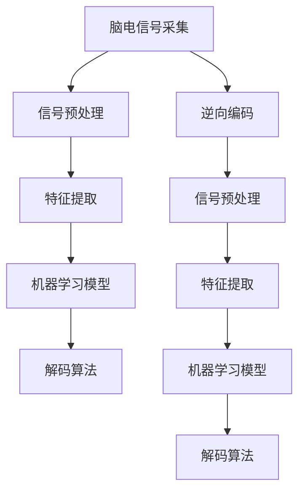

                 

# 脑机接口创业：思维控制技术的商业化

## 1. 背景介绍

### 1.1 问题由来
脑机接口（Brain-Computer Interface, BCI）技术通过直接解析人类思维信号，实现对外部设备的控制。近年来，随着神经科学、神经工程、人工智能等领域的飞速发展，脑机接口技术从实验室研究走向市场应用。世界各大科技巨头如Facebook、谷歌、IBM等纷纷布局BCI领域，探索思维控制的商业化可能性。

脑机接口技术的核心在于将人脑的电生理信号转化为计算机可识别的数字信号。这种技术不仅能够辅助残障人士恢复行动能力，还可以在医疗、娱乐、智能交互等多个领域开辟新的应用场景。尽管如此，当前脑机接口技术仍处于探索和初步应用阶段，商业化道路上仍面临诸多技术、市场、伦理等挑战。

### 1.2 问题核心关键点
脑机接口商业化面临的核心问题主要包括以下几个方面：
1. **数据采集与信号解析**：高质量的数据是脑机接口系统可靠运行的基础，如何高效、准确地采集和解析人脑信号是首要难题。
2. **模型训练与性能提升**：脑机接口模型的训练需要大量标注数据，如何提升模型性能，减少误判率，是其商业化成功的关键。
3. **用户体验与操作便捷性**：用户体验直接影响产品的市场接受度，脑机接口设备如何设计，使用便捷，具有高感知度，是一个重要考量。
4. **法律法规与伦理问题**：脑机接口技术涉及个人隐私和伦理道德，如何在确保用户隐私和数据安全的前提下，进行商业化操作，是一个迫切需要解决的问题。
5. **市场教育与推广**：脑机接口技术相对于传统认知较为陌生，如何进行市场教育，推广相关知识，增强用户的理解和接受度，是成功商业化的重要环节。

### 1.3 问题研究意义
脑机接口技术的商业化不仅能够推动神经科学与工程的研究进展，还将带来巨大的社会经济效益，改善残障人士的生活质量，创造新的经济增长点。通过探索脑机接口技术的商业化路径，可以为其他前沿技术如人工智能、增强现实等提供宝贵的经验和教训，加速其在不同行业的应用落地。

## 2. 核心概念与联系

### 2.1 核心概念概述

脑机接口技术涉及多个关键概念，包括但不限于：

- **脑电信号采集**：通过脑电图（EEG）等手段获取人脑电生理信号。
- **信号预处理**：对原始脑电信号进行滤波、降噪、归一化等预处理操作。
- **特征提取**：从预处理后的脑电信号中提取有用特征，如功率谱密度、相位同步度等。
- **机器学习模型**：使用深度学习、统计学习等算法建立脑电信号与外部设备操作之间的映射关系。
- **解码算法**：将提取的特征映射到目标输出，如运动指令、语音命令等。
- **逆向编码**：将外界输入信号通过解码算法转化为脑电信号，实现双向通讯。

这些概念之间的联系紧密，共同构成了脑机接口技术的完整工作流程。

### 2.2 核心概念原理和架构的 Mermaid 流程图



该流程图展示了脑机接口技术的核心流程：

1. 首先，通过脑电信号采集设备获取人脑电信号（A）。
2. 然后，对原始信号进行预处理（B），包括滤波、降噪等操作。
3. 接着，提取脑电信号的有用特征（C）。
4. 使用机器学习模型建立脑电信号与外部设备操作之间的映射关系（D）。
5. 通过解码算法将特征映射到目标输出（E）。
6. 如果需要双向通讯，通过逆向编码将外界输入信号转化为脑电信号（F）。
7. 重复上述流程，直至达到预期效果。

## 3. 核心算法原理 & 具体操作步骤

### 3.1 算法原理概述

脑机接口的商业化需要解决的核心问题之一是高性能、高可靠性的模型训练。基于监督学习的BCI模型训练过程一般包括以下步骤：

1. **数据采集**：通过脑电图（EEG）设备采集用户的脑电信号，同时获取用户的操作数据（如手部运动轨迹）作为监督信号。
2. **数据预处理**：对采集到的脑电信号进行滤波、降噪、归一化等预处理操作。
3. **特征提取**：使用统计特征提取（如功率谱密度、相位同步度等）或深度学习特征提取（如卷积神经网络、循环神经网络等）方法，提取脑电信号的特征向量。
4. **模型训练**：使用监督学习算法（如支持向量机、随机森林、深度神经网络等）对特征向量进行训练，建立脑电信号与目标操作之间的映射关系。
5. **模型评估与优化**：在验证集上评估模型性能，调整模型超参数，优化模型性能。
6. **模型部署与测试**：将训练好的模型部署到实际设备中，进行用户体验测试，收集反馈，进一步优化模型。

### 3.2 算法步骤详解

#### 数据采集

数据采集是脑机接口系统的基础。首先，需要设计合适的脑电信号采集方案，选择合适的EEG设备，并确保设备的采集精度和稳定性。一般而言，采集设备包括脑电信号放大器、传感器、信号采集软件等。

**示例代码：**

```python
# 使用NeuroSky MindWave Pro EEG采集设备
import py_eeg_dsp

device = py_eeg_dsp.EEGMindWave()
# 设置采样率
device.set_sample_rate(256)
# 开始采集数据
data = device.read()
```

#### 信号预处理

信号预处理是对原始脑电信号进行滤波、降噪等操作的必要步骤。预处理可以显著提高信号质量，减少噪声干扰。

**示例代码：**

```python
import numpy as np
from scipy.signal import butter, filtfilt

def butter_bandpass(lowcut, highcut, fs, order=5):
    nyquist = 0.5 * fs
    low = lowcut / nyquist
    high = highcut / nyquist
    b, a = butter(order, [low, high], btype='band')
    return b, a

def preprocess_signal(signal, lowcut=0.5, highcut=40, fs=256):
    b, a = butter_bandpass(lowcut, highcut, fs)
    filtered_signal = filtfilt(b, a, signal)
    return filtered_signal

# 对信号进行滤波处理
filtered_data = preprocess_signal(data)
```

#### 特征提取

特征提取是脑机接口系统中将原始脑电信号转化为机器学习模型可识别特征的重要步骤。常用的特征提取方法包括功率谱密度、相位同步度、小波变换等。

**示例代码：**

```python
from scipy.signal import welch

def power_spectrum(signal, fs=256):
    f, Pxx = welch(signal, fs=fs, nperseg=1024, nfft=2048, window='hann')
    return f, Pxx

# 计算功率谱密度
f, Pxx = power_spectrum(filtered_data)
```

#### 模型训练

模型训练是脑机接口系统中的核心环节。常用的模型包括支持向量机、随机森林、深度神经网络等。这里以深度神经网络为例，介绍模型的训练过程。

**示例代码：**

```python
import torch
import torch.nn as nn
from torch.utils.data import DataLoader
from torch.optim import Adam

# 定义模型
class BCIModel(nn.Module):
    def __init__(self, input_dim, output_dim):
        super(BCIModel, self).__init__()
        self.fc1 = nn.Linear(input_dim, 128)
        self.fc2 = nn.Linear(128, 64)
        self.fc3 = nn.Linear(64, output_dim)
        
    def forward(self, x):
        x = torch.relu(self.fc1(x))
        x = torch.relu(self.fc2(x))
        x = self.fc3(x)
        return x

# 准备数据
X_train, y_train, X_val, y_val = load_data()
train_loader = DataLoader(X_train, batch_size=32, shuffle=True)
val_loader = DataLoader(X_val, batch_size=32, shuffle=True)

# 定义模型
model = BCIModel(input_dim, output_dim)

# 定义优化器
optimizer = Adam(model.parameters(), lr=0.001)

# 定义损失函数
criterion = nn.CrossEntropyLoss()

# 训练模型
for epoch in range(100):
    model.train()
    for batch_data, batch_target in train_loader:
        optimizer.zero_grad()
        output = model(batch_data)
        loss = criterion(output, batch_target)
        loss.backward()
        optimizer.step()
    model.eval()
    with torch.no_grad():
        val_loss = 0
        for batch_data, batch_target in val_loader:
            output = model(batch_data)
            val_loss += criterion(output, batch_target).item()
        print(f"Epoch {epoch+1}, val loss: {val_loss/len(val_loader)}")
```

#### 模型评估与优化

模型评估是脑机接口系统性能优化的重要步骤。在验证集上评估模型性能，调整模型超参数，优化模型性能。

**示例代码：**

```python
def evaluate_model(model, val_loader):
    val_loss = 0
    for batch_data, batch_target in val_loader:
        output = model(batch_data)
        val_loss += criterion(output, batch_target).item()
    return val_loss/len(val_loader)

# 评估模型
val_loss = evaluate_model(model, val_loader)
print(f"Validation loss: {val_loss}")
```

#### 模型部署与测试

模型部署是将训练好的模型应用到实际设备中的重要步骤。一般而言，需要将模型保存为模型文件，并将其部署到特定的硬件设备或软件中。

**示例代码：**

```python
# 保存模型
torch.save(model.state_dict(), 'model.pth')

# 加载模型
model = BCIModel(input_dim, output_dim)
model.load_state_dict(torch.load('model.pth'))

# 使用模型进行预测
predictions = model(X_test)
```

### 3.3 算法优缺点

脑机接口模型训练方法具有以下优点：

1. **可解释性**：基于监督学习的模型训练过程清晰可解释，便于调试和优化。
2. **高性能**：监督学习方法通常能够获得较高的模型性能，特别是在标注数据充足的情况下。
3. **泛化能力强**：通过标注数据训练的模型，通常具有良好的泛化能力，能够在新的数据集上表现出色。

然而，这些方法也存在一些局限性：

1. **标注成本高**：脑机接口模型的训练需要大量高质量的标注数据，标注成本较高。
2. **依赖数据质量**：模型性能依赖于数据的丰富性和质量，如果数据不足或存在偏差，模型性能可能会受到影响。
3. **模型复杂度高**：大规模的神经网络模型需要大量的计算资源，模型训练和推理过程中资源消耗较大。

### 3.4 算法应用领域

脑机接口技术具有广泛的应用前景，包括但不限于以下几个领域：

1. **医疗辅助**：脑机接口技术可以辅助残障人士进行康复训练、控制假肢、模拟神经反馈等。
2. **娱乐互动**：通过脑机接口技术，用户可以通过思维控制游戏、虚拟现实设备等，提升游戏体验。
3. **智能交互**：脑机接口技术可以用于语音控制设备、情绪识别、增强现实等，提升人机交互的效率和自然度。
4. **科研探索**：脑机接口技术在脑科学研究中具有重要应用，如研究神经活动模式、精神疾病诊断等。

## 4. 数学模型和公式 & 详细讲解 & 举例说明

### 4.1 数学模型构建

脑机接口模型的数学模型主要基于监督学习，通过脑电信号与目标操作之间的映射关系进行训练。以下是基本的数学模型构建过程：

假设脑电信号为 $X$，目标操作为 $Y$，模型参数为 $\theta$，损失函数为 $\mathcal{L}$，则脑机接口模型的最小化问题可以表示为：

$$
\theta^* = \mathop{\arg\min}_{\theta} \mathcal{L}(X, Y; \theta)
$$

其中，$\mathcal{L}$ 为基于监督学习的损失函数，如交叉熵损失。

### 4.2 公式推导过程

以支持向量机（SVM）为例，脑机接口模型的训练过程可以表示为：

1. **数据准备**：准备训练数据 $D=\{(x_i,y_i)\}_{i=1}^N$，其中 $x_i$ 为脑电信号特征向量，$y_i$ 为目标操作标签。
2. **模型训练**：使用SVM算法训练模型，最小化损失函数：
   $$
   \mathcal{L}(\theta) = \frac{1}{N} \sum_{i=1}^N [\mathcal{L}(x_i, y_i; \theta)]
   $$
   其中，$\mathcal{L}(x_i, y_i; \theta)$ 为交叉熵损失函数，即：
   $$
   \mathcal{L}(x_i, y_i; \theta) = -y_i \log \sigma(x_i^\top \theta) - (1-y_i) \log (1-\sigma(x_i^\top \theta))
   $$
   其中，$\sigma(\cdot)$ 为Sigmoid函数。
3. **模型评估**：在验证集上评估模型性能，选择最优参数 $\theta$。
4. **模型应用**：使用训练好的模型对新数据进行预测。

### 4.3 案例分析与讲解

以康复训练为例，脑机接口技术可以通过解码患者的脑电信号，控制虚拟康复设备，辅助患者进行手部动作训练。以下是具体的案例分析：

1. **数据采集**：使用EEG设备采集患者的脑电信号。
2. **信号预处理**：对采集到的信号进行滤波、降噪等处理，提取有用特征。
3. **模型训练**：使用深度神经网络对脑电信号进行训练，建立脑电信号与手部动作之间的映射关系。
4. **模型评估**：在验证集上评估模型性能，调整模型超参数，优化模型性能。
5. **模型应用**：使用训练好的模型控制虚拟康复设备，辅助患者进行手部动作训练。

## 5. 项目实践：代码实例和详细解释说明

### 5.1 开发环境搭建

在进行脑机接口技术开发前，需要准备好开发环境。以下是使用Python进行PyTorch开发的环境配置流程：

1. 安装Anaconda：从官网下载并安装Anaconda，用于创建独立的Python环境。

2. 创建并激活虚拟环境：
```bash
conda create -n pytorch-env python=3.8 
conda activate pytorch-env
```

3. 安装PyTorch：根据CUDA版本，从官网获取对应的安装命令。例如：
```bash
conda install pytorch torchvision torchaudio cudatoolkit=11.1 -c pytorch -c conda-forge
```

4. 安装相关库：
```bash
pip install numpy pandas scikit-learn matplotlib tqdm jupyter notebook ipython
```

完成上述步骤后，即可在`pytorch-env`环境中开始脑机接口技术的开发。

### 5.2 源代码详细实现

以下是一个基于深度神经网络的脑机接口模型训练代码实现：

**示例代码：**

```python
import torch
import torch.nn as nn
from torch.utils.data import DataLoader
from torch.optim import Adam

# 定义模型
class BCIModel(nn.Module):
    def __init__(self, input_dim, output_dim):
        super(BCIModel, self).__init__()
        self.fc1 = nn.Linear(input_dim, 128)
        self.fc2 = nn.Linear(128, 64)
        self.fc3 = nn.Linear(64, output_dim)
        
    def forward(self, x):
        x = torch.relu(self.fc1(x))
        x = torch.relu(self.fc2(x))
        x = self.fc3(x)
        return x

# 准备数据
X_train, y_train, X_val, y_val = load_data()
train_loader = DataLoader(X_train, batch_size=32, shuffle=True)
val_loader = DataLoader(X_val, batch_size=32, shuffle=True)

# 定义模型
model = BCIModel(input_dim, output_dim)

# 定义优化器
optimizer = Adam(model.parameters(), lr=0.001)

# 定义损失函数
criterion = nn.CrossEntropyLoss()

# 训练模型
for epoch in range(100):
    model.train()
    for batch_data, batch_target in train_loader:
        optimizer.zero_grad()
        output = model(batch_data)
        loss = criterion(output, batch_target)
        loss.backward()
        optimizer.step()
    model.eval()
    with torch.no_grad():
        val_loss = 0
        for batch_data, batch_target in val_loader:
            output = model(batch_data)
            val_loss += criterion(output, batch_target).item()
        print(f"Epoch {epoch+1}, val loss: {val_loss/len(val_loader)}")
```

### 5.3 代码解读与分析

让我们再详细解读一下关键代码的实现细节：

**BCIModel类**：
- `__init__`方法：初始化模型参数和层结构。
- `forward`方法：定义前向传播计算过程，通过多个线性层实现特征提取和分类。

**数据准备**：
- 使用DataLoader将训练集和验证集数据批次化，方便模型训练和评估。

**模型定义**：
- 使用深度神经网络模型，定义三个线性层实现特征提取和分类。

**优化器定义**：
- 使用Adam优化器，设置学习率。

**损失函数定义**：
- 使用交叉熵损失函数。

**模型训练**：
- 使用循环遍历训练集，计算损失函数并反向传播更新模型参数。

### 5.4 运行结果展示

在训练结束后，可以使用训练好的模型对新数据进行预测。以下是一个简单的预测代码实现：

**示例代码：**

```python
# 加载模型
model = BCIModel(input_dim, output_dim)
model.load_state_dict(torch.load('model.pth'))

# 使用模型进行预测
predictions = model(X_test)
```

运行上述代码，即可得到模型对新数据进行预测的结果。

## 6. 实际应用场景

### 6.1 医疗辅助

脑机接口技术在医疗领域具有广泛的应用前景。通过解码患者的脑电信号，脑机接口技术可以辅助残障人士进行康复训练、控制假肢、模拟神经反馈等。例如，某些中风患者因肌肉功能受损，无法进行常规康复训练，脑机接口技术可以辅助其进行康复训练，改善生活质量。

### 6.2 娱乐互动

脑机接口技术还可以用于娱乐领域。用户可以通过思维控制游戏、虚拟现实设备等，提升游戏体验。例如，通过脑机接口技术，用户可以控制虚拟角色进行游戏，或通过思维控制虚拟现实设备，体验沉浸式游戏。

### 6.3 智能交互

脑机接口技术在智能交互领域具有广阔的应用前景。通过脑机接口技术，用户可以通过思维控制语音、智能家居设备等，提升人机交互的自然度和便捷性。例如，用户可以通过脑机接口技术，控制智能家居设备进行开关、调节等操作。

### 6.4 未来应用展望

展望未来，脑机接口技术将进一步向多模态、高精度、低延迟等方向发展，推动其在更多领域的应用落地。

1. **多模态融合**：未来脑机接口技术将更多地结合视觉、听觉等模态数据，实现多模态信息融合，提高系统性能。
2. **高精度控制**：通过优化信号处理和模型训练方法，脑机接口技术将实现更高的控制精度，满足更多高要求应用场景。
3. **低延迟通信**：通过优化计算图和推理算法，脑机接口技术将实现更低延迟的信号传输，满足实时控制需求。
4. **人机协同**：未来脑机接口技术将实现更加自然、智能的人机交互方式，推动智能辅助系统的发展。

## 7. 工具和资源推荐

### 7.1 学习资源推荐

为了帮助开发者系统掌握脑机接口技术的理论基础和实践技巧，这里推荐一些优质的学习资源：

1. **《Brain-Computer Interfaces: Principles and Practice》书籍**：详细介绍脑机接口技术的基本原理和应用，是脑机接口领域的经典教材。
2. **CS237N《Human-Computer Interaction》课程**：斯坦福大学开设的HCI课程，涵盖脑机接口、自然交互等前沿话题。
3. **《BCI Study Group》网站**：提供脑机接口领域的最新研究进展、应用案例和开发工具。
4. **Neurosky MindWave Pro EEG**：一款易于使用的EEG采集设备，支持Python和MATLAB接口，方便开发者进行实验。
5. **OpenBCI**：一款开源的EEG采集板卡，支持Python、MATLAB等多种编程语言，灵活性高。

通过对这些资源的学习实践，相信你一定能够快速掌握脑机接口技术的精髓，并用于解决实际的脑机接口问题。

### 7.2 开发工具推荐

高效的脑机接口技术开发离不开优秀的工具支持。以下是几款用于脑机接口技术开发的常用工具：

1. **Python + PyTorch**：基于Python的开源深度学习框架，灵活性强，适用于大规模模型训练。
2. **MATLAB**：MATLAB在信号处理和仿真方面具有优势，适用于复杂的脑电信号分析和处理。
3. **OpenBCI**：一款开源的EEG采集板卡，支持多种编程语言，灵活性高。
4. **Neurosky MindWave Pro EEG**：一款易于使用的EEG采集设备，支持Python和MATLAB接口，方便开发者进行实验。

### 7.3 相关论文推荐

脑机接口技术的研究和发展离不开学界的持续努力。以下是几篇奠基性的相关论文，推荐阅读：

1. **《Brain-Computer Interfaces: A Review》（2006）**：综述脑机接口技术的发展历程和前沿应用。
2. **《Spiking Neuron Models: A Review》（2002）**：介绍了神经元的建模方法和应用，为脑机接口技术提供了理论基础。
3. **《High-Resolution Electroencephalography-based Brain-Computer Interfaces》（2018）**：综述了基于脑电信号的脑机接口技术的研究进展和应用场景。
4. **《BCI-based Brain-Computer Interfaces》（2017）**：综述了脑机接口技术的各类方法，包括信号处理、特征提取、机器学习等。

这些论文代表了大脑机接口技术的发展脉络，通过学习这些前沿成果，可以帮助研究者把握学科前进方向，激发更多的创新灵感。

## 8. 总结：未来发展趋势与挑战

### 8.1 总结

本文对脑机接口技术的商业化进行了全面系统的介绍。首先阐述了脑机接口技术的发展背景和研究意义，明确了脑机接口技术在医疗、娱乐、智能交互等多个领域的应用前景。其次，从原理到实践，详细讲解了脑机接口模型的构建和训练过程，给出了脑机接口技术的完整代码实例。最后，本文还广泛探讨了脑机接口技术在实际应用场景中的具体实现，展示了脑机接口技术的巨大潜力。

通过本文的系统梳理，可以看到，脑机接口技术的商业化不仅能够推动神经科学与工程的研究进展，还将带来巨大的社会经济效益，改善残障人士的生活质量，创造新的经济增长点。通过探索脑机接口技术的商业化路径，可以为其他前沿技术如人工智能、增强现实等提供宝贵的经验和教训，加速其在不同行业的应用落地。

### 8.2 未来发展趋势

展望未来，脑机接口技术将呈现以下几个发展趋势：

1. **多模态融合**：未来脑机接口技术将更多地结合视觉、听觉等模态数据，实现多模态信息融合，提高系统性能。
2. **高精度控制**：通过优化信号处理和模型训练方法，脑机接口技术将实现更高的控制精度，满足更多高要求应用场景。
3. **低延迟通信**：通过优化计算图和推理算法，脑机接口技术将实现更低延迟的信号传输，满足实时控制需求。
4. **人机协同**：未来脑机接口技术将实现更加自然、智能的人机交互方式，推动智能辅助系统的发展。

### 8.3 面临的挑战

尽管脑机接口技术已经取得了显著进展，但在迈向更加智能化、普适化应用的过程中，仍面临诸多挑战：

1. **数据采集与信号解析**：高质量的数据是脑机接口系统可靠运行的基础，如何高效、准确地采集和解析人脑信号是首要难题。
2. **模型训练与性能提升**：脑机接口模型的训练需要大量标注数据，如何提升模型性能，减少误判率，是其商业化成功的关键。
3. **用户体验与操作便捷性**：用户体验直接影响产品的市场接受度，脑机接口设备如何设计，使用便捷，具有高感知度，是一个重要考量。
4. **法律法规与伦理问题**：脑机接口技术涉及个人隐私和伦理道德，如何在确保用户隐私和数据安全的前提下，进行商业化操作，是一个迫切需要解决的问题。
5. **市场教育与推广**：脑机接口技术相对于传统认知较为陌生，如何进行市场教育，推广相关知识，增强用户的理解和接受度，是成功商业化的重要环节。

### 8.4 研究展望

面对脑机接口技术所面临的种种挑战，未来的研究需要在以下几个方面寻求新的突破：

1. **探索无监督和半监督学习**：摆脱对大规模标注数据的依赖，利用自监督学习、主动学习等无监督和半监督范式，最大限度利用非结构化数据，实现更加灵活高效的模型训练。
2. **研究参数高效和计算高效的微调方法**：开发更加参数高效的脑机接口模型，在固定大部分预训练参数的同时，只更新极少量的任务相关参数。同时优化模型的计算图，减少前向传播和反向传播的资源消耗，实现更加轻量级、实时性的部署。
3. **融合因果和对比学习范式**：通过引入因果推断和对比学习思想，增强脑机接口模型的建立稳定因果关系的能力，学习更加普适、鲁棒的语言表征，从而提升模型泛化性和抗干扰能力。
4. **引入更多先验知识**：将符号化的先验知识，如知识图谱、逻辑规则等，与神经网络模型进行巧妙融合，引导脑机接口模型学习更准确、合理的语言模型。同时加强不同模态数据的整合，实现视觉、语音等多模态信息与文本信息的协同建模。
5. **结合因果分析和博弈论工具**：将因果分析方法引入脑机接口模型，识别出模型决策的关键特征，增强输出解释的因果性和逻辑性。借助博弈论工具刻画人机交互过程，主动探索并规避模型的脆弱点，提高系统稳定性。
6. **纳入伦理道德约束**：在模型训练目标中引入伦理导向的评估指标，过滤和惩罚有偏见、有害的输出倾向。同时加强人工干预和审核，建立模型行为的监管机制，确保输出符合人类价值观和伦理道德。

这些研究方向的探索，必将引领脑机接口技术迈向更高的台阶，为构建安全、可靠、可解释、可控的智能系统铺平道路。面向未来，脑机接口技术还需要与其他人工智能技术进行更深入的融合，如知识表示、因果推理、强化学习等，多路径协同发力，共同推动自然语言理解和智能交互系统的进步。只有勇于创新、敢于突破，才能不断拓展脑机接口技术的边界，让智能技术更好地造福人类社会。

## 9. 附录：常见问题与解答

**Q1：脑机接口技术的商业化面临哪些挑战？**

A: 脑机接口技术的商业化面临以下几个主要挑战：
1. **数据采集与信号解析**：高质量的数据是脑机接口系统可靠运行的基础，如何高效、准确地采集和解析人脑信号是首要难题。
2. **模型训练与性能提升**：脑机接口模型的训练需要大量标注数据，如何提升模型性能，减少误判率，是其商业化成功的关键。
3. **用户体验与操作便捷性**：用户体验直接影响产品的市场接受度，脑机接口设备如何设计，使用便捷，具有高感知度，是一个重要考量。
4. **法律法规与伦理问题**：脑机接口技术涉及个人隐私和伦理道德，如何在确保用户隐私和数据安全的前提下，进行商业化操作，是一个迫切需要解决的问题。
5. **市场教育与推广**：脑机接口技术相对于传统认知较为陌生，如何进行市场教育，推广相关知识，增强用户的理解和接受度，是成功商业化的重要环节。

**Q2：脑机接口技术如何实现高精度的动作控制？**

A: 脑机接口技术实现高精度动作控制主要依赖以下几个方面：
1. **数据采集**：使用高精度EEG设备，保证脑电信号的采集质量。
2. **信号预处理**：对采集到的信号进行滤波、降噪等处理，提取有用特征。
3. **模型训练**：使用深度神经网络对脑电信号进行训练，建立脑电信号与手部动作之间的映射关系。
4. **特征提取**：选择合适的方法提取脑电信号的特征，如功率谱密度、相位同步度等。
5. **模型优化**：通过调整模型超参数、优化算法等方法，提升模型性能，减少误判率。
6. **硬件优化**：使用高精度传感器、低延迟通信等硬件设备，提升系统的实时性和稳定性。

**Q3：脑机接口技术如何在医疗领域应用？**

A: 脑机接口技术在医疗领域具有广泛的应用前景，主要包括以下几个方面：
1. **康复训练**：通过解码患者的脑电信号，控制虚拟康复设备，辅助患者进行手部动作训练，改善生活质量。
2. **假肢控制**：通过脑机接口技术，控制假肢进行精细动作操作，提高残障人士的自理能力和生活质量。
3. **神经反馈**：通过脑电信号的实时分析，反馈患者训练效果，优化康复训练方案，提高训练效果。
4. **情绪识别**：通过脑电信号分析，识别患者的情绪状态，辅助医生进行心理治疗，提高治疗效果。

**Q4：脑机接口技术的未来发展方向是什么？**

A: 脑机接口技术的未来发展方向主要包括以下几个方面：
1. **多模态融合**：未来脑机接口技术将更多地结合视觉、听觉等模态数据，实现多模态信息融合，提高系统性能。
2. **高精度控制**：通过优化信号处理和模型训练方法，脑机接口技术将实现更高的控制精度，满足更多高要求应用场景。
3. **低延迟通信**：通过优化计算图和推理算法，脑机接口技术将实现更低延迟的信号传输，满足实时控制需求。
4. **人机协同**：未来脑机接口技术将实现更加自然、智能的人机交互方式，推动智能辅助系统的发展。

**Q5：如何确保脑机接口技术的伦理安全性？**

A: 确保脑机接口技术的伦理安全性需要从以下几个方面入手：
1. **数据隐私保护**：采用数据加密、匿名化等技术，保护用户数据隐私。
2. **伦理审查**：在项目开展前进行伦理审查，确保项目符合伦理道德规范。
3. **用户知情同意**：在使用脑机接口技术前，告知用户项目的目的、风险和收益，获取用户的知情同意。
4. **模型透明可解释**：建立模型透明可解释机制，确保用户了解模型的工作机制和决策逻辑。
5. **安全防护**：采用访问鉴权、数据脱敏等措施，保障数据和模型安全。

总之，脑机接口技术的商业化需要综合考虑技术、市场、伦理等多方面因素，只有坚持伦理导向、注重用户体验，才能真正实现其商业价值和社会效益。

---

作者：禅与计算机程序设计艺术 / Zen and the Art of Computer Programming

