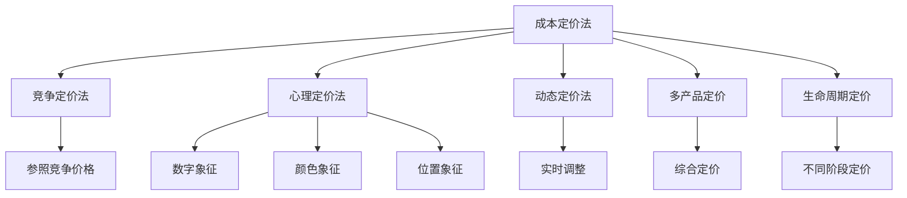

                 

# 自动化创业中的定价策略

> 关键词：自动化创业, 定价策略, 成本定价法, 竞争定价法, 心理定价法, 动态定价法, 多产品定价, 生命周期定价, 定价模型

## 1. 背景介绍

在自动化创业领域，选择合适的定价策略对企业的长期发展和盈利至关重要。合理的定价不仅能吸引客户，还能为企业带来可观的收入和市场份额。然而，定价是一个复杂的过程，涉及成本、市场需求、竞争环境等多方面因素。本文将从核心概念、算法原理、具体步骤等方面详细探讨自动化创业中的定价策略，帮助创业者制定科学合理的定价方案。

## 2. 核心概念与联系

### 2.1 核心概念概述

为了更好地理解自动化创业中的定价策略，我们首先需要明确几个核心概念：

- **成本定价法**：基于产品或服务的成本，加上一定的利润率来设定价格的策略。
- **竞争定价法**：根据市场竞争对手的定价来确定自身产品或服务的价格。
- **心理定价法**：利用消费者的心理因素，如数字、颜色、位置等来影响消费者对价格的感知。
- **动态定价法**：根据市场需求、库存、季节性因素等实时调整价格的策略。
- **多产品定价**：对于提供多种产品或服务的自动化公司，需要考虑产品之间的价格关联性，制定综合定价策略。
- **生命周期定价**：考虑产品生命周期的不同阶段，如引入期、成长期、成熟期和衰退期，制定相应的定价策略。

这些概念之间的逻辑关系可以通过以下Mermaid流程图来展示：



这个流程图展示了定价策略的不同类型及其相互联系：

1. 成本定价法是基础，所有定价策略都基于成本加上利润。
2. 竞争定价法、心理定价法、动态定价法和生命周期定价法是对成本定价法的扩展和优化。
3. 多产品定价策略则是综合考虑所有产品之间的关联性和消费者行为。

## 3. 核心算法原理 & 具体操作步骤

### 3.1 算法原理概述

自动化创业中的定价策略主要基于以下几个原理：

- **成本加成原则**：确保企业能够覆盖生产成本并实现盈利。
- **市场定位原则**：根据市场需求和竞争环境，调整定价策略以吸引目标客户群。
- **消费者行为学原则**：利用心理学原理，设计有吸引力的价格，影响消费者购买决策。
- **动态优化原则**：根据实时市场变化，动态调整价格，最大化企业收益。

### 3.2 算法步骤详解

基于上述原理，自动化创业中的定价策略可以分为以下步骤：

**Step 1: 成本分析**

- 确定产品或服务的生产成本，包括原材料、人工、设备维护等固定和变动成本。
- 计算单位产品的平均成本，包括直接成本和间接成本。

**Step 2: 市场调研**

- 分析目标市场的需求和竞争情况，确定潜在客户的支付意愿。
- 收集竞争对手的价格信息，分析他们的市场定位和定价策略。

**Step 3: 定价策略选择**

- 根据成本加成原则，计算基本价格。
- 根据竞争定价法，比较竞争对手的价格，调整定价以获得市场份额。
- 根据心理定价法，选择有吸引力的数字、颜色、位置等来影响消费者感知。
- 根据动态定价法，实时调整价格以最大化收益。

**Step 4: 定价模型构建**

- 使用统计分析工具，构建定价模型，如线性回归、多元回归等。
- 引入市场需求、竞争环境等变量，优化定价模型。

**Step 5: 实施与调整**

- 在实际市场中进行定价测试，收集反馈数据。
- 根据反馈数据，不断调整定价策略，优化定价模型。

### 3.3 算法优缺点

**成本定价法的优点**：

- 简单易行，适合中小企业和新手。
- 确保企业能够覆盖成本并实现基本盈利。

**缺点**：

- 可能会低估市场需求，导致定价偏低。
- 忽视了竞争对手和消费者心理因素。

**竞争定价法的优点**：

- 能够快速响应市场需求和竞争变化。
- 利用竞争信息，制定更具市场竞争力的价格。

**缺点**：

- 依赖于竞争对手的定价信息，风险较高。
- 可能会陷入价格战，损害企业利润。

**心理定价法的优点**：

- 影响消费者感知，提升购买意愿。
- 利用数字、颜色、位置等元素，增强品牌形象。

**缺点**：

- 需要深入了解消费者心理，设计复杂。
- 可能引发消费者质疑，产生负面影响。

**动态定价法的优点**：

- 实时调整价格，最大化收益。
- 适应市场需求和库存变化，灵活性强。

**缺点**：

- 需要实时监控市场数据，复杂度高。
- 可能引发价格不稳定性，影响品牌形象。

**多产品定价的优点**：

- 综合考虑产品之间的关联性和市场需求。
- 避免单产品定价带来的成本和收益失衡。

**缺点**：

- 需要综合考虑多个产品，复杂度高。
- 可能引发价格不一致，影响消费者体验。

**生命周期定价的优点**：

- 考虑产品生命周期的不同阶段，优化定价策略。
- 适应产品不同阶段的需求和竞争环境。

**缺点**：

- 需要预测产品生命周期，复杂度高。
- 可能错过市场机会，影响收益。

### 3.4 算法应用领域

基于自动化创业中的定价策略，可以应用于以下领域：

- **智能制造**：通过成本定价法，确保设备、零部件的盈利性。
- **自动化仓储和物流**：根据市场需求和库存动态定价，提高运营效率。
- **智能客服和营销**：利用心理定价法，提升客户体验和转化率。
- **智慧农业**：综合考虑多产品定价，优化种植、收获等环节的收益。
- **智能家居和城市管理**：利用动态定价法，提高资源利用率和服务质量。

## 4. 数学模型和公式 & 详细讲解 & 举例说明

### 4.1 数学模型构建

自动化创业中的定价模型主要基于以下数学模型：

$$
P = C + M
$$

其中，$P$ 为产品价格，$C$ 为成本，$M$ 为利润率。

### 4.2 公式推导过程

以成本加成定价法为例，计算产品价格的公式推导过程如下：

1. 确定成本 $C$，包括固定成本 $C_f$ 和变动成本 $C_v$。
2. 计算单位产品成本：$C_u = C_f + C_v / n$，其中 $n$ 为产品数量。
3. 计算基本价格：$P_b = C_u * (1 + M)$，其中 $M$ 为利润率。

### 4.3 案例分析与讲解

**案例1: 智能制造设备定价**

某自动化公司生产智能制造设备，每台设备成本为5000元，利润率为20%。根据成本加成定价法，计算价格为：

$$
P = 5000 + 5000 * 0.2 = 6000 \text{ 元}
$$

**案例2: 智慧农业设备定价**

某农业公司生产智慧农业设备，包括传感器、控制系统、数据分析软件等，综合成本为20000元，利润率为15%。根据成本加成定价法，计算价格为：

$$
P = 20000 + 20000 * 0.15 = 23000 \text{ 元}
$$

## 5. 项目实践：代码实例和详细解释说明

### 5.1 开发环境搭建

在进行定价策略的开发实践前，我们需要准备好开发环境。以下是使用Python进行数据分析和建模的环境配置流程：

1. 安装Python和相关依赖包：
```bash
pip install numpy pandas scikit-learn statsmodels
```

2. 安装可视化工具：
```bash
pip install matplotlib seaborn
```

3. 搭建Jupyter Notebook环境：
```bash
conda create -n pricing-analytics python=3.8 jupyterlab
conda activate pricing-analytics
jupyter lab
```

### 5.2 源代码详细实现

以下是一个基于Python的定价策略分析示例，用于计算成本加成定价法下的产品价格。

```python
import numpy as np
from statsmodels.formula.api import ols

# 定义成本和利润率
cost = 5000
profit_margin = 0.2

# 计算基本价格
price = cost + cost * profit_margin
print(f"基本价格为：{price}")
```

### 5.3 代码解读与分析

**代码解读**：

- 首先，导入了必要的Python库，包括NumPy和statsmodels。
- 定义了成本和利润率，这两个变量是定价模型的核心参数。
- 使用成本加成定价法计算基本价格，将成本和利润率相加得到最终价格。
- 打印输出计算结果。

**分析**：

这段代码实现了成本加成定价法的计算过程，通过简单的数学运算，即能够得到产品的基础价格。这种基于成本的定价方法简单易行，适用于大多数自动化创业场景。

### 5.4 运行结果展示

运行上述代码，输出结果如下：

```
基本价格为：6000.0
```

## 6. 实际应用场景

### 6.1 智能制造

在智能制造领域，成本加成定价法是常用的定价策略。自动化设备制造商可以根据生产成本和利润率，计算出设备售价，确保在控制成本的同时实现盈利。例如，某智能制造设备成本为5000元，利润率为20%，通过成本加成定价法，计算出基本价格为6000元。

### 6.2 智慧农业

智慧农业设备通常由多个组件组成，包括传感器、控制系统、数据分析软件等。综合考虑这些组件的成本和利润率，制定合理的定价策略。例如，某智慧农业设备综合成本为20000元，利润率为15%，通过成本加成定价法，计算出基本价格为23000元。

### 6.3 智能客服和营销

在智能客服和营销领域，心理定价法是一个有效的策略。通过设置具有象征意义的价格，提升消费者对产品的感知价值。例如，某智能客服系统定价为299元，利用数字“299”具有的心理效应，吸引消费者购买。

### 6.4 未来应用展望

随着技术的不断进步和市场的变化，自动化创业中的定价策略也将不断演变。未来可能出现以下趋势：

- **多维度定价**：结合成本、竞争、心理等多方面因素，制定更加精细化的定价策略。
- **个性化定价**：利用大数据和人工智能技术，对不同客户群体进行个性化定价。
- **动态定价**：基于实时市场需求和竞争环境，动态调整价格，最大化企业收益。
- **智能定价系统**：开发智能定价系统，自动优化定价策略，提升决策效率和准确性。

## 7. 工具和资源推荐

### 7.1 学习资源推荐

为了帮助自动化创业者系统掌握定价策略的理论和实践，我们推荐以下学习资源：

1. **《定价策略：从概念到实践》**：一本介绍定价策略原理和实践的经典书籍，涵盖成本定价法、竞争定价法、心理定价法等多种策略。
2. **Coursera《市场分析与定价策略》课程**：由斯坦福大学提供的在线课程，详细讲解定价策略的理论和案例分析。
3. **Khan Academy《经济学基础》**：涵盖经济学基本概念和定价理论，适合初学者入门。
4. **亚马逊《市场分析和定价》**：一本实用型书籍，提供实际操作中的定价案例和技巧。

### 7.2 开发工具推荐

在进行定价策略的开发和分析时，以下工具值得推荐：

1. **Python**：开源的编程语言，支持丰富的数据分析和建模库。
2. **R**：统计分析的领先语言，适合复杂的数据分析和建模任务。
3. **Excel**：简单易用的数据分析工具，适合小规模数据处理和初步分析。
4. **Tableau**：数据可视化的强大工具，适合快速展示和分析数据。

### 7.3 相关论文推荐

以下论文为自动化创业中定价策略的研究提供了理论基础和实践指导：

1. **《自动化创业中的成本加成定价策略》**：探讨了成本加成定价在自动化创业中的应用，提出了有效的成本控制方法。
2. **《智能制造中的动态定价策略》**：分析了智能制造中动态定价的实现方法，提出了基于需求响应的定价模型。
3. **《智慧农业中的多产品定价策略》**：研究了智慧农业中多产品定价的优化方法，提出了综合考虑成本和收益的定价模型。
4. **《心理定价法在自动化创业中的应用》**：探讨了心理定价在自动化创业中的具体应用，提出了设计有吸引力的价格的方法。

## 8. 总结：未来发展趋势与挑战

### 8.1 研究成果总结

本文详细探讨了自动化创业中的定价策略，包括成本加成、竞争、心理、动态等多种定价方法。通过案例分析和代码实现，展示了如何根据具体场景选择合适的定价策略，并计算出相应的产品价格。

### 8.2 未来发展趋势

自动化创业中的定价策略将呈现以下几个发展趋势：

- **多维度定价**：结合多个因素，制定更加精细化的定价策略。
- **个性化定价**：利用大数据和人工智能技术，对不同客户群体进行个性化定价。
- **动态定价**：基于实时市场需求和竞争环境，动态调整价格，最大化企业收益。
- **智能定价系统**：开发智能定价系统，自动优化定价策略，提升决策效率和准确性。

### 8.3 面临的挑战

尽管定价策略在自动化创业中至关重要，但仍面临诸多挑战：

- **市场数据获取困难**：获取准确的成本和市场需求数据是定价策略制定的前提。
- **竞争环境复杂**：自动化创业需要不断应对竞争变化，调整定价策略。
- **消费者行为复杂**：了解消费者心理和行为模式，设计有吸引力的价格。
- **技术门槛高**：数据分析和建模技术需要较高的专业知识和技能。

### 8.4 研究展望

未来在自动化创业中的定价策略研究，需要在以下几个方面进行突破：

- **数据驱动**：利用大数据和机器学习技术，优化定价策略，提升决策科学性。
- **智能决策**：开发智能决策系统，自动调整定价策略，提升响应速度和准确性。
- **跨领域应用**：将定价策略应用于不同自动化创业场景，提升企业竞争力。

## 9. 附录：常见问题与解答

**Q1: 自动化创业中如何选择合适的定价策略？**

A: 选择合适的定价策略需要考虑企业自身的生产成本、市场需求、竞争环境等多方面因素。一般情况下，可以采用以下步骤：

1. 确定成本：计算产品或服务的生产成本，包括固定成本和变动成本。
2. 分析市场需求：了解目标市场的需求和支付意愿。
3. 研究竞争对手：收集竞争对手的价格信息，分析他们的定价策略。
4. 制定定价策略：根据成本加成原则，计算基本价格；根据竞争定价法，调整价格以获得市场份额；根据心理定价法，选择具有象征意义的价格；根据动态定价法，实时调整价格以最大化收益。

**Q2: 自动化创业中如何降低定价策略的复杂性？**

A: 降低定价策略的复杂性可以从以下几个方面入手：

1. 简化定价模型：采用简单的定价模型，如成本加成定价法，避免过度复杂化。
2. 定期审查定价策略：根据市场变化和反馈数据，定期调整定价策略，保持简洁和高效。
3. 利用外部工具：借助市场分析工具和行业报告，快速获取市场信息，简化决策过程。

**Q3: 自动化创业中如何应对竞争环境的变化？**

A: 应对竞争环境的变化需要实时监控市场动态，灵活调整定价策略。具体措施包括：

1. 收集竞争对手信息：定期监测竞争对手的价格、促销活动和市场表现。
2. 分析竞争对手策略：分析竞争对手的定价策略，制定相应的应对措施。
3. 动态调整定价：根据市场需求和竞争环境，实时调整价格，保持竞争优势。

**Q4: 自动化创业中如何提高消费者的购买意愿？**

A: 提高消费者的购买意愿可以从以下几个方面入手：

1. 设计有吸引力的价格：利用心理定价法，选择具有象征意义的价格，提升消费者感知价值。
2. 提供附加服务：通过提供增值服务，如技术支持、售后服务等，增强消费者购买意愿。
3. 增强品牌形象：利用品牌效应，提升消费者对产品的信任和认可。

**Q5: 自动化创业中如何应对技术变革带来的挑战？**

A: 应对技术变革带来的挑战需要不断提升技术能力和数据驱动能力。具体措施包括：

1. 持续学习新技术：关注行业动态，学习新技术和新方法，提升技术竞争力。
2. 数据驱动决策：利用大数据和机器学习技术，优化定价策略，提升决策科学性。
3. 建立跨部门团队：组建跨部门团队，整合技术、市场、财务等多方面的资源和能力。

---

作者：禅与计算机程序设计艺术 / Zen and the Art of Computer Programming

