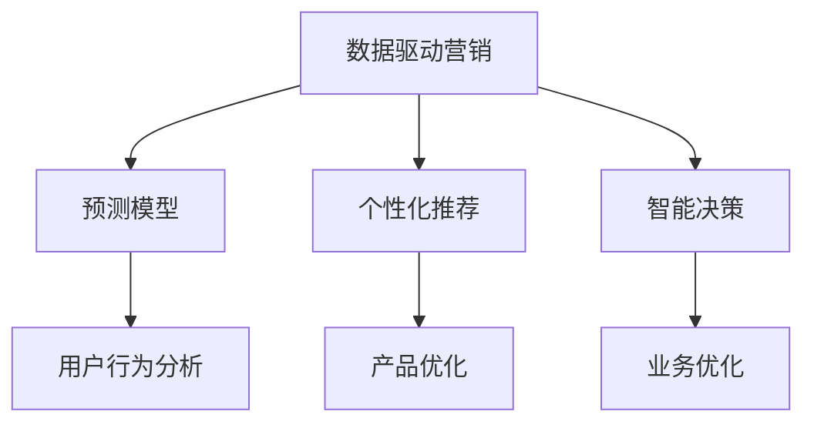

                 

## 1. 背景介绍

### 1.1 问题由来

近年来，随着人工智能和大数据技术的快速发展，自动化创业（Automated Business Creation）成为了新兴创业领域的热点。在这一领域中，如何高效利用数据驱动营销，提升创业企业的市场竞争力，成为众多创业者关注的焦点。数据驱动营销，即通过数据分析、机器学习和人工智能技术，优化企业运营、产品开发和市场推广等决策过程，实现精准营销、高效运营和智能化决策。

数据驱动营销的核心在于如何从海量数据中提取有价值的信息，预测市场趋势，优化产品设计和推广策略，从而提升业务表现和用户满意度。在自动化创业中，数据驱动营销更是关键，因为企业需要快速响应市场需求，灵活调整营销策略，提高市场渗透率和用户留存率。

### 1.2 问题核心关键点

数据驱动营销的关键点包括：

- **数据获取与处理**：收集和清洗数据，构建可靠的数据基础。
- **模型训练与优化**：选择和优化机器学习模型，提升预测和决策能力。
- **业务应用与落地**：将模型应用于业务决策中，实现智能化营销。

自动化创业中的数据驱动营销，还需考虑如何提高数据利用效率，降低成本，提升决策速度和灵活性。此外，还需要关注数据隐私和安全性，确保模型应用的合法合规性。

### 1.3 问题研究意义

数据驱动营销在自动化创业中具有重要的应用意义：

- **提升决策效率**：通过数据分析和模型预测，快速响应市场需求，提高运营效率。
- **优化产品设计**：通过用户行为数据分析，洞察用户需求，提升产品竞争力。
- **增强市场竞争力**：通过精准营销和个性化推荐，提高市场渗透率和用户留存率。
- **降低运营成本**：通过自动化工具和流程优化，降低人力和运营成本。

此外，数据驱动营销还能够帮助企业更好地理解市场，预测未来趋势，把握机遇，实现持续增长。在自动化创业中，数据驱动营销更是推动企业创新和变革的重要手段。

## 2. 核心概念与联系

### 2.1 核心概念概述

为更好地理解数据驱动营销在自动化创业中的应用，本节将介绍几个关键概念：

- **数据驱动营销**：通过数据分析和机器学习技术，驱动市场营销决策的过程。
- **自动化创业**：利用自动化工具和技术，快速构建和运营企业的业务模式。
- **预测模型**：基于历史数据和统计规律，预测未来市场趋势的模型。
- **个性化推荐**：根据用户行为和偏好，提供个性化产品和服务推荐。
- **智能决策**：通过模型预测和数据分析，实现自动化和智能化的决策。

这些概念之间的逻辑关系可以通过以下Mermaid流程图来展示：



这个流程图展示了数据驱动营销的关键环节及其之间的联系：

1. **用户行为分析**：通过分析用户行为数据，了解用户需求和偏好。
2. **预测模型**：基于用户行为数据，构建预测模型，预测市场趋势。
3. **个性化推荐**：根据预测结果，提供个性化推荐。
4. **智能决策**：结合用户行为数据和市场预测，实现智能决策。

这些概念共同构成了数据驱动营销的核心框架，使其能够在自动化创业中发挥强大的市场预测和决策能力。

## 3. 核心算法原理 & 具体操作步骤
### 3.1 算法原理概述

数据驱动营销的核心算法原理包括以下几个关键步骤：

1. **数据收集与预处理**：收集和清洗数据，构建可靠的数据基础。
2. **特征工程**：选择和提取有意义的特征，构建特征向量。
3. **模型训练与优化**：选择和优化机器学习模型，提升预测和决策能力。
4. **模型评估与测试**：评估模型的性能，确保模型的可靠性和泛化能力。
5. **业务应用与落地**：将模型应用于业务决策中，实现智能化营销。

在自动化创业中，数据驱动营销的目标是通过预测和决策，提升运营效率和市场竞争力，降低成本。

### 3.2 算法步骤详解

以下详细介绍数据驱动营销的核心算法步骤：

**Step 1: 数据收集与预处理**

- **数据来源**：选择可靠的数据来源，如社交媒体、销售记录、用户反馈等。
- **数据清洗**：去除噪声和异常数据，确保数据质量。
- **特征提取**：选择有意义的特征，构建特征向量。
- **数据划分**：将数据划分为训练集、验证集和测试集。

**Step 2: 特征工程**

- **特征选择**：根据领域知识和专家经验，选择有意义的特征。
- **特征转换**：使用降维、归一化等技术，优化特征表示。
- **特征交叉**：通过特征组合，构建新的特征向量。

**Step 3: 模型训练与优化**

- **模型选择**：选择合适的机器学习模型，如线性回归、决策树、随机森林等。
- **模型训练**：使用训练集训练模型，优化模型参数。
- **模型验证**：在验证集上评估模型性能，防止过拟合。
- **超参数调优**：使用网格搜索、随机搜索等方法，优化模型超参数。

**Step 4: 模型评估与测试**

- **性能评估**：使用多种评估指标，如准确率、召回率、F1-score等，评估模型性能。
- **交叉验证**：使用交叉验证方法，确保模型泛化能力。
- **模型部署**：将模型部署到实际业务环境中，进行实时预测和决策。

**Step 5: 业务应用与落地**

- **业务集成**：将模型集成到业务系统中，实现自动化决策。
- **用户反馈**：收集用户反馈，优化模型和决策过程。
- **持续优化**：根据业务反馈，持续优化模型和决策策略。

### 3.3 算法优缺点

数据驱动营销在自动化创业中具有以下优点：

- **数据驱动**：通过数据分析，优化决策过程，提升运营效率。
- **智能化决策**：结合机器学习模型，实现自动化和智能化的决策。
- **成本效益高**：通过优化运营和营销策略，降低成本，提升收益。

同时，该方法也存在一定的局限性：

- **数据依赖**：模型性能高度依赖于数据质量，数据偏差可能影响模型预测。
- **技术门槛高**：需要掌握数据科学和机器学习知识，技术门槛较高。
- **隐私风险**：处理用户数据可能涉及隐私和安全问题，需要合规处理。

尽管存在这些局限性，但数据驱动营销仍是大数据时代下的重要营销手段，能够帮助企业在自动化创业中更好地把握市场机会，提升竞争力。

### 3.4 算法应用领域

数据驱动营销在自动化创业中广泛应用，具体包括：

- **市场预测**：通过数据分析和预测模型，预测市场趋势，指导产品开发和市场推广。
- **用户行为分析**：通过用户行为数据，洞察用户需求和偏好，提升产品竞争力和用户体验。
- **个性化推荐**：根据用户行为数据，提供个性化推荐，提升用户满意度和转化率。
- **智能客服**：通过机器学习和自然语言处理技术，实现智能客服，提高客户满意度和服务效率。
- **广告优化**：通过数据分析和预测模型，优化广告投放策略，提升广告效果和ROI。
- **营销自动化**：通过自动化工具和流程，实现营销活动的自动化管理，提升运营效率。

以上领域展示了数据驱动营销在自动化创业中的广泛应用，为企业的数字化转型和智能化运营提供了有力支持。

## 4. 数学模型和公式 & 详细讲解 & 举例说明
### 4.1 数学模型构建

本节将使用数学语言对数据驱动营销的算法步骤进行更加严格的刻画。

假设我们有一组用户行为数据 $\{x_i\}_{i=1}^N$，每个用户行为 $x_i$ 可以表示为一个特征向量 $(x_{i1}, x_{i2}, \ldots, x_{im})$，其中 $m$ 为特征维度。目标是使用这些数据训练一个预测模型，预测新用户的行为 $y_{new}$。

我们定义预测模型的输入特征 $X$ 和输出标签 $Y$ 如下：

$$
X = \begin{bmatrix}
x_{11} & x_{12} & \ldots & x_{1m} \\
x_{21} & x_{22} & \ldots & x_{2m} \\
\vdots & \vdots & \ddots & \vdots \\
x_{N1} & x_{N2} & \ldots & x_{Nm}
\end{bmatrix}, \quad Y = \begin{bmatrix}
y_1 \\
y_2 \\
\vdots \\
y_N
\end{bmatrix}
$$

其中 $X$ 是特征矩阵，$Y$ 是标签向量。

我们的目标是最小化预测误差，即：

$$
\min_{\theta} \|Y - f(X;\theta)\|^2
$$

其中 $f(X;\theta)$ 是预测函数，$\theta$ 为模型参数。

### 4.2 公式推导过程

以下我们以线性回归模型为例，推导预测函数的参数估计公式。

假设预测函数为线性回归模型：

$$
f(X;\theta) = \theta_0 + \theta_1 x_1 + \theta_2 x_2 + \ldots + \theta_m x_m
$$

我们需要最小化预测误差：

$$
\min_{\theta} \|Y - f(X;\theta)\|^2 = \min_{\theta} \sum_{i=1}^N (y_i - \theta_0 - \theta_1 x_{i1} - \theta_2 x_{i2} - \ldots - \theta_m x_{im})^2
$$

对 $\theta_0, \theta_1, \ldots, \theta_m$ 求偏导数，得到：

$$
\begin{aligned}
\frac{\partial}{\partial \theta_0} \|Y - f(X;\theta)\|^2 &= -2\sum_{i=1}^N (y_i - \theta_0 - \theta_1 x_{i1} - \theta_2 x_{i2} - \ldots - \theta_m x_{im}) \\
\frac{\partial}{\partial \theta_j} \|Y - f(X;\theta)\|^2 &= -2\sum_{i=1}^N (y_i - \theta_0 - \theta_1 x_{i1} - \theta_2 x_{i2} - \ldots - \theta_m x_{im}) x_{ij}
\end{aligned}
$$

因此，参数估计公式为：

$$
\theta = \arg\min_{\theta} \sum_{i=1}^N (y_i - \theta_0 - \theta_1 x_{i1} - \theta_2 x_{i2} - \ldots - \theta_m x_{im})^2
$$

通过求解上述优化问题，可以得到线性回归模型的参数 $\theta$。

### 4.3 案例分析与讲解

假设我们有一组电商用户的购买行为数据，包括用户性别、年龄、购买金额等特征，目标是预测用户的再次购买概率。

我们首先对数据进行预处理和特征工程，选择性别、年龄和购买金额作为输入特征 $X$，预测标签 $Y$ 为 0 或 1，表示用户是否会再次购买。

使用线性回归模型，构建预测函数 $f(X;\theta)$。在训练集上，最小化预测误差 $\|Y - f(X;\theta)\|^2$，得到模型参数 $\theta$。

在测试集上，使用模型进行预测，计算预测准确率和召回率等评估指标。根据评估结果，优化模型和特征工程策略，进一步提升预测性能。

## 5. 项目实践：代码实例和详细解释说明
### 5.1 开发环境搭建

在进行数据驱动营销的开发实践前，我们需要准备好开发环境。以下是使用Python进行Scikit-learn开发的环境配置流程：

1. 安装Anaconda：从官网下载并安装Anaconda，用于创建独立的Python环境。

2. 创建并激活虚拟环境：
```bash
conda create -n sklearn-env python=3.8 
conda activate sklearn-env
```

3. 安装Scikit-learn：
```bash
pip install -U scikit-learn
```

4. 安装必要的依赖包：
```bash
pip install pandas numpy matplotlib seaborn jupyter notebook
```

完成上述步骤后，即可在`sklearn-env`环境中开始数据驱动营销的开发实践。

### 5.2 源代码详细实现

以下是一个使用Scikit-learn库进行线性回归模型训练和预测的Python代码实现。

首先，定义数据预处理和特征工程函数：

```python
import pandas as pd
from sklearn.model_selection import train_test_split
from sklearn.preprocessing import StandardScaler
from sklearn.linear_model import LinearRegression

def load_data():
    # 加载数据
    data = pd.read_csv('user_behavior.csv')
    return data

def preprocess_data(data):
    # 数据预处理
    features = ['gender', 'age', 'purchase_amount']
    target = 'repurchase_probability'
    X = data[features]
    y = data[target]
    # 特征缩放
    scaler = StandardScaler()
    X = scaler.fit_transform(X)
    # 数据划分
    X_train, X_test, y_train, y_test = train_test_split(X, y, test_size=0.2, random_state=42)
    return X_train, X_test, y_train, y_test
```

然后，定义模型训练和预测函数：

```python
def train_model(X_train, y_train):
    # 训练模型
    model = LinearRegression()
    model.fit(X_train, y_train)
    return model

def predict(model, X_test):
    # 预测
    y_pred = model.predict(X_test)
    return y_pred
```

最后，启动训练流程并在测试集上评估：

```python
X_train, X_test, y_train, y_test = preprocess_data(load_data())

model = train_model(X_train, y_train)
y_pred = predict(model, X_test)

print('预测准确率：', model.score(X_test, y_test))
print('预测结果：', y_pred)
```

以上就是使用Scikit-learn进行线性回归模型训练和预测的完整代码实现。可以看到，Scikit-learn库提供了丰富的机器学习算法和工具，使得模型训练和预测变得简单高效。

### 5.3 代码解读与分析

让我们再详细解读一下关键代码的实现细节：

**load_data()函数**：
- 定义数据加载函数，使用Pandas库从CSV文件中读取数据。

**preprocess_data()函数**：
- 定义数据预处理函数，选择输入特征和目标标签。
- 使用StandardScaler进行特征缩放。
- 使用train_test_split函数进行数据划分。

**train_model()函数**：
- 定义模型训练函数，使用LinearRegression训练线性回归模型。

**predict()函数**：
- 定义模型预测函数，使用训练好的模型对测试集进行预测。

**主程序**：
- 调用数据预处理和模型训练函数，在测试集上评估模型性能。

可以看到，Scikit-learn库使得模型训练和预测变得简单高效，只需要调用函数即可完成大部分工作。在实际应用中，我们还可以使用其他机器学习算法和工具进行模型优化和改进。

## 6. 实际应用场景
### 6.1 智能广告投放

数据驱动营销在智能广告投放中具有重要应用。广告主需要根据用户行为数据，精准定位目标用户，优化广告投放策略，提高广告效果和ROI。

具体而言，广告主可以使用数据分析和预测模型，识别高价值用户群体，设计个性化广告素材和投放策略。在广告投放过程中，实时监测广告效果，根据用户反馈和点击率等指标，动态调整广告投放策略，优化广告预算分配，提高广告转化率和投资回报率。

### 6.2 电子商务推荐系统

电子商务推荐系统是数据驱动营销的重要应用场景之一。电商平台需要根据用户行为数据，推荐符合用户兴趣和需求的商品，提升用户体验和销售额。

在推荐系统中，可以使用协同过滤、内容推荐等算法，结合用户行为数据和商品特征，构建推荐模型。在用户浏览商品页面时，实时预测用户可能感兴趣的商品，展示个性化推荐信息。根据用户点击和购买行为，持续优化推荐模型，提升推荐准确率和用户满意度。

### 6.3 个性化推荐引擎

个性化推荐引擎在互联网服务中广泛应用，如视频推荐、音乐推荐、新闻推荐等。通过数据分析和预测模型，为用户推荐个性化的内容，提升用户粘性和平台活跃度。

推荐引擎可以使用协同过滤、内容推荐、基于规则等算法，结合用户行为数据和内容特征，构建推荐模型。在用户访问平台时，实时预测用户可能感兴趣的内容，展示个性化推荐信息。根据用户互动行为，持续优化推荐模型，提升推荐效果和用户满意度。

### 6.4 未来应用展望

随着数据驱动营销技术的不断进步，其在自动化创业中的应用将更加广泛，为企业的数字化转型和智能化运营提供有力支持。

在智慧医疗领域，数据驱动营销可以用于患者行为分析、疾病预测、精准营销等方面，提升医疗服务的智能化水平，辅助医生诊疗，优化资源配置。

在智能教育领域，数据驱动营销可以用于学生行为分析、课程推荐、个性化教学等方面，因材施教，提升教育质量和公平性。

在智慧城市治理中，数据驱动营销可以用于城市事件监测、舆情分析、应急指挥等方面，提高城市管理的自动化和智能化水平，构建更安全、高效的未来城市。

此外，在企业生产、社会治理、文娱传媒等众多领域，数据驱动营销也将不断涌现，为数字化经济的持续增长提供新的动力。相信随着技术的日益成熟，数据驱动营销必将在更多的应用场景中发挥重要作用，推动社会的数字化转型。

## 7. 工具和资源推荐
### 7.1 学习资源推荐

为了帮助开发者系统掌握数据驱动营销的理论基础和实践技巧，这里推荐一些优质的学习资源：

1. 《机器学习》课程：斯坦福大学开设的经典课程，涵盖机器学习的基本概念和经典算法，适合初学者入门。
2. 《Python数据分析实战》书籍：通过Python实现数据分析和可视化，适合实战练习。
3. 《数据科学与机器学习实战》课程：由Google Data Science专家开设，涵盖数据分析和机器学习的实战技巧。
4. Kaggle竞赛：Kaggle提供大量数据集和竞赛任务，适合数据科学爱好者练习和提升技能。
5. 《深度学习》课程：由DeepLearning.AI开设，涵盖深度学习的基本概念和经典模型，适合进阶学习。

通过对这些资源的学习实践，相信你一定能够快速掌握数据驱动营销的精髓，并用于解决实际的业务问题。

### 7.2 开发工具推荐

高效的开发离不开优秀的工具支持。以下是几款用于数据驱动营销开发的常用工具：

1. Python：作为数据科学和机器学习的标配语言，具有丰富的数据分析和机器学习库，适合实现各种算法和模型。
2. Scikit-learn：基于Python的机器学习库，提供丰富的算法和工具，适合快速实现和优化模型。
3. TensorFlow：由Google开发的深度学习框架，适合大规模工程应用，提供高性能计算图和分布式训练能力。
4. PyTorch：由Facebook开发的深度学习框架，支持动态计算图和GPU加速，适合研究和实验。
5. Jupyter Notebook：交互式的Python开发环境，支持实时展示和调试代码，适合快速迭代和分享。

合理利用这些工具，可以显著提升数据驱动营销的开发效率，加快创新迭代的步伐。

### 7.3 相关论文推荐

数据驱动营销的研究源于学界的持续探索。以下是几篇奠基性的相关论文，推荐阅读：

1. "The Elements of Statistical Learning"（《统计学习方法》）：由Tibshirani、Hastie和Friedman合著的经典书籍，涵盖统计学习的基本理论和算法。
2. "Pattern Recognition and Machine Learning"（《模式识别与机器学习》）：由Christopher M. Bishop撰写的经典教材，涵盖机器学习的基本概念和算法。
3. "Data Science for Business"（《数据科学商业应用》）：由Foster Provost和Tom Fawcett合著的实用书籍，涵盖数据科学在商业中的应用。
4. "The Master Algorithm"（《大师算法》）：由Peter D. Sh Initialization撰写的书籍，探讨各种机器学习算法和应用场景。
5. "Predictive Analytics"（《预测分析》）：由Drew Fudenberg和David W. Kahneman撰写的书籍，涵盖预测分析的基本概念和应用。

这些论文代表了大数据时代下的数据驱动营销研究进展，通过学习这些前沿成果，可以帮助研究者把握学科前进方向，激发更多的创新灵感。

## 8. 总结：未来发展趋势与挑战
### 8.1 总结

本文对数据驱动营销在自动化创业中的应用进行了全面系统的介绍。首先阐述了数据驱动营销在自动化创业中的重要意义，明确了数据驱动营销在提升决策效率、优化产品设计、增强市场竞争力等方面的应用价值。其次，从原理到实践，详细讲解了数据驱动营销的数学原理和关键步骤，给出了数据驱动营销任务开发的完整代码实例。同时，本文还广泛探讨了数据驱动营销在智能广告投放、电子商务推荐、个性化推荐等多个领域的应用前景，展示了数据驱动营销技术的巨大潜力。最后，本文精选了数据驱动营销技术的各类学习资源，力求为读者提供全方位的技术指引。

通过本文的系统梳理，可以看到，数据驱动营销在自动化创业中具有重要的应用价值，能够帮助企业快速响应市场需求，提升运营效率和市场竞争力。未来，伴随数据驱动营销技术的不断发展，其在更多领域的应用前景将更加广阔，为数字化经济的发展注入新的动力。

### 8.2 未来发展趋势

展望未来，数据驱动营销技术将呈现以下几个发展趋势：

1. **自动化程度提升**：随着自动化技术的发展，数据驱动营销将更加自动化和智能化，能够实现更高效的数据处理和模型训练。
2. **深度学习和大数据技术的融合**：深度学习和大数据技术的融合，将使数据驱动营销更加精准和高效，提升模型的预测和决策能力。
3. **实时数据分析和决策**：实时数据分析和决策技术的发展，将使数据驱动营销能够实时响应市场需求，动态调整营销策略，提升运营效率。
4. **多模态数据融合**：多模态数据的融合，将使数据驱动营销能够更好地理解用户需求和行为，提供更加个性化和精准的推荐和服务。
5. **隐私和安全保护**：数据驱动营销将更加注重用户隐私和数据安全，采用匿名化、差分隐私等技术，保护用户数据隐私。

这些趋势凸显了数据驱动营销技术的广阔前景，为企业的数字化转型和智能化运营提供了新的方向。

### 8.3 面临的挑战

尽管数据驱动营销技术已经取得了显著成就，但在迈向更加智能化、普适化应用的过程中，仍然面临诸多挑战：

1. **数据质量和隐私问题**：高质量的数据是数据驱动营销的基础，但数据采集和处理成本高昂，数据隐私和安全问题也需高度重视。
2. **技术门槛高**：数据驱动营销涉及机器学习、数据科学等多领域知识，技术门槛较高，需要高水平的人才和资源支持。
3. **模型解释性不足**：复杂模型（如深度学习模型）的决策过程缺乏解释性，难以解释模型的内部工作机制和决策逻辑。
4. **业务整合困难**：数据驱动营销需要将模型和业务系统深度整合，实现实时预测和决策，这对企业的技术能力和业务流程提出了新的要求。
5. **计算资源限制**：深度学习模型和大数据处理需要大量计算资源，成本较高，需要高效的计算平台和资源优化技术。

面对这些挑战，数据驱动营销技术需要在数据质量、隐私保护、技术门槛、模型解释性和业务整合等方面进行持续优化，方能实现广泛应用和市场推广。

### 8.4 研究展望

未来，数据驱动营销技术需要在以下几个方面寻求新的突破：

1. **自动化和智能化的提升**：进一步提高数据驱动营销的自动化和智能化程度，提升运营效率和市场竞争力。
2. **数据隐私和安全的保护**：加强数据隐私和安全保护，确保用户数据的安全和合规。
3. **模型解释性的增强**：研究模型解释性技术，增强模型决策的可解释性和透明性。
4. **多模态数据的融合**：探索多模态数据的融合技术，提升模型的全面性和准确性。
5. **实时数据分析和决策**：研究实时数据分析和决策技术，实现实时响应市场需求，动态调整营销策略。
6. **业务整合和优化**：研究业务整合和优化技术，将数据驱动营销技术与业务系统深度整合，提升业务运营的智能化水平。

这些研究方向将引领数据驱动营销技术向更高的台阶迈进，为企业的数字化转型和智能化运营提供更加强大的技术支撑。

## 9. 附录：常见问题与解答

**Q1：数据驱动营销是否适用于所有企业？**

A: 数据驱动营销并非适用于所有企业。企业需要具备一定的数据基础和计算能力，才能够有效地利用数据驱动营销技术。同时，数据驱动营销需要企业在业务流程和管理上具备一定的灵活性和开放性，以便实现数据和模型的整合和应用。因此，数据驱动营销更适合大型企业和中型企业，而不适合小型企业和传统行业。

**Q2：数据驱动营销需要投入大量的数据和计算资源吗？**

A: 数据驱动营销需要一定的数据和计算资源投入，但并不需要大量的资源。企业可以根据自己的业务需求和数据量，选择适合的数据驱动营销技术和算法，进行优化和调整。同时，云计算和大数据平台的发展，使得数据驱动营销技术的部署和使用更加便捷和高效，降低了企业的资源投入。

**Q3：数据驱动营销是否需要专业的人才和资源支持？**

A: 是的，数据驱动营销需要专业的人才和资源支持，包括数据科学家、机器学习工程师、数据分析师等。同时，企业需要具备一定的技术能力和数据基础，才能够有效地利用数据驱动营销技术。因此，企业需要投入一定的时间和资源，进行数据驱动营销的团队建设和能力提升。

**Q4：数据驱动营销的决策过程是否透明可解释？**

A: 数据驱动营销的决策过程通常需要依赖复杂的机器学习模型，模型内部的决策逻辑和推理过程难以解释。因此，数据驱动营销的决策过程透明度不足，难以满足一些高风险和高要求的行业（如金融、医疗等）。为了提高数据驱动营销的决策透明度，企业需要探索模型解释性和可解释性技术，增强模型的可解释性和透明性。

**Q5：数据驱动营销如何应对市场变化？**

A: 数据驱动营销通过实时数据分析和预测，能够快速响应市场变化，动态调整营销策略。企业需要构建实时数据采集和处理系统，进行持续的数据监测和分析，及时发现市场变化，并根据变化调整营销策略，实现灵活运营和快速响应。同时，企业需要具备一定的数据和计算能力，以便实时处理和分析海量数据，支持市场变化的快速响应。

