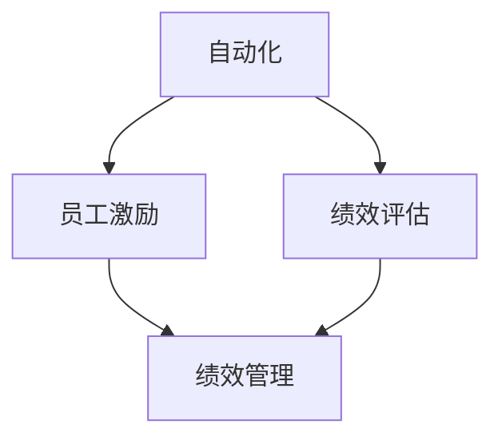

                 

# 自动化创业中的绩效评估与激励

> 关键词：绩效评估, 绩效管理, 员工激励, 自动化, 创业公司

## 1. 背景介绍

### 1.1 问题由来

在当今科技驱动的时代，自动化技术正迅速渗透到各个行业。尤其是在创业公司，自动化可以极大地提高效率，降低成本，增强竞争力。然而，随着自动化技术的应用，传统的绩效评估和激励机制面临着严峻挑战。如何在自动化创业中，确保绩效评估的准确性和激励机制的有效性，成为每个管理者不得不面对的问题。本文将从自动化创业的背景出发，探讨如何通过科学的绩效评估与激励机制，激发员工的潜力，推动公司的持续发展。

### 1.2 问题核心关键点

自动化创业中，绩效评估与激励的关键点在于：

- **绩效评估**：如何快速准确地衡量员工的工作成果，确保评估结果的客观性和公正性？
- **激励机制**：如何设计激励措施，使员工在自动化工具的帮助下，仍能保持高度的工作热情和创新精神？

本文将聚焦于这两个核心问题，通过理论分析与实践案例，为自动化创业中的绩效评估与激励提供切实可行的策略。

## 2. 核心概念与联系

### 2.1 核心概念概述

为更好地理解自动化创业中的绩效评估与激励，本节将介绍几个密切相关的核心概念：

- **自动化**：利用各种技术手段，自动执行复杂、重复性高的任务，以提高效率、降低成本。
- **绩效评估**：通过设定目标、考核指标等方法，对员工的工作表现进行定量或定性的评价。
- **员工激励**：通过各种措施，激发员工的工作热情、提高工作满意度，增强公司的凝聚力。
- **绩效管理**：结合绩效评估和激励机制，形成闭环的反馈系统，提升员工的工作效能和公司整体业绩。

这些概念之间的逻辑关系可以通过以下Mermaid流程图来展示：



这个流程图展示了一个自动化创业的绩效评估与激励系统：

1. 自动化技术提高了工作效率，为绩效评估提供了数据基础。
2. 绩效评估通过考核自动化工具收集的数据，客观评价员工表现。
3. 员工激励基于评估结果，设计有针对性的激励措施。
4. 绩效管理结合评估和激励，形成持续改进的反馈机制。

## 3. 核心算法原理 & 具体操作步骤

### 3.1 算法原理概述

自动化创业中的绩效评估与激励，本质上是一种基于数据的决策支持系统。其核心思想是：利用自动化工具收集员工的工作数据，通过科学的方法进行绩效评估，并根据评估结果设计激励措施，以提高员工的积极性和工作效率。

形式化地，假设有一个自动化创业公司，有N个员工参与工作，每个员工的工作可以被自动化工具捕捉到S个关键指标。设每个指标的权重为Wi，员工的实际绩效P为这些指标的加权和，即：

$$ P = \sum_{i=1}^{S} W_i \times P_i $$

其中，P_i为第i个指标的实际值，W_i为该指标的权重。

通过对比员工的实际绩效P与预设的目标绩效T，可以计算出员工的绩效差距Δ，即：

$$ \Delta = T - P $$

最后，根据绩效差距Δ和预设的激励策略F，计算出应给予员工的激励值I，即：

$$ I = F(\Delta) $$

激励值I可以用于各种奖励措施，如奖金、晋升、培训等。通过不断地反馈与调整，形成一个持续的绩效改进闭环。

### 3.2 算法步骤详解

基于数据的绩效评估与激励，主要包括以下几个关键步骤：

**Step 1: 确定关键绩效指标(KPIs)**

- 与各部门经理和员工共同商定，确定对公司目标达成有重要影响的KPIs。
- 确保这些KPIs能够通过自动化工具有效监控和收集数据。

**Step 2: 收集自动化数据**

- 部署或引入自动化工具，实时监控员工工作数据。
- 确保数据收集的准确性、完整性和时效性，减少人为误差。

**Step 3: 设定目标绩效**

- 根据公司战略目标，设定各KPIs的预设目标值T。
- 通过数据统计和分析，设定合理的目标绩效，避免过于理想化。

**Step 4: 计算实际绩效**

- 使用自动化工具收集的数据，计算每个员工的实际绩效P。
- 确保计算过程科学合理，充分考虑各KPIs的权重和贡献。

**Step 5: 评估绩效差距**

- 计算每个员工的绩效差距Δ = T - P。
- 根据绩效差距，识别出高绩效和低绩效的员工群体。

**Step 6: 设计激励措施**

- 根据预设的激励策略F，设计有针对性的激励措施。
- 激励策略应具有多样性，覆盖奖励、晋升、培训等多个方面。

**Step 7: 实施激励**

- 根据激励策略和绩效差距，给予员工相应的激励I。
- 及时反馈激励结果，确保激励措施的有效性。

**Step 8: 持续优化**

- 定期收集员工反馈，调整KPIs、目标绩效和激励策略。
- 形成持续改进的闭环，不断提升公司整体绩效。

### 3.3 算法优缺点

基于数据的绩效评估与激励方法，具有以下优点：

1. **客观性**：自动化数据减少了人为误差，评估结果更加客观公正。
2. **透明度**：数据驱动的决策过程透明可解释，员工易于接受。
3. **灵活性**：可以根据公司需求动态调整KPIs和目标绩效。
4. **可操作性**：激励措施可以具体量化，便于实施。

同时，该方法也存在一些缺点：

1. **数据隐私**：自动化数据收集可能涉及员工隐私，需加强数据保护措施。
2. **技术依赖**：过度依赖自动化工具，可能降低员工的自主性和创新性。
3. **数据质量**：数据收集和处理过程中，可能出现遗漏、错误等问题。
4. **灵活度有限**：预设的KPIs和目标绩效可能与实际工作不符，需灵活调整。

尽管存在这些缺点，但就目前而言，基于数据的绩效评估与激励方法仍是一种高效、透明、可操作的绩效管理范式。未来相关研究的重点在于如何进一步提高数据的质量和隐私保护，同时兼顾员工的自主性和创新性。

### 3.4 算法应用领域

基于数据的绩效评估与激励方法，在多个自动化创业公司中得到了广泛应用，涵盖多个行业和岗位，例如：

- **软件开发**：通过代码提交量、Bug修复率等KPIs，评估工程师的贡献。
- **数据分析**：通过报表生成、数据清洗等任务完成情况，评估数据科学家的绩效。
- **市场销售**：通过销售额、客户满意度等指标，评估销售团队的业绩。
- **运维支持**：通过服务请求响应时间、系统稳定性等KPIs，评估运维人员的绩效。

此外，基于数据的绩效评估与激励方法，也适用于更多的自动化场景，如客户服务、人力资源、财务管理等，为各类自动化创业公司提供了一种通用的绩效管理解决方案。

## 4. 数学模型和公式 & 详细讲解  
### 4.1 数学模型构建

本节将使用数学语言对基于数据的绩效评估与激励过程进行更加严格的刻画。

设公司有N个员工，每个员工的工作可以被自动化工具捕捉到S个关键指标，即X1,...,XS。假设每个指标的权重为Wi，员工的实际绩效P为这些指标的加权和：

$$ P = \sum_{i=1}^{S} W_i \times X_i $$

其中，Wi为第i个指标的权重，Xi为第i个指标的实际值。

公司设定各KPIs的预设目标值T为：

$$ T = \{T_1,...,T_S\} $$

员工的实际绩效P与目标绩效T的差距Δ为：

$$ \Delta = \{ \Delta_1,...,\Delta_S \} $$

$$ \Delta_i = T_i - X_i $$

最后，根据预设的激励策略F，计算应给予员工的激励值I：

$$ I = F(\Delta) $$

其中，F为激励策略函数，可能包含奖励、晋升、培训等多种激励方式。

### 4.2 公式推导过程

以下我们以奖励激励为例，推导激励值I的计算公式。

假设奖励激励策略为线性函数，即：

$$ I = k \times \Delta $$

其中，k为奖励系数，表示绩效差距Δ每增加一个单位，奖励I增加k倍。

将绩效差距Δ代入激励策略函数，得：

$$ I = k \times \Delta = k \times (T - P) = k \times \sum_{i=1}^{S} (T_i - X_i) $$

即：

$$ I = k \times \sum_{i=1}^{S} T_i - k \times \sum_{i=1}^{S} X_i $$

在实际应用中，可以根据公司的具体情况，设计不同的激励策略函数F，如指数函数、分段函数等，以实现更加灵活的激励机制。

### 4.3 案例分析与讲解

以软件开发团队为例，分析基于数据的绩效评估与激励方法的应用。

**Step 1: 确定关键绩效指标**

- 开发团队的KPIs可能包括：代码提交量、Bug修复量、代码质量、功能实现等。
- 与开发经理和员工共同商定，确定对团队目标达成有重要影响的KPIs。

**Step 2: 收集自动化数据**

- 部署Git等版本控制系统，实时监控代码提交记录。
- 部署Bug跟踪系统，记录Bug的提出、修复和验证过程。

**Step 3: 设定目标绩效**

- 根据公司战略目标，设定各KPIs的预设目标值T。
- 通过历史数据统计，设定合理的目标绩效，避免过于理想化。

**Step 4: 计算实际绩效**

- 使用Git和Bug跟踪系统收集的数据，计算每个开发人员的实际绩效P。
- 确保计算过程科学合理，充分考虑各KPIs的权重和贡献。

**Step 5: 评估绩效差距**

- 计算每个开发人员的绩效差距Δ = T - P。
- 根据绩效差距，识别出高绩效和低绩效的开发人员。

**Step 6: 设计激励措施**

- 设计有针对性的激励措施，如奖金、年终奖、晋升机会等。
- 激励措施应具有多样性，覆盖多个方面，以确保公平性和吸引力。

**Step 7: 实施激励**

- 根据激励策略和绩效差距，给予开发人员相应的激励I。
- 及时反馈激励结果，确保激励措施的有效性。

**Step 8: 持续优化**

- 定期收集开发人员的反馈，调整KPIs、目标绩效和激励策略。
- 形成持续改进的闭环，不断提升开发团队的整体绩效。

## 5. 项目实践：代码实例和详细解释说明
### 5.1 开发环境搭建

在进行绩效评估与激励实践前，我们需要准备好开发环境。以下是使用Python进行Django开发的环境配置流程：

1. 安装Anaconda：从官网下载并安装Anaconda，用于创建独立的Python环境。

2. 创建并激活虚拟环境：
```bash
conda create -n perf-eval-env python=3.8 
conda activate perf-eval-env
```

3. 安装Django：
```bash
pip install django
```

4. 安装必要的数据库库和中间件：
```bash
pip install psycopg2-binary django-crispy-forms django-select2
```

5. 安装模型的可视化工具：
```bash
pip install matplotlib seaborn
```

6. 创建Django项目：
```bash
django-admin startproject perf-eval
cd perf-eval
```

7. 创建App：
```bash
python manage.py startapp kpi
python manage.py startapp reward
```

8. 部署项目：
```bash
gunicorn perf-eval.wsgi:application --bind 0.0.0.0:8000
```

完成上述步骤后，即可在`perf-eval-env`环境中开始绩效评估与激励实践。

### 5.2 源代码详细实现

下面我们以软件开发团队为例，给出使用Django对绩效评估与激励系统的PyTorch代码实现。

**模型定义**：

```python
from django.db import models
from django.contrib.auth.models import User

class Developer(models.Model):
    user = models.OneToOneField(User, on_delete=models.CASCADE)
    kpi1 = models.FloatField()
    kpi2 = models.FloatField()
    kpi3 = models.FloatField()
    # 定义其他KPIs...

class KPI(models.Model):
    developer = models.ForeignKey(Developer, on_delete=models.CASCADE)
    name = models.CharField(max_length=255)
    target = models.FloatField()
    weight = models.FloatField()

class Performance(models.Model):
    developer = models.ForeignKey(Developer, on_delete=models.CASCADE)
    performance = models.FloatField()
    created_at = models.DateTimeField(auto_now_add=True)

class Reward(models.Model):
    developer = models.ForeignKey(Developer, on_delete=models.CASCADE)
    reward_type = models.CharField(max_length=255)
    amount = models.FloatField()
    created_at = models.DateTimeField(auto_now_add=True)
```

**视图定义**：

```python
from django.shortcuts import render
from .models import Developer, KPI, Performance, Reward

def index(request):
    developers = Developer.objects.all()
    return render(request, 'perf-eval/index.html', {'developers': developers})

def add_kpi(request):
    developer = Developer.objects.get(pk=request.POST['developer'])
    name = request.POST['name']
    target = float(request.POST['target'])
    weight = float(request.POST['weight'])
    KPI.objects.create(developer=developer, name=name, target=target, weight=weight)
    return render(request, 'perf-eval/success.html')

def calculate_performance(request):
    developer = Developer.objects.get(pk=request.POST['developer'])
    performance = calculate_performance(developer)
    Performance.objects.create(developer=developer, performance=performance)
    return render(request, 'perf-eval/success.html')

def calculate_reward(request):
    developer = Developer.objects.get(pk=request.POST['developer'])
    reward_type = request.POST['reward_type']
    amount = calculate_reward(developer, reward_type)
    Reward.objects.create(developer=developer, reward_type=reward_type, amount=amount)
    return render(request, 'perf-eval/success.html')
```

**模板定义**：

```html
<!-- perf-eval/index.html -->
<h1>绩效评估与激励系统</h1>
<form method="post">
    
    <label for="developer">开发者:</label>
    <select id="developer" name="developer">
        
        <option value="{{ developer.id }}"{{ developer.id == selected_developer }}>{{ developer.user.username }}</option>
        
    </select>
    <br><br>
    <button type="submit">提交</button>
</form>

<!-- perf-eval/add_kpi.html -->
<h1>添加KPI</h1>
<form method="post">
    
    <label for="name">KPI名称:</label>
    <input type="text" id="name" name="name"><br>
    <label for="target">目标值:</label>
    <input type="number" id="target" name="target"><br>
    <label for="weight">权重:</label>
    <input type="number" id="weight" name="weight"><br>
    <button type="submit">提交</button>
</form>

<!-- perf-eval/calculate_performance.html -->
<h1>计算绩效</h1>
<form method="post">
    
    <label for="developer">开发者:</label>
    <select id="developer" name="developer">
        
        <option value="{{ developer.id }}"{{ developer.id == selected_developer }}>{{ developer.user.username }}</option>
        
    </select>
    <br><br>
    <button type="submit">提交</button>
</form>

<!-- perf-eval/calculate_reward.html -->
<h1>计算奖励</h1>
<form method="post">
    
    <label for="developer">开发者:</label>
    <select id="developer" name="developer">
        
        <option value="{{ developer.id }}"{{ developer.id == selected_developer }}>{{ developer.user.username }}</option>
        
    </select>
    <br><br>
    <label for="reward_type">奖励类型:</label>
    <input type="text" id="reward_type" name="reward_type"><br>
    <button type="submit">提交</button>
</form>
```

**绩效计算函数**：

```python
def calculate_performance(developer):
    kpi_objects = KPI.objects.filter(developer=developer)
    performance = 0.0
    for kpi in kpi_objects:
        performance += kpi.target * kpi.weight
    return performance

def calculate_reward(developer, reward_type):
    performance = calculate_performance(developer)
    if reward_type == '奖金':
        amount = performance * 0.1
    elif reward_type == '年终奖':
        amount = performance * 0.2
    elif reward_type == '晋升':
        amount = performance * 0.3
    else:
        amount = 0.0
    return amount
```

### 5.3 代码解读与分析

让我们再详细解读一下关键代码的实现细节：

**模型定义**：

- `Developer`模型：用于存储开发人员的基本信息和绩效数据。
- `KPI`模型：用于存储关键绩效指标的定义，包括名称、目标值和权重。
- `Performance`模型：用于存储每个开发人员的绩效评估结果。
- `Reward`模型：用于存储对开发人员的激励措施。

**视图定义**：

- `index`视图：展示所有开发人员的信息。
- `add_kpi`视图：添加新的KPI。
- `calculate_performance`视图：计算开发人员的绩效。
- `calculate_reward`视图：计算开发人员的奖励。

**模板定义**：

- `perf-eval/index.html`：展示所有开发人员的信息。
- `perf-eval/add_kpi.html`：添加新的KPI表单。
- `perf-eval/calculate_performance.html`：计算绩效表单。
- `perf-eval/calculate_reward.html`：计算奖励表单。

**绩效计算函数**：

- `calculate_performance`函数：计算开发人员的绩效，通过权重和目标值进行加权求和。
- `calculate_reward`函数：计算开发人员的奖励，根据不同的奖励类型和绩效计算金额。

通过这些代码实现，可以初步构建一个基于数据的绩效评估与激励系统，对开发人员的工作表现进行量化评估，并根据绩效差异给予相应的奖励。

## 6. 实际应用场景

### 6.1 智能制造

在智能制造领域，绩效评估与激励系统可以帮助工厂管理层更加精确地监控生产线上的各项工作指标，如生产效率、质量控制、设备维护等。通过自动化数据收集和处理，可以快速发现生产过程中的瓶颈和问题，及时进行调整和优化。同时，对高绩效员工给予奖励，可以增强员工的工作动力，提高生产效率。

### 6.2 金融服务

在金融服务行业，绩效评估与激励系统可以帮助银行和金融机构对员工的工作表现进行科学评估。通过对交易量、客户满意度、风险控制等指标的监控，可以及时发现工作中的不足，并进行针对性的培训和改进。同时，根据绩效评估结果，给予员工相应的奖励和晋升机会，可以提升员工的工作积极性，增强团队的凝聚力。

### 6.3 医疗健康

在医疗健康领域，绩效评估与激励系统可以帮助医院对医生和护士的工作进行精确评估。通过对诊断准确率、治疗效果、病人满意度等指标的监控，可以及时发现工作中的问题和不足，并进行改进和优化。同时，对高绩效医生给予奖励和表彰，可以增强医生和护士的工作热情，提升医疗服务的整体质量。

### 6.4 未来应用展望

随着自动化技术的不断发展和普及，基于数据的绩效评估与激励方法将更加广泛地应用于各类自动化创业公司。未来，该方法还将在更多领域得到应用，如智能物流、智能家居、智能交通等，为各类自动化系统提供高效的绩效管理解决方案。

## 7. 工具和资源推荐

### 7.1 学习资源推荐

为了帮助开发者系统掌握绩效评估与激励的理论基础和实践技巧，这里推荐一些优质的学习资源：

1. **《绩效管理与激励实践》书籍**：系统介绍了绩效评估与激励的基本概念、理论模型和实际操作，适合初学者和进阶者。

2. **《数据分析与绩效评估》课程**：在线课程平台提供的数据分析与绩效评估课程，深入讲解了数据驱动的绩效评估方法。

3. **《绩效评估与激励管理》课程**：MBA课程中关于绩效评估与激励管理的经典教材，理论联系实际，实战性强。

4. **《自动化与绩效管理》博客**：专家作者对自动化创业中绩效评估与激励的深度思考和实践分享。

5. **《大数据与绩效管理》论文集**：收集多篇前沿研究论文，深入探讨了大数据技术在绩效评估中的应用。

通过对这些资源的学习实践，相信你一定能够快速掌握绩效评估与激励的精髓，并用于解决实际的自动化创业问题。

### 7.2 开发工具推荐

高效的开发离不开优秀的工具支持。以下是几款用于绩效评估与激励开发的常用工具：

1. **Django**：Python的Web框架，支持快速开发和部署，适合绩效评估与激励系统的Web界面。

2. **JIRA**：敏捷开发项目管理工具，支持自定义工作流和任务管理，适合绩效评估与激励系统的任务追踪。

3. **Trello**：团队协作工具，支持看板式任务管理，适合绩效评估与激励系统的任务跟踪。

4. **GSheet**：Google Sheets，支持数据的动态更新和可视化展示，适合绩效评估与激励系统的数据管理。

5. **Tableau**：数据可视化工具，支持复杂的数据分析和报表生成，适合绩效评估与激励系统的结果展示。

合理利用这些工具，可以显著提升绩效评估与激励系统的开发效率，加快创新迭代的步伐。

### 7.3 相关论文推荐

绩效评估与激励技术的发展源于学界的持续研究。以下是几篇奠基性的相关论文，推荐阅读：

1. **《绩效管理理论与实践》**：系统总结了绩效评估与激励的理论框架和方法，适合理论与实践相结合。

2. **《绩效管理系统的设计与实现》**：介绍了绩效评估与激励系统的设计思路和技术实现，具有较高的参考价值。

3. **《基于大数据的绩效评估方法》**：探索了大数据技术在绩效评估中的应用，提供了多种数据驱动的评估方法。

4. **《绩效评估与激励机制的优化研究》**：研究了如何通过优化激励策略和绩效评估指标，提升员工的工作积极性。

5. **《自动化绩效评估与激励的案例研究》**：通过多个自动化创业公司的案例，展示了绩效评估与激励的具体应用。

这些论文代表了大数据技术在绩效评估与激励领域的研究进展，通过学习这些前沿成果，可以帮助研究者把握学科前进方向，激发更多的创新灵感。

## 8. 总结：未来发展趋势与挑战

### 8.1 总结

本文对自动化创业中的绩效评估与激励方法进行了全面系统的介绍。首先阐述了自动化创业的背景和绩效评估与激励的核心问题，明确了绩效评估的客观性和激励机制的有效性。其次，从原理到实践，详细讲解了基于数据的绩效评估与激励方法，并给出了完整的代码实现。同时，本文还探讨了绩效评估与激励方法在多个自动化创业公司中的应用案例，展示了其广阔的应用前景。最后，本文推荐了相关的学习资源、开发工具和学术论文，为读者提供了系统化的学习指引。

通过本文的系统梳理，可以看到，基于数据的绩效评估与激励方法正在成为自动化创业中的重要工具，极大地提升了员工的工作表现和公司整体业绩。未来，随着自动化技术的不断进步和普及，绩效评估与激励技术必将得到更广泛的应用，为自动化创业公司提供更加科学、高效的绩效管理解决方案。

### 8.2 未来发展趋势

绩效评估与激励技术的未来发展趋势包括：

1. **智能化**：通过引入AI算法，自动化数据收集和处理，实现更加精准的绩效评估。
2. **可视化**：利用可视化工具，将绩效数据和评估结果直观展示，便于管理和决策。
3. **灵活性**：根据不同岗位和行业特点，灵活调整KPIs和激励策略，增强适用性。
4. **实时性**：实时监控和反馈员工表现，及时调整激励措施，提升工作积极性。
5. **多维度**：结合情感分析、行为分析等手段，多维度评估员工绩效，全面了解员工表现。

以上趋势凸显了绩效评估与激励技术的广阔前景。这些方向的探索发展，必将进一步提升绩效评估与激励的科学性和有效性，为自动化创业公司提供更加精准、灵活、及时的绩效管理解决方案。

### 8.3 面临的挑战

尽管基于数据的绩效评估与激励技术已经取得了显著进展，但在实际应用中仍面临诸多挑战：

1. **数据隐私**：自动化数据收集涉及员工隐私，需加强数据保护措施。
2. **技术复杂度**：开发和维护绩效评估系统需要一定的技术门槛，需培养专业人才。
3. **员工接受度**：员工对绩效评估与激励系统可能存在抵触情绪，需加强沟通和培训。
4. **数据质量**：数据收集和处理过程中，可能出现遗漏、错误等问题，需确保数据质量。
5. **激励效果**：激励措施需设计合理，确保公平性和吸引力，防止激励失效。

尽管存在这些挑战，但通过持续的技术创新和实践优化，可以逐步克服这些问题，推动绩效评估与激励技术的持续发展。

### 8.4 研究展望

面对绩效评估与激励技术所面临的挑战，未来的研究需要在以下几个方面寻求新的突破：

1. **数据隐私保护**：研究如何确保数据在收集和处理过程中的隐私和安全。
2. **技术简化**：开发简单易用的绩效评估与激励系统，降低技术门槛。
3. **员工参与度**：研究如何提高员工对绩效评估与激励系统的接受度和满意度。
4. **数据质量提升**：研究如何提高自动化数据收集和处理的准确性和完整性。
5. **激励机制优化**：研究如何设计更加公平、合理的激励措施，增强激励效果。

这些研究方向的探索，必将引领绩效评估与激励技术迈向更高的台阶，为自动化创业公司提供更加科学、高效、灵活的绩效管理解决方案。面向未来，绩效评估与激励技术还需要与其他人工智能技术进行更深入的融合，如知识表示、因果推理、强化学习等，多路径协同发力，共同推动自动化创业的持续创新和优化。

## 9. 附录：常见问题与解答

**Q1：如何选择合适的绩效指标（KPIs）？**

A: 选择合适的绩效指标（KPIs）是绩效评估的关键。一般应考虑以下原则：

- **相关性**：选择与公司目标密切相关的指标。
- **可量化**：指标应具有明确的量化标准，便于评估。
- **可控性**：指标应可控，员工可以通过努力达到或改进。
- **可比较性**：指标应具有跨部门、跨岗位的可比性，便于横向比较。

可以参考历史数据和行业标准，与各部门经理和员工共同商定，选择最能反映员工表现的指标。

**Q2：如何设计激励措施？**

A: 激励措施应具有多样性和灵活性，覆盖奖金、晋升、培训等多个方面。设计时应考虑以下因素：

- **公平性**：激励措施应公平透明，避免偏袒某一部分员工。
- **吸引力**：激励措施应具有吸引力，激发员工的工作热情。
- **可操作性**：激励措施应便于操作和实施，避免繁琐的程序。

应定期收集员工反馈，调整激励策略和绩效评估指标，确保激励措施的有效性和公平性。

**Q3：如何处理绩效评估中的数据隐私问题？**

A: 数据隐私问题是绩效评估与激励系统的重要挑战之一。以下是一些处理措施：

- **匿名化处理**：对员工数据进行匿名化处理，保护隐私。
- **权限控制**：对系统数据访问权限进行严格控制，仅允许必要人员访问。
- **合规检查**：确保绩效评估系统符合相关法律法规，如GDPR等。

通过这些措施，可以在确保绩效评估准确性的同时，保护员工隐私。

**Q4：如何保证绩效评估与激励系统的数据质量？**

A: 数据质量是绩效评估与激励系统的基础，需从数据收集、处理和分析各环节入手，确保数据质量。

- **自动化数据收集**：使用自动化工具，减少人为误差，提高数据准确性。
- **数据清洗和处理**：定期对数据进行清洗和处理，去除异常值和错误数据。
- **实时监控**：实时监控数据收集和处理过程，及时发现和解决数据问题。

通过这些措施，可以提升数据的质量，确保绩效评估的客观性和准确性。

**Q5：如何衡量绩效评估与激励系统的效果？**

A: 衡量绩效评估与激励系统的效果可以从以下几个方面入手：

- **员工满意度**：通过员工满意度调查，了解员工对绩效评估与激励系统的接受度和满意度。
- **绩效提升**：对比微调前后的绩效数据，评估激励措施的效果。
- **员工流失率**：跟踪员工流失率，了解绩效评估与激励系统的影响。

通过这些指标，可以全面评估绩效评估与激励系统的效果，不断优化和改进。

---

作者：禅与计算机程序设计艺术 / Zen and the Art of Computer Programming

