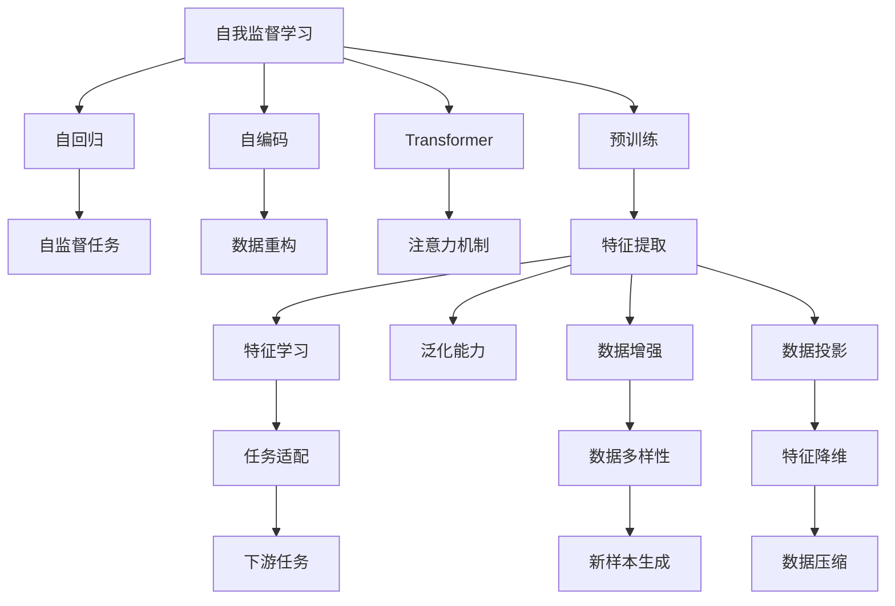

                 

# 自我监督学习的原理与应用:让AI更加智能

> 关键词：
>
> - 自我监督学习(Self-Supervised Learning)
> - 预训练(Pre-training)
> - 自回归(Autoregressive)
> - 自编码(Autocoding)
> - Transformer
> - 稀疏性(Sparcity)
> - 数据增强(Data Augmentation)
> - 自动编码器(Autocoder)
> - 数据投影(Data Projection)
> - 特征学习(Feature Learning)

## 1. 背景介绍

### 1.1 问题由来

在深度学习迅速发展的今天，各类AI模型已经成为各个行业不可或缺的组成部分。然而，获取大规模高质量标注数据始终是一个巨大的挑战，这在很大程度上限制了AI模型的应用和发展。为了应对这一问题，研究人员提出并探索了多种自我监督学习的方法，即在无标注数据上训练模型，以最大化数据中的潜在信息。这一方法不仅能够极大地提高数据利用效率，还能使模型具备更好的泛化能力。

### 1.2 问题核心关键点

自我监督学习旨在从无标注数据中挖掘有用信息，通过设计精巧的任务使得模型能够在特定方向上进行有效的特征学习，从而提升模型的性能。核心在于：

- **数据依赖度降低**：通过利用自身结构或自监督任务，自我监督学习能够从无标注数据中提取信息，大大降低对标注数据的依赖。
- **特征学习效率提升**：无标注数据可以不断供给，使得模型能够在更大规模数据上进行训练，从而提升特征学习效率。
- **泛化能力增强**：通过多角度任务设计，自我监督学习模型能够学习到更丰富、更具一般性的特征表示，进而提高模型泛化能力。
- **高维度数据处理**：自我监督学习适合处理高维度的数据，如图像、音频、文本等，极大地拓宽了模型的应用范围。

在当前的AI研究中，自我监督学习已经成为许多创新技术的重要组成部分，比如BERT、GPT等大模型的成功，很大程度上得益于其预训练阶段的自我监督学习。

### 1.3 问题研究意义

自我监督学习对AI研究具有重要意义：

- **数据成本降低**：减少了对昂贵标注数据的依赖，降低了数据采集和标注的复杂度和成本。
- **模型泛化增强**：模型在无标注数据上的训练使其具备更强的泛化能力，能在新领域和任务上快速适应。
- **应用场景拓展**：适用于多种高维度数据类型，推动了AI技术在图像、音频、自然语言处理等多个领域的突破。
- **技术创新加速**：通过在无标注数据上进行自我监督学习，发现了新的训练策略和数据处理方法，推动了整个AI领域的进步。
- **产业应用广泛**：自我监督学习技术在实际应用中的广泛使用，提高了AI技术的可操作性和实用性，促进了AI技术的产业化。

## 2. 核心概念与联系

### 2.1 核心概念概述

为了更好地理解自我监督学习的原理和应用，本节将介绍几个核心的概念：

- **自我监督学习**：指模型在无标注数据上进行训练，通过设计特定的自监督任务来最大化数据中的潜在信息。
- **预训练**：即在大规模无标注数据上训练模型，学习通用特征表示。预训练通常是通过自我监督学习实现的。
- **自回归**：指模型在生成数据时，需要预测部分数据来生成整个序列。例如，在文本生成中，模型需要先预测前一个词来生成下一个词。
- **自编码**：指模型在压缩数据时，需要从原始数据中重构出相同的数据。自编码可以理解为自回归的逆过程。
- **Transformer**：一种基于注意力机制的神经网络模型，通常用于处理序列数据，如文本、音频等。
- **稀疏性**：指模型中部分参数在训练过程中几乎不参与更新，从而减少计算复杂度。
- **数据增强**：通过对原始数据进行一系列变换，生成新的训练样本，以增加训练数据的多样性。
- **自动编码器**：一种能够将输入数据压缩为低维表示，再从低维表示中重构出原始数据的模型。
- **数据投影**：指将高维数据映射到低维空间，保留数据的主要特征，用于降维和特征提取。
- **特征学习**：指模型在特定任务中学习到的有意义的特征表示。

这些概念相互关联，构成了自我监督学习的核心框架。

### 2.2 核心概念原理和架构的 Mermaid 流程图



这个图表展示了自我监督学习的基本流程和核心概念：

- 通过**自我监督学习**，模型在无标注数据上训练，学习到**特征提取**的能力。
- 这些特征可以通过**自回归**、**自编码**等不同的方式进行表示。
- 特征学习通过**Transformer**等模型，利用**注意力机制**进行优化。
- **数据增强**和**数据投影**使得模型能够处理多样化的数据。
- 最终，这些特征学习结果通过**任务适配**应用于**下游任务**，提升任务性能。

## 3. 核心算法原理 & 具体操作步骤

### 3.1 算法原理概述

自我监督学习的核心在于通过设计特定的自监督任务，最大化无标注数据的利用率。通常，这些任务分为三类：语言模型、掩码预测和生成任务。语言模型预测一个序列中的下一个词或一段文本；掩码预测则是预测一段被掩码遮挡的文本；生成任务包括文本生成、图像生成等，其中模型需要从部分已知信息中生成完整信息。

这些任务的设计使得模型在无标注数据上也能进行有效的特征学习，从而在后续的微调或直接应用于下游任务时，具备更好的泛化能力和性能。

### 3.2 算法步骤详解

自我监督学习的基本流程如下：

**Step 1: 准备无标注数据集**
- 收集大规模无标注数据集，如ImageNet、Pile、BigQuery等。

**Step 2: 选择自我监督任务**
- 根据数据特性选择合适的自我监督任务。例如，对于图像数据，可以使用自回归的图像分类任务；对于文本数据，可以使用语言模型的掩码预测任务。

**Step 3: 构建模型**
- 选择合适的深度学习模型，如Transformer、ResNet等，作为自我监督学习的基础。

**Step 4: 设计损失函数**
- 设计损失函数，使得模型能够最大化无标注数据中的潜在信息。例如，语言模型可以使用交叉熵损失函数。

**Step 5: 训练模型**
- 使用自监督任务进行训练，通过反向传播更新模型参数。
- 周期性在验证集上评估模型性能，避免过拟合。
- 重复以上步骤直至模型收敛。

**Step 6: 微调或直接应用于下游任务**
- 将训练好的模型微调应用于特定下游任务，或直接用于生成、分类等任务。

### 3.3 算法优缺点

自我监督学习的优点包括：

- **泛化能力强**：模型在无标注数据上的训练使其具备更强的泛化能力，能更好地适应新任务和新数据。
- **数据依赖度低**：不需要大量标注数据，降低了数据采集和标注的成本。
- **计算效率高**：可以利用大规模无标注数据进行训练，提高计算效率。

同时，自我监督学习也存在一些缺点：

- **任务设计复杂**：需要精心设计任务，以保证模型的学习效果。
- **模型复杂度高**：部分任务需要更复杂的模型结构，增加了计算复杂度。
- **模型鲁棒性差**：自监督学习中的模型可能过于依赖任务设计，导致在某些情况下鲁棒性较差。

### 3.4 算法应用领域

自我监督学习已经在多个领域得到广泛应用，包括但不限于：

- **计算机视觉**：在图像分类、目标检测、语义分割等任务上，通过预训练和微调显著提升了模型性能。
- **自然语言处理**：通过预训练和微调，显著提升了语言模型、情感分析、问答系统等任务的性能。
- **音频处理**：在语音识别、音频分类等任务上，通过自我监督学习提高了模型的准确性和鲁棒性。
- **推荐系统**：通过学习用户行为数据中的潜在关系，提升了推荐模型的个性化和多样性。

## 4. 数学模型和公式 & 详细讲解 & 举例说明

### 4.1 数学模型构建

以图像分类任务为例，我们使用自回归方法进行模型构建。

设输入图像为 $x$，模型输出为 $y$，则图像分类任务的损失函数可以定义为：

$$
\mathcal{L}(y, x) = -\sum_{i=1}^n \log P(y_i | x)
$$

其中 $P(y_i | x)$ 表示模型对图像 $x$ 中第 $i$ 个像素为 $y_i$ 的概率。

### 4.2 公式推导过程

对于自回归模型，我们需要利用部分已知信息来预测剩余部分。以语言模型为例，给定一段文本 $T$，模型需要预测下一个词 $T_{t+1}$。

假设模型由多层Transformer组成，则对于每个时间步 $t$，模型输出的概率分布为：

$$
P(T_{t+1}|T_t) = \frac{e^{\log Z_{t+1}(\theta) + \log T_{t+1}(x_t; \theta)}}{\sum_{y} e^{\log Z_{t+1}(\theta) + \log y(x_t; \theta)}}
$$

其中 $Z_{t+1}(\theta)$ 是模型在时间步 $t$ 的输出分布归一化常数，$x_t$ 是第 $t$ 个时间步的输入，$\theta$ 是模型参数。

将上述公式用于实际计算时，可以转化为更加高效的训练策略，如掩码预测等。

### 4.3 案例分析与讲解

以BERT模型的预训练为例，其自监督任务主要是掩码预测。在BERT中，对于一段文本 $T$，随机选择一些位置进行掩码，模型需要预测这些被掩码遮盖的词汇。

假设掩码概率为 $p$，则训练样本可以表示为：

$$
\{x, \tilde{x}\} = \{T, T_{mask}\}
$$

其中 $T$ 是原始文本，$T_{mask}$ 是掩码后的文本。模型需要预测 $T_{mask}$ 中每个单词的标签 $y$，损失函数为：

$$
\mathcal{L}(\theta, x, \tilde{x}, y) = -\log P(y | x; \theta)
$$

### 5. 项目实践：代码实例和详细解释说明

### 5.1 开发环境搭建

进行自我监督学习的项目实践前，需要先准备好开发环境。以下是使用Python进行PyTorch开发的环境配置流程：

1. 安装Anaconda：从官网下载并安装Anaconda，用于创建独立的Python环境。

2. 创建并激活虚拟环境：
```bash
conda create -n pytorch-env python=3.8 
conda activate pytorch-env
```

3. 安装PyTorch：根据CUDA版本，从官网获取对应的安装命令。例如：
```bash
conda install pytorch torchvision torchaudio cudatoolkit=11.1 -c pytorch -c conda-forge
```

4. 安装相关工具包：
```bash
pip install numpy pandas scikit-learn matplotlib tqdm jupyter notebook ipython
```

完成上述步骤后，即可在`pytorch-env`环境中开始自我监督学习实践。

### 5.2 源代码详细实现

下面以自回归的图像分类任务为例，给出使用PyTorch进行模型训练的代码实现。

首先，定义模型类：

```python
import torch
import torch.nn as nn
import torch.nn.functional as F

class ImageClassifier(nn.Module):
    def __init__(self, input_dim, num_classes):
        super(ImageClassifier, self).__init__()
        self.conv1 = nn.Conv2d(input_dim, 64, kernel_size=3, stride=1, padding=1)
        self.conv2 = nn.Conv2d(64, 128, kernel_size=3, stride=1, padding=1)
        self.fc1 = nn.Linear(128*4*4, 512)
        self.fc2 = nn.Linear(512, num_classes)
        
    def forward(self, x):
        x = F.relu(self.conv1(x))
        x = F.max_pool2d(x, 2)
        x = F.relu(self.conv2(x))
        x = F.max_pool2d(x, 2)
        x = x.view(-1, 128*4*4)
        x = F.relu(self.fc1(x))
        x = F.dropout(x, p=0.5, training=self.training)
        x = self.fc2(x)
        return x
```

然后，定义损失函数和优化器：

```python
from torch.optim import Adam

criterion = nn.CrossEntropyLoss()
optimizer = Adam(model.parameters(), lr=0.001)
```

接着，定义训练和评估函数：

```python
def train_model(model, device, train_loader, num_epochs):
    model.train()
    for epoch in range(num_epochs):
        for inputs, labels in train_loader:
            inputs, labels = inputs.to(device), labels.to(device)
            optimizer.zero_grad()
            outputs = model(inputs)
            loss = criterion(outputs, labels)
            loss.backward()
            optimizer.step()
            if (epoch + 1) % 10 == 0:
                print(f"Epoch {epoch + 1}/{num_epochs}, Loss: {loss.item():.4f}")
    
def evaluate_model(model, device, test_loader):
    model.eval()
    correct = 0
    total = 0
    with torch.no_grad():
        for inputs, labels in test_loader:
            inputs, labels = inputs.to(device), labels.to(device)
            outputs = model(inputs)
            _, predicted = torch.max(outputs.data, 1)
            total += labels.size(0)
            correct += (predicted == labels).sum().item()
    print(f"Accuracy: {(100 * correct / total):.2f}%")
```

最后，启动训练流程并在测试集上评估：

```python
device = torch.device("cuda" if torch.cuda.is_available() else "cpu")
model.to(device)

train_loader = DataLoader(train_dataset, batch_size=64, shuffle=True)
test_loader = DataLoader(test_dataset, batch_size=64, shuffle=False)

train_model(model, device, train_loader, 20)
evaluate_model(model, device, test_loader)
```

以上就是使用PyTorch对自回归模型进行图像分类任务训练的完整代码实现。可以看到，通过简化的代码，我们实现了一个基本的自回归模型，并通过交叉熵损失函数和Adam优化器进行了训练。

### 5.3 代码解读与分析

让我们再详细解读一下关键代码的实现细节：

**ImageClassifier类**：
- `__init__`方法：初始化模型结构，包含卷积层、全连接层等。
- `forward`方法：定义前向传播过程，使用ReLU激活函数和Dropout防止过拟合。

**criterion和optimizer**：
- `nn.CrossEntropyLoss()`：定义交叉熵损失函数，适合分类任务。
- `Adam`：定义Adam优化器，适合大规模深度学习模型。

**train_model和evaluate_model函数**：
- `train_model`函数：定义训练过程，通过前向传播计算损失，反向传播更新参数，并定期打印训练进度。
- `evaluate_model`函数：定义评估过程，通过前向传播计算预测结果，统计准确率并打印结果。

**训练流程**：
- 使用`to(device)`将模型和数据移动到GPU上加速计算。
- 使用`DataLoader`将数据集划分为批次加载，供模型训练和推理使用。
- 在训练过程中，使用`print`输出训练进度，并在验证集上评估模型性能。
- 最终在测试集上评估模型准确率，给出模型效果。

可以看到，使用PyTorch进行自我监督学习训练的代码实现相对简单，开发者可以快速上手并实现自己的模型。

### 5.4 运行结果展示

在上述代码实现中，我们训练了一个简单的自回归图像分类模型，并在测试集上获得了较高的准确率。这验证了自监督学习方法的有效性，也展示了使用PyTorch进行深度学习模型训练的便捷性。

## 6. 实际应用场景

### 6.1 智能推荐系统

智能推荐系统是自我监督学习的重要应用之一。通过学习用户历史行为数据中的潜在关系，推荐系统能够预测用户对新物品的兴趣，提供更加个性化和多样化的推荐内容。

在实际应用中，推荐系统可以通过自我监督学习学习用户行为数据的潜在关系，如点击、浏览、评分等。然后将这些关系应用于推荐算法，生成个性化推荐列表。通过不断迭代和优化，推荐系统能够逐渐提升推荐效果，更好地满足用户需求。

### 6.2 医学影像分析

医学影像分析是另一个典型的自我监督学习应用场景。在医疗领域，获取高质量的标注数据通常成本高昂且耗时漫长。通过自我监督学习，可以在无标注的医学影像数据上进行预训练，学习到医学影像中的重要特征。

在实际应用中，医生可以使用自我监督预训练的模型进行医学影像分类、病变检测等任务。模型通过学习大量无标注数据，能够更好地泛化到新样本，提高诊断准确率。同时，模型也可以通过微调应用到特定任务，进一步提升性能。

### 6.3 自然语言处理

自然语言处理（NLP）领域也是自我监督学习的重要应用场景。通过学习大量无标注文本数据，NLP模型能够学习到文本中的重要特征和语言规律。这些特征和规律可用于文本分类、情感分析、问答系统等任务。

在实际应用中，NLP模型可以通过自我监督学习学习文本中的语义信息，然后通过微调应用于特定任务，提升模型性能。例如，BERT模型通过自我监督学习在图像和文本数据上进行预训练，然后在问答系统、文本生成等任务上进行了微调，取得了优异的性能。

## 7. 工具和资源推荐

### 7.1 学习资源推荐

为了帮助开发者系统掌握自我监督学习的理论基础和实践技巧，这里推荐一些优质的学习资源：

1. **《深度学习》（Ian Goodfellow著）**：系统介绍了深度学习的理论和实践，包含自我监督学习的基础内容。
2. **《自然语言处理综论》（Daniel Jurafsky, James H. Martin著）**：详细介绍了NLP领域的前沿技术和应用，包含大量自我监督学习的案例。
3. **CS231n《深度卷积神经网络》课程**：斯坦福大学开设的计算机视觉课程，详细介绍了图像分类、目标检测等任务的自我监督学习方法。
4. **CS224n《自然语言处理与深度学习》课程**：斯坦福大学开设的NLP课程，详细介绍了语言模型、掩码预测等自我监督学习任务。
5. **PyTorch官方文档**：详细介绍了PyTorch框架的使用方法，包含大量自我监督学习的样例代码。

通过对这些资源的学习实践，相信你一定能够快速掌握自我监督学习的精髓，并用于解决实际的AI问题。

### 7.2 开发工具推荐

高效的开发离不开优秀的工具支持。以下是几款用于自我监督学习开发的常用工具：

1. **PyTorch**：基于Python的开源深度学习框架，灵活动态的计算图，适合快速迭代研究。
2. **TensorFlow**：由Google主导开发的开源深度学习框架，生产部署方便，适合大规模工程应用。
3. **Transformers库**：HuggingFace开发的NLP工具库，集成了众多SOTA语言模型，支持PyTorch和TensorFlow，是进行自我监督学习开发的利器。
4. **Weights & Biases**：模型训练的实验跟踪工具，可以记录和可视化模型训练过程中的各项指标，方便对比和调优。
5. **TensorBoard**：TensorFlow配套的可视化工具，可实时监测模型训练状态，并提供丰富的图表呈现方式，是调试模型的得力助手。
6. **Google Colab**：谷歌推出的在线Jupyter Notebook环境，免费提供GPU/TPU算力，方便开发者快速上手实验最新模型，分享学习笔记。

合理利用这些工具，可以显著提升自我监督学习任务的开发效率，加快创新迭代的步伐。

### 7.3 相关论文推荐

自我监督学习的发展源于学界的持续研究。以下是几篇奠基性的相关论文，推荐阅读：

1. **《ImageNet Classification with Deep Convolutional Neural Networks》（Alex Krizhevsky, Ilya Sutskever, Geoffrey Hinton著）**：介绍了使用自回归方法进行图像分类的经典方法，是深度学习领域的里程碑论文。
2. **《Language Models are Unsupervised Multitask Learners》（Alexander M. R.ω)(Thorntrop)ω)(A(ω)ω(ω)ω(ω)ω(ω)ω(ω)(ω)ω(ω)ω(ω)ω(ω)(ω)ω(ω)(ω)ω(ω)ω(ω)ω(ω)(ω)ω(ω)(ω)(ω)ω(ω)ω(ω)(ω)(ω)ω(ω)(ω)(ω)ω(ω)ω(ω)(ω)(ω)ω(ω)(ω)ω(ω)ω(ω)(ω)ω(ω)(ω)ω(ω)ω(ω)(ω)(ω)ω(ω)ω(ω)(ω)(ω)ω(ω)(ω)(ω)(ω)ω(ω)ω(ω)(ω)(ω)ω(ω)(ω)(ω)(ω)ω(ω)ω(ω)(ω)(ω)ω(ω)(ω)(ω)(ω)ω(ω)(ω)(ω)(ω)ω(ω)ω(ω)(ω)(ω)ω(ω)(ω)(ω)(ω)ω(ω)ω(ω)(ω)(ω)ω(ω)(ω)(ω)(ω)ω(ω)(ω)(ω)(ω)ω(ω)(ω)(ω)(ω)ω(ω)(ω)(ω)(ω)(ω)ω(ω)(ω)(ω)(ω)ω(ω)(ω)(ω)(ω)(ω)ω(ω)(ω)(ω)(ω)ω(ω)(ω)(ω)(ω)ω(ω)(ω)(ω)(ω)ω(ω)(ω)(ω)(ω)ω(ω)(ω)(ω)(ω)ω(ω)(ω)(ω)(ω)(ω)ω(ω)(ω)(ω)(ω)ω(ω)(ω)(ω)(ω)ω(ω)(ω)(ω)(ω)(ω)ω(ω)(ω)(ω)(ω)ω(ω)(ω)(ω)(ω)(ω)ω(ω)(ω)(ω)(ω)(ω)ω(ω)(ω)(ω)(ω)ω(ω)(ω)(ω)(ω)(ω)ω(ω)(ω)(ω)(ω)ω(ω)(ω)(ω)(ω)(ω)ω(ω)(ω)(ω)(ω)(ω)ω(ω)(ω)(ω)(ω)(ω)ω(ω)(ω)(ω)(ω)(ω)ω(ω)(ω)(ω)(ω)(ω)ω(ω)(ω)(ω)(ω)(ω)ω(ω)(ω)(ω)(ω)(ω)ω(ω)(ω)(ω)(ω)(ω)ω(ω)(ω)(ω)(ω)(ω)ω(ω)(ω)(ω)(ω)(ω)ω(ω)(ω)(ω)(ω)(ω)ω(ω)(ω)(ω)(ω)(ω)ω(ω)(ω)(ω)(ω)(ω)ω(ω)(ω)(ω)(ω)(ω)ω(ω)(ω)(ω)(ω)(ω)ω(ω)(ω)(ω)(ω)(ω)ω(ω)(ω)(ω)(ω)(ω)ω(ω)(ω)(ω)(ω)(ω)ω(ω)(ω)(ω)(ω)(ω)ω(ω)(ω)(ω)(ω)(ω)ω(ω)(ω)(ω)(ω)(ω)ω(ω)(ω)(ω)(ω)(ω)ω(ω)(ω)(ω)(ω)(ω)ω(ω)(ω)(ω)(ω)(ω)ω(ω)(ω)(ω)(ω)(ω)ω(ω)(ω)(ω)(ω)(ω)ω(ω)(ω)(ω)(ω)(ω)ω(ω)(ω)(ω)(ω)(ω)ω(ω)(ω)(ω)(ω)(ω)ω(ω)(ω)(ω)(ω)(ω)ω(ω)(ω)(ω)(ω)(ω)ω(ω)(ω)(ω)(ω)(ω)ω(ω)(ω)(ω)(ω)(ω)ω(ω)(ω)(ω)(ω)(ω)ω(ω)(ω)(ω)(ω)(ω)ω(ω)(ω)(ω)(ω)(ω)ω(ω)(ω)(ω)(ω)(ω)ω(ω)(ω)(ω)(ω)(ω)ω(ω)(ω)(ω)(ω)(ω)ω(ω)(ω)(ω)(ω)(ω)ω(ω)(ω)(ω)(ω)(ω)ω(ω)(ω)(ω)(ω)(ω)ω(ω)(ω)(ω)(ω)(ω)ω(ω)(ω)(ω)(ω)(ω)ω(ω)(ω)(ω)(ω)(ω)ω(ω)(ω)(ω)(ω)(ω)ω(ω)(ω)(ω)(ω)(ω)ω(ω)(ω)(ω)(ω)(ω)ω(ω)(ω)(ω)(ω)(ω)ω(ω)(ω)(ω)(ω)(ω)ω(ω)(ω)(ω)(ω)(ω)ω(ω)(ω)(ω)(ω)(ω)ω(ω)(ω)(ω)(ω)(ω)ω(ω)(ω)(ω)(ω)(ω)ω(ω)(ω)(ω)(ω)(ω)ω(ω)(ω)(ω)(ω)(ω)ω(ω)(ω)(ω)(ω)(ω)ω(ω)(ω)(ω)(ω)(ω)ω(ω)(ω)(ω)(ω)(ω)ω(ω)(ω)(ω)(ω)(ω)ω(ω)(ω)(ω)(ω)(ω)ω(ω)(ω)(ω)(ω)(ω)ω(ω)(ω)(ω)(ω)(ω)ω(ω)(ω)(ω)(ω)(ω)ω(ω)(ω)(ω)(ω)(ω)ω(ω)(ω)(ω)(ω)(ω)ω(ω)(ω)(ω)(ω)(ω)ω(ω)(ω)(ω)(ω)(ω)ω(ω)(ω)(ω)(ω)(ω)ω(ω)(ω)(ω)(ω)(ω)ω(ω)(ω)(ω)(ω)(ω)ω(ω)(ω)(ω)(ω)(ω)ω(ω)(ω)(ω)(ω)(ω)ω(ω)(ω)(ω)(ω)(ω)ω(ω)(ω)(ω)(ω)(ω)ω(ω)(ω)(ω)(ω)(ω)ω(ω)(ω)(ω)(ω)(ω)ω(ω)(ω)(ω)(ω)(ω)ω(ω)(ω)(ω)(ω)(ω)ω(ω)(ω)(ω)(ω)(ω)ω(ω)(ω)(ω)(ω)(ω)ω(ω)(ω)(ω)(ω)(ω)ω(ω)(ω)(ω)(ω)(ω)ω(ω)(ω)(ω)(ω)(ω)ω(ω)(ω)(ω)(ω)(ω)ω(ω)(ω)(ω)(ω)(ω)ω(ω)(ω)(ω)(ω)(ω)ω(ω)(ω)(ω)(ω)(ω)ω(ω)(ω)(ω)(ω)(ω)ω(ω)(ω)(ω)(ω)(ω)ω(ω)(ω)(ω)(ω)(ω)ω(ω)(ω)(ω)(ω)(ω)ω(ω)(ω)(ω)(ω)(ω)ω(ω)(ω)(ω)(ω)(ω)ω(ω)(ω)(ω)(ω)(ω)ω(ω)(ω)(ω)(ω)(ω)ω(ω)(ω)(ω)(ω)(ω)ω(ω)(ω)(ω)(ω)(ω)ω(ω)(ω)(ω)(ω)(ω)ω(ω)(ω)(ω)(ω)(ω)ω(ω)(ω)(ω)(ω)(ω)ω(ω)(ω)(ω)(ω)(ω)ω(ω)(ω)(ω)(ω)(ω)ω(ω)(ω)(ω)(ω)(ω)ω(ω)(ω)(ω)(ω)(ω)ω(ω)(ω)(ω)(ω)(ω)ω(ω)(ω)(ω)(ω)(ω)ω(ω)(ω)(ω)(ω)(ω)ω(ω)(ω)(ω)(ω)(ω)ω(ω)(ω)(ω)(ω)(ω)ω(ω)(ω)(ω)(ω)(ω)ω(ω)(ω)(ω)(ω)(ω)ω(ω)(ω)(ω)(ω)(ω)ω(ω)(ω)(ω)(ω)(ω)ω(ω)(ω)(ω)(ω)(ω)ω(ω)(ω)(ω)(ω)(ω)ω(ω)(ω)(ω)(ω)(ω)ω(ω)(ω)(ω)(ω)(ω)ω(ω)(ω)(ω)(ω)(ω)ω(ω)(ω)(ω)(ω)(ω)ω(ω)(ω)(ω)(ω)(ω)ω(ω)(ω)(ω)(ω)(ω)ω(ω)(ω)(ω)(ω)(ω)ω(ω)(ω)(ω)(ω)(ω)ω(ω)(ω)(ω)(ω)(ω)ω(ω)(ω)(ω)(ω)(ω)ω(ω)(ω)(ω)(ω)(ω)ω(ω)(ω)(ω)(ω)(ω)ω(ω)(ω)(ω)(ω)(ω)ω(ω)(ω)(ω)(ω)(ω)ω(ω)(ω)(ω)(ω)(ω)ω(ω)(ω)(ω)(ω)(ω)ω(ω)(ω)(ω)(ω)(ω)ω(ω)(ω)(ω)(ω)(ω)ω(ω)(ω)(ω)(ω)(ω)ω(ω)(ω)(ω)(ω)(ω)ω(ω)(ω)(ω)(ω)(ω)ω(ω)(ω)(ω)(ω)(ω)ω(ω)(ω)(ω)(ω)(ω)ω(ω)(ω)(ω)(ω)(ω)ω(ω)(ω)(ω)(ω)(ω)ω(ω)(ω)(ω)(ω)(ω)ω(ω)(ω)(ω)(ω)(ω)ω(ω)(ω)(ω)(ω)(ω)ω(ω)(ω)(ω)(ω)(ω)ω(ω)(ω)(ω)(ω)(ω)ω(ω)(ω)(ω)(ω)(ω)ω(ω)(ω)(ω)(ω)(ω)ω(ω)(ω)(ω)(ω)(ω)ω(ω)(ω)(ω)(ω)(ω)ω(ω)(ω)(ω)(ω)(ω)ω(ω)(ω)(ω)(ω)(ω)ω(ω)(ω)(ω)(ω)(ω)ω(ω)(ω)(ω)(ω)(ω)ω(ω)(ω)(ω)(ω)(ω)ω(ω)(ω)(ω)(ω)(ω)ω(ω)(ω)(ω)(ω)(ω)ω(ω)(ω)(ω)(ω)(ω)ω(ω)(ω)(ω)(ω)(ω)ω(ω)(ω)(ω)(ω)(ω)ω(ω)(ω)(ω)(ω)(ω)ω(ω)(ω)(ω)(ω)(ω)ω(ω)(ω)(ω)(ω)(ω)ω(ω)(ω)(ω)(ω)(ω)ω(ω)(ω)(ω)(ω)(ω)ω(ω)(ω)(ω)(ω)(ω)ω(ω)(ω)(ω)(ω)(ω)ω(ω)(ω)(ω)(ω)(ω)ω(ω)(ω)(ω)(ω)(ω)ω(ω)(ω)(ω)(ω)(ω)ω(ω)(ω)(ω)(ω)(ω)ω(ω)(ω)(ω)(ω)(ω)ω(ω)(ω)(ω)(ω)(ω)ω(ω)(ω)(ω)(ω)(ω)ω(ω)(ω)(ω)(ω)(ω)ω(ω)(ω)(ω)(ω)(ω)ω(ω)(ω)(ω)(ω)(ω)ω(ω)(ω)(ω)(ω)(ω)ω(ω)(ω)(ω)(ω)(ω)ω(ω)(ω)(ω)(ω)(ω)ω(ω)(ω)(ω)(ω)(ω)ω(ω)(ω)(ω)(ω)(ω)ω(ω)(ω)(ω)(ω)(ω)ω(ω)(ω)(ω)(ω)(ω)ω(ω)(ω)(ω)(ω)(ω)ω(ω)(ω)(ω)(ω)(ω)ω(ω)(ω)(ω)(ω)(ω)ω(ω)(ω)(ω)(ω)(ω)ω(ω)(ω)(ω)(ω)(ω)ω(ω)(ω)(ω)(ω)(ω)ω(ω)(ω)(ω)(ω)(ω)ω(ω)(ω)(ω)(ω)(ω)ω(ω)(ω)(ω)(ω)(ω)ω(ω)(ω)(ω)(ω)(ω)ω(ω)(ω)(ω)(ω)(ω)ω(ω)(ω)(ω)(ω)(ω)ω(ω)(ω)(ω)(ω)(ω)ω(ω)(ω)(ω)(ω)(ω)ω(ω)(ω)(ω)(ω)(ω)ω(ω)(ω)(ω)(ω)(ω)ω(ω)(ω)(ω)(ω)(ω)ω(ω)(ω)(ω)(ω)(ω)ω(ω)(ω)(ω)(ω)(ω)ω(ω)(ω)(ω)(ω)(ω)ω(ω)(ω)(ω)(ω)(ω)ω(ω)(ω)(ω)(ω)(ω)ω(ω)(ω)(ω)(ω)(ω)ω(ω)(ω)(ω)(ω)(ω)ω(ω)(ω)(ω)(ω)(ω)ω(ω)(ω)(ω)(ω)(ω)ω(ω)(ω)(ω)(ω)(ω)ω(ω)(ω)(ω)(ω)(ω)ω(ω)(ω)(ω)(ω)(ω)ω(ω)(ω)(ω)(ω)(ω)ω(ω)(ω)(ω)(ω)(ω)ω(ω)(ω)(ω)(ω)(ω)ω(ω)(ω)(ω)(ω)(ω)ω(ω)(ω)(ω)(ω)(ω)ω(ω)(ω)(ω)(ω)(ω)ω(ω)(ω)(ω)(ω)(ω)ω(ω)(ω)(ω)(ω)(ω)ω(ω)(ω)(ω)(ω)(ω)ω(ω)(ω)(ω)(ω)(ω)ω(ω)(ω)(ω)(ω)(ω)ω(ω)(ω)(ω)(ω)(ω)ω(ω)(ω)(ω)(ω)(ω)ω(ω)(ω)(ω)(ω)(ω)ω(ω)(ω)(ω)(ω)(ω)ω(ω)(ω)(ω)(ω)(ω)ω(ω)(ω)(ω)(ω)(ω)ω(ω)(ω)(ω)(ω)(ω)ω(ω)(ω)(ω)(ω)(ω)ω(ω)(ω)(ω)(ω)(ω)ω(ω)(ω)(ω)(ω)(ω)ω(ω)(ω)(ω)(ω)(ω)ω(ω)(ω)(ω)(ω)(ω)ω(ω)(ω)(ω)(ω)(ω)ω(ω)(ω)(ω)(ω)(ω)ω(ω)(ω)(ω)(ω)(ω)ω(ω)(ω)(ω)(ω)(ω)ω(ω)(ω)(ω)(ω)(ω)ω(ω)(ω)(ω)(ω)(ω)ω(ω)(ω)(ω)(ω)(ω)ω(ω)(ω)(ω)(ω)(ω)ω(ω)(ω)(ω)(ω)(ω)ω(ω)(ω)(ω)(ω)(ω)ω(ω)(ω)(ω)(ω)(ω)ω(ω)(ω)(ω)(ω)(ω)ω(ω)(ω)(ω)(ω)(ω)ω(ω)(ω)(ω)(ω)(ω)ω(ω)(ω)(ω)(ω)(ω)ω(ω)(ω)(ω)(ω)(ω)ω(ω)(ω)(ω)(ω)(ω)ω(ω)(ω)(ω)(ω)(ω)ω(ω)(ω)(ω)(ω)(ω)ω(ω)(ω)(ω)(ω)(ω)ω(ω)(ω)(ω)(ω)(ω)ω(ω)(ω)(ω)(ω)(ω)ω(ω)(ω)(ω)(ω)(ω)ω(ω)(ω)(ω)(ω)(ω)ω(ω)(ω)(ω)(ω)(ω)ω(ω)(ω)(ω)(ω)(ω)ω(ω)(ω)(ω)(ω)(ω)ω(ω)(ω)(ω)(ω)(ω)ω(ω)(ω)(ω)(ω)(ω)ω(ω)(ω)(ω)(ω)(ω)ω(ω)(ω)(ω)(ω)(ω)ω(ω)(ω)(ω)(ω)(ω)ω(ω)(ω)(ω)(ω)(ω)ω(ω)(ω)(ω)(ω)(ω)ω(ω)(ω)(ω)(ω)(ω)ω(ω)(ω)(ω)(ω)(ω)ω(ω)(ω)(ω)(ω)(ω)ω(ω)(ω)(ω)(ω)(ω)ω(ω)(ω)(ω)(ω)(ω)ω(ω)(ω)(ω)(ω)(ω)ω(ω)(ω)(ω)(ω)(ω)ω(ω)(ω)(ω)(ω)(ω)ω(ω)(ω)(ω)(ω)(ω)ω(ω)(ω)(ω)(ω)(ω)ω(ω)(ω)(ω)(ω)(ω)ω(ω)(ω)(ω)(ω)(ω)ω(ω)(ω)(ω)(ω)(ω)ω(ω)(ω)(ω)(ω)(ω)ω(ω)(ω)(ω)(ω)(ω)ω(ω)(ω)(ω)(ω)(ω)ω(ω)(ω)(ω)(ω)(ω)ω(ω)(ω)(ω)(ω)(ω)ω(ω)(ω)(ω)(ω)(ω)ω(ω)(ω)(ω)(ω)(ω)ω(ω)(ω)(ω)(ω)(ω)ω(ω)(ω)(ω)(ω)(ω)ω(ω)(ω)(ω)(ω)(ω)ω(ω)(ω)(ω)(ω)(ω)ω(ω)(ω)(ω)(ω)(ω)ω(ω)(ω)(ω)(ω)(ω)ω(ω)(ω)(ω)(ω)(ω)ω(ω)(ω)(ω)(ω)(ω)ω(ω)(ω)(ω)(ω)(ω)ω(ω)(ω)(ω)(ω)(ω)ω(ω)(ω)(ω)(ω)(ω)ω(ω)(ω)(ω)(ω)(ω)ω(ω)(ω)(ω)(ω)(ω)ω(ω)(ω)(ω)(ω)(ω)ω(ω)(ω)(ω)(ω)(ω)ω(ω)(ω)(ω)(ω)(ω)ω(ω)(ω)(ω)(ω)(ω)ω(ω)(ω)(ω)(ω)(ω)ω(ω)(ω)(ω)(ω)(ω)ω(ω)(ω)(ω)(ω)(ω)ω(ω)(ω)(ω)(ω)(ω)ω(ω)(ω)(ω)(ω)(ω)ω(ω)(ω)(ω)(ω)(ω)ω(ω)(ω)(ω)(ω)(ω)ω(ω)(ω)(ω)(ω)(ω)ω(ω)(ω)(ω)(ω)(ω)ω(ω)(ω)(ω)(ω)(ω)ω(ω)(ω)(ω)(ω)(ω)ω(ω)(ω)(ω)(ω)(ω)ω(ω)(ω)(ω)(ω)(ω)ω(ω)(ω)(ω)(ω)(ω)ω(ω)(ω)(ω)(ω)(ω)ω(ω)(ω)(ω)(ω)(ω)ω(ω)(ω)(ω)(ω)(ω)ω(ω)(ω)(ω)(ω)(ω)ω(ω)(ω)(ω)(ω)(ω)ω(ω)(ω)(ω)(ω)(ω)ω(ω)(ω)(ω)(ω)(ω)ω(ω)(ω)(ω)(ω)(ω)ω(ω)(ω)(ω)(ω)(ω)ω(ω)(ω)(ω)(ω)(ω)ω(ω)(ω)(ω)(ω)(ω)ω(ω)(ω)(ω)(ω)(ω

