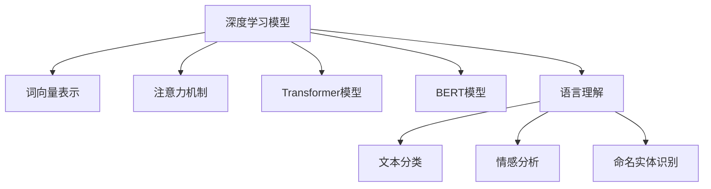

                 

# 自然语言处理（NLP）：AI语言理解技术

> 关键词：自然语言处理(NLP),深度学习,语言模型,词向量,注意力机制,Transformer,BERT,语言理解,文本分类,情感分析,命名实体识别

## 1. 背景介绍

### 1.1 问题由来

随着人工智能技术的迅猛发展，自然语言处理（NLP）领域逐渐成为人工智能应用的前沿和热点。自然语言是人类表达思想和情感的主要方式，自然语言处理旨在让计算机理解和处理人类语言，以实现高效的人机交互和信息自动化处理。NLP技术已经广泛应用于机器翻译、语音识别、智能客服、自动摘要、情感分析等多个领域，极大提升了信息处理的效率和准确性。

然而，自然语言处理仍面临着诸多挑战，例如语言的歧义性、语义的丰富性、情感的复杂性等。这要求NLP技术必须具备深度理解语言的能力，不仅能识别出语言文字的表面意思，还要能够推断出其背后的语义和情感，甚至进行创造性的语言生成。因此，构建具有强大语言理解能力的AI语言模型，是当前NLP研究的重要课题。

### 1.2 问题核心关键点

NLP技术主要依赖于深度学习模型来实现语言理解。深度学习模型通过大量有标签的文本数据进行训练，学习语言文字的特征表示，并在此基础上构建出强大的语言模型。常用的深度学习模型包括卷积神经网络（CNN）、递归神经网络（RNN）、长短时记忆网络（LSTM）、Transformer等。

深度学习模型的核心思想是通过学习大量数据中的隐含规律，提取高层次的特征表示。这包括词向量表示、句子表示、语义表示等，使得模型能够对不同语境下的语言进行理解和生成。然而，这种表示方法常常需要依赖大量标注数据，且计算复杂度较高。

为了降低深度学习模型的复杂度，近年来，研究人员提出了预训练语言模型（Pre-trained Language Models）的思路，即先在大规模无标签文本上对模型进行预训练，学习语言的通用表示。然后，根据具体的NLP任务，在预训练模型的基础上进行微调，优化模型的特定任务性能。

预训练语言模型通过学习语言的基本规律和上下文关联，使得模型具备了泛化能力，能够在各种NLP任务中表现优异。例如，BERT（Bidirectional Encoder Representations from Transformers）模型就是通过在大规模语料上进行预训练，学习语言的上下文关联和语义表示，从而在情感分析、文本分类、命名实体识别等多个任务上取得了最先进的结果。

## 2. 核心概念与联系

### 2.1 核心概念概述

为了更好地理解NLP技术，本节将介绍几个密切相关的核心概念：

- **深度学习模型**：利用多层神经网络结构，通过学习数据的隐含规律，实现高层次特征提取。

- **词向量表示**：将单词或短语映射到高维向量空间，使得计算机可以理解语言的语义关系。

- **注意力机制**：在深度学习模型中，用于突出输入数据中与当前输出最相关的部分，以增强模型的理解能力。

- **Transformer模型**：一种基于自注意力机制的神经网络结构，在语言理解任务中表现优异，已被广泛应用于NLP领域。

- **BERT模型**：一种基于Transformer架构的预训练语言模型，通过双向上下文表示，学习语言的语义表示，取得了NLP任务的SOTA表现。

- **语言理解**：指计算机能够理解和生成人类语言的能力，包括语义理解、情感分析、命名实体识别、语义相似度计算等。

- **文本分类**：将文本数据按照其主题或情感进行分类，如垃圾邮件分类、新闻分类等。

- **情感分析**：判断文本的情感倾向，如情感极性分类、情感强度计算等。

- **命名实体识别**：识别文本中的实体名称，如人名、地名、组织名等。

这些核心概念之间的逻辑关系可以通过以下Mermaid流程图来展示：



这个流程图展示了深度学习模型在NLP中的核心应用，从基础概念到高级模型，再到具体任务，层层递进，构成了NLP技术的体系架构。

## 3. 核心算法原理 & 具体操作步骤

### 3.1 算法原理概述

NLP技术的核心算法原理基于深度学习模型，通过学习大规模文本数据中的规律，提取语言文字的特征表示。常用的深度学习模型包括卷积神经网络（CNN）、递归神经网络（RNN）、长短时记忆网络（LSTM）、Transformer等。

以Transformer模型为例，Transformer通过自注意力机制，将输入序列中的每个单词表示为上下文相关的向量，实现了对单词之间复杂关联的建模。这种表示方式能够捕捉单词之间的语义关系，提升模型的语言理解能力。Transformer模型在多个NLP任务上取得了SOTA表现，成为了当前NLP领域的主流架构。

### 3.2 算法步骤详解

以BERT模型为例，其预训练和微调过程包括以下几个关键步骤：

1. **数据准备**：收集大规模无标签文本数据，作为BERT模型的预训练数据。这些数据通常涵盖多种语言、多种领域，如维基百科、新闻、社交媒体等。

2. **模型预训练**：使用预训练模型对大规模文本数据进行预训练。BERT模型的预训练任务包括掩码语言模型（Masked Language Model）和下一句预测（Next Sentence Prediction）。掩码语言模型通过随机遮蔽部分单词，让模型预测被遮蔽的单词，从而学习单词之间的上下文关系。下一句预测任务则是判断两个句子是否为相邻句子，通过学习句子之间的关系，提升模型的语言理解能力。

3. **微调**：根据具体的NLP任务，在预训练模型的基础上进行微调。微调过程包括选择合适的任务目标函数、设定合适的学习率、选择合适的正则化技术等。微调的目标是提升模型在特定任务上的性能，如文本分类、情感分析、命名实体识别等。

4. **评估与部署**：在测试集上评估微调后的模型性能，并进行部署，将模型集成到实际的应用系统中。

### 3.3 算法优缺点

基于深度学习的NLP技术具有以下优点：

- **强大的表示能力**：深度学习模型能够学习复杂的数据规律，提取高层次的特征表示，从而提升模型的语言理解能力。

- **高效的泛化能力**：通过在大规模数据上进行预训练，深度学习模型具备了泛化能力，能够适应各种NLP任务。

- **广泛的适用性**：深度学习模型可以应用于多种NLP任务，如文本分类、情感分析、命名实体识别等。

然而，深度学习模型也存在一些缺点：

- **数据依赖性强**：深度学习模型依赖大量的标注数据进行训练，获取高质量标注数据成本较高。

- **计算复杂度高**：深度学习模型通常需要大量的计算资源进行训练和推理，对硬件要求较高。

- **模型可解释性差**：深度学习模型被视为"黑盒"系统，难以解释其内部工作机制和决策逻辑。

- **过拟合风险高**：在标注数据不足的情况下，深度学习模型容易出现过拟合，影响模型泛化能力。

### 3.4 算法应用领域

基于深度学习的NLP技术已经在多个领域得到广泛应用，例如：

- **机器翻译**：利用预训练语言模型对文本进行翻译，如谷歌翻译、微软翻译等。

- **智能客服**：利用预训练语言模型对用户咨询进行自动回复，如阿里巴巴智能客服、腾讯智能客服等。

- **情感分析**：判断文本的情感倾向，如情感极性分类、情感强度计算等。

- **文本分类**：将文本数据按照其主题或情感进行分类，如垃圾邮件分类、新闻分类等。

- **命名实体识别**：识别文本中的实体名称，如人名、地名、组织名等。

- **问答系统**：对自然语言问题进行理解和回答，如IBM Watson、微软小冰等。

- **文本摘要**：将长文本压缩成简短摘要，如Quora文本摘要、Google新闻摘要等。

## 4. 数学模型和公式 & 详细讲解 & 举例说明

### 4.1 数学模型构建

以BERT模型为例，其预训练和微调过程可以通过以下数学模型进行描述：

1. **掩码语言模型**：输入一个句子 $x$，其中 $x_i$ 表示第 $i$ 个单词，通过掩码语言模型，随机遮蔽部分单词，得到遮蔽后的句子 $\tilde{x}$。模型的目标是通过遮蔽单词进行预测，从而学习单词之间的上下文关系。

2. **下一句预测**：输入两个句子 $x_1$ 和 $x_2$，判断这两个句子是否为相邻句子。模型的目标是通过学习句子之间的关系，提升模型的语言理解能力。

### 4.2 公式推导过程

以BERT模型的掩码语言模型为例，其训练过程可以表示为以下公式：

$$
\mathcal{L}(x,\tilde{x}) = \sum_{i=1}^{n} \log\left(\frac{e^{\text{softmax}(W_h [x_i, \tilde{x}_i])}{\sum_{j=1}^{n} e^{\text{softmax}(W_h [x_j, \tilde{x}_i])}\right)
$$

其中，$W_h$ 为模型参数，$n$ 为输入序列长度。公式的含义是通过softmax函数计算每个单词被遮蔽的概率，从而学习单词之间的上下文关系。

### 4.3 案例分析与讲解

以情感分析为例，我们可以使用BERT模型进行情感极性分类。具体步骤如下：

1. **数据准备**：收集情感标注数据集，如IMDB电影评论数据集，其中每个评论被标记为正面或负面情感。

2. **模型微调**：在BERT模型的基础上，使用情感标注数据集进行微调。选择合适的任务目标函数，如交叉熵损失函数，设定合适的学习率，进行梯度下降优化。

3. **评估与部署**：在测试集上评估微调后的模型性能，并进行部署，将模型集成到实际的应用系统中。

## 5. 项目实践：代码实例和详细解释说明

### 5.1 开发环境搭建

在进行NLP任务开发前，我们需要准备好开发环境。以下是使用Python进行PyTorch开发的环境配置流程：

1. 安装Anaconda：从官网下载并安装Anaconda，用于创建独立的Python环境。

2. 创建并激活虚拟环境：
```bash
conda create -n pytorch-env python=3.8 
conda activate pytorch-env
```

3. 安装PyTorch：根据CUDA版本，从官网获取对应的安装命令。例如：
```bash
conda install pytorch torchvision torchaudio cudatoolkit=11.1 -c pytorch -c conda-forge
```

4. 安装其他相关库：
```bash
pip install transformers
pip install pandas numpy matplotlib scikit-learn nltk
```

完成上述步骤后，即可在`pytorch-env`环境中开始NLP任务开发。

### 5.2 源代码详细实现

下面以情感分析任务为例，给出使用Transformer库对BERT模型进行微调的PyTorch代码实现。

```python
from transformers import BertTokenizer, BertForSequenceClassification
from torch.utils.data import Dataset, DataLoader
import torch

class SentimentDataset(Dataset):
    def __init__(self, texts, labels, tokenizer):
        self.texts = texts
        self.labels = labels
        self.tokenizer = tokenizer

    def __len__(self):
        return len(self.texts)

    def __getitem__(self, item):
        text = self.texts[item]
        label = self.labels[item]

        encoding = self.tokenizer(text, return_tensors='pt', truncation=True, padding='max_length')
        input_ids = encoding['input_ids']
        attention_mask = encoding['attention_mask']

        return {'input_ids': input_ids, 'attention_mask': attention_mask, 'labels': torch.tensor(label, dtype=torch.long)}

tokenizer = BertTokenizer.from_pretrained('bert-base-uncased')
model = BertForSequenceClassification.from_pretrained('bert-base-uncased', num_labels=2)

device = torch.device('cuda' if torch.cuda.is_available() else 'cpu')
model.to(device)

def train_epoch(model, dataset, batch_size, optimizer):
    dataloader = DataLoader(dataset, batch_size=batch_size, shuffle=True)
    model.train()
    epoch_loss = 0
    for batch in dataloader:
        input_ids = batch['input_ids'].to(device)
        attention_mask = batch['attention_mask'].to(device)
        labels = batch['labels'].to(device)
        model.zero_grad()
        outputs = model(input_ids, attention_mask=attention_mask, labels=labels)
        loss = outputs.loss
        epoch_loss += loss.item()
        loss.backward()
        optimizer.step()
    return epoch_loss / len(dataloader)

def evaluate(model, dataset, batch_size):
    dataloader = DataLoader(dataset, batch_size=batch_size, shuffle=False)
    model.eval()
    correct = 0
    total = 0
    with torch.no_grad():
        for batch in dataloader:
            input_ids = batch['input_ids'].to(device)
            attention_mask = batch['attention_mask'].to(device)
            labels = batch['labels'].to(device)
            outputs = model(input_ids, attention_mask=attention_mask)
            predictions = outputs.logits.argmax(dim=1)
            correct += (predictions == labels).sum().item()
            total += labels.size(0)
    accuracy = correct / total
    return accuracy

epochs = 3
batch_size = 16
optimizer = torch.optim.Adam(model.parameters(), lr=2e-5)

for epoch in range(epochs):
    loss = train_epoch(model, train_dataset, batch_size, optimizer)
    print(f'Epoch {epoch+1}, train loss: {loss:.3f}')

    print(f'Epoch {epoch+1}, dev accuracy: {evaluate(model, dev_dataset, batch_size):.3f}')
    
print(f'Final accuracy: {evaluate(model, test_dataset, batch_size):.3f}')
```

### 5.3 代码解读与分析

这里我们详细解读一下关键代码的实现细节：

1. **SentimentDataset类**：定义了一个基于文本的情感标注数据集，其中包含了文本、标签和分词器等关键组件。

2. **模型微调**：使用BERT模型对情感标注数据集进行微调。选择合适的任务目标函数为交叉熵损失函数，设定合适的学习率为2e-5，进行梯度下降优化。

3. **训练与评估**：在训练集上训练模型，输出每个epoch的平均损失，在验证集和测试集上评估模型的准确率。

以上代码实现展示了使用PyTorch和Transformer库对BERT模型进行情感分析任务微调的基本流程。开发者可以将更多精力放在数据处理、模型改进等高层逻辑上，而不必过多关注底层的实现细节。

## 6. 实际应用场景

### 6.1 智能客服系统

智能客服系统是NLP技术的一个重要应用领域。传统客服往往需要配备大量人力，高峰期响应缓慢，且一致性和专业性难以保证。基于NLP技术，智能客服系统可以7x24小时不间断服务，快速响应客户咨询，用自然流畅的语言解答各类常见问题。

在技术实现上，可以收集企业内部的历史客服对话记录，将问题和最佳答复构建成监督数据，在此基础上对预训练对话模型进行微调。微调后的对话模型能够自动理解用户意图，匹配最合适的答案模板进行回复。对于客户提出的新问题，还可以接入检索系统实时搜索相关内容，动态组织生成回答。如此构建的智能客服系统，能大幅提升客户咨询体验和问题解决效率。

### 6.2 金融舆情监测

金融机构需要实时监测市场舆论动向，以便及时应对负面信息传播，规避金融风险。传统的人工监测方式成本高、效率低，难以应对网络时代海量信息爆发的挑战。基于NLP技术，可以实时抓取网络文本数据，使用预训练语言模型进行情感分析，判断市场情绪。一旦发现负面信息激增等异常情况，系统便会自动预警，帮助金融机构快速应对潜在风险。

### 6.3 个性化推荐系统

当前的推荐系统往往只依赖用户的历史行为数据进行物品推荐，无法深入理解用户的真实兴趣偏好。基于NLP技术，个性化推荐系统可以更好地挖掘用户行为背后的语义信息，从而提供更精准、多样的推荐内容。

在实践中，可以收集用户浏览、点击、评论、分享等行为数据，提取和用户交互的物品标题、描述、标签等文本内容。将文本内容作为模型输入，用户的后续行为（如是否点击、购买等）作为监督信号，在此基础上微调预训练语言模型。微调后的模型能够从文本内容中准确把握用户的兴趣点。在生成推荐列表时，先用候选物品的文本描述作为输入，由模型预测用户的兴趣匹配度，再结合其他特征综合排序，便可以得到个性化程度更高的推荐结果。

## 7. 工具和资源推荐

### 7.1 学习资源推荐

为了帮助开发者系统掌握NLP技术，这里推荐一些优质的学习资源：

1. **《深度学习》书籍**：Ian Goodfellow等编著，全面介绍了深度学习的基本概念和常用模型，适合初学者入门。

2. **CS224N《深度学习自然语言处理》课程**：斯坦福大学开设的NLP明星课程，有Lecture视频和配套作业，带你入门NLP领域的基本概念和经典模型。

3. **《Natural Language Processing with Python》书籍**：Steven Bird等著，介绍了NLP任务的基本实现方法和技术框架，是Python开发者的首选教材。

4. **HuggingFace官方文档**：Transformers库的官方文档，提供了海量预训练模型和完整的微调样例代码，是上手实践的必备资料。

5. **NLTK和spaCy**：Python NLP工具库，提供了丰富的自然语言处理功能，适合进行文本处理和语言模型构建。

通过对这些资源的学习实践，相信你一定能够快速掌握NLP技术的精髓，并用于解决实际的NLP问题。

### 7.2 开发工具推荐

高效的开发离不开优秀的工具支持。以下是几款用于NLP任务开发的常用工具：

1. **PyTorch**：基于Python的开源深度学习框架，灵活动态的计算图，适合快速迭代研究。大部分预训练语言模型都有PyTorch版本的实现。

2. **TensorFlow**：由Google主导开发的开源深度学习框架，生产部署方便，适合大规模工程应用。同样有丰富的预训练语言模型资源。

3. **Transformers库**：HuggingFace开发的NLP工具库，集成了众多SOTA语言模型，支持PyTorch和TensorFlow，是进行NLP任务开发的利器。

4. **NLTK和spaCy**：Python NLP工具库，提供了丰富的自然语言处理功能，适合进行文本处理和语言模型构建。

5. **Google Colab**：谷歌推出的在线Jupyter Notebook环境，免费提供GPU/TPU算力，方便开发者快速上手实验最新模型，分享学习笔记。

合理利用这些工具，可以显著提升NLP任务的开发效率，加快创新迭代的步伐。

### 7.3 相关论文推荐

NLP技术的发展源于学界的持续研究。以下是几篇奠基性的相关论文，推荐阅读：

1. **Attention is All You Need**：提出Transformer结构，开启了NLP领域的预训练大模型时代。

2. **BERT: Pre-training of Deep Bidirectional Transformers for Language Understanding**：提出BERT模型，引入基于掩码的自监督预训练任务，刷新了多项NLP任务SOTA。

3. **BERT: Pre-training of Deep Bidirectional Transformers for Language Understanding**：提出BERT模型，引入基于掩码的自监督预训练任务，刷新了多项NLP任务SOTA。

4. **Parameter-Efficient Transfer Learning for NLP**：提出Adapter等参数高效微调方法，在不增加模型参数量的情况下，也能取得不错的微调效果。

5. **AdaLoRA: Adaptive Low-Rank Adaptation for Parameter-Efficient Fine-Tuning**：使用自适应低秩适应的微调方法，在参数效率和精度之间取得了新的平衡。

这些论文代表了大NLP技术的发展脉络。通过学习这些前沿成果，可以帮助研究者把握学科前进方向，激发更多的创新灵感。

## 8. 总结：未来发展趋势与挑战

### 8.1 研究成果总结

NLP技术已经取得了显著的进步，深度学习模型在语言理解任务上表现出色，广泛应用于多个领域。基于预训练语言模型的微调技术，极大地提升了NLP任务的性能，推动了NLP技术的产业化进程。当前，NLP技术已经从初步的文本分类、情感分析等基础任务，扩展到复杂的对话生成、文本摘要、问答系统等高级任务，展现了广阔的应用前景。

### 8.2 未来发展趋势

展望未来，NLP技术将继续快速发展，呈现出以下几个发展趋势：

1. **预训练语言模型的进一步优化**：随着算力成本的下降和数据规模的扩张，预训练语言模型的参数量还将持续增长。超大规模语言模型蕴含的丰富语言知识，有望支撑更加复杂多变的NLP任务。

2. **多模态NLP的崛起**：当前的NLP技术主要以文本数据为输入，未来将拓展到图像、视频、语音等多模态数据的融合，实现视觉、语音等多模态信息与文本信息的协同建模。

3. **零样本和少样本学习**：预训练语言模型通过大量数据进行学习，但在某些应用场景中，无法获取足够的标注数据。未来的NLP技术将进一步研究零样本和少样本学习，利用预训练模型进行快速推理和生成。

4. **模型可解释性的提升**：当前NLP模型被视为"黑盒"系统，难以解释其内部工作机制和决策逻辑。未来的NLP技术将进一步研究模型的可解释性，通过引入因果分析、符号推理等方法，提升模型的解释能力。

5. **模型通用性的增强**：经过海量数据的预训练和多领域任务的微调，未来的NLP模型将具备更强大的常识推理和跨领域迁移能力，逐步迈向通用人工智能(AGI)的目标。

以上趋势凸显了NLP技术的广阔前景。这些方向的探索发展，必将进一步提升NLP系统的性能和应用范围，为人类认知智能的进化带来深远影响。

### 8.3 面临的挑战

尽管NLP技术已经取得了瞩目成就，但在迈向更加智能化、普适化应用的过程中，它仍面临着诸多挑战：

1. **标注数据成本高昂**：当前NLP模型的训练依赖大量的标注数据，标注数据的获取成本高，且数据质量难以保证。如何降低数据标注成本，提高标注数据的质量，是未来的重要研究方向。

2. **模型泛化能力有限**：在标注数据不足的情况下，NLP模型容易出现过拟合，影响模型的泛化能力。如何提高模型的泛化能力，使其在各种应用场景中表现稳定，是未来的关键课题。

3. **模型可解释性差**：当前的NLP模型被视为"黑盒"系统，难以解释其内部工作机制和决策逻辑。对于医疗、金融等高风险应用，算法的可解释性和可审计性尤为重要。如何赋予NLP模型更强的可解释性，将是亟待攻克的难题。

4. **模型计算效率低**：大规模NLP模型通常需要大量的计算资源进行训练和推理，对硬件要求较高。如何提高模型的计算效率，实现更加轻量级、实时性的部署，是未来的重要方向。

5. **模型偏见和歧视**：预训练语言模型难免会学习到有偏见、有害的信息，通过微调传递到下游任务，产生误导性、歧视性的输出。如何从数据和算法层面消除模型偏见，避免恶意用途，确保输出的安全性，也将是重要的研究课题。

### 8.4 研究展望

面对NLP技术所面临的诸多挑战，未来的研究需要在以下几个方面寻求新的突破：

1. **探索无监督和半监督NLP方法**：摆脱对大规模标注数据的依赖，利用自监督学习、主动学习等无监督和半监督范式，最大限度利用非结构化数据，实现更加灵活高效的NLP。

2. **研究参数高效和计算高效的NLP方法**：开发更加参数高效的NLP方法，在固定大部分预训练参数的同时，只更新极少量的任务相关参数。同时优化NLP模型的计算图，减少前向传播和反向传播的资源消耗，实现更加轻量级、实时性的部署。

3. **引入因果分析和博弈论工具**：将因果分析方法引入NLP模型，识别出模型决策的关键特征，增强输出解释的因果性和逻辑性。借助博弈论工具刻画人机交互过程，主动探索并规避模型的脆弱点，提高系统稳定性。

4. **纳入伦理道德约束**：在模型训练目标中引入伦理导向的评估指标，过滤和惩罚有偏见、有害的输出倾向。同时加强人工干预和审核，建立模型行为的监管机制，确保输出符合人类价值观和伦理道德。

这些研究方向的探索，必将引领NLP技术迈向更高的台阶，为构建安全、可靠、可解释、可控的智能系统铺平道路。面向未来，NLP技术还需要与其他人工智能技术进行更深入的融合，如知识表示、因果推理、强化学习等，多路径协同发力，共同推动自然语言理解和智能交互系统的进步。只有勇于创新、敢于突破，才能不断拓展语言模型的边界，让智能技术更好地造福人类社会。

## 9. 附录：常见问题与解答

**Q1：NLP技术有哪些应用场景？**

A: NLP技术已经广泛应用于多个领域，包括但不限于：

1. **机器翻译**：利用预训练语言模型对文本进行翻译，如谷歌翻译、微软翻译等。

2. **智能客服**：利用预训练语言模型对用户咨询进行自动回复，如阿里巴巴智能客服、腾讯智能客服等。

3. **情感分析**：判断文本的情感倾向，如情感极性分类、情感强度计算等。

4. **文本分类**：将文本数据按照其主题或情感进行分类，如垃圾邮件分类、新闻分类等。

5. **命名实体识别**：识别文本中的实体名称，如人名、地名、组织名等。

6. **问答系统**：对自然语言问题进行理解和回答，如IBM Watson、微软小冰等。

7. **文本摘要**：将长文本压缩成简短摘要，如Quora文本摘要、Google新闻摘要等。

8. **自然语言生成**：自动生成符合语法和语义规则的文本，如自动摘要、自动回复等。

9. **语义搜索**：通过理解自然语言查询，快速检索相关内容，如谷歌搜索、百度知道等。

**Q2：如何选择合适的NLP任务目标函数？**

A: 选择合适的NLP任务目标函数需要考虑任务的具体特点和数据分布。通常，常见的目标函数包括交叉熵损失函数、均方误差损失函数、对数似然损失函数等。具体选择时，可以参考文献或实践经验，并结合实际应用场景进行调整。

例如，对于分类任务，交叉熵损失函数是常用的选择，可以衡量模型输出与真实标签之间的差异。对于生成任务，通常使用语言模型的解码器输出概率分布，并以负对数似然为损失函数。

**Q3：如何优化NLP模型的泛化能力？**

A: 优化NLP模型的泛化能力主要从数据和模型两个方面入手：

1. **数据方面**：增加数据量和数据多样性，减少数据偏见和噪声，提高模型的泛化能力。可以采用数据增强、数据清洗等方法。

2. **模型方面**：选择合适的模型架构和正则化技术，防止模型过拟合。可以使用Dropout、L2正则化、Early Stopping等技术。

3. **模型可解释性**：研究模型的可解释性，通过引入因果分析、符号推理等方法，提升模型的解释能力。

4. **模型可训练性**：研究模型的可训练性，通过引入对抗训练、自适应学习等方法，提高模型的泛化能力。

以上措施可以结合具体应用场景进行调整，以进一步优化NLP模型的泛化能力。

**Q4：NLP模型在实际部署时需要注意哪些问题？**

A: 将NLP模型转化为实际应用，还需要考虑以下因素：

1. **模型裁剪**：去除不必要的层和参数，减小模型尺寸，加快推理速度。

2. **量化加速**：将浮点模型转为定点模型，压缩存储空间，提高计算效率。

3. **服务化封装**：将模型封装为标准化服务接口，便于集成调用。

4. **弹性伸缩**：根据请求流量动态调整资源配置，平衡服务质量和成本。

5. **监控告警**：实时采集系统指标，设置异常告警阈值，确保服务稳定性。

6. **安全防护**：采用访问鉴权、数据脱敏等措施，保障数据和模型安全。

NLP模型在实际部署时需要综合考虑性能、安全、稳定等各方面因素，合理选择优化策略，确保模型能够高效、可靠地服务于生产环境。

---

作者：禅与计算机程序设计艺术 / Zen and the Art of Computer Programming

