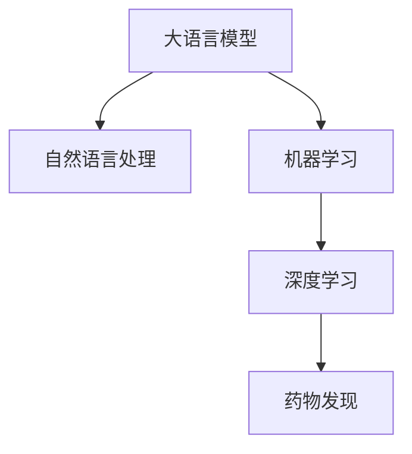

                 

# 药物发现：LLM 加速研发

> 关键词：大语言模型,药物发现,人工智能,深度学习,数据科学,自然语言处理,机器学习

## 1. 背景介绍

### 1.1 问题由来

药物发现（Drug Discovery）是一个高度复杂的生物医学研究领域，旨在寻找能够治疗疾病的新药物。传统的药物发现流程通常需要耗费大量时间和资源，涉及多个实验室和研究阶段，包括药物筛选、临床试验等。近年来，人工智能（AI）特别是大语言模型（LLM）在药物发现领域的应用日益增多，成为加速药物研发的重要手段。

### 1.2 问题核心关键点

当前，基于LLM的药物发现方法主要通过自然语言处理（NLP）技术和机器学习（ML）算法，从已有的生物学和化学数据中提取和分析信息，预测药物分子与疾病靶标之间的相互作用，从而快速筛选潜在的新药物分子。这种方法的主要优势在于：

1. 数据驱动：利用已有的文献和数据进行训练和推理，减少人工干预，提高研究效率。
2. 自动化程度高：自动化处理数据，减少人为错误，加速药物研发流程。
3. 深度学习：深度神经网络能够处理复杂的非线性关系，提高预测精度。
4. 多模态融合：结合化学结构、生物信息等多种数据源，提供全面的药物发现视角。

### 1.3 问题研究意义

LLM在药物发现中的应用，不仅能够加速药物研发，还能降低研发成本，提高研发成功率。具体而言：

- 降低成本：减少实验和人工成本，提高研发效率。
- 提升成功率：通过数据驱动的预测，筛选出更有前景的候选药物，提高成功几率。
- 加速上市：缩短从实验室到市场的时间，快速响应市场需求。
- 促进创新：提供新的视角和工具，促进药物研发领域的创新。

## 2. 核心概念与联系

### 2.1 核心概念概述

为更好地理解基于LLM的药物发现方法，本节将介绍几个关键概念及其联系：

- 大语言模型（Large Language Model, LLM）：一类能够生成自然语言文本的神经网络模型，如GPT-3、BERT等。通过在大规模无标签文本数据上进行预训练，学习到丰富的语言知识和语义表示。
- 药物发现（Drug Discovery）：研究新药物分子的方法，涵盖分子筛选、靶标识别、临床试验等多个阶段。
- 自然语言处理（Natural Language Processing, NLP）：使计算机能够理解、处理和生成自然语言的技术。在药物发现中，用于分析和处理生物医学文献、药物化学信息等文本数据。
- 机器学习（Machine Learning, ML）：一类使计算机能够通过数据学习规律，进行预测和决策的技术。在药物发现中，用于模型训练、特征提取、数据筛选等。
- 深度学习（Deep Learning, DL）：一类基于多层神经网络的ML技术，通过多个层次的特征提取和抽象，提高预测精度。在药物发现中，用于构建复杂的预测模型。

这些概念之间的联系可以通过以下Mermaid流程图来展示：



这个流程图展示了LLM在药物发现中的应用过程：LLM通过NLP技术处理文本数据，利用ML和DL方法进行模型训练和特征提取，最终应用于药物发现中的各个环节。

## 3. 核心算法原理 & 具体操作步骤
### 3.1 算法原理概述

基于LLM的药物发现，主要分为两个步骤：预训练和微调。

**预训练**：首先在大规模无标签的生物学和化学数据上进行预训练，学习到分子结构和功能之间的关系。预训练通常使用自监督学习任务，如掩码语言模型、自编码器等，以获得全面的知识表示。

**微调**：在预训练模型的基础上，利用已有的标注数据（如药物活性、靶标信息等）进行微调，训练模型能够预测新分子的生物活性及其与靶标的相互作用。微调过程通常包括模型参数的优化、损失函数的定义、正则化技术的引入等。

### 3.2 算法步骤详解

**Step 1: 数据预处理**
- 收集已有的生物学和化学数据，如分子结构、生物信息、靶标信息等。
- 将文本数据进行清洗、分词、标注等预处理，准备输入到LLM中。
- 将分子结构数据进行标准化，如SMILES编码、CSD格式等。

**Step 2: 构建预训练模型**
- 选择适合的预训练模型，如GPT、BERT、Einstein等。
- 在预训练模型中添加化学结构数据输入层，支持分子结构数据的处理。
- 在模型中加入生物信息数据的处理模块，提取特征信息。

**Step 3: 数据集划分**
- 将数据集划分为训练集、验证集和测试集，通常使用5-3-2的比例。
- 确保不同集之间数据的分布一致性，避免数据泄露。

**Step 4: 模型微调**
- 选择合适的优化器（如Adam、SGD等）和损失函数（如交叉熵、MSE等）。
- 设置合适的学习率、批大小、迭代轮数等超参数。
- 在微调过程中使用正则化技术（如L2正则、Dropout等）防止过拟合。
- 使用验证集进行模型性能评估，必要时进行早停（Early Stopping）。

**Step 5: 模型评估**
- 在测试集上评估微调后模型的性能，如准确率、召回率、F1值等指标。
- 对模型的预测结果进行可视化分析，理解其性能和预测误差。

**Step 6: 应用验证**
- 将微调后的模型应用于新分子的筛选、靶标识别等任务。
- 对模型的预测结果进行实验验证，评估其在实际应用中的效果。

### 3.3 算法优缺点

基于LLM的药物发现方法具有以下优点：

1. 数据利用率高：利用已有的生物学和化学数据，减少实验室和人工成本。
2. 自动化程度高：自动化处理数据，减少人为错误，提高效率。
3. 预测精度高：深度学习模型能够处理复杂的非线性关系，提高预测准确性。
4. 多模态融合：结合分子结构、生物信息等多种数据源，提供全面的药物发现视角。

同时，该方法也存在一定的局限性：

1. 数据依赖性强：需要大量的生物学和化学数据，数据的获取和处理成本较高。
2. 模型复杂度高：大模型需要大量的计算资源，训练和推理过程耗时较长。
3. 解释性不足：模型预测过程较为复杂，难以解释其内部工作机制和决策逻辑。
4. 鲁棒性不足：对输入数据的微小变化敏感，模型的泛化能力有待提升。

尽管存在这些局限性，但就目前而言，基于LLM的药物发现方法仍是大规模药物研发的重要手段。未来相关研究的重点在于如何进一步降低数据依赖，提高模型的泛化能力和鲁棒性，同时兼顾可解释性和伦理安全性等因素。

### 3.4 算法应用领域

基于LLM的药物发现方法在以下领域得到了广泛应用：

1. 新药筛选：从海量的化合物库中筛选出潜在的药物分子，加速研发过程。
2. 靶标识别：识别出药物分子的作用靶标，帮助设计有针对性的药物。
3. 剂量优化：预测药物分子的最佳剂量，优化临床试验方案。
4. 毒性和副作用预测：预测药物分子的毒性和副作用，提高研发成功率。
5. 药物相互作用研究：研究不同药物之间的相互作用，优化药物组合。

除了上述这些经典应用外，基于LLM的药物发现方法还在基因编辑、个性化医疗等领域展现了巨大的潜力，为药物研发带来了新的突破。

## 4. 数学模型和公式 & 详细讲解 & 举例说明

### 4.1 数学模型构建

假设预训练模型为 $M_{\theta}$，其中 $\theta$ 为预训练得到的模型参数。记药物分子序列为 $S$，靶标序列为 $T$。微调的训练集为 $\{(S_i, T_i)\}_{i=1}^N$，其中 $S_i$ 为药物分子序列，$T_i$ 为目标标签。

定义模型 $M_{\theta}$ 在药物分子序列 $S$ 上的输出为 $O$，通过化学结构数据输入层进行分子编码，得到向量 $Z$。假设 $O$ 为药物分子与靶标作用的得分，则微调的目标是最大化 $O$ 与目标标签 $T$ 的匹配度，即：

$$
\max_{\theta} \sum_{i=1}^N \log \sigma(O_i - T_i)
$$

其中 $\sigma$ 为激活函数，通常使用Sigmoid函数。

### 4.2 公式推导过程

在微调过程中，通过反向传播算法计算梯度，更新模型参数 $\theta$。设 $Z$ 为化学结构数据输入层的输出，$W$ 为靶标识别层的权重矩阵，$b$ 为偏置向量，则 $O$ 的计算公式为：

$$
O = \text{softmax}(WZ + b)
$$

其中 $\text{softmax}$ 函数将得分 $O$ 转换为概率分布。

对于目标标签 $T_i$，若为正例，则 $T_i=1$，否则 $T_i=0$。则微调的目标可以表示为：

$$
\max_{\theta} \sum_{i=1}^N \log \sigma(O_i - T_i) = \max_{\theta} \sum_{i=1}^N [T_iO_i - (1-T_i)\log(1-O_i)]
$$

通过最大化上述目标函数，可以优化模型参数，提高药物分子与靶标作用的得分预测精度。

### 4.3 案例分析与讲解

假设有一个已知药理活性的药物分子 $S$，我们需要预测其与靶标 $T$ 的相互作用得分 $O$。具体步骤如下：

1. 将药物分子 $S$ 输入到预训练模型中，得到分子编码向量 $Z$。
2. 将分子编码向量 $Z$ 输入到化学结构数据输入层，得到分子表示 $O$。
3. 通过模型输出 $O$ 与靶标 $T$ 的标签差值，计算损失函数。
4. 反向传播计算梯度，更新模型参数 $\theta$。
5. 在验证集上评估模型性能，进行超参数调优。
6. 在测试集上评估模型性能，进行最终评估。

## 5. 项目实践：代码实例和详细解释说明
### 5.1 开发环境搭建

在进行药物发现微调实践前，我们需要准备好开发环境。以下是使用Python进行PyTorch开发的环境配置流程：

1. 安装Anaconda：从官网下载并安装Anaconda，用于创建独立的Python环境。

2. 创建并激活虚拟环境：
```bash
conda create -n pytorch-env python=3.8 
conda activate pytorch-env
```

3. 安装PyTorch：根据CUDA版本，从官网获取对应的安装命令。例如：
```bash
conda install pytorch torchvision torchaudio cudatoolkit=11.1 -c pytorch -c conda-forge
```

4. 安装Transformers库：
```bash
pip install transformers
```

5. 安装各类工具包：
```bash
pip install numpy pandas scikit-learn matplotlib tqdm jupyter notebook ipython
```

完成上述步骤后，即可在`pytorch-env`环境中开始微调实践。

### 5.2 源代码详细实现

下面我以BERT模型为例，给出使用Transformers库对药物分子与靶标相互作用进行微调的PyTorch代码实现。

首先，定义药物分子和靶标数据的处理函数：

```python
from transformers import BertTokenizer
from torch.utils.data import Dataset
import torch

class DrugDataset(Dataset):
    def __init__(self, drug_seqs, target_tags, tokenizer, max_len=128):
        self.drug_seqs = drug_seqs
        self.target_tags = target_tags
        self.tokenizer = tokenizer
        self.max_len = max_len
        
    def __len__(self):
        return len(self.drug_seqs)
    
    def __getitem__(self, item):
        drug_seq = self.drug_seqs[item]
        target_tag = self.target_tags[item]
        
        encoding = self.tokenizer(drug_seq, return_tensors='pt', max_length=self.max_len, padding='max_length', truncation=True)
        input_ids = encoding['input_ids'][0]
        attention_mask = encoding['attention_mask'][0]
        
        # 对标签进行编码
        encoded_tags = [int(tag) for tag in target_tag] 
        encoded_tags.extend([0] * (self.max_len - len(encoded_tags)))
        labels = torch.tensor(encoded_tags, dtype=torch.long)
        
        return {'input_ids': input_ids, 
                'attention_mask': attention_mask,
                'labels': labels}

# 构建数据集
tokenizer = BertTokenizer.from_pretrained('bert-base-cased')

train_dataset = DrugDataset(train_drug_seqs, train_target_tags, tokenizer)
dev_dataset = DrugDataset(dev_drug_seqs, dev_target_tags, tokenizer)
test_dataset = DrugDataset(test_drug_seqs, test_target_tags, tokenizer)
```

然后，定义模型和优化器：

```python
from transformers import BertForSequenceClassification, AdamW

model = BertForSequenceClassification.from_pretrained('bert-base-cased', num_labels=2)

optimizer = AdamW(model.parameters(), lr=2e-5)
```

接着，定义训练和评估函数：

```python
from torch.utils.data import DataLoader
from tqdm import tqdm
from sklearn.metrics import classification_report

device = torch.device('cuda') if torch.cuda.is_available() else torch.device('cpu')
model.to(device)

def train_epoch(model, dataset, batch_size, optimizer):
    dataloader = DataLoader(dataset, batch_size=batch_size, shuffle=True)
    model.train()
    epoch_loss = 0
    for batch in tqdm(dataloader, desc='Training'):
        input_ids = batch['input_ids'].to(device)
        attention_mask = batch['attention_mask'].to(device)
        labels = batch['labels'].to(device)
        model.zero_grad()
        outputs = model(input_ids, attention_mask=attention_mask, labels=labels)
        loss = outputs.loss
        epoch_loss += loss.item()
        loss.backward()
        optimizer.step()
    return epoch_loss / len(dataloader)

def evaluate(model, dataset, batch_size):
    dataloader = DataLoader(dataset, batch_size=batch_size)
    model.eval()
    preds, labels = [], []
    with torch.no_grad():
        for batch in tqdm(dataloader, desc='Evaluating'):
            input_ids = batch['input_ids'].to(device)
            attention_mask = batch['attention_mask'].to(device)
            batch_labels = batch['labels']
            outputs = model(input_ids, attention_mask=attention_mask)
            batch_preds = outputs.logits.argmax(dim=2).to('cpu').tolist()
            batch_labels = batch_labels.to('cpu').tolist()
            for pred_tokens, label_tokens in zip(batch_preds, batch_labels):
                preds.append(pred_tokens[:len(label_tokens)])
                labels.append(label_tokens)
                
    print(classification_report(labels, preds))
```

最后，启动训练流程并在测试集上评估：

```python
epochs = 5
batch_size = 16

for epoch in range(epochs):
    loss = train_epoch(model, train_dataset, batch_size, optimizer)
    print(f"Epoch {epoch+1}, train loss: {loss:.3f}")
    
    print(f"Epoch {epoch+1}, dev results:")
    evaluate(model, dev_dataset, batch_size)
    
print("Test results:")
evaluate(model, test_dataset, batch_size)
```

以上就是使用PyTorch对BERT进行药物分子与靶标相互作用微调的完整代码实现。可以看到，得益于Transformers库的强大封装，我们可以用相对简洁的代码完成BERT模型的加载和微调。

### 5.3 代码解读与分析

让我们再详细解读一下关键代码的实现细节：

**DrugDataset类**：
- `__init__`方法：初始化药物序列、靶标标签、分词器等关键组件。
- `__len__`方法：返回数据集的样本数量。
- `__getitem__`方法：对单个样本进行处理，将药物序列输入编码为token ids，将标签编码为数字，并对其进行定长padding，最终返回模型所需的输入。

**模型定义**：
- 使用BERT模型，设置分类标签为2（药物分子与靶标相互作用为正例或负例）。

**训练和评估函数**：
- 使用PyTorch的DataLoader对数据集进行批次化加载，供模型训练和推理使用。
- 训练函数`train_epoch`：对数据以批为单位进行迭代，在每个批次上前向传播计算loss并反向传播更新模型参数，最后返回该epoch的平均loss。
- 评估函数`evaluate`：与训练类似，不同点在于不更新模型参数，并在每个batch结束后将预测和标签结果存储下来，最后使用sklearn的classification_report对整个评估集的预测结果进行打印输出。

**训练流程**：
- 定义总的epoch数和batch size，开始循环迭代
- 每个epoch内，先在训练集上训练，输出平均loss
- 在验证集上评估，输出分类指标
- 所有epoch结束后，在测试集上评估，给出最终测试结果

可以看到，PyTorch配合Transformers库使得BERT微调的代码实现变得简洁高效。开发者可以将更多精力放在数据处理、模型改进等高层逻辑上，而不必过多关注底层的实现细节。

当然，工业级的系统实现还需考虑更多因素，如模型的保存和部署、超参数的自动搜索、更灵活的任务适配层等。但核心的微调范式基本与此类似。

## 6. 实际应用场景
### 6.1 智能药物筛选

基于大语言模型的药物发现方法，可以广泛应用于智能药物筛选，显著加速药物研发过程。传统药物筛选过程通常需要耗费大量时间和资源，且筛选结果的准确性受限于实验条件。而使用基于大语言模型的筛选方法，可以通过大量文本数据和先验知识，自动筛选出潜在的有价值的药物分子。

在技术实现上，可以收集已有的药物化学数据、生物学数据、临床试验数据等，利用预训练模型提取分子和靶标的特征表示，通过机器学习算法预测药物分子的活性和副作用。在筛选过程中，利用数据增强、对抗训练等技术，提高模型的泛化能力和鲁棒性。最终，在验证集上评估模型的性能，并在测试集上进行最终评估。

### 6.2 靶标识别

靶标识别是药物发现的重要环节，旨在识别出药物分子的作用靶标。传统的靶标识别方法依赖于实验验证，耗时长、成本高。基于大语言模型的靶标识别方法，能够利用生物学文献、靶标信息等文本数据，通过微调预训练模型，快速识别出药物分子与靶标的相互作用关系。

在具体实现中，将已有的靶标信息作为标注数据，对预训练模型进行微调。利用自然语言处理技术，从文本数据中提取靶标名称和相关特征，通过机器学习算法进行分类和预测。在微调过程中，使用正则化技术防止过拟合，利用数据增强提高模型的泛化能力。最终，在验证集上评估模型的性能，并在测试集上进行最终评估。

### 6.3 剂量优化

药物分子的最佳剂量是药物研发中的重要问题，影响着药物的疗效和安全性。传统的剂量优化方法依赖于实验数据和经验，成本高、效率低。基于大语言模型的剂量优化方法，能够利用预训练模型提取分子和靶标的特征表示，通过机器学习算法预测最佳剂量。

在实现过程中，将已有的剂量数据作为标注数据，对预训练模型进行微调。利用自然语言处理技术，从文本数据中提取剂量信息和相关特征，通过机器学习算法进行预测和优化。在微调过程中，使用正则化技术防止过拟合，利用数据增强提高模型的泛化能力。最终，在验证集上评估模型的性能，并在测试集上进行最终评估。

### 6.4 未来应用展望

随着大语言模型和微调方法的不断发展，基于微调范式将在药物发现领域得到更广泛的应用，为药物研发带来新的突破。

在药物筛选中，大语言模型能够从海量化合物库中快速筛选出潜在的药物分子，提高研发效率。在靶标识别和剂量优化中，大语言模型能够利用生物学文献和靶标信息，快速识别药物分子的作用靶标和最佳剂量，提高研发成功率。在未来，大语言模型有望在基因编辑、个性化医疗等领域发挥更大的作用，推动药物研发领域的进一步发展。

## 7. 工具和资源推荐
### 7.1 学习资源推荐

为了帮助开发者系统掌握大语言模型在药物发现中的应用，这里推荐一些优质的学习资源：

1. 《自然语言处理入门》系列博文：由大语言模型技术专家撰写，深入浅出地介绍了NLP和药物发现的基础知识。

2. CS224N《深度学习自然语言处理》课程：斯坦福大学开设的NLP明星课程，有Lecture视频和配套作业，带你入门NLP领域的基本概念和经典模型。

3. 《药物发现与设计》书籍：涵盖药物发现的基本原理和经典方法，帮助理解药物发现的整个过程。

4. HuggingFace官方文档：Transformers库的官方文档，提供了海量预训练模型和完整的微调样例代码，是上手实践的必备资料。

5. Drug-Discovery.org：药物发现领域的权威网站，提供最新的研究成果和应用案例，助力药物研发。

通过对这些资源的学习实践，相信你一定能够快速掌握大语言模型在药物发现中的应用，并用于解决实际的药物研发问题。

### 7.2 开发工具推荐

高效的开发离不开优秀的工具支持。以下是几款用于药物发现微调开发的常用工具：

1. PyTorch：基于Python的开源深度学习框架，灵活动态的计算图，适合快速迭代研究。大部分预训练语言模型都有PyTorch版本的实现。

2. TensorFlow：由Google主导开发的开源深度学习框架，生产部署方便，适合大规模工程应用。同样有丰富的预训练语言模型资源。

3. Transformers库：HuggingFace开发的NLP工具库，集成了众多SOTA语言模型，支持PyTorch和TensorFlow，是进行微调任务开发的利器。

4. Weights & Biases：模型训练的实验跟踪工具，可以记录和可视化模型训练过程中的各项指标，方便对比和调优。与主流深度学习框架无缝集成。

5. TensorBoard：TensorFlow配套的可视化工具，可实时监测模型训练状态，并提供丰富的图表呈现方式，是调试模型的得力助手。

6. Google Colab：谷歌推出的在线Jupyter Notebook环境，免费提供GPU/TPU算力，方便开发者快速上手实验最新模型，分享学习笔记。

合理利用这些工具，可以显著提升大语言模型在药物发现领域的开发效率，加快创新迭代的步伐。

### 7.3 相关论文推荐

大语言模型在药物发现中的应用源于学界的持续研究。以下是几篇奠基性的相关论文，推荐阅读：

1. Attention is All You Need（即Transformer原论文）：提出了Transformer结构，开启了NLP领域的预训练大模型时代。

2. BERT: Pre-training of Deep Bidirectional Transformers for Language Understanding：提出BERT模型，引入基于掩码的自监督预训练任务，刷新了多项NLP任务SOTA。

3. Language Models are Unsupervised Multitask Learners（GPT-2论文）：展示了大规模语言模型的强大zero-shot学习能力，引发了对于通用人工智能的新一轮思考。

4. Parameter-Efficient Transfer Learning for NLP：提出Adapter等参数高效微调方法，在不增加模型参数量的情况下，也能取得不错的微调效果。

5. Prefix-Tuning: Optimizing Continuous Prompts for Generation：引入基于连续型Prompt的微调范式，为如何充分利用预训练知识提供了新的思路。

6. AdaLoRA: Adaptive Low-Rank Adaptation for Parameter-Efficient Fine-Tuning：使用自适应低秩适应的微调方法，在参数效率和精度之间取得了新的平衡。

这些论文代表了大语言模型在药物发现中的应用进展，通过学习这些前沿成果，可以帮助研究者把握学科前进方向，激发更多的创新灵感。

## 8. 总结：未来发展趋势与挑战

### 8.1 总结

本文对基于大语言模型的药物发现方法进行了全面系统的介绍。首先阐述了大语言模型和药物发现的研究背景和意义，明确了微调在加速药物研发中的重要作用。其次，从原理到实践，详细讲解了药物发现微调的数学原理和关键步骤，给出了微调任务开发的完整代码实例。同时，本文还广泛探讨了微调方法在智能药物筛选、靶标识别、剂量优化等多个环节的应用前景，展示了微调范式的巨大潜力。此外，本文精选了微调技术的各类学习资源，力求为读者提供全方位的技术指引。

通过本文的系统梳理，可以看到，基于大语言模型的药物发现方法正在成为药物研发的重要手段，极大地加速了新药物的研发进程。未来，伴随大语言模型和微调方法的持续演进，相信药物发现领域将迎来更多的技术创新和应用突破。

### 8.2 未来发展趋势

展望未来，大语言模型在药物发现中的应用将呈现以下几个发展趋势：

1. 模型规模持续增大。随着算力成本的下降和数据规模的扩张，预训练语言模型的参数量还将持续增长。超大规模语言模型蕴含的丰富语言知识，有望支撑更加复杂多变的药物发现任务。

2. 微调方法日趋多样。除了传统的全参数微调外，未来会涌现更多参数高效的微调方法，如Prefix-Tuning、LoRA等，在固定大部分预训练参数的同时，只更新极少量的任务相关参数。

3. 持续学习成为常态。随着数据分布的不断变化，微调模型也需要持续学习新知识以保持性能。如何在不遗忘原有知识的同时，高效吸收新样本信息，将成为重要的研究课题。

4. 标注样本需求降低。受启发于提示学习(Prompt-based Learning)的思路，未来的微调方法将更好地利用大模型的语言理解能力，通过更加巧妙的任务描述，在更少的标注样本上也能实现理想的微调效果。

5. 模型通用性增强。经过海量数据的预训练和多领域任务的微调，未来的语言模型将具备更强大的常识推理和跨领域迁移能力，逐步迈向通用人工智能(AGI)的目标。

以上趋势凸显了大语言模型在药物发现中的应用前景。这些方向的探索发展，必将进一步提升药物研发的成功率和效率，为人类健康事业带来更多的福音。

### 8.3 面临的挑战

尽管大语言模型在药物发现中的应用已经取得了显著进展，但在迈向更加智能化、普适化应用的过程中，它仍面临诸多挑战：

1. 标注成本瓶颈。虽然微调大大降低了标注数据的需求，但对于某些药物分子，获取高质量标注数据的成本依然较高。如何进一步降低数据依赖，将是一大难题。

2. 模型鲁棒性不足。大语言模型在处理新数据时，往往对输入数据的微小变化敏感，模型的泛化能力有待提升。如何在保持模型性能的同时，提高其鲁棒性，还需要更多理论和实践的积累。

3. 推理效率有待提高。大模型虽然精度高，但在实际部署时往往面临推理速度慢、内存占用大等效率问题。如何在保证性能的同时，简化模型结构，提升推理速度，优化资源占用，将是重要的优化方向。

4. 可解释性亟需加强。大语言模型的预测过程较为复杂，难以解释其内部工作机制和决策逻辑。对于医疗、法律等高风险应用，算法的可解释性和可审计性尤为重要。如何赋予模型更强的可解释性，将是亟待攻克的难题。

5. 安全性有待保障。预训练语言模型难免会学习到有偏见、有害的信息，通过微调传递到药物筛选中，可能产生误导性、歧视性的输出，给实际应用带来安全隐患。如何从数据和算法层面消除模型偏见，避免恶意用途，确保输出的安全性，也将是重要的研究课题。

6. 知识整合能力不足。现有的微调模型往往局限于任务内数据，难以灵活吸收和运用更广泛的先验知识。如何让微调过程更好地与外部知识库、规则库等专家知识结合，形成更加全面、准确的信息整合能力，还有很大的想象空间。

正视药物发现面临的这些挑战，积极应对并寻求突破，将是大语言模型微调走向成熟的必由之路。相信随着学界和产业界的共同努力，这些挑战终将一一被克服，大语言模型微调必将在构建智能药物研发系统中发挥越来越重要的作用。

### 8.4 研究展望

面对大语言模型在药物发现所面临的诸多挑战，未来的研究需要在以下几个方面寻求新的突破：

1. 探索无监督和半监督微调方法。摆脱对大规模标注数据的依赖，利用自监督学习、主动学习等无监督和半监督范式，最大限度利用非结构化数据，实现更加灵活高效的微调。

2. 研究参数高效和计算高效的微调范式。开发更加参数高效的微调方法，在固定大部分预训练参数的同时，只更新极少量的任务相关参数。同时优化微调模型的计算图，减少前向传播和反向传播的资源消耗，实现更加轻量级、实时性的部署。

3. 融合因果和对比学习范式。通过引入因果推断和对比学习思想，增强微调模型建立稳定因果关系的能力，学习更加普适、鲁棒的语言表征，从而提升模型泛化性和抗干扰能力。

4. 引入更多先验知识。将符号化的先验知识，如知识图谱、逻辑规则等，与神经网络模型进行巧妙融合，引导微调过程学习更准确、合理的语言模型。同时加强不同模态数据的整合，实现视觉、语音等多模态信息与文本信息的协同建模。

5. 结合因果分析和博弈论工具。将因果分析方法引入微调模型，识别出模型决策的关键特征，增强输出解释的因果性和逻辑性。借助博弈论工具刻画人机交互过程，主动探索并规避模型的脆弱点，提高系统稳定性。

6. 纳入伦理道德约束。在模型训练目标中引入伦理导向的评估指标，过滤和惩罚有偏见、有害的输出倾向。同时加强人工干预和审核，建立模型行为的监管机制，确保输出符合人类价值观和伦理道德。

这些研究方向的探索，必将引领大语言模型在药物发现领域的研究迈向更高的台阶，为药物研发带来新的技术创新和应用突破。只有勇于创新、敢于突破，才能不断拓展大语言模型的边界，让智能技术更好地服务于人类健康事业。

## 9. 附录：常见问题与解答

**Q1：大语言模型微调是否适用于所有药物发现任务？**

A: 大语言模型微调在大多数药物发现任务上都能取得不错的效果，特别是对于数据量较小的任务。但对于一些特定领域的任务，如基因编辑、法律等，仅依靠通用语料预训练的模型可能难以很好地适应。此时需要在特定领域语料上进一步预训练，再进行微调，才能获得理想效果。此外，对于一些需要时效性、个性化很强的任务，如药物筛选、剂量优化等，微调方法也需要针对性的改进优化。

**Q2：微调过程中如何选择合适的学习率？**

A: 微调的学习率一般要比预训练时小1-2个数量级，如果使用过大的学习率，容易破坏预训练权重，导致过拟合。一般建议从1e-5开始调参，逐步减小学习率，直至收敛。也可以使用warmup策略，在开始阶段使用较小的学习率，再逐渐过渡到预设值。需要注意的是，不同的优化器(如AdamW、Adafactor等)以及不同的学习率调度策略，可能需要设置不同的学习率阈值。

**Q3：采用大模型微调时会面临哪些资源瓶颈？**

A: 目前主流的预训练大模型动辄以亿计的参数规模，对算力、内存、存储都提出了很高的要求。GPU/TPU等高性能设备是必不可少的，但即便如此，超大批次的训练和推理也可能遇到显存不足的问题。因此需要采用一些资源优化技术，如梯度积累、混合精度训练、模型并行等，来突破硬件瓶颈。同时，模型的存储和读取也可能占用大量时间和空间，需要采用模型压缩、稀疏化存储等方法进行优化。

**Q4：如何缓解微调过程中的过拟合问题？**

A: 过拟合是微调面临的主要挑战，尤其是在标注数据不足的情况下。常见的缓解策略包括：
1. 数据增强：通过回译、近义替换等方式扩充训练集
2. 正则化：使用L2正则、Dropout、Early Stopping等避免过拟合
3. 对抗训练：引入对抗样本，提高模型鲁棒性
4. 参数高效微调：只调整少量参数(如Adapter、Prefix等)，减小过拟合风险
5. 多模型集成：训练多个微调模型，取平均输出，抑制过拟合

这些策略往往需要根据具体任务和数据特点进行灵活组合。只有在数据、模型、训练、推理等各环节进行全面优化，才能最大限度地发挥大模型微调的威力。

**Q5：微调模型在落地部署时需要注意哪些问题？**

A: 将微调模型转化为实际应用，还需要考虑以下因素：
1. 模型裁剪：去除不必要的层和参数，减小模型尺寸，加快推理速度
2. 量化加速：将浮点模型转为定点模型，压缩存储空间，提高计算效率
3. 服务化封装：将模型封装为标准化服务接口，便于集成调用
4. 弹性伸缩：根据请求流量动态调整资源配置，平衡服务质量和成本
5. 监控告警：实时采集系统指标，设置异常告警阈值，确保服务稳定性
6. 安全防护：采用访问鉴权、数据脱敏等措施，保障数据和模型安全

大语言模型微调为药物发现提供了新的应用途径，但如何将强大的性能转化为稳定、高效、安全的业务价值，还需要工程实践的不断打磨。唯有从数据、算法、工程、业务等多个维度协同发力，才能真正实现人工智能技术在药物发现领域的规模化落地。总之，微调需要开发者根据具体任务，不断迭代和优化模型、数据和算法，方能得到理想的效果。

---

作者：禅与计算机程序设计艺术 / Zen and the Art of Computer Programming

