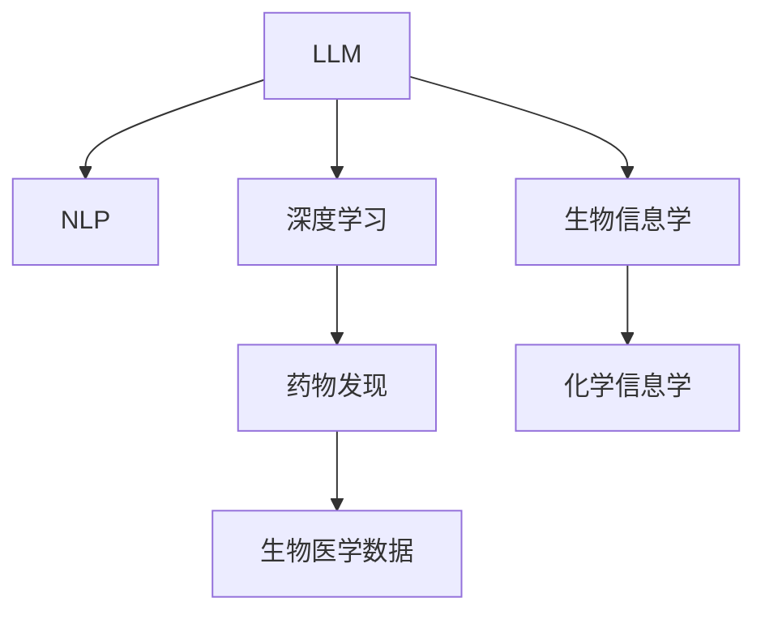

                 

# 药物发现：LLM 加速研发

> 关键词：大语言模型(LLM),药物发现,自然语言处理(NLP),深度学习,机器学习,医疗领域,生物信息学

## 1. 背景介绍

### 1.1 问题由来
在过去的几十年里，新药的研发一直是制药行业的瓶颈。传统的药物发现方法耗时耗资巨大，成功率却并不高。而近年来，随着人工智能技术的兴起，尤其是自然语言处理(NLP)和深度学习的飞速发展，利用大语言模型(LLM)进行药物发现的方法逐渐受到关注。LLM可以通过理解和处理海量的生物医学文献，加速药物研发过程，提高新药发现效率。

### 1.2 问题核心关键点
LLM在药物发现领域的应用主要基于其强大的语义理解能力和知识获取能力。通过语义解析，LLM可以自动从生物医学文献中提取关键信息，如生物活性、化合物结构、临床试验结果等。同时，利用预训练和微调技术，LLM可以在药物领域内学习并应用具体的知识，提升药物发现的效率和成功率。

### 1.3 问题研究意义
利用LLM进行药物发现，不仅能够大幅缩短药物研发周期，降低成本，还能提高药物研发的精准性和成功率。通过LLM，研究人员可以在不直接进行生物实验的情况下，快速筛选潜在的药物候选物，进一步优化药物设计，加速临床前验证和临床试验。LLM在药物发现中的应用，为传统制药行业带来了革命性的变革。

## 2. 核心概念与联系

### 2.1 核心概念概述

为了更好地理解LLM在药物发现中的应用，本节将介绍几个关键概念：

- 大语言模型(LLM)：基于深度学习的自然语言处理模型，能够理解和生成自然语言。例如，GPT、BERT等模型。
- 自然语言处理(NLP)：涉及计算机科学、人工智能和语言学的交叉领域，旨在让计算机理解、分析、生成自然语言。
- 深度学习：一种基于人工神经网络的机器学习方法，用于处理复杂的数据和大规模的计算任务。
- 药物发现：从分子结构或分子库中筛选出具有特定生物活性的化合物，并研究其作用机制的过程。
- 生物信息学：应用计算机技术分析、存储、检索、处理生物医学数据，支持药物研发和疾病研究。
- 化学信息学：研究如何利用计算机技术处理和分析化学数据，支持药物设计和优化。

这些概念之间的联系通过以下Mermaid流程图表示：



这个流程图展示了LLM与其他关键概念之间的关系：

1. LLM通过自然语言处理(NLP)技术，理解生物医学文献中的语言信息。
2. LLM基于深度学习算法，能够处理和分析大规模生物医学数据。
3. 药物发现过程利用生物信息学和化学信息学的知识，结合LLM的能力，提升新药筛选和设计的效率。
4. 最终，LLM从生物医学数据中提取的信息用于药物发现，推动新药的研发进程。

## 3. 核心算法原理 & 具体操作步骤
### 3.1 算法原理概述

利用LLM进行药物发现，核心在于模型如何理解和处理生物医学文献中的信息。LLM通过预训练和微调技术，从大规模的生物医学数据中学习到药物领域的知识。这种知识不仅包括药物的分子结构、生物活性、作用机制等信息，还包括药物在临床试验中的表现、副作用等详细信息。

以下是基于LLM的药物发现流程的概要：

1. **数据准备**：收集并整理相关的生物医学文献和化合物数据库，准备用于预训练和微调的文本数据。
2. **预训练**：使用大规模的无标注数据对LLM进行预训练，使其学习到通用的语言表示和知识。
3. **微调**：在特定药物发现任务上对预训练模型进行微调，使其具备处理该任务所需的专业知识。
4. **应用**：利用微调后的LLM进行药物筛选、设计、验证等任务。

### 3.2 算法步骤详解

具体步骤如下：

**Step 1: 数据准备**

1. 收集生物医学文献、化合物数据库、临床试验数据等，形成数据集。
2. 对数据进行清洗和标注，去除噪声数据，标记药物的活性、结构等信息。
3. 将数据集分为训练集、验证集和测试集。

**Step 2: 预训练**

1. 选择合适的预训练模型，如GPT、BERT等。
2. 在预训练数据集上，使用自监督学习方法进行预训练，例如语言模型任务、掩码语言模型任务等。
3. 保存预训练模型的权重，作为后续微调的初始参数。

**Step 3: 微调**

1. 选择药物发现任务，例如药物活性预测、分子结构设计等。
2. 构建任务特定的适配层，例如输出层、损失函数等。
3. 设定微调的超参数，如学习率、优化器、正则化等。
4. 使用微调数据集进行有监督学习，更新模型参数。
5. 在验证集上进行评估，如果性能达到预期，则使用测试集进行最终验证。

**Step 4: 应用**

1. 将微调后的LLM应用于新的药物数据。
2. 利用LLM进行药物筛选、设计、验证等任务。
3. 结合其他算法和工具，进一步优化药物设计方案。

### 3.3 算法优缺点

利用LLM进行药物发现具有以下优点：

1. 数据利用率高：LLM能够处理和分析大量的生物医学数据，提高数据的利用效率。
2. 推理能力强：LLM具备强大的语义理解和推理能力，能够从文献中提取关键信息。
3. 模型可复用：预训练模型可以作为基础组件，在不同的药物发现任务中复用，减少重复工作。
4. 效率高：利用LLM进行药物发现，可以显著缩短研发周期，降低成本。

然而，LLM在药物发现中仍然存在一些局限：

1. 数据质量要求高：LLM对输入数据的质量要求较高，需要高质量的生物医学文献和化合物数据库。
2. 知识更新慢：LLM的预训练过程需要大量数据和时间，更新新知识的速度较慢。
3. 精度有限：尽管LLM能够处理大量数据，但在药物发现的具体任务中，精度仍存在一定的局限。
4. 解释性不足：LLM的内部工作机制复杂，难以解释其推理过程和决策依据。

### 3.4 算法应用领域

LLM在药物发现领域的应用主要包括以下几个方面：

1. **药物筛选**：利用LLM对化合物进行活性预测，筛选潜在的药物候选物。
2. **药物设计**：利用LLM进行分子结构设计、优化等。
3. **临床试验**：利用LLM进行临床试验数据分析，预测药物效果和副作用。
4. **新药研发**：利用LLM加速新药的发现和优化，提高研发效率。
5. **药效分析**：利用LLM进行药物作用机制分析，优化药物设计方案。
6. **疾病预测**：利用LLM进行疾病预测和诊断，辅助医生进行决策。

## 4. 数学模型和公式 & 详细讲解 & 举例说明

### 4.1 数学模型构建

在药物发现中，LLM的微调通常使用二分类任务进行。假设药物是否具有活性为二分类任务，1表示具有活性，0表示不具有活性。假设有$m$个化合物，每个化合物有$n$个描述，构建训练集：

$$
D = \{(x_i, y_i)\}_{i=1}^m, x_i = [x_{i1}, x_{i2}, ..., x_{in}], y_i \in \{0, 1\}
$$

其中$x_i$为化合物的描述向量，$y_i$为化合物的活性标签。

定义模型$M_{\theta}$为预训练模型，输出层为二分类输出层，定义损失函数为二分类交叉熵损失函数：

$$
\ell(M_{\theta}(x_i),y_i) = -y_i\log M_{\theta}(x_i) - (1-y_i)\log(1-M_{\theta}(x_i))
$$

最终，微调的目标为最小化损失函数：

$$
\mathcal{L}(\theta) = \frac{1}{m} \sum_{i=1}^m \ell(M_{\theta}(x_i),y_i)
$$

### 4.2 公式推导过程

以二分类任务为例，推导损失函数和梯度计算公式：

**损失函数推导**

$$
\ell(M_{\theta}(x_i),y_i) = -y_i\log M_{\theta}(x_i) - (1-y_i)\log(1-M_{\theta}(x_i))
$$

将损失函数代入经验风险公式，得到：

$$
\mathcal{L}(\theta) = \frac{1}{m} \sum_{i=1}^m \ell(M_{\theta}(x_i),y_i)
$$

**梯度计算**

$$
\nabla_{\theta}\mathcal{L}(\theta) = \frac{1}{m} \sum_{i=1}^m \nabla_{\theta}\ell(M_{\theta}(x_i),y_i)
$$

其中：

$$
\nabla_{\theta}\ell(M_{\theta}(x_i),y_i) = -y_i\nabla_{\theta}M_{\theta}(x_i) + (1-y_i)\nabla_{\theta}(1-M_{\theta}(x_i))
$$

根据链式法则，可进一步展开：

$$
\nabla_{\theta}M_{\theta}(x_i) = \frac{\partial M_{\theta}(x_i)}{\partial \theta} = \frac{\partial}{\partial \theta} softmax(\theta^T x_i)
$$

最终得到梯度计算公式：

$$
\nabla_{\theta}\mathcal{L}(\theta) = \frac{1}{m} \sum_{i=1}^m \left[ -y_i\frac{\partial}{\partial \theta} softmax(\theta^T x_i) + (1-y_i)\frac{\partial}{\partial \theta}(1 - softmax(\theta^T x_i)) \right]
$$

### 4.3 案例分析与讲解

**案例1：药物活性预测**

在药物活性预测任务中，假设数据集$D$包含$m$个化合物及其活性标签$y_i$。使用BERT模型进行预训练，并在微调时使用二分类交叉熵损失函数，进行有监督学习。微调过程如下：

1. **数据准备**：收集化合物分子结构、活性标签等数据，构建训练集$D$。
2. **预训练**：使用BERT模型在大型生物医学文献上预训练。
3. **微调**：在药物活性预测任务上对预训练的BERT模型进行微调，损失函数为二分类交叉熵。
4. **应用**：利用微调后的BERT模型预测新化合物的活性。

**案例2：分子结构设计**

在分子结构设计任务中，假设数据集$D$包含$m$个化合物及其分子结构$x_i$和目标活性标签$y_i$。使用GPT模型进行预训练，并在微调时使用分子结构优化任务。微调过程如下：

1. **数据准备**：收集化合物分子结构、活性标签等数据，构建训练集$D$。
2. **预训练**：使用GPT模型在大型生物医学文献上预训练。
3. **微调**：在分子结构设计任务上对预训练的GPT模型进行微调，损失函数为分子结构优化任务。
4. **应用**：利用微调后的GPT模型设计新的分子结构。

## 5. 项目实践：代码实例和详细解释说明

### 5.1 开发环境搭建

为了进行药物发现任务的微调，需要准备好开发环境。以下是使用Python进行PyTorch开发的环境配置流程：

1. 安装Anaconda：从官网下载并安装Anaconda，用于创建独立的Python环境。

2. 创建并激活虚拟环境：
```bash
conda create -n pytorch-env python=3.8 
conda activate pytorch-env
```

3. 安装PyTorch：根据CUDA版本，从官网获取对应的安装命令。例如：
```bash
conda install pytorch torchvision torchaudio cudatoolkit=11.1 -c pytorch -c conda-forge
```

4. 安装Transformers库：
```bash
pip install transformers
```

5. 安装各类工具包：
```bash
pip install numpy pandas scikit-learn matplotlib tqdm jupyter notebook ipython
```

完成上述步骤后，即可在`pytorch-env`环境中开始微调实践。

### 5.2 源代码详细实现

下面我们以药物活性预测任务为例，给出使用Transformers库对BERT模型进行微调的PyTorch代码实现。

首先，定义数据处理函数：

```python
from transformers import BertTokenizer
from torch.utils.data import Dataset
import torch

class DrugDataset(Dataset):
    def __init__(self, texts, labels, tokenizer, max_len=128):
        self.texts = texts
        self.labels = labels
        self.tokenizer = tokenizer
        self.max_len = max_len
        
    def __len__(self):
        return len(self.texts)
    
    def __getitem__(self, item):
        text = self.texts[item]
        label = self.labels[item]
        
        encoding = self.tokenizer(text, return_tensors='pt', max_length=self.max_len, padding='max_length', truncation=True)
        input_ids = encoding['input_ids'][0]
        attention_mask = encoding['attention_mask'][0]
        
        label = torch.tensor(label, dtype=torch.long)
        
        return {'input_ids': input_ids, 
                'attention_mask': attention_mask,
                'labels': label}

# 标签与id的映射
label2id = {'1': 1, '0': 0}
id2label = {v: k for k, v in label2id.items()}

# 创建dataset
tokenizer = BertTokenizer.from_pretrained('bert-base-cased')

train_dataset = DrugDataset(train_texts, train_labels, tokenizer)
dev_dataset = DrugDataset(dev_texts, dev_labels, tokenizer)
test_dataset = DrugDataset(test_texts, test_labels, tokenizer)
```

然后，定义模型和优化器：

```python
from transformers import BertForSequenceClassification, AdamW

model = BertForSequenceClassification.from_pretrained('bert-base-cased', num_labels=2)

optimizer = AdamW(model.parameters(), lr=2e-5)
```

接着，定义训练和评估函数：

```python
from torch.utils.data import DataLoader
from tqdm import tqdm
from sklearn.metrics import classification_report

device = torch.device('cuda') if torch.cuda.is_available() else torch.device('cpu')
model.to(device)

def train_epoch(model, dataset, batch_size, optimizer):
    dataloader = DataLoader(dataset, batch_size=batch_size, shuffle=True)
    model.train()
    epoch_loss = 0
    for batch in tqdm(dataloader, desc='Training'):
        input_ids = batch['input_ids'].to(device)
        attention_mask = batch['attention_mask'].to(device)
        labels = batch['labels'].to(device)
        model.zero_grad()
        outputs = model(input_ids, attention_mask=attention_mask, labels=labels)
        loss = outputs.loss
        epoch_loss += loss.item()
        loss.backward()
        optimizer.step()
    return epoch_loss / len(dataloader)

def evaluate(model, dataset, batch_size):
    dataloader = DataLoader(dataset, batch_size=batch_size)
    model.eval()
    preds, labels = [], []
    with torch.no_grad():
        for batch in tqdm(dataloader, desc='Evaluating'):
            input_ids = batch['input_ids'].to(device)
            attention_mask = batch['attention_mask'].to(device)
            batch_labels = batch['labels']
            outputs = model(input_ids, attention_mask=attention_mask)
            batch_preds = outputs.logits.argmax(dim=2).to('cpu').tolist()
            batch_labels = batch_labels.to('cpu').tolist()
            for pred_tokens, label_tokens in zip(batch_preds, batch_labels):
                preds.append(pred_tokens[:len(label_tokens)])
                labels.append(label_tokens)
                
    print(classification_report(labels, preds))
```

最后，启动训练流程并在测试集上评估：

```python
epochs = 5
batch_size = 16

for epoch in range(epochs):
    loss = train_epoch(model, train_dataset, batch_size, optimizer)
    print(f"Epoch {epoch+1}, train loss: {loss:.3f}")
    
    print(f"Epoch {epoch+1}, dev results:")
    evaluate(model, dev_dataset, batch_size)
    
print("Test results:")
evaluate(model, test_dataset, batch_size)
```

以上就是使用PyTorch对BERT进行药物活性预测任务微调的完整代码实现。可以看到，得益于Transformers库的强大封装，我们可以用相对简洁的代码完成BERT模型的加载和微调。

### 5.3 代码解读与分析

让我们再详细解读一下关键代码的实现细节：

**DrugDataset类**：
- `__init__`方法：初始化文本、标签、分词器等关键组件。
- `__len__`方法：返回数据集的样本数量。
- `__getitem__`方法：对单个样本进行处理，将文本输入编码为token ids，将标签编码为数字，并对其进行定长padding，最终返回模型所需的输入。

**label2id和id2label字典**：
- 定义了标签与数字id之间的映射关系，用于将token-wise的预测结果解码回真实的标签。

**训练和评估函数**：
- 使用PyTorch的DataLoader对数据集进行批次化加载，供模型训练和推理使用。
- 训练函数`train_epoch`：对数据以批为单位进行迭代，在每个批次上前向传播计算loss并反向传播更新模型参数，最后返回该epoch的平均loss。
- 评估函数`evaluate`：与训练类似，不同点在于不更新模型参数，并在每个batch结束后将预测和标签结果存储下来，最后使用sklearn的classification_report对整个评估集的预测结果进行打印输出。

**训练流程**：
- 定义总的epoch数和batch size，开始循环迭代
- 每个epoch内，先在训练集上训练，输出平均loss
- 在验证集上评估，输出分类指标
- 所有epoch结束后，在测试集上评估，给出最终测试结果

可以看到，PyTorch配合Transformers库使得BERT微调的代码实现变得简洁高效。开发者可以将更多精力放在数据处理、模型改进等高层逻辑上，而不必过多关注底层的实现细节。

当然，工业级的系统实现还需考虑更多因素，如模型的保存和部署、超参数的自动搜索、更灵活的任务适配层等。但核心的微调范式基本与此类似。

## 6. 实际应用场景
### 6.1 智能药物研发平台

利用LLM进行药物发现的微调技术，可以构建智能药物研发平台，大幅提升新药研发的效率和成功率。传统的药物研发需要大量人力物力，且耗时较长，而利用LLM进行药物筛选和设计，可以大幅缩短时间成本。

在技术实现上，可以构建一个在线平台，将大量的生物医学文献、化合物数据库等资源整合，通过微调后的LLM进行药物筛选、设计、活性预测等任务。开发者可以输入化合物的描述或结构，LLM自动返回其生物活性和潜在价值，提供多维度的新药设计方案。此外，平台还可以实时更新数据，进行持续学习和优化，进一步提升新药研发的效率。

### 6.2 个性化医疗应用

在个性化医疗领域，利用LLM进行药物发现可以显著提升治疗效果。医生可以根据患者的基因、病史等信息，利用微调后的LLM快速筛选出适合该患者的药物，提升治疗效果和患者满意度。

在技术实现上，可以构建一个基于LLM的个性化医疗平台，收集并分析患者数据，利用微调后的LLM进行药物筛选和设计。平台可以自动推荐适合患者的药物方案，辅助医生进行诊断和治疗。此外，平台还可以实时更新患者数据和药物信息，进行持续学习和优化，提升治疗方案的个性化和精准度。

### 6.3 新药开发加速器

在制药公司中，利用LLM进行药物发现可以加速新药的研发和上市。传统的药物研发需要长时间的实验室实验和临床试验，利用LLM可以快速筛选出潜在的药物候选物，进一步优化药物设计，加速临床前验证和临床试验。

在技术实现上，可以构建一个基于LLM的新药开发加速器，整合公司的生物医学文献、化合物数据库等资源，利用微调后的LLM进行药物筛选、设计、活性预测等任务。加速器可以自动推荐潜在的药物候选物，辅助研究人员进行实验室实验和临床试验，进一步优化药物设计方案，加速新药的研发和上市。

### 6.4 未来应用展望

随着LLM技术的不断发展，其在药物发现领域的应用将不断拓展。未来，LLM不仅可以在新药筛选、设计等任务中发挥作用，还可以在药物临床试验数据分析、副作用预测、药效分析等任务中得到应用。此外，LLM还可以与基因组学、蛋白质组学等生物信息学技术相结合，进行更加全面和精准的药物发现。

在未来的发展中，LLM将更加注重模型可解释性和安全性，确保其决策过程和输出结果的可解释性和可靠性。同时，LLM还将与强化学习、因果推断等前沿技术相结合，进一步提升药物发现和优化的精准度。

## 7. 工具和资源推荐
### 7.1 学习资源推荐

为了帮助开发者系统掌握LLM在药物发现中的应用，这里推荐一些优质的学习资源：

1. 《Transformers from the Inside》系列博文：由大模型技术专家撰写，深入浅出地介绍了Transformers原理、BERT模型、微调技术等前沿话题。

2. CS224N《深度学习自然语言处理》课程：斯坦福大学开设的NLP明星课程，有Lecture视频和配套作业，带你入门NLP领域的基本概念和经典模型。

3. 《Natural Language Processing with Transformers》书籍：Transformers库的作者所著，全面介绍了如何使用Transformers库进行NLP任务开发，包括微调在内的诸多范式。

4. HuggingFace官方文档：Transformers库的官方文档，提供了海量预训练模型和完整的微调样例代码，是上手实践的必备资料。

5. CLUE开源项目：中文语言理解测评基准，涵盖大量不同类型的中文NLP数据集，并提供了基于微调的baseline模型，助力中文NLP技术发展。

通过对这些资源的学习实践，相信你一定能够快速掌握LLM在药物发现中的使用方法，并用于解决实际的药物发现问题。
###  7.2 开发工具推荐

高效的开发离不开优秀的工具支持。以下是几款用于药物发现微调开发的常用工具：

1. PyTorch：基于Python的开源深度学习框架，灵活动态的计算图，适合快速迭代研究。大部分预训练语言模型都有PyTorch版本的实现。

2. TensorFlow：由Google主导开发的开源深度学习框架，生产部署方便，适合大规模工程应用。同样有丰富的预训练语言模型资源。

3. Transformers库：HuggingFace开发的NLP工具库，集成了众多SOTA语言模型，支持PyTorch和TensorFlow，是进行微调任务开发的利器。

4. Weights & Biases：模型训练的实验跟踪工具，可以记录和可视化模型训练过程中的各项指标，方便对比和调优。与主流深度学习框架无缝集成。

5. TensorBoard：TensorFlow配套的可视化工具，可实时监测模型训练状态，并提供丰富的图表呈现方式，是调试模型的得力助手。

6. Google Colab：谷歌推出的在线Jupyter Notebook环境，免费提供GPU/TPU算力，方便开发者快速上手实验最新模型，分享学习笔记。

合理利用这些工具，可以显著提升药物发现微调的开发效率，加快创新迭代的步伐。

### 7.3 相关论文推荐

LLM在药物发现领域的研究源于学界的持续探索。以下是几篇奠基性的相关论文，推荐阅读：

1. Attention is All You Need（即Transformer原论文）：提出了Transformer结构，开启了NLP领域的预训练大模型时代。

2. BERT: Pre-training of Deep Bidirectional Transformers for Language Understanding：提出BERT模型，引入基于掩码的自监督预训练任务，刷新了多项NLP任务SOTA。

3. Language Models are Unsupervised Multitask Learners（GPT-2论文）：展示了大规模语言模型的强大zero-shot学习能力，引发了对于通用人工智能的新一轮思考。

4. Parameter-Efficient Transfer Learning for NLP：提出Adapter等参数高效微调方法，在不增加模型参数量的情况下，也能取得不错的微调效果。

5. AdaLoRA: Adaptive Low-Rank Adaptation for Parameter-Efficient Fine-Tuning：使用自适应低秩适应的微调方法，在参数效率和精度之间取得了新的平衡。

6. Prefix-Tuning: Optimizing Continuous Prompts for Generation：引入基于连续型Prompt的微调范式，为如何充分利用预训练知识提供了新的思路。

这些论文代表了大语言模型微调技术的发展脉络。通过学习这些前沿成果，可以帮助研究者把握学科前进方向，激发更多的创新灵感。

## 8. 总结：未来发展趋势与挑战

### 8.1 总结

本文对基于大语言模型(LLM)的药物发现方法进行了全面系统的介绍。首先阐述了LLM在药物发现领域的应用背景和意义，明确了微调在加速药物研发、提升新药筛选效率方面的独特价值。其次，从原理到实践，详细讲解了LLM微调的数学原理和关键步骤，给出了微调任务开发的完整代码实例。同时，本文还广泛探讨了LLM在药物研发、个性化医疗、新药开发等领域的实际应用场景，展示了微调范式的巨大潜力。此外，本文精选了微调技术的各类学习资源，力求为读者提供全方位的技术指引。

通过本文的系统梳理，可以看到，利用LLM进行药物发现的方法正在成为药物研发领域的重要范式，极大地拓展了预训练语言模型的应用边界，催生了更多的落地场景。LLM在药物发现中的应用，为传统制药行业带来了革命性的变革。未来，伴随预训练语言模型和微调方法的持续演进，相信LLM将进一步推动药物研发的智能化、自动化进程，为制药公司带来更高的研发效率和创新能力。

### 8.2 未来发展趋势

展望未来，LLM在药物发现领域的应用将呈现以下几个趋势：

1. 模型规模持续增大。随着算力成本的下降和数据规模的扩张，预训练语言模型的参数量还将持续增长。超大规模语言模型蕴含的丰富语言知识，有望支撑更加复杂多变的药物发现任务。

2. 微调方法日趋多样。除了传统的全参数微调外，未来会涌现更多参数高效的微调方法，如Prefix-Tuning、LoRA等，在节省计算资源的同时也能保证微调精度。

3. 持续学习成为常态。随着数据分布的不断变化，微调模型也需要持续学习新知识以保持性能。如何在不遗忘原有知识的同时，高效吸收新样本信息，将成为重要的研究课题。

4. 标注样本需求降低。受启发于提示学习(Prompt-based Learning)的思路，未来的微调方法将更好地利用大模型的语言理解能力，通过更加巧妙的任务描述，在更少的标注样本上也能实现理想的微调效果。

5. 知识整合能力增强。现有的微调模型往往局限于任务内数据，难以灵活吸收和运用更广泛的先验知识。如何让微调过程更好地与外部知识库、规则库等专家知识结合，形成更加全面、准确的信息整合能力，还有很大的想象空间。

6. 多模态微调崛起。当前的微调主要聚焦于纯文本数据，未来会进一步拓展到图像、视频、语音等多模态数据微调。多模态信息的融合，将显著提升语言模型对现实世界的理解和建模能力。

以上趋势凸显了LLM在药物发现领域的广阔前景。这些方向的探索发展，必将进一步提升药物发现的效率和成功率，推动生物医学技术的创新进步。

### 8.3 面临的挑战

尽管利用LLM进行药物发现取得了显著进展，但在迈向更加智能化、普适化应用的过程中，仍面临诸多挑战：

1. 数据质量要求高。LLM对输入数据的质量要求较高，需要高质量的生物医学文献和化合物数据库。
2. 知识更新慢。LLM的预训练过程需要大量数据和时间，更新新知识的速度较慢。
3. 精度有限。尽管LLM能够处理大量数据，但在药物发现的具体任务中，精度仍存在一定的局限。
4. 解释性不足。LLM的内部工作机制复杂，难以解释其推理过程和决策依据。
5. 安全性有待保障。预训练语言模型难免会学习到有偏见、有害的信息，通过微调传递到下游任务，产生误导性、歧视性的输出，给实际应用带来安全隐患。

6. 知识整合能力不足。现有的微调模型往往局限于任务内数据，难以灵活吸收和运用更广泛的先验知识。

### 8.4 研究展望

面对LLM在药物发现中面临的挑战，未来的研究需要在以下几个方面寻求新的突破：

1. 探索无监督和半监督微调方法。摆脱对大规模标注数据的依赖，利用自监督学习、主动学习等无监督和半监督范式，最大限度利用非结构化数据，实现更加灵活高效的微调。

2. 研究参数高效和计算高效的微调范式。开发更加参数高效的微调方法，在固定大部分预训练参数的同时，只更新极少量的任务相关参数。同时优化微调模型的计算图，减少前向传播和反向传播的资源消耗，实现更加轻量级、实时性的部署。

3. 融合因果和对比学习范式。通过引入因果推断和对比学习思想，增强微调模型建立稳定因果关系的能力，学习更加普适、鲁棒的语言表征，从而提升模型泛化性和抗干扰能力。

4. 引入更多先验知识。将符号化的先验知识，如知识图谱、逻辑规则等，与神经网络模型进行巧妙融合，引导微调过程学习更准确、合理的语言模型。同时加强不同模态数据的整合，实现视觉、语音等多模态信息与文本信息的协同建模。

5. 结合因果分析和博弈论工具。将因果分析方法引入微调模型，识别出模型决策的关键特征，增强输出解释的因果性和逻辑性。借助博弈论工具刻画人机交互过程，主动探索并规避模型的脆弱点，提高系统稳定性。

6. 纳入伦理道德约束。在模型训练目标中引入伦理导向的评估指标，过滤和惩罚有偏见、有害的输出倾向。同时加强人工干预和审核，建立模型行为的监管机制，确保输出符合人类价值观和伦理道德。

这些研究方向的探索，必将引领LLM在药物发现领域的进一步发展，为构建安全、可靠、可解释、可控的智能系统铺平道路。面向未来，LLM还需要与其他人工智能技术进行更深入的融合，如知识表示、因果推理、强化学习等，多路径协同发力，共同推动自然语言理解和智能交互系统的进步。只有勇于创新、敢于突破，才能不断拓展语言模型的边界，让智能技术更好地造福人类社会。

## 9. 附录：常见问题与解答

**Q1：大语言模型微调是否适用于所有药物发现任务？**

A: 大语言模型微调在大多数药物发现任务上都能取得不错的效果，特别是对于数据量较小的任务。但对于一些特定领域的任务，如特定药物结构设计、特殊疾病药物开发等，仅仅依靠通用语料预训练的模型可能难以很好地适应。此时需要在特定领域语料上进一步预训练，再进行微调，才能获得理想效果。此外，对于一些需要时效性、个性化很强的任务，如个性化药物推荐等，微调方法也需要针对性的改进优化。

**Q2：微调过程中如何选择合适的学习率？**

A: 微调的学习率一般要比预训练时小1-2个数量级，如果使用过大的学习率，容易破坏预训练权重，导致过拟合。一般建议从1e-5开始调参，逐步减小学习率，直至收敛。也可以使用warmup策略，在开始阶段使用较小的学习率，再逐渐过渡到预设值。需要注意的是，不同的优化器(如AdamW、Adafactor等)以及不同的学习率调度策略，可能需要设置不同的学习率阈值。

**Q3：采用大语言模型微调时会面临哪些资源瓶颈？**

A: 目前主流的预训练大模型动辄以亿计的参数规模，对算力、内存、存储都提出了很高的要求。GPU/TPU等高性能设备是必不可少的，但即便如此，超大批次的训练和推理也可能遇到显存不足的问题。因此需要采用一些资源优化技术，如梯度积累、混合精度训练、模型并行等，来突破硬件瓶颈。同时，模型的存储和读取也可能占用大量时间和空间，需要采用模型压缩、稀疏化存储等方法进行优化。

**Q4：如何缓解微调过程中的过拟合问题？**

A: 过拟合是微调面临的主要挑战，尤其是在标注数据不足的情况下。常见的缓解策略包括：
1. 数据增强：通过回译、近义替换等方式扩充训练集
2. 正则化：使用L2正则、Dropout、Early Stopping等避免过拟合
3. 对抗训练：引入对抗样本，提高模型鲁棒性
4. 参数高效微调：只调整少量参数(如Adapter、Prefix等)，减小过拟合风险
5. 多模型集成：训练多个微调模型，取平均输出，抑制过拟合

这些策略往往需要根据具体任务和数据特点进行灵活组合。只有在数据、模型、训练、推理等各环节进行全面优化，才能最大限度地发挥大语言模型微调的威力。

**Q5：微调模型在落地部署时需要注意哪些问题？**

A: 将微调模型转化为实际应用，还需要考虑以下因素：
1. 模型裁剪：去除不必要的层和参数，减小模型尺寸，加快推理速度
2. 量化加速：将浮点模型转为定点模型，压缩存储空间，提高计算效率
3. 服务化封装：将模型封装为标准化服务接口，便于集成调用
4. 弹性伸缩：根据请求流量动态调整资源配置，平衡服务质量和成本
5. 监控告警：实时采集系统指标，设置异常告警阈值，确保服务稳定性
6. 安全防护：采用访问鉴权、数据脱敏等措施，保障数据和模型安全

大语言模型微调为药物发现提供了新的方法，但要真正实现落地应用，还需要进一步的工程实践。开发者需要考虑模型裁剪、量化加速、服务化封装等多方面的问题，才能将模型转化为实际可用的应用系统。

总之，利用LLM进行药物发现的方法正在逐步成熟，成为药物研发领域的新型工具。通过深入挖掘LLM的能力，不断优化模型、数据和算法，相信LLM将为传统药物研发带来革命性的变革，加速新药的发现和上市。

---

作者：禅与计算机程序设计艺术 / Zen and the Art of Computer Programming

