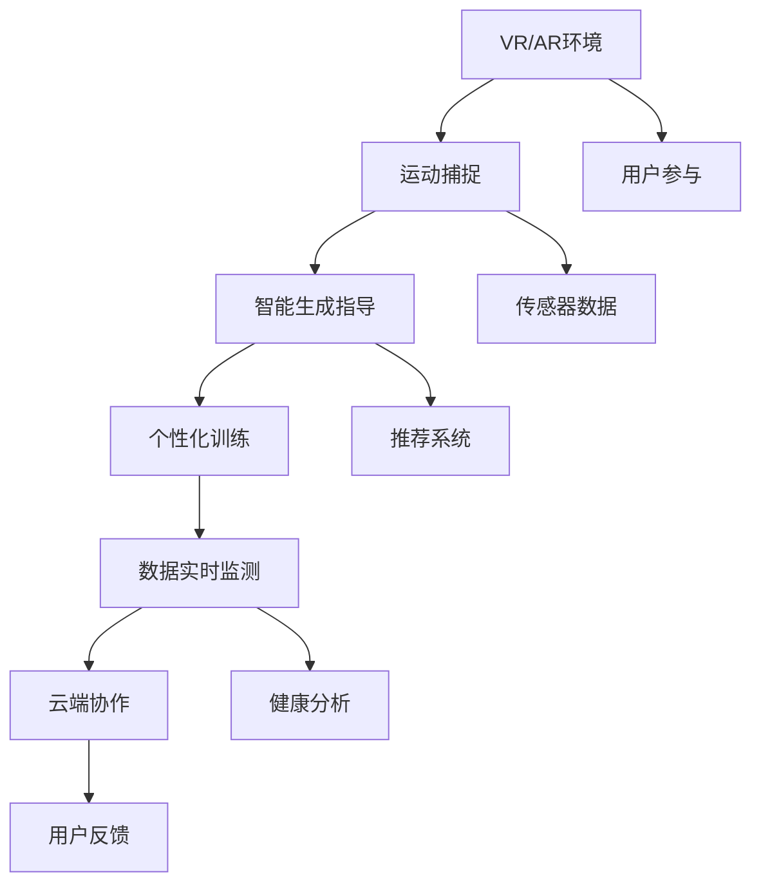

                 

# 虚拟健身:全球健康生活方式的数字化推广

> 关键词：虚拟健身, 数字健康, 人工智能, 运动科学, 用户体验, 健身指导, 数据驱动, 个性化推荐

## 1. 背景介绍

### 1.1 问题由来

随着全球人口老龄化加剧、生活方式发生变化，健康问题日益受到关注。传统健身方式难以满足多样化的需求，尤其在新冠疫情期间，面对面健身服务难以进行，虚拟健身技术应运而生。借助VR、AR、AI等前沿技术，虚拟健身营造沉浸式运动体验，不仅解决健身场所、师资短缺等问题，还能根据用户个性化需求，提供定制化的健身指导和训练计划，实现健康生活方式的数字化推广。

### 1.2 问题核心关键点

虚拟健身技术融合了人工智能、机器学习、运动科学等多个领域的核心技术，旨在通过数字化手段，重塑健身过程，提升用户体验。核心关键点包括：

- **人工智能驱动**：通过数据分析和模型训练，智能生成个性化的健身指导和训练计划。
- **增强现实与虚拟现实**：提供沉浸式体验，增强用户的参与感和互动性。
- **数据驱动**：利用生物传感数据、运动追踪数据等，实时监测用户健康状态，调整训练方案。
- **个性化推荐**：根据用户的历史数据和偏好，推荐适合的运动项目和训练强度。
- **高效协作与反馈**：通过云端服务实现教练与用户的即时沟通，提供个性化的反馈和指导。

## 2. 核心概念与联系

### 2.1 核心概念概述

虚拟健身系统通过虚拟现实、增强现实等技术，结合人工智能和大数据分析，为用户提供沉浸式、个性化、实时的健身指导和训练计划。核心概念包括：

- **虚拟现实(VR)与增强现实(AR)**：构建沉浸式的运动环境，增强用户参与感。
- **人工智能(AI)与机器学习(ML)**：智能生成个性化的健身指导和训练计划，优化用户体验。
- **运动科学**：研究运动生理学和运动心理学，指导运动方案的科学设计。
- **生物传感与运动追踪**：实时监测用户生理状态和运动数据，保证训练的安全性和有效性。
- **云平台与数据存储**：存储和管理用户数据，支持云端协作和反馈。

这些核心概念通过互动和技术融合，共同构建了虚拟健身的生态系统，为用户提供全方位的健康服务。

### 2.2 核心概念原理和架构的 Mermaid 流程图



该图展示了虚拟健身系统的核心技术架构和数据流动。从用户通过VR/AR设备进入虚拟环境，到运动捕捉、智能生成指导、个性化训练，再到数据实时监测、云端协作与反馈，各环节紧密相连，共同支撑虚拟健身的实现。

## 3. 核心算法原理 & 具体操作步骤

### 3.1 算法原理概述

虚拟健身系统的核心算法原理主要分为三个部分：个性化健身指导生成、运动数据实时监测、个性化推荐系统。

- **个性化健身指导生成**：利用深度学习模型，根据用户的历史数据和偏好，生成个性化的健身指导。
- **运动数据实时监测**：通过生物传感设备和运动追踪技术，实时采集用户生理状态和运动数据。
- **个性化推荐系统**：结合用户历史数据和当前状态，实时推荐适合的训练项目和强度。

### 3.2 算法步骤详解

#### 3.2.1 个性化健身指导生成

1. **数据收集**：收集用户的基本信息、历史数据、运动偏好等。
2. **特征提取**：使用机器学习算法对用户数据进行特征提取，包括身体状况、运动能力、偏好等。
3. **模型训练**：利用深度学习模型，如神经网络、决策树等，对用户数据进行训练，生成个性化健身指导。
4. **生成指导**：根据用户当前状态和目标，生成实时健身指导，包括动作、强度、时长等。

#### 3.2.2 运动数据实时监测

1. **传感器数据采集**：使用心率传感器、陀螺仪、加速度计等，采集用户的生理和运动数据。
2. **数据预处理**：对采集的数据进行清洗、归一化等预处理，保证数据质量。
3. **实时监测**：通过实时分析算法，如滑动窗口、异常检测等，监测用户生理和运动状态。
4. **数据存储**：将处理后的数据存储在云端，供后续分析使用。

#### 3.2.3 个性化推荐系统

1. **用户画像构建**：根据用户的历史数据和实时状态，构建用户画像，包括运动偏好、健康状况、训练进度等。
2. **推荐模型训练**：利用机器学习算法，如协同过滤、神经网络等，对用户画像进行训练，生成推荐模型。
3. **推荐生成**：根据用户当前状态和目标，实时生成推荐项目和强度，供用户参考。

### 3.3 算法优缺点

#### 3.3.1 优点

- **高度个性化**：通过深度学习模型和用户画像，实现高度个性化的健身指导和训练计划。
- **实时反馈**：通过实时数据分析，动态调整训练方案，提高训练效果。
- **用户体验好**：沉浸式VR/AR环境，增强用户参与感和互动性。

#### 3.3.2 缺点

- **数据隐私问题**：用户生理和运动数据敏感，如何保护隐私是一大挑战。
- **技术门槛高**：需要多学科技术融合，对技术团队的要求较高。
- **设备成本高**：VR/AR设备、生物传感设备等成本较高，影响普及率。

### 3.4 算法应用领域

虚拟健身技术广泛应用于医疗健康、健身娱乐、教育培训等多个领域：

- **医疗健康**：结合运动科学和生物传感数据，提供个性化的康复训练计划，辅助治疗慢性病。
- **健身娱乐**：通过VR/AR和个性化指导，提供沉浸式健身体验，增强用户黏性。
- **教育培训**：结合视频和互动，提供虚拟实验室和模拟训练，提升教学效果。

## 4. 数学模型和公式 & 详细讲解 & 举例说明

### 4.1 数学模型构建

虚拟健身系统的核心数学模型包括用户画像构建、运动数据分析、推荐模型训练等。以推荐系统为例，其数学模型构建如下：

设用户集合为 $U$，物品集合为 $I$，用户对物品的评分矩阵为 $R \in \mathbb{R}^{m \times n}$，其中 $m$ 为用户数，$n$ 为物品数。推荐系统的目标是为每个用户 $u \in U$ 推荐 $k$ 个物品 $i \in I$，使得评分矩阵 $R$ 最大化。推荐模型 $P$ 可以表示为：

$$
P(u,i) = f(\theta) = \mathbb{E}[r(u,i)|X_u, \Theta] = \theta^T \varphi(X_u)
$$

其中，$X_u$ 为用户 $u$ 的历史数据，$\varphi$ 为特征提取函数，$\theta$ 为模型参数，$r(u,i)$ 为用户 $u$ 对物品 $i$ 的评分。

### 4.2 公式推导过程

推荐模型 $P$ 的最优化问题为：

$$
\min_{\theta} \frac{1}{2}\sum_{u=1}^m\sum_{i=1}^n ||P(u,i) - r(u,i)||^2_2 + \lambda ||\theta||^2_2
$$

使用梯度下降算法求解，设学习率为 $\eta$，则更新公式为：

$$
\theta \leftarrow \theta - \eta \nabla_{\theta}\mathcal{L}(\theta)
$$

其中，$\mathcal{L}(\theta)$ 为损失函数，通常使用均方误差损失。

### 4.3 案例分析与讲解

以某虚拟健身系统的推荐模型为例，其推荐过程如下：

1. **数据准备**：收集用户 $u$ 的历史数据 $X_u$，包括运动偏好、训练时长、目标等。
2. **特征提取**：使用机器学习算法，如随机森林、神经网络等，对 $X_u$ 进行特征提取，生成特征向量 $\varphi(X_u)$。
3. **模型训练**：利用 $R$ 和 $\varphi(X_u)$ 训练推荐模型 $P$。
4. **推荐生成**：根据 $u$ 的当前状态，实时生成 $k$ 个推荐物品 $i_1, i_2, ..., i_k$，供用户参考。

## 5. 项目实践：代码实例和详细解释说明

### 5.1 开发环境搭建

开发虚拟健身系统需要以下环境：

- **编程语言**：Python。
- **深度学习框架**：PyTorch、TensorFlow。
- **数据处理库**：Pandas、NumPy。
- **机器学习库**：scikit-learn、Keras。
- **云服务**：AWS、Google Cloud。

### 5.2 源代码详细实现

以下是一个简化的虚拟健身系统的代码实现：

```python
import torch
from torch import nn, optim
import pandas as pd
import numpy as np

# 用户数据集
users_data = pd.read_csv('users_data.csv')

# 物品数据集
items_data = pd.read_csv('items_data.csv')

# 构建用户画像
user_profile = {}
for user_id in users_data['user_id']:
    user_data = users_data[user_data['user_id'] == user_id]
    profile = user_data[['sex', 'age', 'height', 'weight', 'activity_level']].values
    user_profile[user_id] = profile

# 特征提取
def feature_extraction(data):
    return np.array(data)

# 模型训练
class Recommender(nn.Module):
    def __init__(self, n_users, n_items, n_features):
        super(Recommender, self).__init__()
        self.fc1 = nn.Linear(n_features, 64)
        self.fc2 = nn.Linear(64, n_items)
        
    def forward(self, x):
        x = self.fc1(x)
        x = nn.functional.relu(x)
        x = self.fc2(x)
        return x

n_users = len(user_profile)
n_items = len(items_data['item_id'])
n_features = 5
model = Recommender(n_users, n_items, n_features)
optimizer = optim.Adam(model.parameters(), lr=0.001)
criterion = nn.MSELoss()

# 训练模型
for epoch in range(10):
    for user_id, user_profile in user_profile.items():
        features = feature_extraction(user_profile)
        targets = items_data['rating'].loc[user_id].values
        optimizer.zero_grad()
        outputs = model(features)
        loss = criterion(outputs, targets)
        loss.backward()
        optimizer.step()

# 生成推荐
def generate_recommendations(user_id):
    user_profile = user_profile[user_id]
    features = feature_extraction(user_profile)
    outputs = model(features)
    top_k = outputs.argsort()[::-1][:k]
    recommendations = items_data.iloc[top_k]
    return recommendations
```

### 5.3 代码解读与分析

以上代码实现了基本的虚拟健身系统推荐模型。

- **数据准备**：通过Pandas库读取用户和物品数据集，构建用户画像和特征矩阵。
- **特征提取**：定义特征提取函数，将用户画像转换为特征向量。
- **模型训练**：使用PyTorch定义推荐模型，并使用Adam优化器进行训练。
- **推荐生成**：根据用户当前状态，生成推荐物品，并返回推荐结果。

## 6. 实际应用场景

### 6.1 医院康复训练

虚拟健身技术在康复训练中得到广泛应用。针对患者的具体情况，医院可以通过虚拟健身系统提供个性化的康复训练计划，结合运动捕捉和生物传感数据，实时监测患者状态，动态调整训练方案，提高康复效果。

### 6.2 家庭健身

家庭健身设备通过虚拟健身系统与云端服务连接，提供个性化健身指导和训练计划。用户可以根据自身需求和偏好，随时进行训练，并获得实时反馈和指导，提升家庭健身的效果和体验。

### 6.3 企业员工健康管理

企业通过虚拟健身系统，为员工提供便捷的健身指导和训练服务，结合运动数据分析，实时监测员工健康状况，优化工作与生活的平衡，提升员工整体健康水平。

### 6.4 未来应用展望

未来，虚拟健身技术将进一步拓展应用场景，实现以下目标：

- **全民健康普及**：通过虚拟健身系统，推动全民健康意识提升，普及健康生活方式。
- **医疗健康融合**：结合医疗数据和虚拟健身系统，实现个性化康复和预防保健。
- **远程协作**：通过云平台和虚拟健身系统，实现远程协作和实时互动，打破地域限制。
- **个性化健身市场**：结合个性化推荐和虚拟现实技术，打造沉浸式健身体验，开拓个性化健身市场。

## 7. 工具和资源推荐

### 7.1 学习资源推荐

- **Coursera**：提供多门虚拟健身和运动科学的在线课程，包括人工智能在健身中的应用、运动数据分析等。
- **Kaggle**：提供大量虚拟健身和运动科学的数据集和竞赛，帮助用户实践和提升技能。
- **书籍推荐**：《人工智能在运动科学中的应用》、《运动数据分析与可视化》。

### 7.2 开发工具推荐

- **PyTorch**：灵活高效的深度学习框架，适合虚拟健身系统的开发。
- **TensorFlow**：功能强大的深度学习框架，支持大规模数据处理和模型训练。
- **Amazon SageMaker**：提供云端机器学习平台，支持虚拟健身系统的快速部署和优化。
- **AWS Glue**：提供数据处理服务，支持虚拟健身系统数据清洗和预处理。

### 7.3 相关论文推荐

- **深度学习在运动科学中的应用**：探讨深度学习在运动生理学、运动心理学等领域的实际应用。
- **运动数据分析与可视化**：介绍运动数据分析和可视化的方法和技术，提供运动数据的有效利用。
- **个性化推荐系统的设计与实现**：分析推荐系统的设计与实现，提供推荐模型的优化方法。

## 8. 总结：未来发展趋势与挑战

### 8.1 研究成果总结

虚拟健身技术通过融合人工智能、机器学习、运动科学等领域的核心技术，为用户提供沉浸式、个性化、实时的健身指导和训练计划，已广泛应用于医疗健康、健身娱乐、企业员工健康管理等领域。该技术通过数据驱动和个性化推荐，显著提升了用户体验和健康效果。

### 8.2 未来发展趋势

未来虚拟健身技术将呈现以下几个发展趋势：

- **技术融合加深**：结合生物传感、运动捕捉、虚拟现实等技术，提供更沉浸式、更科学的健身体验。
- **智能医疗融合**：结合医疗数据和虚拟健身系统，实现个性化康复和预防保健，推动医疗健康普及。
- **个性化推荐优化**：结合深度学习和大数据分析，提供更精准、更个性化的推荐方案，提升用户体验。
- **跨平台协作**：通过云平台和虚拟健身系统，实现跨平台协作和实时互动，打破地域限制。
- **健康数据整合**：整合多种健康数据，提供全面、准确的健康分析，提升用户健康水平。

### 8.3 面临的挑战

虚拟健身技术在推广和应用中仍面临以下挑战：

- **技术复杂度高**：虚拟健身系统需要多学科技术的融合，对技术团队的要求较高。
- **数据隐私问题**：用户生理和运动数据敏感，如何保护隐私是一大挑战。
- **设备成本高**：VR/AR设备、生物传感设备等成本较高，影响普及率。
- **用户体验差异**：不同用户对虚拟现实和沉浸式体验的接受度不同，需要优化用户体验。
- **健康数据准确性**：如何准确采集和处理生物传感数据，提升运动数据分析的准确性。

### 8.4 研究展望

未来虚拟健身技术需要关注以下研究方向：

- **多学科技术融合**：结合生物传感、运动捕捉、虚拟现实等技术，提供更沉浸式、更科学的健身体验。
- **数据隐私保护**：研究数据隐私保护技术，确保用户数据的隐私安全。
- **低成本设备应用**：研发低成本的虚拟现实设备和生物传感设备，降低用户使用门槛。
- **跨平台协作**：通过云平台和虚拟健身系统，实现跨平台协作和实时互动，打破地域限制。
- **健康数据分析**：整合多种健康数据，提供全面、准确的健康分析，提升用户健康水平。

## 9. 附录：常见问题与解答

### Q1：虚拟健身系统如何保护用户隐私？

A: 虚拟健身系统在数据采集和存储过程中，应采取严格的隐私保护措施，如数据加密、匿名化处理、访问控制等。同时，提供用户数据管理和使用的透明度，让用户自主控制和管理自己的数据。

### Q2：虚拟健身系统如何保证数据准确性？

A: 虚拟健身系统应采用高质量的生物传感设备和运动捕捉设备，确保数据的准确性和实时性。同时，通过数据清洗和预处理，去除异常数据和噪声，提升运动数据分析的准确性。

### Q3：虚拟健身系统如何优化用户体验？

A: 虚拟健身系统应结合用户反馈和行为数据，不断优化系统功能和界面设计，提高用户的沉浸感和参与感。同时，提供个性化的健身指导和训练计划，提升用户的训练效果和体验。

### Q4：虚拟健身系统如何提升训练效果？

A: 虚拟健身系统应结合运动科学和生物传感数据，实时监测用户健康状态和训练效果，动态调整训练方案。同时，提供个性化的健身指导和训练计划，提升用户的训练效果和体验。

### Q5：虚拟健身系统如何实现跨平台协作？

A: 虚拟健身系统应采用云平台和分布式架构，支持跨平台协作和实时互动。同时，提供简单易用的API接口和SDK，方便与其他系统集成和交互。

