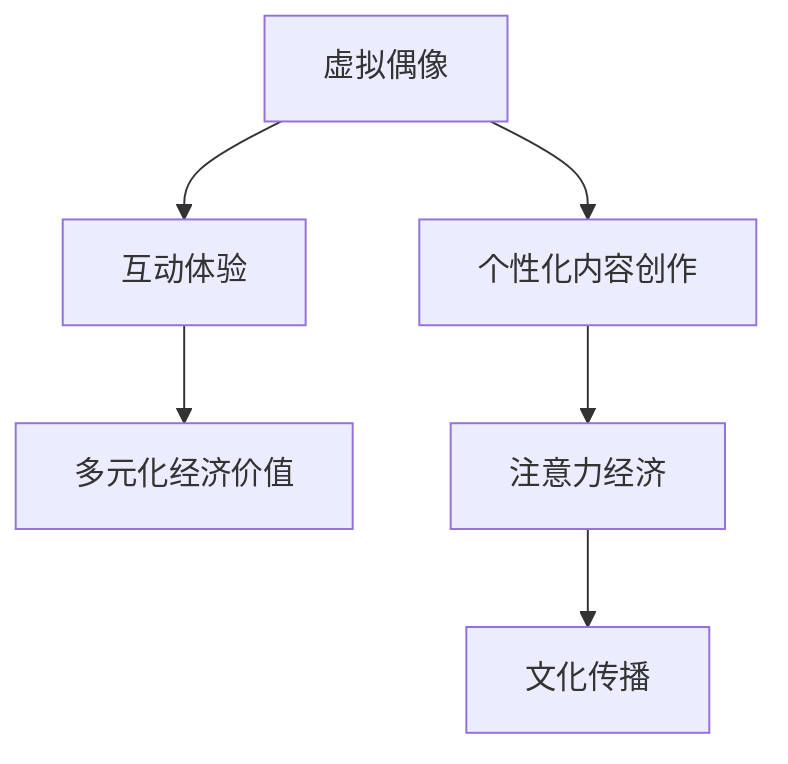

                 

## 1. 背景介绍

### 1.1 问题由来

在21世纪，随着互联网和社交媒体的飞速发展，注意力经济（Attention Economy）成为了一种新的经济形态，即以争夺消费者注意力为核心的经济模式。虚拟偶像（Virtual Idols）的崛起，正是这一背景下应运而生的现象。

虚拟偶像，指的是通过计算机技术和AI驱动，在互联网上呈现拟人形象并进行表演的虚拟角色。它们具备独特的艺术魅力和互动性，能够在短时间内吸引大量用户关注，成为新的流量汇聚点。虚拟偶像的成功不仅体现在商业价值上，更是注意力经济时代的一种创新尝试，为内容创作和用户互动提供新的可能。

### 1.2 问题核心关键点

虚拟偶像的核心关键点在于其能够通过算法驱动和数据管理，实现高度个性化的内容创造和互动体验，从而在注意力经济中占据一席之地。具体体现在以下几个方面：

1. **算法驱动的个性化内容创作**：虚拟偶像可以基于用户行为数据，动态生成符合用户喜好的内容，从而提高用户的粘性和满意度。
2. **数据管理的互动体验**：通过AI和大数据分析，虚拟偶像能够实时响应用户的互动反馈，提供定制化的互动体验。
3. **经济价值的多元化**：虚拟偶像不仅可以通过直播、演出等传统方式创造收益，还可以通过虚拟商品销售、代言合作等多元化方式获取收入。
4. **文化和价值观的传播**：虚拟偶像通常代表一种全新的文化潮流和价值观，通过粉丝社区和社交媒体的传播，对社会文化和价值观产生影响。

### 1.3 问题研究意义

虚拟偶像在注意力经济中的崛起，为内容创作者、广告商、营销人员提供了一种新的思路和工具。通过虚拟偶像，内容可以更加精准地触达目标用户，广告和营销活动也能更高效地传递信息。同时，虚拟偶像也开辟了新的娱乐形式，为内容产业带来了创新和发展的新空间。

## 2. 核心概念与联系

### 2.1 核心概念概述

虚拟偶像在注意力经济中的崛起，涉及多个核心概念：

1. **虚拟偶像**：指通过计算机技术和AI驱动，在互联网上呈现拟人形象并进行表演的虚拟角色。
2. **注意力经济**：以争夺消费者注意力为核心的经济模式，强调信息的有效传达和用户注意力的高效利用。
3. **算法驱动**：通过算法自动化地处理和分析用户行为数据，进行内容生成和互动优化。
4. **个性化内容创作**：根据用户偏好和历史行为数据，动态生成符合用户喜好的内容。
5. **互动体验**：利用AI和大数据分析，实时响应用户的互动反馈，提供定制化的互动体验。
6. **多元化经济价值**：通过多种渠道创造收益，包括直播、演出、虚拟商品销售、代言合作等。
7. **文化传播**：虚拟偶像代表一种全新的文化潮流和价值观，通过粉丝社区和社交媒体的传播，对社会文化和价值观产生影响。

这些概念之间的逻辑关系可以通过以下Mermaid流程图来展示：



这个流程图展示虚拟偶像的核心概念及其之间的关系：

1. 虚拟偶像通过算法驱动，实现个性化内容创作。
2. 提供互动体验，增强用户粘性。
3. 创造多元化经济价值，拓展商业模式。
4. 传播新的文化潮流和价值观，影响社会。

## 3. 核心算法原理 & 具体操作步骤

### 3.1 算法原理概述

虚拟偶像在注意力经济中的崛起，基于以下算法原理：

1. **用户行为数据分析**：通过收集和分析用户行为数据，如观看时长、点赞数、评论内容等，了解用户的兴趣和偏好。
2. **内容推荐算法**：基于用户行为数据和内容特征，使用协同过滤、深度学习等推荐算法，生成个性化内容。
3. **情感分析与互动优化**：通过情感分析技术，识别用户情绪变化，动态调整互动策略，提供定制化的互动体验。
4. **经济价值量化**：通过大数据分析，量化虚拟偶像在不同渠道上的经济价值，优化资源配置。
5. **文化传播与粉丝社区管理**：利用社交媒体分析，监测虚拟偶像的文化传播效果，管理粉丝社区，促进价值观传播。

### 3.2 算法步骤详解

虚拟偶像在注意力经济中的崛起，涉及到多个算法步骤：

**Step 1: 用户行为数据收集**

虚拟偶像通过各种渠道收集用户行为数据，如直播平台、社交媒体、应用程序等。数据来源包括观看时长、点赞数、评论内容、互动行为等。

**Step 2: 用户兴趣建模**

使用协同过滤、深度学习等方法，对用户行为数据进行分析，建立用户兴趣模型。模型可以表示为用户-兴趣矩阵，其中每行代表一个用户，每列代表一种兴趣，矩阵中的每个元素表示用户对某兴趣的兴趣程度。

**Step 3: 个性化内容生成**

基于用户兴趣模型，使用推荐算法（如协同过滤、矩阵分解等）生成个性化内容。对于每个用户，算法根据其兴趣模型，从内容库中选择最相关的视频、音乐、文章等进行推荐。

**Step 4: 互动体验优化**

通过情感分析技术，实时监测用户对虚拟偶像内容的情感反馈，如情感极性、情绪变化等。根据情感反馈，动态调整虚拟偶像的互动策略，如内容更新频率、互动形式等。

**Step 5: 经济价值量化**

使用大数据分析技术，量化虚拟偶像在不同渠道上的经济价值。例如，通过计算直播平台的观看人数、社交媒体的转发量、虚拟商品销售量等，评估虚拟偶像的商业潜力。

**Step 6: 文化传播与社区管理**

利用社交媒体分析技术，监测虚拟偶像的文化传播效果，分析粉丝社区的互动行为，管理社区秩序，提升文化传播效果。

### 3.3 算法优缺点

虚拟偶像在注意力经济中的崛起，基于算法驱动的个性化内容创作和互动体验，具备以下优点：

1. **高度个性化**：根据用户行为数据生成个性化内容，提高用户满意度和粘性。
2. **高效互动**：通过实时情感分析，动态调整互动策略，提供定制化的互动体验。
3. **多渠道收益**：通过多种渠道创造收益，拓展商业模式。
4. **文化传播**：代表新的文化潮流和价值观，促进社会文化传播。

同时，虚拟偶像也面临以下挑战：

1. **算法公平性**：算法驱动的内容生成和互动优化，可能存在算法偏见和数据偏差，需要公平性分析和纠正。
2. **用户隐私保护**：收集和分析用户行为数据，可能涉及用户隐私问题，需要严格的数据保护措施。
3. **文化同质化**：虚拟偶像推广的统一文化价值观，可能造成文化同质化现象。

### 3.4 算法应用领域

虚拟偶像在注意力经济中的崛起，广泛应用在以下几个领域：

1. **娱乐行业**：通过直播、演出、虚拟演唱会等形式，吸引大量用户关注，创造经济价值。
2. **广告和营销**：与品牌合作，通过虚拟偶像进行广告和营销活动，提升品牌影响力。
3. **教育行业**：通过虚拟偶像进行知识普及和教育互动，提高教育效果。
4. **健康医疗**：通过虚拟偶像进行心理健康咨询和健康科普，提供心理支持。
5. **虚拟商品销售**：通过虚拟偶像代言和推广虚拟商品，开辟新的市场空间。

## 4. 数学模型和公式 & 详细讲解 & 举例说明

### 4.1 数学模型构建

虚拟偶像在注意力经济中的崛起，基于以下数学模型：

1. **用户行为数据矩阵**：$U \in \mathbb{R}^{N \times K}$，其中 $N$ 为用户数量，$K$ 为兴趣类型数量。
2. **内容特征矩阵**：$C \in \mathbb{R}^{M \times K}$，其中 $M$ 为内容数量，$K$ 为特征维度。
3. **用户兴趣模型**：$U \times C$ 的矩阵乘积，表示用户对内容的兴趣程度。
4. **个性化内容推荐算法**：$U \times C$ 的矩阵乘积加上损失函数 $L$。
5. **情感分析模型**：$E \in \mathbb{R}^{N \times T}$，其中 $T$ 为时间步长。
6. **互动策略优化模型**：$U \times C \times E$ 的组合矩阵乘积，表示用户对互动策略的反应。
7. **经济价值量化模型**：$V \in \mathbb{R}^{N \times T}$，表示用户对虚拟偶像的经济价值。

### 4.2 公式推导过程

以协同过滤算法为例，推导个性化内容推荐公式：

设用户 $u$ 对内容 $c$ 的兴趣程度为 $r_{uc}$，则协同过滤算法可以表示为：

$$
r_{uc} = \sum_{i=1}^N \alpha_i u_i c_i
$$

其中 $\alpha_i$ 为权重系数，可以使用矩阵分解等方法求解。对于每个用户 $u$，算法选择兴趣程度最高的 $k$ 个内容进行推荐。推荐公式为：

$$
\text{Top}_k = \text{Top-k}(U \times C \times \alpha)
$$

其中 $\text{Top-k}(\cdot)$ 表示选取前 $k$ 个元素的函数。

### 4.3 案例分析与讲解

以虚拟偶像在音乐平台上的应用为例：

1. **用户行为数据收集**：平台收集用户听歌时长、点赞数、评论内容等数据。
2. **用户兴趣建模**：使用协同过滤算法，建立用户兴趣模型。
3. **个性化内容生成**：根据用户兴趣模型，推荐用户可能感兴趣的歌曲。
4. **互动体验优化**：实时监测用户对歌曲的情感反馈，调整歌曲推荐策略。
5. **经济价值量化**：计算歌曲在平台上的观看次数、评论数量等，评估虚拟偶像的经济价值。
6. **文化传播与社区管理**：通过社交媒体分析，监测虚拟偶像的文化传播效果，管理粉丝社区。

## 5. 项目实践：代码实例和详细解释说明

### 5.1 开发环境搭建

在进行虚拟偶像在注意力经济中的崛起研究时，需要搭建以下开发环境：

1. **Python**：使用 Python 进行算法实现和数据分析。
2. **NumPy**：用于高效矩阵运算和数据处理。
3. **Pandas**：用于数据清洗和分析。
4. **Scikit-learn**：用于推荐算法实现。
5. **TensorFlow**：用于情感分析和互动优化。
6. **Flask**：用于搭建虚拟偶像互动平台。

### 5.2 源代码详细实现

以下是一个使用 Python 实现个性化内容推荐算法的示例代码：

```python
import numpy as np
from scipy.sparse import csr_matrix
from sklearn.metrics.pairwise import cosine_similarity

# 用户行为数据矩阵
U = np.array([[0.8, 0.6, 0.7],
              [0.5, 0.3, 0.4],
              [0.9, 0.7, 0.8]])

# 内容特征矩阵
C = np.array([[1, 0, 0],
              [1, 1, 1],
              [0, 1, 1]])

# 计算用户兴趣模型
alpha = np.array([1, 0.5, 0.3])
U_inter = U * np.expand_dims(alpha, axis=1)

# 计算个性化内容推荐
top_k = 2
top_r = U_inter.dot(C).argsort()[::-1]
top_c = C[top_r[:top_k]]
top_k = top_r[:top_k]

# 输出推荐结果
print(f"Top-{top_k} Recommendations:")
for u in range(U.shape[0]):
    print(f"User {u+1}:")
    for c in range(top_k[u]):
        print(f"Content {top_c[c]+1}")
```

### 5.3 代码解读与分析

以上代码实现了基于协同过滤算法的个性化内容推荐。具体步骤如下：

1. **用户行为数据矩阵 U 和内容特征矩阵 C 的构建**：用户行为数据和内容特征被表示为矩阵，每行表示一个用户，每列表示一种特征。
2. **用户兴趣模型 alpha 的构建**：用户兴趣模型被表示为向量，每个元素表示用户对一种特征的兴趣程度。
3. **个性化内容推荐计算**：通过矩阵乘积，计算用户对内容的兴趣程度，并选取兴趣程度最高的前 top_k 个内容进行推荐。
4. **输出推荐结果**：按用户依次输出推荐内容。

## 6. 实际应用场景

### 6.1 娱乐行业

在娱乐行业中，虚拟偶像通过直播、演出、虚拟演唱会等形式，吸引大量用户关注。平台可以通过分析用户观看时长、互动行为等数据，生成个性化内容，提升用户体验。虚拟偶像还可以通过互动策略优化，提高用户粘性和满意度。

### 6.2 广告和营销

广告和营销活动中，虚拟偶像与品牌合作，通过直播、短视频、社交媒体等渠道，进行品牌推广。平台可以通过情感分析技术，实时监测用户对广告内容的反馈，动态调整广告策略，提升广告效果。

### 6.3 教育行业

在教育行业中，虚拟偶像用于知识普及和教育互动。平台可以根据用户学习行为，生成个性化教学内容，提供定制化的学习体验。虚拟偶像还可以作为虚拟教师，进行互动教学，提高教育效果。

### 6.4 健康医疗

虚拟偶像在健康医疗领域，用于心理健康咨询和健康科普。平台可以通过情感分析技术，识别用户情绪变化，动态调整咨询服务策略，提供心理支持。虚拟偶像还可以用于健康知识普及，提高公众健康意识。

### 6.5 虚拟商品销售

在虚拟商品销售中，虚拟偶像代言和推广虚拟商品。平台可以通过分析用户购买行为，生成个性化推荐，提升销售转化率。虚拟偶像还可以通过互动策略优化，增加用户购买欲望，拓展市场空间。

### 6.6 文化传播

虚拟偶像在文化传播中，代表新的文化潮流和价值观，通过粉丝社区和社交媒体的传播，影响社会文化和价值观。平台可以通过社区管理，促进文化传播，提升社会文化影响力。

## 7. 工具和资源推荐

### 7.1 学习资源推荐

为了帮助开发者系统掌握虚拟偶像在注意力经济中的崛起，这里推荐一些优质的学习资源：

1. **《深度学习》系列书籍**：由 Ian Goodfellow、Yoshua Bengio 和 Aaron Courville 编写的深度学习经典教材，全面介绍了深度学习的基础理论和算法。
2. **Coursera《机器学习》课程**：由 Andrew Ng 开设的机器学习课程，涵盖机器学习的基本概念和算法，适合初学者学习。
3. **Kaggle**：数据科学和机器学习竞赛平台，提供海量数据集和算法竞赛，实践机器学习算法。
4. **GitHub**：开源代码托管平台，可以找到大量虚拟偶像项目的源代码，学习实际应用。
5. **ArXiv**：学术论文发布平台，查找虚拟偶像领域的前沿论文和研究成果。

### 7.2 开发工具推荐

在虚拟偶像开发过程中，推荐使用以下工具：

1. **Jupyter Notebook**：交互式编程环境，支持代码编写和数据可视化。
2. **TensorBoard**：TensorFlow的可视化工具，实时监测模型训练状态，提供图表呈现方式。
3. **Flask**：轻量级Web框架，用于搭建虚拟偶像互动平台。
4. **Kibana**：数据可视化工具，用于展示用户行为数据和分析结果。
5. **MySQL**：关系型数据库，用于存储用户行为数据和内容数据。

### 7.3 相关论文推荐

虚拟偶像在注意力经济中的崛起，涉及多个前沿研究方向，以下是几篇奠基性的相关论文，推荐阅读：

1. **《基于协同过滤的个性化推荐算法》**：介绍协同过滤算法的基本原理和实现方法，适用于虚拟偶像的个性化内容推荐。
2. **《情感分析与自然语言处理》**：介绍情感分析技术在自然语言处理中的应用，适用于虚拟偶像的互动策略优化。
3. **《注意力机制与深度学习》**：介绍注意力机制在深度学习中的应用，适用于虚拟偶像的个性化内容生成和互动体验。
4. **《深度学习在音乐推荐中的应用》**：介绍深度学习算法在音乐推荐中的应用，适用于虚拟偶像的音乐推荐。
5. **《虚拟偶像的文化传播效果研究》**：分析虚拟偶像在文化传播中的作用和影响，适用于虚拟偶像的文化传播与社区管理。

## 8. 总结：未来发展趋势与挑战

### 8.1 总结

本文对虚拟偶像在注意力经济中的崛起进行了全面系统的介绍。首先阐述了虚拟偶像的背景和研究意义，明确了其高度个性化的内容创作和互动体验的核心价值。其次，从原理到实践，详细讲解了虚拟偶像的算法原理和具体操作步骤，给出了完整的代码实例。同时，本文还广泛探讨了虚拟偶像在娱乐、广告、教育、医疗等领域的实际应用场景，展示了其广泛的应用前景。最后，本文精选了虚拟偶像领域的学习资源和开发工具，力求为读者提供全方位的技术指引。

通过本文的系统梳理，可以看到，虚拟偶像在注意力经济中的崛起，为内容创作者、广告商、营销人员提供了一种新的思路和工具。通过虚拟偶像，内容可以更加精准地触达目标用户，广告和营销活动也能更高效地传递信息。同时，虚拟偶像也开辟了新的娱乐形式，为内容产业带来了创新和发展的新空间。

### 8.2 未来发展趋势

展望未来，虚拟偶像在注意力经济中的崛起，将呈现以下几个发展趋势：

1. **算法的进步**：随着深度学习和大数据技术的进步，虚拟偶像的个性化内容创作和互动体验将更加精准高效。
2. **技术的融合**：虚拟偶像将与物联网、区块链等技术进行融合，提供更加智能和安全的互动体验。
3. **内容的创新**：虚拟偶像将创作更多高质量的内容，如虚拟演唱会、虚拟直播等，提升用户体验。
4. **文化的传播**：虚拟偶像将代表新的文化潮流和价值观，通过粉丝社区和社交媒体的传播，对社会文化和价值观产生更大的影响。
5. **经济的多元化**：虚拟偶像将通过更多渠道创造收益，如虚拟商品销售、NFT交易等，拓展商业模式。

### 8.3 面临的挑战

尽管虚拟偶像在注意力经济中的崛起带来了巨大的商业机会，但在其发展过程中，也面临诸多挑战：

1. **算法的公平性**：算法驱动的内容生成和互动优化，可能存在算法偏见和数据偏差，需要公平性分析和纠正。
2. **用户隐私保护**：收集和分析用户行为数据，可能涉及用户隐私问题，需要严格的数据保护措施。
3. **文化的同质化**：虚拟偶像推广的统一文化价值观，可能造成文化同质化现象。
4. **技术的安全性**：虚拟偶像的互动平台和数据管理，可能面临黑客攻击和数据泄露的风险。

### 8.4 研究展望

面对虚拟偶像在注意力经济中的崛起所面临的挑战，未来的研究需要在以下几个方面寻求新的突破：

1. **算法的公平性**：开发更加公平和透明的推荐算法，减少算法偏见和数据偏差。
2. **用户隐私保护**：研究数据保护和隐私保护的最新技术，确保用户数据的隐私和安全。
3. **文化的多样性**：推动虚拟偶像文化的多样化，避免文化同质化现象，提升文化影响力。
4. **技术的安全性**：研究安全防护技术，保障虚拟偶像互动平台和数据管理的安全性。

这些研究方向的探索，必将引领虚拟偶像在注意力经济中的崛起，为内容创作者、广告商、营销人员提供新的工具和方法，推动社会文化的创新和发展。

## 9. 附录：常见问题与解答

**Q1: 虚拟偶像在注意力经济中的崛起对内容产业有哪些影响？**

A: 虚拟偶像在注意力经济中的崛起，对内容产业的影响主要体现在以下几个方面：

1. **内容精准化**：虚拟偶像通过个性化内容推荐，可以精准地触达目标用户，提高内容的相关性和吸引力。
2. **广告效益提升**：虚拟偶像与品牌合作进行广告推广，通过互动策略优化，提高广告的互动率和转化率。
3. **互动体验优化**：虚拟偶像提供实时互动体验，提高用户的粘性和满意度，提升用户参与度。
4. **商业模式的创新**：虚拟偶像通过虚拟商品销售、代言合作等多元化方式，拓展了内容产业的商业模式。
5. **文化传播的扩展**：虚拟偶像代表新的文化潮流和价值观，通过粉丝社区和社交媒体的传播，提升了文化的传播效果。

**Q2: 虚拟偶像在注意力经济中的崛起面临哪些挑战？**

A: 虚拟偶像在注意力经济中的崛起面临以下挑战：

1. **算法的公平性**：算法偏见和数据偏差可能导致虚拟偶像推荐内容的公平性不足。
2. **用户隐私保护**：用户行为数据的收集和分析涉及隐私问题，需要严格的数据保护措施。
3. **文化同质化**：虚拟偶像推广的统一文化价值观可能造成文化同质化现象。
4. **技术安全性**：虚拟偶像互动平台和数据管理面临黑客攻击和数据泄露的风险。

**Q3: 虚拟偶像在注意力经济中的崛起有哪些实际应用场景？**

A: 虚拟偶像在注意力经济中的崛起，广泛应用在以下几个领域：

1. **娱乐行业**：通过直播、演出、虚拟演唱会等形式，吸引大量用户关注，创造经济价值。
2. **广告和营销**：与品牌合作，进行广告和营销活动，提升品牌影响力。
3. **教育行业**：用于知识普及和教育互动，提高教育效果。
4. **健康医疗**：用于心理健康咨询和健康科普，提供心理支持。
5. **虚拟商品销售**：代言和推广虚拟商品，开辟新的市场空间。
6. **文化传播**：代表新的文化潮流和价值观，通过粉丝社区和社交媒体的传播，提升文化传播效果。

---

作者：禅与计算机程序设计艺术 / Zen and the Art of Computer Programming

