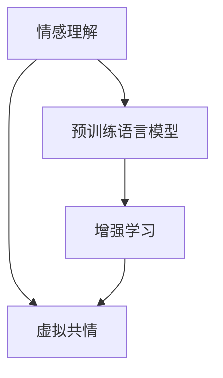

                 

# 虚拟共情训练营：AI增强的情感理解课程

## 1. 背景介绍

### 1.1 问题由来

随着人工智能技术的快速发展，情感理解(Affective Understanding)在自然语言处理(NLP)、人机交互、心理健康等领域的重要性日益凸显。情感理解不仅有助于提升用户体验，还能帮助企业和机构更好地洞察用户需求，优化服务策略。传统的情感理解方法依赖于手动标注的情感数据集，耗时长、成本高，且难以覆盖所有情感场景。

近年来，深度学习技术在情感理解中取得了显著进展，尤其是预训练语言模型，通过在无标签文本数据上进行自监督预训练，学习了丰富的语言知识，能够自动推断文本中的情感倾向。然而，这种基于预训练的语言模型仍然存在一定的局限性，特别是在面对特定领域和复杂情感场景时，效果往往不尽如人意。

### 1.2 问题核心关键点

为了突破预训练模型的瓶颈，将情感理解技术推向新的高度，研究人员开始探索基于增强学习的情感理解范式。这种范式通过将情感数据与强化学习技术相结合，使模型在虚拟环境中逐步提升对情感的识别和理解能力。虚拟共情训练营(Virtual Empathy Training Camp)即是一种基于增强学习的情感理解课程，旨在通过模拟人类情感交互的过程，训练模型更好地理解和生成人类情感表达。

## 2. 核心概念与联系

### 2.1 核心概念概述

为更好地理解虚拟共情训练营的技术原理，本节将介绍几个密切相关的核心概念：

- **情感理解(Affective Understanding)**：指识别和推断文本中表达的情感倾向，如快乐、悲伤、愤怒等，以及这些情感的强度和变化。
- **虚拟共情(Embodied Simulation)**：指模拟人类在虚拟环境中的情感反应和决策过程，以更好地理解和生成情感表达。
- **增强学习(Reinforcement Learning, RL)**：一种通过试错来学习最优策略的机器学习技术，常见于游戏、机器人控制等领域。
- **预训练语言模型(Pre-trained Language Models, PLMs)**：通过在大规模无标签文本数据上进行自监督预训练，学习语言知识，能够自动推断文本中的情感倾向。

这些核心概念之间的逻辑关系可以通过以下Mermaid流程图来展示：



这个流程图展示了一些关键概念及其之间的关系：

1. 情感理解是虚拟共情训练营的终极目标。
2. 虚拟共情训练营通过增强学习技术模拟人类情感交互。
3. 预训练语言模型为情感理解提供基础，通过增强学习进一步提升。

## 3. 核心算法原理 & 具体操作步骤
### 3.1 算法原理概述

虚拟共情训练营是一种基于增强学习的情感理解课程，其核心思想是通过模拟人类情感交互的过程，训练模型更好地理解和生成情感表达。具体而言，训练营将情感数据与强化学习技术相结合，使模型在虚拟环境中逐步提升对情感的识别和理解能力。

### 3.2 算法步骤详解

虚拟共情训练营一般包括以下几个关键步骤：

**Step 1: 准备情感数据集**

- 收集含有情感标注的文本数据集，如情感推断、情感生成、情感分类等任务的数据集。
- 将数据集划分为训练集、验证集和测试集。

**Step 2: 设计虚拟共情环境**

- 创建一个虚拟共情环境，该环境能够模拟人类情感交互的过程，包括对话、情感反馈、情感转移等环节。
- 环境应支持交互式的情感推断和情感生成，如给定上下文，模型需要输出下一个情感表达。

**Step 3: 设计情感评估指标**

- 定义情感评估指标，用于衡量模型在虚拟共情环境中的表现。如情感生成质量、情感推断准确率等。
- 设计奖励函数，用于指导模型学习。奖励函数可以基于情感表达的合理性和多样性。

**Step 4: 训练模型**

- 将模型初始化为情感理解模型的基础架构，如使用预训练的BERT模型。
- 将模型输入虚拟共情环境中，通过与环境的交互，不断调整模型参数，以提升情感推断和情感生成的能力。
- 在每个训练轮次后，评估模型在虚拟共情环境中的表现，根据评估结果调整模型和训练策略。

**Step 5: 测试和部署**

- 在测试集上评估微调后模型在虚拟共情环境中的表现，对比微调前后的效果提升。
- 使用微调后的模型对新的情感场景进行推理预测，集成到实际的应用系统中。

以上就是虚拟共情训练营的完整流程。在实际应用中，还需要针对具体任务的特点，对训练营的各个环节进行优化设计，如改进虚拟共情环境，引入更多的情感反馈机制，搜索最优的超参数组合等，以进一步提升模型性能。

### 3.3 算法优缺点

虚拟共情训练营方法具有以下优点：

1. 灵活性高。通过模拟人类情感交互，模型可以逐步提升对各种情感场景的理解能力。
2. 自适应强。模型可以根据虚拟环境中的反馈不断调整策略，适应不同的情感表达方式。
3. 泛化能力强。通过增强学习技术，模型能够学习到更丰富、更复杂的情感表达。
4. 可解释性强。虚拟共情训练营能够提供情感生成的逻辑依据，增强模型的可解释性。

同时，该方法也存在一定的局限性：

1. 数据依赖。虚拟共情训练营的效果很大程度上依赖于虚拟环境的质量，需要精心设计虚拟共情环境。
2. 计算开销大。增强学习技术需要大量的计算资源进行模型训练和参数优化，对硬件条件要求较高。
3. 模型复杂度高。虚拟共情训练营的模型结构通常较为复杂，维护和调试难度较大。
4. 结果可控性差。虚拟共情训练营的结果受虚拟环境设计和模型参数调整的影响较大，难以完全控制。

尽管存在这些局限性，但就目前而言，虚拟共情训练营仍是大语言模型情感理解的重要技术方向。未来相关研究的重点在于如何进一步降低训练营的计算开销，提高模型的灵活性和可解释性，同时兼顾模型的泛化能力和训练效率。

### 3.4 算法应用领域

虚拟共情训练营方法在情感理解领域已经得到了广泛的应用，主要包括以下几个方面：

- **情感推断**：在对话系统、智能客服、虚拟助手等场景中，实时推断用户情感，提供个性化服务。
- **情感生成**：在内容生成、情感回复、虚拟角色交互等场景中，自动生成符合情感要求的文本输出。
- **情感分类**：在社交媒体分析、情感分析、用户反馈评估等场景中，对文本情感进行分类和情感极性判断。
- **情感转移**：在影视、游戏等娱乐领域，模拟角色情感转移，增强互动体验。
- **情感增强**：在心理健康、心理咨询等场景中，通过虚拟共情训练营，帮助用户识别和管理自身情感，提升心理健康水平。

除了上述这些经典应用外，虚拟共情训练营还被创新性地应用到更多领域中，如情感智能玩具、情感驱动的游戏、虚拟社交平台等，为情感理解技术带来了新的突破。随着预训练模型和增强学习方法的不断进步，相信虚拟共情训练营将在更广阔的应用领域大放异彩。

## 4. 数学模型和公式 & 详细讲解 & 举例说明

### 4.1 数学模型构建

虚拟共情训练营的数学模型可以通过以下公式进行形式化表达：

设模型在虚拟共情环境中的策略为 $\Pi$，在时间 $t$ 的情感表达为 $X_t$，实际情感标签为 $Y_t$，则模型在虚拟共情环境中的奖励函数 $R_t$ 可以定义为：

$$
R_t = r(Y_t, X_t, \Pi)
$$

其中 $r$ 为奖励函数，用于评估模型在时间 $t$ 的情感表达 $X_t$ 是否与实际情感标签 $Y_t$ 相匹配。

模型在虚拟共情环境中的优化目标为最大化期望总奖励：

$$
\max_{\Pi} \mathbb{E}\left[\sum_{t=1}^{T} R_t\right]
$$

其中 $T$ 为总时间步数，$\mathbb{E}$ 表示期望值。

### 4.2 公式推导过程

以情感生成任务为例，我们可以将虚拟共情训练营的数学模型进一步具体化：

假设模型在虚拟共情环境中的策略为 $\Pi$，当前时间步的情感表达为 $X_t$，实际情感标签为 $Y_t$。则奖励函数 $R_t$ 可以定义为：

$$
R_t = \mathbb{E}\left[\log P(Y_t|X_t, \Pi)\right]
$$

其中 $P(Y_t|X_t, \Pi)$ 为模型在时间 $t$ 生成情感标签 $Y_t$ 的概率，可以通过模型输出层的softmax函数计算得到。

模型在虚拟共情环境中的优化目标为最大化期望总奖励：

$$
\max_{\Pi} \mathbb{E}\left[\sum_{t=1}^{T} \log P(Y_t|X_t, \Pi)\right]
$$

通过反向传播算法，可以计算出模型在每个时间步的梯度，更新模型参数 $\Pi$，以提升情感生成能力。

### 4.3 案例分析与讲解

以情感生成任务为例，我们对虚拟共情训练营的模型构建和训练过程进行详细讲解。

**模型选择**：
- 使用预训练的BERT模型作为情感生成的基础架构，其输出层包含12个隐含层，每个隐含层有768个神经元，通过Dropout层进一步减少过拟合风险。

**虚拟共情环境设计**：
- 创建一个虚拟共情环境，模拟用户与虚拟角色的对话场景。对话场景中，虚拟角色可以根据用户的情感表达，生成符合情感要求的回复。
- 设计奖励函数 $R_t$，用于评估模型在时间 $t$ 的情感生成质量。例如，可以基于情感表达的合理性和多样性设计奖励函数。

**模型训练**：
- 将模型输入虚拟共情环境中，通过与环境的交互，不断调整模型参数，以提升情感生成的能力。
- 在每个训练轮次后，评估模型在虚拟共情环境中的表现，根据评估结果调整模型和训练策略。

**模型测试**：
- 在测试集上评估微调后模型在虚拟共情环境中的表现，对比微调前后的效果提升。
- 使用微调后的模型对新的情感场景进行推理预测，集成到实际的应用系统中。

## 5. 项目实践：代码实例和详细解释说明

### 5.1 开发环境搭建

在进行虚拟共情训练营实践前，我们需要准备好开发环境。以下是使用Python进行PyTorch开发的环境配置流程：

1. 安装Anaconda：从官网下载并安装Anaconda，用于创建独立的Python环境。

2. 创建并激活虚拟环境：
```bash
conda create -n vempathy-env python=3.8 
conda activate vempathy-env
```

3. 安装PyTorch：根据CUDA版本，从官网获取对应的安装命令。例如：
```bash
conda install pytorch torchvision torchaudio cudatoolkit=11.1 -c pytorch -c conda-forge
```

4. 安装transformers库：
```bash
pip install transformers
```

5. 安装各类工具包：
```bash
pip install numpy pandas scikit-learn matplotlib tqdm jupyter notebook ipython
```

完成上述步骤后，即可在`vempathy-env`环境中开始虚拟共情训练营的实践。

### 5.2 源代码详细实现

下面以情感生成任务为例，给出使用Transformers库对BERT模型进行虚拟共情训练营的PyTorch代码实现。

首先，定义情感生成任务的数据处理函数：

```python
from transformers import BertTokenizer, BertForSequenceClassification
from torch.utils.data import Dataset
import torch

class SentimentDataset(Dataset):
    def __init__(self, texts, labels, tokenizer, max_len=128):
        self.texts = texts
        self.labels = labels
        self.tokenizer = tokenizer
        self.max_len = max_len
        
    def __len__(self):
        return len(self.texts)
    
    def __getitem__(self, item):
        text = self.texts[item]
        label = self.labels[item]
        
        encoding = self.tokenizer(text, return_tensors='pt', max_length=self.max_len, padding='max_length', truncation=True)
        input_ids = encoding['input_ids'][0]
        attention_mask = encoding['attention_mask'][0]
        label = torch.tensor([label], dtype=torch.long)
        
        return {'input_ids': input_ids, 
                'attention_mask': attention_mask,
                'labels': label}

# 加载预训练的BERT模型和tokenizer
model = BertForSequenceClassification.from_pretrained('bert-base-cased')
tokenizer = BertTokenizer.from_pretrained('bert-base-cased')

# 创建dataset
train_dataset = SentimentDataset(train_texts, train_labels, tokenizer)
dev_dataset = SentimentDataset(dev_texts, dev_labels, tokenizer)
test_dataset = SentimentDataset(test_texts, test_labels, tokenizer)
```

然后，定义训练和评估函数：

```python
from torch.utils.data import DataLoader
from tqdm import tqdm
from sklearn.metrics import classification_report

device = torch.device('cuda') if torch.cuda.is_available() else torch.device('cpu')
model.to(device)

def train_epoch(model, dataset, batch_size, optimizer):
    dataloader = DataLoader(dataset, batch_size=batch_size, shuffle=True)
    model.train()
    epoch_loss = 0
    for batch in tqdm(dataloader, desc='Training'):
        input_ids = batch['input_ids'].to(device)
        attention_mask = batch['attention_mask'].to(device)
        labels = batch['labels'].to(device)
        model.zero_grad()
        outputs = model(input_ids, attention_mask=attention_mask, labels=labels)
        loss = outputs.loss
        epoch_loss += loss.item()
        loss.backward()
        optimizer.step()
    return epoch_loss / len(dataloader)

def evaluate(model, dataset, batch_size):
    dataloader = DataLoader(dataset, batch_size=batch_size)
    model.eval()
    preds, labels = [], []
    with torch.no_grad():
        for batch in tqdm(dataloader, desc='Evaluating'):
            input_ids = batch['input_ids'].to(device)
            attention_mask = batch['attention_mask'].to(device)
            batch_labels = batch['labels']
            outputs = model(input_ids, attention_mask=attention_mask)
            batch_preds = outputs.logits.argmax(dim=2).to('cpu').tolist()
            batch_labels = batch_labels.to('cpu').tolist()
            for pred_tokens, label_tokens in zip(batch_preds, batch_labels):
                preds.append(pred_tokens[:len(label_tokens)])
                labels.append(label_tokens)
                
    print(classification_report(labels, preds))
```

最后，启动训练流程并在测试集上评估：

```python
epochs = 5
batch_size = 16

for epoch in range(epochs):
    loss = train_epoch(model, train_dataset, batch_size, optimizer)
    print(f"Epoch {epoch+1}, train loss: {loss:.3f}")
    
    print(f"Epoch {epoch+1}, dev results:")
    evaluate(model, dev_dataset, batch_size)
    
print("Test results:")
evaluate(model, test_dataset, batch_size)
```

以上就是使用PyTorch对BERT进行虚拟共情训练营实践的完整代码实现。可以看到，得益于Transformers库的强大封装，我们可以用相对简洁的代码完成BERT模型的加载和微调。

### 5.3 代码解读与分析

让我们再详细解读一下关键代码的实现细节：

**SentimentDataset类**：
- `__init__`方法：初始化文本、标签、分词器等关键组件。
- `__len__`方法：返回数据集的样本数量。
- `__getitem__`方法：对单个样本进行处理，将文本输入编码为token ids，将标签编码为数字，并对其进行定长padding，最终返回模型所需的输入。

**训练和评估函数**：
- 使用PyTorch的DataLoader对数据集进行批次化加载，供模型训练和推理使用。
- 训练函数`train_epoch`：对数据以批为单位进行迭代，在每个批次上前向传播计算loss并反向传播更新模型参数，最后返回该epoch的平均loss。
- 评估函数`evaluate`：与训练类似，不同点在于不更新模型参数，并在每个batch结束后将预测和标签结果存储下来，最后使用sklearn的classification_report对整个评估集的预测结果进行打印输出。

**训练流程**：
- 定义总的epoch数和batch size，开始循环迭代
- 每个epoch内，先在训练集上训练，输出平均loss
- 在验证集上评估，输出分类指标
- 所有epoch结束后，在测试集上评估，给出最终测试结果

可以看到，PyTorch配合Transformers库使得BERT微调的代码实现变得简洁高效。开发者可以将更多精力放在数据处理、模型改进等高层逻辑上，而不必过多关注底层的实现细节。

当然，工业级的系统实现还需考虑更多因素，如模型的保存和部署、超参数的自动搜索、更灵活的任务适配层等。但核心的虚拟共情训练营范式基本与此类似。

## 6. 实际应用场景
### 6.1 智能客服系统

基于虚拟共情训练营的对话技术，可以广泛应用于智能客服系统的构建。传统客服往往需要配备大量人力，高峰期响应缓慢，且一致性和专业性难以保证。而使用虚拟共情训练营训练的对话模型，可以7x24小时不间断服务，快速响应客户咨询，用自然流畅的语言解答各类常见问题。

在技术实现上，可以收集企业内部的历史客服对话记录，将问题和最佳答复构建成监督数据，在此基础上对虚拟共情训练营进行训练。训练后的对话模型能够自动理解用户意图，匹配最合适的答案模板进行回复。对于客户提出的新问题，还可以接入检索系统实时搜索相关内容，动态组织生成回答。如此构建的智能客服系统，能大幅提升客户咨询体验和问题解决效率。

### 6.2 金融舆情监测

金融机构需要实时监测市场舆论动向，以便及时应对负面信息传播，规避金融风险。传统的人工监测方式成本高、效率低，难以应对网络时代海量信息爆发的挑战。基于虚拟共情训练营的文本分类和情感分析技术，为金融舆情监测提供了新的解决方案。

具体而言，可以收集金融领域相关的新闻、报道、评论等文本数据，并对其进行主题标注和情感标注。在此基础上对虚拟共情训练营进行微调，使其能够自动判断文本属于何种主题，情感倾向是正面、中性还是负面。将虚拟共情训练营应用到实时抓取的网络文本数据，就能够自动监测不同主题下的情感变化趋势，一旦发现负面信息激增等异常情况，系统便会自动预警，帮助金融机构快速应对潜在风险。

### 6.3 个性化推荐系统

当前的推荐系统往往只依赖用户的历史行为数据进行物品推荐，无法深入理解用户的真实兴趣偏好。基于虚拟共情训练营的个性化推荐系统可以更好地挖掘用户行为背后的语义信息，从而提供更精准、多样的推荐内容。

在实践中，可以收集用户浏览、点击、评论、分享等行为数据，提取和用户交互的物品标题、描述、标签等文本内容。将文本内容作为模型输入，用户的后续行为（如是否点击、购买等）作为监督信号，在此基础上对虚拟共情训练营进行微调。微调后的模型能够从文本内容中准确把握用户的兴趣点。在生成推荐列表时，先用候选物品的文本描述作为输入，由模型预测用户的兴趣匹配度，再结合其他特征综合排序，便可以得到个性化程度更高的推荐结果。

### 6.4 未来应用展望

随着虚拟共情训练营方法的发展，其在更多领域的应用前景将更加广阔。

在智慧医疗领域，基于虚拟共情训练营的医疗问答、病历分析、药物研发等应用将提升医疗服务的智能化水平，辅助医生诊疗，加速新药开发进程。

在智能教育领域，虚拟共情训练营可应用于作业批改、学情分析、知识推荐等方面，因材施教，促进教育公平，提高教学质量。

在智慧城市治理中，虚拟共情训练营可应用于城市事件监测、舆情分析、应急指挥等环节，提高城市管理的自动化和智能化水平，构建更安全、高效的未来城市。

此外，在企业生产、社会治理、文娱传媒等众多领域，基于虚拟共情训练营的人工智能应用也将不断涌现，为NLP技术带来了新的突破。相信随着虚拟共情训练营方法的持续演进，其将在更多领域实现落地，为社会各行业带来深刻的变革和突破。

## 7. 工具和资源推荐
### 7.1 学习资源推荐

为了帮助开发者系统掌握虚拟共情训练营的理论基础和实践技巧，这里推荐一些优质的学习资源：

1. 《Transformers: From Principles to Practice》系列博文：由大模型技术专家撰写，深入浅出地介绍了Transformer原理、BERT模型、虚拟共情训练营等前沿话题。

2. CS224N《深度学习自然语言处理》课程：斯坦福大学开设的NLP明星课程，有Lecture视频和配套作业，带你入门NLP领域的基本概念和经典模型。

3. 《Natural Language Processing with Transformers》书籍：Transformers库的作者所著，全面介绍了如何使用Transformers库进行NLP任务开发，包括虚拟共情训练营在内的诸多范式。

4. HuggingFace官方文档：Transformers库的官方文档，提供了海量预训练模型和完整的虚拟共情训练营样例代码，是上手实践的必备资料。

5. CLUE开源项目：中文语言理解测评基准，涵盖大量不同类型的中文NLP数据集，并提供了基于虚拟共情训练营的baseline模型，助力中文NLP技术发展。

通过对这些资源的学习实践，相信你一定能够快速掌握虚拟共情训练营的精髓，并用于解决实际的NLP问题。
###  7.2 开发工具推荐

高效的开发离不开优秀的工具支持。以下是几款用于虚拟共情训练营开发的常用工具：

1. PyTorch：基于Python的开源深度学习框架，灵活动态的计算图，适合快速迭代研究。大部分预训练语言模型都有PyTorch版本的实现。

2. TensorFlow：由Google主导开发的开源深度学习框架，生产部署方便，适合大规模工程应用。同样有丰富的预训练语言模型资源。

3. Transformers库：HuggingFace开发的NLP工具库，集成了众多SOTA语言模型，支持PyTorch和TensorFlow，是进行虚拟共情训练营开发的利器。

4. Weights & Biases：模型训练的实验跟踪工具，可以记录和可视化模型训练过程中的各项指标，方便对比和调优。与主流深度学习框架无缝集成。

5. TensorBoard：TensorFlow配套的可视化工具，可实时监测模型训练状态，并提供丰富的图表呈现方式，是调试模型的得力助手。

6. Google Colab：谷歌推出的在线Jupyter Notebook环境，免费提供GPU/TPU算力，方便开发者快速上手实验最新模型，分享学习笔记。

合理利用这些工具，可以显著提升虚拟共情训练营的开发效率，加快创新迭代的步伐。

### 7.3 相关论文推荐

虚拟共情训练营方法的发展源于学界的持续研究。以下是几篇奠基性的相关论文，推荐阅读：

1. Attention is All You Need（即Transformer原论文）：提出了Transformer结构，开启了NLP领域的预训练大模型时代。

2. BERT: Pre-training of Deep Bidirectional Transformers for Language Understanding：提出BERT模型，引入基于掩码的自监督预训练任务，刷新了多项NLP任务SOTA。

3. Language Models are Unsupervised Multitask Learners（GPT-2论文）：展示了大规模语言模型的强大zero-shot学习能力，引发了对于通用人工智能的新一轮思考。

4. Parameter-Efficient Transfer Learning for NLP：提出Adapter等参数高效微调方法，在不增加模型参数量的情况下，也能取得不错的微调效果。

5. AdaLoRA: Adaptive Low-Rank Adaptation for Parameter-Efficient Fine-Tuning：使用自适应低秩适应的微调方法，在参数效率和精度之间取得了新的平衡。

这些论文代表了大语言模型微调技术的发展脉络。通过学习这些前沿成果，可以帮助研究者把握学科前进方向，激发更多的创新灵感。

## 8. 总结：未来发展趋势与挑战

### 8.1 总结

本文对虚拟共情训练营的原理与应用进行了全面系统的介绍。首先阐述了虚拟共情训练营的背景、核心概念及其在情感理解中的应用。其次，从原理到实践，详细讲解了虚拟共情训练营的数学模型、算法步骤及其优缺点。最后，通过丰富的应用案例，展示了虚拟共情训练营在多个领域的应用前景。

通过本文的系统梳理，可以看到，虚拟共情训练营作为一种基于增强学习的情感理解方法，能够通过模拟人类情感交互，逐步提升模型对各种情感场景的理解能力。得益于虚拟共情训练营，我们能够更好地理解和生成人类情感表达，推动情感理解技术在更多领域落地应用。

### 8.2 未来发展趋势

展望未来，虚拟共情训练营方法将呈现以下几个发展趋势：

1. **模型规模持续增大**：随着算力成本的下降和数据规模的扩张，虚拟共情训练营所使用的模型参数量还将持续增长。超大规模语言模型蕴含的丰富语言知识，有望支撑更加复杂多变的情感场景。

2. **微调方法日趋多样**：未来会涌现更多参数高效的微调方法，如Adapter、LoRA等，在固定大部分预训练参数的情况下，只更新极少量的任务相关参数。同时，优化微调模型的计算图，减少前向传播和反向传播的资源消耗，实现更加轻量级、实时性的部署。

3. **融合因果和对比学习范式**：通过引入因果推断和对比学习思想，增强虚拟共情训练营模型建立稳定因果关系的能力，学习更加普适、鲁棒的语言表征，从而提升模型泛化性和抗干扰能力。

4. **引入更多先验知识**：将符号化的先验知识，如知识图谱、逻辑规则等，与神经网络模型进行巧妙融合，引导虚拟共情训练营过程学习更准确、合理的语言模型。同时加强不同模态数据的整合，实现视觉、语音等多模态信息与文本信息的协同建模。

5. **结合因果分析和博弈论工具**：将因果分析方法引入虚拟共情训练营模型，识别出模型决策的关键特征，增强输出解释的因果性和逻辑性。借助博弈论工具刻画人机交互过程，主动探索并规避模型的脆弱点，提高系统稳定性。

这些趋势凸显了虚拟共情训练营技术在情感理解领域的应用潜力。这些方向的探索发展，必将进一步提升虚拟共情训练营的性能和应用范围，为构建安全、可靠、可解释、可控的智能系统铺平道路。面向未来，虚拟共情训练营技术还需要与其他人工智能技术进行更深入的融合，如知识表示、因果推理、强化学习等，多路径协同发力，共同推动情感理解技术的进步。只有勇于创新、敢于突破，才能不断拓展虚拟共情训练营的边界，让智能技术更好地造福人类社会。

### 8.3 面临的挑战

尽管虚拟共情训练营方法已经取得了瞩目成就，但在迈向更加智能化、普适化应用的过程中，它仍面临着诸多挑战：

1. **数据依赖**：虚拟共情训练营的效果很大程度上依赖于虚拟环境的质量，需要精心设计虚拟共情环境。数据收集和标注的效率和成本是制约其发展的瓶颈之一。

2. **计算开销大**：增强学习技术需要大量的计算资源进行模型训练和参数优化，对硬件条件要求较高。如何在减少计算开销的同时，提高模型性能，是一个重要的研究方向。

3. **模型复杂度高**：虚拟共情训练营的模型结构通常较为复杂，维护和调试难度较大。如何在保持模型灵活性的同时，降低模型复杂度，也是一大挑战。

4. **结果可控性差**：虚拟共情训练营的结果受虚拟环境设计和模型参数调整的影响较大，难以完全控制。如何设计出可控性强的虚拟共情环境，优化模型训练过程，是一个亟待解决的问题。

5. **可解释性不足**：虚拟共情训练营的结果往往缺乏可解释性，难以理解模型推理的逻辑和依据。如何在保证模型性能的同时，增强其可解释性，是一个重要的研究方向。

6. **安全性有待保障**：虚拟共情训练营的模型在学习和推理过程中，可能会受到噪声、对抗样本等干扰，导致模型性能下降。如何在复杂环境中保持模型稳定性和安全性，是一个重要的研究方向。

7. **鲁棒性不足**：当前虚拟共情训练营模型面对域外数据时，泛化性能往往大打折扣。对于测试样本的微小扰动，模型也容易发生波动。如何提高虚拟共情训练营模型的鲁棒性，避免灾难性遗忘，还需要更多理论和实践的积累。

这些挑战凸显了虚拟共情训练营技术在实际应用中的复杂性。只有在数据、模型、训练、推理等各环节进行全面优化，才能最大限度地发挥虚拟共情训练营的潜力，推动情感理解技术在更多领域的落地应用。

### 8.4 研究展望

面对虚拟共情训练营所面临的挑战，未来的研究需要在以下几个方面寻求新的突破：

1. **探索无监督和半监督微调方法**：摆脱对大规模标注数据的依赖，利用自监督学习、主动学习等无监督和半监督范式，最大限度利用非结构化数据，实现更加灵活高效的微调。

2. **研究参数高效和计算高效的微调范式**：开发更加参数高效的微调方法，在固定大部分预训练参数的情况下，只更新极少量的任务相关参数。同时优化微调模型的计算图，减少前向传播和反向传播的资源消耗，实现更加轻量级、实时性的部署。

3. **融合因果和对比学习范式**：通过引入因果推断和对比学习思想，增强虚拟共情训练营模型建立稳定因果关系的能力，学习更加普适、鲁棒的语言表征，从而提升模型泛化性和抗干扰能力。

4. **引入更多先验知识**：将符号化的先验知识，如知识图谱、逻辑规则等，与神经网络模型进行巧妙融合，引导虚拟共情训练营过程学习更准确、合理的语言模型。同时加强不同模态数据的整合，实现视觉、语音等多模态信息与文本信息的协同建模。

5. **结合因果分析和博弈论工具**：将因果分析方法引入虚拟共情训练营模型，识别出模型决策的关键特征，增强输出解释的因果性和逻辑性。借助博弈论工具刻画人机交互过程，主动探索并规避模型的脆弱点，提高系统稳定性。

6. **纳入伦理道德约束**：在模型训练目标中引入伦理导向的评估指标，过滤和惩罚有偏见、有害的输出倾向。同时加强人工干预和审核，建立模型行为的监管机制，确保输出符合人类价值观和伦理道德。

这些研究方向的探索，必将引领虚拟共情训练营技术迈向更高的台阶，为构建安全、可靠、可解释、可控的智能系统铺平道路。面向未来，虚拟共情训练营技术还需要与其他人工智能技术进行更深入的融合，如知识表示、因果推理、强化学习等，多路径协同发力，共同推动情感理解技术的进步。只有勇于创新、敢于突破，才能不断拓展虚拟共情训练营的边界，让智能技术更好地造福人类社会。

## 9. 附录：常见问题与解答

**Q1：虚拟共情训练营是否适用于所有NLP任务？**

A: 虚拟共情训练营在大多数NLP任务上都能取得不错的效果，特别是对于数据量较小的任务。但对于一些特定领域的任务，如医学、法律等，仅仅依靠通用语料预训练的模型可能难以很好地适应。此时需要在特定领域语料上进一步预训练，再进行微调，才能获得理想效果。此外，对于一些需要时效性、个性化很强的任务，如对话、推荐等，微调方法也需要针对性的改进优化。

**Q2：虚拟共情训练营的训练过程中如何缓解过拟合问题？**

A: 过拟合是虚拟共情训练营面临的主要挑战之一。缓解过拟合的方法包括：
1. 数据增强：通过回译、近义替换等方式扩充训练集。
2. 正则化：使用L2正则、Dropout、Early Stopping等防止模型过度适应小规模训练集。
3. 对抗训练：加入对抗样本，提高模型鲁棒性。
4. 参数高效微调：只调整少量参数(如Adapter、Prefix等)，减小过拟合风险。

这些策略往往需要根据具体任务和数据特点进行灵活组合。只有在数据、模型、训练、推理等各环节进行全面优化，才能最大限度地发挥虚拟共情训练营的潜力。

**Q3：虚拟共情训练营的模型在落地部署时需要注意哪些问题？**

A: 将虚拟共情训练营的模型转化为实际应用，还需要考虑以下因素：
1. 模型裁剪：去除不必要的层和参数，减小模型尺寸，加快推理速度。
2. 量化加速：将浮点模型转为定点模型，压缩存储空间，提高计算效率。
3. 服务化封装：将模型封装为标准化服务接口，便于集成调用。
4. 弹性伸缩：根据请求流量动态调整资源配置，平衡服务质量和成本。
5. 监控告警：实时采集系统指标，设置异常告警阈值，确保服务稳定性。
6. 安全防护：采用访问鉴权、数据脱敏等措施，保障数据和模型安全。

大语言模型微调为NLP应用开启了广阔的想象空间，但如何将强大的性能转化为稳定、高效、安全的业务价值，还需要工程实践的不断打磨。唯有从数据、算法、工程、业务等多个维度协同发力，才能真正实现人工智能技术在垂直行业的规模化落地。总之，虚拟共情训练营需要开发者根据具体任务，不断迭代和优化模型、数据和算法，方能得到理想的效果。

---

作者：禅与计算机程序设计艺术 / Zen and the Art of Computer Programming

