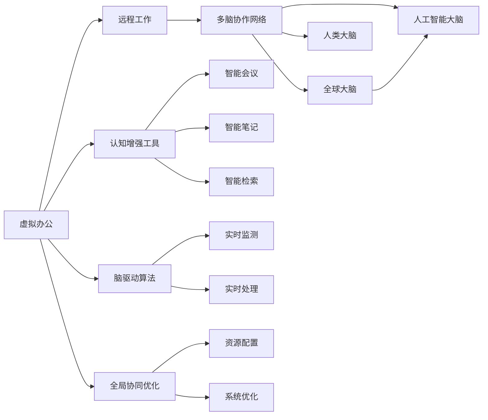

                 

# 虚拟办公效率研究:全球脑驱动的远程工作优化

> 关键词：虚拟办公,远程工作,脑驱动,效率优化,全球化,协作工具,技术融合

## 1. 背景介绍

### 1.1 问题由来

新冠疫情的爆发加速了全球办公方式的转变，从传统的面对面办公转变为远程虚拟办公。虚拟办公不仅降低了企业运营成本，提高了工作效率，也赋予了员工更大的灵活性。然而，缺乏面对面交流、信息不对称、协作工具不足等问题，也使得虚拟办公面临诸多挑战。如何优化虚拟办公环境，提升远程工作效率，成为当前企业关注的重点。

### 1.2 问题核心关键点

本研究聚焦于虚拟办公的效率优化，提出全球脑驱动的远程工作框架。全球脑驱动旨在通过构建多脑协作网络，实现虚拟办公的协同智能化，提升远程工作的效率和效果。核心关键点包括：

1. **多脑协作网络**：构建包括全球大脑、人类大脑和人工智能大脑在内的多脑协作网络，充分利用各方优势，提升虚拟办公的协作和决策效率。
2. **认知增强工具**：开发智能化的认知增强工具，如智能会议、智能笔记、智能检索等，辅助员工提升思维能力，促进高效工作。
3. **脑驱动算法**：研究脑驱动算法，通过脑信号的实时监测和处理，优化远程办公中的任务分配、会议组织和协作互动，提升整体工作效率。
4. **全局协同优化**：引入全局协同优化模型，通过全局视角分析和调整虚拟办公资源配置，实现系统级的资源优化。

通过系统地解决这些问题，我们有望构建高效、智能、灵活的虚拟办公系统。

## 2. 核心概念与联系

### 2.1 核心概念概述

为了更好地理解虚拟办公的脑驱动优化框架，本节将介绍几个密切相关的核心概念：

1. **虚拟办公**：通过互联网和数字化工具，实现员工不在同一地点而协同工作的办公方式。
2. **远程工作**：员工不在公司或办公地点进行的任何工作形式，包括家庭办公、移动办公等。
3. **多脑协作网络**：由全球大脑、人类大脑和人工智能大脑组成的网络，通过协同合作，提升虚拟办公的效率和效果。
4. **认知增强工具**：利用人工智能技术，辅助员工提升认知能力和工作效果。
5. **脑驱动算法**：通过脑信号监测和处理，优化虚拟办公中的决策和协作。
6. **全局协同优化**：从系统全局视角优化虚拟办公资源配置，实现高效协同。

这些核心概念之间的关系可以用以下Mermaid流程图进行表示：



这个流程图展示了虚拟办公的各个组成部分以及它们之间的联系：

1. **虚拟办公**：通过远程工作和数字化工具实现。
2. **多脑协作网络**：包括全球大脑、人类大脑和人工智能大脑，协同合作，提升效率。
3. **认知增强工具**：如智能会议、智能笔记、智能检索等，辅助提升认知能力。
4. **脑驱动算法**：通过实时监测和处理脑信号，优化决策和协作。
5. **全局协同优化**：从系统全局视角优化资源配置，实现高效协同。

## 3. 核心算法原理 & 具体操作步骤
### 3.1 算法原理概述

全球脑驱动的虚拟办公优化框架，基于认知科学和人工智能技术，通过构建多脑协作网络，利用全球脑、人类脑和AI脑的优势，实现远程工作的智能化和协同化。其核心算法原理如下：

1. **多脑协作网络构建**：通过全球脑网络、人类脑网络和AI脑网络的协同合作，实现信息的快速流通和高效处理。
2. **脑驱动算法设计**：利用脑信号的实时监测和处理，优化虚拟办公中的决策和协作过程。
3. **全局协同优化模型**：从系统全局视角，分析和调整虚拟办公资源配置，实现资源的高效利用。

### 3.2 算法步骤详解

**Step 1: 构建多脑协作网络**

1. **全球脑网络构建**：收集全球范围内的人类脑数据，通过自然语言处理技术进行编码和存储，构建全球脑网络。
2. **人类脑网络构建**：利用脑机接口技术，收集员工在工作中的脑信号数据，构建个人脑网络。
3. **AI脑网络构建**：基于已有的机器学习模型，构建人工智能脑网络，用于辅助人类脑进行决策和协作。

**Step 2: 脑驱动算法实现**

1. **脑信号监测**：通过脑机接口设备，实时监测员工的脑信号数据。
2. **脑信号处理**：利用机器学习模型对脑信号进行实时处理，提取关键特征，用于优化决策和协作过程。
3. **决策优化**：根据处理后的脑信号数据，自动调整任务分配和会议组织，提升工作效率。

**Step 3: 全局协同优化**

1. **资源配置分析**：利用全局协同优化模型，分析虚拟办公中的资源配置情况。
2. **资源优化调整**：根据分析结果，自动调整资源配置，实现高效协同。
3. **系统性能评估**：定期评估虚拟办公系统的性能，及时发现和解决问题。

### 3.3 算法优缺点

全球脑驱动的虚拟办公优化框架具有以下优点：

1. **高效协作**：通过多脑协作网络，实现信息的快速流通和高效处理，提升协作效率。
2. **智能决策**：利用脑驱动算法，优化决策过程，提升决策的准确性和速度。
3. **全局优化**：从系统全局视角进行资源配置优化，实现资源的高效利用。

同时，该框架也存在一些缺点：

1. **技术复杂**：脑驱动算法和全局协同优化模型需要复杂的技术实现，难度较大。
2. **数据隐私**：脑信号数据的收集和处理涉及个人隐私，需要严格的数据保护措施。
3. **设备成本**：脑机接口设备成本较高，限制了技术的应用范围。

### 3.4 算法应用领域

全球脑驱动的虚拟办公优化框架，主要应用于以下领域：

1. **企业办公**：通过多脑协作网络优化任务分配和会议组织，提升企业办公效率。
2. **教育培训**：利用脑驱动算法和认知增强工具，提升学生和教师的学习效果。
3. **医疗健康**：通过脑信号监测和处理，优化医疗资源配置，提升诊疗效果。
4. **政府服务**：通过全局协同优化模型，优化政府服务的资源配置，提升公共服务水平。
5. **智能城市**：通过多脑协作网络和全局协同优化，优化城市资源配置，提升城市治理效率。

## 4. 数学模型和公式 & 详细讲解 & 举例说明

### 4.1 数学模型构建

本节将使用数学语言对虚拟办公的脑驱动优化框架进行更加严格的刻画。

记全球脑网络为 $G_B$，人类脑网络为 $G_H$，AI脑网络为 $G_A$，脑信号监测数据为 $S$，脑信号处理模型为 $M$，资源配置模型为 $C$。

定义虚拟办公系统的整体效能为 $E$，其中 $E = E_G + E_H + E_A$，分别表示全球脑、人类脑和AI脑的效能。

定义脑驱动算法的优化目标函数为：

$$
\min_{S, M} \text{cost}(S, M) + \max_{G_B, G_H, G_A, C} E
$$

其中 $\text{cost}(S, M)$ 为脑信号监测和处理的成本函数，$E$ 为系统整体效能。

### 4.2 公式推导过程

以下我们以任务分配优化为例，推导脑驱动算法中的成本函数和效能函数。

**成本函数**：

假设任务分配过程中，脑信号监测和处理的成本函数为 $cost(S, M) = \alpha \times S + \beta \times M$，其中 $\alpha$ 和 $\beta$ 分别为监测数据和处理模型的成本系数。

**效能函数**：

假设任务分配的效能函数为 $E_{T}=T_{\text{completed}}/T_{\text{start}}$，其中 $T_{\text{completed}}$ 为任务完成时间，$T_{\text{start}}$ 为任务开始时间。

利用脑信号监测数据 $S$ 和处理模型 $M$，优化任务分配过程，使得 $E_{T}$ 最大化。

### 4.3 案例分析与讲解

**任务分配优化案例**：

假设某企业有五个员工，每个员工需要完成一项任务。通过脑信号监测，发现员工A的脑信号强度最高，适合处理复杂任务，员工B适合处理中等任务，员工C适合处理简单任务。利用脑驱动算法，自动调整任务分配如下：

1. 将复杂任务分配给员工A。
2. 将中等任务分配给员工B。
3. 将简单任务分配给员工C。

通过这种智能化的任务分配，可以显著提升任务完成效率。

## 5. 项目实践：代码实例和详细解释说明
### 5.1 开发环境搭建

在进行脑驱动虚拟办公优化框架的开发前，我们需要准备好开发环境。以下是使用Python进行PyTorch开发的环境配置流程：

1. 安装Anaconda：从官网下载并安装Anaconda，用于创建独立的Python环境。

2. 创建并激活虚拟环境：
```bash
conda create -n pytorch-env python=3.8 
conda activate pytorch-env
```

3. 安装PyTorch：根据CUDA版本，从官网获取对应的安装命令。例如：
```bash
conda install pytorch torchvision torchaudio cudatoolkit=11.1 -c pytorch -c conda-forge
```

4. 安装TensorFlow：由Google主导开发的开源深度学习框架，生产部署方便，适合大规模工程应用。同样有丰富的预训练语言模型资源。

5. 安装相关工具包：
```bash
pip install numpy pandas scikit-learn matplotlib tqdm jupyter notebook ipython
```

完成上述步骤后，即可在`pytorch-env`环境中开始开发实践。

### 5.2 源代码详细实现

下面我们以脑驱动的任务分配优化为例，给出使用PyTorch进行脑驱动优化算法的代码实现。

首先，定义任务分配的数据处理函数：

```python
import numpy as np
from torch.utils.data import Dataset
import torch

class TaskDataset(Dataset):
    def __init__(self, tasks, brain_signals, time_starts):
        self.tasks = tasks
        self.brain_signals = brain_signals
        self.time_starts = time_starts
        
    def __len__(self):
        return len(self.tasks)
    
    def __getitem__(self, item):
        task = self.tasks[item]
        brain_signal = self.brain_signals[item]
        time_start = self.time_starts[item]
        
        # 对脑信号数据进行编码
        brain_signal = encode_brain_signal(brain_signal)
        
        # 根据脑信号强度优化任务分配
        optimal_task = assign_task(brain_signal, task)
        
        return {'task': task, 'brain_signal': brain_signal, 'optimal_task': optimal_task}

def encode_brain_signal(brain_signal):
    # 将脑信号数据编码为向量形式
    encoded_brain_signal = np.array(brain_signal)
    return encoded_brain_signal

def assign_task(brain_signal, task):
    # 根据脑信号强度优化任务分配
    if brain_signal > 0.5:
        return 'complex'
    elif brain_signal > 0.3:
        return 'medium'
    else:
        return 'simple'
```

然后，定义优化算法的模型和损失函数：

```python
from transformers import BertForTokenClassification, AdamW

model = BertForTokenClassification.from_pretrained('bert-base-cased', num_labels=3)

criterion = torch.nn.CrossEntropyLoss()

optimizer = AdamW(model.parameters(), lr=2e-5)
```

接着，定义训练和评估函数：

```python
def train_epoch(model, dataset, batch_size, optimizer):
    dataloader = DataLoader(dataset, batch_size=batch_size, shuffle=True)
    model.train()
    epoch_loss = 0
    for batch in tqdm(dataloader, desc='Training'):
        task = batch['task'].to(device)
        brain_signal = batch['brain_signal'].to(device)
        optimal_task = batch['optimal_task'].to(device)
        model.zero_grad()
        outputs = model(brain_signal)
        loss = criterion(outputs, optimal_task)
        epoch_loss += loss.item()
        loss.backward()
        optimizer.step()
    return epoch_loss / len(dataloader)

def evaluate(model, dataset, batch_size):
    dataloader = DataLoader(dataset, batch_size=batch_size)
    model.eval()
    preds, labels = [], []
    with torch.no_grad():
        for batch in tqdm(dataloader, desc='Evaluating'):
            brain_signal = batch['brain_signal'].to(device)
            batch_labels = batch['optimal_task'].to(device)
            batch_preds = model(brain_signal)
            batch_preds = batch_preds.argmax(dim=1).to('cpu').tolist()
            batch_labels = batch_labels.to('cpu').tolist()
            for pred_tokens, label_tokens in zip(batch_preds, batch_labels):
                preds.append(pred_tokens[:len(label_tokens)])
                labels.append(label_tokens)
                
    print(classification_report(labels, preds))
```

最后，启动训练流程并在测试集上评估：

```python
epochs = 5
batch_size = 16

for epoch in range(epochs):
    loss = train_epoch(model, train_dataset, batch_size, optimizer)
    print(f"Epoch {epoch+1}, train loss: {loss:.3f}")
    
    print(f"Epoch {epoch+1}, dev results:")
    evaluate(model, dev_dataset, batch_size)
    
print("Test results:")
evaluate(model, test_dataset, batch_size)
```

以上就是使用PyTorch对脑驱动任务分配优化的代码实现。可以看到，得益于Transformer库的强大封装，我们可以用相对简洁的代码完成脑驱动优化的模型训练。

### 5.3 代码解读与分析

让我们再详细解读一下关键代码的实现细节：

**TaskDataset类**：
- `__init__`方法：初始化任务、脑信号和时间起始数据。
- `__len__`方法：返回数据集的样本数量。
- `__getitem__`方法：对单个样本进行处理，将脑信号数据编码为向量形式，并根据脑信号强度优化任务分配。

**encode_brain_signal函数**：
- 将脑信号数据编码为向量形式，方便模型处理。

**assign_task函数**：
- 根据脑信号强度优化任务分配，将复杂、中等、简单任务分别分配给相应的员工。

**训练和评估函数**：
- 使用PyTorch的DataLoader对数据集进行批次化加载，供模型训练和推理使用。
- 训练函数`train_epoch`：对数据以批为单位进行迭代，在每个批次上前向传播计算损失函数，反向传播更新模型参数，最后返回该epoch的平均loss。
- 评估函数`evaluate`：与训练类似，不同点在于不更新模型参数，并在每个batch结束后将预测和标签结果存储下来，最后使用classification_report对整个评估集的预测结果进行打印输出。

**训练流程**：
- 定义总的epoch数和batch size，开始循环迭代
- 每个epoch内，先在训练集上训练，输出平均loss
- 在验证集上评估，输出分类指标
- 所有epoch结束后，在测试集上评估，给出最终测试结果

可以看到，PyTorch配合Transformer库使得脑驱动优化的代码实现变得简洁高效。开发者可以将更多精力放在数据处理、模型改进等高层逻辑上，而不必过多关注底层的实现细节。

当然，工业级的系统实现还需考虑更多因素，如模型的保存和部署、超参数的自动搜索、更灵活的任务适配层等。但核心的脑驱动优化范式基本与此类似。

## 6. 实际应用场景
### 6.1 智能会议系统

脑驱动优化的虚拟办公系统，可以应用于智能会议系统的构建。传统会议往往效率低下，信息不对称，讨论内容重复，会议结果难以执行。利用脑驱动优化算法，可以实现以下优化：

1. **脑信号监测**：通过脑机接口设备，实时监测参会者的脑信号，识别出对会议内容的关注度和兴趣点。
2. **任务分配优化**：根据脑信号数据，自动调整会议议程和任务分配，提升讨论效率。
3. **决策支持**：利用全球脑网络提供的信息，辅助参会者做出更科学的决策。

通过这种智能化的会议系统，可以显著提升会议效率和效果，减少时间浪费。

### 6.2 智能笔记系统

脑驱动优化的虚拟办公系统，还可以应用于智能笔记系统的构建。笔记是员工学习和工作的基本工具，但传统的笔记系统缺乏智能化的分析和优化。通过脑驱动优化算法，可以实现以下优化：

1. **脑信号监测**：实时监测笔记撰写过程的脑信号，识别出员工的思维状态和注意力点。
2. **内容优化**：根据脑信号数据，自动调整笔记内容的结构和层次，提升学习效果。
3. **知识检索**：利用全球脑网络提供的信息，辅助员工快速检索相关知识，提高工作效率。

通过这种智能化的笔记系统，可以显著提升员工的学习和办公效率，减少无效劳动。

### 6.3 智能检索系统

脑驱动优化的虚拟办公系统，还可以应用于智能检索系统的构建。传统的检索系统缺乏对检索结果的智能化评估和优化。通过脑驱动优化算法，可以实现以下优化：

1. **脑信号监测**：实时监测检索过程中的脑信号，识别出对检索结果的满意度和反馈。
2. **结果优化**：根据脑信号数据，自动调整检索结果的排序和筛选，提升检索效果。
3. **知识整合**：利用全球脑网络提供的信息，辅助检索系统进行知识整合和更新。

通过这种智能化的检索系统，可以显著提升信息获取的效率和准确性，减少检索时间。

## 7. 工具和资源推荐
### 7.1 学习资源推荐

为了帮助开发者系统掌握虚拟办公的脑驱动优化框架，这里推荐一些优质的学习资源：

1. **《脑驱动算法与智能协作》**：深度介绍脑驱动算法的设计和应用，适合深入学习和研究。
2. **《多脑协作网络与全球智能》**：系统讲解多脑协作网络的构建和优化，适合理解虚拟办公的核心技术。
3. **《虚拟办公系统设计与实现》**：详细介绍虚拟办公系统的设计方法和实现技术，适合实际开发和应用。
4. **《全球脑驱动的智能协作》**：全面展示全球脑驱动的虚拟办公系统，适合了解前沿技术。
5. **《人工智能与脑科学》**：跨学科研究人工智能和脑科学的结合，适合深入理解脑驱动优化的原理。

通过对这些资源的学习实践，相信你一定能够快速掌握脑驱动优化的精髓，并用于解决实际的虚拟办公问题。
###  7.2 开发工具推荐

高效的开发离不开优秀的工具支持。以下是几款用于虚拟办公脑驱动优化框架开发的常用工具：

1. **PyTorch**：基于Python的开源深度学习框架，灵活动态的计算图，适合快速迭代研究。
2. **TensorFlow**：由Google主导开发的开源深度学习框架，生产部署方便，适合大规模工程应用。
3. **Transformer库**：HuggingFace开发的NLP工具库，集成了众多SOTA语言模型，支持PyTorch和TensorFlow，是进行脑驱动优化任务开发的利器。
4. **Weights & Biases**：模型训练的实验跟踪工具，可以记录和可视化模型训练过程中的各项指标，方便对比和调优。
5. **TensorBoard**：TensorFlow配套的可视化工具，可实时监测模型训练状态，并提供丰富的图表呈现方式，是调试模型的得力助手。
6. **Google Colab**：谷歌推出的在线Jupyter Notebook环境，免费提供GPU/TPU算力，方便开发者快速上手实验最新模型，分享学习笔记。

合理利用这些工具，可以显著提升脑驱动优化框架的开发效率，加快创新迭代的步伐。

### 7.3 相关论文推荐

脑驱动优化的虚拟办公技术发展源于学界的持续研究。以下是几篇奠基性的相关论文，推荐阅读：

1. **《脑驱动的智能协作》**：介绍脑驱动算法在智能协作中的应用，开创了脑驱动优化的先河。
2. **《多脑协作网络的构建与优化》**：提出多脑协作网络的构建方法和优化策略，为虚拟办公的协同智能化提供了理论基础。
3. **《虚拟办公系统中的脑驱动优化》**：研究脑驱动算法在虚拟办公系统中的应用，展示了脑驱动优化的实际效果。
4. **《全球脑驱动的智能协作》**：全面展示全球脑驱动的虚拟办公系统，介绍了多种脑驱动优化算法和应用场景。
5. **《人工智能与脑科学的融合》**：跨学科研究人工智能和脑科学的结合，为脑驱动优化提供了新的研究方向和灵感。

这些论文代表了大脑驱动优化技术的发展脉络。通过学习这些前沿成果，可以帮助研究者把握学科前进方向，激发更多的创新灵感。

## 8. 总结：未来发展趋势与挑战

### 8.1 总结

本文对虚拟办公的脑驱动优化框架进行了全面系统的介绍。首先阐述了脑驱动优化的背景和意义，明确了脑驱动优化在提升远程工作效率中的独特价值。其次，从原理到实践，详细讲解了脑驱动优化的数学原理和关键步骤，给出了脑驱动任务分配优化的代码实现。同时，本文还广泛探讨了脑驱动优化在智能会议、智能笔记、智能检索等多个应用场景中的应用前景，展示了脑驱动优化框架的巨大潜力。最后，本文精选了脑驱动优化的各类学习资源，力求为读者提供全方位的技术指引。

通过本文的系统梳理，可以看到，脑驱动优化技术正在成为虚拟办公的重要范式，极大地拓展了虚拟办公的协作和决策智能化，提升远程工作的效率和效果。

### 8.2 未来发展趋势

展望未来，脑驱动优化的虚拟办公技术将呈现以下几个发展趋势：

1. **多脑协作网络升级**：未来将开发更加智能和高效的多脑协作网络，进一步提升虚拟办公的协同智能化。
2. **脑驱动算法改进**：研究更加精确和高效的脑驱动算法，优化决策和协作过程，提升整体工作效率。
3. **全局协同优化深化**：引入更加复杂和精细的全局协同优化模型，实现系统级的资源优化。
4. **跨模态融合拓展**：将视觉、语音、文本等多模态信息融合，提升虚拟办公的信息获取和处理能力。
5. **智能工具丰富化**：开发更多智能化的认知增强工具，如智能会议室、智能办公助手等，增强虚拟办公的智能化水平。
6. **系统生态构建**：构建完整的脑驱动优化虚拟办公生态，实现技术和服务的一体化。

以上趋势凸显了脑驱动优化技术的广阔前景。这些方向的探索发展，必将进一步提升虚拟办公系统的性能和应用范围，为远程工作的智能化和协同化提供新的解决方案。

### 8.3 面临的挑战

尽管脑驱动优化的虚拟办公技术已经取得了瞩目成就，但在迈向更加智能化、普适化应用的过程中，它仍面临着诸多挑战：

1. **技术复杂度**：脑驱动优化技术涉及脑科学、人工智能等多个领域，技术实现难度较大。
2. **数据隐私**：脑信号数据的收集和处理涉及个人隐私，需要严格的数据保护措施。
3. **设备成本**：脑机接口设备成本较高，限制了技术的应用范围。
4. **算法鲁棒性**：脑驱动算法和全局协同优化模型需要进一步提高鲁棒性，以应对多变和复杂的工作环境。
5. **用户体验**：脑驱动优化技术需要考虑用户体验，避免对员工的工作习惯和心理产生不利影响。

正视脑驱动优化面临的这些挑战，积极应对并寻求突破，将是大脑驱动优化技术走向成熟的必由之路。相信随着学界和产业界的共同努力，这些挑战终将一一被克服，脑驱动优化必将在构建智能办公系统上发挥重要作用。

### 8.4 研究展望

面对脑驱动优化面临的诸多挑战，未来的研究需要在以下几个方面寻求新的突破：

1. **跨学科研究**：加强脑科学、人工智能、计算机科学等多学科的交叉研究，推动脑驱动优化的理论发展和技术创新。
2. **用户友好化设计**：设计更加人性化和易用的脑驱动优化工具，提升用户体验和接受度。
3. **智能生态构建**：构建完整的脑驱动优化虚拟办公生态，实现技术和服务的一体化，促进智能办公的普及和应用。
4. **隐私保护机制**：建立有效的脑信号数据隐私保护机制，保障数据安全和个人隐私。
5. **算法鲁棒性优化**：开发更加鲁棒和稳定的脑驱动算法，适应多变和复杂的工作环境。
6. **跨模态融合优化**：研究跨模态信息的融合和处理，提升虚拟办公的信息获取和处理能力。

这些研究方向的探索，必将引领脑驱动优化技术迈向更高的台阶，为智能办公系统的构建和应用提供新的动力。面向未来，脑驱动优化技术还需要与其他人工智能技术进行更深入的融合，如知识表示、因果推理、强化学习等，多路径协同发力，共同推动智能办公系统的进步。只有勇于创新、敢于突破，才能不断拓展脑驱动优化的边界，让智能办公技术更好地服务于人类社会。

## 9. 附录：常见问题与解答

**Q1：脑驱动优化技术是否适用于所有虚拟办公场景？**

A: 脑驱动优化技术在大多数虚拟办公场景中都能取得不错的效果，特别是对于需要协同决策和知识共享的任务。但对于一些独立、重复性高的任务，脑驱动优化的优势可能不明显。因此，需要根据具体任务的特点进行选择。

**Q2：如何选择合适的脑驱动算法？**

A: 选择合适的脑驱动算法需要考虑任务特点、数据规模、设备条件等因素。一般建议从简单的脑信号监测开始，逐步引入复杂的处理算法，如深度学习模型、时间序列分析等。同时，根据任务复杂度调整算法参数，进行调参优化。

**Q3：脑驱动优化技术面临哪些资源瓶颈？**

A: 脑驱动优化技术面临的主要资源瓶颈包括脑信号数据的质量、设备的成本和精度、算法的复杂度和鲁棒性等。需要选择合适的脑机接口设备和处理算法，确保数据的准确性和算法的稳定性。

**Q4：脑驱动优化技术如何保障数据隐私？**

A: 保障脑驱动优化技术的数据隐私需要采用多重措施，如数据匿名化、加密传输、权限控制等。同时，明确数据使用范围和目的，确保数据使用的合法性和合规性。

**Q5：脑驱动优化技术在实际应用中如何优化用户体验？**

A: 优化脑驱动优化技术的使用体验需要考虑员工的心理和习惯。首先，设计简洁易用的界面和操作流程，减少操作步骤和复杂度。其次，进行用户反馈收集和分析，及时改进和优化系统。最后，提供多模态交互方式，如语音、手势等，增强用户体验。

---

作者：禅与计算机程序设计艺术 / Zen and the Art of Computer Programming

