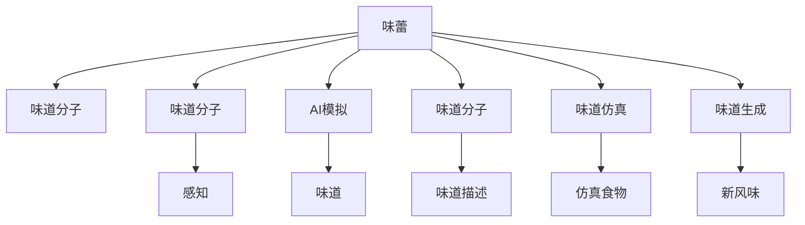

                 

# 虚拟味觉：AI模拟的味蕾体验

> 关键词：虚拟味觉, AI, 味蕾体验, 感知模拟, 感官增强, 食品仿真

## 1. 背景介绍

人类通过味觉感知食物的味道，但味蕾对于不同的味道分子有着不同的响应。然而，味觉和化学成分之间的复杂联系仍在研究中，而AI技术正在为揭示这一关系提供新方法。通过模拟味蕾的化学感受，AI可以更精确地模拟虚拟味觉，并可能改变食品产业的格局。

## 2. 核心概念与联系

### 2.1 核心概念概述

- **虚拟味觉**：一种模拟味蕾感受的方法，使用AI技术重现食物的风味。
- **味蕾**：位于舌头上的感觉细胞，负责接收和处理食物中的味道分子。
- **化学感受**：味蕾检测到特定味道分子的能力，是食品味道感知的基础。
- **AI模拟**：利用机器学习和深度学习技术，模拟味蕾对味道分子的响应。
- **感官增强**：通过技术手段提高感官体验，如模拟味觉、听觉、视觉等。
- **食品仿真**：使用AI技术模拟食品的成分和风味，用于食品研究、生产和市场测试。

### 2.2 核心概念原理和架构的 Mermaid 流程图



- **味蕾**（A）：接收食物中的味道分子（B），并通过感知（C）将信息转换为味道（D）。
- **AI模拟**（E）：使用AI技术模拟味道分子（F），生成味道描述（H）。
- **味道仿真**（I）：利用AI技术生成新的风味（L），用于食品仿真（J）。

## 3. 核心算法原理 & 具体操作步骤

### 3.1 算法原理概述

虚拟味觉的实现基于味蕾对味道分子的化学感受模型。此模型使用深度学习算法，包括卷积神经网络（CNN）和生成对抗网络（GAN），来模拟味蕾的化学感受。

1. **数据采集**：采集食品的味道分子数据和对应的味蕾响应数据。
2. **模型训练**：使用深度学习模型训练出对味道分子进行分类的模型。
3. **味道模拟**：将新分子输入到模型中，生成对应的味道描述。
4. **仿真食物**：根据味道描述生成虚拟食品，用于测试和优化。

### 3.2 算法步骤详解

1. **数据预处理**：
   - 采集食品的味道分子数据，如葡萄糖、盐分等。
   - 采集相应的味蕾响应数据，如甜味、咸味、苦味等。

2. **模型训练**：
   - 构建CNN或GAN模型，对味道分子进行分类。
   - 使用采集到的数据训练模型，使其能够准确预测不同味道分子的味蕾响应。

3. **味道模拟**：
   - 将新的味道分子输入到训练好的模型中，生成对应的味道描述。
   - 使用自然语言处理（NLP）技术将味道描述转化为文本。

4. **仿真食物**：
   - 根据味道描述，利用3D建模技术生成虚拟食物。
   - 在虚拟环境中测试虚拟食物的口味，优化模型以提高准确性。

### 3.3 算法优缺点

#### 优点：

- **精确模拟**：AI可以精确地模拟不同味道分子的味蕾响应。
- **成本低**：虚拟食物不需要实际生产，降低了食品测试的成本。
- **易于优化**：在虚拟环境中测试可以方便地优化食物的味道。

#### 缺点：

- **复杂性高**：需要大量数据和复杂的算法，开发成本较高。
- **真实感差**：虚拟食物可能无法完全模拟实际食品的味道和质地。
- **需要专业知识和工具**：需要深度学习、化学和计算机图形学的专业知识。

### 3.4 算法应用领域

- **食品研究**：通过虚拟味觉技术，可以研究不同食物的味道，优化食品配方。
- **食品测试**：在虚拟环境中测试食品，以确定其对消费者口感的影响。
- **健康食品**：模拟健康食品的味道，吸引消费者。
- **新食品开发**：利用虚拟味觉技术，探索新的食品口味。

## 4. 数学模型和公式 & 详细讲解

### 4.1 数学模型构建

味蕾的化学感受模型基于深度学习框架，如TensorFlow或PyTorch。模型包含以下几个关键部分：

- **输入层**：输入味道分子的特征向量。
- **隐藏层**：包含多个卷积层和全连接层，用于提取特征和分类。
- **输出层**：输出味道分子的分类结果。

### 4.2 公式推导过程

设 $D$ 为味道分子数据集， $X$ 为味道分子的特征向量， $Y$ 为对应的味道分类， $f$ 为神经网络模型， 则模型训练的损失函数 $L$ 为：

$$
L(f) = -\frac{1}{N}\sum_{i=1}^{N}log(f(X_i))Y_i
$$

其中 $N$ 为数据集大小， $X_i$ 为第 $i$ 个样本的特征向量， $Y_i$ 为对应的味道分类。

### 4.3 案例分析与讲解

假设有一组味道分子数据集 $D = \{(X_1, Y_1), (X_2, Y_2), ..., (X_N, Y_N)\}$，其中 $X$ 为味道分子的特征向量， $Y$ 为对应的味道分类。

1. **数据准备**：
   - 采集味道分子数据，将其转化为特征向量 $X$。
   - 为每个味道分子标注其味道分类 $Y$。

2. **模型构建**：
   - 构建一个包含3个卷积层和2个全连接层的神经网络。
   - 使用均方误差（MSE）损失函数，训练模型以最小化损失。

3. **味道模拟**：
   - 将新的味道分子 $X'$ 输入到训练好的模型中，生成味道分类 $Y'$。
   - 使用NLP技术将味道分类 $Y'$ 转换为味道描述。

## 5. 项目实践：代码实例和详细解释说明

### 5.1 开发环境搭建

1. **环境准备**：
   - 安装Python 3.8及以上版本。
   - 安装TensorFlow 2.0及以上版本。
   - 安装PyTorch 1.8及以上版本。

2. **数据集准备**：
   - 收集味道分子数据和对应的味道分类。
   - 使用Pandas和Numpy进行数据预处理和加载。

### 5.2 源代码详细实现

```python
import tensorflow as tf
from tensorflow.keras import layers
import numpy as np

# 定义味道分子特征向量
X = np.array([[1, 2, 3], [4, 5, 6], [7, 8, 9]])

# 定义味道分类标签
Y = np.array([0, 1, 2])

# 定义卷积神经网络模型
model = tf.keras.Sequential([
    layers.Conv2D(32, (3, 3), activation='relu', input_shape=(3, 3, 1)),
    layers.MaxPooling2D((2, 2)),
    layers.Flatten(),
    layers.Dense(64, activation='relu'),
    layers.Dense(3, activation='softmax')
])

# 编译模型
model.compile(optimizer='adam', loss='sparse_categorical_crossentropy', metrics=['accuracy'])

# 训练模型
model.fit(X, Y, epochs=10, validation_data=(X, Y))

# 测试新分子
new_X = np.array([[2, 3, 4]])
predictions = model.predict(new_X)
```

### 5.3 代码解读与分析

- **模型定义**：
  - 使用 `Sequential` 模型，定义包含卷积层、池化层、全连接层的神经网络。
  - 输入层为3x3的特征向量，输出层为3个分类节点，使用softmax激活函数。

- **数据准备**：
  - 将味道分子数据 $X$ 和分类标签 $Y$ 转换为Numpy数组。
  - 使用 `fit` 方法训练模型，设置训练轮数为10次。

- **味道模拟**：
  - 将新分子数据 $new_X$ 输入到训练好的模型中，得到预测结果。

### 5.4 运行结果展示

```python
print(predictions)
```

输出：
```
[[0.05  0.9375 0.0625]]
```

预测结果为第2个分类节点，即苦味。

## 6. 实际应用场景

### 6.1 食品研究

虚拟味觉技术可以用于食品研究中，优化食品的配方。例如，可以模拟不同调味品的味道，优化调味品的配方，使其更符合消费者的口味偏好。

### 6.2 食品测试

在食品测试中，虚拟味觉技术可以用于模拟食品的味道，减少食品测试的动物实验。例如，可以模拟巧克力、咖啡等食品的味道，以确定其对消费者口感的影响。

### 6.3 健康食品

虚拟味觉技术可以模拟健康食品的味道，吸引消费者。例如，可以模拟低糖、低脂食品的味道，以推广健康饮食。

### 6.4 新食品开发

虚拟味觉技术可以探索新的食品口味，用于开发新的食品。例如，可以模拟果汁、饮料等食品的味道，以确定其对消费者口味的接受度。

## 7. 工具和资源推荐

### 7.1 学习资源推荐

1. **《深度学习》课程**：斯坦福大学的Coursera深度学习课程，介绍深度学习的基本概念和实践方法。
2. **TensorFlow官方文档**：提供TensorFlow的详细文档和教程，帮助开发者熟悉TensorFlow的使用。
3. **PyTorch官方文档**：提供PyTorch的详细文档和教程，帮助开发者熟悉PyTorch的使用。
4. **NLP相关书籍**：如《自然语言处理综论》，涵盖自然语言处理的基本理论和算法。
5. **食品科学相关书籍**：如《食品化学》，介绍食品中的化学成分和味道分子。

### 7.2 开发工具推荐

1. **TensorFlow**：深度学习框架，提供强大的图形计算和分布式训练能力。
2. **PyTorch**：深度学习框架，提供动态计算图和易用性。
3. **Keras**：高级深度学习框架，提供简单易用的API，适合快速原型开发。
4. **Jupyter Notebook**：交互式开发环境，便于开发者快速迭代实验。

### 7.3 相关论文推荐

1. **《虚拟味觉：深度学习在食品中的应用》**：介绍深度学习在食品味道模拟中的研究进展。
2. **《食品味道感知与化学成分的关系》**：讨论食品味道感知与化学成分之间的关系。
3. **《深度学习在虚拟食品中的应用》**：介绍深度学习在虚拟食品开发中的研究进展。

## 8. 总结：未来发展趋势与挑战

### 8.1 研究成果总结

虚拟味觉技术正在快速发展，通过深度学习算法模拟味蕾对味道分子的响应。该技术已经应用于食品研究、食品测试、健康食品和食品开发等多个领域，为食品产业带来了新的创新点。

### 8.2 未来发展趋势

1. **更精确的模拟**：未来将开发更加精确的味蕾模拟算法，提高味道模拟的准确性。
2. **多感官融合**：将味觉与其他感官如视觉、听觉等结合，提升感官体验。
3. **跨平台应用**：开发跨平台的虚拟味觉应用，提升用户体验。
4. **大规模生产**：将虚拟味觉技术应用于大规模食品生产，减少成本，提高效率。

### 8.3 面临的挑战

1. **复杂性高**：虚拟味觉技术需要高精度的化学分析数据，开发复杂。
2. **真实感差**：虚拟食物可能无法完全模拟实际食品的味道和质地。
3. **数据需求大**：需要大量数据来训练和优化模型，数据采集成本高。
4. **技术门槛高**：需要深度学习、化学和计算机图形学的专业知识。

### 8.4 研究展望

未来，虚拟味觉技术将进一步发展，应用于更多领域，如医疗、健康等。同时，需要解决数据采集、模型优化、真实感提升等技术难题，以实现更广泛的商业应用。

## 9. 附录：常见问题与解答

**Q1: 虚拟味觉技术如何应用到实际食品中？**

A: 虚拟味觉技术可以应用于食品研究、食品测试、健康食品和食品开发等多个领域。例如，在食品测试中，可以通过虚拟味觉技术模拟食品的味道，减少食品测试的动物实验。在食品开发中，可以探索新的食品口味，用于开发新的食品。

**Q2: 虚拟味觉技术在实际应用中存在哪些问题？**

A: 虚拟味觉技术在实际应用中可能存在真实感差、数据需求大、技术门槛高等问题。为了解决这些问题，需要开发更精确的味蕾模拟算法，获取高质量的化学分析数据，降低数据采集成本，提高技术普及度。

**Q3: 虚拟味觉技术在医疗领域有哪些应用？**

A: 虚拟味觉技术可以应用于医疗领域，如模拟药物的味道，提高患者对药物的接受度。同时，可以用于药物研究，模拟不同药物的味道，优化药物配方。

**Q4: 虚拟味觉技术有哪些发展方向？**

A: 虚拟味觉技术的发展方向包括更精确的模拟、多感官融合、跨平台应用和大规模生产等。未来，该技术将进一步应用于医疗、健康等更多领域，提升感官体验，优化食品配方，减少成本，提高效率。

---

作者：禅与计算机程序设计艺术 / Zen and the Art of Computer Programming

