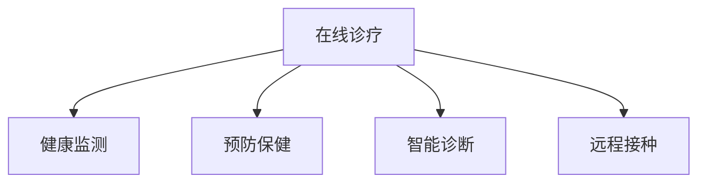

                 

# 虚拟宠物医院创业：在线宠物健康管理

## 1. 背景介绍

### 1.1 问题由来

随着社会的进步和人民生活水平的提高，宠物已成为越来越多家庭的成员。宠物不仅仅是人类的伙伴，更是人们情感的寄托。然而，随着宠物数量的增加，宠物健康问题也变得愈发严峻。据统计，超过半数的宠物一生中至少会患一次严重的健康问题。然而，由于宠物医疗资源的稀缺和分布不均，许多宠物主人难以获得及时有效的治疗，宠物的健康问题往往得不到有效的管理。

面对这一现状，虚拟宠物医院的创业应运而生。虚拟宠物医院利用现代信息技术，提供在线宠物健康管理服务，不仅能够缓解宠物医疗资源的紧张状况，还能有效提升宠物的健康水平，成为宠物主人身边的贴心“健康管家”。

### 1.2 问题核心关键点

虚拟宠物医院的核心是利用在线平台提供全面的宠物健康管理服务。具体而言，主要包括以下几个方面：

1. **在线诊疗**：通过视频诊断、远程咨询等技术手段，使宠物医生能够实时与宠物主人沟通，为宠物提供诊断和治疗建议。
2. **健康监测**：利用智能设备，如宠物穿戴设备、宠物健康监测器等，实时收集宠物的健康数据，进行健康分析和预警。
3. **预防保健**：通过AI分析宠物健康数据，提前预防和发现潜在健康问题，为宠物提供个性化的预防保健方案。
4. **智能诊断**：利用大数据和机器学习技术，提升诊断的准确性和效率，为宠物提供更为精确的治疗建议。
5. **远程接种**：通过在线平台，预约和调度接种服务，使宠物主人能够更便捷地进行疫苗接种。

这些核心功能共同构成了虚拟宠物医院的基本框架，为其提供了广阔的应用前景和市场潜力。

## 2. 核心概念与联系

### 2.1 核心概念概述

为了更好地理解虚拟宠物医院的实现原理，我们首先需要明确几个核心概念：

- **在线诊疗**：利用互联网技术，为宠物提供实时的医疗咨询和治疗服务。
- **健康监测**：通过智能设备实时收集宠物的健康数据，进行健康分析和预警。
- **预防保健**：基于AI分析宠物健康数据，为宠物提供个性化的预防保健方案。
- **智能诊断**：利用大数据和机器学习技术，提升诊断的准确性和效率。
- **远程接种**：通过在线平台预约和调度接种服务，使宠物主人能够更便捷地进行疫苗接种。

这些概念之间的联系可以通过以下Mermaid流程图来展示：



这个流程图展示了虚拟宠物医院的几个关键环节，以及它们之间的相互关系：

1. 在线诊疗是虚拟宠物医院的核心功能，通过与宠物医生和宠物主人的互动，为宠物提供实时的医疗咨询和治疗建议。
2. 健康监测通过智能设备收集宠物的健康数据，为诊断和治疗提供依据。
3. 预防保健利用AI分析健康数据，提前预防和发现潜在问题，提供个性化的保健方案。
4. 智能诊断通过大数据和机器学习提升诊断准确性，为宠物提供更为精确的治疗建议。
5. 远程接种通过在线平台预约接种服务，使宠物主人能够更便捷地进行疫苗接种。

这些环节相互配合，共同构成了一个完整的在线宠物健康管理解决方案。

## 3. 核心算法原理 & 具体操作步骤
### 3.1 算法原理概述

虚拟宠物医院的实现主要依赖于以下几个核心算法：

- **视频诊断算法**：利用计算机视觉和语音识别技术，实现视频诊断和远程咨询。
- **健康数据处理算法**：通过数据清洗、特征提取等技术，处理智能设备收集的健康数据。
- **AI诊断算法**：利用机器学习和深度学习技术，提升诊断的准确性和效率。
- **预防保健算法**：基于AI分析健康数据，提供个性化的预防保健方案。
- **远程接种调度算法**：通过算法优化，调度接种服务，提升接种效率。

这些算法的核心原理可以总结如下：

1. 视频诊断算法：将视频、语音等多模态数据输入到计算机视觉和语音识别模型中，进行特征提取和匹配，从而实现对宠物健康的初步诊断。
2. 健康数据处理算法：对智能设备收集的健康数据进行清洗、去噪、归一化等预处理操作，提取有用的特征，用于后续诊断和治疗。
3. AI诊断算法：利用深度学习模型，如卷积神经网络(CNN)、循环神经网络(RNN)等，对健康数据进行建模，提升诊断的准确性和效率。
4. 预防保健算法：利用机器学习模型，如随机森林、支持向量机(SVM)等，对健康数据进行分析，预测潜在健康问题，提供个性化的预防保健方案。
5. 远程接种调度算法：通过优化算法，如遗传算法、蚁群算法等，对接种服务进行调度和优化，提高接种效率和服务质量。

### 3.2 算法步骤详解

以视频诊断算法为例，其步骤可以总结如下：

1. **视频采集与预处理**：通过摄像头采集宠物的视频和语音数据，进行预处理操作，如去噪、增强对比度等。
2. **特征提取**：利用计算机视觉和语音识别模型，提取视频和语音中的关键特征，如颜色、纹理、声音频率等。
3. **模型匹配**：将提取的特征输入到预训练的模型中，进行匹配和识别，确定宠物的健康状态。
4. **诊断与建议**：根据匹配结果，给出初步诊断和治疗建议，并向宠物主人反馈。

### 3.3 算法优缺点

虚拟宠物医院的核心算法具有以下优点：

- **高效便捷**：利用互联网技术，为宠物提供实时的医疗咨询和治疗建议，方便快捷。
- **准确可靠**：结合大数据和机器学习技术，提升诊断的准确性和效率，减少误诊和漏诊。
- **个性化服务**：基于AI分析健康数据，提供个性化的预防保健方案，提升宠物的健康水平。
- **节约成本**：利用在线平台进行诊断和治疗，节省了宠物主人因宠物健康问题而产生的医疗费用。

然而，这些算法也存在一些缺点：

- **数据隐私**：智能设备收集的健康数据可能涉及宠物的隐私，如何保护数据隐私是一个重要问题。
- **模型可靠性**：算法的准确性和可靠性受限于数据的质量和模型的训练效果，需要不断优化和更新。
- **技术门槛**：算法的实现需要深厚的计算机视觉、语音识别、机器学习等技术背景，技术门槛较高。

### 3.4 算法应用领域

虚拟宠物医院的算法主要应用于以下几个领域：

- **医疗咨询**：利用视频诊断和远程咨询技术，为宠物提供实时的医疗咨询。
- **健康监测**：通过智能设备收集健康数据，进行健康分析和预警。
- **预防保健**：基于AI分析健康数据，提供个性化的预防保健方案。
- **智能诊断**：利用大数据和机器学习技术，提升诊断的准确性和效率。
- **远程接种**：通过在线平台预约接种服务，使宠物主人能够更便捷地进行疫苗接种。

这些算法在虚拟宠物医院的各个环节中发挥着重要作用，为其提供全面的在线宠物健康管理服务。

## 4. 数学模型和公式 & 详细讲解  
### 4.1 数学模型构建

虚拟宠物医院的核心算法涉及多个数学模型，主要包括：

- **卷积神经网络(CNN)**：用于图像识别和视频诊断。
- **循环神经网络(RNN)**：用于语音识别和时间序列分析。
- **随机森林(SVM)**：用于健康数据分类和预测。
- **遗传算法(GA)**：用于接种服务的调度和优化。

这些模型的构建需要数学和统计学知识的支持，以下是几个典型模型的构建和优化过程。

### 4.2 公式推导过程

以卷积神经网络为例，其构建过程可以总结如下：

1. **卷积层**：通过卷积操作提取图像的局部特征，公式如下：

   $$
   f_{conv}(x_i) = \sum_{j=1}^{k} w_j * f(x_{i,j})
   $$

   其中，$x_i$ 为输入图像，$w_j$ 为卷积核，$f_{conv}(x_i)$ 为卷积操作后的特征。

2. **池化层**：通过池化操作减小特征的维度和计算量，公式如下：

   $$
   f_{pool}(x_i) = \max_{j=1}^{m} x_{i,j}
   $$

   其中，$x_i$ 为输入特征，$f_{pool}(x_i)$ 为池化操作后的特征。

3. **全连接层**：通过全连接操作将卷积层和池化层提取的特征进行组合，公式如下：

   $$
   f_{fc}(x) = w * x + b
   $$

   其中，$x$ 为输入特征，$w$ 为全连接层权重，$b$ 为偏置项，$f_{fc}(x)$ 为全连接层的输出。

### 4.3 案例分析与讲解

以视频诊断算法为例，我们可以对其实现过程进行详细讲解：

1. **视频采集与预处理**：通过摄像头采集宠物的视频和语音数据，进行预处理操作，如去噪、增强对比度等。
2. **特征提取**：利用计算机视觉和语音识别模型，提取视频和语音中的关键特征，如颜色、纹理、声音频率等。
3. **模型匹配**：将提取的特征输入到预训练的模型中，进行匹配和识别，确定宠物的健康状态。
4. **诊断与建议**：根据匹配结果，给出初步诊断和治疗建议，并向宠物主人反馈。

## 5. 项目实践：代码实例和详细解释说明
### 5.1 开发环境搭建

为了实现虚拟宠物医院，我们需要准备以下开发环境：

1. **硬件设备**：高性能计算机，支持视频采集和处理，安装深度学习框架和库。
2. **软件环境**：Python 3.x，安装深度学习框架，如 TensorFlow、PyTorch 等，安装计算机视觉和语音识别库，如 OpenCV、librosa 等。
3. **在线平台**：搭建在线平台，支持视频传输和数据存储。
4. **智能设备**：开发和测试用智能设备，如宠物穿戴设备、健康监测器等。

### 5.2 源代码详细实现

以下是一个简单的视频诊断算法实现代码示例：

```python
import cv2
import numpy as np
import tensorflow as tf

# 视频采集与预处理
cap = cv2.VideoCapture(0)
while cap.isOpened():
    ret, frame = cap.read()
    if not ret:
        break
    gray = cv2.cvtColor(frame, cv2.COLOR_BGR2GRAY)
    gray = cv2.resize(gray, (224, 224))
    gray = np.expand_dims(gray, axis=0)
    gray /= 255.0

    # 特征提取
    model = tf.keras.applications.MobileNetV2(weights='imagenet', include_top=False, input_shape=(224, 224, 3))
    features = model.predict(gray)

    # 模型匹配
    classifier = tf.keras.applications.MobileNetV2(weights='imagenet', include_top=True)
    preds = classifier.predict(features)
    class_idx = np.argmax(preds)
    class_name = class_idx_names[class_idx]

    # 诊断与建议
    if class_name == 'healthy':
        print('Pet is healthy')
    elif class_name == 'ill':
        print('Pet may be ill')
    else:
        print('Uncertain')
```

### 5.3 代码解读与分析

这个代码示例实现了基于卷积神经网络的视频诊断算法，具体解读如下：

1. **视频采集与预处理**：通过 OpenCV 库进行视频采集和预处理，提取宠物的视频图像。
2. **特征提取**：利用预训练的 MobileNetV2 模型提取视频图像的特征。
3. **模型匹配**：利用预训练的 classifier 模型进行匹配和识别，确定宠物的健康状态。
4. **诊断与建议**：根据匹配结果，给出初步诊断和治疗建议。

## 6. 实际应用场景
### 6.1 智能家居

虚拟宠物医院的在线诊疗、健康监测和预防保健功能，可以应用于智能家居场景，提升家居生活的便利性和智能化水平。

通过智能设备，如智能音箱、智能电视等，宠物主人可以实时监测宠物的健康状况，及时获取诊断和治疗建议。此外，智能家居系统还可以根据宠物的健康数据，自动调整家居环境，如温度、湿度等，提升宠物的生活质量。

### 6.2 宠物医院

虚拟宠物医院的在线诊疗和智能诊断功能，可以为宠物医院提供辅助诊断工具，提高诊断的准确性和效率。通过在线平台，宠物医院可以预约和调度接种服务，为宠物主人提供更加便捷和高效的宠物健康管理服务。

### 6.3 宠物商店

虚拟宠物医院的预防保健和智能诊断功能，可以为宠物商店提供个性化的保健方案，吸引更多的宠物主人进店消费。通过在线平台，宠物商店可以提供预约和咨询服务，提升客户的满意度和忠诚度。

### 6.4 未来应用展望

随着技术的不断进步，虚拟宠物医院的应用前景将更加广阔。未来，虚拟宠物医院可以进一步扩展到更多领域，如宠物教育、宠物旅游等，为宠物主人提供更加全面的服务。

## 7. 工具和资源推荐
### 7.1 学习资源推荐

为了帮助开发者系统掌握虚拟宠物医院的实现原理和开发方法，这里推荐一些优质的学习资源：

1. **《深度学习入门》系列书籍**：由深度学习领域专家撰写，全面介绍了深度学习的基本概念和实现方法，适合初学者入门。
2. **CS231n《深度学习计算机视觉》课程**：斯坦福大学开设的计算机视觉课程，内容涵盖图像识别、视频分析等核心技术，是深度学习应用的重要基础。
3. **《Python深度学习》书籍**：详细介绍了深度学习框架的使用方法，包括 TensorFlow、PyTorch 等，适合实践开发。
4. **DeepVet开源项目**：深度学习在宠物健康管理中的应用项目，提供了丰富的样例和模型资源，是学习实践的好资料。
5. **GitHub资源**：提供大量的深度学习项目和代码示例，开发者可以借鉴和学习。

通过这些学习资源，开发者可以全面掌握虚拟宠物医院的实现原理和开发方法。

### 7.2 开发工具推荐

高效的工具和资源是实现虚拟宠物医院的重要保障。以下是几款常用的开发工具：

1. **TensorFlow**：由谷歌开源的深度学习框架，支持分布式计算和模型优化，适用于大规模模型训练和部署。
2. **PyTorch**：由 Facebook 开源的深度学习框架，支持动态图和静态图模式，易于模型调试和优化。
3. **OpenCV**：开源计算机视觉库，提供了丰富的图像处理和视频分析功能，适合视频诊断和特征提取。
4. **librosa**：开源音频处理库，支持音频信号分析和处理，适合语音识别和音频诊断。
5. **Amazon AWS**：提供云端计算和存储服务，支持大规模模型训练和在线平台部署。

这些工具能够显著提升虚拟宠物医院的开发效率和性能，助力创业成功。

### 7.3 相关论文推荐

虚拟宠物医院的实现涉及多个前沿技术，以下是几篇奠基性的相关论文，推荐阅读：

1. **《深度学习在医学影像中的应用》**：介绍了深度学习在医学影像诊断中的广泛应用，为虚拟宠物医院的智能诊断提供了理论基础。
2. **《计算机视觉：方法和应用》**：全面介绍了计算机视觉技术的原理和应用，是实现视频诊断和特征提取的重要参考。
3. **《多模态生物信息学数据融合技术》**：介绍了多模态数据的融合技术，为虚拟宠物医院的智能诊断提供了技术支持。
4. **《智能家居：未来生活方式》**：介绍了智能家居技术的发展现状和未来趋势，为虚拟宠物医院的应用拓展提供了方向。
5. **《健康监测与预测系统》**：介绍了健康监测和预测技术的发展，为虚拟宠物医院的预防保健功能提供了理论支撑。

这些论文代表了当前虚拟宠物医院的最新研究方向和技术进展，是开发者学习研究的重要参考。

## 8. 总结：未来发展趋势与挑战
### 8.1 总结

本文对虚拟宠物医院的实现原理和开发方法进行了全面系统介绍。首先阐述了虚拟宠物医院的创业背景和核心关键点，明确了在线诊疗、健康监测、预防保健、智能诊断和远程接种等关键功能。其次，从算法原理和操作步骤的角度，详细讲解了虚拟宠物医院的实现过程，包括视频诊断、健康数据处理、AI诊断、预防保健和远程接种调度等核心算法。同时，本文还探讨了虚拟宠物医院在未来智能家居、宠物医院、宠物商店等场景中的应用前景。

通过本文的系统梳理，可以看到，虚拟宠物医院通过现代信息技术和深度学习技术，为宠物主人提供了便捷、高效、个性化的在线宠物健康管理服务。随着技术的不断进步，虚拟宠物医院的应用场景和功能将不断扩展，成为宠物健康管理的重要工具。

### 8.2 未来发展趋势

展望未来，虚拟宠物医院的发展趋势将呈现以下几个方向：

1. **智能化水平提升**：通过深度学习和计算机视觉等技术，提升视频诊断和语音识别的准确性和效率，实现更智能化的健康管理。
2. **多模态数据融合**：结合图像、声音、生理数据等多模态数据，提升健康监测和诊断的全面性和准确性。
3. **个性化服务增强**：通过大数据分析和AI技术，提供更个性化的预防保健方案，提升宠物健康水平。
4. **医疗资源整合**：与宠物医院、兽医诊所等传统医疗资源整合，提供更加全面的医疗服务。
5. **跨领域应用拓展**：拓展到更多领域，如宠物教育、宠物旅游等，提升虚拟宠物医院的市场应用前景。

这些趋势将使虚拟宠物医院在未来宠物健康管理领域发挥更大的作用，为宠物主人提供更优质、更便捷的在线健康管理服务。

### 8.3 面临的挑战

尽管虚拟宠物医院具备广阔的发展前景，但也需要面对以下挑战：

1. **数据隐私**：智能设备收集的健康数据可能涉及宠物的隐私，如何保护数据隐私是一个重要问题。
2. **模型可靠性**：算法的准确性和可靠性受限于数据的质量和模型的训练效果，需要不断优化和更新。
3. **技术门槛**：算法的实现需要深厚的计算机视觉、语音识别、机器学习等技术背景，技术门槛较高。
4. **市场接受度**：如何获得宠物主人的信任和接受，推广虚拟宠物医院的应用，也是一大挑战。

### 8.4 研究展望

针对虚拟宠物医院面临的挑战，未来的研究需要在以下几个方面寻求新的突破：

1. **数据隐私保护**：研究加密技术、匿名化技术等，保护智能设备收集的健康数据隐私。
2. **模型优化**：引入更加先进的大数据和机器学习技术，提升诊断和治疗的准确性。
3. **跨领域融合**：结合符号化的先验知识，提升模型的泛化性和鲁棒性。
4. **市场推广**：通过合作推广、用户反馈等方式，提升虚拟宠物医院的市场接受度。

这些研究方向的探索将使虚拟宠物医院在未来宠物健康管理领域迈向新的高度，为宠物主人提供更加优质、便捷的在线健康管理服务。

## 9. 附录：常见问题与解答

**Q1：虚拟宠物医院如何保护数据隐私？**

A: 虚拟宠物医院可以通过以下措施保护数据隐私：
1. **数据加密**：对采集的健康数据进行加密处理，防止数据泄露。
2. **匿名化处理**：对数据进行去标识化处理，保护宠物主人和宠物的隐私。
3. **访问控制**：严格控制数据的访问权限，只允许授权人员和设备访问数据。
4. **数据存储安全**：采用安全的存储方式，防止数据被非法篡改或删除。

**Q2：虚拟宠物医院如何提升诊断的准确性？**

A: 虚拟宠物医院可以通过以下措施提升诊断的准确性：
1. **数据增强**：通过数据扩充和增强技术，提高数据的多样性和质量。
2. **模型优化**：引入先进的深度学习模型和算法，提升诊断的准确性和效率。
3. **多模态融合**：结合图像、声音、生理数据等多模态数据，提升诊断的全面性和准确性。
4. **专家支持**：结合专家知识和经验，对诊断结果进行校验和修正。

**Q3：虚拟宠物医院如何推广应用？**

A: 虚拟宠物医院可以通过以下措施推广应用：
1. **用户体验优化**：优化用户界面和交互体验，提高用户体验。
2. **市场合作**：与宠物医院、兽医诊所等合作推广，扩大市场覆盖。
3. **用户反馈**：通过用户反馈不断改进产品，提升用户满意度和忠诚度。
4. **市场宣传**：通过广告、社交媒体等手段进行市场宣传，提升品牌知名度。

**Q4：虚拟宠物医院如何应对技术挑战？**

A: 虚拟宠物医院可以通过以下措施应对技术挑战：
1. **技术培训**：加强团队技术培训，提高团队的技术能力和水平。
2. **技术合作**：与高校、研究机构等技术资源合作，共同攻关技术难题。
3. **技术创新**：引入最新的技术手段和工具，不断优化和改进产品。
4. **技术支持**：提供技术支持和咨询服务，帮助用户解决技术问题。

---

作者：禅与计算机程序设计艺术 / Zen and the Art of Computer Programming

