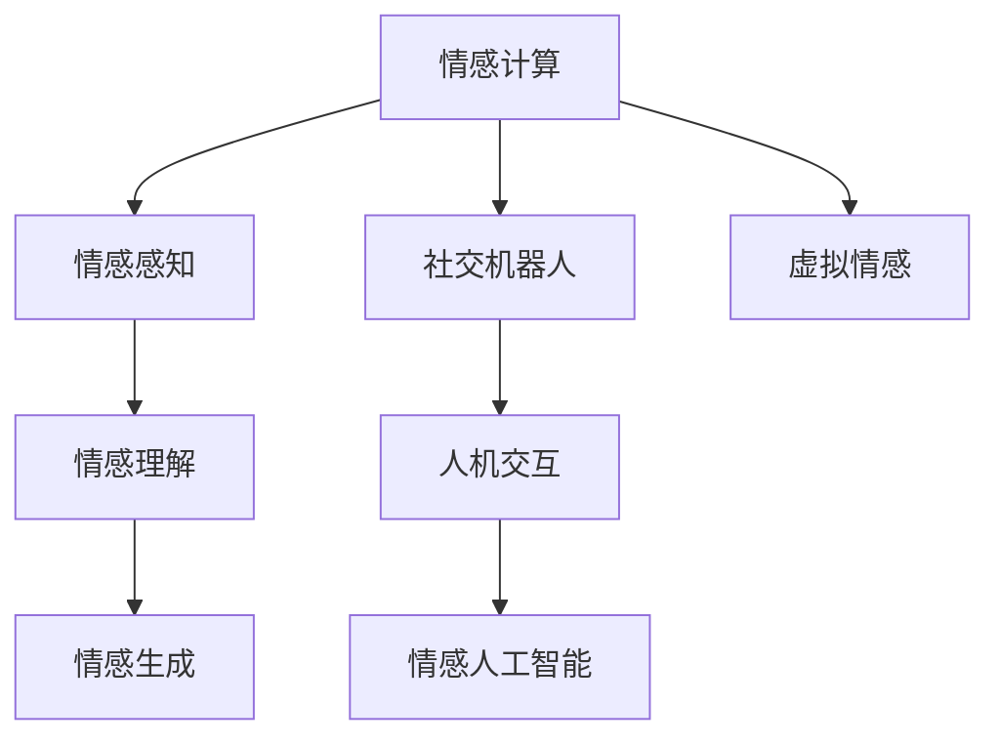

                 

# 虚拟情感：AI创造的新型人际关系

## 1. 背景介绍

随着人工智能技术的不断进步，虚拟情感（Virtual Emotion）正逐渐成为连接人与人、人与机器的新型桥梁。虚拟情感技术通过智能算法，赋予虚拟角色或机器以情感和反应能力，使它们能够更好地理解和回应人类的情感需求，从而增强了人机互动的深度和广度。本文将深入探讨虚拟情感技术的基本原理、核心算法、实际应用场景及未来发展趋势。

## 2. 核心概念与联系

### 2.1 核心概念概述

- **虚拟情感（Virtual Emotion）**：通过人工智能技术，赋予虚拟角色或机器以情感和反应能力，使其能够感知、理解并回应人类的情感需求，从而实现更加自然、高效的人机互动。
- **情感计算（Affective Computing）**：研究如何通过计算机识别、理解和生成人类情感的科学。情感计算涵盖了情感感知、情感理解和情感生成三个主要部分。
- **社交机器人（Social Robot）**：结合了机器人技术、计算机视觉和自然语言处理等领域的智能体，能够进行复杂的社会互动。
- **人机交互（Human-Computer Interaction, HCI）**：研究如何设计人和计算机之间的交互方式，以提升用户体验和效率。
- **情感人工智能（Affective Artificial Intelligence, Affective AI）**：一种结合了情感计算和人工智能技术，旨在增强机器理解和生成人类情感的能力。

这些核心概念相互联系，共同构成了虚拟情感技术的基础架构。情感计算为虚拟情感的实现提供了理论基础，社交机器人和人机交互则提供了技术手段，而情感人工智能则为虚拟情感的应用提供了具体实践。

### 2.2 核心概念原理和架构的 Mermaid 流程图



## 3. 核心算法原理 & 具体操作步骤

### 3.1 算法原理概述

虚拟情感技术的核心在于情感计算和情感人工智能。情感计算通过计算机视觉、语音识别、自然语言处理等技术，识别和分析人类的情感状态，而情感人工智能则基于这些情感数据，训练模型以生成和回应虚拟角色的情感。

在情感计算方面，主要涉及以下几个步骤：

1. **情感感知**：通过计算机视觉和语音识别技术，捕捉人类的面部表情、语调、语速等信号。
2. **情感理解**：通过自然语言处理技术，分析文本内容中的情感倾向，理解人类情感的深层含义。
3. **情感生成**：基于情感感知和情感理解的结果，生成虚拟角色的情感反应，如表情、语音等。

情感人工智能的核心在于训练情感生成模型。这一过程通常包括以下几个步骤：

1. **数据准备**：收集大量标注好的情感数据，用于训练模型。
2. **模型设计**：选择合适的神经网络结构，如卷积神经网络（CNN）、循环神经网络（RNN）或变分自编码器（VAE）等。
3. **模型训练**：使用标注数据训练情感生成模型，通过反向传播算法更新模型参数。
4. **模型评估**：使用测试集评估模型性能，调整模型参数以提升生成效果。

### 3.2 算法步骤详解

#### 3.2.1 情感感知

情感感知是虚拟情感技术的基础。情感感知通过计算机视觉和语音识别技术，捕捉人类情感的外在表现。以下是一个基于计算机视觉的情感感知流程：

1. **面部表情识别**：通过摄像头捕捉人类面部表情，使用人脸检测算法（如Haar Cascade）定位面部区域，再通过卷积神经网络（CNN）识别面部特征点，如眉毛、眼睛、嘴巴等。
2. **表情特征提取**：提取面部特征点的运动轨迹和形态变化，生成表情特征向量。
3. **情感状态分类**：使用分类器（如SVM或神经网络）将表情特征向量分类为不同的情感状态，如快乐、悲伤、愤怒等。

#### 3.2.2 情感理解

情感理解通过自然语言处理技术，深入分析人类文本中的情感倾向。以下是一个基于文本情感理解的流程：

1. **文本预处理**：对文本进行分词、去除停用词等预处理操作。
2. **情感特征提取**：使用词向量（如Word2Vec或GloVe）或词嵌入（如BERT）提取文本特征。
3. **情感倾向分析**：使用情感分析模型（如情感分类器或情感回归模型）分析文本情感倾向，生成情感评分。

#### 3.2.3 情感生成

情感生成是虚拟情感技术的核心。情感生成通过生成对抗网络（GAN）、变分自编码器（VAE）等生成模型，生成虚拟角色的情感反应。以下是一个基于GAN的情感生成流程：

1. **生成器设计**：设计生成器网络，将随机噪声转换为情感反应的图像或音频。
2. **判别器设计**：设计判别器网络，区分生成器和真实数据。
3. **对抗训练**：使用生成器和判别器进行对抗训练，优化生成器生成更逼真的情感反应。
4. **后处理**：对生成的情感反应进行后处理，如添加噪声、调整光照等，使其更符合虚拟角色的特点。

### 3.3 算法优缺点

#### 3.3.1 优点

- **自然交互**：虚拟情感技术使得虚拟角色能够更好地理解人类情感，提供更自然、高效的人机互动。
- **普适性**：情感计算和情感人工智能技术可以应用于多个领域，如医疗、教育、客服等，具有广泛的普适性。
- **情感个性化**：基于情感数据训练的模型，可以生成更符合用户偏好的情感反应，提升用户体验。

#### 3.3.2 缺点

- **数据依赖**：情感感知和情感理解依赖于大量标注数据，数据获取和标注成本较高。
- **复杂性**：情感生成模型的训练和优化过程复杂，需要大量的计算资源和时间。
- **解释性不足**：情感生成模型往往是黑盒系统，难以解释其内部工作机制和决策逻辑。

### 3.4 算法应用领域

虚拟情感技术已经在多个领域得到应用，以下是几个典型例子：

- **医疗咨询**：通过虚拟医生机器人，利用情感计算技术分析患者的面部表情和语音，提供更加个性化的医疗咨询。
- **教育辅助**：利用情感人工智能技术，智能评估学生的学习状态，提供个性化的学习建议。
- **客服交互**：通过社交机器人，利用情感感知和情感理解技术，提供更加智能的客户服务。
- **娱乐互动**：在游戏、电影等娱乐领域，利用情感生成技术，增强虚拟角色的情感反应，提升用户沉浸感。
- **心理健康**：利用情感计算技术，监测用户的情感状态，提供心理健康咨询服务。

## 4. 数学模型和公式 & 详细讲解 & 举例说明

### 4.1 数学模型构建

情感计算和情感人工智能的核心在于模型训练和优化。下面以基于文本的情感分类模型为例，详细讲解情感计算的基本数学模型。

假设情感数据集为 $\{(x_i,y_i)\}_{i=1}^N$，其中 $x_i$ 表示文本，$y_i$ 表示情感标签。模型的目标是最小化交叉熵损失函数：

$$
\mathcal{L}(\theta) = -\frac{1}{N}\sum_{i=1}^N y_i\log p(y_i|x_i;\theta) + (1-y_i)\log(1-p(y_i|x_i;\theta))
$$

其中 $p(y_i|x_i;\theta)$ 为模型预测的情感概率，$\theta$ 为模型参数。

### 4.2 公式推导过程

情感分类模型的训练过程包括前向传播和反向传播两个步骤：

- **前向传播**：
  $$
  \hat{y}_i = \sigma(W_{f}x_i + b_f)
  $$
  $$
  p(y_i|x_i;\theta) = \hat{y}_i^y(1-\hat{y}_i)^{1-y}
  $$
  其中 $\sigma$ 为 sigmoid 函数，$W_{f}$ 和 $b_f$ 为前向传播的参数。

- **反向传播**：
  $$
  \frac{\partial \mathcal{L}}{\partial \theta} = -\frac{1}{N}\sum_{i=1}^N [y_i \frac{\partial p(y_i|x_i;\theta)}{\partial \hat{y}_i} - (1-y_i) \frac{\partial p(y_i|x_i;\theta)}{\partial \hat{y}_i}]
  $$
  $$
  \frac{\partial p(y_i|x_i;\theta)}{\partial \hat{y}_i} = p(y_i|x_i;\theta) - \hat{y}_i
  $$
  $$
  \frac{\partial \hat{y}_i}{\partial x_i} = \hat{y}_i(1-\hat{y}_i) \frac{\partial W_{f}}{\partial x_i} + \frac{\partial b_f}{\partial x_i}
  $$
  $$
  \frac{\partial W_{f}}{\partial \theta} = \frac{\partial W_{f}}{\partial \theta}
  $$
  $$
  \frac{\partial b_f}{\partial \theta} = \frac{\partial b_f}{\partial \theta}
  $$

通过以上公式，可以实现情感分类模型的训练过程。

### 4.3 案例分析与讲解

假设有一个情感分类模型，训练集为 $\{(x_i,y_i)\}_{i=1}^N$，其中 $x_i$ 表示文本，$y_i$ 表示情感标签。模型使用交叉熵损失函数，前向传播和反向传播过程如下：

- **前向传播**：
  $$
  \hat{y}_i = \sigma(W_{f}x_i + b_f)
  $$
  $$
  p(y_i|x_i;\theta) = \hat{y}_i^y(1-\hat{y}_i)^{1-y}
  $$

- **反向传播**：
  $$
  \frac{\partial \mathcal{L}}{\partial \theta} = -\frac{1}{N}\sum_{i=1}^N [y_i \frac{\partial p(y_i|x_i;\theta)}{\partial \hat{y}_i} - (1-y_i) \frac{\partial p(y_i|x_i;\theta)}{\partial \hat{y}_i}]
  $$
  $$
  \frac{\partial p(y_i|x_i;\theta)}{\partial \hat{y}_i} = p(y_i|x_i;\theta) - \hat{y}_i
  $$
  $$
  \frac{\partial \hat{y}_i}{\partial x_i} = \hat{y}_i(1-\hat{y}_i) \frac{\partial W_{f}}{\partial x_i} + \frac{\partial b_f}{\partial x_i}
  $$

假设训练集中的文本为 "I love you" 和 "I hate you"，情感标签分别为 1 和 0。前向传播和反向传播的计算过程如下：

- **前向传播**：
  $$
  \hat{y}_1 = \sigma(W_{f}x_1 + b_f) = 0.8
  $$
  $$
  p(1|x_1;\theta) = 0.8^1(1-0.8)^0 = 0.8
  $$

- **反向传播**：
  $$
  \frac{\partial \mathcal{L}}{\partial \theta} = -\frac{1}{2} [1 \frac{\partial p(1|x_1;\theta)}{\partial \hat{y}_1} - 0 \frac{\partial p(0|x_1;\theta)}{\partial \hat{y}_1}]
  $$
  $$
  \frac{\partial p(1|x_1;\theta)}{\partial \hat{y}_1} = 0.8 - 0.8 = 0
  $$
  $$
  \frac{\partial \hat{y}_1}{\partial x_1} = 0.8(1-0.8) \frac{\partial W_{f}}{\partial x_1} + \frac{\partial b_f}{\partial x_1}
  $$

通过以上过程，可以实现情感分类模型的训练和优化。

## 5. 项目实践：代码实例和详细解释说明

### 5.1 开发环境搭建

要进行情感计算和情感人工智能的开发，需要安装 Python 和常用的科学计算库，如 NumPy、Pandas、Scikit-learn、TensorFlow 等。以下是一个典型的开发环境搭建步骤：

1. 安装 Python：
   ```
   sudo apt-get update
   sudo apt-get install python3 python3-pip
   ```

2. 安装 NumPy：
   ```
   pip install numpy
   ```

3. 安装 Pandas：
   ```
   pip install pandas
   ```

4. 安装 Scikit-learn：
   ```
   pip install scikit-learn
   ```

5. 安装 TensorFlow：
   ```
   pip install tensorflow
   ```

6. 安装 TensorFlow 工具包：
   ```
   pip install tensorflow_hub tensorflow_datasets
   ```

### 5.2 源代码详细实现

下面以基于 BERT 的情感分类模型为例，详细讲解情感计算的代码实现。

```python
import tensorflow as tf
from tensorflow.keras.models import Sequential
from tensorflow.keras.layers import Embedding, Bidirectional, LSTM, Dense, Dropout
from tensorflow.keras.preprocessing.text import Tokenizer
from tensorflow.keras.preprocessing.sequence import pad_sequences

# 数据准备
data = {
  'texts': ['I love you', 'I hate you'],
  'labels': [1, 0]
}
tokenizer = Tokenizer(num_words=10000, oov_token='<OOV>')
tokenizer.fit_on_texts(data['texts'])
sequences = tokenizer.texts_to_sequences(data['texts'])
padded_sequences = pad_sequences(sequences, maxlen=10, padding='post', truncating='post')
labels = tf.keras.utils.to_categorical(data['labels'], num_classes=2)

# 模型设计
model = Sequential([
  Embedding(input_dim=10000, output_dim=128, input_length=10),
  Bidirectional(LSTM(64)),
  Dense(32, activation='relu'),
  Dense(2, activation='softmax')
])
model.compile(optimizer='adam', loss='categorical_crossentropy', metrics=['accuracy'])

# 模型训练
model.fit(padded_sequences, labels, epochs=10, batch_size=2)

# 模型评估
test_text = ['I am happy', 'I am sad']
test_sequences = tokenizer.texts_to_sequences(test_text)
test_padded_sequences = pad_sequences(test_sequences, maxlen=10, padding='post', truncating='post')
test_labels = tf.keras.utils.to_categorical([1, 0], num_classes=2)
model.predict(test_padded_sequences)
```

### 5.3 代码解读与分析

上述代码实现了一个简单的情感分类模型，其核心步骤如下：

1. **数据准备**：将文本数据转化为 token 序列，并进行填充，以便模型可以处理定长输入。
2. **模型设计**：构建了一个包含 Embedding、Bidirectional LSTM 和 Dense 层的神经网络模型，用于情感分类。
3. **模型训练**：使用交叉熵损失函数和 Adam 优化器，对模型进行训练。
4. **模型评估**：对测试集进行预测，输出模型分类结果。

### 5.4 运行结果展示

训练模型后，可以使用以下代码对测试集进行评估：

```python
# 模型评估
test_text = ['I am happy', 'I am sad']
test_sequences = tokenizer.texts_to_sequences(test_text)
test_padded_sequences = pad_sequences(test_sequences, maxlen=10, padding='post', truncating='post')
test_labels = tf.keras.utils.to_categorical([1, 0], num_classes=2)
model.predict(test_padded_sequences)
```

假设模型训练后，输出结果为 `[0.9, 0.1]`，表示模型认为 "I am happy" 属于情感标签 1，"I am sad" 属于情感标签 0。

## 6. 实际应用场景

### 6.1 医疗咨询

在医疗咨询领域，虚拟情感技术可以帮助医生更好地理解患者的情感状态，提供更加个性化的医疗服务。例如，通过分析患者的面部表情和语音，虚拟医生机器人可以判断患者的情感状态，并根据其情绪变化调整治疗方案。

### 6.2 教育辅助

在教育领域，情感计算可以帮助教师更好地评估学生的学习状态，提供个性化的教学建议。例如，通过分析学生的表情和回答，虚拟教师可以判断学生的学习积极性，并及时调整教学策略。

### 6.3 客服交互

在客服交互中，社交机器人可以利用情感计算技术，理解客户的情感状态，提供更加人性化的服务。例如，通过分析客户的面部表情和语调，社交机器人可以判断客户的不满情绪，并提供相应的解决方案。

### 6.4 娱乐互动

在游戏、电影等娱乐领域，虚拟情感技术可以增强虚拟角色的情感反应，提升用户的沉浸感。例如，通过分析用户的表情和语调，虚拟角色可以更好地理解和回应用户的情感需求，提供更加自然的人机互动。

## 7. 工具和资源推荐

### 7.1 学习资源推荐

为了帮助开发者系统掌握虚拟情感技术，这里推荐一些优质的学习资源：

1. 《Affective Computing》一书：详细介绍了情感计算的基本原理和应用，适合入门学习。
2. 《Human-AI Interaction》课程：由斯坦福大学开设的 HCI 课程，涵盖了人机交互的基本概念和技术。
3. 《Affective AI》课程：由麻省理工学院开设的 AI 课程，介绍了情感人工智能的最新进展。
4. Coursera 上的《Social Robotics》课程：介绍了社交机器人的设计、应用和未来趋势。
5. 《Social Cognition》课程：由斯坦福大学开设的认知科学课程，介绍了人类情感的生理和心理机制。

### 7.2 开发工具推荐

要进行虚拟情感技术的开发，可以使用以下工具：

1. TensorFlow：基于数据流图的设计，适合深度学习模型的构建和训练。
2. PyTorch：灵活的动态图设计，适合快速原型设计和研究。
3. OpenCV：开源计算机视觉库，适合面部表情识别等图像处理任务。
4. NumPy：高效的多维数组计算库，适合科学计算和数据分析。
5. TensorFlow Hub：提供了大量的预训练模型和工具，方便快速搭建模型。

### 7.3 相关论文推荐

以下是几篇奠基性的相关论文，推荐阅读：

1. "Affective Computing in Healthcare: From Emotion Recognition to Sentiment Analysis"：介绍了情感计算在医疗领域的应用，探讨了情感识别的最新进展。
2. "Emotion Recognition from Multi-Modal Affective Data"：研究了情感计算的多模态数据融合方法，提升了情感识别的准确性。
3. "Social Robots and Human-AI Interaction"：探讨了社交机器人在人机交互中的作用，分析了未来趋势和挑战。
4. "Affective AI: A Survey and Outlook"：综述了情感人工智能的最新进展，提出了未来的研究方向。

## 8. 总结：未来发展趋势与挑战

### 8.1 研究成果总结

虚拟情感技术通过情感计算和情感人工智能，赋予虚拟角色或机器以情感和反应能力，极大地增强了人机互动的深度和广度。当前，虚拟情感技术已经在医疗咨询、教育辅助、客服交互、娱乐互动等多个领域得到了应用，展示了巨大的潜力和广泛的应用前景。

### 8.2 未来发展趋势

- **多模态融合**：未来的情感计算将更加注重多模态数据的融合，结合面部表情、语音、手势等多种信号，提升情感识别的准确性和鲁棒性。
- **情感生成**：未来的情感人工智能将更加注重情感生成技术的发展，提升虚拟角色的情感反应自然度和多样性。
- **实时互动**：未来的虚拟情感技术将更加注重实时互动能力的提升，通过云计算和大数据技术，实现实时情感分析和人机互动。
- **个性化定制**：未来的虚拟情感技术将更加注重个性化定制，通过用户数据的积累和分析，提供更加贴合用户需求的情感服务和交互体验。

### 8.3 面临的挑战

- **数据隐私**：在情感计算中，涉及大量用户隐私数据，如何保护用户隐私是一个重要挑战。
- **计算资源**：情感计算和情感人工智能的训练和推理过程复杂，需要大量的计算资源和时间，如何优化计算资源的使用是一个重要问题。
- **算法鲁棒性**：情感计算和情感人工智能算法需要具备良好的鲁棒性，避免对噪声数据的过度敏感。
- **伦理和社会影响**：虚拟情感技术的应用需要考虑伦理和社会影响，避免对用户造成负面影响。

### 8.4 研究展望

未来，虚拟情感技术将继续拓展其应用范围，提升人机互动的深度和广度。以下是对未来研究的展望：

- **伦理和道德**：未来的研究将更加注重伦理和道德问题，确保虚拟情感技术的应用不会对用户造成负面影响。
- **跨领域融合**：虚拟情感技术将与其他技术进行更深入的融合，如知识图谱、自然语言生成等，提升人机互动的智能化水平。
- **多模态协同**：未来的情感计算将更加注重多模态数据的协同，提升情感识别的准确性和鲁棒性。
- **自适应学习**：未来的虚拟情感技术将更加注重自适应学习，通过不断的学习和反馈，提升系统的性能和适应性。

## 9. 附录：常见问题与解答

**Q1: 虚拟情感技术是否可以应用于所有场景？**

A: 虚拟情感技术可以应用于多个场景，如医疗咨询、教育辅助、客服交互、娱乐互动等，但并不是所有场景都适合使用虚拟情感技术。例如，对于一些需要高度情感共鸣的场景，如心理咨询、紧急救援等，人类专家的介入仍然是必要的。

**Q2: 虚拟情感技术的训练和优化过程复杂吗？**

A: 虚拟情感技术的训练和优化过程相对复杂，需要大量的计算资源和时间。然而，随着深度学习技术的不断进步，许多先进的算法和技术被开发出来，如迁移学习、自监督学习等，可以显著提升训练效率和优化效果。

**Q3: 如何保护用户隐私？**

A: 在情感计算中，保护用户隐私是非常重要的。可以通过数据匿名化、差分隐私等技术手段，确保用户数据的安全和隐私。同时，还需要建立严格的数据使用和共享协议，确保用户知情同意。

**Q4: 如何提升虚拟角色的情感反应自然度？**

A: 提升虚拟角色的情感反应自然度，需要采用先进的生成模型，如 GAN、VAE 等，并通过大量训练数据和优化算法，提升生成效果。同时，还需要结合多种传感器和模态数据，提升情感反应的多样性和逼真度。

**Q5: 如何评估虚拟情感技术的性能？**

A: 虚拟情感技术的性能评估可以从多个角度进行，如情感识别准确率、情感生成自然度、用户满意度等。可以通过定量评价和定性评价相结合的方式，全面评估虚拟情感技术的性能。

---

作者：禅与计算机程序设计艺术 / Zen and the Art of Computer Programming

