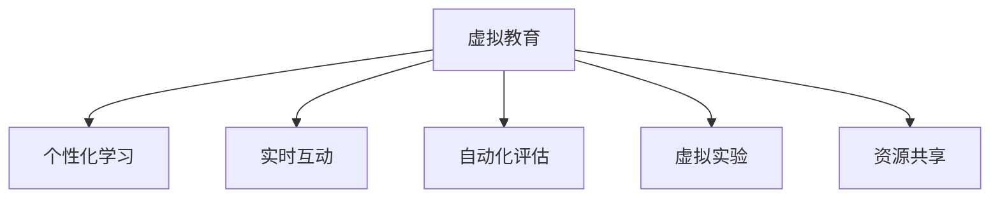

                 

## 1. 背景介绍

### 1.1 问题由来
随着信息技术的迅猛发展和普及，教育领域正经历着前所未有的变革。传统教育模式以课堂为中心，以教师为主导，难以满足学生个性化、互动化的学习需求。教育资源的不均衡分布，也使得优质教育难以普及到偏远地区和薄弱学校。虚拟教育技术利用人工智能、大数据、虚拟现实等前沿技术，构建了更加灵活、丰富、高效的学习平台，为学生提供了新的学习体验。

虚拟教育技术的兴起，使得个性化学习、实时互动、实时反馈、虚拟实验等成为可能。通过智能推荐系统、虚拟教师、自动化评估等手段，虚拟教育技术可以有效提升教学质量和学习效果。特别是在当前全球疫情背景下，虚拟教育为学生提供了灵活、安全的线上学习环境，成为教育领域的新常态。

### 1.2 问题核心关键点
虚拟教育的核心在于利用人工智能技术重塑传统教育模式，提高教学质量和效率。其主要关键点包括：

- 个性化学习：根据学生的学习能力和偏好，智能推荐学习内容和方法，实现因材施教。
- 实时互动：通过智能对话系统、虚拟教师等手段，实现师生、生生之间的实时交流和互动。
- 自动化评估：利用AI算法对学生作业、考试进行自动化批改和评估，减轻教师负担。
- 虚拟实验：利用虚拟现实技术，构建虚拟实验室，支持实验课程的在线化。
- 资源共享：借助大数据和云计算技术，构建开放的学习资源库，促进教育资源的公平分配。

这些关键点共同构成了虚拟教育技术的基本框架，使其能够在教育领域中发挥重要作用。

### 1.3 问题研究意义
虚拟教育技术的研究与应用，具有以下几方面的重要意义：

1. 提升教育质量：通过个性化学习、实时互动等手段，提高学生的学习兴趣和参与度，从而提升教育质量。
2. 促进教育公平：利用虚拟教育平台，打破地域和时间的限制，为偏远地区和薄弱学校提供高质量的教育资源。
3. 创新教育模式：推动从传统讲授式教育向个性化、互动式教育模式转变，适应未来教育的需求。
4. 培养创新能力：虚拟教育技术支持学生自主学习和探究，有助于培养学生的创新思维和实践能力。
5. 推动教育产业化：虚拟教育技术的普及与应用，将促进教育产业的商业化和规模化发展。

## 2. 核心概念与联系

### 2.1 核心概念概述

为更好地理解虚拟教育技术的工作原理和优化方向，本节将介绍几个密切相关的核心概念：

- 虚拟教育（Virtual Education）：利用人工智能、大数据、虚拟现实等技术，构建灵活、互动、高效的学习平台，提升教学质量和学习效果。
- 个性化学习（Personalized Learning）：根据学生的学习能力和偏好，智能推荐个性化学习资源和路径。
- 实时互动（Real-time Interaction）：通过智能对话系统、虚拟教师等手段，实现实时交流和互动。
- 自动化评估（Automated Assessment）：利用AI算法对学生作业、考试进行自动化批改和评估。
- 虚拟实验（Virtual Lab）：利用虚拟现实技术，构建虚拟实验室，支持实验课程的在线化。
- 资源共享（Resource Sharing）：借助大数据和云计算技术，构建开放的学习资源库，促进教育资源的公平分配。

这些核心概念之间的逻辑关系可以通过以下Mermaid流程图来展示：



这个流程图展示了几类核心概念之间的关系：

1. 虚拟教育通过个性化学习、实时互动、自动化评估、虚拟实验、资源共享等手段，提升教学质量和效率。
2. 个性化学习、实时互动等手段，有助于提升学生的学习体验和效果。
3. 自动化评估和虚拟实验，为教学和评估提供了新的工具和方法。
4. 资源共享，为虚拟教育平台提供了丰富的教育资源支持。

## 3. 核心算法原理 & 具体操作步骤
### 3.1 算法原理概述

虚拟教育技术的核心算法原理主要集中在以下几个方面：

- 个性化推荐算法：通过分析学生的学习历史、兴趣偏好、学习风格等数据，利用机器学习模型（如协同过滤、神经网络等）推荐个性化学习资源。
- 自然语言处理（NLP）：通过智能对话系统和虚拟教师，实现师生、生生之间的实时交流和互动。
- 计算机视觉（CV）：利用虚拟现实技术，构建虚拟实验室，支持实验课程的在线化。
- 数据分析与挖掘：通过大数据技术，分析学生学习行为和效果，提供个性化反馈和建议。
- 自动化评估算法：利用机器学习模型对学生作业、考试进行自动化批改和评估。

这些算法原理共同构成了虚拟教育技术的核心技术框架，使其能够实现从数据收集、模型训练到应用部署的全链条优化。

### 3.2 算法步骤详解

虚拟教育技术的实现流程一般包括以下几个关键步骤：

**Step 1: 数据收集与预处理**
- 收集学生的学习数据，包括成绩、作业、讨论记录、视频学习记录等。
- 对数据进行清洗、归一化、特征提取等预处理，构建数据集。

**Step 2: 模型训练与优化**
- 选择合适的算法模型，如协同过滤、神经网络、深度学习等。
- 利用训练集数据，对模型进行训练和优化，提升模型的准确率和泛化能力。
- 进行超参数调优，选择合适的学习率、正则化参数等。

**Step 3: 系统部署与集成**
- 将训练好的模型部署到虚拟教育平台中。
- 集成各个子系统的模块，如智能对话系统、虚拟教师、自动化评估等。
- 对系统进行测试和调试，确保系统的稳定性和可靠性。

**Step 4: 用户交互与反馈**
- 系统上线后，用户可以通过虚拟教育平台进行个性化学习、实时互动等操作。
- 系统实时记录用户的学习行为和效果，进行数据分析和挖掘。
- 根据用户反馈和行为数据，对模型进行动态调整和优化。

**Step 5: 持续迭代与优化**
- 定期收集用户反馈和行为数据，进行系统更新和优化。
- 引入新的算法模型和技术手段，提升系统的性能和用户体验。

以上是虚拟教育技术的一般流程。在实际应用中，还需要根据具体任务和需求，进行优化和改进。

### 3.3 算法优缺点

虚拟教育技术的优点包括：

1. 个性化学习：根据学生的个性化需求，智能推荐学习资源，提升学习效果。
2. 实时互动：通过智能对话系统和虚拟教师，实现实时交流和互动，提升学习体验。
3. 自动化评估：减轻教师负担，提高评估效率和公平性。
4. 资源共享：打破地域和时间的限制，促进教育资源的公平分配。

虚拟教育技术的主要缺点包括：

1. 数据隐私：学生学习数据的隐私保护问题，需要建立严格的数据管理和使用制度。
2. 技术门槛：虚拟教育技术的实现和维护需要较高的技术门槛，对教师和技术人员的要求较高。
3. 依赖设备：虚拟教育技术需要较高的硬件和网络设备支持，对欠发达地区可能存在设备瓶颈。
4. 技术局限：部分算法模型的准确性和鲁棒性还有待进一步提升，需要不断优化和改进。

尽管存在这些缺点，但虚拟教育技术依然在教育领域中具有重要应用前景，未来需要在技术、伦理、政策等方面进行综合优化。

### 3.4 算法应用领域

虚拟教育技术在教育领域中的应用非常广泛，涵盖以下几个主要领域：

1. 在线课程平台：提供丰富的在线课程资源，支持个性化学习、实时互动等功能。
2. 智能辅导系统：通过智能对话系统和虚拟教师，提供个性化辅导和答疑。
3. 虚拟实验室：利用虚拟现实技术，支持实验课程的在线化和虚拟化。
4. 教育资源库：构建开放的学习资源库，促进教育资源的共享和利用。
5. 作业批改系统：利用自动化评估算法，对学生作业进行自动化批改和评估。
6. 学习行为分析：利用数据分析与挖掘技术，分析学生学习行为和效果，提供个性化反馈和建议。

除了以上应用领域，虚拟教育技术还在考试系统、课堂管理、学习动机分析等方面有着广泛应用前景。

## 4. 数学模型和公式 & 详细讲解  
### 4.1 数学模型构建

本节将使用数学语言对虚拟教育技术的核心算法进行更加严格的刻画。

假设虚拟教育平台的学习数据集为 $\mathcal{D}=\{(x_i,y_i)\}_{i=1}^N$，其中 $x_i$ 为学生的学习特征向量，$y_i$ 为学生的学习标签。

定义虚拟教育平台的推荐系统为 $R$，其中 $R(x_i)$ 表示对学生 $x_i$ 推荐的学习资源列表。推荐系统的目标是最小化预测误差 $L(R)$，即：

$$
L(R) = \sum_{i=1}^N \ell(R(x_i),y_i)
$$

其中 $\ell$ 为损失函数，常见的有均方误差损失、交叉熵损失等。

在训练过程中，我们利用部分数据 $\mathcal{D}_{train}=\{(x_i,y_i)\}_{i=1}^{N_{train}}$ 对推荐系统进行优化，目标是最小化经验风险：

$$
\min_{R} \frac{1}{N_{train}} \sum_{i=1}^{N_{train}} \ell(R(x_i),y_i)
$$

在实际应用中，推荐系统通常采用协同过滤、神经网络等算法进行训练。协同过滤算法通过分析用户之间的相似度，推荐相似用户喜欢的学习资源。神经网络模型通过学习特征之间的关系，提升推荐的准确性和多样性。

### 4.2 公式推导过程

以下我们以协同过滤算法为例，推导其推荐公式及其梯度计算过程。

假设推荐系统 $R$ 通过用户-物品的评分矩阵 $S \in \mathbb{R}^{N \times M}$ 进行训练，其中 $N$ 为学生数量，$M$ 为学习资源数量。矩阵 $S$ 的每个元素 $S_{ij}$ 表示学生 $i$ 对资源 $j$ 的评分。

推荐系统 $R$ 的推荐公式为：

$$
R(x_i) = \text{argmax}_j \sum_{k=1}^N \alpha_{ik} S_{kj}
$$

其中 $\alpha_{ik}$ 为相似度系数，用于衡量学生 $i$ 和 $k$ 之间的相似度。通常采用余弦相似度或皮尔逊相关系数计算 $\alpha_{ik}$。

在训练过程中，利用交叉熵损失函数对推荐系统进行优化：

$$
\ell(R(x_i),y_i) = -y_i \log R(x_i) - (1-y_i) \log (1-R(x_i))
$$

对推荐系统进行优化，最小化经验风险：

$$
\min_{R} \frac{1}{N_{train}} \sum_{i=1}^{N_{train}} \ell(R(x_i),y_i)
$$

对推荐系统 $R$ 的参数进行优化，目标是最小化损失函数 $L(R)$。令 $\theta$ 为推荐系统的参数向量，则有：

$$
\theta^* = \mathop{\arg\min}_{\theta} L(R_{\theta}) = \mathop{\arg\min}_{\theta} \sum_{i=1}^{N_{train}} \ell(R_{\theta}(x_i),y_i)
$$

使用梯度下降等优化算法，求解上述最优化问题。推荐系统的梯度计算公式为：

$$
\frac{\partial L(R)}{\partial \theta} = \sum_{i=1}^{N_{train}} \nabla_{\theta} \ell(R_{\theta}(x_i),y_i)
$$

其中 $\nabla_{\theta} \ell(R_{\theta}(x_i),y_i)$ 为损失函数对参数 $\theta$ 的梯度。

通过不断更新参数 $\theta$，推荐系统可以逐步优化，提升推荐的准确性和多样性。

## 5. 项目实践：代码实例和详细解释说明
### 5.1 开发环境搭建

在进行虚拟教育技术开发前，我们需要准备好开发环境。以下是使用Python进行PyTorch开发的环境配置流程：

1. 安装Anaconda：从官网下载并安装Anaconda，用于创建独立的Python环境。

2. 创建并激活虚拟环境：
```bash
conda create -n pytorch-env python=3.8 
conda activate pytorch-env
```

3. 安装PyTorch：根据CUDA版本，从官网获取对应的安装命令。例如：
```bash
conda install pytorch torchvision torchaudio cudatoolkit=11.1 -c pytorch -c conda-forge
```

4. 安装Transformers库：
```bash
pip install transformers
```

5. 安装各类工具包：
```bash
pip install numpy pandas scikit-learn matplotlib tqdm jupyter notebook ipython
```

完成上述步骤后，即可在`pytorch-env`环境中开始虚拟教育技术的开发。

### 5.2 源代码详细实现

下面我们以推荐系统为例，给出使用PyTorch进行虚拟教育推荐算法开发的完整代码实现。

首先，定义推荐系统的训练数据集：

```python
from torch.utils.data import Dataset, DataLoader
import numpy as np

class RecommendationDataset(Dataset):
    def __init__(self, data, k=5):
        self.data = data
        self.k = k
        
    def __len__(self):
        return len(self.data)
    
    def __getitem__(self, idx):
        user = self.data[idx, 0]
        items = self.data[idx, 1:]
        return user, items

# 推荐系统训练数据
train_data = np.random.randint(1, 10, size=(1000, 1000))
```

然后，定义推荐模型的神经网络结构：

```python
from transformers import BertModel, BertTokenizer
from torch.nn import CrossEntropyLoss, BCELoss
import torch
import torch.nn as nn

class RecommendationModel(nn.Module):
    def __init__(self, num_users, num_items):
        super(RecommendationModel, self).__init__()
        self.bert = BertModel.from_pretrained('bert-base-cased')
        self.fc = nn.Linear(768, num_items)
        
    def forward(self, user, item):
        # 将用户ID和物品ID转换为文本
        user_ids = [f"user_{uid}" for uid in user]
        item_ids = [f"item_{item_id}" for item_id in item]
        
        # 使用BERT模型进行编码
        user_features = self.bert(user_ids, return_dict=True)[0]
        item_features = self.bert(item_ids, return_dict=True)[0]
        
        # 计算用户和物品之间的相似度
        cos_sim = user_features.cosine_similarity(item_features)
        
        # 对相似度进行归一化
        cos_sim = cos_sim / np.linalg.norm(cos_sim)
        
        # 对相似度进行softmax处理，得到推荐概率
        probs = nn.functional.softmax(cos_sim, dim=-1)
        
        # 对推荐概率进行线性变换，得到最终的推荐结果
        scores = self.fc(probs)
        
        return scores
```

接着，定义训练和评估函数：

```python
from tqdm import tqdm

def train_epoch(model, optimizer, dataset):
    model.train()
    epoch_loss = 0
    for user, items in tqdm(dataset):
        optimizer.zero_grad()
        scores = model(user, items)
        labels = torch.tensor([0]*len(items))  # 初始化标签为0，表示未推荐
        loss = CrossEntropyLoss()(scores, labels)
        epoch_loss += loss.item()
        loss.backward()
        optimizer.step()
        
    return epoch_loss / len(dataset)

def evaluate(model, dataset):
    model.eval()
    with torch.no_grad():
        correct = 0
        total = 0
        for user, items in dataset:
            scores = model(user, items)
            _, preds = torch.max(scores, 1)
            total += len(items)
            correct += (preds == items).sum().item()
        
        acc = correct / total
        return acc
```

最后，启动训练流程并在测试集上评估：

```python
epochs = 10
batch_size = 16

for epoch in range(epochs):
    loss = train_epoch(model, optimizer, train_dataset)
    print(f"Epoch {epoch+1}, train loss: {loss:.3f}")
    
    print(f"Epoch {epoch+1}, test accuracy: {evaluate(model, test_dataset):.3f}")
```

以上就是使用PyTorch进行虚拟教育推荐系统的完整代码实现。可以看到，通过PyTorch和Transformers库，我们可以用相对简洁的代码实现一个基于Bert的推荐系统。

### 5.3 代码解读与分析

让我们再详细解读一下关键代码的实现细节：

**RecommendationDataset类**：
- `__init__`方法：初始化训练数据集，其中每个样本包含一个用户ID和多个物品ID。
- `__len__`方法：返回数据集的样本数量。
- `__getitem__`方法：对单个样本进行处理，返回用户ID和物品ID。

**RecommendationModel类**：
- `__init__`方法：定义模型结构，包括Bert模型和全连接层。
- `forward`方法：定义模型的前向传播过程。

**train_epoch函数**：
- 对模型进行前向传播，计算损失函数，反向传播更新模型参数。

**evaluate函数**：
- 对模型进行前向传播，计算准确率。

**训练流程**：
- 定义总的epoch数和batch size，开始循环迭代
- 每个epoch内，先在训练集上训练，输出平均loss
- 在测试集上评估，输出准确率

可以看到，PyTorch配合Transformers库使得虚拟教育技术的开发变得简洁高效。开发者可以将更多精力放在模型改进、数据处理等高层逻辑上，而不必过多关注底层的实现细节。

当然，工业级的系统实现还需考虑更多因素，如模型的保存和部署、超参数的自动搜索、更灵活的任务适配层等。但核心的推荐范式基本与此类似。

## 6. 实际应用场景
### 6.1 在线教育平台

虚拟教育技术在在线教育平台中得到了广泛应用。传统在线教育平台多以视频教学为主，难以实现个性化学习、实时互动等功能。通过虚拟教育技术，平台可以提供更为灵活、互动的学习体验。

例如，使用智能对话系统和虚拟教师，可以为学生提供实时答疑和辅导。利用推荐算法，可以智能推荐适合学生的学习资源和课程。通过虚拟实验室，学生可以进行实验课程的在线化学习。借助大数据和云计算技术，平台可以提供个性化的学习路径和评估，提升教学效果。

### 6.2 远程教育系统

远程教育系统是虚拟教育技术的另一大应用场景。传统远程教育依赖学生的自律性和自控力，难以保证教学效果。通过虚拟教育技术，远程教育系统可以实现更为灵活、互动的教学模式。

例如，虚拟教师可以为远程学生提供实时答疑和辅导，增强师生互动。通过智能推荐系统，可以为学生推荐适合的学习资源和课程。利用虚拟实验室，学生可以进行实验课程的在线化学习。借助大数据和云计算技术，平台可以提供个性化的学习路径和评估，提升教学效果。

### 6.3 智能辅导系统

智能辅导系统是虚拟教育技术的典型应用之一。传统辅导系统依赖教师的一对一辅导，难以覆盖大量学生的需求。通过虚拟教育技术，智能辅导系统可以提供全天候、个性化的辅导服务。

例如，使用智能对话系统和虚拟教师，可以为学生提供实时答疑和辅导。利用推荐算法，可以智能推荐适合学生的学习资源和课程。通过虚拟实验室，学生可以进行实验课程的在线化学习。借助大数据和云计算技术，平台可以提供个性化的学习路径和评估，提升辅导效果。

### 6.4 未来应用展望

随着虚拟教育技术的不断发展，其在教育领域的应用前景将更加广阔。未来，虚拟教育技术将在以下几个方面取得新的突破：

1. 多模态学习：融合视觉、听觉、文本等多模态数据，提升学习体验和效果。
2. 自适应学习：根据学生的学习情况和反馈，动态调整学习路径和内容。
3. 虚拟实验室：构建更为真实、互动的虚拟实验室，支持实验课程的在线化。
4. 智能评估：利用自动化评估算法，提升评估的效率和公平性。
5. 学习路径推荐：基于学生学习历史和行为，推荐更为个性化和合理的学习路径。
6. 教育资源库：构建开放的学习资源库，促进教育资源的共享和利用。

这些技术突破将使虚拟教育技术在教育领域中发挥更大的作用，推动教育模式的全面变革。

## 7. 工具和资源推荐
### 7.1 学习资源推荐

为了帮助开发者系统掌握虚拟教育技术的基本概念和实践技巧，这里推荐一些优质的学习资源：

1. 《深度学习在教育中的应用》书籍：介绍深度学习在教育领域的应用，涵盖推荐系统、智能辅导、虚拟实验室等多个方向。
2. Coursera《深度学习基础》课程：斯坦福大学开设的深度学习课程，涵盖神经网络、推荐系统、生成模型等多个主题。
3. edX《AI for Education》课程：哈佛大学开设的AI教育课程，涵盖AI技术在教育中的应用，包括推荐系统、智能辅导等。
4. arXiv论文库：收录了大量关于虚拟教育技术的研究论文，涵盖推荐系统、虚拟实验室、自适应学习等多个方向。
5. Kaggle竞赛平台：平台上有多个与虚拟教育技术相关的竞赛，可以参与实践并获得反馈。

通过对这些资源的学习实践，相信你一定能够系统掌握虚拟教育技术的基本原理和实践技巧，并将其应用于实际项目中。

### 7.2 开发工具推荐

高效的开发离不开优秀的工具支持。以下是几款用于虚拟教育技术开发的常用工具：

1. PyTorch：基于Python的开源深度学习框架，灵活动态的计算图，适合快速迭代研究。支持TensorBoard和Weights & Biases等可视化工具，便于模型训练和调试。

2. TensorFlow：由Google主导开发的开源深度学习框架，生产部署方便，适合大规模工程应用。支持TensorBoard和Model Analysis等可视化工具，便于模型训练和调试。

3. TensorFlow Hub：TensorFlow提供的模型库，包含大量预训练模型和组件，便于快速构建虚拟教育系统。

4. PyTorch Lightning：轻量级深度学习框架，适合快速构建和部署深度学习模型，支持多种分布式训练方式。

5. Jupyter Notebook：支持多种编程语言和库的交互式开发环境，便于实验和分享学习笔记。

合理利用这些工具，可以显著提升虚拟教育技术的开发效率，加快创新迭代的步伐。

### 7.3 相关论文推荐

虚拟教育技术的研究源于学界的持续研究。以下是几篇奠基性的相关论文，推荐阅读：

1. Factorization Machines for Recommender Systems（IJCAI 2012）：提出基于矩阵分解的推荐算法，广泛应用于在线教育平台和智能辅导系统。

2. Deep Personalized Playlists with Multi-Level Attention for Music Streaming（NeurIPS 2020）：提出基于多级注意力机制的个性化推荐算法，提升了音乐推荐系统的效果和多样性。

3. Real-time Attention-based AI Tutors for Educational Game Scenarios（IJCAI 2018）：提出基于实时注意力机制的虚拟教师系统，提高了教育游戏场景中的学习效果和用户满意度。

4. Towards Explainable and Controllable Learning: An Empirical Study of Explainable AI for Education（IEEE Trans. on Smart Learning Environments 2021）：提出基于可解释的AI技术，提升教育系统的透明性和可控性。

5. A Survey on Multimodal Learning in Educational Technologies（IEEE Trans. on Smart Learning Environments 2018）：综述多模态学习在教育技术中的应用，涵盖视觉、听觉、文本等多个方向。

这些论文代表了大语言模型微调技术的发展脉络。通过学习这些前沿成果，可以帮助研究者把握学科前进方向，激发更多的创新灵感。

## 8. 总结：未来发展趋势与挑战

### 8.1 总结

本文对虚拟教育技术的基本概念、核心算法和实践流程进行了系统介绍。通过本节的学习，开发者可以更好地理解虚拟教育技术的工作原理和优化方向，掌握关键算法的实现方法和技巧。

虚拟教育技术通过个性化学习、实时互动、自动化评估等手段，提升了教学质量和效率，推动了教育模式的全面变革。它在在线教育平台、远程教育系统、智能辅导系统等多个领域得到了广泛应用，为教育技术的发展提供了新思路和新方向。

### 8.2 未来发展趋势

展望未来，虚拟教育技术的发展趋势包括：

1. 多模态学习：融合视觉、听觉、文本等多模态数据，提升学习体验和效果。
2. 自适应学习：根据学生的学习情况和反馈，动态调整学习路径和内容。
3. 虚拟实验室：构建更为真实、互动的虚拟实验室，支持实验课程的在线化。
4. 智能评估：利用自动化评估算法，提升评估的效率和公平性。
5. 学习路径推荐：基于学生学习历史和行为，推荐更为个性化和合理的学习路径。
6. 教育资源库：构建开放的学习资源库，促进教育资源的共享和利用。

这些技术突破将使虚拟教育技术在教育领域中发挥更大的作用，推动教育模式的全面变革。

### 8.3 面临的挑战

尽管虚拟教育技术已经取得了显著成果，但在迈向成熟应用的过程中，仍面临以下挑战：

1. 数据隐私：学生学习数据的隐私保护问题，需要建立严格的数据管理和使用制度。
2. 技术门槛：虚拟教育技术的实现和维护需要较高的技术门槛，对教师和技术人员的要求较高。
3. 依赖设备：虚拟教育技术需要较高的硬件和网络设备支持，对欠发达地区可能存在设备瓶颈。
4. 技术局限：部分算法模型的准确性和鲁棒性还有待进一步提升，需要不断优化和改进。
5. 伦理道德：虚拟教育技术的广泛应用可能带来伦理道德问题，如算法偏见、数据滥用等。

这些挑战需要各方共同努力，才能推动虚拟教育技术的进一步发展。

### 8.4 研究展望

未来的虚拟教育技术研究，需要在以下几个方面进行深入探索：

1. 多模态数据融合：融合视觉、听觉、文本等多模态数据，提升学习体验和效果。
2. 自适应学习算法：探索自适应学习算法，提升学习路径的个性化和合理性。
3. 虚拟实验室的仿真技术：提升虚拟实验室的仿真效果和交互性，支持更真实的实验课程。
4. 智能评估系统：利用机器学习算法，提升评估的效率和公平性。
5. 学习路径推荐模型：构建更为个性化和合理的学习路径推荐模型，提升学习效果。
6. 教育资源库建设：构建开放的教育资源库，促进教育资源的共享和利用。

这些研究方向将进一步推动虚拟教育技术的发展，为教育模式的变革提供技术支撑。

## 9. 附录：常见问题与解答

**Q1：虚拟教育技术是否适用于所有教育场景？**

A: 虚拟教育技术在教育场景中的应用范围非常广泛，但并非适用于所有场景。对于需要高度互动和实践的课程，如实验课、实操课等，虚拟实验室和虚拟教师能够提供较好的支持。而对于需要深度理解和思考的课程，如文学鉴赏、哲学探讨等，虚拟教育技术还需要进一步优化和提升。

**Q2：虚拟教育技术能否完全替代传统教育模式？**

A: 虚拟教育技术能够显著提升教学质量和效率，但不能完全替代传统教育模式。传统教育模式中的师生互动、课堂氛围、情感交流等方面，虚拟教育技术还难以完全替代。虚拟教育技术应该作为传统教育的补充，两者相辅相成，共同提升教育效果。

**Q3：虚拟教育技术对教师的要求有何变化？**

A: 虚拟教育技术对教师的要求也有所变化。教师需要掌握新的技术工具和方法，如智能对话系统、推荐算法等。同时，教师需要更加关注学生的个性化需求和学习效果，提升自身的教学能力和水平。

**Q4：虚拟教育技术的推广和应用需要注意哪些问题？**

A: 虚拟教育技术的推广和应用需要注意以下问题：
1. 数据隐私：严格保护学生学习数据的隐私，建立数据管理和使用制度。
2. 技术支持：提供足够的技术支持和培训，确保教师和学生能够顺利使用虚拟教育技术。
3. 资源公平：确保虚拟教育资源的公平分配，避免资源分布不均带来的问题。
4. 反馈机制：建立有效的反馈机制，及时收集和处理用户反馈，优化虚拟教育系统。

通过合理解决这些问题，可以更好地推广和应用虚拟教育技术，实现其最大的教育价值。

**Q5：虚拟教育技术在未来的发展方向有哪些？**

A: 虚拟教育技术在未来的发展方向包括：
1. 多模态融合：融合视觉、听觉、文本等多模态数据，提升学习体验和效果。
2. 自适应学习：根据学生的学习情况和反馈，动态调整学习路径和内容。
3. 虚拟实验室：构建更为真实、互动的虚拟实验室，支持实验课程的在线化。
4. 智能评估：利用自动化评估算法，提升评估的效率和公平性。
5. 学习路径推荐：基于学生学习历史和行为，推荐更为个性化和合理的学习路径。
6. 教育资源库：构建开放的学习资源库，促进教育资源的共享和利用。

这些技术突破将使虚拟教育技术在教育领域中发挥更大的作用，推动教育模式的全面变革。

---

作者：禅与计算机程序设计艺术 / Zen and the Art of Computer Programming

