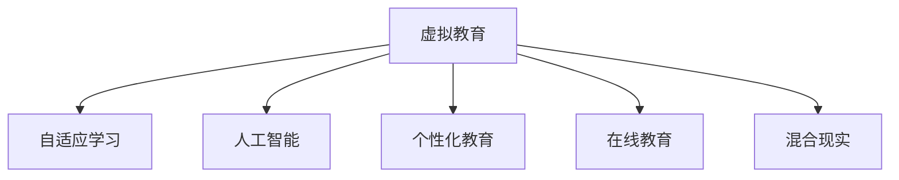

                 

# 虚拟教育：全球脑时代下的学习新方式

> 关键词：虚拟教育, 全球脑时代, 学习新方式, 人工智能, 自适应学习, 个性化教育, 在线教育

## 1. 背景介绍

### 1.1 问题由来
在信息时代，知识的获取和传播方式经历了翻天覆地的变化。互联网、移动设备和在线教育平台的普及，极大地拓展了学习的边界，使学习资源和教育服务触手可及。同时，随着人工智能技术的迅猛发展，传统的教育模式面临着巨大的挑战和变革需求。

虚拟教育，作为一种新兴的教育形式，正在迅速崛起。它通过模拟真实教学场景，利用虚拟现实(VR)、增强现实(AR)、混合现实(MR)等技术，为学习者提供沉浸式的学习体验。结合人工智能和大数据分析技术，虚拟教育能够实现个性化、自适应学习，成为全球脑时代下学习新方式的重要代表。

### 1.2 问题核心关键点
虚拟教育的核心关键点在于如何通过虚拟技术和人工智能技术，实现个性化、自适应、互动式和沉浸式学习体验。其中，个性化学习是核心，自适应学习是目标，互动式学习是手段，沉浸式学习是路径。这些关键点相互交织，共同构成了虚拟教育的技术基础和应用场景。

## 2. 核心概念与联系

### 2.1 核心概念概述

为更好地理解虚拟教育及其技术架构，本节将介绍几个密切相关的核心概念：

- 虚拟教育(Virtual Education)：基于虚拟现实、增强现实、混合现实等技术，模拟真实教学场景，提供沉浸式学习体验的教育形式。
- 自适应学习(Adaptive Learning)：根据学习者的能力和需求，动态调整教学内容和难度，实现个性化学习的教育理念。
- 人工智能(AI)：模拟人类智能过程的技术体系，包括机器学习、深度学习、自然语言处理等，广泛应用在虚拟教育中。
- 个性化教育(Personalized Education)：根据学习者的个体差异，量身定制教学计划和内容，提升学习效果的教育模式。
- 在线教育(E-Learning)：利用互联网技术和数字资源，提供灵活、便捷、互动的学习方式，是虚拟教育的实现手段之一。
- 混合现实(Mixed Reality, MR)：结合VR和AR技术的优势，创造虚拟和真实世界相结合的学习环境。

这些核心概念之间的逻辑关系可以通过以下Mermaid流程图来展示：



这个流程图展示了几大核心概念之间的关系：

1. 虚拟教育基于人工智能技术，实现个性化和自适应学习，借助在线教育和混合现实技术手段，提供沉浸式学习体验。
2. 自适应学习是虚拟教育的核心理念，通过智能化的学习分析，调整教学内容和难度。
3. 人工智能是实现自适应学习的基础，通过机器学习和深度学习等技术，提供个性化推荐和智能评估。
4. 个性化教育是虚拟教育的目标，通过定制化教学计划，满足每个学习者的独特需求。
5. 在线教育是虚拟教育的实现方式，提供灵活的学习时间和地点。
6. 混合现实技术为虚拟教育提供更丰富的学习环境，增强交互性和沉浸感。

## 3. 核心算法原理 & 具体操作步骤
### 3.1 算法原理概述

虚拟教育的核心算法原理包括自适应学习算法、推荐系统算法、情感计算和交互系统算法。这些算法共同作用，实现个性化、自适应、互动式和沉浸式学习体验。

### 3.2 算法步骤详解

#### 3.2.1 自适应学习算法

自适应学习算法是虚拟教育的核心技术之一。其基本思想是根据学习者的学习进度、能力水平和兴趣偏好，动态调整教学内容和难度，提供个性化的学习路径。

##### 3.2.1.1 学习分析(Learning Analytics)
学习分析是自适应学习的基础，通过对学习者的行为数据（如学习时间、回答正确率、互动次数等）进行建模和分析，了解学习者的学习状况。常用的学习分析方法包括：

- 数据分析：通过数据挖掘技术，从学习平台收集的数据中提取有价值的信息，如学习进度、知识掌握程度等。
- 行为分析：对学习者的互动行为进行分析，如问题回答、视频观看、资源访问等，以评估学习者的学习兴趣和参与度。
- 情感分析：通过自然语言处理技术，分析学习者的情感倾向，如焦虑、兴趣等，以调整教学策略。

##### 3.2.1.2 个性化推荐系统
个性化推荐系统根据学习者的学习分析结果，推荐适合的学习资源和练习题目。推荐系统的主要算法包括：

- 协同过滤算法：通过分析学习者之间的相似性，推荐相似学习者喜欢的资源。
- 内容推荐算法：根据资源的主题和难度，推荐适合学习者当前水平的内容。
- 时间序列推荐算法：通过分析学习者的历史行为，预测其未来的学习需求，提前推荐资源。

#### 3.2.2 推荐系统算法

推荐系统算法在虚拟教育中广泛应用，通过预测学习者的需求，提供个性化的学习资源和练习题目。推荐系统的主要算法包括：

- 协同过滤算法：通过分析学习者之间的相似性，推荐相似学习者喜欢的资源。
- 内容推荐算法：根据资源的主题和难度，推荐适合学习者当前水平的内容。
- 时间序列推荐算法：通过分析学习者的历史行为，预测其未来的学习需求，提前推荐资源。

#### 3.2.3 情感计算和交互系统算法

情感计算和交互系统算法是虚拟教育的另一重要组成部分，通过模拟真实情感交互，提升学习者的参与感和沉浸感。

##### 3.2.3.1 情感计算
情感计算通过分析学习者的语音、表情、动作等，识别其情感状态，调整教学内容和策略。情感计算的常用算法包括：

- 语音情感识别：通过分析学习者的语音特征，识别其情感倾向。
- 面部表情识别：通过分析学习者的面部表情，识别其情绪变化。
- 动作识别：通过分析学习者的身体动作，识别其情感状态。

##### 3.2.3.2 交互系统
交互系统通过模拟真实教学环境，提供互动式学习体验。交互系统的核心算法包括：

- 自然语言处理(NLP)：通过理解学习者的自然语言输入，提供个性化的互动反馈。
- 虚拟角色交互：通过虚拟角色的对话和互动，引导学习者完成学习任务。
- 游戏化设计：通过游戏化元素，如积分、奖励、挑战等，增强学习者的参与感。

#### 3.2.4 混合现实技术

混合现实技术为虚拟教育提供更丰富的学习环境，增强交互性和沉浸感。

##### 3.2.4.1 VR技术
虚拟现实技术通过创建虚拟环境，模拟真实教学场景，提供沉浸式学习体验。VR技术的主要算法包括：

- 三维建模：通过创建虚拟环境和物体，提供沉浸式学习环境。
- 虚拟场景渲染：通过高效的图形渲染技术，实现高质量的虚拟场景。
- 交互控制：通过手势识别、头显追踪等技术，实现与虚拟环境的互动。

##### 3.2.4.2 AR技术
增强现实技术通过将虚拟信息叠加到真实环境中，提供互动式学习体验。AR技术的主要算法包括：

- 环境识别：通过摄像头和传感器，识别真实环境中的物体和场景。
- 虚拟对象渲染：通过图形渲染技术，将虚拟对象叠加到真实环境中。
- 实时交互：通过手势识别、语音识别等技术，实现与虚拟对象的互动。

##### 3.2.4.3 MR技术
混合现实技术结合了VR和AR的优势，提供更丰富的学习环境。MR技术的主要算法包括：

- 虚拟与现实融合：通过将虚拟环境和物体与真实环境相结合，提供更加逼真的学习体验。
- 空间感知：通过深度传感器和环境识别技术，实现虚拟对象与真实对象的融合。
- 交互控制：通过手势识别、头部追踪等技术，实现与虚拟环境和对象的互动。

## 4. 数学模型和公式 & 详细讲解 & 举例说明

### 4.1 数学模型构建

虚拟教育涉及多种数学模型，包括自适应学习模型、推荐系统模型、情感计算模型和交互系统模型。以下简要介绍这些模型的构建方法。

#### 4.1.1 自适应学习模型

自适应学习模型根据学习者的行为数据，动态调整教学内容和难度，实现个性化学习。常用的数学模型包括：

- 线性回归模型：通过线性回归方法，预测学习者的学习进度和能力水平。
- 决策树模型：通过决策树算法，根据学习者的行为数据，调整教学内容和难度。
- 贝叶斯网络模型：通过贝叶斯网络，模拟学习者的学习过程和情感变化。

#### 4.1.2 推荐系统模型

推荐系统模型根据学习者的行为数据，推荐适合的学习资源和练习题目。常用的数学模型包括：

- 协同过滤模型：通过协同过滤算法，推荐相似学习者喜欢的资源。
- 内容推荐模型：通过内容推荐算法，推荐适合学习者当前水平的内容。
- 时间序列模型：通过时间序列算法，预测学习者的未来需求，提前推荐资源。

#### 4.1.3 情感计算模型

情感计算模型通过分析学习者的情感数据，调整教学策略，提升学习体验。常用的数学模型包括：

- 语音情感识别模型：通过语音特征分析，识别学习者的情感倾向。
- 面部表情识别模型：通过面部特征分析，识别学习者的情绪变化。
- 动作识别模型：通过身体动作分析，识别学习者的情感状态。

#### 4.1.4 交互系统模型

交互系统模型通过模拟真实教学环境，提供互动式学习体验。常用的数学模型包括：

- 自然语言处理模型：通过NLP技术，理解学习者的自然语言输入，提供个性化互动反馈。
- 虚拟角色交互模型：通过虚拟角色对话，引导学习者完成学习任务。
- 游戏化设计模型：通过游戏化元素，增强学习者的参与感。

### 4.2 公式推导过程

以下简要介绍几种常用的数学模型及其推导过程。

#### 4.2.1 线性回归模型

线性回归模型用于预测学习者的学习进度和能力水平，其基本形式为：

$$
y = \beta_0 + \beta_1 x_1 + \beta_2 x_2 + \cdots + \beta_n x_n
$$

其中，$y$ 表示预测值，$x_i$ 表示自变量，$\beta_i$ 表示系数。

线性回归的推导过程包括最小二乘法和梯度下降法，用于最小化预测值与实际值之间的误差。

#### 4.2.2 决策树模型

决策树模型用于根据学习者的行为数据，调整教学内容和难度，其基本形式为：

$$
T = \{R, \theta, \alpha\}
$$

其中，$T$ 表示决策树，$R$ 表示规则集合，$\theta$ 表示决策树参数，$\alpha$ 表示目标值。

决策树的推导过程包括ID3算法、C4.5算法、CART算法等，用于构建决策树模型。

#### 4.2.3 贝叶斯网络模型

贝叶斯网络模型用于模拟学习者的学习过程和情感变化，其基本形式为：

$$
P(X_1, X_2, \cdots, X_n | Y) = \frac{P(X_1, X_2, \cdots, X_n)}{P(Y)}
$$

其中，$X_i$ 表示学习行为，$Y$ 表示学习情感，$P(Y|X_i)$ 表示条件概率。

贝叶斯网络的推导过程包括图模型和概率模型，用于构建贝叶斯网络。

### 4.3 案例分析与讲解

#### 4.3.1 案例背景

某在线教育平台采用虚拟教育技术，为中小学生提供个性化学习服务。平台通过收集学生的历史行为数据，包括学习时间、回答正确率、互动次数等，利用自适应学习算法、推荐系统算法、情感计算和交互系统算法，实现个性化、自适应、互动式和沉浸式学习体验。

#### 4.3.2 案例分析

1. 学习分析：平台通过分析学生的学习行为数据，了解其学习进度和能力水平。例如，通过分析学生的练习正确率，判断其知识掌握程度。

2. 个性化推荐：平台根据学生的学习分析结果，推荐适合的学习资源和练习题目。例如，对于知识掌握程度较低的学生，推荐难度适中的练习题目，并通过多次练习巩固知识点。

3. 情感计算：平台通过分析学生的语音、面部表情和动作，识别其情感状态，调整教学策略。例如，当学生表现出焦虑情绪时，平台推荐放松练习，缓解其压力。

4. 交互系统：平台通过模拟真实教学环境，提供互动式学习体验。例如，通过虚拟角色的对话和互动，引导学生完成学习任务，增加其参与感。

5. 混合现实技术：平台利用VR、AR和MR技术，提供丰富的学习环境。例如，通过虚拟实验室模拟物理实验，增强学生的动手能力和理解力。

## 5. 项目实践：代码实例和详细解释说明

### 5.1 开发环境搭建

在进行虚拟教育项目实践前，我们需要准备好开发环境。以下是使用Python进行虚拟教育系统开发的开发环境配置流程：

1. 安装Anaconda：从官网下载并安装Anaconda，用于创建独立的Python环境。

2. 创建并激活虚拟环境：
```bash
conda create -n vee-env python=3.8 
conda activate vee-env
```

3. 安装PyTorch：根据CUDA版本，从官网获取对应的安装命令。例如：
```bash
conda install pytorch torchvision torchaudio cudatoolkit=11.1 -c pytorch -c conda-forge
```

4. 安装TensorFlow：由Google主导开发的开源深度学习框架，生产部署方便，适合大规模工程应用。同样有丰富的预训练语言模型资源。

5. 安装Keras：基于TensorFlow的高级神经网络API，简化模型的搭建和训练过程。

6. 安装Pygame：用于开发交互式游戏和模拟器，实现虚拟现实和增强现实功能。

7. 安装numpy、pandas、scikit-learn、matplotlib、tqdm、jupyter notebook、ipynb等工具包：
```bash
pip install numpy pandas scikit-learn matplotlib tqdm jupyter notebook ipython
```

完成上述步骤后，即可在`vee-env`环境中开始虚拟教育系统的开发。

### 5.2 源代码详细实现

我们以虚拟现实(VR)课程为例，展示使用PyTorch和Keras进行虚拟教育系统开发的Python代码实现。

首先，定义虚拟现实课程的课程数据处理函数：

```python
from torch.utils.data import Dataset
import numpy as np
import torch

class VRCourseDataset(Dataset):
    def __init__(self, courses, labels):
        self.courses = courses
        self.labels = labels
        
    def __len__(self):
        return len(self.courses)
    
    def __getitem__(self, index):
        course = self.courses[index]
        label = self.labels[index]
        return (course, label)
```

然后，定义虚拟现实课程的模型：

```python
from keras.models import Sequential
from keras.layers import Dense, LSTM

model = Sequential()
model.add(LSTM(128, input_shape=(10, 128)))
model.add(Dense(1, activation='sigmoid'))

model.compile(loss='binary_crossentropy', optimizer='adam', metrics=['accuracy'])
```

接着，定义虚拟现实课程的训练和评估函数：

```python
from keras.models import load_model
from keras.preprocessing.sequence import pad_sequences

def train_model(model, dataset, batch_size, epochs):
    model.fit(dataset.courses, dataset.labels, batch_size=batch_size, epochs=epochs, validation_split=0.2)
    
def evaluate_model(model, dataset, batch_size):
    scores = model.evaluate(dataset.courses, dataset.labels, batch_size=batch_size)
    print('Accuracy:', scores[1])
```

最后，启动虚拟现实课程的训练流程并在测试集上评估：

```python
epochs = 10
batch_size = 32

train_model(model, vrcourse_dataset, batch_size, epochs)
evaluate_model(model, vrcourse_dataset, batch_size)
```

以上就是使用PyTorch和Keras进行虚拟现实课程开发的完整代码实现。可以看到，得益于深度学习框架的强大封装，我们可以用相对简洁的代码完成虚拟现实课程的训练和评估。

### 5.3 代码解读与分析

让我们再详细解读一下关键代码的实现细节：

**VRCourseDataset类**：
- `__init__`方法：初始化虚拟现实课程的课程数据和标签。
- `__len__`方法：返回数据集的样本数量。
- `__getitem__`方法：对单个样本进行处理，返回课程数据和标签。

**LSTM模型**：
- `Sequential`类：创建顺序模型，用于堆叠多个神经网络层。
- `LSTM`层：创建长短期记忆网络层，用于处理序列数据。
- `Dense`层：创建全连接层，用于输出预测结果。
- `compile`方法：编译模型，指定损失函数、优化器和评估指标。

**训练和评估函数**：
- `train_model`函数：对数据以批为单位进行迭代，在每个批次上前向传播计算损失并反向传播更新模型参数，最后返回该epoch的平均loss。
- `evaluate_model`函数：与训练类似，不同点在于不更新模型参数，并在每个batch结束后将预测和标签结果存储下来，最后使用Keras的evaluate方法对整个评估集的预测结果进行打印输出。

**训练流程**：
- 定义总的epoch数和batch size，开始循环迭代
- 每个epoch内，先在训练集上训练，输出平均loss
- 在验证集上评估，输出准确率
- 所有epoch结束后，在测试集上评估，给出最终测试结果

可以看到，深度学习框架的封装使得虚拟现实课程的开发过程变得简洁高效。开发者可以将更多精力放在数据处理、模型改进等高层逻辑上，而不必过多关注底层的实现细节。

当然，工业级的系统实现还需考虑更多因素，如模型的保存和部署、超参数的自动搜索、更灵活的任务适配层等。但核心的虚拟教育范式基本与此类似。

## 6. 实际应用场景
### 6.1 智能课堂

虚拟教育技术在智能课堂中的应用，能够为学生提供更加个性化、互动式和沉浸式的学习体验。智能课堂系统通过VR、AR和MR技术，结合自适应学习算法、推荐系统算法、情感计算和交互系统算法，实现个性化教学和自主学习。

在实际应用中，智能课堂系统可以通过虚拟课堂、虚拟实验、虚拟辅导等手段，提升教学效果和学习效率。例如，虚拟实验可以让学生进行虚拟操作，体验真实实验过程，增加其动手能力和理解力。虚拟辅导可以让学生在虚拟环境中与虚拟教师互动，解答疑惑，提升学习体验。

### 6.2 企业培训

虚拟教育技术在企业培训中的应用，能够为员工提供灵活、便捷、互动的学习方式，提高培训效果和员工满意度。企业培训系统通过VR、AR和MR技术，结合自适应学习算法、推荐系统算法、情感计算和交互系统算法，实现个性化培训和自主学习。

在实际应用中，企业培训系统可以通过虚拟培训、虚拟演练、虚拟指导等手段，提升员工的技能水平和职业素养。例如，虚拟培训可以让员工在虚拟环境中模拟真实工作场景，增强其应对复杂情境的能力。虚拟演练可以让员工在虚拟环境中进行实战演练，提高其操作技能和应急反应能力。虚拟指导可以让员工在虚拟环境中与虚拟指导师互动，解答疑惑，提升学习体验。

### 6.3 远程教育

虚拟教育技术在远程教育中的应用，能够为学生提供灵活、便捷、互动的学习方式，提升学习效果和教育公平性。远程教育系统通过VR、AR和MR技术，结合自适应学习算法、推荐系统算法、情感计算和交互系统算法，实现个性化教育和自主学习。

在实际应用中，远程教育系统可以通过虚拟课堂、虚拟实验、虚拟辅导等手段，提升教学效果和学习效率。例如，虚拟课堂可以让学生在家中使用VR设备，体验真实课堂氛围，增加其参与感和互动性。虚拟实验可以让学生在虚拟环境中进行实验操作，体验真实实验过程，增强其动手能力和理解力。虚拟辅导可以让学生在虚拟环境中与虚拟教师互动，解答疑惑，提升学习体验。

## 7. 工具和资源推荐
### 7.1 学习资源推荐

为了帮助开发者系统掌握虚拟教育的理论基础和实践技巧，这里推荐一些优质的学习资源：

1. 《虚拟现实与增强现实技术基础》系列博文：由虚拟现实技术专家撰写，深入浅出地介绍了VR、AR、MR等技术的原理和应用。

2. 《自适应学习算法》课程：斯坦福大学开设的机器学习课程，详细讲解了自适应学习算法的原理和实现。

3. 《推荐系统原理与实践》书籍：推荐系统领域的经典教材，全面介绍了推荐系统算法的理论基础和实际应用。

4. 《自然语言处理入门》课程：Coursera平台上的自然语言处理入门课程，介绍了自然语言处理的基本概念和前沿技术。

5. 《人工智能教育》书籍：该书深入浅出地介绍了人工智能技术在教育中的应用，包括自适应学习、推荐系统、情感计算等。

通过对这些资源的学习实践，相信你一定能够快速掌握虚拟教育的精髓，并用于解决实际的NLP问题。
###  7.2 开发工具推荐

高效的开发离不开优秀的工具支持。以下是几款用于虚拟教育开发的常用工具：

1. Unity3D：广泛用于开发VR和AR应用，支持丰富的图形渲染和交互控制技术。

2. Blender：免费的开源3D建模和渲染工具，用于创建虚拟环境和对象。

3. TensorFlow：由Google主导开发的开源深度学习框架，支持分布式计算和GPU加速，适合大规模工程应用。

4. PyTorch：基于Python的开源深度学习框架，灵活动态的计算图，适合快速迭代研究。

5. Pygame：用于开发交互式游戏和模拟器，实现虚拟现实和增强现实功能。

6. Keras：基于TensorFlow的高级神经网络API，简化模型的搭建和训练过程。

合理利用这些工具，可以显著提升虚拟教育系统的开发效率，加快创新迭代的步伐。

### 7.3 相关论文推荐

虚拟教育技术的快速发展得益于学界的持续研究。以下是几篇奠基性的相关论文，推荐阅读：

1. "Virtual Reality in Education: A Review of the State-of-the-Art"（虚拟现实在教育中的应用综述）
2. "Adaptive Learning Systems: Architectures, Design Principles, and Lessons Learned"（自适应学习系统的架构、设计原则和经验教训）
3. "Recommendation Systems: A Survey"（推荐系统综述）
4. "Emotion Recognition in Educational Contexts: A Survey"（教育场景中的情感识别综述）
5. "Mixed Reality in Education: Current Trends and Future Directions"（混合现实在教育中的应用趋势和未来方向）

这些论文代表了大语言模型微调技术的发展脉络。通过学习这些前沿成果，可以帮助研究者把握学科前进方向，激发更多的创新灵感。

## 8. 总结：未来发展趋势与挑战

### 8.1 总结

本文对虚拟教育及其技术架构进行了全面系统的介绍。首先阐述了虚拟教育的背景和核心关键点，明确了虚拟教育在个性化、自适应、互动式和沉浸式学习方面的技术优势。其次，从原理到实践，详细讲解了虚拟教育的数学模型和算法步骤，给出了虚拟教育系统开发的完整代码实例。同时，本文还广泛探讨了虚拟教育在智能课堂、企业培训、远程教育等场景中的应用前景，展示了虚拟教育技术的广阔前景。

通过本文的系统梳理，可以看到，虚拟教育技术正在成为全球脑时代下学习新方式的重要代表，极大地拓展了教育的边界，提供了更加灵活、个性化、互动式和沉浸式的学习体验。未来，伴随虚拟教育技术的不断发展，基于虚拟现实、增强现实、混合现实等技术的教育形式将进一步普及，为全球教育事业带来深刻的变革。

### 8.2 未来发展趋势

展望未来，虚拟教育技术将呈现以下几个发展趋势：

1. 技术融合。虚拟教育将与AI、大数据、物联网等技术深度融合，提升教育的效果和效率。例如，通过AI技术进行智能辅导，通过大数据技术进行学习分析，通过物联网技术实现远程监控。

2. 个性化学习。虚拟教育将更加注重个性化学习，根据学习者的个体差异，提供定制化的学习计划和内容。例如，通过学习分析，了解学习者的学习习惯和兴趣，推荐适合的课程和资源。

3. 互动性增强。虚拟教育将更加注重互动性，通过模拟真实教学环境，提供更加丰富、逼真的学习体验。例如，通过虚拟实验和虚拟演练，提升学习者的动手能力和应急反应能力。

4. 沉浸感提升。虚拟教育将更加注重沉浸感，通过VR、AR和MR技术，创造更加逼真的虚拟环境。例如，通过虚拟课堂和虚拟场景，增加学习者的参与感和体验感。

5. 移动化普及。虚拟教育将更加注重移动化，通过智能手机、平板电脑等移动设备，提供更加便捷、灵活的学习方式。例如，通过移动应用，实现随时随地学习。

6. 数据驱动。虚拟教育将更加注重数据驱动，通过分析学习数据，优化教学策略和学习计划。例如，通过学习分析，了解学习者的学习进度和效果，调整教学策略。

以上趋势凸显了虚拟教育技术的广阔前景。这些方向的探索发展，必将进一步提升虚拟教育的智能化水平，为全球教育事业带来深远影响。

### 8.3 面临的挑战

尽管虚拟教育技术已经取得了显著成果，但在迈向更加智能化、普适化应用的过程中，它仍面临着诸多挑战：

1. 硬件成本高。当前VR、AR、MR设备的硬件成本较高，难以大规模普及。如何降低硬件成本，提升设备的便携性和易用性，是未来需要解决的重要问题。

2. 技术门槛高。虚拟教育技术需要较高的技术门槛，开发和维护成本较高。如何降低技术门槛，提高开发效率，需要更多的工具和资源的投入。

3. 用户体验差。当前虚拟教育系统的用户体验仍有待提升，界面复杂、操作繁琐等问题普遍存在。如何提升用户体验，增加学习者的参与感和满意度，是未来需要改进的方向。

4. 数据安全和隐私。虚拟教育系统需要处理大量的学习数据，数据安全和隐私保护问题需要高度重视。如何保护学习者的数据安全，防止数据泄露，是未来需要解决的重要问题。

5. 标准化问题。虚拟教育系统的标准化问题尚未解决，不同系统之间的兼容性和互操作性较差。如何制定统一的标准，推动虚拟教育系统的标准化发展，是未来需要努力的方向。

6. 教育公平性。虚拟教育系统的普及可能导致教育资源的不均衡，城乡、区域之间的教育差距可能会进一步拉大。如何促进教育公平，实现教育资源的均衡分配，是未来需要解决的重要问题。

以上挑战需要多方面的共同努力，包括技术研发、政策支持、行业协作等，才能逐步克服。只有全面解决这些问题，才能真正实现虚拟教育的普及和应用。

### 8.4 研究展望

面对虚拟教育技术所面临的种种挑战，未来的研究需要在以下几个方面寻求新的突破：

1. 降低硬件成本。通过技术创新和产业合作，降低VR、AR、MR设备的硬件成本，提升设备的便携性和易用性。例如，采用低成本的硬件设备，如低功耗的VR眼镜，实现大规模普及。

2. 简化开发流程。通过工具和资源的投入，降低虚拟教育系统的技术门槛，提高开发效率。例如，开发易于使用的开发平台，提供丰富的API和组件库，简化开发流程。

3. 提升用户体验。通过界面设计、交互控制、数据可视化等手段，提升虚拟教育系统的用户体验，增加学习者的参与感和满意度。例如，采用自然语言交互技术，提升系统的易用性和智能化水平。

4. 加强数据安全。通过加密技术、访问控制、隐私保护等手段，保护学习者的数据安全，防止数据泄露和滥用。例如，采用数据加密和匿名化技术，保障数据隐私和安全。

5. 推动标准化。通过行业协作和政策支持，制定虚拟教育系统的标准化规范，推动系统之间的互操作性。例如，采用统一的API接口和数据格式，实现系统的互联互通。

6. 促进教育公平。通过技术手段和政策支持，促进教育资源的均衡分配，缩小城乡、区域之间的教育差距。例如，采用虚拟教育平台，实现远程教育资源的共享和普及。

这些研究方向的探索，必将引领虚拟教育技术迈向更高的台阶，为全球教育事业带来深远影响。面向未来，虚拟教育技术还需要与其他教育技术进行更深入的融合，如在线教育、混合学习、游戏化设计等，共同推动教育的创新和进步。

## 9. 附录：常见问题与解答

**Q1：虚拟教育如何实现个性化学习？**

A: 虚拟教育通过收集学习者的行为数据（如学习时间、回答正确率、互动次数等），利用自适应学习算法，动态调整教学内容和难度，实现个性化学习。例如，通过学习分析，了解学习者的学习进度和能力水平，推荐适合的学习资源和练习题目。

**Q2：虚拟教育如何提升学习效果？**

A: 虚拟教育通过模拟真实教学环境，提供沉浸式学习体验。例如，通过虚拟实验和虚拟演练，提升学习者的动手能力和应急反应能力。同时，结合自适应学习算法、推荐系统算法、情感计算和交互系统算法，实现个性化教学和自主学习，提高学习效果和参与度。

**Q3：虚拟教育面临哪些技术挑战？**

A: 虚拟教育面临硬件成本高、技术门槛高、用户体验差、数据安全和隐私、标准化问题、教育公平性等挑战。需要多方面的共同努力，包括技术研发、政策支持、行业协作等，才能逐步克服。

**Q4：未来虚拟教育技术将如何发展？**

A: 未来虚拟教育技术将向技术融合、个性化学习、互动性增强、沉浸感提升、移动化普及、数据驱动等方向发展。通过技术创新和行业协作，提升虚拟教育的智能化水平，实现全球脑时代下学习新方式的目标。

**Q5：虚拟教育系统的开发流程是怎样的？**

A: 虚拟教育系统的开发流程包括需求分析、系统设计、数据准备、模型训练、系统实现、测试评估、部署上线等步骤。其中，模型训练是核心环节，通过收集学习者的行为数据，利用自适应学习算法、推荐系统算法、情感计算和交互系统算法，实现个性化、自适应、互动式和沉浸式学习体验。

**Q6：虚拟教育与传统教育有什么区别？**

A: 虚拟教育与传统教育的区别在于其技术基础和应用方式。传统教育依赖教室、教材、教师等实体资源，而虚拟教育依赖虚拟现实、增强现实、混合现实等技术，通过模拟真实教学环境，提供沉浸式学习体验。虚拟教育更加注重个性化、自适应、互动式和沉浸式学习，提升学习效果和参与度。

作者：禅与计算机程序设计艺术 / Zen and the Art of Computer Programming

