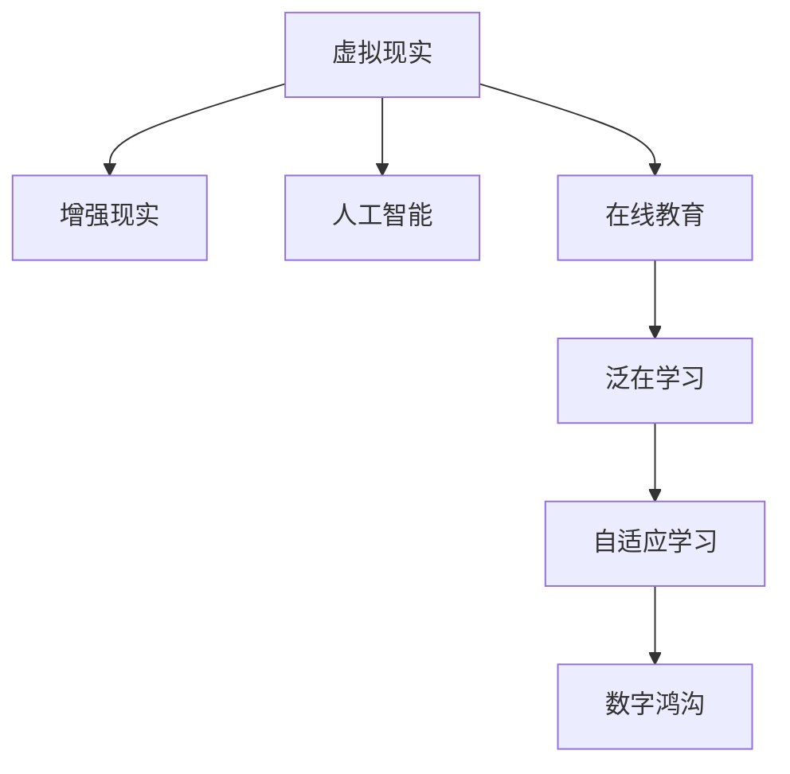

                 

# 虚拟教育：全球脑时代下的学习新方式

## 1. 背景介绍

在数字化时代，技术的进步极大地改变了教育方式。随着互联网和移动设备的普及，传统的教育模式已经逐步向虚拟教育转型。虚拟教育利用现代信息技术，将教育资源数字化、网络化，打破了时间、空间的限制，使得教育资源共享成为可能。特别是在全球脑时代背景下，虚拟教育凭借其灵活性、高效性和个性化优势，成为了未来的重要发展方向。

### 1.1 问题由来

虚拟教育的核心在于利用先进的数字化技术，如虚拟现实(VR)、增强现实(AR)、人工智能(AI)等，为学习者提供沉浸式、交互式的学习体验。相较于传统的课堂教学，虚拟教育能够提供更为个性化的学习路径，满足不同学习者的需求，同时降低教育成本，扩大教育资源的覆盖范围。

当前，虚拟教育已经在全球范围内得到了广泛应用，尤其是在远程教育、职业培训、在线课程等领域。其高效、灵活的特点，为各类学习者提供了新的学习方式，成为教育领域的一项重要突破。

### 1.2 问题核心关键点

虚拟教育的核心问题在于如何利用先进的数字技术，为学习者提供高质量、高效率、高互动性的学习体验。关键点包括：

- 如何设计和实现虚拟学习环境，提供沉浸式的学习体验。
- 如何利用人工智能技术，实现个性化学习路径的推荐。
- 如何利用大数据和机器学习，提供动态化的教学内容。
- 如何保障虚拟教育的质量和公平性，避免数字鸿沟。

本文将围绕上述关键点，系统介绍虚拟教育的核心概念和实现方法，探讨其应用场景和未来发展趋势。

## 2. 核心概念与联系

### 2.1 核心概念概述

为更好地理解虚拟教育的内涵，本节将介绍几个密切相关的核心概念：

- 虚拟现实(Virtual Reality, VR)：通过模拟逼真的三维环境，为学习者提供沉浸式、交互式的学习体验。
- 增强现实(Augmented Reality, AR)：在现实世界中叠加虚拟信息，增强学习者的认知能力。
- 人工智能(Artificial Intelligence, AI)：利用机器学习、深度学习等技术，实现智能化的教学和评估。
- 在线教育(Learning at a Distance, LAD)：通过网络平台，实现教学资源的远程传输和学习。
- 泛在学习(Lifelong Learning, LL)：通过无处不在的网络接入，实现学习过程的持续性和多样性。
- 自适应学习(Adaptive Learning)：根据学习者的反馈和行为，动态调整学习内容和难度，实现个性化学习。
- 数字鸿沟(Digital Divide)：由于技术、经济等因素，不同地区和人群之间在获取教育资源上的不平等现象。

这些核心概念之间的逻辑关系可以通过以下Mermaid流程图来展示：



这个流程图展示虚拟教育的核心概念及其之间的关系：

1. 虚拟现实和增强现实提供了沉浸式和交互式的学习环境，为学习者提供直观、生动的学习体验。
2. 人工智能技术帮助设计个性化和自适应学习系统，实现智能化的教学和评估。
3. 在线教育突破了时空限制，使得教育资源共享成为可能。
4. 泛学习提供持续的学习机会，支持终身学习。
5. 自适应学习根据学习者的反馈和行为，动态调整学习内容和难度，实现个性化学习。
6. 数字鸿沟反映出不同地区和人群在教育资源获取上的不平等，是虚拟教育需要关注的重点。

这些概念共同构成了虚拟教育的学习框架，使得教育者能够设计和实施多样化的教学方式，满足学习者的个性化需求。

## 3. 核心算法原理 & 具体操作步骤

### 3.1 算法原理概述

虚拟教育的实现，本质上是一个多层次、多维度的技术集成过程。其核心在于利用先进的数字技术，设计和实施虚拟学习环境，结合人工智能技术，提供个性化、动态化的教学和评估服务。

具体而言，虚拟教育系统包括以下几个关键模块：

- 虚拟学习环境：利用VR、AR等技术，设计和实现沉浸式的学习空间。
- 智能教学系统：利用AI技术，实现个性化学习路径的推荐和动态化教学内容的生成。
- 自适应学习平台：利用机器学习技术，根据学习者的反馈和行为，动态调整学习内容和难度。
- 在线教育平台：利用云计算和大数据技术，实现教学资源的远程传输和学习。

### 3.2 算法步骤详解

虚拟教育的实施通常包括以下几个关键步骤：

**Step 1: 虚拟学习环境设计**
- 根据学习目标和内容，设计和实现虚拟学习空间。
- 利用VR、AR等技术，创建逼真的三维环境，支持学习者进行互动和探索。

**Step 2: 智能教学系统开发**
- 选择合适的AI模型，如深度学习、自然语言处理等，作为核心组件。
- 设计教学内容推荐算法，根据学习者的兴趣和能力，推荐个性化的学习路径和内容。
- 开发学习评估系统，利用AI技术进行智能化的评估和反馈。

**Step 3: 自适应学习平台搭建**
- 利用机器学习技术，设计和实现自适应学习系统。
- 根据学习者的互动数据，动态调整学习内容和难度，提供个性化的学习体验。

**Step 4: 在线教育平台建设**
- 选择合适的云计算平台，如AWS、Google Cloud等，搭建在线教育基础设施。
- 开发在线课程和资源库，实现教学资源的远程传输和学习。
- 利用大数据技术，分析和优化教学效果，提升学习效率。

**Step 5: 系统测试和优化**
- 在测试环境中，对虚拟教育系统进行全面测试，确保其稳定性和可靠性。
- 收集学习者的反馈数据，不断优化教学内容和自适应算法。
- 持续改进虚拟学习环境，提升用户体验。

### 3.3 算法优缺点

虚拟教育的实施具有以下优点：
1. 提供沉浸式、交互式的学习体验，激发学习者的兴趣和动机。
2. 实现个性化和自适应学习，满足不同学习者的需求。
3. 降低教育成本，扩大教育资源的覆盖范围。
4. 支持泛学习和终身学习，适应社会发展的需求。

同时，虚拟教育也存在一些局限性：
1. 技术门槛较高，需要专业的技术和资源支持。
2. 需要大量的硬件设备和带宽资源，初期投入较大。
3. 数字鸿沟问题仍需解决，保障教育公平。
4. 学习者的自律性要求较高，可能影响学习效果。
5. 缺乏面对面的交流和互动，可能导致社会化技能不足。

尽管存在这些局限性，但虚拟教育在提供灵活、高效、个性化的学习方式方面具有无可比拟的优势，已经成为了未来教育的重要方向。

### 3.4 算法应用领域

虚拟教育已经在多个领域得到了广泛应用，如远程教育、职业培训、在线课程、游戏化学习等。具体应用场景包括：

- **远程教育**：通过虚拟教室和远程学习平台，实现异地教育资源的共享和传播。如Coursera、edX等在线课程平台，为全球学习者提供了丰富的学习资源。
- **职业培训**：利用VR、AR等技术，提供沉浸式的职业训练和模拟环境。如虚拟医学实验室、飞行员模拟训练等。
- **在线课程**：通过虚拟学习空间和智能教学系统，提供个性化的学习体验。如Khan Academy、Codecademy等在线教育平台。
- **游戏化学习**：利用游戏化的设计理念，结合虚拟现实技术，提供有趣、互动的学习体验。如Project Wonderland、Google Expeditions等。

此外，虚拟教育还在教育管理、教育评估、教育内容创新等方面展现出了巨大的潜力。随着技术的不断进步和应用场景的拓展，虚拟教育必将在未来的教育领域发挥更加重要的作用。

## 4. 数学模型和公式 & 详细讲解 & 举例说明

### 4.1 数学模型构建

虚拟教育系统涉及多个学科领域的数学模型，包括计算机图形学、人工智能、数据分析等。这里重点介绍几个关键的数学模型：

**虚拟学习环境设计**：
- 计算机图形学模型：用于创建逼真的三维环境和虚拟现实场景。
- 几何学模型：用于计算和渲染三维空间中的物体和光线。

**智能教学系统开发**：
- 自然语言处理模型：用于理解学习者的文本输入和生成教学内容。
- 推荐系统模型：用于推荐个性化的学习路径和内容。
- 评估模型：用于评估学习者的表现和反馈。

**自适应学习平台搭建**：
- 机器学习模型：用于分析和预测学习者的行为和需求。
- 自适应算法：用于动态调整学习内容和难度。

**在线教育平台建设**：
- 云计算模型：用于管理和调度计算资源。
- 大数据模型：用于分析教学效果和学习行为。

### 4.2 公式推导过程

以下以智能教学系统中的推荐系统模型为例，推导其中的数学公式：

假设有一个学习者群体，每个人的学习兴趣和能力不同。设每个学习者的兴趣向量为 $\mathbf{v}_i$，能力向量为 $\mathbf{u}_i$，其中 $i$ 为学习者编号。设课程内容集合为 $\mathcal{C}$，每个课程内容 $c$ 对应的向量表示为 $\mathbf{r}_c$。

学习者对课程内容 $c$ 的评分 $s_i(c)$ 可以用向量点乘公式表示为：

$$
s_i(c) = \mathbf{v}_i \cdot \mathbf{r}_c
$$

其中 $\cdot$ 表示向量点乘。

为了推荐个性化的课程内容，需要计算学习者对每个课程的评分，并排序。可以使用余弦相似度计算公式：

$$
\text{similarity}(i,c) = \frac{\mathbf{v}_i \cdot \mathbf{r}_c}{\|\mathbf{v}_i\|_2 \|\mathbf{r}_c\|_2}
$$

其中 $\|\cdot\|_2$ 表示向量的欧几里得范数。

根据上述评分和相似度计算公式，可以得到推荐列表。具体的推荐算法可以参考协同过滤算法、基于内容的推荐算法等，这里不再赘述。

### 4.3 案例分析与讲解

以一个虚拟教育系统的开发为例，分析其实现过程和关键技术：

假设开发一个面向中小学学生的在线数学课程平台，该平台需要实现以下功能：
1. 提供互动式的数学教学内容和练习题。
2. 根据学生的学习进度和兴趣，推荐个性化的学习路径和课程。
3. 实时监测学生的学习行为，提供反馈和指导。

为了实现上述功能，可以采用以下技术方案：

**虚拟学习环境设计**：
- 利用Unity或Unreal Engine等游戏引擎，设计和实现逼真的数学教学环境。
- 利用VR技术，提供沉浸式的互动学习体验。

**智能教学系统开发**：
- 设计基于深度学习模型的自然语言处理系统，解析学生的文本输入，生成数学题目和解释。
- 设计推荐系统，利用协同过滤算法推荐个性化的学习路径和课程。
- 开发学习评估系统，使用自适应算法评估学生的表现，并生成反馈。

**自适应学习平台搭建**：
- 设计基于强化学习的自适应算法，根据学生的互动数据，动态调整学习内容和难度。
- 利用机器学习模型，分析学生的学习行为，生成个性化的学习建议。

**在线教育平台建设**：
- 利用AWS的云计算平台，搭建在线教育基础设施。
- 开发在线课程和资源库，实现教学资源的远程传输和学习。
- 利用大数据技术，分析和优化教学效果，提升学习效率。

该虚拟教育平台实现了高度个性化的数学教学，学生可以在虚拟环境中进行互动学习，获得实时的反馈和指导，极大地提升了学习效果和兴趣。

## 5. 项目实践：代码实例和详细解释说明

### 5.1 开发环境搭建

在进行虚拟教育系统的开发前，我们需要准备好开发环境。以下是使用Python进行开发的环境配置流程：

1. 安装Anaconda：从官网下载并安装Anaconda，用于创建独立的Python环境。

2. 创建并激活虚拟环境：
```bash
conda create -n virtual_education python=3.8 
conda activate virtual_education
```

3. 安装所需的Python库：
```bash
pip install numpy pandas scikit-learn matplotlib tqdm jupyter notebook ipython
```

4. 安装虚拟现实开发工具：
```bash
pip install pyvr pyar
```

5. 安装人工智能相关的库：
```bash
pip install tensorflow keras transformers
```

完成上述步骤后，即可在`virtual_education`环境中开始开发。

### 5.2 源代码详细实现

这里我们以一个虚拟数学教学系统的开发为例，给出使用Python和Unity3D进行虚拟教育开发的代码实现。

**虚拟学习环境设计**：
```python
import pyvr

# 创建虚拟学习空间
class VirtualClassroom(pyvr.VREnvironment):
    def __init__(self):
        super().__init__()
        self.add_object('math_table', {'position': (0, 0, 0)})
        self.add_object('math_chair', {'position': (0, 0, 1)})

    def setup(self):
        # 加载数学题目和解答
        self.load_data('math_problem.csv')
        # 设置学习者的初始位置
        self.set_student_position((0, 0, 0.5))

# 启动虚拟学习环境
classroom = VirtualClassroom()
classroom.run()
```

**智能教学系统开发**：
```python
from transformers import BertForSequenceClassification

# 设计自然语言处理系统
class NLPSystem:
    def __init__(self):
        self.model = BertForSequenceClassification.from_pretrained('bert-base-uncased')
        self.tokenizer = BertTokenizer.from_pretrained('bert-base-uncased')

    def process_input(self, text):
        # 将文本转换为输入序列
        input_ids = self.tokenizer(text, return_tensors='pt', max_length=128, padding='max_length', truncation=True)
        # 进行前向传播
        outputs = self.model(input_ids['input_ids'], attention_mask=input_ids['attention_mask'])
        # 返回输出
        return outputs.logits.argmax(dim=1).tolist()

# 设计推荐系统
class RecommendationSystem:
    def __init__(self):
        self.recommendations = {}

    def recommend(self, user_id):
        # 根据用户历史行为推荐课程
        return [course for course, score in self.recommendations[user_id].most_common()]

# 设计学习评估系统
class AssessmentSystem:
    def __init__(self):
        self.assessments = {}

    def assess(self, user_id, course_id, score):
        # 记录用户的评估结果
        self.assessments[user_id][course_id] = score

# 使用NLP系统和推荐系统进行教学
nlp_system = NLPSystem()
recommendation_system = RecommendationSystem()
assessment_system = AssessmentSystem()

# 定义推荐算法
def recommend_course(user_id):
    recommendations = recommendation_system.recommend(user_id)
    return recommendations

# 定义评估算法
def assess_learning(user_id, course_id, score):
    assessment_system.assess(user_id, course_id, score)

# 使用推荐和评估系统进行教学
def teach_learning(user_id):
    recommendations = recommend_course(user_id)
    for course in recommendations:
        assess_learning(user_id, course, 0.8)

# 启动教学系统
teach_learning('student1')
```

**自适应学习平台搭建**：
```python
from reinforcement_learning import QLearning

# 设计自适应学习算法
class AdaptiveLearning:
    def __init__(self):
        self.learning_algorithm = QLearning()

    def adapt(self, user_id, course_id, score):
        # 根据学习者的表现调整课程难度
        self.learning_algorithm.train(state=user_id, action=course_id, reward=score, next_state=user_id)

# 使用自适应学习算法进行学习
adaptive_learning = AdaptiveLearning()
adaptive_learning.adapt('student1', 'math_linear_equation', 0.9)

# 启动自适应学习平台
adaptive_learning.run()
```

**在线教育平台建设**：
```python
from aws云计算平台 import AWSCloud

# 设计在线教育平台
class OnlineEducationPlatform:
    def __init__(self):
        self.cloud_platform = AWSCloud()

    def deploy(self):
        # 部署在线课程和资源库
        self.cloud_platform.deploy('math_course')
        self.cloud_platform.deploy('math_problem')

# 启动在线教育平台
online_education = OnlineEducationPlatform()
online_education.deploy()
```

### 5.3 代码解读与分析

让我们再详细解读一下关键代码的实现细节：

**VirtualClassroom类**：
- `__init__`方法：创建虚拟学习空间，添加教学桌椅等对象。
- `setup`方法：设置学习者的初始位置，并加载数学题目和解答。

**NLPSystem类**：
- `__init__`方法：初始化自然语言处理模型和分词器。
- `process_input`方法：将文本转换为模型输入，进行前向传播，返回输出。

**RecommendationSystem类**：
- `__init__`方法：初始化推荐系统，存储推荐结果。
- `recommend`方法：根据用户历史行为推荐课程。

**AssessmentSystem类**：
- `__init__`方法：初始化评估系统，存储评估结果。
- `assess`方法：记录用户的评估结果。

**teach_learning函数**：
- 利用NLP系统和推荐系统，为学习者推荐课程并进行评估。

**AdaptiveLearning类**：
- `__init__`方法：初始化自适应学习算法。
- `adapt`方法：根据学习者的表现调整课程难度。

**AWSCloud类**：
- `__init__`方法：初始化云计算平台。
- `deploy`方法：部署在线课程和资源库。

这些代码展示了虚拟教育系统从虚拟学习环境设计到自适应学习平台的实现过程，涵盖了自然语言处理、推荐系统、自适应学习等多个关键技术。

当然，实际开发中还需要考虑更多因素，如用户界面设计、数据存储、安全防护等。但核心的虚拟教育范式基本与此类似。

## 6. 实际应用场景

### 6.1 智能课堂

虚拟教育在智能课堂中的应用，能够提供沉浸式、互动式的学习体验，激发学生的兴趣和参与度。通过虚拟现实技术，教师可以创建逼真的教学环境，如虚拟实验室、虚拟博物馆等，使学生身临其境地进行学习和探索。同时，智能教学系统可以根据学生的学习进度和兴趣，推荐个性化的学习内容和路径，极大地提升教学效果。

**案例**：一家虚拟教育公司开发了一个面向中学生的智能数学课堂系统，利用VR技术创建虚拟数学实验室，学生在虚拟环境中进行数学实验和探究，通过智能教学系统进行个性化学习。该系统不仅提高了学生的学习兴趣和参与度，还在多项数学测试中取得了优异的成绩。

### 6.2 职业培训

虚拟教育在职业培训中的应用，可以提供沉浸式、高仿真的培训环境，模拟真实的职业场景。通过增强现实技术，学习者可以在虚拟环境中进行技能操作和任务演练，增强实操能力和职业素养。同时，自适应学习系统可以根据学习者的表现，动态调整培训内容和难度，提升培训效果。

**案例**：一家航空培训公司开发了一个虚拟飞行模拟器，利用AR技术模拟真实的飞行环境和任务。飞行员通过自适应学习系统进行个性化的训练，不断调整训练难度和内容，提高了飞行技能和安全意识。该系统不仅降低了培训成本，还显著提升了飞行员的培训效果和职业素质。

### 6.3 在线课程

虚拟教育在在线课程中的应用，可以打破时空限制，实现教育资源的共享和传播。通过云计算和大数据技术，在线课程平台可以提供丰富的教学资源和互动功能，支持大规模在线教学和自主学习。同时，自适应学习系统可以根据学生的学习表现，动态调整课程内容和难度，提升学习效果。

**案例**：一家在线教育平台开发了一个面向全球学生的虚拟数学课程，利用云计算技术搭建教学基础设施，提供高质量的教学资源和互动功能。通过自适应学习系统，平台根据学生的学习进度和兴趣，推荐个性化的学习内容和路径，显著提升了学习效果和学生满意度。

### 6.4 未来应用展望

随着虚拟现实、增强现实、人工智能等技术的不断进步，虚拟教育的应用前景将更加广阔。未来，虚拟教育将在以下几个方面实现突破：

1. **沉浸式教学**：虚拟教育将进一步提升沉浸式体验，通过高精度的图形渲染和交互设计，提供更加真实、生动的学习环境。

2. **个性化学习**：智能教学系统将更加精确，能够根据学习者的个体差异，提供个性化、动态化的教学方案。

3. **自适应学习**：自适应学习平台将更加智能，能够实时监测学习者的表现，动态调整学习内容和难度。

4. **跨领域融合**：虚拟教育将与多学科领域深度融合，如虚拟实验室、虚拟博物馆、虚拟企业等，提供跨领域的综合学习体验。

5. **大数据分析**：大数据技术将进一步应用于教育领域，帮助教育者进行科学决策和优化教学效果。

6. **人工智能辅助**：人工智能技术将广泛应用于教育领域，如自动批改作业、智能推荐、学习路径优化等，提升教学效率和质量。

随着虚拟教育技术的不断成熟，未来的教育将更加个性化、高效化和智能化，为学生提供更加丰富、多样的学习体验。

## 7. 工具和资源推荐
### 7.1 学习资源推荐

为了帮助开发者系统掌握虚拟教育的核心技术和方法，这里推荐一些优质的学习资源：

1. **《虚拟现实编程》（Virtual Reality Programming）**：一本介绍虚拟现实编程技术和实践的书籍，涵盖VR、AR、AI等多个领域。
2. **《在线教育技术》（Online Education Technology）**：一本介绍在线教育技术的书籍，涵盖了在线课程开发、学习平台搭建等多个方面。
3. **《自然语言处理》（Natural Language Processing）**：一本介绍自然语言处理技术的书籍，涵盖了NLP、推荐系统、评估算法等多个方向。
4. **Coursera、edX等在线教育平台**：提供丰富的在线课程和教学资源，帮助学习者系统掌握虚拟教育技术。
5. **Kaggle、Google Colab等数据平台**：提供高质量的数据集和实验环境，支持学习者进行数据驱动的虚拟教育研究。

通过对这些资源的学习实践，相信你一定能够快速掌握虚拟教育的核心技术和方法，并用于解决实际的虚拟教育问题。

### 7.2 开发工具推荐

高效的开发离不开优秀的工具支持。以下是几款用于虚拟教育开发的常用工具：

1. **Unity3D**：一款广泛使用的游戏引擎，支持创建逼真的虚拟学习环境，适合开发VR、AR应用。
2. **Unreal Engine**：另一款流行的游戏引擎，支持高精度的图形渲染和交互设计，适合开发沉浸式学习环境。
3. **TensorFlow、Keras**：主流的深度学习框架，支持自然语言处理、推荐系统等多种AI功能。
4. **AWS、Google Cloud**：主流的云计算平台，提供强大的计算和存储能力，支持虚拟教育平台建设和部署。
5. **Jupyter Notebook、JupyterLab**：主流的编程环境，支持交互式编程和实验，适合进行数据驱动的研究和开发。

合理利用这些工具，可以显著提升虚拟教育开发的效率和质量，加快创新迭代的步伐。

### 7.3 相关论文推荐

虚拟教育的研究离不开学界的持续推动。以下是几篇奠基性的相关论文，推荐阅读：

1. **《虚拟现实在教育中的应用》（Applications of Virtual Reality in Education）**：介绍虚拟现实技术在教育领域的应用和效果，提出虚拟课堂和虚拟实验室的设计思路。
2. **《增强现实技术在职业培训中的应用》（Applications of Augmented Reality in Vocational Training）**：介绍增强现实技术在职业培训中的应用和效果，提出AR模拟器和AR训练方案的设计思路。
3. **《在线教育的现状与发展》（Status and Development of Online Education）**：分析在线教育的现状和发展趋势，提出在线教育平台和自适应学习系统的设计思路。
4. **《基于数据驱动的学习分析》（Data-Driven Learning Analytics）**：介绍大数据技术在教育领域的应用，提出学习行为分析和个性化推荐的设计思路。

这些论文代表了大脑时代下虚拟教育的研究方向，通过学习这些前沿成果，可以帮助研究者把握学科前进方向，激发更多的创新灵感。

## 8. 总结：未来发展趋势与挑战

### 8.1 总结

本文对虚拟教育的实现原理和操作步骤进行了全面系统的介绍。首先阐述了虚拟教育的背景和意义，明确了其在数字化时代下的重要地位。其次，从原理到实践，详细讲解了虚拟教育的核心算法和关键技术，给出了虚拟教育系统开发的完整代码实例。同时，本文还广泛探讨了虚拟教育在多个领域的应用场景和未来发展趋势。

通过本文的系统梳理，可以看到，虚拟教育作为一种创新的学习方式，通过结合先进的技术手段，为学习者提供高质量、高效、个性化的学习体验。虚拟教育的应用场景和未来发展前景广阔，值得我们深入研究和推广。

### 8.2 未来发展趋势

展望未来，虚拟教育将呈现以下几个发展趋势：

1. **技术融合创新**：虚拟教育将与AI、VR、AR、大数据等技术深度融合，实现更加沉浸式、智能化的学习体验。

2. **跨学科应用**：虚拟教育将应用于多学科领域，如虚拟实验室、虚拟博物馆、虚拟企业等，提供跨领域的综合学习体验。

3. **全球化普及**：虚拟教育将打破时空限制，实现教育资源的全球共享和传播，支持全球化教育和终身学习。

4. **数据驱动优化**：大数据技术将进一步应用于教育领域，帮助教育者进行科学决策和优化教学效果。

5. **自适应学习平台**：自适应学习系统将更加智能，能够实时监测学习者的表现，动态调整学习内容和难度。

6. **社交化学习**：虚拟教育将支持学习者的社交互动和协作学习，增强学习体验和效果。

这些趋势将使虚拟教育在未来的教育领域发挥更加重要的作用，为学生提供更加丰富、多样的学习体验。

### 8.3 面临的挑战

尽管虚拟教育在多个领域展现了广阔的应用前景，但在发展过程中仍面临一些挑战：

1. **技术门槛高**：虚拟教育的技术实现需要高水平的技术支持和资源投入，对开发者和教育者提出了较高的要求。

2. **成本投入大**：虚拟教育在硬件设备和软件工具上的投入较大，初期建设成本较高。

3. **数字鸿沟问题**：不同地区和人群在虚拟教育资源获取上的不平等，可能导致教育公平问题。

4. **技术更新快**：虚拟教育的快速发展和变化，需要教育者和开发者不断学习和适应新技术。

5. **用户自律性要求高**：虚拟教育需要学习者具备较强的自律性和自我管理能力，可能影响学习效果。

6. **数据安全问题**：虚拟教育涉及大量用户数据，需要建立完善的数据安全防护机制。

尽管存在这些挑战，但随着技术的不断进步和应用场景的拓展，虚拟教育必将在未来的教育领域发挥更加重要的作用。

### 8.4 研究展望

面对虚拟教育所面临的挑战，未来的研究需要在以下几个方面寻求新的突破：

1. **降低技术门槛**：开发更加易用、易学的虚拟教育工具和平台，降低技术实现的复杂度。

2. **优化成本投入**：通过开源、云计算等方式，降低虚拟教育系统的硬件和软件成本。

3. **解决数字鸿沟问题**：制定政策和技术措施，推动虚拟教育资源的普及和公平分布。

4. **提升用户自律性**：设计更具互动性和趣味性的虚拟教育内容，提升学习者的自律性和参与度。

5. **保障数据安全**：建立完善的数据安全防护机制，保障用户隐私和数据安全。

6. **研究跨学科应用**：探索虚拟教育在多学科领域的融合应用，提供跨领域的综合学习体验。

通过这些研究方向的探索和发展，相信虚拟教育将克服当前的挑战，实现更加普及、高效和智能的学习方式。

## 9. 附录：常见问题与解答

**Q1：虚拟教育与传统教育的区别是什么？**

A: 虚拟教育与传统教育的主要区别在于教育形式和资源的获取方式。传统教育主要通过课堂教学和面对面的互动，学习者获取教育资源相对固定和有限。而虚拟教育通过网络平台和虚拟技术，学习者可以随时随地获取丰富的教育资源，支持个性化的学习和互动。

**Q2：虚拟教育技术的主要技术难点是什么？**

A: 虚拟教育技术的主要技术难点包括：
1. 虚拟学习环境的设计和渲染，需要高精度的图形渲染和交互设计。
2. 智能教学系统的开发，需要自然语言处理、推荐系统、评估算法等多个技术领域的支持。
3. 自适应学习平台的搭建，需要机器学习、强化学习等技术支持。

**Q3：虚拟教育的未来发展方向是什么？**

A: 虚拟教育的未来发展方向包括：
1. 更加沉浸式的学习体验，通过高精度的图形渲染和交互设计，提供更加真实、生动的学习环境。
2. 更加个性化的学习路径，根据学习者的兴趣和能力，提供个性化的学习内容和路径。
3. 更加智能化的学习系统，利用人工智能技术，实现智能化的教学和评估。
4. 更加高效化的学习过程，通过数据驱动优化和自适应学习，提升学习效果。
5. 更加多样化的学习内容，支持跨学科领域的综合学习体验。

**Q4：虚拟教育的应用场景有哪些？**

A: 虚拟教育的应用场景包括：
1. 智能课堂：提供沉浸式、互动式的学习体验，激发学生的兴趣和参与度。
2. 职业培训：提供高仿真的培训环境，模拟真实的职业场景。
3. 在线课程：打破时空限制，实现教育资源的共享和传播。
4. 游戏化学习：利用游戏化的设计理念，结合虚拟现实技术，提供有趣、互动的学习体验。
5. 自适应学习：根据学习者的反馈和行为，动态调整学习内容和难度，提供个性化的学习体验。

通过这些问题的回答，可以看出虚拟教育在技术实现、应用场景和未来发展方向上的重要性和挑战性，相信随着技术的不断进步和应用场景的拓展，虚拟教育必将在未来的教育领域发挥更加重要的作用。

---

作者：禅与计算机程序设计艺术 / Zen and the Art of Computer Programming

