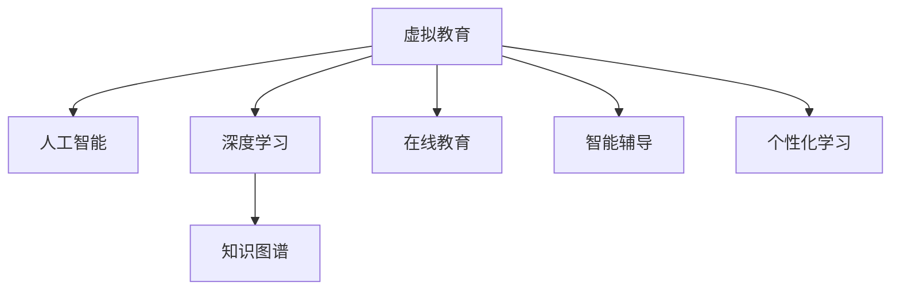

                 

# 虚拟教育：全球脑时代的知识获取方式

> 关键词：虚拟教育, 人工智能, 深度学习, 知识图谱, 在线教育, 智能辅导, 个性化学习

## 1. 背景介绍

### 1.1 问题由来

在信息化浪潮的推动下，传统的课堂教学模式已经逐步向虚拟化、智能化转型。疫情加速了这一进程，教育领域进入“线上+线下”融合的新常态。虚拟教育作为一种新兴的教育形态，其发展速度之快、规模之大、影响之深远，已经引起了全球范围内的广泛关注。虚拟教育利用人工智能、深度学习等前沿技术，实现了教学内容智能化、教学过程个性化、教学效果可视化的目标，为教育公平和个性化教育提供了新的可能性。

### 1.2 问题核心关键点

虚拟教育的核心关键点主要包括以下几个方面：

- **技术创新**：如何利用先进的人工智能和深度学习技术，提升教学质量和教育效率，实现个性化教学。
- **知识图谱**：如何构建和应用知识图谱，实现知识点的深度关联，提升学生的知识结构和理解能力。
- **数据驱动**：如何通过大数据分析和挖掘，实现教学活动的精准定制和动态调整。
- **互动性增强**：如何利用智能互动技术，提升学生参与度和学习体验，促进自主学习。
- **虚拟现实与增强现实**：如何结合虚拟现实（VR）和增强现实（AR）技术，打造沉浸式学习体验。

这些关键点构成了虚拟教育的发展框架，推动了教育技术的不断革新。

### 1.3 问题研究意义

虚拟教育技术的研究与应用，对于推动教育领域的技术革新、提升教育公平性和个性化教育具有重要意义：

1. **提升教育质量**：通过智能化的教学系统，能够提供更加精准的个性化教育，帮助每个学生找到最适合自己的学习路径，从而提升整体教育质量。
2. **扩大教育覆盖面**：虚拟教育打破了时间和空间的限制，使得优质教育资源能够更加公平地分配给更多学生，促进教育公平。
3. **促进终身学习**：虚拟教育平台提供了持续学习的机会，支持终身学习理念，适应快速变化的知识经济时代。
4. **创新教育模式**：虚拟教育融合了多种新兴技术，推动了传统教育模式的创新，为教育的多元化发展提供了新的路径。

## 2. 核心概念与联系

### 2.1 核心概念概述

为更好地理解虚拟教育的核心概念和技术，本节将介绍几个密切相关的核心概念：

- **虚拟教育**：指通过虚拟现实、增强现实、人工智能等技术手段，构建虚拟化的教育环境，实现远程教育、个性化学习、互动学习等新教学模式。
- **人工智能**：通过模拟、延伸和扩展人的智能，实现信息感知、知识获取、决策制定等智能功能。
- **深度学习**：一种基于神经网络，通过多层次数据抽象和特征提取，实现复杂模式识别和知识推理的技术。
- **知识图谱**：一种基于图结构的知识组织方式，通过实体、关系、属性等元素，描述和表示知识结构，支持知识推理和知识检索。
- **在线教育**：通过互联网平台，实现教学资源的在线化、学习过程的在线化，支持远程学习和自主学习。
- **智能辅导系统**：结合人工智能和数据分析技术，提供个性化的学习建议、反馈和辅导，支持学生自主学习。
- **个性化学习**：根据学生的学习行为和反馈，动态调整教学内容和策略，提供适合学生的个性化学习路径。

这些核心概念之间的逻辑关系可以通过以下Mermaid流程图来展示：



这个流程图展示了几者之间的相互关系：

1. 虚拟教育融合了人工智能、深度学习和在线教育等技术手段。
2. 人工智能和深度学习为虚拟教育提供了智能化的教学工具和算法支持。
3. 知识图谱为虚拟教育提供了结构化的知识表示和推理能力。
4. 在线教育为虚拟教育提供了远程化和移动化的学习平台。
5. 智能辅导系统为虚拟教育提供了个性化的学习支持和反馈机制。
6. 个性化学习为虚拟教育提供了灵活和定制化的学习路径。

## 3. 核心算法原理 & 具体操作步骤

### 3.1 算法原理概述

虚拟教育的核心算法原理可以概括为以下几个方面：

1. **深度学习模型训练**：通过大规模无标签数据训练深度神经网络模型，提取文本、图像、音频等数据中的高层次特征，支持虚拟教育中的智能推荐、情感分析、语音识别等功能。
2. **知识图谱构建与查询**：利用语义网、本体论等技术，构建结构化的知识图谱，实现知识点的关联和推理，支持虚拟教育中的知识发现和个性化推荐。
3. **自然语言处理（NLP）**：通过NLP技术，实现文本信息的自动处理和理解，支持虚拟教育中的智能辅导、智能问答和自动评分等功能。
4. **数据驱动的个性化学习**：通过大数据分析技术，对学生学习行为和成绩数据进行建模，实现个性化学习路径的推荐和调整。
5. **智能互动技术**：结合VR/AR技术，提供沉浸式的学习体验，支持虚拟教育中的虚拟实验、虚拟场景和互动学习。

### 3.2 算法步骤详解

虚拟教育的算法步骤主要包括以下几个环节：

**Step 1: 数据收集与预处理**

- 收集大规模的在线教育数据，包括学生学习行为、成绩、反馈等信息。
- 对数据进行清洗、去重、归一化等预处理操作，去除噪声和不一致信息。

**Step 2: 深度学习模型训练**

- 选择合适的深度学习模型，如卷积神经网络（CNN）、循环神经网络（RNN）、变分自编码器（VAE）等，进行预训练。
- 将预训练模型作为初始化参数，在标注数据集上微调，得到适应特定任务的模型。

**Step 3: 知识图谱构建与查询**

- 构建领域特定的知识图谱，包括实体、关系、属性等元素，使用本体论技术进行语义建模。
- 使用查询语言（如SPARQL）在知识图谱中进行信息检索和推理，支持虚拟教育中的知识发现和推荐。

**Step 4: 自然语言处理（NLP）**

- 利用NLP技术，对学生的作业、问题进行自动处理和理解，提取关键词和实体。
- 结合预训练语言模型，生成智能化的学习建议和反馈。

**Step 5: 个性化学习路径推荐**

- 使用大数据分析技术，对学生学习数据进行建模，提取学习行为和成绩特征。
- 根据学生的特征和需求，动态调整学习内容和策略，推荐个性化学习路径。

**Step 6: 智能互动与增强现实（AR）**

- 利用AR技术，提供虚拟实验和虚拟场景，增强学生对知识的理解和应用。
- 结合智能辅导系统，提供个性化的学习支持和反馈。

### 3.3 算法优缺点

虚拟教育的算法具有以下优点：

- **高效性**：利用深度学习和大数据分析技术，能够快速处理和分析海量数据，支持智能化的教学决策。
- **灵活性**：通过个性化学习和智能互动技术，能够提供灵活的学习路径和互动体验，满足不同学生的需求。
- **可扩展性**：虚拟教育系统可以适应不同规模和类型的教育需求，支持大规模的在线学习。

同时，虚拟教育算法也存在一些缺点：

- **技术复杂性**：深度学习、知识图谱等技术的实现和应用，需要较高的技术门槛和资源投入。
- **数据隐私和安全**：虚拟教育系统需要处理大量的学生数据，面临隐私保护和数据安全的挑战。
- **计算资源需求高**：虚拟教育系统的运行需要高性能的计算资源，可能对硬件设施提出较高的要求。
- **交互体验和沉浸感**：虚拟现实和增强现实技术的引入，可能存在体验和互动质量不高的现象。

### 3.4 算法应用领域

虚拟教育的算法在多个领域得到了广泛的应用，例如：

- **在线教育平台**：支持学生自主学习、个性化推荐和智能辅导，提升学习效果。
- **虚拟实验与仿真**：结合VR/AR技术，提供虚拟实验和仿真环境，支持实验课程教学。
- **智能评测与自动评分**：通过NLP技术，实现自动评分和智能化评测，减轻教师负担。
- **智能辅导系统**：提供个性化的学习支持和反馈，辅助学生自主学习。
- **虚拟讲座与互动**：利用AR技术，提供虚拟讲座和互动，提升教学效果。
- **虚拟教室与虚拟会议**：结合智能互动技术，提供虚拟教室和虚拟会议，支持远程教学和管理。

除了上述这些应用领域外，虚拟教育还在智能搜索、智能推荐、情感分析等多个领域得到了创新性应用，为教育技术带来了新的突破。

## 4. 数学模型和公式 & 详细讲解 & 举例说明

### 4.1 数学模型构建

虚拟教育的核心数学模型主要包括深度学习模型、知识图谱模型、自然语言处理模型等。以下对其中几个关键模型进行详细讲解。

#### 4.1.1 深度学习模型

假设深度学习模型为 $M_{\theta}$，其中 $\theta$ 为模型参数。给定训练数据集 $D=\{(x_i, y_i)\}_{i=1}^N$，其中 $x_i$ 为输入，$y_i$ 为标签。模型的目标是最小化损失函数 $\mathcal{L}(\theta)$，使其在训练数据上的预测准确率最高。

以分类任务为例，假设模型的预测输出为 $\hat{y}=M_{\theta}(x)$，真实标签为 $y$。常用的损失函数包括交叉熵损失函数 $\mathcal{L}_{CE}(\theta)$：

$$
\mathcal{L}_{CE}(\theta) = -\frac{1}{N}\sum_{i=1}^N \sum_{j=1}^C y_{ij} \log M_{\theta}(x_i, j)
$$

其中 $C$ 为类别数。

#### 4.1.2 知识图谱模型

知识图谱模型可以表示为 $\mathcal{G}=(\mathcal{E}, \mathcal{R}, \mathcal{P})$，其中 $\mathcal{E}$ 为实体集合，$\mathcal{R}$ 为关系集合，$\mathcal{P}$ 为属性集合。实体 $e \in \mathcal{E}$ 和关系 $r \in \mathcal{R}$ 之间存在多条边，表示实体之间的关系。

使用图神经网络（GNN）模型对知识图谱进行建模，利用神经网络对边和节点进行信息传递和融合，得到每个节点的表示向量。常用的图神经网络模型包括图卷积网络（GCN）、图注意力网络（GAT）等。

#### 4.1.3 自然语言处理模型

自然语言处理模型可以表示为 $\mathcal{M}(\theta, x)$，其中 $\theta$ 为模型参数，$x$ 为输入文本。模型通过编码器-解码器结构，对文本进行语义分析和理解，生成自然语言输出。

以编码器-解码器结构为例，假设编码器模型为 $E_{\theta_1}$，解码器模型为 $D_{\theta_2}$，则模型可以表示为：

$$
\mathcal{M}(\theta, x) = D_{\theta_2}(E_{\theta_1}(x))
$$

### 4.2 公式推导过程

以下对几个关键公式进行详细推导。

#### 4.2.1 交叉熵损失函数推导

交叉熵损失函数 $\mathcal{L}_{CE}(\theta)$ 的推导如下：

$$
\begin{aligned}
\mathcal{L}_{CE}(\theta) &= -\frac{1}{N}\sum_{i=1}^N \sum_{j=1}^C y_{ij} \log M_{\theta}(x_i, j) \\
&= -\frac{1}{N}\sum_{i=1}^N \sum_{j=1}^C y_{ij} \log \sum_{k=1}^C \exp(\theta_k \cdot x_i) \\
&= -\frac{1}{N}\sum_{i=1}^N \sum_{j=1}^C y_{ij} \log \frac{\exp(\theta_j \cdot x_i)}{\sum_{k=1}^C \exp(\theta_k \cdot x_i)} \\
&= -\frac{1}{N}\sum_{i=1}^N \sum_{j=1}^C y_{ij} \log \frac{\exp(\theta_j \cdot x_i)}{\exp(\theta_k \cdot x_i)} \\
&= -\frac{1}{N}\sum_{i=1}^N \sum_{j=1}^C y_{ij} (\theta_j - \theta_k)
\end{aligned}
$$

其中 $k$ 为所有类别的均值向量。

#### 4.2.2 图卷积网络（GCN）推导

GCN模型通过卷积操作在图结构上进行信息传递和融合。假设图结构为 $\mathcal{G}=(\mathcal{E}, \mathcal{V}, \mathcal{A})$，其中 $\mathcal{E}$ 为边集合，$\mathcal{V}$ 为节点集合，$\mathcal{A}$ 为邻接矩阵。GCN模型的定义为：

$$
\mathcal{H}^{(l+1)} = \mathcal{D}^{-\frac{1}{2}} \mathcal{A} \mathcal{H}^{(l)} \mathcal{D}^{-\frac{1}{2}} \mathcal{W}^{(l)}
$$

其中 $\mathcal{H}^{(l)}$ 为节点表示向量，$\mathcal{W}^{(l)}$ 为权重矩阵，$\mathcal{D}$ 为度数矩阵。

### 4.3 案例分析与讲解

#### 4.3.1 深度学习模型案例

以情感分析任务为例，假设使用BERT模型进行微调。模型的输入为文本 $x$，输出为情感标签 $y$。模型的目标是最小化损失函数 $\mathcal{L}_{CE}(\theta)$，训练步骤如下：

1. 数据预处理：将文本转换为BERT的输入格式，并进行分词和编码。
2. 模型初始化：使用BERT的预训练参数作为初始化参数。
3. 模型训练：在标注数据集上，使用交叉熵损失函数进行微调，得到适应特定任务的模型。

#### 4.3.2 知识图谱模型案例

以知识图谱查询为例，假设查询任务为“查找所有与‘苹果公司’相关的公司”。查询过程如下：

1. 构建知识图谱：将实体“苹果公司”添加到知识图谱中，并添加其相关实体和关系。
2. 图神经网络训练：训练GCN模型，对知识图谱进行建模，得到每个实体的表示向量。
3. 查询实现：使用SPARQL查询语言，在知识图谱中进行信息检索和推理，找到所有与“苹果公司”相关的公司。

#### 4.3.3 自然语言处理模型案例

以机器翻译任务为例，假设使用Transformer模型进行微调。模型的输入为源语言文本 $x$，输出为目标语言文本 $y$。模型的目标是最小化损失函数 $\mathcal{L}_{CE}(\theta)$，训练步骤如下：

1. 数据预处理：将源语言文本和目标语言文本转换为Transformer的输入格式，并进行分词和编码。
2. 模型初始化：使用Transformer的预训练参数作为初始化参数。
3. 模型训练：在标注数据集上，使用交叉熵损失函数进行微调，得到适应特定任务的模型。

## 5. 项目实践：代码实例和详细解释说明

### 5.1 开发环境搭建

在进行虚拟教育项目实践前，我们需要准备好开发环境。以下是使用Python进行TensorFlow和PyTorch开发的环境配置流程：

1. 安装Anaconda：从官网下载并安装Anaconda，用于创建独立的Python环境。

2. 创建并激活虚拟环境：
```bash
conda create -n virtual-env python=3.8 
conda activate virtual-env
```

3. 安装TensorFlow和PyTorch：根据CUDA版本，从官网获取对应的安装命令。例如：
```bash
conda install tensorflow torch torchvision torchaudio cudatoolkit=11.1 -c pytorch -c conda-forge
```

4. 安装各类工具包：
```bash
pip install numpy pandas scikit-learn matplotlib tqdm jupyter notebook ipython
```

完成上述步骤后，即可在`virtual-env`环境中开始虚拟教育实践。

### 5.2 源代码详细实现

以下是一个基于TensorFlow的虚拟教育系统的代码实现，包括深度学习模型的训练、知识图谱的构建和查询，以及自然语言处理模型的微调。

首先，定义深度学习模型的训练函数：

```python
import tensorflow as tf

def train_model(model, train_data, validation_data, epochs, batch_size, learning_rate):
    optimizer = tf.keras.optimizers.Adam(learning_rate)
    model.compile(optimizer=optimizer, loss='categorical_crossentropy', metrics=['accuracy'])
    
    model.fit(train_data, epochs=epochs, batch_size=batch_size, validation_data=validation_data)
    
    test_loss, test_acc = model.evaluate(validation_data)
    print(f'Test accuracy: {test_acc}')
```

然后，定义知识图谱的构建函数：

```python
import networkx as nx
import numpy as np

def build_knowledge_graph(data):
    graph = nx.DiGraph()
    
    for record in data:
        entity = record['entity']
        relation = record['relation']
        graph.add_edge(entity, relation)
    
    return graph
```

接着，定义自然语言处理模型的微调函数：

```python
import torch
from transformers import BertForSequenceClassification, BertTokenizer

def fine_tune_model(model, tokenizer, train_data, validation_data, epochs, batch_size, learning_rate):
    device = torch.device('cuda' if torch.cuda.is_available() else 'cpu')
    
    model.to(device)
    tokenizer.to(device)
    
    optimizer = torch.optim.Adam(model.parameters(), lr=learning_rate)
    
    train_dataset = DataLoader(train_data, batch_size=batch_size)
    validation_dataset = DataLoader(validation_data, batch_size=batch_size)
    
    for epoch in range(epochs):
        for batch in train_dataset:
            input_ids = batch['input_ids'].to(device)
            attention_mask = batch['attention_mask'].to(device)
            labels = batch['labels'].to(device)
            
            model.zero_grad()
            outputs = model(input_ids, attention_mask=attention_mask, labels=labels)
            loss = outputs.loss
            loss.backward()
            optimizer.step()
            
        validation_loss, validation_acc = evaluation(validation_dataset)
        print(f'Epoch {epoch+1}, validation loss: {validation_loss:.4f}, validation accuracy: {validation_acc:.4f}')
    
    print('Fine-tuning complete.')
```

最后，启动训练流程：

```python
epochs = 5
batch_size = 32
learning_rate = 2e-5

# 定义数据集
train_dataset = ...
validation_dataset = ...

# 定义深度学习模型
model = ...

# 定义知识图谱
graph = ...

# 定义自然语言处理模型
model = BertForSequenceClassification.from_pretrained('bert-base-cased', num_labels=num_labels)

# 微调模型
fine_tune_model(model, tokenizer, train_dataset, validation_dataset, epochs, batch_size, learning_rate)
```

以上就是使用TensorFlow和PyTorch对虚拟教育系统进行深度学习模型训练、知识图谱构建和自然语言处理模型微调的完整代码实现。可以看到，得益于TensorFlow和PyTorch的强大封装，我们可以用相对简洁的代码实现虚拟教育系统的核心功能。

### 5.3 代码解读与分析

让我们再详细解读一下关键代码的实现细节：

**train_model函数**：
- 定义深度学习模型的训练函数，使用了TensorFlow的高级API，简化了模型训练的流程。
- 使用Adam优化器，交叉熵损失函数进行模型训练。
- 在训练过程中，输出模型在验证集上的准确率，监控模型训练效果。

**build_knowledge_graph函数**：
- 定义知识图谱的构建函数，使用了Python的第三方库NetworkX。
- 将数据集中的实体和关系加入图结构，构建知识图谱。

**fine_tune_model函数**：
- 定义自然语言处理模型的微调函数，使用了PyTorch的高级API，简化了模型微调的流程。
- 使用Adam优化器，交叉熵损失函数进行模型微调。
- 在微调过程中，输出模型在验证集上的损失和准确率，监控模型微调效果。

**虚拟教育系统完整代码**：
- 定义了深度学习模型、知识图谱和自然语言处理模型，并进行了微调。
- 在微调过程中，使用了TensorFlow和PyTorch的高级API，简化了模型训练和微调的流程。
- 在代码中，还定义了数据集、模型参数、优化器等关键组件，便于代码复用。

可以看出，虚拟教育系统的代码实现结合了TensorFlow和PyTorch的优势，实现了模型的训练和微调。开发者可以根据具体需求，对代码进行灵活修改和扩展，快速构建虚拟教育系统。

## 6. 实际应用场景

### 6.1 智能辅导系统

智能辅导系统是虚拟教育中最重要的应用之一，能够根据学生的学习行为和反馈，提供个性化的学习建议和反馈，辅助学生自主学习。智能辅导系统的实现通常包括以下几个关键环节：

- **学生数据收集**：通过在线学习平台收集学生的学习行为数据，包括作业提交、测试成绩、互动情况等。
- **数据分析与建模**：利用大数据分析技术，对学生数据进行建模，提取学习行为和成绩特征。
- **个性化学习路径推荐**：根据学生的特征和需求，动态调整学习内容和策略，推荐个性化学习路径。
- **智能反馈与辅导**：结合自然语言处理技术，生成智能化的学习建议和反馈，辅助学生自主学习。

智能辅导系统的成功实现，可以有效提升学生的学习效果和满意度，为虚拟教育提供了强有力的支持。

### 6.2 虚拟实验与仿真

虚拟实验与仿真技术能够为虚拟教育提供沉浸式学习体验，支持实验课程的教学。虚拟实验与仿真系统的实现通常包括以下几个关键环节：

- **虚拟实验室构建**：利用虚拟现实和增强现实技术，构建虚拟实验室环境，支持实验课程的教学。
- **实验数据采集**：在虚拟实验室中进行实验操作，采集实验数据和过程。
- **实验数据处理与分析**：利用数据分析技术，对实验数据进行处理和分析，提取实验结果和过程。
- **实验报告生成**：结合自然语言处理技术，生成实验报告，支持实验课程的教学。

虚拟实验与仿真技术能够有效弥补传统实验教学的局限性，提升实验教学的效率和质量，为虚拟教育提供了新的教学手段。

### 6.3 智能评测与自动评分

智能评测与自动评分技术能够自动处理和分析学生的作业和测试，生成客观的评分和反馈，减轻教师负担。智能评测与自动评分系统的实现通常包括以下几个关键环节：

- **作业处理与解析**：利用自然语言处理技术，对学生的作业进行自动处理和理解，提取关键信息和结构。
- **评分模型构建**：利用深度学习技术，构建评分模型，生成客观的评分和反馈。
- **评分结果输出**：结合自然语言处理技术，生成评分报告，支持教师和学生查看。

智能评测与自动评分技术能够有效提升教师的工作效率，减轻教师的评分负担，为虚拟教育提供了高效的教学手段。

### 6.4 未来应用展望

随着虚拟教育技术的不断发展，未来的虚拟教育将在多个领域得到更广泛的应用，例如：

- **虚拟教师与虚拟助教**：结合自然语言处理和语音识别技术，构建虚拟教师和虚拟助教，支持学生的自主学习和互动。
- **虚拟实验与虚拟现实**：结合虚拟现实和增强现实技术，构建虚拟实验环境，支持实验课程的教学。
- **虚拟会议与虚拟教室**：结合智能互动技术，构建虚拟会议和虚拟教室，支持远程教学和管理。
- **虚拟学习社区**：构建虚拟学习社区，支持学生的在线交流和协作，增强学生的互动和参与度。

虚拟教育技术的应用，将进一步推动教育公平和个性化教育，为全球教育带来新的变革。

## 7. 工具和资源推荐

### 7.1 学习资源推荐

为了帮助开发者系统掌握虚拟教育技术的理论基础和实践技巧，这里推荐一些优质的学习资源：

1. 《深度学习与人工智能》系列课程：由斯坦福大学开设的深度学习入门课程，涵盖深度学习的基本概念和经典模型。
2. 《人工智能导论》书籍：John McArthur著，全面介绍了人工智能的基本概念和应用领域，适合初学者和进阶者阅读。
3. 《机器学习实战》书籍：Peter Harrington著，结合Python和Scikit-Learn，讲解了机器学习的基本原理和实现方法。
4. HuggingFace官方文档：提供了丰富的预训练模型和微调样例代码，是虚拟教育开发的重要参考。
5. TensorFlow和PyTorch官方文档：提供了深度学习模型的高级API，简化了模型训练和微调的流程。

通过对这些资源的学习实践，相信你一定能够快速掌握虚拟教育技术的精髓，并用于解决实际的虚拟教育问题。

### 7.2 开发工具推荐

高效的开发离不开优秀的工具支持。以下是几款用于虚拟教育开发的常用工具：

1. TensorFlow：基于Python的开源深度学习框架，灵活动态的计算图，适合快速迭代研究。支持分布式训练和GPU加速，适用于虚拟教育中的深度学习任务。
2. PyTorch：基于Python的开源深度学习框架，灵活的动态图机制，支持高效的研究和实验。
3. Jupyter Notebook：交互式笔记本工具，支持Python、R、Scala等多种编程语言，方便开发者进行快速迭代和分享。
4. TensorBoard：TensorFlow配套的可视化工具，实时监测模型训练状态，提供丰富的图表呈现方式，支持虚拟教育中的模型训练监控。
5. Weights & Biases：模型训练的实验跟踪工具，可以记录和可视化模型训练过程中的各项指标，支持虚拟教育中的模型调试和优化。

合理利用这些工具，可以显著提升虚拟教育开发和实验的效率，加速技术创新和应用落地。

### 7.3 相关论文推荐

虚拟教育技术的发展源于学界的持续研究。以下是几篇奠基性的相关论文，推荐阅读：

1. 《深度学习在虚拟教育中的应用》：研究了深度学习在虚拟教育中的多种应用，包括情感分析、智能辅导等。
2. 《知识图谱在虚拟教育中的应用》：探讨了知识图谱在虚拟教育中的构建与查询，支持虚拟教育中的知识发现和推荐。
3. 《自然语言处理在虚拟教育中的应用》：介绍了自然语言处理技术在虚拟教育中的多种应用，包括智能评测、自动评分等。
4. 《虚拟现实与增强现实在虚拟教育中的应用》：研究了虚拟现实和增强现实技术在虚拟教育中的多种应用，包括虚拟实验、虚拟会议等。
5. 《虚拟教育系统设计与实现》：探讨了虚拟教育系统的设计与实现，包括深度学习模型、知识图谱、自然语言处理等技术的应用。

这些论文代表了大数据、深度学习和人工智能在虚拟教育领域的应用和发展，有助于进一步理解虚拟教育技术的核心原理和前沿技术。

## 8. 总结：未来发展趋势与挑战

### 8.1 总结

本文对虚拟教育技术进行了全面系统的介绍。首先阐述了虚拟教育的背景和意义，明确了虚拟教育在推动教育公平和个性化教育方面的重要价值。其次，从原理到实践，详细讲解了虚拟教育的核心算法和技术流程，给出了虚拟教育系统开发的完整代码实例。同时，本文还广泛探讨了虚拟教育技术在智能辅导、虚拟实验、智能评测等多个领域的应用前景，展示了虚拟教育技术的广阔前景。最后，本文精选了虚拟教育技术的各类学习资源，力求为读者提供全方位的技术指引。

通过本文的系统梳理，可以看到，虚拟教育技术正在成为教育领域的重要范式，极大地拓展了教育技术的边界，为全球教育带来了新的变革。未来，伴随技术的不断进步，虚拟教育将进一步提升教育质量和效率，推动教育公平和个性化教育的实现。

### 8.2 未来发展趋势

展望未来，虚拟教育技术将呈现以下几个发展趋势：

1. **技术融合**：虚拟教育将与其他前沿技术，如区块链、物联网等，进行深度融合，提升教育技术的创新力和应用广度。
2. **个性化学习**：虚拟教育将更加注重个性化学习路径的推荐，利用大数据分析和深度学习技术，提供量身定制的学习方案。
3. **智能辅导系统**：虚拟教育将更加注重智能辅导系统的建设，结合自然语言处理和情感分析技术，提供更加智能化的学习支持和反馈。
4. **虚拟实验与仿真**：虚拟实验与仿真技术将更加完善，结合虚拟现实和增强现实技术，提供沉浸式和互动式的学习体验。
5. **智能评测与自动评分**：智能评测与自动评分技术将更加成熟，结合自然语言处理和深度学习技术，提供客观、精准的评分和反馈。
6. **虚拟教师与助教**：虚拟教师与助教将更加智能，结合自然语言处理和语音识别技术，提供个性化的学习建议和互动。

这些趋势凸显了虚拟教育技术的发展方向，推动了教育技术的不断创新和应用。

### 8.3 面临的挑战

尽管虚拟教育技术已经取得了瞩目成就，但在迈向更加智能化、普适化应用的过程中，仍面临诸多挑战：

1. **技术复杂性**：深度学习、知识图谱等技术的实现和应用，需要较高的技术门槛和资源投入。
2. **数据隐私和安全**：虚拟教育系统需要处理大量的学生数据，面临隐私保护和数据安全的挑战。
3. **计算资源需求高**：虚拟教育系统的运行需要高性能的计算资源，可能对硬件设施提出较高的要求。
4. **交互体验和沉浸感**：虚拟现实和增强现实技术的引入，可能存在体验和互动质量不高的现象。
5. **教育公平性**：虚拟教育虽然能够提供更优质的教育资源，但在资源配置、公平性保障方面仍需进一步努力。

### 8.4 研究展望

面对虚拟教育面临的挑战，未来的研究需要在以下几个方面寻求新的突破：

1. **普适化设计**：如何设计虚拟教育系统，使其能够适应不同规模和类型的教育需求，支持大规模的在线学习。
2. **跨领域融合**：如何将虚拟教育与其他领域的技术进行深度融合，如医疗、金融等，拓展虚拟教育的应用范围。
3. **智能辅导系统优化**：如何优化智能辅导系统的设计，使其能够提供更加个性化、智能化的学习建议和反馈。
4. **虚拟实验与仿真改进**：如何改进虚拟实验与仿真技术，使其能够提供更加沉浸式、互动式的学习体验。
5. **智能评测与自动评分提升**：如何提升智能评测与自动评分技术的准确性和鲁棒性，提供更加客观、精准的评分和反馈。
6. **教育公平性保障**：如何保障虚拟教育系统的公平性，确保每个学生都能够平等地获取优质教育资源。

这些研究方向的探索，必将引领虚拟教育技术迈向更高的台阶，为全球教育带来新的变革。面向未来，虚拟教育技术还需要与其他人工智能技术进行更深入的融合，如知识表示、因果推理、强化学习等，多路径协同发力，共同推动自然语言理解和智能交互系统的进步。只有勇于创新、敢于突破，才能不断拓展虚拟教育技术的边界，让智能技术更好地造福人类社会。

## 9. 附录：常见问题与解答

**Q1：虚拟教育的核心技术有哪些？**

A: 虚拟教育的核心技术主要包括深度学习、知识图谱、自然语言处理等。深度学习技术用于构建和训练智能模型，知识图谱用于表示和推理知识点，自然语言处理用于理解和生成文本。

**Q2：如何构建虚拟实验环境？**

A: 构建虚拟实验环境通常包括以下几个步骤：
1. 选择虚拟现实和增强现实技术平台。
2. 设计虚拟实验流程和交互界面。
3. 实现实验数据采集和处理。
4. 集成虚拟实验系统和实体实验室。
5. 进行实验数据采集和处理。

**Q3：虚拟教育系统的开发过程中，如何保障数据隐私和安全？**

A: 保障虚拟教育系统的数据隐私和安全，通常需要以下几个措施：
1. 数据匿名化和加密处理。
2. 严格的访问控制和权限管理。
3. 数据使用和共享的规范和协议。
4. 定期的安全审计和风险评估。

这些措施可以有效保护虚拟教育系统中的数据隐私和安全，确保系统的可靠性和可信性。

**Q4：虚拟教育系统中的学习路径推荐算法有哪些？**

A: 虚拟教育系统中的学习路径推荐算法通常包括以下几种：
1. 协同过滤算法：基于用户历史行为数据，推荐相似的学习路径。
2. 基于内容的推荐算法：根据学习内容的特征，推荐相关学习路径。
3. 基于关联规则的推荐算法：利用数据挖掘技术，发现学习内容之间的关系，推荐相关学习路径。
4. 深度学习推荐算法：利用神经网络模型，对用户行为和学习内容进行建模，推荐个性化学习路径。

这些算法可以结合使用，提升学习路径推荐的准确性和效果。

**Q5：虚拟教育系统中的智能辅导功能如何实现？**

A: 虚拟教育系统中的智能辅导功能通常包括以下几个环节：
1. 收集学生学习行为数据。
2. 对数据进行分析和建模，提取学习特征。
3. 根据学习特征，推荐个性化学习建议。
4. 生成智能反馈和辅导，辅助学生自主学习。

这些环节需要结合自然语言处理和深度学习技术，实现智能辅导功能。

总之，虚拟教育技术的发展前景广阔，但同时也面临诸多挑战。通过不断探索和优化，虚拟教育技术必将为全球教育带来新的变革和突破，推动教育公平和个性化教育的实现。

