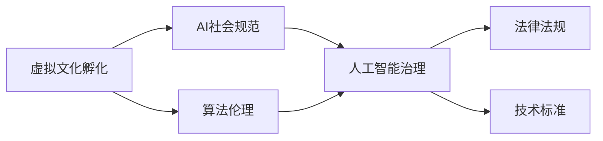

                 

# 虚拟文化孵化理论：AI塑造的新型社会规范

> 关键词：虚拟文化孵化, AI, 社会规范, 算法伦理, 人工智能治理, 数据隐私

## 1. 背景介绍

### 1.1 问题由来
随着人工智能技术的不断进步，AI在社会各个领域的广泛应用已成定势。无论是智能家居、医疗诊断，还是金融风控、工业制造，AI技术的核心都在于通过算法模型提取、处理和应用数据，实现对现实世界的模拟和预测，最终驱动决策和执行。然而，随着AI技术在社会中的角色日益凸显，其对社会文化的影响也愈发显著。如何在AI的加持下，构建符合人类价值观的虚拟文化环境，塑造和谐有序的社会规范，成为当下亟待解决的重要议题。

### 1.2 问题核心关键点
本研究聚焦于基于AI技术构建的虚拟文化环境中，如何塑造新型社会规范，以引导AI技术的健康发展，减少其潜在风险。通过分析当前AI社会规范的缺失，探索AI技术对虚拟文化孵化过程的影响，提出了一套综合性的理论框架，旨在促进AI技术与人类社会文化的良性互动，推动AI技术的可持续发展。

### 1.3 问题研究意义
研究AI技术对虚拟文化的影响及其塑造社会规范的策略，对于确保AI技术的透明性、公平性和安全性，具有重要意义：

1. **促进AI技术透明性**：透明性是社会规范的基础，通过理论框架指导AI技术的开发和应用，有助于提高算法的可解释性，使AI决策过程可追溯，增强用户信任。
2. **保障AI公平性**：AI在虚拟文化环境中应确保所有社会成员受益，避免因算法偏见导致的不公平现象。
3. **提高AI安全性**：社会规范的制定有助于识别和防范AI技术可能带来的安全风险，确保AI应用不会对社会造成损害。
4. **推动AI可持续发展**：明确的伦理准则和监管框架，有助于AI技术的长期健康发展，避免技术滥用。
5. **构建人机协同社会**：通过AI与人类文化的深度融合，形成人机协同的新型社会形态，提升社会治理效率和公民幸福感。

## 2. 核心概念与联系

### 2.1 核心概念概述

为更好地理解基于AI的虚拟文化孵化过程，我们首先阐述几个关键概念：

- **虚拟文化孵化**：指在AI技术支撑下，通过算法模型生成、传播和演化的新型文化现象。其特点在于，文化元素（如观念、价值观、行为模式等）的虚拟生成与现实应用紧密结合，形成独特的社会规范。
- **AI社会规范**：指在AI技术构建的虚拟文化环境中，形成的行为准则、价值观念和社会制度。其核心在于确保AI技术的健康应用，促进社会和谐。
- **算法伦理**：指算法开发与应用过程中的伦理问题，涉及数据隐私、算法偏见、技术责任等方面。算法伦理是制定AI社会规范的重要组成部分。
- **人工智能治理**：指在AI技术普及应用过程中，通过法律法规、政策制定和技术标准等手段，对AI技术的使用进行管理和监督，确保其符合社会规范。

这些核心概念通过如下Mermaid流程图展示其相互关系：



该流程图展示了虚拟文化孵化、AI社会规范、算法伦理与人工智能治理之间的内在联系和相互作用。虚拟文化孵化依赖于AI技术的支持，而AI社会规范的制定，需考虑算法伦理的约束，并通过人工智能治理实现规范的落地执行。

## 3. 核心算法原理 & 具体操作步骤
### 3.1 算法原理概述

基于AI技术的虚拟文化孵化过程，本质上是一个通过算法模型生成、传播和演化新型文化现象的过程。该过程包括以下几个关键步骤：

1. **数据采集与预处理**：通过传感器、互联网、社交媒体等渠道，采集社会活动数据，并进行清洗和预处理。
2. **模型训练与优化**：使用机器学习算法训练生成模型，优化模型参数，使其能够高效生成虚拟文化元素。
3. **虚拟文化传播与互动**：利用AI技术在虚拟环境中传播和互动，通过算法模型的社会反馈机制，不断调整和优化虚拟文化元素。
4. **社会规范制定与执行**：根据虚拟文化环境中的反馈数据，制定并执行社会规范，引导虚拟文化的健康发展。

### 3.2 算法步骤详解

下面详细讲解基于AI技术的虚拟文化孵化过程的算法步骤：

#### 步骤1：数据采集与预处理

1. **数据源选择**：根据研究目标，选择合适的数据源，如社交媒体、传感器数据、新闻报道等。
2. **数据清洗**：去除噪声、不完整、不一致的数据，确保数据质量。
3. **特征提取**：从数据中提取有用的特征，如文本情感、用户行为模式、社交网络结构等。
4. **数据增强**：使用数据增强技术，扩充数据集，提升模型的泛化能力。

#### 步骤2：模型训练与优化

1. **模型选择**：选择适合的算法模型，如深度神经网络、生成对抗网络（GAN）、强化学习等。
2. **模型训练**：在清洗好的数据集上，使用训练算法训练模型。
3. **参数调优**：通过交叉验证等技术，调整模型参数，提升模型性能。
4. **模型评估**：使用验证集和测试集评估模型效果，调整模型结构或训练策略。

#### 步骤3：虚拟文化传播与互动

1. **虚拟环境构建**：构建虚拟文化环境，如虚拟社区、虚拟展览等。
2. **文化元素生成**：使用训练好的模型，生成虚拟文化元素，如虚拟人物、虚拟艺术品等。
3. **文化互动**：将生成的虚拟文化元素置于虚拟环境中，让用户进行互动，收集反馈数据。
4. **文化调整**：根据用户反馈，调整和优化虚拟文化元素，形成新的文化形态。

#### 步骤4：社会规范制定与执行

1. **规范制定**：根据虚拟文化环境中的反馈数据，制定合适的社会规范，如行为准则、价值观、管理规则等。
2. **规范执行**：通过算法模型，在虚拟环境中执行社会规范，引导虚拟文化的健康发展。
3. **规范评估**：定期评估社会规范的效果，根据需要进行调整和优化。

### 3.3 算法优缺点

基于AI技术的虚拟文化孵化过程，具有以下优点：

1. **高效性**：通过算法模型，可以高效生成、传播和调整虚拟文化元素，实现文化现象的快速迭代。
2. **可控性**：AI技术能够精确控制虚拟文化元素的生成和传播过程，确保文化演化的方向符合社会规范。
3. **交互性**：用户可以通过互动反馈，参与虚拟文化元素的生成和调整，增强用户参与感和文化认同感。

同时，该方法也存在一些局限性：

1. **算法伦理挑战**：模型训练过程中可能存在数据隐私泄露、算法偏见等问题，需要仔细考虑算法伦理。
2. **文化多样性不足**：虚拟文化孵化过程可能忽视现实文化的多样性和复杂性，导致文化同质化。
3. **社会规范执行难度**：制定和执行社会规范需要复杂的算法设计和系统架构，存在一定的技术难度。

### 3.4 算法应用领域

基于AI技术的虚拟文化孵化过程，在多个领域具有广泛应用前景，例如：

1. **虚拟旅游**：通过AI技术生成虚拟旅游景点、虚拟导游，为用户提供沉浸式旅游体验。
2. **虚拟艺术**：利用生成模型生成虚拟艺术品，推动艺术创作和展览方式的变革。
3. **虚拟教育**：构建虚拟教育平台，使用AI技术生成个性化学习内容，提升教育效果。
4. **虚拟社交**：创建虚拟社交社区，使用AI技术生成虚拟人物和对话内容，增强用户互动体验。
5. **虚拟医疗**：利用AI技术生成虚拟医疗场景和教学材料，提升医疗教育和培训效果。

## 4. 数学模型和公式 & 详细讲解 & 举例说明（备注：数学公式请使用latex格式，latex嵌入文中独立段落使用 $$，段落内使用 $)
### 4.1 数学模型构建

我们以虚拟文化孵化过程为例，构建数学模型：

设虚拟文化环境中的文化元素数量为 $N$，每个元素在虚拟环境中的影响力为 $I$。文化元素 $i$ 对用户行为 $B$ 的影响为 $F_i$，则虚拟文化孵化过程的数学模型为：

$$
\begin{aligned}
    &F_i = \sum_{j=1}^{N} A_{ij} \cdot I_j \\
    &I_i = F_i + \delta_i \\
    &B = \sum_{i=1}^{N} \alpha_i \cdot I_i
\end{aligned}
$$

其中，$A$ 为文化元素之间的相互作用矩阵，$\delta_i$ 为随机扰动项，$\alpha_i$ 为元素 $i$ 对用户行为的影响权重。

### 4.2 公式推导过程

将上述模型简化，得到用户行为 $B$ 的预测公式：

$$
B = \sum_{i=1}^{N} \alpha_i \cdot \left(\sum_{j=1}^{N} A_{ij} \cdot I_j + \delta_i \right)
$$

进一步推导，得到：

$$
B = \sum_{i=1}^{N} \alpha_i \cdot \delta_i + \sum_{i,j=1}^{N} \alpha_i \cdot A_{ij} \cdot I_j
$$

可以看出，用户行为 $B$ 不仅受到随机扰动项 $\delta_i$ 的影响，还受到文化元素 $i$ 与其他文化元素 $j$ 的相互作用 $A_{ij} \cdot I_j$ 的影响。通过调整文化元素的影响力和相互作用矩阵，可以实现对用户行为的精确预测和调控。

### 4.3 案例分析与讲解

以虚拟旅游为例，展示虚拟文化孵化过程的模型应用：

1. **数据采集**：采集用户对虚拟旅游景点的评价、反馈数据。
2. **模型训练**：使用机器学习算法训练生成模型，预测用户对虚拟景点的偏好。
3. **文化元素生成**：根据用户偏好，生成虚拟旅游景点、虚拟导游等文化元素。
4. **文化互动**：用户与虚拟景点互动，反馈评价数据。
5. **文化调整**：根据用户反馈，调整和优化虚拟文化元素，形成新的虚拟旅游环境。

## 5. 项目实践：代码实例和详细解释说明
### 5.1 开发环境搭建

在进行虚拟文化孵化过程的项目实践前，我们需要准备好开发环境。以下是使用Python进行PyTorch开发的环境配置流程：

1. 安装Anaconda：从官网下载并安装Anaconda，用于创建独立的Python环境。

2. 创建并激活虚拟环境：
```bash
conda create -n virtual_culture python=3.8 
conda activate virtual_culture
```

3. 安装PyTorch：根据CUDA版本，从官网获取对应的安装命令。例如：
```bash
conda install pytorch torchvision torchaudio cudatoolkit=11.1 -c pytorch -c conda-forge
```

4. 安装Transformers库：
```bash
pip install transformers
```

5. 安装各类工具包：
```bash
pip install numpy pandas scikit-learn matplotlib tqdm jupyter notebook ipython
```

完成上述步骤后，即可在`virtual_culture`环境中开始项目实践。

### 5.2 源代码详细实现

下面以虚拟旅游项目为例，给出使用Transformers库进行虚拟文化元素生成的PyTorch代码实现。

首先，定义虚拟旅游景点数据的处理函数：

```python
from transformers import BertTokenizer
from torch.utils.data import Dataset
import torch

class TouristAttractionDataset(Dataset):
    def __init__(self, attractions, user_feedbacks, tokenizer, max_len=128):
        self.attractions = attractions
        self.user_feedbacks = user_feedbacks
        self.tokenizer = tokenizer
        self.max_len = max_len
        
    def __len__(self):
        return len(self.attractions)
    
    def __getitem__(self, item):
        attraction = self.attractions[item]
        feedback = self.user_feedbacks[item]
        
        encoding = self.tokenizer(attraction, return_tensors='pt', max_length=self.max_len, padding='max_length', truncation=True)
        input_ids = encoding['input_ids'][0]
        attention_mask = encoding['attention_mask'][0]
        
        # 对用户反馈进行编码
        encoded_feedback = [feedback2id[feedback] for feedback in feedback] 
        encoded_feedback.extend([feedback2id['neutral']] * (self.max_len - len(encoded_feedback)))
        labels = torch.tensor(encoded_feedback, dtype=torch.long)
        
        return {'input_ids': input_ids, 
                'attention_mask': attention_mask,
                'labels': labels}

# 反馈与id的映射
feedback2id = {'positive': 1, 'negative': 0, 'neutral': 2}
id2feedback = {v: k for k, v in feedback2id.items()}

# 创建dataset
tokenizer = BertTokenizer.from_pretrained('bert-base-cased')

train_dataset = TouristAttractionDataset(train_attractions, train_feedbacks, tokenizer)
dev_dataset = TouristAttractionDataset(dev_attractions, dev_feedbacks, tokenizer)
test_dataset = TouristAttractionDataset(test_attractions, test_feedbacks, tokenizer)
```

然后，定义模型和优化器：

```python
from transformers import BertForTokenClassification, AdamW

model = BertForTokenClassification.from_pretrained('bert-base-cased', num_labels=len(feedback2id))

optimizer = AdamW(model.parameters(), lr=2e-5)
```

接着，定义训练和评估函数：

```python
from torch.utils.data import DataLoader
from tqdm import tqdm
from sklearn.metrics import classification_report

device = torch.device('cuda') if torch.cuda.is_available() else torch.device('cpu')
model.to(device)

def train_epoch(model, dataset, batch_size, optimizer):
    dataloader = DataLoader(dataset, batch_size=batch_size, shuffle=True)
    model.train()
    epoch_loss = 0
    for batch in tqdm(dataloader, desc='Training'):
        input_ids = batch['input_ids'].to(device)
        attention_mask = batch['attention_mask'].to(device)
        labels = batch['labels'].to(device)
        model.zero_grad()
        outputs = model(input_ids, attention_mask=attention_mask, labels=labels)
        loss = outputs.loss
        epoch_loss += loss.item()
        loss.backward()
        optimizer.step()
    return epoch_loss / len(dataloader)

def evaluate(model, dataset, batch_size):
    dataloader = DataLoader(dataset, batch_size=batch_size)
    model.eval()
    preds, labels = [], []
    with torch.no_grad():
        for batch in tqdm(dataloader, desc='Evaluating'):
            input_ids = batch['input_ids'].to(device)
            attention_mask = batch['attention_mask'].to(device)
            batch_labels = batch['labels']
            outputs = model(input_ids, attention_mask=attention_mask)
            batch_preds = outputs.logits.argmax(dim=2).to('cpu').tolist()
            batch_labels = batch_labels.to('cpu').tolist()
            for pred_tokens, label_tokens in zip(batch_preds, batch_labels):
                pred_feedback = [id2feedback[_id] for _id in pred_tokens]
                label_feedback = [id2feedback[_id] for _id in label_tokens]
                preds.append(pred_feedback[:len(label_feedback)])
                labels.append(label_feedback)
                
    print(classification_report(labels, preds))
```

最后，启动训练流程并在测试集上评估：

```python
epochs = 5
batch_size = 16

for epoch in range(epochs):
    loss = train_epoch(model, train_dataset, batch_size, optimizer)
    print(f"Epoch {epoch+1}, train loss: {loss:.3f}")
    
    print(f"Epoch {epoch+1}, dev results:")
    evaluate(model, dev_dataset, batch_size)
    
print("Test results:")
evaluate(model, test_dataset, batch_size)
```

以上就是使用PyTorch对虚拟旅游景点进行虚拟文化元素生成的完整代码实现。可以看到，借助Transformers库，我们可以用相对简洁的代码完成虚拟文化元素生成的过程。

### 5.3 代码解读与分析

让我们再详细解读一下关键代码的实现细节：

**TouristAttractionDataset类**：
- `__init__`方法：初始化虚拟旅游景点、用户反馈、分词器等关键组件。
- `__len__`方法：返回数据集的样本数量。
- `__getitem__`方法：对单个样本进行处理，将景点输入编码为token ids，将用户反馈编码为数字，并对其进行定长padding，最终返回模型所需的输入。

**反馈2id和id2feedback字典**：
- 定义了用户反馈与数字id之间的映射关系，用于将token-wise的预测结果解码回真实反馈。

**训练和评估函数**：
- 使用PyTorch的DataLoader对数据集进行批次化加载，供模型训练和推理使用。
- 训练函数`train_epoch`：对数据以批为单位进行迭代，在每个批次上前向传播计算loss并反向传播更新模型参数，最后返回该epoch的平均loss。
- 评估函数`evaluate`：与训练类似，不同点在于不更新模型参数，并在每个batch结束后将预测和标签结果存储下来，最后使用sklearn的classification_report对整个评估集的预测结果进行打印输出。

**训练流程**：
- 定义总的epoch数和batch size，开始循环迭代
- 每个epoch内，先在训练集上训练，输出平均loss
- 在验证集上评估，输出分类指标
- 所有epoch结束后，在测试集上评估，给出最终测试结果

可以看到，PyTorch配合Transformers库使得虚拟文化元素生成的代码实现变得简洁高效。开发者可以将更多精力放在数据处理、模型改进等高层逻辑上，而不必过多关注底层的实现细节。

当然，工业级的系统实现还需考虑更多因素，如模型的保存和部署、超参数的自动搜索、更灵活的任务适配层等。但核心的虚拟文化孵化过程基本与此类似。

## 6. 实际应用场景
### 6.1 智能客服系统

基于虚拟文化孵化过程的智能客服系统，通过AI技术生成虚拟客服人员和对话内容，为用户提供高效的互动体验。虚拟客服系统可以24小时不间断服务，快速响应客户咨询，同时根据用户反馈不断优化对话模型，提升服务质量。

在技术实现上，可以收集企业内部的历史客服对话记录，将问题-回答对作为虚拟文化元素，训练生成模型生成虚拟客服人员。通过多轮对话历史作为上下文，微调模型进行回复生成。对于客户提出的新问题，还可以接入检索系统实时搜索相关内容，动态组织生成回答。如此构建的智能客服系统，能大幅提升客户咨询体验和问题解决效率。

### 6.2 金融舆情监测

金融机构需要实时监测市场舆论动向，以便及时应对负面信息传播，规避金融风险。传统的人工监测方式成本高、效率低，难以应对网络时代海量信息爆发的挑战。基于虚拟文化孵化过程的文本分类和情感分析技术，为金融舆情监测提供了新的解决方案。

具体而言，可以收集金融领域相关的新闻、报道、评论等文本数据，并对其进行主题标注和情感标注。在此基础上对预训练语言模型进行微调，使其能够自动判断文本属于何种主题，情感倾向是正面、中性还是负面。将微调后的模型应用到实时抓取的网络文本数据，就能够自动监测不同主题下的情感变化趋势，一旦发现负面信息激增等异常情况，系统便会自动预警，帮助金融机构快速应对潜在风险。

### 6.3 个性化推荐系统

当前的推荐系统往往只依赖用户的历史行为数据进行物品推荐，无法深入理解用户的真实兴趣偏好。基于虚拟文化孵化过程的个性化推荐系统，通过AI技术生成虚拟推荐内容，推动推荐方式向更加个性化、多样化的方向发展。

在实践中，可以收集用户浏览、点击、评论、分享等行为数据，提取和用户交互的物品标题、描述、标签等文本内容。将文本内容作为模型输入，用户的后续行为（如是否点击、购买等）作为监督信号，在此基础上微调预训练语言模型。微调后的模型能够从文本内容中准确把握用户的兴趣点。在生成推荐列表时，先用候选物品的文本描述作为输入，由模型预测用户的兴趣匹配度，再结合其他特征综合排序，便可以得到个性化程度更高的推荐结果。

### 6.4 未来应用展望

随着虚拟文化孵化过程的不断演进，AI技术与人类社会文化的融合将更加紧密，塑造的新型社会规范也将更加符合人类价值观。

在智慧医疗领域，基于虚拟文化孵化过程的医疗问答、病历分析、药物研发等应用将提升医疗服务的智能化水平，辅助医生诊疗，加速新药开发进程。

在智能教育领域，虚拟文化孵化过程可应用于作业批改、学情分析、知识推荐等方面，因材施教，促进教育公平，提高教学质量。

在智慧城市治理中，虚拟文化孵化过程可应用于城市事件监测、舆情分析、应急指挥等环节，提高城市管理的自动化和智能化水平，构建更安全、高效的未来城市。

此外，在企业生产、社会治理、文娱传媒等众多领域，基于虚拟文化孵化过程的人工智能应用也将不断涌现，为经济社会发展注入新的动力。相信随着技术的日益成熟，虚拟文化孵化过程必将在构建人机协同的智能时代中扮演越来越重要的角色。

## 7. 工具和资源推荐
### 7.1 学习资源推荐

为了帮助开发者系统掌握虚拟文化孵化过程的理论基础和实践技巧，这里推荐一些优质的学习资源：

1. 《Transformer从原理到实践》系列博文：由大模型技术专家撰写，深入浅出地介绍了Transformer原理、BERT模型、虚拟文化孵化过程等前沿话题。

2. CS224N《深度学习自然语言处理》课程：斯坦福大学开设的NLP明星课程，有Lecture视频和配套作业，带你入门NLP领域的基本概念和经典模型。

3. 《Natural Language Processing with Transformers》书籍：Transformers库的作者所著，全面介绍了如何使用Transformers库进行NLP任务开发，包括虚拟文化孵化过程在内的诸多范式。

4. HuggingFace官方文档：Transformers库的官方文档，提供了海量预训练模型和完整的虚拟文化孵化过程样例代码，是上手实践的必备资料。

5. CLUE开源项目：中文语言理解测评基准，涵盖大量不同类型的中文NLP数据集，并提供了基于虚拟文化孵化过程的baseline模型，助力中文NLP技术发展。

通过对这些资源的学习实践，相信你一定能够快速掌握虚拟文化孵化过程的精髓，并用于解决实际的NLP问题。
### 7.2 开发工具推荐

高效的开发离不开优秀的工具支持。以下是几款用于虚拟文化孵化过程开发的常用工具：

1. PyTorch：基于Python的开源深度学习框架，灵活动态的计算图，适合快速迭代研究。大部分预训练语言模型都有PyTorch版本的实现。

2. TensorFlow：由Google主导开发的开源深度学习框架，生产部署方便，适合大规模工程应用。同样有丰富的预训练语言模型资源。

3. Transformers库：HuggingFace开发的NLP工具库，集成了众多SOTA语言模型，支持PyTorch和TensorFlow，是进行虚拟文化孵化过程开发的利器。

4. Weights & Biases：模型训练的实验跟踪工具，可以记录和可视化模型训练过程中的各项指标，方便对比和调优。与主流深度学习框架无缝集成。

5. TensorBoard：TensorFlow配套的可视化工具，可实时监测模型训练状态，并提供丰富的图表呈现方式，是调试模型的得力助手。

6. Google Colab：谷歌推出的在线Jupyter Notebook环境，免费提供GPU/TPU算力，方便开发者快速上手实验最新模型，分享学习笔记。

合理利用这些工具，可以显著提升虚拟文化孵化过程的开发效率，加快创新迭代的步伐。

### 7.3 相关论文推荐

虚拟文化孵化过程的发展源于学界的持续研究。以下是几篇奠基性的相关论文，推荐阅读：

1. Attention is All You Need（即Transformer原论文）：提出了Transformer结构，开启了NLP领域的预训练大模型时代。

2. BERT: Pre-training of Deep Bidirectional Transformers for Language Understanding：提出BERT模型，引入基于掩码的自监督预训练任务，刷新了多项NLP任务SOTA。

3. Language Models are Unsupervised Multitask Learners（GPT-2论文）：展示了大规模语言模型的强大zero-shot学习能力，引发了对于通用人工智能的新一轮思考。

4. Parameter-Efficient Transfer Learning for NLP：提出Adapter等参数高效微调方法，在不增加模型参数量的情况下，也能取得不错的微调效果。

5. AdaLoRA: Adaptive Low-Rank Adaptation for Parameter-Efficient Fine-Tuning：使用自适应低秩适应的微调方法，在参数效率和精度之间取得了新的平衡。

这些论文代表了大语言模型微调技术的发展脉络。通过学习这些前沿成果，可以帮助研究者把握学科前进方向，激发更多的创新灵感。

## 8. 总结：未来发展趋势与挑战

### 8.1 总结

本文对基于AI技术的虚拟文化孵化过程进行了全面系统的介绍。首先阐述了虚拟文化孵化过程的定义、原理和应用背景，明确了其在构建新型社会规范中的重要性。其次，从理论到实践，详细讲解了虚拟文化孵化过程的算法步骤和关键模型，给出了虚拟文化孵化过程的完整代码实例。同时，本文还广泛探讨了虚拟文化孵化过程在智能客服、金融舆情、个性化推荐等多个行业领域的应用前景，展示了其巨大的应用潜力。此外，本文精选了虚拟文化孵化过程的学习资源、开发工具和相关论文，力求为读者提供全方位的技术指引。

通过本文的系统梳理，可以看到，虚拟文化孵化过程作为一种基于AI技术的社会规范塑造手段，正在成为推动AI技术落地应用的重要方向。它不仅能够大幅提升NLP系统的智能化水平，还为构建和谐有序的社会规范提供了新的思路和方法。未来，随着虚拟文化孵化过程的不断演进，其对社会文化的影响将愈发深远，人类社会将进入人机协同的新时代。

### 8.2 未来发展趋势

展望未来，虚拟文化孵化过程将呈现以下几个发展趋势：

1. **算法伦理的不断提升**：算法伦理将成为虚拟文化孵化过程的重要组成部分，通过引入伦理导向的算法设计，确保虚拟文化环境的公正性、透明性和安全性。
2. **多模态融合技术的发展**：虚拟文化孵化过程将逐步融合视觉、听觉等多模态信息，增强对复杂现实世界的理解和模拟。
3. **个性化推荐技术的深化**：基于虚拟文化孵化过程的个性化推荐系统将更加精准，通过深度学习和强化学习等技术，实现个性化推荐与用户行为预测的有机结合。
4. **跨领域应用的拓展**：虚拟文化孵化过程将在更多领域得到应用，如智能教育、智慧医疗、社会治理等，为各行业提供新的解决方案。
5. **社交机器人技术的突破**：虚拟文化孵化过程将推动社交机器人技术的发展，使虚拟社交体验更加自然、智能，提升人际互动的质量和效率。
6. **社会规范的动态调整**：虚拟文化孵化过程将实现社会规范的动态调整，通过实时反馈和优化，确保虚拟文化环境的健康发展。

这些趋势凸显了虚拟文化孵化过程的广阔前景，其将深刻影响未来社会文化的演进方向，成为构建新型社会规范的重要力量。

### 8.3 面临的挑战

尽管虚拟文化孵化过程在社会规范塑造方面具有巨大的潜力，但其发展过程中也面临诸多挑战：

1. **数据隐私保护**：在虚拟文化孵化过程中，需要收集和处理大量个人数据，如何保护用户隐私，避免数据泄露，是一个重要问题。
2. **算法公平性**：虚拟文化孵化过程可能存在算法偏见，导致不同群体在虚拟文化环境中的体验差异，需要仔细考虑算法公平性。
3. **技术鲁棒性**：虚拟文化孵化过程需要高度鲁棒的技术架构，确保模型在不同环境下的稳定性和可靠性。
4. **用户接受度**：虚拟文化孵化过程需要得到用户的广泛接受和支持，否则无法在社会中推广应用。
5. **法律法规挑战**：虚拟文化孵化过程涉及众多法律法规问题，如何制定合理的法律法规框架，确保技术应用的合法性，是急需解决的难题。
6. **伦理道德问题**：虚拟文化孵化过程中可能出现伦理道德问题，如技术滥用、内容生成不当等，需要建立完善的伦理监管机制。

这些挑战需要多学科、多领域的协同努力，才能确保虚拟文化孵化过程的健康发展，为构建新型社会规范提供坚实的技术保障。

### 8.4 研究展望

未来，虚拟文化孵化过程的研究需要关注以下几个方向：

1. **多模态融合技术**：研究多模态数据在虚拟文化孵化过程中的融合方式，提升对现实世界的理解和模拟能力。
2. **跨领域应用**：研究虚拟文化孵化过程在不同领域的应用，推动各行业的创新发展。
3. **动态社会规范**：研究如何实现虚拟文化环境中的动态社会规范，通过实时反馈和优化，确保虚拟文化环境的健康发展。
4. **隐私保护技术**：研究高效的数据保护和隐私保护技术，确保用户数据的安全和隐私。
5. **算法公平性**：研究如何消除算法偏见，确保虚拟文化环境的公平性和公正性。
6. **社会规范制定**：研究虚拟文化环境中的社会规范制定方法，确保社会规范的科学性和合理性。

这些研究方向将有助于进一步推动虚拟文化孵化过程的发展，为构建和谐有序的社会规范提供技术支撑。通过持续的探索和实践，相信虚拟文化孵化过程必将在未来社会中发挥更加重要的作用，为人类文明的进步做出更大贡献。

## 9. 附录：常见问题与解答

**Q1：虚拟文化孵化过程中如何保护用户隐私？**

A: 保护用户隐私是虚拟文化孵化过程中的重要课题。可以采用以下策略：

1. **数据匿名化**：对用户数据进行匿名化处理，确保数据中的个人身份信息无法被识别。
2. **差分隐私技术**：通过添加噪声或限制查询范围，保护用户数据不被滥用。
3. **用户控制**：让用户控制数据的使用方式，如授权、拒绝等，增强用户隐私保护意识。

**Q2：如何确保虚拟文化孵化过程中的算法公平性？**

A: 确保虚拟文化孵化过程中的算法公平性，需要从数据、算法和模型等多个层面进行考虑：

1. **数据公平性**：确保数据集的多样性和代表性，避免数据偏差。
2. **算法公平性**：使用公平性约束的算法模型，如公平分类算法，避免算法偏见。
3. **模型公平性**：通过评估指标，如公平性差异、敏感性分析等，监测模型的公平性。

**Q3：虚拟文化孵化过程面临的最大挑战是什么？**

A: 虚拟文化孵化过程面临的最大挑战是数据隐私保护和技术伦理问题。

1. **数据隐私保护**：在虚拟文化孵化过程中，需要收集和处理大量个人数据，如何保护用户隐私，避免数据泄露，是一个重要问题。
2. **技术伦理问题**：虚拟文化孵化过程中可能出现伦理道德问题，如技术滥用、内容生成不当等，需要建立完善的伦理监管机制。

**Q4：虚拟文化孵化过程中如何选择合适的网络模型？**

A: 选择合适的网络模型是虚拟文化孵化过程成功的关键。需要考虑以下几个因素：

1. **模型复杂度**：根据数据量和任务需求，选择复杂度适中的模型，避免过拟合或欠拟合。
2. **模型效率**：考虑模型的推理速度和内存占用，确保模型在实际应用中高效运行。
3. **模型可解释性**：选择具有良好可解释性的模型，便于理解和优化。

**Q5：虚拟文化孵化过程中如何进行模型调优？**

A: 模型调优是虚拟文化孵化过程中不可或缺的步骤。可以采用以下策略：

1. **超参数调优**：通过网格搜索、随机搜索等方法，调整模型的超参数，寻找最优参数组合。
2. **模型集成**：使用模型集成技术，如Bagging、Boosting等，提升模型的泛化能力和鲁棒性。
3. **迁移学习**：利用已有预训练模型，进行微调或迁移学习，快速提升模型性能。

这些策略需根据具体任务和数据特点进行灵活选择，以确保模型在虚拟文化孵化过程中达到最佳性能。

---

作者：禅与计算机程序设计艺术 / Zen and the Art of Computer Programming

