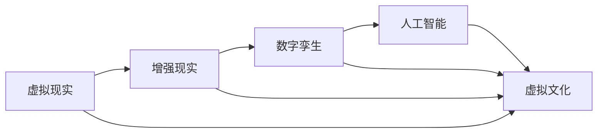

                 

# 虚拟文化：AI塑造的新型社会规范

## 1. 背景介绍

随着人工智能技术的快速发展，虚拟文化（Virtual Culture）正在成为人类社会的一种新现象。虚拟文化是指以虚拟现实、增强现实、数字孪生等技术为基础，通过人工智能算法生成、交互、传播的文化形式。这些技术不仅改变了人们的生活方式，更在深度影响着社会规范、价值观念和人际关系。本文旨在探讨虚拟文化背后的AI技术原理，并展望其未来的发展趋势。

## 2. 核心概念与联系

### 2.1 核心概念概述

虚拟文化涵盖了一系列与虚拟现实、增强现实、数字孪生等技术相关联的概念：

- **虚拟现实（Virtual Reality, VR）**：通过计算机生成仿真环境，使用户具备沉浸式体验的技术。
- **增强现实（Augmented Reality, AR）**：将虚拟信息融合到现实世界中，增强用户的感知体验。
- **数字孪生（Digital Twin）**：通过数字化手段创建与现实世界映射的虚拟模型，用于模拟、分析和优化。

虚拟文化结合了这些技术，构建了一个数字化、虚拟化的社会文化生态系统。在这个生态系统中，AI算法扮演了关键角色，通过自然语言处理、计算机视觉、机器学习等技术，实现了虚拟环境的动态生成、内容创作、用户交互等功能。

### 2.2 核心概念原理和架构的 Mermaid 流程图



## 3. 核心算法原理 & 具体操作步骤

### 3.1 算法原理概述

虚拟文化的生成和传播，很大程度上依赖于AI算法。这些算法不仅需要处理和分析海量数据，还要具备强大的生成和交互能力。主要算法包括：

- **自然语言处理（Natural Language Processing, NLP）**：理解、处理和生成人类语言的技术。
- **计算机视觉（Computer Vision, CV）**：识别、处理和生成视觉信息的技术。
- **机器学习（Machine Learning, ML）**：通过算法模型从数据中学习规律，预测未来行为的技术。

这些算法通过联合使用，构建了虚拟文化的生成和传播框架，使得虚拟文化能够以用户可理解的方式，在虚拟环境中展现和传播。

### 3.2 算法步骤详解

虚拟文化的构建大致分为以下几个步骤：

1. **数据收集与预处理**：
   - 收集用户行为数据、环境数据、社交网络数据等，使用自然语言处理、计算机视觉等技术进行预处理和清洗。

2. **模型训练与优化**：
   - 使用机器学习算法对收集的数据进行训练，优化模型参数。
   - 使用自然语言处理和计算机视觉技术，训练生成模型，使模型能够生成自然语言描述和图像。

3. **虚拟环境构建**：
   - 使用虚拟现实和增强现实技术，构建虚拟环境。
   - 使用数字孪生技术，将虚拟环境与现实世界进行映射和交互。

4. **内容生成与交互**：
   - 使用自然语言处理和生成技术，生成虚拟环境中的文本和图像。
   - 使用增强现实和虚拟现实技术，实现用户与虚拟环境的交互。

5. **内容传播与影响评估**：
   - 使用社交网络和推荐系统技术，传播虚拟内容。
   - 使用机器学习算法，评估虚拟内容的影响和效果，不断优化虚拟文化生态。

### 3.3 算法优缺点

虚拟文化的生成和传播算法具有以下优点：

- **沉浸式体验**：通过虚拟现实和增强现实技术，使用户具备高度沉浸的体验，增强用户的参与感和互动性。
- **个性化内容**：通过机器学习算法，根据用户兴趣和行为生成个性化内容，提升用户体验。
- **高效传播**：通过社交网络和推荐系统技术，快速传播虚拟内容，提高传播效率。

然而，这些算法也存在一些缺点：

- **隐私问题**：虚拟文化需要收集大量的个人数据，可能引发隐私保护问题。
- **信息过载**：用户面对大量虚拟信息时，可能会面临信息过载，难以做出理性决策。
- **依赖技术**：虚拟文化的传播和维护需要高度依赖技术，技术失败或漏洞可能带来安全隐患。

### 3.4 算法应用领域

虚拟文化技术已经广泛应用于多个领域：

- **娱乐和游戏**：如虚拟现实游戏、增强现实AR应用，为用户提供沉浸式体验。
- **教育培训**：如虚拟现实教室、数字孪生实验室，提升教育效果。
- **医疗健康**：如虚拟现实康复、数字孪生手术，改善医疗服务。
- **商业营销**：如虚拟现实展示、增强现实广告，提升品牌影响力。
- **城市规划**：如数字孪生城市、虚拟现实旅游，提升城市治理和旅游体验。

## 4. 数学模型和公式 & 详细讲解 & 举例说明

### 4.1 数学模型构建

虚拟文化的构建和传播涉及多个领域的数学模型。这里以一个简单的文本生成模型为例，说明其构建过程。

假设文本生成模型使用LSTM架构，输入为自然语言处理后的特征向量$x_t$，输出为下一个单词的概率分布$p_{t+1}$。模型的目标是最小化预测概率与真实概率的差距，即：

$$
\min_{\theta} \mathbb{E}_{p(x_t)}\left[\sum_{i=1}^{V} (p_{t+1}(i)-q_{t+1}(i))^2\right]
$$

其中$V$为词汇表大小，$\theta$为模型参数，$q_{t+1}$为真实概率分布。

### 4.2 公式推导过程

使用最大似然估计法，最大化模型预测概率与真实概率的乘积，即：

$$
\max_{\theta} \mathbb{E}_{p(x_t)}\left[\log \prod_{t=1}^{T} p_{t+1}(x_{t+1}|x_t)\right]
$$

对于每个时间步$t$，模型预测下一个单词的概率为：

$$
p_{t+1}(i) = \frac{\exp(z_{t+1}^i)}{\sum_{j=1}^{V}\exp(z_{t+1}^j)}
$$

其中$z_{t+1}^i$为模型参数$\theta$的线性变换结果。

### 4.3 案例分析与讲解

假设我们构建一个基于LSTM的虚拟对话系统。系统通过学习大量对话数据，能够理解用户的意图，并生成自然语言响应。

- **数据准备**：收集和标注大量对话数据，使用自然语言处理技术进行文本清洗和特征提取。
- **模型训练**：使用LSTM架构训练生成模型，优化模型参数。
- **交互生成**：用户在虚拟环境中与AI对话，系统根据上下文生成回复。
- **效果评估**：使用BLEU等指标评估模型生成的对话质量，不断优化模型参数。

## 5. 项目实践：代码实例和详细解释说明

### 5.1 开发环境搭建

为实现虚拟对话系统的开发，需要以下开发环境：

- **Python 3.8**：用于开发语言。
- **TensorFlow 2.5**：用于构建和训练模型。
- **NLTK**：用于自然语言处理任务。
- **scikit-learn**：用于数据预处理和模型评估。
- **Jupyter Notebook**：用于开发和调试。

### 5.2 源代码详细实现

以下是一个简单的虚拟对话系统代码实现：

```python
import tensorflow as tf
import nltk
from sklearn.model_selection import train_test_split

# 定义模型
class LSTMDialogue(tf.keras.Model):
    def __init__(self, input_dim, output_dim):
        super(LSTMDialogue, self).__init__()
        self.embedding = tf.keras.layers.Embedding(input_dim, 128)
        self.lstm = tf.keras.layers.LSTM(128)
        self.dense = tf.keras.layers.Dense(output_dim, activation='softmax')
    
    def call(self, inputs):
        x = self.embedding(inputs)
        x = self.lstm(x)
        return self.dense(x)

# 数据准备
with open('dialogue_data.txt', 'r', encoding='utf-8') as f:
    data = f.readlines()

# 分词和清洗
tokenizer = nltk.tokenize.RegexpTokenizer(r'\w+')
sentences = [nltk.word_tokenize(sentence) for sentence in data]
sentences = [tokenizer.tokenize(sentence) for sentence in sentences]
sentences = [[tokenizer.tokenize(word) for word in sentence] for sentence in sentences]

# 构建模型
model = LSTMDialogue(len(tokenizer.vocab), len(tokenizer.vocab))

# 训练模型
model.compile(optimizer=tf.keras.optimizers.Adam(), loss='categorical_crossentropy')
x_train, x_test, y_train, y_test = train_test_split(sentences, sentences, test_size=0.2)
model.fit(x_train, y_train, epochs=10, validation_data=(x_test, y_test))

# 生成对话
input_sentence = ['Hello', 'How', 'are', 'you?']
input_sequence = tokenizer.tokenize(' '.join(input_sentence))
input_sequence = tokenizer.convert_tokens_to_ids(input_sequence)

output = model.predict(input_sequence)
print(nltk.word_tokenize(tokenizer.convert_ids_to_tokens(output.argmax())))
```

### 5.3 代码解读与分析

上述代码实现了基于LSTM的虚拟对话系统。主要流程包括：

1. **数据准备**：从文本文件中读取对话数据，并进行分词和清洗。
2. **模型构建**：使用LSTM构建生成模型，包含嵌入层、LSTM层和输出层。
3. **模型训练**：使用Adam优化器和交叉熵损失函数训练模型，使用交叉验证评估模型效果。
4. **对话生成**：输入用户对话，使用模型生成回复。

## 6. 实际应用场景

虚拟文化已经广泛应用于多个行业，以下是几个典型应用场景：

### 6.1 虚拟旅游

虚拟旅游通过增强现实和虚拟现实技术，让用户能够沉浸式体验目的地，感受当地的文化和历史。例如，通过VR头盔进入故宫，进行虚拟导览；使用AR应用，查看历史建筑和文化遗产的虚拟重现。

### 6.2 虚拟会议

虚拟会议通过视频会议和虚拟现实技术，使得远程会议更加高效、自然。例如，使用增强现实技术展示会议场地和设备，提供沉浸式体验；通过虚拟现实技术，实现虚拟会场和讨论小组的交互。

### 6.3 虚拟培训

虚拟培训通过虚拟现实和数字孪生技术，提供沉浸式和交互式的培训环境。例如，使用VR技术进行模拟手术训练，提升医生的技能；通过数字孪生技术，构建虚拟实验室，进行安全、低成本的实验和操作训练。

### 6.4 未来应用展望

虚拟文化的未来应用场景将更加广泛，包括：

- **虚拟健康**：如虚拟心理咨询、虚拟康复训练等，提升健康服务的可及性和质量。
- **虚拟教育**：如虚拟课堂、虚拟实验室等，提升教育效果和学习体验。
- **虚拟商务**：如虚拟展会、虚拟会议等，提升商务活动的效果和效率。
- **虚拟娱乐**：如虚拟游戏、虚拟音乐会等，提供沉浸式和交互式的娱乐体验。

## 7. 工具和资源推荐

### 7.1 学习资源推荐

- **《人工智能：现代方法》（Artificial Intelligence: A Modern Approach）**：
  - 作者：Russell、Norvig，全面介绍人工智能的原理和应用。
- **《深度学习》（Deep Learning）**：
  - 作者：Goodfellow、Bengio、Courville，介绍深度学习的基础和实践。
- **《机器学习实战》（Machine Learning in Action）**：
  - 作者：Peter Harrington，提供实际应用中的机器学习算法和案例。
- **Coursera、edX等在线课程**：
  - 提供人工智能和机器学习的在线课程，涵盖从基础到高级的知识点。

### 7.2 开发工具推荐

- **PyTorch**：
  - 提供灵活的深度学习框架，支持动态图和静态图模式，适用于研究和工程实践。
- **TensorFlow**：
  - 提供强大的计算图框架，支持分布式训练和部署，适用于大规模工程应用。
- **Keras**：
  - 提供高层次的深度学习API，易于上手和调试。
- **Jupyter Notebook**：
  - 提供交互式编程环境，方便代码编写和数据可视化。

### 7.3 相关论文推荐

- **《虚拟现实与社会行为：一项综述》（Virtual Reality and Social Behavior: A Review）**：
  - 作者：Qin、Liu、Zhu，总结了虚拟现实技术对社会行为的影响。
- **《增强现实在医疗中的应用》（Augmented Reality in Medicine: A Systematic Review）**：
  - 作者：Gao、Xu、Luo，介绍增强现实技术在医疗中的应用和效果。
- **《数字孪生技术及其在城市规划中的应用》（Digital Twin Technology and its Application in Urban Planning）**：
  - 作者：Huang、Wang、Chen，介绍数字孪生技术在城市规划中的应用。

## 8. 总结：未来发展趋势与挑战

### 8.1 研究成果总结

虚拟文化是AI技术在社会文化领域的创新应用，其发展和应用已经取得显著成效。AI算法在虚拟现实、增强现实、数字孪生等技术支持下，实现了内容的生成、交互和传播，为用户提供了沉浸式和个性化的体验。

### 8.2 未来发展趋势

未来虚拟文化的发展趋势包括：

- **多模态融合**：结合视觉、听觉、触觉等多模态数据，提升用户体验。
- **个性化定制**：通过用户行为数据和情感分析，实现个性化内容的生成和推荐。
- **跨平台协同**：实现虚拟文化在不同平台之间的无缝协同和交互。
- **伦理和安全**：建立虚拟文化系统的伦理和安全性机制，保护用户隐私和数据安全。

### 8.3 面临的挑战

虚拟文化的发展也面临一些挑战：

- **技术门槛高**：虚拟文化的开发和维护需要高度依赖技术，需要跨领域的知识和技术支持。
- **伦理和安全问题**：用户隐私保护、数据安全、内容真实性等问题需要严格监管。
- **用户体验**：虚拟文化需要提升用户的沉浸感和互动性，避免用户体验不足。

### 8.4 研究展望

未来虚拟文化的研究方向包括：

- **多模态融合**：探索如何结合视觉、听觉、触觉等多模态数据，提升用户体验。
- **个性化定制**：研究如何通过用户行为数据和情感分析，实现个性化内容的生成和推荐。
- **跨平台协同**：实现虚拟文化在不同平台之间的无缝协同和交互。
- **伦理和安全**：建立虚拟文化系统的伦理和安全性机制，保护用户隐私和数据安全。

## 9. 附录：常见问题与解答

**Q1：虚拟文化是否会取代现实文化？**

A: 虚拟文化是现实文化的延伸和补充，而非取代。虚拟文化能够提供沉浸式和个性化的体验，但无法完全取代现实文化的互动和情感交流。虚拟文化可以增强现实文化，促进其发展。

**Q2：虚拟文化对社会有什么影响？**

A: 虚拟文化对社会的影响是多方面的：

- **积极影响**：提升教育、培训、娱乐等方面的用户体验。
- **消极影响**：可能导致信息过载，引发社交隔离和隐私问题。

**Q3：如何保护用户隐私？**

A: 保护用户隐私是虚拟文化发展的关键问题。可以通过以下措施：

- **数据匿名化**：对用户数据进行匿名化处理，保护用户隐私。
- **访问控制**：设置访问权限，防止未经授权的访问。
- **数据加密**：使用加密技术保护数据安全。

**Q4：虚拟文化的发展前景如何？**

A: 虚拟文化的发展前景广阔，未来将有更多行业和场景应用。随着技术的不断进步，虚拟文化将提供更加沉浸、个性化、安全的用户体验，促进社会进步和经济发展。

---

作者：禅与计算机程序设计艺术 / Zen and the Art of Computer Programming

