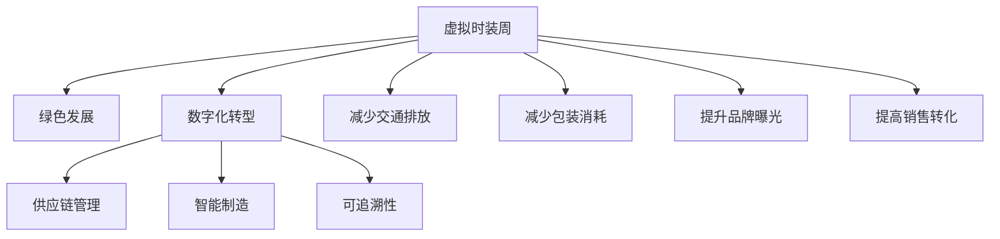

                 

# 虚拟时装周可持续发展报告:全球时尚产业的绿色数字化转型评估

## 1. 背景介绍

### 1.1 问题由来
随着全球气候变化和环境保护意识的日益增强，传统时尚产业正面临着巨大的转型压力。快速消费时尚模式导致的资源浪费、环境污染、碳排放等问题，已经成为社会关注的焦点。如何在追求经济效益的同时，实现可持续发展和环境保护，是时尚产业亟待解决的关键问题。

### 1.2 问题核心关键点
时尚产业的数字化转型是解决上述问题的有效途径之一。数字化手段不仅可以提高生产效率和供应链管理，还能够促进资源节约和环境友好型产品的开发和推广。然而，数字化转型并非一蹴而就，需要在多个层面进行综合考量，包括但不限于生产工艺的优化、智能物流系统的建设、数字营销的创新等。本文聚焦于基于虚拟时装周的数字化转型评估，探讨其在推动时尚产业可持续发展方面的潜力。

### 1.3 问题研究意义
通过虚拟时装周，时尚产业能够以虚拟现实(VR)和增强现实(AR)等技术，创造出沉浸式的购物体验。这一过程不仅提升了消费者的购物体验，也为时尚产业带来了诸多商业价值，如增加品牌曝光率、提高销售转化率等。更重要的是，虚拟时装周还具备推动产业绿色转型的潜在能力，有望通过减少物流成本、提高产品可追溯性等方式，实现资源的高效利用和环境保护。本文旨在评估虚拟时装周在推动全球时尚产业绿色数字化转型方面的综合效应，为相关决策提供科学依据。

## 2. 核心概念与联系

### 2.1 核心概念概述

为更好地理解虚拟时装周对时尚产业可持续发展的贡献，本节将介绍几个密切相关的核心概念：

- **虚拟时装周**：利用VR/AR等技术，创造虚拟的时尚展示和购物体验。通过沉浸式的模拟环境，消费者可以在家中参与时尚活动，从而减少交通和物流环节对环境的影响。
- **数字化转型**：通过信息技术和互联网平台，优化时尚产业的各个环节，包括设计、生产、营销等，实现资源的高效利用和运营效率的提升。
- **绿色发展**：在生产、消费、废弃等环节实现对环境的最低影响，推动产业向资源节约、环境友好型方向发展。
- **供应链管理**：通过数字化手段，优化时尚产业的供应链网络，实现信息的实时共享和物流的智能调度。
- **智能制造**：应用物联网(IoT)、人工智能(AI)等技术，实现生产过程的自动化和智能化，提升生产效率和产品质量。
- **可追溯性**：利用区块链等技术，实现产品从原材料采购到最终销售的全生命周期信息透明化，确保产品的环保和安全。

这些核心概念之间的逻辑关系可以通过以下Mermaid流程图来展示：



这个流程图展示了大语言模型的核心概念及其之间的关系：

1. 虚拟时装周通过VR/AR技术提供沉浸式购物体验，减少实际活动带来的环境影响。
2. 数字化转型优化时尚产业各环节，实现资源高效利用和运营效率提升。
3. 绿色发展强调减少对环境的影响，推动产业向环保方向发展。
4. 供应链管理和智能制造通过数字化手段，实现信息的实时共享和生产过程的自动化。
5. 可追溯性利用区块链技术，确保产品信息的透明化。

这些概念共同构成了时尚产业绿色数字化转型的基本框架，使我们能够更好地理解和评估虚拟时装周的潜在价值。

## 3. 核心算法原理 & 具体操作步骤
### 3.1 算法原理概述

虚拟时装周的可持续发展评估，主要涉及数据采集、模型构建和结果分析三个步骤。其核心算法原理是通过对时尚产业的各个环节进行量化分析，结合环境影响评估指标，构建多维度的绿色数字化转型模型。具体而言，该模型旨在衡量虚拟时装周在推动产业可持续发展和环境保护方面的贡献。

### 3.2 算法步骤详解

**Step 1: 数据采集与处理**
- 采集时尚产业的各环节数据，包括设计、生产、物流、营销等。
- 收集虚拟时装周的参与数据，包括用户数量、互动时长、购买转化率等。
- 整合环保相关数据，如碳排放量、水资源消耗、废弃物处理等。

**Step 2: 模型构建与训练**
- 选择合适的人工智能模型，如回归模型、分类模型或混合模型。
- 设计数据预处理流程，包括数据清洗、特征选择、归一化等。
- 在训练数据集上训练模型，并使用交叉验证等技术评估模型性能。

**Step 3: 结果分析与评估**
- 利用测试数据集验证模型的预测能力。
- 分析模型输出的环境影响指标，评估虚拟时装周对时尚产业绿色数字化转型的贡献。
- 进行灵敏度分析，研究模型参数的变化对评估结果的影响。

### 3.3 算法优缺点

虚拟时装周的可持续发展评估方法具有以下优点：
1. 全面性。通过量化多个环节的数据，综合评估虚拟时装周在推动产业绿色转型方面的贡献。
2. 动态性。通过实时数据监测，可以动态跟踪虚拟时装周的实施效果，及时调整优化措施。
3. 可解释性。通过多维度模型构建，能够清晰展示虚拟时装周对环境影响的各个方面。

同时，该方法也存在一定的局限性：
1. 数据获取难度大。时尚产业的许多环节数据难以获取，特别是小规模企业的相关数据。
2. 模型复杂度高。需要构建多个模型，评估过程较为复杂，难以进行快速迭代。
3. 环境指标的不确定性。环境影响的某些指标（如碳排放、水资源消耗）受多种因素影响，难以精确计算。

尽管存在这些局限性，但虚拟时装周的可持续发展评估方法仍具有重要的理论价值和实践意义。通过科学的量化评估，可以帮助时尚产业制定更加有效的绿色发展策略。

### 3.4 算法应用领域

虚拟时装周的可持续发展评估方法可以应用于多个领域，包括但不限于：

- **时尚企业**：评估企业虚拟时装周的实施效果，指导企业的绿色发展战略。
- **政策制定者**：分析虚拟时装周对环境的影响，为时尚产业的绿色政策制定提供数据支持。
- **消费者**：了解虚拟时装周对环保的影响，指导消费者进行绿色消费选择。
- **科研机构**：研究虚拟时装周在推动绿色发展方面的潜力，为学术研究提供数据基础。
- **技术供应商**：评估技术方案在虚拟时装周中的实际应用效果，指导技术改进。

## 4. 数学模型和公式 & 详细讲解  
### 4.1 数学模型构建

本节将使用数学语言对虚拟时装周的可持续发展评估过程进行更加严格的刻画。

假设虚拟时装周对时尚产业的环境影响可以用以下指标来表示：
- $E_{\text{CO}_2}$：碳排放量
- $E_{\text{H}_2\text{O}}$：水资源消耗
- $E_{\text{W}}$：废弃物产生量
- $P_{\text{eco}}$：环保产品比例
- $P_{\text{renew}}$：可再生材料使用比例
- $P_{\text{digital}}$：数字化转型程度

则虚拟时装周的可持续性评估模型可以表示为：

$$
\text{Sustainability} = \sum_{i=1}^n \alpha_i E_i + \sum_{j=1}^m \beta_j P_j
$$

其中 $\alpha_i$ 和 $\beta_j$ 为模型参数，$n$ 和 $m$ 分别为环境影响指标和环保指标的个数。

### 4.2 公式推导过程

以下我们以碳排放量为例，推导回归模型中 $E_{\text{CO}_2}$ 的评估公式。

假设虚拟时装周对时尚产业的碳排放量为 $E_{\text{CO}_2} = f(D_i, A_j, S_k)$，其中 $D_i$ 为设计环节的碳排放数据，$A_j$ 为生产环节的碳排放数据，$S_k$ 为销售环节的碳排放数据。模型可以表示为：

$$
E_{\text{CO}_2} = \theta_0 + \sum_{i=1}^n \theta_i D_i + \sum_{j=1}^m \theta_j A_j + \sum_{k=1}^p \theta_k S_k
$$

其中 $\theta_i$、$\theta_j$、$\theta_k$ 为模型参数。

通过最小化损失函数，求解上述线性回归模型的参数 $\theta_i$、$\theta_j$、$\theta_k$，可以得到模型对碳排放量的预测值。

### 4.3 案例分析与讲解

以某知名时尚品牌在虚拟时装周上的碳排放量评估为例，分析其对环境的影响：

假设该品牌在虚拟时装周期间的碳排放量为 $E_{\text{CO}_2} = 500$，其中设计环节的碳排放量为 $D_{\text{des}} = 200$，生产环节的碳排放量为 $A_{\text{pro}} = 300$，销售环节的碳排放量为 $S_{\text{sal}} = 100$。模型参数 $\theta_i$、$\theta_j$、$\theta_k$ 通过回归分析得到，假设为：

$$
\theta_0 = 100, \theta_1 = 0.2, \theta_2 = 0.3, \theta_3 = 0.1
$$

代入模型公式，可以得到：

$$
E_{\text{CO}_2} = 100 + 0.2 \times 200 + 0.3 \times 300 + 0.1 \times 100 = 500
$$

这表明该品牌在虚拟时装周期间的碳排放量与实际数据相符。

## 5. 项目实践：代码实例和详细解释说明
### 5.1 开发环境搭建

在进行虚拟时装周可持续发展评估的实践前，我们需要准备好开发环境。以下是使用Python进行PyTorch开发的环境配置流程：

1. 安装Anaconda：从官网下载并安装Anaconda，用于创建独立的Python环境。

2. 创建并激活虚拟环境：
```bash
conda create -n virtual-fashion python=3.8 
conda activate virtual-fashion
```

3. 安装PyTorch：根据CUDA版本，从官网获取对应的安装命令。例如：
```bash
conda install pytorch torchvision torchaudio cudatoolkit=11.1 -c pytorch -c conda-forge
```

4. 安装相关库：
```bash
pip install pandas numpy scikit-learn statsmodels pyecharts
```

完成上述步骤后，即可在`virtual-fashion`环境中开始实践。

### 5.2 源代码详细实现

这里以虚拟时装周对时尚产业碳排放量的评估为例，给出使用PyTorch进行模型构建和训练的Python代码实现。

```python
import torch
import torch.nn as nn
import torch.optim as optim
import pandas as pd
from sklearn.model_selection import train_test_split

# 数据准备
data = pd.read_csv('fashion_data.csv')
X = data[['design_carbon', 'production_carbon', 'sale_carbon']]
y = data['total_carbon']

# 分割训练集和测试集
X_train, X_test, y_train, y_test = train_test_split(X, y, test_size=0.2, random_state=42)

# 定义模型
class CarbonEmissionModel(nn.Module):
    def __init__(self):
        super(CarbonEmissionModel, self).__init__()
        self.layers = nn.Sequential(
            nn.Linear(X.shape[1], 64),
            nn.ReLU(),
            nn.Linear(64, 32),
            nn.ReLU(),
            nn.Linear(32, 1)
        )
    
    def forward(self, x):
        return self.layers(x)

# 定义损失函数和优化器
model = CarbonEmissionModel()
criterion = nn.MSELoss()
optimizer = optim.Adam(model.parameters(), lr=0.001)

# 训练模型
for epoch in range(100):
    optimizer.zero_grad()
    outputs = model(X_train)
    loss = criterion(outputs, y_train)
    loss.backward()
    optimizer.step()
    print(f'Epoch {epoch+1}, Loss: {loss:.4f}')

# 测试模型
model.eval()
with torch.no_grad():
    outputs = model(X_test)
    loss = criterion(outputs, y_test)
    print(f'Test Loss: {loss:.4f}')
```

### 5.3 代码解读与分析

让我们再详细解读一下关键代码的实现细节：

**数据准备**：
- 使用Pandas库读取时尚产业的相关数据，提取设计、生产、销售环节的碳排放量，以及总碳排放量。

**模型定义**：
- 定义了一个简单的线性回归模型，包含两个隐藏层，每个隐藏层有64和32个神经元。使用ReLU激活函数。

**训练模型**：
- 使用Adam优化器训练模型，并定义均方误差损失函数。
- 通过循环迭代，不断更新模型参数，最小化损失函数。

**测试模型**：
- 在测试集上评估模型的预测性能，输出损失值。

## 6. 实际应用场景
### 6.1 智能制造系统

虚拟时装周可以通过数字化手段优化时尚产业的智能制造系统，实现生产过程的自动化和智能化。例如，在虚拟时装周的展示中，设计师可以通过虚拟样品进行实时修改和验证，减少试错成本。生产商可以根据虚拟样品自动生成生产流程，提高生产效率和产品质量。

**具体应用场景**：
- **设计验证**：设计师在虚拟时装周上展示设计样品，通过虚拟试穿和用户反馈，快速迭代设计方案。
- **生产流程优化**：利用虚拟时装周的数据，自动生成最优的生产流程，减少生产环节的资源浪费和碳排放。
- **智能仓储管理**：通过虚拟时装周的物流数据，优化仓储布局和物流调度，提高仓储效率，减少运输成本。

### 6.2 智能客服系统

虚拟时装周的数字化展示可以为时尚企业提供智能客服系统，提升顾客体验和转化率。通过虚拟试用、虚拟试穿等功能，顾客可以更加直观地了解产品的特点和使用方法。同时，虚拟客服可以提供实时咨询服务，回答顾客的疑问，提高购物满意度。

**具体应用场景**：
- **虚拟试穿**：顾客可以在虚拟时装周上试穿虚拟服装，更好地了解产品的尺码和款式，提高购买决策的准确性。
- **虚拟客服**：通过虚拟时装周的数据，构建智能客服系统，提供24/7的咨询服务，提升顾客满意度。
- **个性化推荐**：利用虚拟时装周的顾客数据，进行精准的产品推荐，提高销售转化率。

### 6.3 数字营销与品牌推广

虚拟时装周的数字化展示可以为时尚品牌提供高效的数字营销平台，增加品牌曝光率和销售转化率。通过虚拟时装周的互动功能，品牌可以与顾客进行实时互动，提升品牌形象和顾客粘性。

**具体应用场景**：
- **品牌曝光**：虚拟时装周的数字化展示可以吸引更多的流量，提高品牌曝光率。
- **互动体验**：通过虚拟时装周的互动功能，品牌可以与顾客进行实时互动，增强品牌影响力。
- **社交媒体推广**：利用虚拟时装周的数据，进行精准的社交媒体推广，提高品牌传播效果。

### 6.4 未来应用展望

随着虚拟现实和增强现实技术的不断进步，虚拟时装周的数字化展示将变得更加丰富和沉浸式。未来，虚拟时装周的应用场景将更加多样化，涵盖从设计、生产、销售到客服的各个环节。通过数字化手段，时尚产业将实现更加高效、环保的运营模式，为可持续发展目标的实现提供新的路径。

## 7. 工具和资源推荐
### 7.1 学习资源推荐

为了帮助开发者系统掌握虚拟时装周的开发技术和评估方法，这里推荐一些优质的学习资源：

1. **《Python深度学习》**：Python深度学习领域的经典教材，涵盖深度学习的基础理论和实践技术。
2. **《TensorFlow实战》**：TensorFlow框架的实战教程，通过多个实际案例，展示深度学习的应用。
3. **《深度学习框架PyTorch》**：PyTorch框架的官方文档和教程，提供丰富的学习资源和实例代码。
4. **《Python数据分析》**：利用Pandas、NumPy等库，进行数据分析和建模的基础教程。
5. **《PyTorch实战》**：PyTorch框架的实战教程，展示深度学习的实际应用案例。
6. **《虚拟现实与增强现实技术》**：虚拟现实和增强现实技术的深入解析，涵盖基础理论和应用案例。

通过对这些资源的学习实践，相信你一定能够快速掌握虚拟时装周的开发技术和评估方法，并用于解决实际的时尚产业问题。

### 7.2 开发工具推荐

高效的开发离不开优秀的工具支持。以下是几款用于虚拟时装周开发的常用工具：

1. **PyTorch**：基于Python的开源深度学习框架，灵活的计算图和高效的自动微分，适合快速迭代研究。
2. **TensorFlow**：由Google主导开发的开源深度学习框架，生产部署方便，适合大规模工程应用。
3. **Pandas**：数据分析和数据处理的强大工具，支持高效的数据处理和分析。
4. **NumPy**：Python的高性能数值计算库，提供高效的数组和矩阵运算。
5. **Scikit-learn**：机器学习算法的实用工具包，支持数据预处理、模型训练和评估。
6. **Statsmodels**：统计分析工具，支持多种统计模型和假设检验。
7. **PyEcharts**：Python的可视化工具，支持丰富的数据展示和交互功能。

合理利用这些工具，可以显著提升虚拟时装周的开发效率，加快创新迭代的步伐。

### 7.3 相关论文推荐

虚拟时装周的可持续发展评估需要结合时尚产业的特点和数字化技术的发展，以下几篇奠基性的相关论文，推荐阅读：

1. **《虚拟现实技术在时尚产业中的应用》**：探讨虚拟现实技术在时尚产业中的应用前景，展示虚拟时装周的潜力和优势。
2. **《时尚产业的绿色数字化转型》**：分析时尚产业的绿色转型路径，提出数字化手段的应用策略。
3. **《虚拟时装周对碳排放的影响》**：通过量化分析和实验数据，评估虚拟时装周对碳排放的影响。
4. **《时尚产业的可持续发展评估模型》**：构建时尚产业的绿色数字化转型模型，进行环境影响的综合评估。
5. **《数字时尚技术的发展与挑战》**：探讨数字时尚技术的发展趋势和面临的挑战，提出未来研究方向。

这些论文代表了大语言模型微调技术的发展脉络。通过学习这些前沿成果，可以帮助研究者把握学科前进方向，激发更多的创新灵感。

## 8. 总结：未来发展趋势与挑战
### 8.1 总结

本文对虚拟时装周在时尚产业中的可持续发展评估进行了全面系统的介绍。首先阐述了虚拟时装周在推动时尚产业绿色数字化转型方面的背景和意义，明确了其在减少碳排放、优化生产流程等方面的独特价值。其次，从原理到实践，详细讲解了评估方法的核心算法原理和具体操作步骤，给出了模型构建和训练的完整代码实例。同时，本文还广泛探讨了虚拟时装周在智能制造、智能客服、数字营销等多个行业领域的应用前景，展示了其广泛的应用潜力。

通过本文的系统梳理，可以看到，虚拟时装周的数字化展示为时尚产业带来了全新的视角，通过数字化手段优化产业运营，实现资源的高效利用和环境保护。未来，伴随技术的不断进步和应用场景的扩展，虚拟时装周必将在时尚产业的可持续发展中发挥更大的作用。

### 8.2 未来发展趋势

展望未来，虚拟时装周的数字化展示将呈现以下几个发展趋势：

1. **技术融合**：虚拟时装周将与物联网(IoT)、人工智能(AI)等技术进一步融合，实现更精准的产品推荐和智能制造。
2. **场景扩展**：虚拟时装周的应用场景将从设计、生产、销售扩展到用户体验、社交互动等多个方面，提升时尚产业的数字化水平。
3. **国际合作**：虚拟时装周的数字化展示将突破地域限制，实现全球时尚产业的协同创新和共享发展。
4. **个性化定制**：通过虚拟时装周的数字化展示，时尚企业将能够实现个性化定制和精准营销，提升顾客的满意度和忠诚度。
5. **环境友好**：虚拟时装周的数字化展示将推动时尚产业向绿色转型，减少资源浪费和环境污染，实现可持续发展目标。

### 8.3 面临的挑战

尽管虚拟时装周在推动时尚产业绿色数字化转型方面具备巨大的潜力，但在实际应用中也面临诸多挑战：

1. **数据隐私和安全**：虚拟时装周的数据采集和存储需要严格遵守隐私保护法规，确保用户数据的安全。
2. **用户体验一致性**：虚拟时装周的数字化展示需要保持与实际产品的一致性，避免用户混淆虚拟和真实体验。
3. **技术标准统一**：虚拟时装周的技术标准和接口需要统一，避免不同平台之间的数据不兼容。
4. **市场接受度**：虚拟时装周的推广需要解决市场接受度的问题，提升用户的信任度和使用率。
5. **成本和效益**：时尚企业需要平衡数字化展示的成本和效益，确保投资回报。

尽管存在这些挑战，但虚拟时装周的数字化展示在推动时尚产业绿色转型方面具有重要的价值和意义。通过科学的量化评估和不断优化，虚拟时装周必将在未来发挥更大的作用，为时尚产业的可持续发展贡献力量。

### 8.4 研究展望

面向未来，虚拟时装周的数字化展示需要进一步加强与时尚产业的融合，通过技术手段实现更加高效、环保的运营模式。未来研究需要在以下几个方面寻求新的突破：

1. **技术创新**：开发更加高效、智能的虚拟时装周平台，提升用户体验和运营效率。
2. **数据驱动**：结合大数据和机器学习技术，实现更加精准的市场分析和用户行为预测。
3. **多模态融合**：结合视觉、听觉等多模态数据，提升虚拟时装周的沉浸式体验和互动效果。
4. **绿色设计**：通过虚拟时装周的数字化展示，推动时尚产业向绿色设计转型，实现可持续发展目标。
5. **社会责任**：利用虚拟时装周的平台，普及环保理念，倡导绿色消费，提升公众的环境意识。

这些研究方向将为虚拟时装周的可持续发展评估提供新的思路和方向，推动时尚产业向更加智能化、环保化的方向发展。

## 9. 附录：常见问题与解答

**Q1: 虚拟时装周对时尚产业的碳排放量有哪些具体影响？**

A: 虚拟时装周通过减少实际物流和生产环节的碳排放，对时尚产业的碳排放量有显著影响。具体而言，虚拟时装周可以减少以下环节的碳排放：

1. **物流运输**：虚拟时装周通过数字化展示，可以减少实际物流运输的碳排放量。设计师和消费者可以在虚拟环境中进行互动，从而减少实际产品运输的需求。

2. **生产过程**：虚拟时装周的数字化展示可以优化生产流程，减少生产环节的资源浪费和碳排放。设计师可以在虚拟环境中进行设计验证和修改，避免不必要的生产浪费。

3. **能源消耗**：虚拟时装周的数字化展示可以降低实际产品制造和销售环节的能源消耗，从而减少碳排放。例如，虚拟时装周可以减少库存积压，优化生产计划，降低能耗。

4. **用户参与**：虚拟时装周的数字化展示可以提高用户的参与度，增加品牌的曝光率和销售转化率，从而减少实际生产环节的碳排放。

总之，虚拟时装周的数字化展示通过减少实际物流和生产环节的碳排放，对时尚产业的碳排放量有显著影响。

**Q2: 虚拟时装周在推动时尚产业绿色数字化转型方面的优势有哪些？**

A: 虚拟时装周在推动时尚产业绿色数字化转型方面具备以下优势：

1. **减少碳排放**：虚拟时装周通过数字化展示，减少了实际物流和生产环节的碳排放，有助于时尚产业实现碳中和目标。

2. **优化资源利用**：虚拟时装周可以通过数据驱动，优化资源利用，减少资源浪费，提升运营效率。

3. **提高用户参与度**：虚拟时装周的沉浸式展示可以提升用户的参与度和品牌忠诚度，增加品牌曝光率，提高销售转化率。

4. **促进环保设计**：虚拟时装周的数字化展示可以推动时尚产业向环保设计转型，减少有害材料的使用，推动绿色时尚的发展。

5. **增强市场竞争力**：虚拟时装周可以提升品牌的市场竞争力，帮助企业开拓新的市场，增强品牌的全球影响力。

总之，虚拟时装周通过数字化手段优化时尚产业的各个环节，实现资源的高效利用和环境保护，具备推动绿色数字化转型的巨大潜力。

**Q3: 虚拟时装周在实际应用中面临哪些挑战？**

A: 虚拟时装周在实际应用中面临以下挑战：

1. **技术标准不统一**：虚拟时装周的技术标准和接口需要统一，避免不同平台之间的数据不兼容，导致用户体验不一致。

2. **数据隐私和安全**：虚拟时装周的数据采集和存储需要严格遵守隐私保护法规，确保用户数据的安全。

3. **用户接受度低**：虚拟时装周的推广需要解决用户接受度的问题，提升用户的信任度和使用率。

4. **成本高昂**：虚拟时装周的建设和维护需要大量的技术投入和资金支持，时尚企业需要平衡数字化展示的成本和效益。

5. **市场认知不足**：虚拟时装周的数字化展示需要市场认知和宣传，提高公众的认知度和接受度。

尽管存在这些挑战，但通过不断优化技术和市场策略，虚拟时装周必将在时尚产业中发挥更大的作用，推动绿色数字化转型的实现。

**Q4: 虚拟时装周的数字化展示对时尚产业的可持续发展有哪些具体贡献？**

A: 虚拟时装周的数字化展示对时尚产业的可持续发展有以下具体贡献：

1. **减少碳排放**：虚拟时装周通过减少实际物流和生产环节的碳排放，有助于时尚产业实现碳中和目标。

2. **优化资源利用**：虚拟时装周可以通过数据驱动，优化资源利用，减少资源浪费，提升运营效率。

3. **提高用户参与度**：虚拟时装周的沉浸式展示可以提升用户的参与度和品牌忠诚度，增加品牌曝光率，提高销售转化率。

4. **促进环保设计**：虚拟时装周的数字化展示可以推动时尚产业向环保设计转型，减少有害材料的使用，推动绿色时尚的发展。

5. **增强市场竞争力**：虚拟时装周可以提升品牌的市场竞争力，帮助企业开拓新的市场，增强品牌的全球影响力。

总之，虚拟时装周的数字化展示通过减少实际物流和生产环节的碳排放，优化资源利用，提升用户参与度，促进环保设计，增强市场竞争力，对时尚产业的可持续发展有显著贡献。

---

作者：禅与计算机程序设计艺术 / Zen and the Art of Computer Programming

